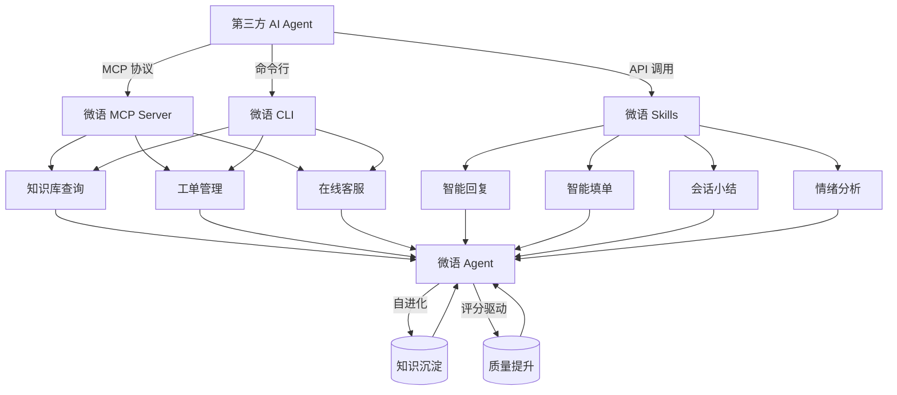

微语 3.x 版本的核心升级方向已经非常清晰：**聚焦 Agent，构建以智能体为中心的下一代客服平台**。

这是一次产品形态的跃迁——从"功能驱动的客服工具"走向"Agent 驱动的业务平台"。

本文将围绕三个问题展开：

- 微语 3.x 的 Agent 路线图是什么？
- MCP/CLI/Skills 模块如何赋能第三方 Agent？
- 如何让 AI 更方便地使用微语？

<!-- truncate -->

## 一、微语 3.x Agent 路线图：五步进化

微语 3.x 将 Agent 能力建设分为五个递进阶段，环环相扣，逐步形成智能体自成长的飞轮效应。

### 第一阶段：Agent 接待 —— 让 Agent 成为客服第一入口

在微语现有机器人基础上，Agent 接待不再是简单的关键词匹配或 FAQ 检索，而是具备以下能力：

- **多轮上下文理解**：准确追踪用户意图，不会在多轮对话中"失忆"
- **意图识别与分类**：自动判断用户是咨询、投诉、售后还是其他场景
- **情绪感知**：实时识别用户情绪变化，在负面情绪升级前主动安抚或转人工
- **主动引导**：不仅仅是回答问题，更能引导用户完成复杂的业务流程

这一阶段的目标是：让 Agent 真正成为合格的"数字员工"，能够独立处理 70% 以上的标准服务场景。

### 第二阶段：Agent 评分 —— 建立可量化的质量体系

有了接待能力之后，必须有评价体系来衡量 Agent 的工作质量。微语将建设多维度的 Agent 评价模型：

- **自动评价维度**：回答准确率、问题解决率、响应速度、用户满意度
- **人工复核机制**：定期抽样人工评价，校准自动评分的偏差
- **失败样本标记**：自动识别并标记 Agent 处理失败的会话，供后续优化
- **评分看板**：为管理员提供 Agent 质量趋势、薄弱环节分析

评分不仅是考核工具，更是驱动 Agent 进化的核心数据源。

### 第三阶段：Agent 完善知识库 —— 构建持续学习的知识底座

Agent 的能力上限，很大程度上取决于知识库的质量。微语 3.x 将知识库从"静态文档管理"升级为"动态知识引擎"：

- **自动知识沉淀**：从高评分会话中自动提取优质问答，候选入库
- **知识时效管理**：自动识别过时知识，提醒知识管理员更新
- **知识图谱构建**：建立 FAQ、文档、工单之间的关联关系，提升检索精度
- **多模态知识支持**：图片、附件、视频等非文本知识的统一管理与检索

知识库不再是一个独立的"资料仓库"，而是与 Agent 深度耦合的智能知识引擎。

### 第四阶段：Agent 自进化 —— 实现智能体的自我成长

这是微语 Agent 最具差异化的能力。自进化不是简单的"定期更新模型"，而是系统级的自我完善机制：

- **会话自动学习**：从每一次成功和失败的服务中提取经验，自动优化回复策略
- **Skill 自动优化**：根据使用效果自动调整 Skill 的触发条件、执行逻辑和输出格式
- **经验跨租户迁移**：在不泄露隐私的前提下，将优秀经验抽象为可复用的通用模式
- **闭环反馈驱动**：评分数据 → 问题定位 → 知识更新 → Skill 优化 → 效果验证，形成完整的进化闭环

这一阶段的愿景是：**微语使用得越久，Agent 越聪明**。

### 第五阶段：Agent 接待（高级）—— 达到专家级服务水平

经过评分驱动、知识完善、自进化三个阶段后，Agent 接待能力将迎来质的飞跃：

- **复杂场景处理**：能处理多部门协同、多步骤流转的复杂业务
- **人机协同增强**：在需要人工介入时，给出完整的上下文摘要和行动建议
- **个性化服务**：基于用户画像和历史记录，提供千人千面的服务体验
- **主动服务**：在合适的时机主动触达用户，而非被动等待

## 二、MCP/CLI/Skills：为第三方 Agent 打开微语的大门

微语 3.x 的另一大战略投入，是完善 **MCP（Model Context Protocol）**、**CLI（命令行工具）** 和 **Skills（技能模块）** 三大开放能力模块。其核心目标是：**让任何第三方 AI Agent 都能方便地调用微语的能力**。

### MCP 模块：标准化的 Agent 通信协议

微语 MCP 模块基于 [Model Context Protocol](https://modelcontextprotocol.io/) 标准，为第三方 Agent 提供标准化的工具调用接口：

```
┌─────────────────┐     MCP Protocol     ┌─────────────────┐
│  第三方 Agent    │ ◄──────────────────► │   微语 MCP Server │
│ (Claude/Copilot) │                      │                  │
└─────────────────┘                      └────────┬────────┘
                                                  │
                    ┌─────────────────────────────┼─────────────────────────────┐
                    │                             │                             │
              ┌─────▼─────┐              ┌───────▼───────┐            ┌─────────▼─────────┐
              │  知识库查询  │              │   工单管理      │            │   在线客服         │
              │  Tool      │              │   Tool         │            │   Tool            │
              └───────────┘              └───────────────┘            └───────────────────┘
```

目前已经支持的核心 MCP 工具：

| 工具分类 | 工具名称 | 功能描述 |
|---------|---------|---------|
| 知识库 | `search_knowledge` | 检索知识库中的 FAQ 和文档 |
| 知识库 | `list_knowledge_categories` | 获取知识库分类目录 |
| 工单 | `create_ticket` | 创建新的工单 |
| 工单 | `query_ticket` | 查询工单状态和详情 |
| 工单 | `update_ticket` | 更新工单信息 |
| 在线客服 | `create_thread` | 创建客服会话 |
| 在线客服 | `send_message` | 发送客服消息 |
| 在线客服 | `query_thread_status` | 查询会话状态 |

后续将陆续开放更多工具，覆盖呼叫中心、客户管理、数据统计等场景。

### CLI 模块：开发者和 Agent 的命令行入口

微语 CLI 为开发者和 AI Agent 提供统一的命令行操作入口，支持：

- **基础操作**：登录认证、租户切换、环境配置
- **知识库管理**：FAQ 的增删改查、批量导入导出
- **工单操作**：创建、查询、流转、关闭工单
- **客服运营**：会话查询、客服状态管理、数据统计
- **Agent 对接**：脚本化调用微语能力，方便集成到 CI/CD 或自动化流程

使用示例：

```bash
# 登录微语
bytedesk login --email admin@email.com --password admin

# 查询知识库
bytedesk knowledge search "如何退换货"

# 创建工单
bytedesk ticket create --title "用户反馈登录异常" --category "技术支持"

# 查询客服会话
bytedesk thread list --status active --limit 20
```

### Skills 模块：可复用的 Agent 能力单元

Skills 是微语 Agent 的可配置、可复用的执行单元。每个 Skill 定义了清晰的输入、输出、触发条件和执行逻辑。除了微语内部 Agent 直接使用外，第三方 Agent 也可以：

- **发现可用的 Skills**：通过 MCP 接口获取 Skills 目录
- **调用 Skills 执行任务**：传入参数，获取结构化的执行结果
- **组合 Skills 实现复杂流程**：将多个 Skills 串联成完整的工作流

目前已开放的核心 Skills：

- `intelligent_reply`：智能回复生成
- `auto_ticket_fill`：智能填单
- `session_summary`：会话小结
- `emotion_analysis`：情绪分析
- `knowledge_navigation`：知识导航

## 三、让 AI 更方便地使用微语

微语 3.x 的终极目标是：**让微语成为 AI Agent 的首选客服基础设施**。具体体现在三个层面：

### 1. 接入即用

任何支持 MCP 协议的 AI 平台（Claude Desktop、Codex、Cursor、VS Code Copilot 等）都可以直接接入微语，无需额外开发适配层。

### 2. 语义化工具

微语提供的每个 MCP Tool 和 Skill 都带有完整的语义描述，AI Agent 可以自主理解工具的用途、参数约束和适用场景，实现"理解 → 选择 → 调用 → 反馈"的智能闭环。

### 3. 开放生态

微语 3.x 的 MCP/CLI/Skills 模块均为开源，社区可以贡献新的 Tools 和 Skills，甚至基于微语的 Agent 能力构建垂直行业的智能客服解决方案。



## 四、总结

微语 3.x 不是一次简单的版本升级，而是一次产品理念的跃迁。我们正在从"做客服软件"转向"做 Agent 基础设施"：

- **对内**：通过 Agent 自进化 → 评分 → 知识库完善 → 高级接待的五步路线图，构建能够自我成长的智能客服系统
- **对外**：通过 MCP/CLI/Skills 三大开放模块，让任何 AI Agent 都能方便地使用微语的知识库、工单和客服能力

让 AI 更方便地使用微语，让微语更好地服务 AI——这就是微语 3.x 的核心使命。
