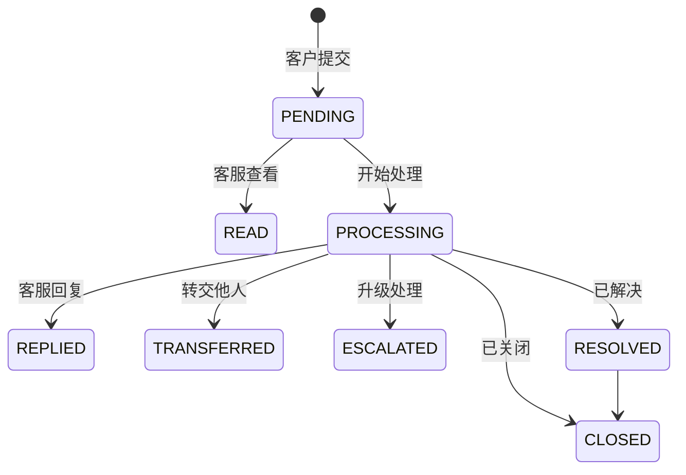

客户每一次评价，都是产品和服务改进的契机。但很多企业的反馈收集还停留在"挂个留言板，客户填完没人管"的阶段——要么收集渠道分散，要么缺少统一模板，要么收上来之后无人跟进，反馈石沉大海。

微语客户之声（VOC，Voice of Customer）模块，就是为了解决"收集难、管理乱、闭环缺失"这三个痛点而设计的。它把意见反馈从一个"摆设"，变成一套可配置、可追踪、可分析、可闭环的客户体验管理系统。

<!-- truncate -->

## 一、VOC 不是留言板，是一套反馈管理系统

很多团队对"意见反馈"的理解，还停留在网站底部挂一个表单、客户填完发邮件。这种做法的问题在于：

- **收集分散**：网站表单、邮件、客服对话、社交媒体……反馈散落各处，难以统一管理。
- **缺少标准**：每个渠道的问题都不一样，无法横向对比和统计。
- **没有闭环**：反馈提交后，谁来处理？处理到哪一步？客户什么时候能得到回复？全靠人工记。

微语 VOC 模块要做的，是把这一切串起来：

1. **统一模板**：用可配置的反馈模板定义收集内容、评分方式和处理流程。
2. **多渠道收集**：公开链接、会话关联、后台代填，全渠道汇聚到一处。
3. **闭环处理**：每条反馈都有状态流转，从待处理到已解决，全程可追溯。

## 二、支持多种行业通用的调研类型

VOC 模块内置了 `FeedbackTypeEnum`，支持多种反馈类型，模板按类型自动适配评分组件和原因选项：

| 类型 | 适用场景 | 评分尺度 |
| ---- | -------- | -------- |
| **CSAT**（客户满意度） | 衡量客户对某次具体服务/产品的满意度 | 1–5 星 |
| **NPS**（净推荐值） | 衡量客户推荐意愿，预测忠诚度 | 0–10 |
| **FEEDBACK**（意见反馈） | 通用产品/服务意见 | 可配置 |
| **COMPLAINT**（投诉） | 正式投诉收集与处理 | 可配置 |
| **REPORT**（举报） | 违规/问题举报 | 可配置 |
| **SURVEY**（问卷） | 自定义调研问卷 | 可配置 |
| **PRAISE**（表扬）/ **SUGGESTION**（建议） | 正向反馈与改进建议 | 可配置 |

其中 **CSAT** 和 **NPS** 是两类最常用的标准化指标，很多人容易混淆，这里多说一句：

- **CSAT 是"回顾性"评价**——客户刚刚体验完一次服务，问他满不满意。适合用在会话结束、工单关闭之后。常见划分是 1–3 分不满意、4–5 分满意。
- **NPS 是"前瞻性"预测**——问客户"你有多大意愿把我们推荐给朋友？"。它把客户分成三类：
  - **推荐者（9–10 分）**：忠实客户，主动为你口碑传播。
  - **中立者（7–8 分）**：满意但没热情，容易被竞品撬走。
  - **贬损者（0–6 分）**：不满意，可能劝阻别人购买。

两者不是替代关系，而是互补——CSAT 看单次体验，NPS 看长期忠诚。

## 三、可配置的反馈模板：一个模板搞定一类反馈

VOC 的核心是**反馈模板（FeedbackSettings）**。你不需要为每次调研写代码，只需要在管理后台创建一个模板，配置好以下内容：

- **基础信息**：模板名称、反馈类型、是否启用、评分尺度、正面阈值（达到几分算正面）、最大可选原因数。
- **文案**：标题、正面问题（如"哪些方面让您满意？"）、负面问题（如"哪些方面需要改进？"）、评论框占位提示。
- **原因选项**：分别维护"正面原因"和"负面原因"清单。组件会根据客户评分，自动展示对应一侧的原因供其多选。

模板配置完成后，系统会生成一个**VOC 链接**。把这个链接发到公众号菜单、邮件签名、服务结束提示、App 弹窗……客户点开就能直接评分，**无需注册登录**。

## 四、类型感知的评分组件：所见即所配

访客打开 VOC 链接后，评分组件会**根据模板类型自动变化**：

- **CSAT / 星级类型** → 渲染星级评分。
- **NPS** → 渲染 0–10 分刻度，并用颜色区分推荐者/中立者/贬损者。
- **SURVEY / FEEDBACK** → 渲染以评论为主的简洁布局。

客户打分后，组件根据分数判断是"正面"还是"负面"，自动弹出对应的原因选项让他勾选，最后是一个可选的评论框。整个流程对客户来说轻量、直观，对企业来说——你拿到的不是一句"挺好的"，而是结构化的、可统计的数据。

## 五、闭环处理：每条反馈都有"下文"

反馈提交后，进入管理后台的反馈列表，开始它的生命周期：

客服可以对反馈执行：**查看、回复（支持图文附件）、转交、升级、解决、关闭**。每一次状态变更都记录操作人和时间戳，形成完整审计轨迹。

此外，反馈还能**关联到会话（thread）、消息（message）或工单（ticket）**——比如某条差评可以追溯到是哪一次客服对话引起的，方便定位根因。

## 六、批量导出：数据沉淀与汇报

反馈列表支持三种 Excel 导出模式：

- **当前页**：导出当前看到的数据。
- **全部**：一次性导出（每批最多 1000 条）。
- **分段导出**：数据量大时，自动拆成多个 1000 条的批次，避免单次导出超时。

导出表头和文件名都已国际化，方便跨国团队使用。导出的数据可以直接用于月度汇报、趋势分析和绩效考核。

## 七、它怎么和微语其他模块联动？

VOC 不是孤岛，它和微语的其他模块天然打通：

- **在线客服**：会话结束后自动弹出 CSAT 评价，评价结果回写到反馈列表。
- **工单系统**：差评或投诉可以一键转工单，走工单流程闭环处理。
- **管理后台**：反馈列表、模板设置都集成在统一后台，客服和管理员各取所需。
- **访客端**：独立的 VOC 公开页面，可嵌入任何第三方系统或公众号。

## 写在最后

客户之声的本质，是让企业**持续听见、听懂、并回应客户**。微语 VOC 模块把这件事从"靠人盯"变成"靠系统管"——

- 收集有标准（模板）、
- 处理有流程（状态机）、
- 分析有数据（导出与统计）、
- 闭环有保障（关联会话与工单）。

如果你正在为团队寻找一套能落地、能闭环、能持续迭代的客户反馈方案，欢迎体验微语 VOC。

👉 **相关文档**：[客户之声 VOC 模块详解](/docs/modules/voc)
