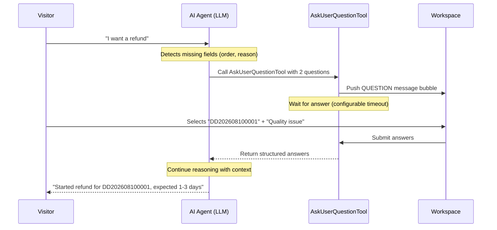

# Ask User Question (Clarifying Questions)

During a customer service conversation, the AI agent often needs the visitor to clarify intent or provide more details before it can answer accurately or take action. Bytedesk provides a built-in **Ask User Question** capability that lets the AI agent proactively ask structured clarifying questions with selectable options, instead of relying on free-text back-and-forth.

This page describes the product design and planned implementation. Some details may evolve as the feature is developed.

## Why It Matters

A typical blocker for self-service is missing information:

- "I want a refund" — but which order, and for what reason?
- "How do I install it?" — for which product model and operating system?
- "I want to report a fault" — what is the device serial number, symptom, and preferred on-site time?

Without structured clarification, the agent either guesses (wrong answers) or transfers to a human (avoidable cost). Ask User Question turns clarification into a first-class AI ability: the agent decides when to ask, what to ask, and how many options to offer, and the visitor answers by tapping instead of typing.

## How It Works



The agent treats "ask the user" as a tool it can call, inspired by [Claude Code's AskUserQuestion](https://platform.claude.com/docs/en/agent-sdk/user-input#question-format) and the [spring-ai-agent-utils](https://github.com/spring-ai-community/spring-ai-agent-utils) reference implementation. Bytedesk implements its own equivalent so it integrates natively with the multi-tenant, multi-session, WebSocket-based service stack.

## Key Features

- **AI-initiated**: the LLM decides when clarification is needed — no fixed scripts.
- **Structured questions**: 1–4 questions per turn, each with 2–4 options and an optional free-text input.
- **Single-select and multi-select**: choose the interaction that fits the question.
- **Business field binding**: each question can carry a `key` so the answer can be reused in ticket creation, order lookup, or routing.
- **Configurable per robot**: enable/disable, max rounds, max questions per call, timeout, free-text permission, timeout action (continue, transfer to human, or end thread).
- **Reuses Bytedesk messaging**: delivered as a `QUESTION` message type, rendered with a dedicated bubble in the visitor and desktop clients.
- **Auditable**: every question session is persisted for quality inspection, hit-rate analytics, and agent handoff context.

## Question Format

Each question the agent asks contains:

| Field | Description |
| --- | --- |
| `question` | The full question text, ending with "?". |
| `header` | A short label for UI display (max ~12 characters). |
| `options` | 2–4 options. Each option has a `label` and a `description`. |
| `multiSelect` | `true` allows multiple selections; `false` (default) is single-select. |
| `allowOther` | `true` lets the visitor enter custom text beyond the options. |
| `key` | Optional business field key (e.g. `order_no`, `reason`) for downstream systems. |

Example:

```json
{
  "key": "order_no",
  "question": "Which order do you want to refund?",
  "header": "Order",
  "multiSelect": false,
  "allowOther": true,
  "options": [
    { "label": "DD202608100001", "description": "Aug 10, Bluetooth earphones" },
    { "label": "DD202608090008", "description": "Aug 9, Phone case" }
  ]
}
```

The visitor always sees an "Other" choice to type a custom answer, so they are never locked into the agent's suggestions.

## Interaction Flow

1. The visitor sends a message.
2. The agent detects that required information is missing or ambiguous.
3. The agent calls `AskUserQuestionTool` with a structured question list.
4. The visitor client renders a **Question bubble**: cards with option buttons and optional free-text input.
5. The visitor submits answers (or cancels, or lets it time out).
6. The agent receives the structured answers and continues the conversation — answering, querying an order, or creating a ticket with the captured fields.

## Configuration

The robot settings provide the following options (defaults shown):

| Setting | Default | Description |
| --- | --- | --- |
| `enableAskUserQuestion` | `true` | Master switch for the robot. |
| `maxQuestionRounds` | `3` | Max consecutive question turns before transferring to a human. |
| `maxQuestionsPerCall` | `4` | Max questions the agent may ask in one tool call. |
| `defaultTimeoutSeconds` | `300` | How long the bubble waits before expiring. |
| `allowFreeText` | `true` | Whether visitors can type custom answers. |
| `onTimeoutAction` | `TRANSFER_HUMAN` | What happens on timeout: `CONTINUE_WAIT`, `TRANSFER_HUMAN`, or `END_THREAD`. |
| `questionSystemPrompt` | _(built-in)_ | Overrides the default clarification strategy prompt. |

## Integration Points

Ask User Question is not an isolated feature. Its outputs feed directly into other Bytedesk modules:

- **Tickets**: answers with a `key` are mapped to ticket form fields, so the ticket is pre-filled when the agent creates it.
- **Orders**: the visitor selects an order number; the agent's next turn calls `OrderTools` with that exact ID.
- **Routing**: captured category and urgency inform the unified routing rules.
- **Summary**: the question history is part of the conversation summary context.
- **Quality inspection**: persisted sessions power metrics like question hit-rate, visitor drop-off rate, and average answer time.
- **Live monitoring**: desktop agents see what the robot is asking and whether the visitor has answered, so they can take over smoothly when needed.

## Fallbacks

- If the LLM provider does not support tool calling, the robot falls back to free-text clarification in its reply.
- If the visitor times out or cancels, the configured `onTimeoutAction` runs — by default, transferring to a human agent with the partial context.
- If multiple question calls race in the same thread, only the first is accepted; the agent is told a question is already pending.

## Example Scenarios

### Refund clarification

> Visitor: "I want a refund."
> Agent asks: order number (2 recent orders) + reason (quality / changed mind / not as described).
> Visitor selects. Agent looks up the order, confirms eligibility, and starts the refund or creates a ticket.

### Repair intake

> Visitor: "My device is broken."
> Agent asks: device model + serial number + symptom + preferred on-site time.
> Visitor answers. Agent creates a ticket with all fields pre-filled and assigns it to the right team.

### Pre-sales consultation

> Visitor: "Which plan should I pick?"
> Agent asks: team size + expected volume + must-have features.
> Visitor selects. Agent recommends a plan and offers to route to a sales agent.

## Implementation Notes

- The feature is implemented as a Spring AI `@Tool` in `modules/ai`, registered through Bytedesk's existing tool registry so it is available to any robot that enables it.
- Question state is held in a session store keyed by `threadUid`; answers are completed via a REST endpoint and, in multi-instance deployments, synchronized through Redis.
- Two new message types are introduced: `QUESTION` (agent → visitor) and `QUESTION_SUBMIT` (visitor → agent), rendered by dedicated bubble components.
- See the implementation plan at `docs/plans/2026-08-10-ask-user-question-plan.md` for the detailed design, data model, and phasing.

## See Also

- [Customer Service Assistant Agent](./customer-service-assistant.md)
- [After-sales Agent](./after-sales-agent.md)
- [Pre-sales Agent](./pre-sales-agent.md)
- [spring-ai-agent-utils AskUserQuestionTool](https://github.com/spring-ai-community/spring-ai-agent-utils/blob/main/spring-ai-agent-utils/docs/AskUserQuestionTool.md)
- [Claude Agent SDK — User Input](https://platform.claude.com/docs/en/agent-sdk/user-input#question-format)
