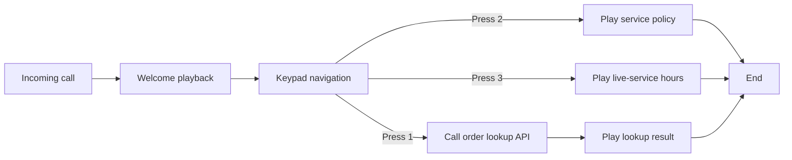

# IVR

## IVR preview

The Weiyu IVR flow editor is used to configure automated voice-service flows for enterprise telephony. It is designed mainly for operations teams, service managers, implementation consultants, and business administrators. It does not require a programming background or deep knowledge of telecom protocols. With visual drag-and-drop editing and form-based configuration, teams can organize steps such as welcome prompts, keypad navigation, information lookup, result playback, and call completion into a complete self-service call flow.

In simple terms, IVR is the voice menu inside a phone call. For example:

- The caller first hears a welcome message.
- The caller presses 1 to check an order.
- The caller presses 2 to check a balance.
- The caller presses 3 to transfer to a live agent or hear service instructions.

All of these flows can be configured in the Weiyu IVR flow editor.

## Suitable scenarios

The Weiyu IVR workflow editor fits common business scenarios such as:

- Main number navigation: press 1 for sales, 2 for after-sales, 3 for finance.
- After-hours auto response: play a non-working-hours message and guide callers to leave a message or request a callback.
- Self-service lookup: query order status, points, membership status, and similar information by caller identity.
- Service policy playback: play pricing, after-sales policy, or campaign notices.
- Inbound routing: guide different caller types into different processing paths through keypad input.

For most organizations, the value is not in technical complexity. The value is in moving repetitive, standardized, and self-service-friendly phone tasks to the front of the service flow, reducing live-agent pressure and improving first-response efficiency.

## What this editor can do

The current Weiyu IVR editor already provides a complete baseline capability set:

- Create new IVR workflows and start quickly from preset templates.
- Build flows by drag and drop instead of writing code.
- Configure prompt text, keypad options, API endpoints, and other business information for each node.
- Save, update, and delete workflows.
- Import and export workflow JSON for backup, migration, and reuse.
- Execute workflows for quick validation.
- Bind workflows to IVR menus or number entry points for real telephony scenarios.
- Review IVR execution records, keypad input, playback content, and recordings in the admin backend.

## Core nodes in the editor

To make the flow easier for non-technical users to understand, the whole IVR process can be viewed as a set of building blocks:

### 1. Start

This is the entry point of a call flow. It usually does not need extra configuration and simply marks the beginning of the workflow.

### 2. Voice playback

This node is used to play a spoken message to the caller, such as:

- Welcome to Company XX.
- We are currently outside business hours.
- Your order is being checked. Please wait.

If the goal is mainly to tell the caller something, this is the node to use.

### 3. Keypad navigation

This node collects keypad input and routes the call into different branches. For example:

- Press 1 to check an order.
- Press 2 to check a balance.
- Press 3 to hear live-service hours.

This is the most common IVR capability and the core of a phone navigation tree.

### 4. API call

This node retrieves real-time data from a business system and turns the result into a voice response. Common use cases include:

- Querying order status.
- Querying membership points.
- Querying account balance.
- Querying reservation results.

For business users, the key idea is simple: fetch information from a system and speak it back to the caller. The actual system integration is usually completed with help from implementation or engineering teams.

### 5. Key branch

This node adds more detailed conditional branching so different inputs can lead to different outcomes. It is useful in more complex flows with many branches.

### 6. End

This marks the completion of the current self-service call flow. It is usually placed after a closing prompt or after a lookup result has been played.

## How to build an IVR flow

A typical setup process usually has only four steps:

### Step 1: Create a workflow

Create a new IVR workflow in the workflow page. The current version supports at least two common templates:

- Quick start: suitable for building a standard IVR menu quickly.
- After-hours message: suitable for non-working-hour prompts, voicemail, and emergency contact guidance.

If the business process is relatively standard, it is usually more efficient to start from a template and then adjust the wording to match the business.

### Step 2: Drag nodes and connect them

Drag nodes such as voice playback, keypad navigation, and API call from the left panel onto the canvas, then connect them in the same order as the real business flow.

For example, a simple inbound navigation flow can be designed as:

1. Start
2. Welcome playback
3. Keypad navigation
4. Lookup or instruction node
5. End

### Step 3: Fill in node content

After selecting a node, complete the related fields in the properties panel. For example:

- Voice playback node: enter the script to be played.
- Keypad navigation node: define the keys and their routing branches.
- API call node: define the request URL, method, and response script template.

For business teams, the main concern is usually what the caller hears, which key the caller presses, and which path the call ultimately takes.

### Step 4: Save and validate

Once the flow is configured, save it first and then run workflow validation to catch obvious omissions. After confirmation, bind the workflow to the correct IVR menu or number entry point.

## How the workflow connects to real telephony

In the current implementation, an IVR workflow is not used alone. It works together with IVR menus in the call-management area.

From a business perspective:

- The IVR menu defines which number entry point uses which workflow.
- The IVR workflow defines what to play, how to collect keypad input, and how to query information after the caller enters the flow.

In the IVR menu configuration page, administrators can:

- Set the IVR menu name.
- Set a custom number or extension.
- Define whether the menu is inbound, outbound, or both.
- Choose which IVR workflow to bind.

After binding, incoming calls to the target entry point will execute the selected workflow.

## How to review the effect after launch

Weiyu provides an IVR execution record page so business teams can review whether the flow is actually working as intended. The current view can include:

- Extension number.
- Caller number.
- Current status.
- Key pressed by the caller.
- Current node and next node.
- Playback content.
- Call duration and hangup cause.
- Recording file.

This means business teams can do more than just publish a workflow. They can continue analyzing:

- Which key is pressed most often.
- Which step is most likely to fail or be abandoned.
- Whether the playback is too long.
- Whether the branch design should be optimized.

## Recommended usage approach

To make IVR practical for long-term use by non-technical teams, the following approach works well:

1. Start with a simple flow instead of designing too many branches at the beginning.
2. Let each playback node express one clear action and avoid overly long prompts.
3. Place the most common issues first to reduce waiting time and deep menu trees.
4. Use API-call nodes only where real-time data is actually required.
5. Keep optimizing the flow with IVR execution records after launch instead of treating configuration as one-time work.

## A typical example

Here is a basic IVR flow that fits many organizations:

1. Play a welcome message: "Hello, welcome to the Weiyu customer service center."
2. Prompt for keys: "Press 1 for order lookup, press 2 for service policy, press 3 for live service hours."
3. If the caller presses 1, call the order lookup API and play the result.
4. If the caller presses 2, play after-sales or service policy information.
5. If the caller presses 3, play live-service hours and transfer guidance.
6. End the flow.

This kind of flow is business-friendly because its logic is similar to a traditional process diagram, and editing feels more like assembling blocks than programming.

### Typical flow diagram

The diagram below helps non-technical users quickly understand how an IVR flow is usually organized in the system:

You can think of it as a phone navigation tree:

- Every call enters the welcome prompt first.
- After the welcome prompt, the caller reaches keypad selection.
- Different key presses lead to different processing paths.
- Lookup paths usually call a business API first and then play the result.
- Explanation paths usually play a prompt directly and then end.

If you see multiple nodes and connectors in the editor, they are simply the individual maintenance units of the same process shown above.

## Summary

The Weiyu IVR flow editor is a visual telephony-flow design tool for business configuration. It converts work that traditionally required technical specialists into a more standardized process of dragging nodes, filling in prompts, binding an entry point, and reviewing the outcome.

If the goal is to quickly build a company switchboard, after-hours message, self-service lookup, or keypad-based phone navigation flow, this editor already covers most foundational scenarios. For advanced cases that need integration with business systems, the current workflow model can also be extended further.

## Related reading

- [PopUp](./popup): See how the agent workspace opens a real-time popup when an IVR flow transfers the caller to a live extension.
- [Softphone](./softphone): See how agents continue call handling with answer, transfer, hold, and hangup controls after IVR routing.
