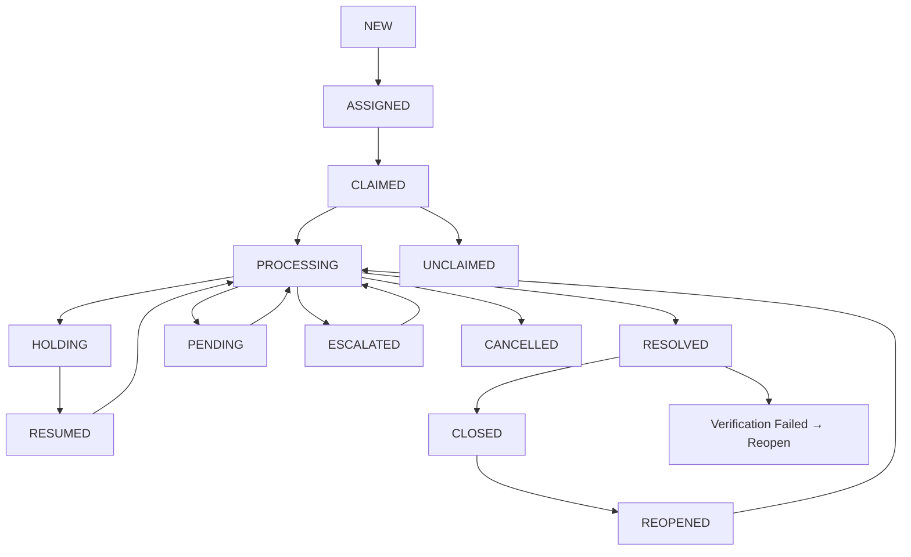

# Ticket Workflow

## Overview

The Ticket Workflow is Bytedesk's brand-new **visual process designer** that lets you design ticket handling workflows by simply dragging and dropping nodes — just like drawing a flowchart. From approvals and countersigning to notifications and conditional branching, every step is clear at a glance.

The workflow also includes a built-in **AI Assistant**, allowing you to modify processes using natural language (e.g., "add a notification node after the approval node"), with the AI making the changes automatically.

### Key Benefits

- **Zero-code design**: Drag-and-drop operations accessible to business users
- **Rich node types**: Covers approval, countersign, or-sign, conditional branching, parallel execution, notifications, HTTP calls, and sub-processes
- **AI-assisted editing**: Conversation-based workflow modification for maximum efficiency
- **One-click deployment**: Deploy to the process engine instantly after design
- **Ready-to-use templates**: Built-in demo processes for leave approval, reimbursement approval, and IT support

## Preview

### Workflow Designer Interface

The Ticket Workflow Designer (TicketBuilder) includes the following main areas:

| Area | Description |
| --- | --- |
| **Top Toolbar** | Process selection, create/edit/delete, deploy/undeploy, save, import/export, AI chat toggle |
| **Left Node Panel** | Draggable node list including approval, countersign, or-sign, notification, conditional branch, etc. |
| **Center Canvas** | Visual process editing area with drag-and-drop nodes, connections, and layout adjustment |
| **Right Property Panel** | Node property editor displayed when clicking a node |
| **Right AI Panel** | AI chat window for natural language workflow modification |
| **Minimap** | Canvas thumbnail for quick navigation |

## Node Types

The Ticket Workflow provides the following node types to cover various business scenarios:

### Flow Control Nodes

| Node | Description | Typical Use Case |
| --- | --- | --- |
| **Start** | Process entry point — exactly one per workflow | Automatically triggered when a ticket is created |
| **End** | Process termination point | Reached when a ticket is closed or cancelled |
| **Condition** | Routes to different branches based on conditions | Auto-routing based on amount, type, or other criteria |
| **Parallel** | Triggers multiple downstream branches simultaneously | Send notifications while processing approval |
| **Join** | Waits for all upstream branches to complete before continuing | Aggregate results after multiple parallel approvals |

### Approval Nodes

| Node | Description | Typical Use Case |
| --- | --- | --- |
| **Approval** | Single-person approval with designated approver | Direct manager approves a leave request |
| **Countersign** | Multi-person approval with "all must agree", "ratio-based", or "count-based" modes | Important contracts requiring multiple reviewers |
| **Or-Sign** | Multi-person approval where any one person's approval suffices | Any department manager can approve |

### Integration & Notification Nodes

| Node | Description | Typical Use Case |
| --- | --- | --- |
| **Notification** | Send message, email, or SMS notifications | Notify applicant after approval |
| **HTTP Request** | Call external system APIs | Sync data to third-party business systems |
| **Sub-Process** | Reference and execute another published process | Embed standard approval sub-process in main flow |

## Use Cases

- **IT Operations**: Fault report → Assign technician → Handle → Verify → Close
- **Administrative Approval**: Leave request → Department approval → HR filing → Notification
- **Customer Service**: Complaint intake → Tiered handling → Escalation → Follow-up → Close
- **Procurement**: Request → Department approval → Finance countersign → Execution
- **Cross-department Collaboration**: Request submission → Parallel distribution → Aggregation → Confirmation

## Quick Start

### 1. Open the Ticket Workflow Designer

In the admin dashboard, navigate to "Ticket Management" → "Ticket Workflow" to open the visual process designer.

### 2. Create a New Process

1. Click the "New Process" button in the top toolbar
2. Enter the process name and description in the dialog
3. Click confirm — the system will automatically create a blank process with "Start" and "End" nodes

### 3. Design Your Process

1. **Add nodes**: Drag desired nodes from the left panel onto the canvas
2. **Connect nodes**: Drag from a node's bottom connection point to the next node's top connection point
3. **Configure properties**: Click a node and fill in parameters (e.g., approver, notification content) in the right property panel
4. **Adjust layout**: Use the toolbar in the top-right corner of the canvas for zoom, fit-to-view, etc.

### 4. Save & Deploy

1. **Save**: Click the "Save" button to persist your current design to the server
2. **Deploy**: After confirming the process is correct, click "Deploy" to publish it to the process engine — it takes effect immediately
3. **Undeploy**: To take a process offline, click "Undeploy"

### 5. Link to Ticket Settings

After deployment, associate the process template with the corresponding ticket type or workgroup in "Ticket Settings". New tickets will automatically follow this process.

## AI Assistant

The Ticket Workflow includes a built-in AI chat assistant for rapid natural-language workflow modification.

### How to Use

1. Click the "AI Assistant" button in the top toolbar to open the right-side AI chat panel
2. Describe your modification needs in natural language in the input field
3. The AI will automatically analyze your request and modify the canvas workflow
4. Click the "Apply Changes" button next to the AI message to confirm

### Example Commands

| Command Example | Effect |
| --- | --- |
| "Add a notification node after the approval node" | AI inserts a notification node after the approval node and connects them |
| "Change the approver to John" | AI modifies the approver property of the approval node |
| "Add a countersign node after the condition branch" | AI adds a countersign node and connects it |
| "Delete the second notification node" | AI removes the specified node and its connections |

### Notes

- Always verify the workflow is correct after AI modifications
- Manual save is required after modifications
- AI Assistant requires the organization to have an AI service configured (e.g., DeepSeek, ZhipuAI, etc.)

## Process Management

### Process Status

| Status | Description |
| --- | --- |
| **Draft** | Newly created or undeployed process, freely editable |
| **Deployed** | Published to the process engine, currently active |

### Process Operations

| Operation | Description |
| --- | --- |
| **New** | Create a new blank process |
| **Edit** | Modify process name and description |
| **Delete** | Delete a process (deployed processes must be undeployed first) |
| **Save** | Persist current canvas content to the server |
| **Deploy** | Publish the process to the process engine for immediate effect |
| **Undeploy** | Take a deployed process offline, reverting to draft status |
| **Reset** | Restore system default process to its initial template content |
| **Import/Export** | Support JSON format import/export for backup and migration |

### Demo Process Templates

The system includes three built-in demo process templates, automatically initialized on first use:

| Template | Description |
| --- | --- |
| **Leave Approval** | Employee leave request → Department manager approval → Notification |
| **Reimbursement Approval** | Submit reimbursement → Department approval → Finance countersign → Payment notification |
| **IT Support** | Submit issue → IT assignment → User verification → Close |

## Ticket Lifecycle & Workflow Relationship

The ticket workflow is tightly coupled with ticket status — process node transitions automatically drive ticket status changes:

## FAQ

### My process design isn't taking effect?

Please confirm you have completed the following steps:

1. Click "Save" to persist the design
2. Click "Deploy" to publish to the process engine
3. In "Ticket Settings", associate the process template with the corresponding ticket type

### Can I modify a deployed process?

Deployed processes are in read-only protection mode. You need to switch to edit mode via the top toolbar first. Note that modifying a deployed process does not affect currently running ticket instances.

### How do I back up my process design?

Click the "Export" button to download the current process as a JSON file. To restore, click "Import" and upload the JSON file.

### The AI Assistant isn't working?

Please verify:

1. The organization has an AI model service configured (Admin Dashboard → AI Settings)
2. The AI service is enabled
3. Network connectivity is normal

### What's the difference between system and custom processes?

- **System processes**: Default processes automatically created during organization initialization (e.g., internal ticket process, external ticket process). These support "Reset" to restore defaults.
- **Custom processes**: Processes manually created by users, freely editable and deletable.
