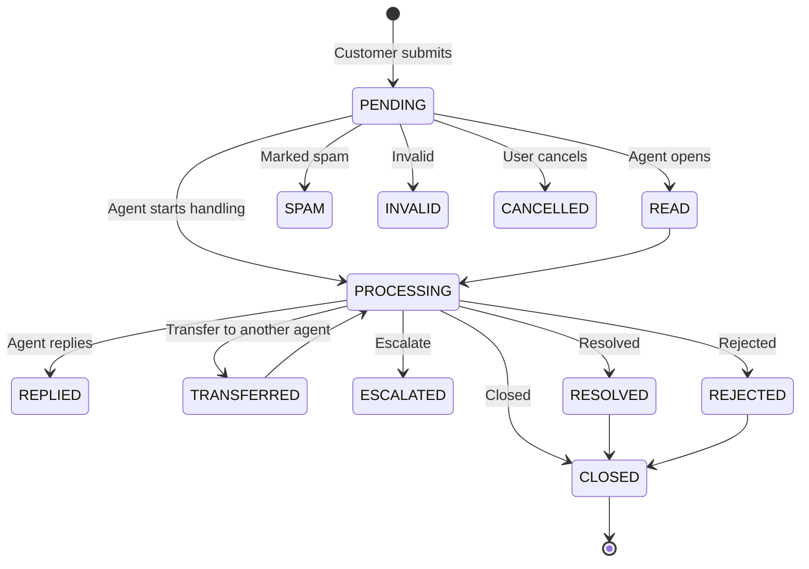

## Overview

The **Voice of Customer (VOC)** module is a complete feedback management system for collecting, categorizing, processing and analyzing customer feedback. It helps enterprises understand real customer needs and continuously improve products and services through a closed-loop feedback workflow.

VOC is not just a simple "message board". It is built around a configurable **Feedback Template (FeedbackSettings)** that supports multiple industry-standard survey types — including CSAT (Customer Satisfaction), NPS (Net Promoter Score), complaints, suggestions and general surveys — and adapts the collection widget, rating scale and reason options to each type.

## Core Concepts

| Concept | Description |
| ------ | ----------- |
| **Feedback** | A single piece of customer feedback submitted through a widget or the admin backend. Stored in `bytedesk_voc_feedback`. |
| **Feedback Settings (Template)** | A reusable configuration that defines the feedback type, rating scale, questions and reason options. Stored in `bytedesk_voc_feedback_settings`. |
| **VOC Link** | A shareable URL that opens the public feedback widget pre-bound to a specific template, so customers can submit feedback without logging in. |

## Feedback Types

Each feedback template is bound to one type from `FeedbackTypeEnum`, which determines the default rating scale and widget layout:

| Type | Description | Typical Scale |
| ---- | ----------- | ------------- |
| **CSAT** | Customer Satisfaction — a retrospective rating of a specific service or product experience. | 1–5 (star) |
| **NPS** | Net Promoter Score — measures willingness to recommend, segmenting customers into Promoters / Passives / Detractors. | 0–10 |
| **FEEDBACK** | General feedback / opinions. | configurable |
| **REPORT** | Report an issue / violation. | configurable |
| **COMPLAINT** | Formal complaint. | configurable |
| **SURVEY** | Custom survey. | configurable |
| **PRAISE** | Compliment / positive feedback. | configurable |
| **SUGGESTION** | Improvement suggestion. | configurable |

### CSAT vs NPS

- **CSAT** is *retrospective*: it measures satisfaction with a recent, specific interaction. A common split is 1–3 = dissatisfied, 4–5 = satisfied.
- **NPS** is *forward-looking*: it predicts loyalty and recommendation willingness through a single 0–10 question. Respondents are grouped into:
  - **Promoters (9–10)**: loyal customers most likely to recommend your product.
  - **Passives (7–8)**: satisfied but unenthusiastic; easily swayed by competitors.
  - **Detractors (0–6)**: unhappy customers who may discourage others.

## Feedback Lifecycle

Every feedback item moves through a status defined in `FeedbackStatusEnum`:

## Key Features

### 1. Multi-Channel Feedback Collection

Collect feedback from:

- The **public VOC widget** (`visitorVoc`) — customers submit without logging in via a VOC link.
- The **admin backend** — agents create feedback on behalf of customers.
- **Conversation-associated** feedback — bind a feedback item to a `threadUid`, `messageUid` or `ticketUid`.

### 2. Configurable Feedback Templates

A `FeedbackSettings` template controls every aspect of the feedback experience:

- **Type**: CSAT / NPS / FEEDBACK / SURVEY / ...
- **Rating scale**: configurable `scoreMax` (e.g. 5 for stars, 10 for NPS).
- **Positive threshold**: `positiveScoreMin` (e.g. 9) — scores at or above this are "positive".
- **Max selectable reasons**: `maxReasons` (default 3).
- **Copy / wording**: title, positive question, negative question, comment placeholder.
- **Reason options**: separate positive and negative reason lists, shown conditionally based on the score.
- **Enabled toggle**: enable or disable a template at any time.

### 3. Type-Aware Rating Widget

The visitor widget automatically adapts its layout based on the feedback type:

- **CSAT / star types**: render a star rating.
- **NPS**: render a 0–10 scale with Promoter / Passive / Detractor color bands.
- **SURVEY / FEEDBACK**: render a simple comment-first layout.

Based on the score, the widget shows the corresponding positive or negative reason options, then a free-text comment box.

### 4. Classification & Association

- **Categories**: tag feedback with `categoryUids` for filtering and routing.
- **Tags**: free-form `tagList` for search.
- **Priority**: LOW / MEDIUM / HIGH.
- **Associations**: link feedback to a conversation thread, a specific message, or a ticket for full context.

### 5. Processing & Collaboration

- **Reply**: agents reply with text, images and attachments.
- **Transfer**: hand off to another agent.
- **Escalate**: raise to a higher level.
- **Read / Replied / Resolved timestamps**: full audit trail with the acting user and timestamp for every state change.

### 6. Data Export

The admin feedback list supports exporting to Excel with three modes:

- **Current page**
- **All** (up to 1000 per batch)
- **Range** — automatically splits into 1000-row batches for large datasets.

Export headers and file names are internationalized.

### 7. VOC Link Sharing

Each template can generate a shareable VOC link. Distribute it through:

- Email signatures
- WeChat Official Account menus
- In-app pop-ups
- Post-service satisfaction prompts

Customers open the link and submit feedback directly — no account needed.

## Admin Management

### Feedback List

Located at **Dashboard → VOC → Feedback**. Provides:

- Full-text search by title and content.
- Category and organization filtering.
- Sort by creation / update time.
- Per-row actions: **View**, **Edit**, **Delete**.
- Bulk export.

### Feedback Settings (Templates)

Located at **Dashboard → VOC → Feedback Settings**. A split-pane interface:

- **Left pane**: template list with search and create.
- **Right pane**: tabbed editor with four tabs:
  - **Basic**: name, type, enabled, rating scale, positive threshold, max reasons.
  - **Copy**: title, positive / negative questions, comment placeholder.
  - **Reasons**: positive and negative reason option lists.
  - **Link**: generates and previews the public VOC link.

The editor tracks unsaved changes and prompts for confirmation before switching templates, toggling enabled, or reloading.

## Visitor Feedback Widget

The public widget (`visitorVoc`) is a standalone page designed for end customers:

1. Customer opens a VOC link (e.g. `https://your-domain/voc?org=ORG_UID&sid=TEMPLATE_UID`).
2. The widget loads the bound template configuration.
3. The rating UI adapts to the template type (CSAT star / NPS scale / survey).
4. Based on the score, the matching positive or negative reasons are shown.
5. The customer adds an optional comment and submits.
6. The feedback is stored and appears in the admin feedback list for processing.

## Use Cases

- **Post-service satisfaction**: automatically prompt CSAT after a chat or ticket is closed.
- **NPS benchmarking**: run periodic NPS campaigns to track loyalty trends.
- **Complaint management**: collect and route formal complaints to the right team.
- **Product improvement**: gather feature suggestions and bug reports from users.
- **Service quality monitoring**: capture service quality issues in real time.
- **Closed-loop follow-up**: ensure every piece of feedback is replied to and resolved.

## Access

- **Admin backend**: log in to the admin dashboard and navigate to **VOC** menu.
- **Visitor widget**: open the VOC link generated from a feedback template.
- **REST API**: feedback and feedback settings endpoints are available under `/api/v1/feedback` and `/api/v1/feedback/settings` (see Swagger UI at `/swagger-ui.html`).
