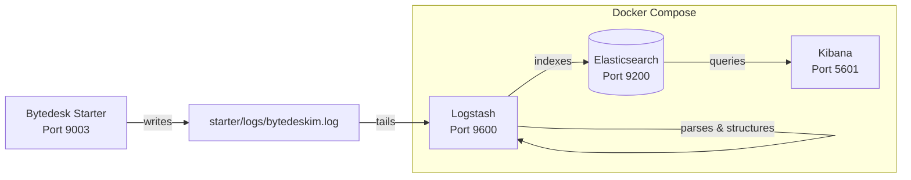

# Bytedesk Log Monitor

Bytedesk uses the **ELK Stack** (Elasticsearch + Logstash + Kibana) to provide unified log collection, parsing, storage, and visualization. It offers centralized log search, distributed tracing, and operational troubleshooting for developers and DevOps engineers.

[Logstash](https://www.elastic.co/guide/en/logstash/9.4/docker.html) · [Kibana](https://www.elastic.co/guide/en/kibana/9.4/docker.html) · [Elasticsearch](https://www.elastic.co/guide/en/elasticsearch/reference/9.4/docker.html)

## Overview

| Capability | Component | Description |
| --- | --- | --- |
| Log Output | Spring Boot (Logback) | App writes logs in `[RID:xxx TRACEID:xxx]` format to `starter/logs/bytedeskim.log` |
| Log Collection | Logstash | File input tails log files in real time; grok parses structured fields; ANSI color codes stripped |
| Log Storage | Elasticsearch | Daily indexes `bytedesk-logs-YYYY.MM.dd` with IK Chinese tokenizer support |
| Log Visualization | Kibana | Discover search, dashboards, filtering by level / logger / service |

## Architecture



**Data flow**:

1. The application writes logs to `starter/logs/bytedeskim.log` via Logback, with `[RID:xxx TRACEID:xxx]` trace markers
2. Logstash tails the log file in real time using `file input`, with `multiline` codec to merge exception stack traces
3. The `grok` filter parses logs into structured fields (level, logger, thread, requestId, traceId, etc.)
4. Parsed structured logs are written to Elasticsearch daily indexes
5. DevOps/developers search, filter, and analyze logs in Kibana

## Log Format

### Output Pattern

Application logs follow a unified pattern (configured in `starter/src/main/resources/properties/noai/logging.properties`):

```bash
[RID:%X{requestId} TRACEID:%X{traceId}]-yyyy-MM-dd HH:mm:ss.SSS-LEVEL PID --- [thread] logger : message
```

Example log line:

```bash
[RID:req_abc123 TRACEID:trace_xyz789]-2026-07-25 10:30:45.123- INFO 12345 --- [nio-9003-exec-1] c.b.s.service.ThreadService : thread created successfully
```

### Key Fields

| Field | MDC Key | Description |
| --- | --- | --- |
| `requestId` | `%X{requestId}` | Request-level trace ID, consistent within a single HTTP request |
| `traceId` | `%X{traceId}` | Distributed trace ID, propagated across services |
| `level` | Log Level | TRACE / DEBUG / INFO / WARN / ERROR |
| `logger` | Logger Name | Class name that emitted the log (truncated to 40 chars) |
| `thread` | Thread Name | e.g. `nio-9003-exec-1`, `scheduling-1` |

## Logstash Pipeline Details

The pipeline configuration is at `deploy/docker/compose/logstash/pipeline/logstash.conf`, with three phases:

### Input — Log Collection

```ruby
input {
  file {
    path => ["/var/log/bytedesk/bytedeskim.log*", "/var/log/bytedesk-source/bytedeskim.log*"]
    start_position => "beginning"
    mode => "tail"
    codec => multiline {
      pattern => "^-*\[RID:"
      negate => true
      what => "previous"
    }
  }
}
```

- **Paths**: via volume mounts, Logstash reads both `/var/log/bytedesk/` (Docker shared volume) and `/var/log/bytedesk-source/` (host `starter/logs/` mapping)
- **multiline**: lines not starting with `[RID:` (e.g. exception stack traces) are merged into the previous log entry
- **sincedb**: records read position so the container won't re-read from the beginning after restart

### Filter — Log Parsing

```ruby
filter {
  # Strip ANSI color codes
  mutate { gsub => ["message", "\u001B\[[0-9;]*[A-Za-z]", ""] }

  # Grok regex to extract structured fields
  grok {
    match => {
      "message" => [
        "-\[RID:%{DATA:requestId} TRACEID:%{DATA:traceId}\]-%{TIMESTAMP_ISO8601:log_timestamp}-%{SPACE}%{LOGLEVEL:level} ...",
        "\[RID:%{DATA:requestId} TRACEID:%{DATA:traceId}\] %{TIMESTAMP_ISO8601:log_timestamp} ..."
      ]
    }
    tag_on_failure => ["_bytedesk_parse_failure"]
  }

  # Override @timestamp with the actual log time
  date { match => ["log_timestamp", "yyyy-MM-dd HH:mm:ss.SSS"] }

  # Inject service metadata
  mutate {
    add_field => {
      "service.name" => "bytedesk"
      "event.dataset" => "bytedesk.application"
    }
  }

  # Map to ECS standard fields
  mutate {
    add_field => { "[log][level]" => "%{level}" }
    add_field => { "[log][logger]" => "%{logger}" }
    add_field => { "[process][thread][name]" => "%{thread}" }
    add_field => { "[process][pid]" => "%{pid}" }
  }

  # Clean up intermediate fields
  mutate { remove_field => ["parsed_message", "log_timestamp", "host", "path", "level", "logger", "thread", "pid"] }
}
```

**Key points**:

- `gsub` removes ANSI escape sequences from Logback colored output before parsing
- `grok` provides two match patterns for compatibility with different log format versions
- Unparseable lines are tagged `_bytedesk_parse_failure` for troubleshooting
- ECS (Elastic Common Schema) field mappings enable Kibana to recognize log level, thread, process, etc. out of the box

### Output — Write to Elasticsearch

```ruby
output {
  elasticsearch {
    hosts => ["${ELASTICSEARCH_HOSTS}"]
    user => "${ELASTICSEARCH_USERNAME}"
    password => "${ELASTICSEARCH_PASSWORD}"
    index => "bytedesk-logs-%{+YYYY.MM.dd}"
    ilm_enabled => false
  }
}
```

- **Daily indexes**: `bytedesk-logs-2026.07.25`, easy to manage and purge by date
- **Authentication**: uses Elasticsearch built-in `elastic` user + `ELASTIC_PASSWORD` env variable

## Quick Start

### Prerequisites

- Docker and Docker Compose
- Project cloned locally

### 1. Configure Environment Variables

Ensure `.env` has Elasticsearch and Kibana variables:

```bash
# Elasticsearch
ELASTIC_PASSWORD=bytedesk123

# Kibana Service Account Token (generate via elasticsearch-service-tokens)
KIBANA_SERVICE_ACCOUNT_TOKEN=your_token_here
```

### 2. Start Log Services

```bash
cd deploy/docker

# Start ELK services only
docker compose --env-file .env -f compose/compose-redis.yaml -f compose/compose-elasticsearch.yaml up -d bytedesk-elasticsearch bytedesk-logstash bytedesk-kibana

# Check service status
docker compose --env-file .env -f compose/compose-redis.yaml -f compose/compose-elasticsearch.yaml ps
```

### 3. Verify Services

```bash
# Elasticsearch health check
curl -u elastic:bytedesk123 http://localhost:19200/_cluster/health

# Logstash status (API port 9600)
curl http://localhost:19600/_node/stats

# Kibana UI
open http://localhost:15601
```

### 4. Open Kibana and Log In

Open `http://localhost:15601` in a browser and log in with the following credentials:

| Parameter | Value | Description |
| --- | --- | --- |
| Login URL | `http://localhost:15601` | Kibana web management UI |
| Username | `elastic` | Elasticsearch built-in superuser |
| Password | `${ELASTIC_PASSWORD}` | Same as `ELASTIC_PASSWORD` in `.env` (default `bytedesk123`) |

> **Tip**: If Kibana prompts for an enrollment token after first Elasticsearch start, generate one with:
>
> ```bash
> docker exec -it elasticsearch-bytedesk bin/elasticsearch-create-enrollment-token -s kibana
> ```
>
> Alternatively, skip enrollment and use the `elastic` username + password login.

After logging in, create a log data view:

1. Click top-left menu → **Stack Management** → **Data Views**
2. Click **Create data view**
3. Enter index pattern `bytedesk-logs-*`, set timestamp field to `@timestamp`
4. Click **Save data view to Kibana**

### 5. Search Logs

1. Click top-left menu → **Discover**
2. Select the `bytedesk-logs-*` data view from the top dropdown
3. Use KQL syntax in the search bar (see common queries below)
4. Use the field list on the left to filter by `log.level`, `log.logger`, `requestId`, etc.

## Common Kibana Queries

| Scenario | KQL Query | Description |
| --- | --- | --- |
| Filter by level | `log.level: "ERROR"` | View all error logs |
| Trace by request | `requestId: "req_abc123"` | Trace a request's complete call chain |
| Trace by trace ID | `traceId: "trace_xyz789"` | Trace distributed call chain |
| Filter by class | `log.logger: "*ThreadService*"` | View logs from a specific class |
| Filter by thread | `process.thread.name: "*scheduling*"` | View scheduled task logs |
| Keyword search | `message: "OutOfMemoryError"` or `message: "OOM"` | Search logs containing keywords |
| Combine conditions | `log.level: "ERROR" and log.logger: "*call*"` | Combined filtering |
| Parse failures | `tags: "_bytedesk_parse_failure"` | Find unparseable log lines |

### Dashboards

Create monitoring dashboards in Kibana **Dashboard**. Recommended visualizations:

- **Log Volume Trend**: aggregate count by time to monitor throughput
- **ERROR Ratio**: pie chart of log level distribution
- **Top Loggers**: aggregate by logger to identify noisy sources
- **ERROR Log Table**: real-time table of recent ERROR logs

## Port Mappings

| Service | Container Port | Host Port | Description |
| --- | --- | --- | --- |
| Elasticsearch | 9200 | 19200 | REST API |
| Elasticsearch | 9300 | 19300 | Node communication |
| Logstash | 9600 | 19600 | Monitoring API |
| Kibana | 5601 | 15601 | Web management UI |

## Troubleshooting

### 1. Kibana cannot connect to Elasticsearch

Verify `KIBANA_SERVICE_ACCOUNT_TOKEN` is correct:

```bash
# Generate token inside Elasticsearch container
docker exec -it elasticsearch-bytedesk bin/elasticsearch-service-tokens create elastic/kibana bytedesk-kibana
```

### 2. Logs not being collected

- Verify Logstash can access log files:

  ```bash
  docker exec -it logstash-bytedesk ls -la /var/log/bytedesk-source/
  ```

- Check Logstash own logs:

  ```bash
  docker logs logstash-bytedesk --tail 100
  ```

### 3. Parse failures (_bytedesk_parse_failure)

- In Kibana Discover, filter `tags: "_bytedesk_parse_failure"`
- Inspect the raw `message` field to see if it matches the grok pattern
- Common causes: log format changes, residual ANSI codes, stack traces merged incorrectly

### 4. Elasticsearch disk usage too high

- Daily indexes make it easy to purge by date:

  ```bash
  # Delete indexes older than 30 days
  curl -u elastic:bytedesk123 -X DELETE "http://localhost:19200/bytedesk-logs-$(date -v-30d +%Y.%m.%d)"
  ```

- For production, configure ILM (Index Lifecycle Management) for automatic lifecycle management

### 5. Multi-line stack traces truncated

Logstash's `multiline` codec merges lines not starting with `[RID:` into the previous entry. If exceptions are still truncated:

- Check if `auto_flush_interval` (default 2s) covers the full exception output
- Check if any exception stack lines start with `[RID:` causing premature split

## Related Resources

- [Elasticsearch Documentation](https://www.elastic.co/guide/en/elasticsearch/reference/9.4/index.html)
- [Logstash Documentation](https://www.elastic.co/guide/en/logstash/9.4/index.html)
- [Kibana Documentation](https://www.elastic.co/guide/en/kibana/9.4/index.html)
- [Bytedesk System Monitor](./bytedesk-monitor.md)
- [Online Compose Config - GitHub](https://github.com/Bytedesk/bytedesk-docker-compose/blob/main/docker/compose/compose-elasticsearch.yaml)
- [Online Compose Config - Gitee](https://gitee.com/270580156/bytedesk-docker-compose/blob/master/docker/compose/compose-elasticsearch.yaml)
