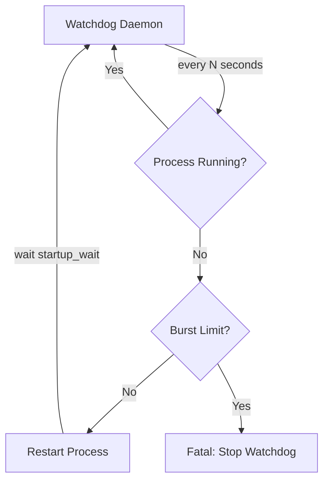

# Bytedesk Process Guard (Watchdog)

Bytedesk provides watchdog scripts for both **JAR-based** and **Docker Compose-based** deployments. These scripts continuously monitor the Bytedesk process and automatically restart it if it goes down, minimizing downtime in production environments.

## Overview

| Deployment Mode | Watchdog Script | Monitors |
| --- | --- | --- |
| JAR (standalone) | `scripts/watchdog.sh` | `secrets/bytedesk-starter.jar` Java process |
| Docker Compose | `deploy/docker/watchdog.sh` | `bytedesk` Docker container |

Both scripts share the same design principles:

- **Health checks** at configurable intervals
- **Auto-restart** when the process/container is detected as down
- **Burst protection** — stops auto-restarting if the process crashes repeatedly within a time window, preventing infinite restart loops
- **Structured logging** to a watchdog log file for auditing
- **Simple lifecycle commands**: `start`, `stop`, `status`, `restart`

## Architecture



## JAR Deployment Watchdog

### Location

```text
scripts/watchdog.sh
```

### Quick Start

```bash
cd scripts

# Start the JAR service; watchdog starts automatically after the JAR comes up
./start.sh

# Restart the JAR service; watchdog is also ensured running automatically
./restart.sh

# Stop the JAR service; watchdog stops automatically as part of shutdown
./stop.sh

# Start the watchdog (also starts the JAR if not running)
./watchdog.sh start

# Check status
./watchdog.sh status

# Stop the watchdog (does NOT stop the JAR)
./watchdog.sh stop

# Restart the watchdog
./watchdog.sh restart
```

The JAR lifecycle scripts (`start.sh` / `restart.sh` / `stop.sh`) return immediately and are fully decoupled from log viewing. Use `logs.sh` to follow the application or watchdog log:

```bash
cd scripts
./logs.sh app       # application log
./logs.sh watchdog  # watchdog log
./logs.sh all       # both (macOS: two Terminal windows; Linux: tmux)
```

The actual JAR file stays under `secrets/bytedesk-starter.jar`, while `scripts/` is the only command entry point for JAR deployment and watchdog management.

### Configuration

Override defaults via environment variables:

| Variable | Default | Description |
| --- | --- | --- |
| `WATCHDOG_CHECK_INTERVAL` | `10` | Seconds between health checks |
| `WATCHDOG_STARTUP_WAIT` | `60` | Seconds to wait after restart before the next check |
| `WATCHDOG_MAX_RESTARTS` | `5` | Maximum restarts within the burst window |
| `WATCHDOG_BURST_WINDOW` | `300` | Burst window in seconds (5 minutes) |
| `WATCHDOG_LOG_FILE` | `./logs/watchdog.log` | Watchdog log file path |

Example with custom configuration:

```bash
WATCHDOG_CHECK_INTERVAL=15 \
WATCHDOG_STARTUP_WAIT=120 \
WATCHDOG_MAX_RESTARTS=3 \
./watchdog.sh start
```

### Integration with systemd (Linux)

For production Linux servers, it is recommended to manage the watchdog as a systemd service:

```ini
# /etc/systemd/system/bytedesk-watchdog.service
[Unit]
Description=Bytedesk JAR Process Watchdog
After=network.target

[Service]
Type=forking
User=bytedesk
WorkingDirectory=/opt/bytedesk/scripts
ExecStart=/opt/bytedesk/scripts/watchdog.sh start
ExecStop=/opt/bytedesk/scripts/watchdog.sh stop
ExecReload=/opt/bytedesk/scripts/watchdog.sh restart
Restart=on-failure
RestartSec=10
Environment="WATCHDOG_CHECK_INTERVAL=10"
Environment="WATCHDOG_MAX_RESTARTS=5"

[Install]
WantedBy=multi-user.target
```

Enable and start:

```bash
sudo systemctl daemon-reload
sudo systemctl enable bytedesk-watchdog
sudo systemctl start bytedesk-watchdog
sudo systemctl status bytedesk-watchdog
```

### Integration with launchd (macOS)

For macOS, create a launchd plist:

```xml
<!-- ~/Library/LaunchAgents/com.bytedesk.watchdog.plist -->
<?xml version="1.0" encoding="UTF-8"?>
<!DOCTYPE plist PUBLIC "-//Apple//DTD PLIST 1.0//EN"
  "http://www.apple.com/DTDs/PropertyList-1.0.dtd">
<plist version="1.0">
<dict>
    <key>Label</key>
    <string>com.bytedesk.watchdog</string>
    <key>ProgramArguments</key>
    <array>
        <string>/bin/bash</string>
      <string>/path/to/scripts/watchdog.sh</string>
        <string>start</string>
    </array>
    <key>WorkingDirectory</key>
    <string>/path/to/scripts</string>
    <key>RunAtLoad</key>
    <true/>
    <key>KeepAlive</key>
    <true/>
    <key>StandardOutPath</key>
    <string>/path/to/scripts/logs/watchdog-launchd.log</string>
    <key>StandardErrorPath</key>
    <string>/path/to/scripts/logs/watchdog-launchd.log</string>
</dict>
</plist>
```

Load the service:

```bash
launchctl load ~/Library/LaunchAgents/com.bytedesk.watchdog.plist
```

## Docker Compose Watchdog

### Docker Location

```text
deploy/docker/watchdog.sh
```

### Docker Quick Start

```bash
cd deploy/docker

# Make sure the compose stack is already running
./start mysql artemis all

# Start the watchdog
./watchdog.sh start

# Check status
./watchdog.sh status

# Stop the watchdog (does NOT stop the container)
./watchdog.sh stop
```

### Docker Configuration

Override defaults via environment variables:

| Variable | Default | Description |
| --- | --- | --- |
| `WATCHDOG_CHECK_INTERVAL` | `10` | Seconds between health checks |
| `WATCHDOG_STARTUP_WAIT` | `90` | Seconds to wait after restart before the next check |
| `WATCHDOG_MAX_RESTARTS` | `5` | Maximum restarts within the burst window |
| `WATCHDOG_BURST_WINDOW` | `300` | Burst window in seconds (5 minutes) |
| `WATCHDOG_LOG_FILE` | `./watchdog.log` | Watchdog log file path |
| `WATCHDOG_CONTAINER_NAME` | `bytedesk` | Docker container name to monitor |
| `WATCHDOG_DB` | `mysql` | Database type (passed to start.sh) |
| `WATCHDOG_MQ` | `artemis` | Message queue type |
| `WATCHDOG_SCENARIO` | `standard` | Deployment scenario |

Example with call-center scenario:

```bash
WATCHDOG_DB=postgresql \
WATCHDOG_MQ=rabbitmq \
WATCHDOG_SCENARIO=call \
WATCHDOG_CHECK_INTERVAL=15 \
./watchdog.sh start
```

### How It Works

The Docker watchdog:

1. Checks if the `bytedesk` container is running via `docker inspect`
2. If the container is down with a non-zero exit code, it restarts **only the bytedesk service** using `docker compose up -d --no-deps bytedesk` — middleware services (MySQL, Redis, Elasticsearch, etc.) are left untouched
3. If the container exited cleanly (exit code `0`), the watchdog assumes an intentional stop and does **not** auto-restart
4. If the container crashes repeatedly (default: 5+ times in 5 minutes), the watchdog stops itself to prevent infinite restart loops

### Container Exit Codes

| Exit Code | Meaning | Watchdog Action |
| --- | --- | --- |
| `0` | Clean exit (likely intentional `docker stop`) | Skip auto-restart |
| `1` | Application error | Auto-restart |
| `137` | Killed by signal (OOM, `docker kill`) | Auto-restart |
| `143` | SIGTERM (graceful shutdown request) | Auto-restart |
| Other | Other errors | Auto-restart |

### Integration with systemd

For Docker-based deployments, systemd can manage the watchdog:

```ini
# /etc/systemd/system/bytedesk-docker-watchdog.service
[Unit]
Description=Bytedesk Docker Compose Watchdog
After=docker.service
Requires=docker.service

[Service]
Type=forking
User=bytedesk
WorkingDirectory=/opt/bytedesk/deploy/docker
ExecStart=/opt/bytedesk/deploy/docker/watchdog.sh start
ExecStop=/opt/bytedesk/deploy/docker/watchdog.sh stop
Restart=on-failure
RestartSec=10
Environment="WATCHDOG_CHECK_INTERVAL=10"

[Install]
WantedBy=multi-user.target
```

### Docker Restart Policy (Alternative)

As an alternative to the watchdog script, you can use Docker's built-in restart policy. Add to `compose/compose-bytedesk.yaml` under the `bytedesk` service:

```yaml
services:
  bytedesk:
    # ... other config ...
 restart: unless-stopped
```

However, the watchdog script provides additional benefits:

- **Burst protection** — prevents infinite restart loops
- **Structured logging** — audit trail of restarts
- **Status command** — easy inspection of process health
- **Platform-agnostic** — works the same way on Linux, macOS, and any Docker host

## Logging

Both watchdog scripts write structured logs with timestamps. Example log output:

```text
[2026-08-02 14:30:00] WATCHDOG: daemon started (pid=12345, check_interval=10s, ...)
[2026-08-02 14:35:22] WATCHDOG: bytedesk-starter.jar is DOWN! Attempting restart...
[2026-08-02 14:35:22] WATCHDOG: restarting bytedesk-starter.jar via restart.sh
[2026-08-02 14:36:22] WATCHDOG: restart.sh spawned (pid=12390), waiting 60s for JAR to start
[2026-08-02 14:40:10] WATCHDOG: bytedesk-starter.jar is DOWN! Attempting restart...
[2026-08-02 14:40:10] WATCHDOG: FATAL - 5 restarts in last 300s (limit: 5). Giving up.
```

Monitor the watchdog log:

```bash
tail -f scripts/logs/watchdog.log       # JAR mode
tail -f deploy/docker/watchdog.log      # Docker mode
```

## Best Practices

1. **Always set a reasonable burst window** — the default 5 restarts in 5 minutes prevents the server from thrashing if there is a persistent startup failure
2. **Pair with external monitoring** — use the watchdog alongside Prometheus + Grafana or an external uptime monitor; the watchdog handles local auto-recovery, while external monitoring provides visibility
3. **Review logs periodically** — frequent restarts indicate an underlying issue that needs investigation
4. **Use systemd/launchd in production** — this ensures the watchdog itself is restarted if it crashes
5. **Test failover** — manually kill the JAR/container process to verify the watchdog restarts it correctly before deploying to production

## Troubleshooting

### Watchdog won't start

```bash
# Check if another instance is already running
cat scripts/watchdog.pid

# Check the log for errors
tail -50 scripts/logs/watchdog.log
```

### JAR keeps crashing in a loop

The burst protection will stop the watchdog after `MAX_RESTARTS` restarts within `BURST_WINDOW`. Check:

1. Application logs at `starter/logs/bytedeskim.log`
2. System resources (memory, disk space)
3. Configuration validity

After fixing the issue, restart the watchdog:

```bash
./watchdog.sh restart
```

### Docker container shows exit code 137

Exit code `137` typically means the container was killed by the OOM killer (out of memory) or received a `SIGKILL`. Consider:

- Increasing container memory limits in `compose/compose-bytedesk.yaml`
- Checking for memory leaks in the application
- Reviewing JVM heap settings
