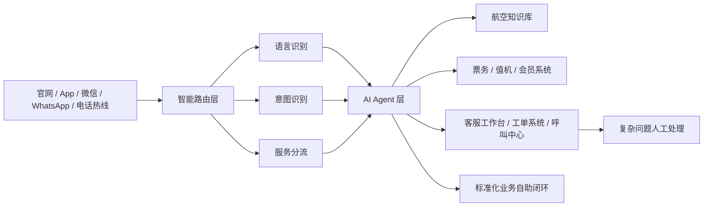
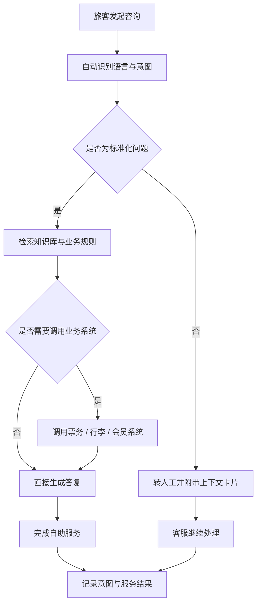

# 航空行业智能客服解决方案

## 概述

微语AI智能客服系统面向航空行业，将大语言模型与航空业务知识、业务系统深度融合，为航空公司打造覆盖"咨询—判断—办理"全流程的智能化旅客服务平台。方案聚焦多语言接待、智能意图识别、退改签与行李业务自助办理、知识库智能管理以及人机协同等核心场景，帮助航空公司在保持服务温度的同时，显著提升自助解决率与服务效率。

## 决策者摘要

| 维度 | 建议口径 |
| --- | --- |
| 方案定位 | 面向航空公司的全渠道 AI 客服与人机协同服务平台 |
| 优先解决的问题 | 多语言服务、高峰期排队、退改签与行李咨询、复杂问题转人工 |
| 一期可落地范围 | 官网、App、微信等文本渠道 + 知识库问答 + 票务规则解答 + 人工协同 |
| 核心预期收益 | 提升自助解决率、缩短等待时间、统一服务口径、降低重复咨询压力 |
| 后续扩展方向 | 航班动态、会员系统、语音热线、值机与票务系统深度对接 |

## 一期建设建议

- **优先接入文本渠道**：先覆盖官网、App、微信公众号/小程序等高频咨询入口，快速验证价值
- **先做高频标准问题**：优先处理退改签、行李额度、航班动态、会员权益等重复度高的问题
- **保留人工兜底机制**：复杂投诉、特殊旅客服务、异常航变等场景保持人工无缝接管
- **按阶段推进系统集成**：先接入知识库与票规，再逐步打通票务、会员、行李等核心系统

## 行业痛点与挑战

- **多语言旅客服务**：旅客来自不同国家和地区，需以普通话、粤语、英语等多语言提供一致的高质量服务
- **高峰咨询量暴增**：台风、延误、节假日等突发情况带来咨询量瞬时激增，传统人工客服难以承接
- **业务规则庞杂**：退改签政策、行李规定、特殊旅客服务等规则繁多且更新频繁，人工检索与答复效率低
- **跨系统信息孤岛**：票务系统、离港系统、会员系统等相互独立，客服难以一站式获取旅客完整信息

## 微语航空客服整体架构

微语航空客服方案采用分层架构，将多渠道旅客接入、智能分流、AI Agent 处理与人工服务有机串联：

- **渠道层**：官网、APP、微信公众号/小程序、WhatsApp、电话热线等多渠道统一接入
- **智能路由层**：对旅客诉求进行语义理解与意图识别，将标准化业务与复杂业务自动分流
- **AI Agent 层**：大语言模型结合航空知识库与业务工具，完成咨询解答与业务办理
- **人工服务层**：客服工作台、工单系统与呼叫中心协同，承接复杂业务与特殊旅客服务

## 核心能力

### 多语言智能接待

- **自动语种识别**：智能识别旅客使用的语言，并以旅客原生语言回复
- **多语言覆盖**：支持简体中文、繁体中文、英语、粤语等多语言服务
- **一致体验**：不同语种旅客获得统一、准确的服务口径

### 智能意图识别与分流

- **语义理解**：依托大语言模型穿透口语化表达，精准锁定真实诉求（如"把票往后挪几天"识别为改签）
- **标准化自助闭环**：常见咨询与标准化业务由 AI 自助办理完成
- **复杂场景自动转人工**：识别到复杂诉求时自动流转人工，并传递会话上下文，避免旅客重复描述

### 知识库智能管理

- **文档智能解析**：自动解析运输条款、票务规则等上百页业务文档，批量生成知识条目
- **FAQ 自动生成**：将文档拆解为标准问答对，降低知识库维护门槛
- **人工审核迭代**：支持"AI 解析 → 人工审核 → 入库"的闭环，持续沉淀与优化知识

### 业务系统深度对接

- **机票查询与退改签**：对接票务系统，实现航班查询、退票、改签的一站式办理
- **行李查询与理赔**：支持行李托运状态查询、异常行李申报与理赔引导
- **航班动态推送**：实时推送航班动态与延误通知，辅助旅客调整行程
- **会员权益查询**：对接会员系统，查询积分、等级与专属权益

### 全渠道统一体验

- **多渠道统一接入**：Web、App、微信、WhatsApp、电话热线统一服务入口
- **上下文跨渠道保持**：对话上下文在不同渠道间延续，旅客无需重复说明
- **工单全流程跟踪**：从咨询到办理再到售后，全流程记录与跟踪

## 典型应用场景

### 航班出行前咨询

- **预订前问询**：解答航线、票价规则、行李额度、舱位权益等常见问题
- **退改签政策说明**：根据票规自动说明是否可退、是否可改以及费用范围
- **特殊旅客服务申请**：为儿童、老人、孕妇、轮椅旅客等提供服务指引与申请入口

### 航班异常保障

- **延误与取消通知**：在航班延误、取消、改时等场景下自动推送通知与处理建议
- **批量咨询承接**：在恶劣天气或节假日高峰期间快速承接大规模重复咨询
- **应急分流**：针对情绪激动、投诉升级、多人同行改签等复杂场景快速转人工处理

### 行李与会员服务

- **行李服务支持**：查询托运行李状态，提供超规行李、遗失行李与理赔指引
- **会员权益查询**：回答里程、积分、等级权益、升舱资格等问题
- **增值服务推荐**：结合旅客画像推荐选座、额外行李、贵宾厅等增值服务

## 业务价值

- **提升自助服务能力**：将大量标准化、高频咨询前移至 AI 自助闭环，降低人工压力
- **缩短响应与等待时间**：高峰时段仍可稳定承接咨询，减少排队与流失
- **统一服务口径**：通过知识库与规则管理，保证多渠道、多语种答复一致
- **增强旅客体验**：在复杂业务中保留人工服务温度，在标准业务中提供更快响应
- **沉淀可运营数据**：基于意图、分流、满意度、工单结果持续优化服务策略

## 典型效果指标（参考目标）

以下指标为行业参考目标，用于方案评估与目标设定，非微语现网承诺值：

- 自助解决率 ≥ 70%
- 客户满意度 ≥ 95%
- AI 分流约 40% 重复性标准化咨询
- 排队率下降约 60%
- 平均响应时效显著提升

## 部署与集成

- **快速部署**：支持 Docker 一键部署，标准化交付，快速上线
- **系统对接**：提供与航空公司现有票务、值机、会员等系统的对接方案
- **安全合规**：遵循旅客数据保护要求，支持私有化与安全可控部署

## 落地模式

### 标准版

- **适用对象**：希望快速上线智能客服能力的航空公司与区域航司
- **核心能力**：多语言咨询、知识库问答、常见票务问题解答、基础转人工协同
- **落地特点**：部署周期短，优先覆盖官网、App、微信等文本客服入口

### 专业版

- **适用对象**：需要更深业务对接与运营分析能力的中大型航空公司
- **核心能力**：对接票务、会员、工单等系统，支持智能分流与服务数据分析
- **落地特点**：兼顾快速部署与业务定制，适合逐步扩展到更多渠道和场景

### 企业版

- **适用对象**：对安全隔离、稳定性与复杂集成要求较高的大型航司或航旅集团
- **核心能力**：私有化部署、统一客户服务平台、人机协同运营体系、深度系统集成
- **落地特点**：支持多业务线统一运营，满足高可用、审计与合规要求

## 能力映射

微语航空客服方案建立在微语已有平台能力之上，包括：

- 智能机器人（大模型 Agent 接待与多轮对话）
- 知识库（FAQ 管理与语义检索）
- 工单系统（全流程跟踪与 SLA 管理）
- 呼叫中心（语音客服与 IVR 支持）
- 多语言前端（简中、繁中、英语等多语言界面）

## 后续演进方向

- 语音场景多语言 ASR/TTS 支持（含粤语识别与合成）
- 按意图类别配置差异化路由策略，智能分派到对应技能组
- 规则变更的离线评估与回放，保障运营变更质量

## 常见问题

- **如何对接已有的票务系统？** 微语支持通过标准接口与现有票务、值机、会员等系统对接，可在方案实施阶段完成集成评估。
- **支持哪些语言？** 支持简体中文、繁体中文、英语等多语言，并可按需扩展粤语等更多语种。
- **部署周期多长？** 标准版可快速上线，具体周期取决于系统对接范围与定制化需求。

---

*微语AI智能客服系统助力航空公司数字化升级，让旅客服务更智能、更高效、更贴心。*
