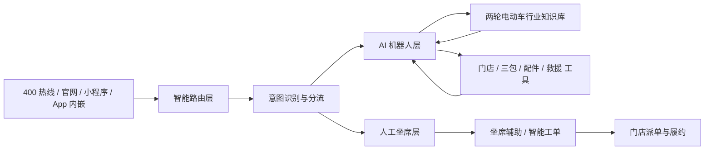
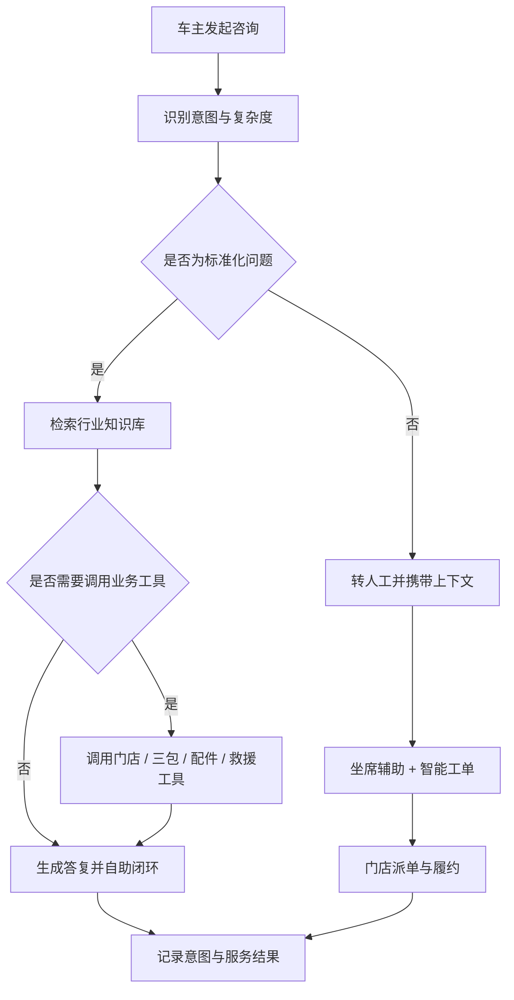

# 两轮电动车行业智能客服解决方案

## 概述

两轮电动车是国民日常出行的重要交通工具，行业头部品牌累计销量已突破一亿台，线下门店动辄数万家。庞大的用户基数与门店网络，带来了海量、高频且高度专业的客服诉求：三包政策查询、故障排查引导、App 智能功能使用、门店预约与道路救援等。

微语智能客服系统为两轮电动车品牌打造覆盖"热线 + 在线 + 门店履约"的一体化智能客服解决方案，将行业知识（车型参数、三包政策、故障排查、App 使用指南）与大语言模型深度融合，帮助品牌提升自助解决率、缩短服务时长、打通门店履约链路，让亿万车主享受"找得到门店、问得清政策、修得好车"的服务体验。

## 决策者摘要

| 维度 | 建议口径 |
| --- | --- |
| 方案定位 | 面向两轮电动车品牌的全渠道 AI 客服与门店履约协同平台 |
| 优先解决的问题 | 高峰接通率低、三包政策查询慢、故障排查专业性强、门店履约脱节 |
| 一期可落地范围 | 热线 + 在线文本渠道、行业知识库、机器人分层拦截、智能工单 |
| 核心预期收益 | 提升自助解决率、缩短服务时长、统一服务口径、打通门店派单 |
| 后续扩展方向 | 道路救援派单、配件库存、门店预约、VOC 分析等系统深度对接 |

## 行业概览：两轮电动车客服的挑战

### 规模化服务压力

- **用户基数庞大**：两轮电动车社会保有量以亿计，旺季、雨季、冬季电池问题集中爆发，话务量峰值波动大
- **门店网络庞大**：数万家线下门店承担销售与售后履约，客服需要快速定位门店、协调派单
- **高峰接通率难题**：传统呼叫中心高峰期排队严重，接通率下滑，用户体验差、投诉率高
- **客服培训成本高**：三包政策、配件型号、车型参数专业性强，新坐席上手慢，服务口径难统一

### 行业独特场景复杂

- **三包政策复杂**：整车、电池、电机、控制器、充电器等部件保修期限与条件各不相同，人工查询慢且易错
- **配件体系复杂**：车型迭代快、配件型号多，配件兼容性、价格、库存咨询诉求高频
- **智能功能咨询增多**：App 蓝牙连接、GPS 定位、远程解锁、电子围栏等新功能带来新型咨询
- **故障排查专业性强**：无法启动、电池亏电、刹车异响、仪表报错等问题需要专业引导，用户口语化描述与标准故障术语存在鸿沟

### 服务闭环与用户声音

- **服务依赖线下履约**：道路救援、预约维修、配件订购都需要与门店、救援系统联动，线上客服与线下履约脱节
- **用户声音难沉淀**：投诉与建议分散在热线、在线、门店各渠道，难以结构化分析并反哺产品与研发

### 核心场景一览

| 场景 | 典型诉求 | 服务关键点 |
| --- | --- | --- |
| 门店查询与导航 | 最近门店、营业时间、联系电话 | 地图定位、门店位置卡片、一键导航 |
| 三包政策查询 | 保修范围、保修期限、免费更换条件 | 按车型/部件精准匹配三包条款 |
| 配件查询与订购 | 配件型号、价格、库存、兼容性 | 对接库存系统、支持对话内查询订购 |
| App 使用问题 | 蓝牙连接、GPS 定位、远程解锁 | 分步骤图文/视频引导 |
| 故障排查引导 | 无法启动、异响、电池亏电、仪表报错 | 决策树式引导排查 |
| 道路救援 | 半路故障、拖车、上门维修 | 最近门店派单、救援进度跟踪 |
| 预约维修保养 | 预约时间、保养项目与费用 | 对接门店预约系统 |
| 配件以旧换新 | 电池以旧换新、旧车置换 | 报价查询、流程引导 |

## 微语两轮电动车客服解决方案

微语两轮电动车客服方案采用分层架构，将多渠道车主接入、智能分流、AI 机器人与人工坐席、门店履约有机串联：



### 📞 全渠道统一接入

- **400 热线服务**：语音机器人 7×24 小时接待，高峰期智能分流，人工坐席专注复杂问题
- **在线客服**：官网、微信公众号、微信小程序全渠道接入，统一工作台接待
- **App 内嵌客服**：车主 App 内嵌即时咨询入口，结合车辆信息提供个性化服务
- **统一客户识别**：全渠道统一用户档案，跨渠道连续服务，用户无需重复描述问题

### 🤖 AI 机器人分层服务

- **在线智能机器人**：基于大模型 FAQ 与 RAG 检索增强，自助解答三包政策、App 使用、故障排查等常见问题；语义理解支持口语化提问，"车打不着火"可自动映射到"无法启动"标准问题
- **热线语音机器人**：语音识别 + 意图识别自动解答高频来电，支持配置电动车专业术语热词，提升识别准确率
- **智能意图分流**：AI 判定意图复杂度——标准化问题（政策查询、门店查询）由机器人自助闭环；复杂问题（投诉、救援、纠纷）自动转人工，并携带完整上下文（意图、对话摘要、已匹配知识），坐席接手即了解全貌
- **重复咨询拦截**：高频重复问题优先由机器人闭环，降低转人工率，缓解高峰期人工压力

### 🧑‍💼 AI 坐席辅助

- **实时对话辅助**：语音会话实时转写，AI 同步识别用户意图，在坐席工作台侧边栏实时推送辅助信息
- **知识实时推荐**：用户提到"蓝牙连不上""车钥匙丢了"，AI 自动识别意图并推送完整排查步骤与操作视频建议，坐席一键发送给用户
- **话术建议**：基于历史优质会话实时推荐回复话术，新坐席也能专业应答
- **智能会话小结**：会话结束自动生成服务小结，沉淀服务记录，便于质检与复盘

### 🎫 智能工单

- **工单自动填充**：会话结束后 AI 自动提取用户问题、车型、故障分类、处理方案等字段预填工单，坐席核对十余秒即可提交，告别手写"小作文"
- **SLA 全流程管理**：工单流转、超时提醒、升级规则灵活配置，保障服务承诺兑现
- **门店派单联动**：维修、救援类工单自动派发对应门店，处理进度实时同步，用户可随时查询工单状态

### 📊 VOC 用户之声分析

- **主题自动聚类**：AI 对工单与会话内容自动聚类主题（电池问题、App 连接、刹车异响、门店服务态度等），高频问题一目了然
- **情感分析**：自动识别用户情绪，标注投诉热点与升级风险，重点工单优先处置
- **趋势报告**：按日/周/月自动生成 VOC 分析报告，推送给管理层，支撑产品与服务改进决策
- **问题溯源**：高频问题自动关联产品线/批次，让用户声音穿透到研发、制造部门，从源头推动产品改善

### 🗺️ 门店服务网络协同

- **门店智能查询**：对话中支持发送门店位置卡片（地址、营业时间、电话、导航入口），支持按城市、服务能力筛选门店
- **预约维修保养**：对话内完成门店维修/保养预约，自动关联工单与到店提醒
- **道路救援联动**：救援请求自动定位最近门店/救援点派单，救援进度实时跟踪
- **配件库存查询**：对接门店/仓库库存系统，对话内查询配件价格与库存状态

### 服务闭环流程



## 业务价值

- **提升自助解决能力**：将三包政策、App 使用、门店查询等高频标准化咨询前移至 AI 自助闭环，降低人工压力
- **缩短响应与等待时间**：高峰时段仍可稳定承接咨询，减少排队与流失，缓解旺季话务压力
- **统一服务口径**：通过行业知识库与策略管理，保证热线、在线多渠道答复一致，降低新人培训成本
- **打通门店履约**：维修、救援、预约类诉求自动联动门店派单，线上咨询与线下服务无缝衔接
- **沉淀可运营数据**：基于意图、分流、满意度、工单结果持续优化服务策略与产品改进

## 典型效果指标（参考目标）

以下指标为行业参考目标，用于方案评估与目标设定，非微语现网承诺值：

- 在线机器人自助解决率 ≥ 70%
- 高峰期接通率 ≥ 95%
- 平均通话 / 会话时长缩短 30% 以上
- 重复咨询拦截率提升，转人工率下降
- 工单创建效率显著提升（AI 预填 + 人工核对秒级提交）

## 行业知识库模板

微语为两轮电动车行业预置开箱即用的知识库分类模板与 FAQ 示例，支持一键导入，快速搭建行业知识体系，并可按品牌自有车型与政策扩展。

### 预置分类体系

```text
两轮电动车行业知识库
├── 产品与车型
│   ├── 车型参数
│   ├── 电池规格
│   ├── 续航与充电
│   └── 智能功能
├── 三包与售后政策
│   ├── 整车三包
│   ├── 电池三包
│   ├── 电机/控制器三包
│   └── 非保修场景
├── App 与智能设备
│   ├── 蓝牙连接
│   ├── GPS 定位
│   ├── 远程解锁
│   └── 账号与设备绑定
├── 故障排查
│   ├── 无法启动
│   ├── 电池亏电
│   ├── 刹车/异响
│   ├── 仪表报错
│   └── 充电异常
├── 门店与履约服务
│   ├── 附近门店
│   ├── 预约维修
│   ├── 道路救援
│   └── 配件查询
└── 投诉与 VOC
    ├── 门店服务投诉
    ├── 产品质量反馈
    ├── 维修进度催办
    └── 高频问题上报
```

### FAQ 数据结构

行业 FAQ 模板统一采用以下字段，便于导入微语知识库并支撑意图分流与工具联动：

| 字段 | 说明 |
| --- | --- |
| question | 标准问题 |
| answer | 标准答案 |
| category | 所属分类（对应预置分类体系） |
| tags | 检索标签（含口语化说法） |
| intent | 意图标识，用于智能分流 |
| handoffRequired | 是否建议转人工 |
| relatedTools | 关联业务工具（如门店查询、配件查询） |
| locale | 语言 |
| source | 来源（模板预置/人工录入） |
| reviewStatus | 审核状态（草稿/已审核） |

### FAQ 示例（节选）

| 问题 | 分类 | 建议转人工 |
| --- | --- | --- |
| 我的电动车打不着火怎么办？ | 故障排查/无法启动 | 否，先自助排查 |
| 电池亏电充不进电怎么处理？ | 故障排查/电池亏电 | 否 |
| App 蓝牙连接不上怎么办？ | App 与智能设备/蓝牙连接 | 否 |
| 电池三包期是多久？ | 三包与售后政策/电池三包 | 否 |
| 车架号在哪里可以看到？ | 产品与车型/车型参数 | 否 |
| 最近的维修门店在哪里？ | 门店与履约服务/附近门店 | 否，调用门店查询工具 |
| 怎么预约门店保养？ | 门店与履约服务/预约维修 | 否，调用预约服务工具 |
| 车半路坏了我需要救援 | 门店与履约服务/道路救援 | 是，救援派单 |
| 刹车时有异响是什么问题？ | 故障排查/刹车异响 | 视排查结果 |
| 电池以旧换新怎么估价？ | 门店与履约服务/配件查询 | 视门店政策 |
| 门店师傅服务态度差，我要投诉 | 投诉与 VOC/门店服务投诉 | 是 |
| GPS 定位不准怎么办？ | App 与智能设备/GPS 定位 | 否 |

完整行业 FAQ 模板（50+ 条，覆盖产品、三包、App、故障、门店、投诉六大类）以 JSON 格式随方案提供，支持一键导入微语知识库后人工审核启用。

## 集成方案

微语通过标准 API 与 MCP Tools（Model Context Protocol 工具）生态对接企业现有系统，让机器人在对话中安全调用业务数据，实现"对话即业务"：

| 集成工具 | 能力说明 | 对接系统示例 |
| --- | --- | --- |
| 门店查询工具 | 按位置/城市/服务能力查询门店信息 | 门店管理系统、地图服务 |
| 三包查询工具 | 按车型/部件/购车日期判定保修状态 | DMS 经销商管理系统、三包政策库 |
| 配件查询工具 | 配件型号、价格、库存、兼容性查询 | ERP、库存管理系统 |
| 预约服务工具 | 门店维修/保养预约的创建与查询 | 门店预约系统 |
| 道路救援工具 | 救援派单与救援进度跟踪 | 救援调度系统 |

同时支持与 CRM、工单系统、BI 分析平台等企业系统的标准集成；所有工具调用均支持权限控制与操作审计，保障数据安全。

## 部署方案

### 品牌总部版

- **适用对象**：两轮电动车品牌总部
- **核心能力**：全渠道客服、AI 机器人、坐席辅助、VOC 分析、全网点服务监控
- **部署方式**：私有云/公有云部署，支持信创环境

### 总分门店协同版

- **适用对象**：品牌总部 + 区域代理 + 大规模线下门店
- **核心能力**：总部统一知识库与政策口径，门店分级接待与派单协同
- **部署方式**：私有化部署，支持多租户门店体系

### SaaS 快速版

- **适用对象**：中小品牌与区域经销商
- **核心能力**：标准客服功能 + 行业知识库模板，开箱即用
- **部署方式**：云端 SaaS，最快当天上线

## 案例参考：行业头部企业实践

以下是两轮电动车行业头部企业公开的数字化客服实践方向（引自公开报道，供方案评估参考）：

- **统一坐席工作台**：将接线、知识库、工单等工具集成到一个系统，客服告别多系统切换，单次切换耗时从 20 秒级降为 0
- **AI 坐席辅助**：实时对话转写与语义识别，自动总结要点、推荐回复话术与产品知识点；通话结束 AI 自动生成工单摘要，客服核对十几秒即可提交
- **机器人分层拦截**：热线机器人解决率从 20% 提升至 42%，在线机器人解决率达 78%，高峰期接通率从 88% 提升至 95%，平均通话时长缩短 33%（以上为该企业公开数据）
- **VOC 穿透组织**：用户反馈与高频问题精准拆解，分发至研发、制造等事业部，从源头推动产品改善

微语方案的 AI 坐席辅助、智能意图分流、智能工单、VOC 分析等能力与上述实践方向一一对应，可以帮助两轮电动车品牌以更低的成本、更短的周期实现同类数智化转型。

## 相关解决方案

- [汽车行业智能客服解决方案](auto.md)：四轮汽车全生命周期服务
- [零售消费品行业智能客服解决方案](retail.md)：商品咨询、订单物流、会员服务
- [工单系统解决方案](ticket.md)：智能工单分配与流程自动化
- [知识库解决方案](kbase.md)：智能知识检索与内容管理
