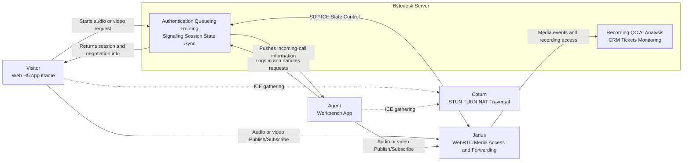

# Bytedesk WebRTC Customer Service

Bytedesk WebRTC Customer Service is the real-time audio and video service layer in the Bytedesk support system. It is designed for web pages, H5, apps, embedded iframes, and agent workbenches, and provides a complete path from session setup and device checks to call handling, media transport, and recording-oriented extensibility.

It is not just a standalone call page. It is a coordinated capability built from visitor clients, agent clients, the Bytedesk server, Janus, and Coturn. From a business perspective, it can be understood as a unified way to embed real-time communication into customer service workflows.

## Capability Overview

The current Bytedesk WebRTC customer service system covers the following core capabilities.

### 1. Multiple Service Modes

- Audio customer service for quick voice-based communication.
- Video customer service for remote demos, identity verification, and face-to-face support.
- Screen sharing for remote assistance and operational guidance.
- One-way or two-way media modes depending on business requirements.

### 2. Visitor-Side Calling Features

- Visitors can manually start audio or video calls.
- Embedded pages can automatically launch audio or video customer service in iframe, WebView, or floating-window scenarios.
- The page can check microphone, camera, and speaker status before a call starts.
- Visitors can cancel, mute, hang up, enable or disable video, and switch cameras when supported.
- The UI can display call status, call duration, and device readiness feedback.

### 3. Agent-Side Service Features

- The agent workbench can receive incoming audio and video call requests.
- Agents can answer, reject, or hang up, while keeping call state synchronized with the visitor side.
- The workbench can continue to display session, customer, and business context during the call.
- The service flow can be integrated with queueing, routing, ticketing, CRM, and other Bytedesk support modules.

### 4. Embedded Window Features

- Support for minimize, maximize, and close operations in embedded windows.
- Support for ringtone and call notification sound toggles.
- Suitable for support widgets, side panels, floating windows, and mobile containers.

### 5. Platform and Business Extensibility

- ICE server configuration can be delivered dynamically by the backend.
- Recording directory settings are available for future recording, quality inspection, and auditing scenarios.
- The system can extend Janus capabilities such as VideoRoom and AudioBridge.
- It can be connected with AI analysis, recording, monitoring, quality control, and CRM modules.

## Typical Use Cases

Bytedesk WebRTC customer service is suitable for scenarios such as:

- Escalating from text chat to voice or video support.
- Running product demos and high-value consultations.
- Troubleshooting issues remotely through video or screen sharing.
- Supporting healthcare, education, finance, or public service workflows that require richer interaction.
- Embedding one-click audio and video support into apps, H5 pages, or portals.

## Architecture Overview

Bytedesk WebRTC customer service follows a clear separation between business logic and media infrastructure. The Bytedesk server handles customer service workflows, authentication, queueing, routing, signaling, and state synchronization. Janus handles media session access and forwarding. Coturn handles NAT traversal and TURN relay fallback.



### Layer Responsibilities

#### Visitor Side

- Starts audio, video, or screen-sharing requests.
- Performs device checks and permission prompts.
- Captures local media and participates in WebRTC negotiation.
- Displays call status, remote media, local preview, and control actions.

#### Agent Side

- Receives incoming-call notifications.
- Participates in media session setup and state synchronization.
- Continues to work with support context inside the agent workbench.

#### Bytedesk Server

- Handles authentication, organization context, queueing, and agent allocation.
- Manages threads, sessions, support status, and call lifecycle.
- Handles signaling exchange including SDP, ICE, answer, reject, and hang-up states.
- Connects the call flow with recording, QC, AI, CRM, and ticketing modules.

#### Coturn

- Provides STUN for public address discovery.
- Provides TURN relay fallback in complex network environments.
- Improves call success rate for enterprise networks, weak networks, and cross-operator access.

#### Janus

- Provides WebRTC media access, room management, and plugin-based extensibility.
- Supports capabilities such as AudioBridge, VideoRoom, SIP, and Admin APIs.
- Serves as the media-layer foundation for multi-party calls, relay-based processing, and recording-related scenarios.

## Typical Call Flow

1. The visitor opens the support page and initializes visitor identity, thread context, and device readiness.
2. The visitor starts an audio or video request, and the Bytedesk server completes authentication, queueing, and agent allocation.
3. The server returns session identifiers, Janus access parameters, and negotiation context to both sides.
4. The visitor side and agent side gather ICE candidates from STUN and TURN services.
5. If direct connectivity is not reliable enough, TURN relay is used as a fallback path.
6. Janus establishes the media session and forwards audio and video streams.
7. Session events such as answer, reject, cancel, hang-up, timeout, or recording remain orchestrated by the Bytedesk server.

## Document Guide

For detailed topic-based documentation, continue with the following pages:

- Audio customer service for voice-call handling and in-call controls.
- Video customer service for camera control and one-way or two-way media modes.
- Screen sharing for remote assistance scenarios.
- Stun-Turn for NAT traversal and connectivity concepts.
- Janus for media server capabilities, deployment, and management APIs.
- Coturn for STUN and TURN deployment, authentication, and network planning.

## System Configuration

The main service-side WebRTC configuration lives in the starter module under 32-webrtc.properties. The split is intentional:

- 31-call-freeswitch.properties is for calling and FreeSWITCH-related settings.
- 32-webrtc.properties is for bytedesk.webrtc.janus.* settings.

In other words, Janus and WebRTC-related keys should stay in 32-webrtc.properties rather than being mixed back into the call configuration file.

### 1. Enabling Janus Integration

```properties
bytedesk.webrtc.janus.enabled=true
```

- Controls whether Janus backend integration is enabled.
- When enabled, the system can use related flows for VideoRoom, AudioBridge, SIP, and Admin access.
- If Janus is not available in a given environment, this can be turned off, but the related media capabilities will be limited.

### 2. Janus Main Connection URL

```properties
bytedesk.webrtc.janus.ws-url=ws://127.0.0.1:18188/janus
```

- This is the WebSocket endpoint used by the service side to connect to the Janus API.
- In local development it usually points to the port exposed by docker compose.
- In production it should typically use a public or internal gateway domain such as wss://janus.weiyuai.cn/janus.
- WSS is recommended over plain WS in production.

### 3. Logging and Timeout Settings

```properties
bytedesk.webrtc.janus.log-enabled=true
bytedesk.webrtc.janus.operation-timeout-ms=10000
bytedesk.webrtc.janus.health-timeout-ms=3000
```

- log-enabled controls Janus SDK logging and is useful when debugging negotiation or connectivity issues.
- operation-timeout-ms defines the timeout for a single Janus operation.
- health-timeout-ms defines the timeout for health-check style requests.
- Local debugging often benefits from more relaxed timeouts, while production values should match actual latency and load patterns.

### 4. ICE Server Configuration

```properties
bytedesk.webrtc.janus.ice-servers[0].urls=stun:127.0.0.1:13478
bytedesk.webrtc.janus.ice-servers[1].urls=turn:127.0.0.1:13478?transport=udp
bytedesk.webrtc.janus.ice-servers[1].username=bytedesk
bytedesk.webrtc.janus.ice-servers[1].credential=bytedesk123
```

- These values are used as the backend source of dynamic ICE settings.
- Clients such as visitorWebrtc and desktop fetch these values from backend APIs before initializing Janus.
- A typical setup should include at least one STUN server and one TURN server.
- TURN credentials must match the actual Coturn-side configuration.
- TCP or TLS relay endpoints can be added when required.

Typical production examples use domain-based addresses such as:

```properties
bytedesk.webrtc.janus.ice-servers[0].urls=stun:coturn.weiyuai.cn:3478
bytedesk.webrtc.janus.ice-servers[1].urls=turn:coturn.weiyuai.cn:3478
```

### 5. Janus Admin API

```properties
bytedesk.webrtc.janus.admin.enabled=true
bytedesk.webrtc.janus.admin.ws-url=ws://127.0.0.1:17188/janus
bytedesk.webrtc.janus.admin.http-url=http://127.0.0.1:18089/janus
bytedesk.webrtc.janus.admin.secret=janusoverlord
```

- admin.enabled controls whether the Janus Admin API is enabled.
- admin.ws-url is the Admin WebSocket endpoint.
- admin.http-url is commonly used for backend ping, health checks, and management access.
- admin.secret must match the admin_secret configured in Janus itself.
- In production, avoid default secrets and restrict admin endpoints through ACLs, internal routing, or reverse proxies.

### 6. Recording Directory

```properties
bytedesk.webrtc.record.dir=uploads/webrtc-video-recordings
```

- Specifies where audio and video recording files should be stored.
- In deployment, this path should usually be backed by persistent storage rather than ephemeral container storage.
- This directory becomes especially important when integrating recording, playback, auditing, or quality review workflows.

### 7. Default Room Parameters

```properties
bytedesk.webrtc.janus.video-room.default-publishers=6
bytedesk.webrtc.janus.video-room.default-permanent=false
bytedesk.webrtc.janus.audio-bridge.default-permanent=false
```

- video-room.default-publishers defines the default publisher limit for VideoRoom.
- default-permanent=false means rooms are created as non-permanent by default, which fits session-based support scenarios.
- If the business requires long-lived rooms or fixed conference spaces, the Janus-side strategy can be adjusted accordingly.

## Docker Compose Configuration

If you run Bytedesk with Docker Compose instead of using the starter profiles directly, the recommended pattern is to keep normal WebRTC addresses and default parameters inside the compose files, and move only sensitive values into [deploy/docker/.env](deploy/docker/.env) or [deploy/docker/.env.example](deploy/docker/.env.example), for example `JANUS_ADMIN_SECRET`.

There is one important runtime difference to keep in mind:

- In local `.properties` files, values such as `127.0.0.1:18188` and `127.0.0.1:13478` usually refer to host-mapped ports.
- Inside a Docker Compose container, `127.0.0.1` points to the current `bytedesk` container itself, not to Janus or Coturn.
- For compose deployments, container-to-container access should therefore use Docker network service names such as `bytedesk-janus` and `bytedesk-coturn`.

The current recommended combination is:

- The application service uses [deploy/docker/compose-app-bytedesk.yaml](deploy/docker/compose-app-bytedesk.yaml)
- The WebRTC infrastructure uses `compose-scenario-webrtc.yaml`
- Both join the same `bytedesk-network`, so the application container can reach Janus and Coturn by service name

### Values That Belong in `.env`

The current recommendation is that `.env` should only keep secrets or values that truly vary per environment. For the WebRTC part, the main example is:

```dotenv
JANUS_ADMIN_SECRET=janusoverlord
```

### How Compose Should Reference It

In the compose files, regular WebRTC settings stay directly in the YAML, while secrets are injected from `.env`. The current compose files use the following pattern:

```yaml
    BYTEDESK_WEBRTC_JANUS_ENABLED: "true"
    BYTEDESK_WEBRTC_JANUS_WS_URL: ws://bytedesk-janus:8188/janus
    BYTEDESK_WEBRTC_JANUS_ADMIN_HTTP_URL: http://bytedesk-janus:8088/janus
    BYTEDESK_WEBRTC_JANUS_ADMIN_SECRET: ${JANUS_ADMIN_SECRET:-janusoverlord}
    BYTEDESK_WEBRTC_RECORD_DIR: /app/uploads/webrtc-video-recordings
```

This structure keeps responsibilities clearer:

- Normal defaults remain readable directly in the compose files.
- `.env` is not polluted with a large set of ordinary WebRTC parameters.
- Only sensitive or environment-specific values, such as the Janus admin secret, are externalized.

### Mapping Notes

- `JANUS_ADMIN_SECRET` is the external secret source for `BYTEDESK_WEBRTC_JANUS_ADMIN_SECRET`.
- `COTURN_USER` and `COTURN_PASS` can continue to be reused as the TURN username and password source for ICE settings.

### Compose Deployment Notes

- If Janus and Coturn run inside the same Compose network, use service names rather than `127.0.0.1`.
- If Janus or Coturn run on external hosts or in a separate cluster, replace those values with the actual reachable internal address or public domain.
- `BYTEDESK_WEBRTC_RECORD_DIR` should use an absolute in-container path and should be backed by persistent storage.
- `JANUS_ADMIN_SECRET` should be replaced in production and should ideally be managed through your secret management flow rather than kept at the default value.

## Configuration Recommendations

### Local Development

- Use locally exposed Janus and Coturn addresses from docker compose.
- Keep logs enabled while debugging SDP, ICE, device, or connection-establishment issues.
- Verify ws-url, admin.http-url, and TURN credentials against the actual container settings.

### Production

- Use public domains and WSS or HTTPS endpoints rather than plain WS or HTTP.
- Protect the Janus Admin API with strong secrets and network-level access control.
- Mount the recording directory to persistent storage.
- Plan TURN bandwidth, relay port range, and monitoring in advance.
- Ensure the application profile chain imports 32-webrtc.properties correctly.

## Related Documents

- [Audio](./audio.md)
- [Video](./video.md)
- [Screen Sharing](./screen_sharing.md)
- [Stun-Turn](./stun-turn.md)
- [Janus](./janus.md)
- [Coturn](./coturn.md)
