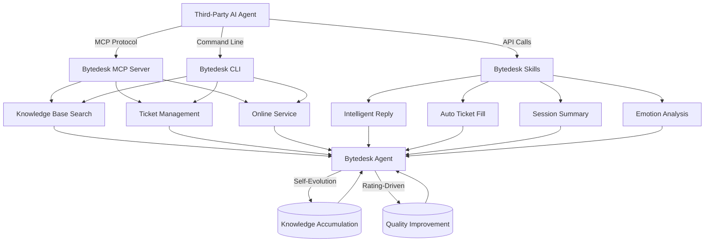

The core direction for Bytedesk 3.x is crystal clear: **Focus on Agent, building an agent-centric next-generation customer service platform**.

This is a product paradigm shift: from a "feature-driven customer service tool" to an "agent-driven business platform."

This article addresses three questions:

- What is Bytedesk 3.x's Agent roadmap?
- How do the MCP/CLI/Skills modules empower third-party agents?
- How to make AI easier to use Bytedesk?

<!-- truncate -->

## 1. Bytedesk 3.x Agent Roadmap: Five-Step Evolution

Bytedesk 3.x divides Agent capability development into five progressive phases, each building on the previous, gradually forming a flywheel of agent self-improvement.

### Phase 1: Agent Reception — Making Agent the First Customer Service Entry Point

Building on Bytedesk's existing bot capabilities, Agent Reception goes beyond simple keyword matching or FAQ retrieval by delivering:

- **Multi-turn Context Understanding**: Accurately track user intent without "amnesia" across conversation turns
- **Intent Recognition and Classification**: Automatically determine whether a user is consulting, complaining, seeking after-sales service, or in another scenario
- **Emotion Detection**: Real-time identification of shifting user emotions, proactively calming situations or escalating to human agents before negativity escalates
- **Active Guidance**: Not just answering questions, but guiding users through complex business workflows

The goal for this phase: for the Agent to become a truly qualified "digital employee" capable of independently handling over 70% of standard service scenarios.

### Phase 2: Agent Rating — Establishing a Quantifiable Quality Framework

With reception capabilities in place, an evaluation system is essential to measure the quality of Agent work. Bytedesk will build a multi-dimensional Agent evaluation model:

- **Automatic Evaluation Dimensions**: Answer accuracy, problem resolution rate, response speed, customer satisfaction
- **Human Review Mechanisms**: Periodic sampling for manual evaluation to calibrate auto-scoring bias
- **Failure Sample Tagging**: Automatically identify and tag conversations where the Agent failed, for future optimization
- **Rating Dashboard**: Provide administrators with Agent quality trends and weak-point analysis

Rating is not only a measurement tool — it is the core data source driving Agent evolution.

### Phase 3: Agent Knowledge Base Enhancement — Building a Continuously Learning Knowledge Foundation

An agent's capability ceiling is largely determined by the quality of its knowledge base. Bytedesk 3.x upgrades the knowledge base from "static document management" to a "dynamic knowledge engine":

- **Automatic Knowledge Accumulation**: Auto-extract high-quality Q&A pairs from highly-rated conversations, candidate them for inclusion
- **Knowledge Freshness Management**: Automatically identify outdated knowledge and prompt knowledge administrators to update
- **Knowledge Graph Construction**: Establish relationships across FAQs, documents, and tickets to improve retrieval precision
- **Multimodal Knowledge Support**: Unified management and retrieval of images, attachments, videos, and other non-text knowledge

The knowledge base is no longer an isolated "data repository" — it becomes an intelligent knowledge engine deeply coupled with the Agent.

### Phase 4: Agent Self-Evolution — Realizing Autonomous Agent Growth

This is Bytedesk Agent's most differentiating capability. Self-evolution is not merely "periodic model updates" — it is a system-level self-improvement mechanism:

- **Conversation-Based Learning**: Extract insights from every successful and failed service interaction, automatically optimizing response strategies
- **Skill Auto-Optimization**: Adjust Skill trigger conditions, execution logic, and output formats based on usage effectiveness
- **Cross-Tenant Experience Transfer**: Abstract excellent experiences into reusable patterns without compromising privacy
- **Closed-Loop Feedback-Driven**: Rating data → Problem diagnosis → Knowledge update → Skill optimization → Outcome verification, forming a complete evolution loop

The vision for this phase: **the longer Bytedesk is used, the smarter the Agent becomes**.

### Phase 5: Agent Reception (Advanced) — Achieving Expert-Level Service Quality

After progressing through rating-driven optimization, knowledge enhancement, and self-evolution, Agent reception capabilities will see a qualitative leap:

- **Complex Scenario Handling**: Process multi-department collaborative, multi-step complex business workflows
- **Human-Agent Collaboration Enhancement**: When human intervention is needed, provide complete context summaries and action recommendations
- **Personalized Service**: Deliver tailored experiences based on user profiles and interaction history
- **Proactive Service**: Reach out to users at the right moment, rather than passively waiting

## 2. MCP/CLI/Skills: Opening Bytedesk's Doors to Third-Party Agents

Another strategic investment of Bytedesk 3.x is the enhancement of three major open-capability modules: **MCP**, **CLI**, and **Skills**. The core goal: **enable any third-party AI Agent to conveniently invoke Bytedesk's capabilities**.

### MCP Module: Standardized Agent Communication Protocol

The Bytedesk MCP module is based on the [Model Context Protocol](https://modelcontextprotocol.io/) standard, providing standardized tool-calling interfaces for third-party agents:

```
┌─────────────────┐     MCP Protocol     ┌─────────────────┐
│  3rd-Party Agent │ ◄──────────────────► │ Bytedesk MCP    │
│ (Claude/Copilot) │                      │     Server      │
└─────────────────┘                      └────────┬────────┘
                                                  │
                    ┌─────────────────────────────┼─────────────────────────────┐
                    │                             │                             │
              ┌─────▼─────┐              ┌───────▼───────┐            ┌─────────▼─────────┐
              │  Knowledge  │              │    Ticket      │            │   Online Service   │
              │  Search Tool│              │  Management    │            │       Tool         │
              └───────────┘              └───────────────┘            └───────────────────┘
```

Currently available core MCP tools:

| Category | Tool Name | Description |
|----------|-----------|-------------|
| Knowledge Base | `search_knowledge` | Search FAQs and documents |
| Knowledge Base | `list_knowledge_categories` | Retrieve knowledge base category tree |
| Tickets | `create_ticket` | Create a new ticket |
| Tickets | `query_ticket` | Check ticket status and details |
| Tickets | `update_ticket` | Update ticket information |
| Online Service | `create_thread` | Create a customer service conversation |
| Online Service | `send_message` | Send a customer service message |
| Online Service | `query_thread_status` | Query conversation status |

More tools will be opened progressively, covering call center, CRM, analytics, and other scenarios.

### CLI Module: Command-Line Entry Point for Developers and Agents

Bytedesk CLI provides a unified command-line entry point for developers and AI agents, supporting:

- **Basic Operations**: Login authentication, tenant switching, environment configuration
- **Knowledge Base Management**: CRUD for FAQs, batch import/export
- **Ticket Operations**: Create, query, transition, and close tickets
- **Service Operations**: Conversation queries, agent status management, data statistics
- **Agent Integration**: Script-based invocation of Bytedesk capabilities for CI/CD or automation pipelines

Usage examples:

```bash
# Login to Bytedesk
bytedesk login --email admin@email.com --password admin

# Search knowledge base
bytedesk knowledge search "How to return an item"

# Create a ticket
bytedesk ticket create --title "User reports login error" --category "Technical Support"

# List active conversations
bytedesk thread list --status active --limit 20
```

### Skills Module: Reusable Agent Capability Units

Skills are configurable, reusable execution units for Bytedesk Agents. Each Skill defines clear inputs, outputs, trigger conditions, and execution logic. Beyond direct use by Bytedesk's own Agents, third-party agents can also:

- **Discover Available Skills**: Retrieve the Skills catalog via the MCP interface
- **Invoke Skills to Execute Tasks**: Pass parameters and receive structured execution results
- **Compose Skills for Complex Workflows**: Chain multiple Skills into complete automation flows

Currently available core Skills:

- `intelligent_reply`: Intelligent response generation
- `auto_ticket_fill`: Intelligent ticket filling
- `session_summary`: Conversation summarization
- `emotion_analysis`: Emotion analysis
- `knowledge_navigation`: Knowledge navigation

## 3. Making AI Easier to Use Bytedesk

The ultimate goal of Bytedesk 3.x is to **make Bytedesk the preferred customer service infrastructure for AI Agents**. This manifests in three dimensions:

### 1. Plug-and-Play

Any AI platform supporting the MCP protocol (Claude Desktop, Codex, Cursor, VS Code Copilot, etc.) can directly connect to Bytedesk without additional adapter development.

### 2. Semantic Tools

Every MCP Tool and Skill provided by Bytedesk comes with complete semantic descriptions, enabling AI Agents to autonomously understand the purpose, parameter constraints, and applicable scenarios of each tool — achieving an intelligent closed loop of "Understand → Select → Call → Feedback."

### 3. Open Ecosystem

Bytedesk 3.x's MCP/CLI/Skills modules are all open-source. The community can contribute new Tools and Skills, and even build vertical-industry intelligent customer service solutions atop Bytedesk's Agent capabilities.



## 4. Summary

Bytedesk 3.x is not a simple version upgrade — it is a leap in product philosophy. We are shifting from "building customer service software" to "building agent infrastructure":

- **Internally**: Through the five-phase roadmap of Agent Reception → Rating → Knowledge Enhancement → Self-Evolution → Advanced Reception, build a customer service system capable of self-improvement
- **Externally**: Through the three open modules of MCP/CLI/Skills, enable any AI Agent to conveniently use Bytedesk's knowledge base, tickets, and customer service capabilities

Make AI easier to use Bytedesk, and make Bytedesk better serve AI — that is the core mission of Bytedesk 3.x.
