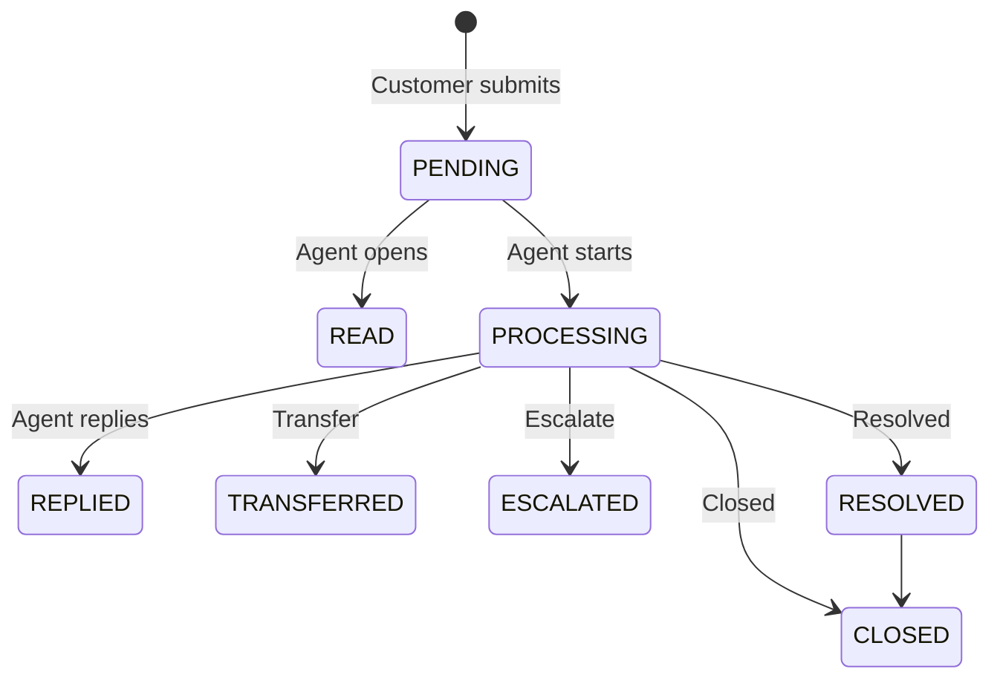

Every customer rating is an opportunity to improve your product and service. Yet many teams still treat feedback collection as an afterthought — a "message board" bolted onto the bottom of a website, where submissions pile up with no one to triage them. Channels are scattered, there's no standard template, and once feedback comes in, nobody follows up. It just sinks to the bottom.

The Bytedesk **Voice of Customer (VOC)** module exists to solve exactly three pain points: **collection is hard, management is messy, and the loop never closes**. It turns feedback from a decoration into a configurable, trackable, analyzable, closed-loop customer experience management system.

<!-- truncate -->

## 1. VOC Is Not a Message Board — It's a Feedback Management System

The common mental model of "feedback" is still a form on a website that emails someone when filled out. The problems with that approach:

- **Scattered collection**: website forms, email, chat conversations, social media — feedback is everywhere, impossible to manage centrally.
- **No standard**: every channel asks different questions, so you can't compare or aggregate.
- **No closed loop**: once submitted, who handles it? What's the status? When does the customer get a reply? It's all tracked in someone's head.

The VOC module stitches it all together:

1. **Unified templates** — a configurable feedback template defines what to collect, how to score, and how to process.
2. **Multi-channel collection** — public links, conversation-bound, agent-created — all converge into one place.
3. **Closed-loop handling** — every item has a status flow, from PENDING to RESOLVED, fully traceable.

## 2. Industry-Standard Survey Types, Built In

VOC ships with a `FeedbackTypeEnum`, supporting multiple feedback types. Each template auto-adapts its rating widget and reason options to its type:

| Type | Use Case | Scale |
| ---- | -------- | ----- |
| **CSAT** (Customer Satisfaction) | Measure satisfaction with a specific service/product experience | 1–5 stars |
| **NPS** (Net Promoter Score) | Measure recommendation willingness, predict loyalty | 0–10 |
| **FEEDBACK** | General product/service feedback | configurable |
| **COMPLAINT** | Formal complaints | configurable |
| **REPORT** | Report violations/issues | configurable |
| **SURVEY** | Custom surveys | configurable |
| **PRAISE** / **SUGGESTION** | Positive feedback / improvement ideas | configurable |

**CSAT** and **NPS** are the two most widely used standardized metrics, and people often conflate them. A quick clarification:

- **CSAT is *retrospective*** — the customer just finished an interaction; you ask whether they were satisfied. Best placed after a chat ends or a ticket closes. A common split is 1–3 = dissatisfied, 4–5 = satisfied.
- **NPS is *forward-looking*** — you ask "how likely are you to recommend us to a friend?" It segments customers into three groups:
  - **Promoters (9–10)**: loyal customers who actively spread word of mouth for you.
  - **Passives (7–8)**: satisfied but unenthusiastic; easily poached by competitors.
  - **Detractors (0–6)**: unhappy; may actively discourage others from buying.

The two are complementary, not substitutes — CSAT measures a single experience, NPS measures long-term loyalty.

## 3. Configurable Feedback Templates: One Template Per Feedback Scenario

At the heart of VOC is the **Feedback Template (FeedbackSettings)**. You don't write code for each survey — you create a template in the admin backend and configure:

- **Basic info**: template name, feedback type, enabled toggle, rating scale, positive threshold (the score at/above which counts as "positive"), max selectable reasons.
- **Copy**: title, positive question (e.g. "What did you like?"), negative question (e.g. "What can we improve?"), comment-box placeholder.
- **Reason options**: maintain separate "positive reason" and "negative reason" lists. The widget shows the matching side based on the score, letting the customer multi-select.

Once configured, the system generates a **VOC Link**. Drop it into a WeChat menu, email signature, post-service prompt, or app popup — the customer clicks and rates immediately, **no login required**.

## 4. Type-Aware Rating Widget: What You Configure Is What They See

When a visitor opens a VOC link, the rating widget **changes automatically based on the template type**:

- **CSAT / star types** → renders a star rating.
- **NPS** → renders a 0–10 scale with Promoter/Passive/Detractor color bands.
- **SURVEY / FEEDBACK** → renders a comment-first, minimal layout.

After scoring, the widget judges "positive" vs "negative" and surfaces the matching reason options, followed by an optional comment box. The flow is lightweight and intuitive for the customer — and for the business, you get structured, countable data instead of a vague "it was fine."

## 5. Closed-Loop Handling: Every Feedback Has a Follow-Up

After submission, feedback enters the admin feedback list and begins its lifecycle:

Agents can **view, reply (with images/attachments), transfer, escalate, resolve, and close**. Every state change records the actor and timestamp, producing a complete audit trail.

Feedback can also be **associated with a conversation (thread), a message, or a ticket** — so a negative review can be traced back to the exact chat that caused it, making root-cause analysis straightforward.

## 6. Bulk Export: Data for Reporting and Analysis

The feedback list supports three Excel export modes:

- **Current page**: export what you see.
- **All**: one-shot export (max 1000 per batch).
- **Range**: automatically splits large datasets into 1000-row batches to avoid timeouts.

Export headers and filenames are internationalized, which helps multinational teams. The exported data is ready for monthly reports, trend analysis, and performance reviews.

## 7. How It Connects with Other Bytedesk Modules

VOC isn't an island — it plugs naturally into the rest of Bytedesk:

- **Live chat**: auto-pop a CSAT prompt after a conversation ends; results write back to the feedback list.
- **Ticketing**: a poor rating or complaint can be converted to a ticket and handled through the ticket workflow.
- **Admin backend**: feedback list and template settings live in one unified console.
- **Visitor widget**: a standalone public VOC page that can be embedded in any third-party system or WeChat Official Account.

## Closing Thoughts

The essence of Voice of Customer is letting a business **continuously hear, understand, and respond to its customers**. The Bytedesk VOC module turns this from "someone has to watch it" into "the system manages it":

- **Collection has standards** (templates),
- **Handling has a process** (state machine),
- **Analysis has data** (export & stats),
- **The loop is guaranteed** (associations with conversations and tickets).

If you're looking for a feedback solution that actually lands, closes the loop, and keeps iterating, give Bytedesk VOC a try.

👉 **Related docs**: [Voice of Customer module guide](/docs/modules/voc)
