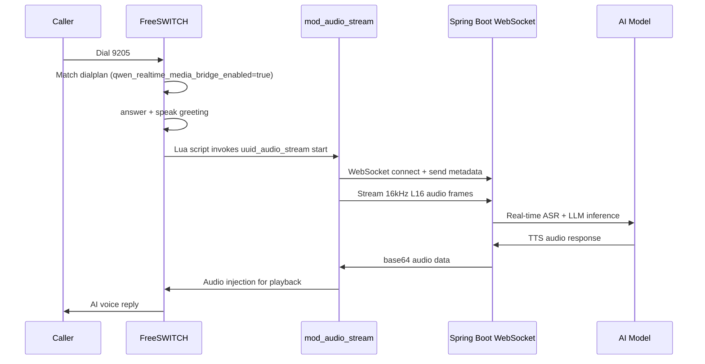

# Freeswitch Audio Stream

## Overview

`mod_audio_stream` is a production-grade WebSocket audio streaming module for FreeSWITCH. It streams real-time audio to external systems (ASR, TTS, LLM real-time conversations) via WebSocket, and supports receiving audio data from the WebSocket server for playback, enabling full-duplex audio interaction.

:::info Module Origin
`mod_audio_stream` is developed and maintained by [amigniter](https://github.com/amigniter/mod_audio_stream), licensed under MIT. The community edition supports unidirectional WebSocket audio streaming (suitable for ASR); the commercial edition adds bidirectional streaming and playback (full-duplex), with lifecycle management, thread safety, and memory optimization for high-concurrency environments (5000+ simultaneous calls).
:::

### Use Cases

- **AI Real-time Voice Conversation**: Stream call media to LLM WebSocket endpoints (e.g., Qwen-Audio-Realtime) for low-latency voice interaction
- **Real-time Speech Recognition (ASR)**: Stream audio to third-party ASR engines for live transcription
- **Text-to-Speech Playback (TTS)**: Receive audio data from the WebSocket server and inject it into the call for playback
- **Audio Quality Monitoring & Analysis**: Capture real-time call audio for quality inspection and sentiment analysis

## System Requirements

- FreeSWITCH 1.10.x or higher
- Linux 64-bit (Ubuntu 20.04+ / Debian 11+)
- Build dependencies: `libfreeswitch-dev`, `libssl-dev`, `zlib1g-dev`, `libevent-dev`, `libspeexdsp-dev`, `cmake`

## Building from Source

### Dependencies

```bash
# Install dependencies on Debian/Ubuntu
sudo apt-get install -y \
    libfreeswitch-dev \
    libssl-dev \
    zlib1g-dev \
    libevent-dev \
    libspeexdsp-dev \
    cmake \
    git
```

### Compilation

```bash
# Clone the repository
git clone https://github.com/amigniter/mod_audio_stream.git
cd mod_audio_stream

# Initialize submodules (libwsc WebSocket client library)
git submodule init
git submodule update --recursive

# If FreeSWITCH is installed in a custom path, set PKG_CONFIG_PATH
export PKG_CONFIG_PATH=/usr/local/freeswitch/lib/pkgconfig:${PKG_CONFIG_PATH:-}

# Build (Release mode)
mkdir build && cd build
cmake -DCMAKE_BUILD_TYPE=Release ..
make -j"$(nproc)"

# Install
sudo make install
```

:::tip TLS/WSS Support
To support `wss://` encrypted connections, add `-DUSE_TLS=ON` during compilation:
```bash
cmake -DCMAKE_BUILD_TYPE=Release -DUSE_TLS=ON ..
```
:::

### Scripted Installation

```bash
sudo apt-get -y install git \
    && cd /usr/src/ \
    && git clone https://github.com/amigniter/mod_audio_stream.git \
    && cd mod_audio_stream \
    && sudo bash ./build-mod-audio-stream.sh
```

### Verify Installation

```bash
# Check if module file exists
ls -l /usr/local/freeswitch/lib/freeswitch/mod/mod_audio_stream.so

# Check file size (confirm non-empty)
ls -lh /usr/local/freeswitch/lib/freeswitch/mod/mod_audio_stream.so
```

## Enabling the Module

### 1. Edit modules.conf.xml

Edit the FreeSWITCH module configuration file:

```bash
vim /usr/local/freeswitch/conf/autoload_configs/modules.conf.xml
```

Add inside the `<modules>` node:

```xml
<load module="mod_audio_stream" />
```

### 2. Restart or Reload

```bash
# Option A: Restart FreeSWITCH
freeswitch -stop
freeswitch -nc

# Option B: Reload module config only
fs_cli -x "reload mod_audio_stream"
```

### 3. Verify Module Loaded

```bash
# Check in fs_cli
fs_cli -x "module_exists mod_audio_stream"
# Returns true if loaded

# List all loaded modules
fs_cli -x "show modules" | grep mod_audio_stream
```

## API Commands

The module registers the `uuid_audio_stream` API command for stream lifecycle management:

### Start Audio Stream

```
uuid_audio_stream <uuid> start <ws-url> <mix-type> <sampling-rate> [metadata]
```

Attaches a media bug and streams audio (L16 format) to the WebSocket server.

| Parameter | Description | Options |
| --------- | ----------- | ------- |
| `uuid` | FreeSWITCH channel unique ID | Channel UUID |
| `ws-url` | WebSocket server URL | `ws://` or `wss://` |
| `mix-type` | Audio mix mode | `mono` (caller only), `mixed` (both), `stereo` (separated) |
| `sampling-rate` | Sample rate | `8k`, `16k` |
| `metadata` | Optional UTF-8 text, sent before audio streaming starts | JSON string, etc. |

**Example**:

```bash
# Start 16kHz mono audio stream with metadata
uuid_audio_stream <uuid> start ws://host.docker.internal:9003/voice-agent/media mono 16k {"uuid":"xxx","caller":"1001","botDid":"9205"}
```

### Stop Audio Stream

```
uuid_audio_stream <uuid> stop [metadata]
```

Stops audio streaming and closes the WebSocket connection.

### Pause Audio Stream

```
uuid_audio_stream <uuid> pause
```

### Resume Audio Stream

```
uuid_audio_stream <uuid> resume
```

### Send Text Message

```
uuid_audio_stream <uuid> send_text <metadata>
```

Sends UTF-8 text to the WebSocket server.

## Channel Variables

These channel variables fine-tune WebSocket connection behavior and logging:

| Variable | Description | Default |
| -------- | ----------- | ------- |
| `STREAM_MESSAGE_DEFLATE` | Set to `true` or `1` to disable compression | Enabled |
| `STREAM_HEART_BEAT` | Heartbeat interval in seconds | Off |
| `STREAM_SUPPRESS_LOG` | Set to `true` or `1` to suppress logging | Off (logs printed) |
| `STREAM_BUFFER_SIZE` | Audio buffer duration in ms, divisible by 20 | 20 |
| `STREAM_EXTRA_HEADERS` | JSON object with additional HTTP headers | None |
| `STREAM_NO_RECONNECT` | Set to `true` or `1` to disable auto-reconnect | Auto-reconnect on |
| `STREAM_TLS_CA_FILE` | TLS CA cert file; `SYSTEM` or `NONE` | `SYSTEM` |
| `STREAM_TLS_KEY_FILE` | TLS client key file | None |
| `STREAM_TLS_CERT_FILE` | TLS client cert file | None |
| `STREAM_TLS_DISABLE_HOSTNAME_VALIDATION` | Set to `true` or `1` to skip hostname check | `false` |

**Dialplan example**:

```xml
<action application="set" data="STREAM_BUFFER_SIZE=100" />
<action application="set" data="STREAM_HEART_BEAT=15" />
<action application="set" data="STREAM_SUPPRESS_LOG=true" />
```

## Events

The module generates the following FreeSWITCH custom events:

| Event Name | Description |
| ---------- | ----------- |
| `mod_audio_stream::json` | Response message received from WebSocket server |
| `mod_audio_stream::connect` | Successfully connected to WebSocket server |
| `mod_audio_stream::disconnect` | Disconnected from WebSocket server |
| `mod_audio_stream::error` | Connection error with error code and description |
| `mod_audio_stream::play` | Server returned base64 audio data, written to temp file |

### Error Codes

| Code | Description |
| ---- | ----------- |
| 1 | I/O error (socket read/write failure) |
| 2 | Invalid WebSocket header |
| 3 | Server frames masked (violates spec) |
| 4 | Requested feature not supported |
| 5 | PING timeout |
| 6 | TCP connection or DNS lookup failed |
| 7 | SSL/TLS context initialization failed |
| 8 | SSL/TLS handshake failed |
| 9 | Generic OpenSSL error |
| 10 | Timeout |
| 11 | WebSocket protocol error |

## Bytedesk FreeSWITCH Image Integration

Bytedesk has pre-compiled and bundled `mod_audio_stream` into the `bytedesk-freeswitch` Docker image, ready to use out of the box.

### Image Info

- **Alibaba Cloud (recommended for China)**: `registry.cn-hangzhou.aliyuncs.com/bytedesk/freeswitch:latest`
- **Docker Hub**: `bytedesk/freeswitch:latest`

### Build Process in the Image

The module is compiled during image build (from the Dockerfile):

```dockerfile
# Build and install mod_audio_stream (enabled by default for WebSocket real-time audio streaming)
ARG MOD_AUDIO_STREAM_REF=main
RUN git clone --depth 1 --branch ${MOD_AUDIO_STREAM_REF} \
      https://github.com/amigniter/mod_audio_stream.git && \
    cd mod_audio_stream && \
    git submodule update --init --recursive && \
    export PKG_CONFIG_PATH=${FREESWITCH_PREFIX}/lib/pkgconfig && \
    cmake -S . -B build -DCMAKE_BUILD_TYPE=Release && \
    cmake --build build -- -j"$(nproc)" && \
    cmake --install build
```

The module is enabled by default in `modules.conf.xml`:

```xml
<load module="mod_audio_stream" />
```

### Verify the Module in the Image

```bash
# Check module file exists
docker exec freeswitch-bytedesk ls -la /usr/local/freeswitch/lib/freeswitch/mod/ | grep mod_audio_stream

# Check module is loaded
docker exec freeswitch-bytedesk fs_cli -p bytedesk123 -x "module_exists mod_audio_stream"

# List all loaded modules
docker exec freeswitch-bytedesk fs_cli -p bytedesk123 -x "show modules" | grep mod_audio_stream
```

## Configuration Parameters (bytedesk-freeswitch Image)

### Environment Variables

Configured in `compose-scenario-call.yaml` and `.env`:

| Environment Variable | Default | Description |
| -------------------- | ------- | ----------- |
| `FREESWITCH_QWEN_REALTIME_MEDIA_BRIDGE_ENABLED` | `false` | Enable Qwen-Audio-Realtime media bridge (requires `mod_audio_stream` loaded) |
| `FREESWITCH_QWEN_REALTIME_MEDIA_WS_URL` | `ws://host.docker.internal:9003/visitor/api/v1/call/voice-agent/qwen-realtime/media?output=mod_audio_stream&events=false&model=qwen-audio-3.0-realtime-plus&voice=longanqian&outputSampleRate=24000` | Real-time media bridge WebSocket URL |

### compose-scenario-call.yaml Configuration

```yaml
services:
  bytedesk-freeswitch:
    environment:
      # Qwen-Audio-Realtime media bridge
      FREESWITCH_QWEN_REALTIME_MEDIA_BRIDGE_ENABLED: ${FREESWITCH_QWEN_REALTIME_MEDIA_BRIDGE_ENABLED:-false}
      FREESWITCH_QWEN_REALTIME_MEDIA_WS_URL: ${FREESWITCH_QWEN_REALTIME_MEDIA_WS_URL:-ws://host.docker.internal:9003/visitor/api/v1/call/voice-agent/qwen-realtime/media?output=mod_audio_stream&events=false&model=qwen-audio-3.0-realtime-plus&voice=longanqian&outputSampleRate=24000}
```

### .env Example

```bash
# Qwen-Audio-Realtime media bridge; ensure mod_audio_stream is installed/loaded before enabling
FREESWITCH_QWEN_REALTIME_MEDIA_BRIDGE_ENABLED=true
FREESWITCH_QWEN_REALTIME_MEDIA_WS_URL=ws://host.docker.internal:9003/visitor/api/v1/call/voice-agent/qwen-realtime/media
```

### vars.xml Global Variables

Defined in `deploy/freeswitch/conf/vars.xml`:

```xml
<!-- Media bridge toggle (true=real-time full-duplex, false=fallback to HTTAPI) -->
<X-PRE-PROCESS cmd="set" data="qwen_realtime_media_bridge_enabled=true" />

<!-- Media bridge WebSocket URL -->
<X-PRE-PROCESS cmd="set"
  data="qwen_realtime_media_ws_url=ws://host.docker.internal:9003/visitor/api/v1/call/voice-agent/qwen-realtime/media" />
```

### Dialplan

In `deploy/freeswitch/conf/dialplan/default/92-ai-bot.xml`, extension 9205 has two modes:

#### Mode 1: Real-time Media Bridge (mod_audio_stream enabled)

When `qwen_realtime_media_bridge_enabled=true`, uses `mod_audio_stream` for low-latency full-duplex conversation:

```xml
<extension name="92-ai-bot-qwen-realtime-media" continue="false">
  <condition field="${destination_number}:$${qwen_realtime_media_bridge_enabled}" expression="^9205:(true|1|yes)$">
    <action application="set" data="mrcp_profile=java-mrcp" />
    <action application="set" data="hangup_after_bridge=true" />
    <!-- mod_audio_stream channel variables -->
    <action application="set" data="STREAM_BUFFER_SIZE=100" />
    <action application="set" data="STREAM_HEART_BEAT=15" />
    <!-- TTS engine config -->
    <action application="set" data="tts_engine=unimrcp" />
    <action application="set" data="tts_profile=${mrcp_profile}" />
    <action application="set" data="unimrcp:header:Speech-Language=zh-CN" />
    <action application="set" data="synth-content-type=application/ssml+xml" />
    <!-- Answer and play greeting -->
    <action application="answer" />
    <action application="speak"
      data="unimrcp:${mrcp_profile}||&lt;speak version='1.0' xml:lang='zh-CN'&gt;Hello, I'm the Bytedesk AI voice assistant. How can I help you?&lt;/speak&gt;" />
    <!-- Start real-time media bridge via Lua script -->
    <action application="lua" data="qwen_realtime_media_start.lua ws://host.docker.internal:9003/visitor/api/v1/call/voice-agent/qwen-realtime/media" />
    <action application="log" data="INFO [AI-BOT-9205-REALTIME] media bridge started after greeting uuid=${uuid}" />
    <action application="park" />
  </condition>
</extension>
```

#### Mode 2: HTTAPI Turn-based Fallback

When `qwen_realtime_media_bridge_enabled=false`, falls back to HTTAPI turn-based mode (no `mod_audio_stream` required):

```xml
<extension name="92-ai-bot-qwen-realtime-entry" continue="false">
  <condition field="destination_number" expression="^9205$">
    <action application="set" data="hangup_after_bridge=true" />
    <action application="answer" />
    <action application="httapi"
      data="{url=$${ai_bot_base_url}/ai-bot?turn=1&amp;mode=unlimited&amp;bot_did=9205&amp;voice_agent=true,method=POST}" />
  </condition>
</extension>
```

### Lua Launch Script

`deploy/freeswitch/scripts/qwen_realtime_media_start.lua` invokes the `uuid_audio_stream` API:

```lua title="qwen_realtime_media_start.lua"
local session = session

local function json_escape(value)
  value = value or ""
  value = value:gsub('\\', '\\\\')
  value = value:gsub('"', '\\"')
  return value
end

if not session or not session:ready() then
  freeswitch.consoleLog("WARNING", "[AI-BOT-9205-REALTIME] no ready session for media bridge\n")
  return
end

local uuid = session:get_uuid()
local caller = session:getVariable("caller_id_number") or ""
local ws_url = argv and argv[1] or ""

if ws_url == "" then
  ws_url = "ws://host.docker.internal:9003/visitor/api/v1/call/voice-agent/qwen-realtime/media"
end

local metadata = string.format('{"uuid":"%s","caller":"%s","botDid":"9205"}',
  json_escape(uuid), json_escape(caller))
local command = string.format("uuid_audio_stream %s start %s mono 16k %s",
  uuid, ws_url, metadata)
local api = freeswitch.API()
local result = api:executeString(command) or ""

freeswitch.consoleLog("INFO", string.format(
  "[AI-BOT-9205-REALTIME] media bridge start uuid=%s ws=%s result=%s\n",
  uuid, ws_url, result))
```

## Typical Usage Flow

Using the `bytedesk-freeswitch` image for AI real-time voice conversation:



## FAQ

### 1. Module fails to load

**Symptom**: `fs_cli -x "module_exists mod_audio_stream"` returns `false`

**Troubleshooting**:
- Check module file: `ls -l /usr/local/freeswitch/lib/freeswitch/mod/mod_audio_stream.so`
- Check FreeSWITCH logs: `tail -f /usr/local/freeswitch/log/freeswitch.log`
- Check dependencies: `ldd /usr/local/freeswitch/lib/freeswitch/mod/mod_audio_stream.so`

### 2. Audio stream does not connect

**Symptom**: `uuid_audio_stream start` does not connect to WebSocket

**Troubleshooting**:
- Verify WebSocket server is reachable from within the container
- Check Docker networking: use `host.docker.internal` to access host services
- Review FreeSWITCH logs for error events
- Ensure `STREAM_NO_RECONNECT` is not set to `true`

### 3. Poor audio quality or stream drops

- Adjust `STREAM_BUFFER_SIZE` (default 20ms, can set to 100ms)
- Enable `STREAM_HEART_BEAT` to prevent load balancers from dropping idle connections
- Verify WebSocket server capacity matches concurrency

### 4. WSS connection fails

- Confirm TLS support was compiled in (`-DUSE_TLS=ON`)
- Set `STREAM_TLS_CA_FILE`, `STREAM_TLS_CERT_FILE`, `STREAM_TLS_KEY_FILE` correctly
- To skip cert verification: set `STREAM_TLS_DISABLE_HOSTNAME_VALIDATION=true`

### 5. 9205 still uses HTTAPI after enabling media bridge

**Troubleshooting**:
- Verify `qwen_realtime_media_bridge_enabled=true`: `fs_cli -x "global_getvar qwen_realtime_media_bridge_enabled"`
- Verify `mod_audio_stream` is loaded: `fs_cli -x "module_exists mod_audio_stream"`
- Reload XML config: `fs_cli -x "reloadxml"`
- Check dialplan matching: look for `[AI-BOT-9205-REALTIME]` prefix in logs

## References

- [mod_audio_stream GitHub](https://github.com/amigniter/mod_audio_stream)
- [mod_audio_stream libwsc (WebSocket Client)](https://github.com/amigniter/libwsc)
- [Bytedesk FreeSWITCH Docker Image](https://github.com/Bytedesk/bytedesk-freeswitch)
- [FreeSWITCH Module: mod_audio_fork](https://developer.signalwire.com/freeswitch/FreeSWITCH-Explained/Modules/mod_audio_fork_6587401/)
- [Qwen-Audio Realtime Model](https://github.com/QwenLM/Qwen-Audio)

# Freeswitch Audio Stream
