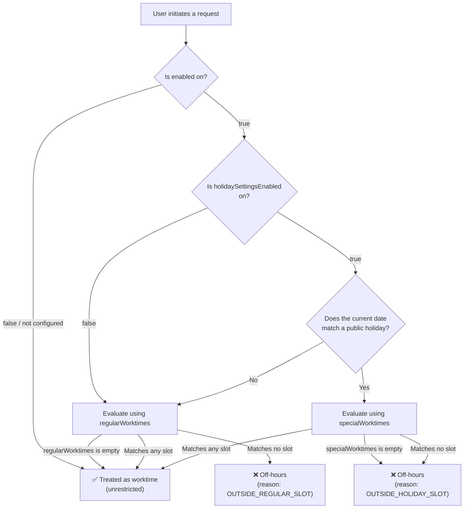
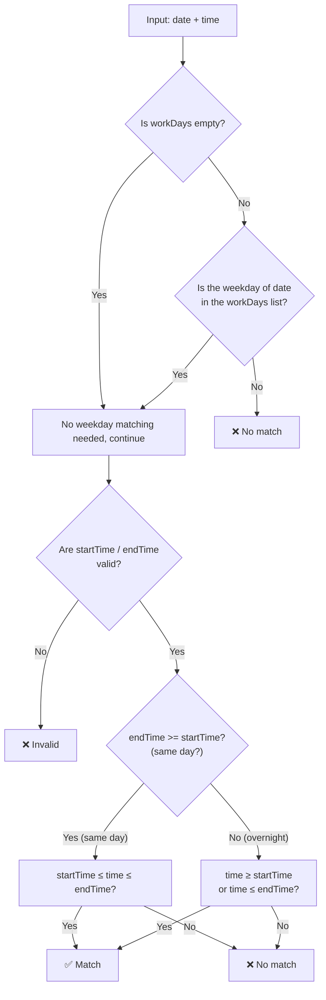

# Worktime Settings

Bytedesk supports configuring worktime slots for agents and workgroups. The system determines whether the current time falls within service hours and triggers strategies such as leaving a message or bot takeover accordingly.

## Data Model

### WorktimeSlotValue — Time Slot

A value object representing a single worktime window, persisted as JSON in the `text` column of `WorktimeSettingEntity`.

| Field | Type | Description | Example |
| --- | --- | --- | --- |
| `startTime` | `String` | Start time (HH:mm) | `"09:00"` |
| `endTime` | `String` | End time (HH:mm) | `"18:00"` |
| `workDays` | `String` | Applicable days, comma-separated (1=Monday, 7=Sunday) | `"1,2,3,4,5"` |

**Overnight slots**: When `endTime < startTime`, the slot is automatically treated as spanning midnight (e.g., `"22:00"`–`"06:00"` represents a nighttime window).

### WorktimeSettingEntity — Worktime Configuration

| Field | Type | Default | Description |
| --- | --- | --- | --- |
| `enabled` | `Boolean` | `true` | Master switch; when disabled, the time is always treated as worktime |
| `regularWorktimes` | `List<WorktimeSlotValue>` | `[{09:00-18:00, Mon–Fri}]` | Regular weekday time slots |
| `specialWorktimes` | `List<WorktimeSlotValue>` | `[]` | Holiday-specific time slots |
| `holidaySettingsEnabled` | `Boolean` | `false` | Whether holiday-based evaluation is enabled |
| `nonWorktimeTip` | `String` | `"Currently off-hours, please leave a message"` | Message shown outside worktime |

## regularWorktimes vs specialWorktimes

The two fields are stored separately because their **empty-value semantics differ**:

| Field | Trigger condition | Meaning when empty |
| --- | --- | --- |
| `regularWorktimes` | Non-holiday | **No restriction** (24h treated as worktime) |
| `specialWorktimes` | Matches a public holiday | **Closed** (holidays default to off) |

### Evaluation Flow



### Single Slot Evaluation Logic (WorktimeSlotValue.isActive)



## Configuration Entry Points

Worktime settings are configured in the following admin pages:

- **Agent settings**: `/service/agent/settings` → select template → **Worktime** tab


- **Workgroup settings**: `/service/workgroup/settings` → select template → **Worktime** tab


- Holiday configuration


### UI Features

| Feature | Description |
| --- | --- |
| Enable worktime restriction | Master switch; when off, 24h is treated as worktime |
| Enable holiday time slots | Independent switch; when on, holidays use `specialWorktimes` |
| Regular time slots | List of time slots; empty = unrestricted |
| Holiday time slots | Only visible when holiday switch is on; empty = closed on holidays |
| Start / End time | 24-hour TimePicker, default `09:00`–`18:00` |
| Workdays | Multi-select dropdown (1–7), default Monday–Friday |
| Off-hours message | Custom message, supports different placeholders for agent/workgroup |
| Manage holidays | Navigates to `/service/holiday` to manage the holiday calendar |

## API

### WorktimeService — Unified Evaluation Entry Point

```java
// Check whether the current time is within service hours
boolean inService = worktimeService.isInServiceTime(settings);

// Check a specific moment
boolean inService = worktimeService.isInServiceTime(settings, zonedDateTime);

// Get a full evaluation result with reason
WorktimeEvaluation eval = worktimeService.evaluate(settings, zonedDateTime);
// eval.inServiceTime()   → boolean
// eval.reason()          → OUTSIDE_REGULAR_SLOT / OUTSIDE_HOLIDAY_SLOT
// eval.nonWorktimeTip()  → tip message
```

### Evaluation Results

| State | `inServiceTime` | `reason` | Description |
| --- | --- | --- | --- |
| Settings is null | `true` | — | Not configured, equivalent to unrestricted |
| enabled=false | `true` | — | Worktime restriction disabled |
| Regular slot matched | `true` | — | Within regularWorktimes |
| Holiday slot matched | `true` | — | Within specialWorktimes |
| Regular slot not matched | `false` | `OUTSIDE_REGULAR_SLOT` | Non-holiday but outside the slot |
| Holiday slot not matched | `false` | `OUTSIDE_HOLIDAY_SLOT` | Public holiday but outside the slot |

## Integration

Agent and Workgroup `SettingsEntity` references `WorktimeSettingEntity` via `@ManyToOne`, supporting a published/draft dual-state pattern:

```java
// AgentSettingsEntity
@ManyToOne(...)
private WorktimeSettingEntity worktimeSettings;      // Published
@ManyToOne(...)
private WorktimeSettingEntity draftWorktimeSettings;  // Draft (editing)
```

Callers simply inject `WorktimeService` and pass the corresponding settings to get a unified evaluation result. Each channel then decides its own follow-up strategy (transfer to bot, leave a message, queue, etc.) based on the result.

## Holiday Evaluation

Holidays are managed centrally by `HolidayService`, with the following defaults:

- **Country/Region**: CN (China)
- **Scope**: `ORG_ONLY` (organization-level)
- **Timezone**: `Asia/Shanghai`

Holiday data is maintained via the `/service/holiday` admin page, with support for importing Chinese public holidays.

## Design Rationale

- **Different empty-value semantics**: `regularWorktimes` empty = all-day work (permissive), `specialWorktimes` empty = all-day off (restrictive). If merged into a single field, there would be no way to distinguish "admin hasn't configured it" from "configured as an empty list."
- **Editing decoupling**: Modifying regular schedules (e.g., adjusting lunch breaks) does not affect holiday arrangements, and vice versa.
- **Independent switches**: `holidaySettingsEnabled` controls whether holiday evaluation is active. When disabled, regular time slots are always used, preserving backward compatibility.
