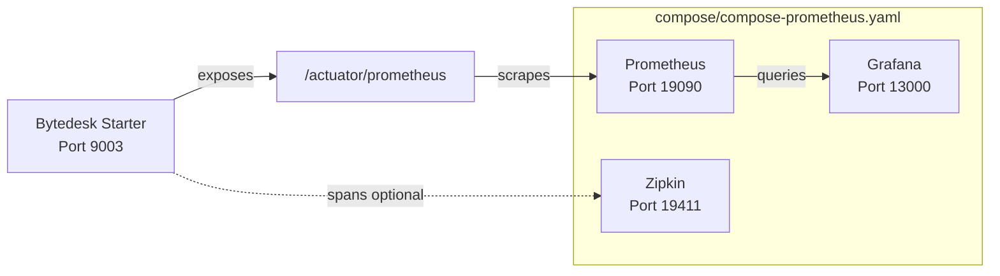

# Bytedesk AI Observability

Bytedesk integrates [Spring AI 2.0 Observability](https://docs.spring.io/spring-ai/reference/observability/index.html) and the [Spring Boot Actuator](https://docs.spring.io/spring-boot/reference/actuator/metrics.html) to provide full-chain metrics and distributed tracing for every AI operation — ChatClient, ChatModel, EmbeddingModel, VectorStore, Tool Calling.

[Spring Boot Metrics](https://docs.spring.io/spring-boot/reference/actuator/metrics.html) · [Spring Boot Tracing](https://docs.spring.io/spring-boot/reference/actuator/tracing.html) · [OpenTelemetry Gen AI Conventions](https://opentelemetry.io/docs/specs/semconv/gen-ai/)

## Overview

| Capability | Component | Description |
| --- | --- | --- |
| Metrics export | Spring Boot Actuator + Micrometer | `/actuator/prometheus` exposes `gen_ai_*`, `db_vector_*`, `bytedesk.ai.*` time series |
| Metrics scraping | Prometheus | Pulls metrics every 15s; configured in `deploy/docker/prometheus.yml` |
| Metrics visualization | Grafana | Pre-provisioned AI dashboard via `deploy/docker/grafana/provisioning/` |
| Distributed tracing | Zipkin (optional) | Captures spans for ChatClient / ChatModel / Tool calls; disabled by default |
| Health checks | Spring Boot Health | `/actuator/health` reports AI component status via `AiHealthIndicator` |

## Architecture



## Instrumented Components

Spring AI 2.0 instruments six core components out of the box. Bytedesk connects all of them to the unified `ObservationRegistry`:

| Component | Observation Name | Key Metric | Status |
| --- | --- | --- | --- |
| ChatClient | `gen_ai.chat.client.operation` (bytedesk custom convention) | `gen_ai_chat_client_operation_seconds` | ✅ All 15+ provider ChatClients instrumented |
| ChatModel | `gen_ai.client.operation` | `gen_ai_client_operation_seconds` + `gen_ai_client_token_usage_total` | ✅ Framework + Moonshot + DeepSeek + ZhipuAI + DashScope |
| EmbeddingModel | `gen_ai.client.operation` | `gen_ai_client_operation_seconds` | ✅ DashScope custom model instrumented |
| VectorStore | `db.vector.client.operation` | `db_vector_client_operation_seconds` | ✅ Auto-instrumented |
| Tool Calling | `spring.ai.tool` | (embedded in ChatModel span) | ✅ Auto-instrumented |
| ChatClient Advisors | `spring.ai.advisor` | (embedded in ChatClient span) | ✅ Auto-instrumented |

## Quick Start

### 1. Start the observability stack

`start.sh` / `stop.sh` accept an optional last argument `obs` (or `observability` / `true` / `yes`) to enable `compose/compose-prometheus.yaml` in one shot:

```bash
cd deploy/docker

# Option A (recommended): middleware/app stack + observability in one command
./start mysql artemis middleware obs
./start mysql artemis all obs   # full release + observability
./stop mysql artemis stop middleware obs
./stop mysql artemis down middleware obs

# Option B: observability only (requires bytedesk-network to exist)
docker compose --env-file .env -f compose/compose-prometheus.yaml up -d
```

### 2. Verify metrics are flowing

```bash
# Application metrics endpoint
curl http://localhost:9003/actuator/prometheus | grep gen_ai

# Expected output includes:
# gen_ai_chat_client_operation_seconds_count{...}
# gen_ai_client_operation_seconds_count{...}
# gen_ai_client_token_usage_total{...}
# db_vector_client_operation_seconds_count{...}
```

### 3. Open Grafana

Navigate to `http://localhost:13000` and log in with `admin` / `admin` (override via `GRAFANA_ADMIN_USER` / `GRAFANA_ADMIN_PASSWORD` in `.env`). The **Bytedesk AI Observability** dashboard is auto-provisioned under the *Bytedesk AI* folder.

## Metric Reference

### ChatClient Metrics

| Metric | Type | Description |
| --- | --- | --- |
| `gen_ai_chat_client_operation_seconds_count` | Counter | Number of completed ChatClient operations |
| `gen_ai_chat_client_operation_seconds_sum` | Timer (sum) | Total time spent in ChatClient operations |
| `gen_ai_chat_client_operation_seconds_max` | Gauge | Maximum observed duration |
| `gen_ai_chat_client_operation_seconds_bucket` | Histogram | Distribution buckets (enables P95/P99) |
| `gen_ai_chat_client_operation_active_count` | Gauge | In-flight ChatClient calls |

### ChatModel Metrics (per-provider execution)

| Metric | Type | Labels | Description |
| --- | --- | --- | --- |
| `gen_ai_client_operation_seconds` | Timer | `gen_ai_system`, `gen_ai_request_model` | Model provider execution time |
| `gen_ai_client_token_usage_total` | Counter | `gen_ai_token_type` (input/output/total) | Token consumption |

### VectorStore Metrics

| Metric | Type | Labels | Description |
| --- | --- | --- | --- |
| `db_vector_client_operation_seconds` | Timer | `db_operation_name` (add/delete/query) | Vector store operation latency |

### Bytedesk Custom Business Metrics

| Metric | Type | Description |
| --- | --- | --- |
| `bytedesk_ai_requests_total` | Counter | Total AI requests (business-level) |
| `bytedesk_ai_errors_total` | Counter | AI errors |
| `bytedesk_ai_response_time_seconds` | Timer | AI response time |

> **Note**: `bytedesk.ai.*` metrics are registered via `BytedeskMetrics` in `modules/core`. Framework-level `gen_ai_*` / `db_vector_*` metrics come from Spring AI. Grafana dashboards distinguish these two layers.

## PromQL Examples

```promql
# AI QPS
sum(rate(gen_ai_chat_client_operation_seconds_count[1m]))

# P95 latency (requires histogram enabled)
histogram_quantile(0.95, sum by (le) (rate(gen_ai_chat_client_operation_seconds_bucket[5m])))

# Average latency (fallback when histogram not enabled)
rate(gen_ai_chat_client_operation_seconds_sum[5m]) / rate(gen_ai_chat_client_operation_seconds_count[5m])

# Token usage rate by type
sum by (gen_ai_token_type) (rate(gen_ai_client_token_usage_total[5m]))

# Provider distribution
sum by (gen_ai_system) (rate(gen_ai_client_operation_seconds_count[5m]))

# Error rate
rate(bytedesk_ai_errors_total[5m]) / clamp_min(rate(bytedesk_ai_requests_total[5m]), 1)

# VectorStore query latency
rate(db_vector_client_operation_seconds_sum[1m])
```

## Configuration

### Spring AI Observation Properties

These properties control whether sensitive content (prompts, completions, tool args) is exported to traces. **All default to `false`**; enable only for debugging.

| Property | Default | Description |
| --- | --- | --- |
| `spring.ai.chat.client.observations.log-prompt` | `false` | Log ChatClient prompt content |
| `spring.ai.chat.observations.log-prompt` | `false` | Log ChatModel prompt content |
| `spring.ai.chat.observations.log-completion` | `false` | Log ChatModel completion content |
| `spring.ai.chat.observations.include-error-logging` | `false` | Include error details in observations |
| `spring.ai.tools.observations.include-content` | `false` | Export tool call arguments and results |
| `spring.ai.vectorstore.observations.log-query-response` | `false` | Log vector search query and response |

### Histogram Buckets

To enable `histogram_quantile()` in Grafana, AI-related Timers must publish histogram buckets. The `local` profile configures this by default:

```properties
management.metrics.distribution.percentiles-histogram.gen_ai.chat.client.operation=true
management.metrics.distribution.percentiles-histogram.gen_ai.client.operation=true
management.metrics.distribution.percentiles-histogram.db.vector.client.operation=true
management.metrics.distribution.slo.gen_ai.chat.client.operation=50ms,200ms,1s,5s,30s
```

If buckets are not enabled, use the average latency fallback PromQL instead of `histogram_quantile()`.

## Distributed Tracing (Zipkin)

Tracing is **disabled by default** to avoid noise. To enable:

```bash
# 1. Start Zipkin via compose/compose-prometheus.yaml
docker compose --env-file .env -f compose/compose-prometheus.yaml -f compose/compose-grafana.yaml -f compose/compose-zipkin.yaml up -d bytedesk-zipkin

# 2. Enable tracing via environment variables when starting the app
export MANAGEMENT_TRACING_ENABLED=true
export MANAGEMENT_ZIPKIN_TRACING_ENABLED=true
export MANAGEMENT_TRACING_SAMPLING_PROBABILITY=1.0
```

Open Zipkin UI at `http://localhost:19411` to inspect distributed traces.

## Alerting Recommendations

| Alert | PromQL | Threshold |
| --- | --- | --- |
| AI error rate high | `rate(bytedesk_ai_errors_total[5m]) / clamp_min(rate(bytedesk_ai_requests_total[5m]), 1)` | > 5% for 5m |
| AI latency high | `histogram_quantile(0.95, ...)` | P95 > 10s for 5m |
| Token usage spike | `rate(gen_ai_client_token_usage_total[1h])` | > 2x baseline |
| VectorStore slow | `rate(db_vector_client_operation_seconds_sum[1m])` | > 2s for 5m |

## Troubleshooting

### Metrics not appearing in Prometheus

1. Verify `/actuator/prometheus` returns data: `curl http://localhost:9003/actuator/prometheus`
2. Confirm `management.endpoints.web.exposure.include=*` in your profile.
3. Check that `ObservationConfig` does not create a standalone `ObservationRegistry` (phase 7A unified this).
4. Ensure Prometheus can reach the app on the Docker network.

### Grafana dashboard shows "No data"

1. Verify the Prometheus datasource is configured (auto-provisioned in `grafana/provisioning/datasources/`).
2. Check that the time range covers a period when AI calls were made.
3. Confirm histogram buckets exist if using P95 panels: `gen_ai_chat_client_operation_seconds_bucket` should appear in Prometheus.

### Zipkin shows no traces

1. Confirm `MANAGEMENT_TRACING_ENABLED=true` is set.
2. Verify sampling probability > 0 (default 0.0 = no sampling).
3. Ensure the app can reach `bytedesk-zipkin:9411` on the Docker network.

## References

- [Spring AI Observability](https://docs.spring.io/spring-ai/reference/observability/index.html)
- [Spring Boot Actuator Metrics](https://docs.spring.io/spring-boot/reference/actuator/metrics.html)
- [Spring Boot Actuator Tracing](https://docs.spring.io/spring-boot/reference/actuator/tracing.html)
- [OpenTelemetry Gen AI Semantic Conventions](https://opentelemetry.io/docs/specs/semconv/gen-ai/)
- [Micrometer Observation API](https://docs.micrometer.io/micrometer/reference/observation.html)
