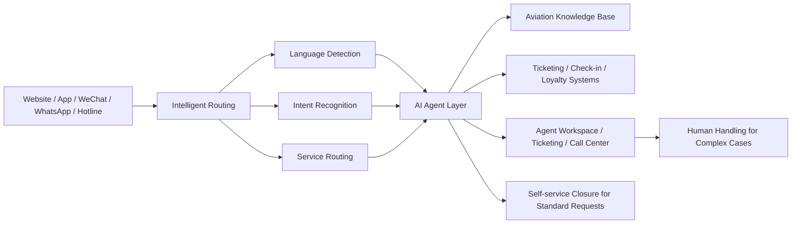
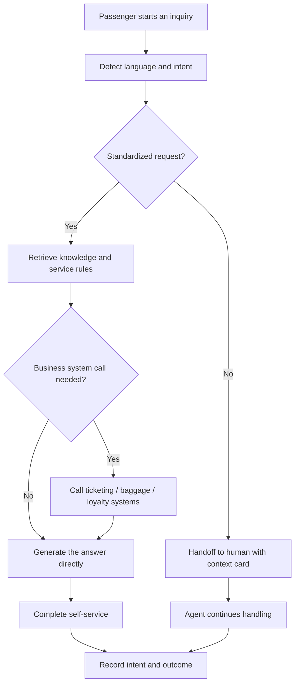

# Aviation Intelligent Customer Service Solution

## Overview

Bytedesk's AI-powered customer service system is built for the aviation industry, deeply integrating large language models with aviation business knowledge and systems to create an intelligent passenger service platform that covers the full journey from inquiry to resolution. The solution focuses on multilingual service, intelligent intent recognition, self-service for refunds, rebooking and baggage, intelligent knowledge management, and human-AI collaboration — helping airlines significantly improve self-service resolution rates and service efficiency while preserving a human touch.

## Executive Summary

| Dimension | Recommended Positioning |
| --- | --- |
| Solution role | An omnichannel AI customer service and human-AI collaboration platform for airlines |
| Problems to solve first | Multilingual service, peak-time queues, refund and rebooking requests, baggage inquiries, and complex-case handoff |
| Phase 1 scope | Website, app, and WeChat text channels plus knowledge Q&A, fare-rule guidance, and human collaboration |
| Expected value | Higher self-service resolution, shorter wait times, more consistent service, and lower repetitive inquiry pressure |
| Expansion path | Flight status, loyalty systems, voice hotline, and deeper check-in and ticketing integration |

## Recommended Phase 1 Scope

- **Start with text channels**: Prioritize website, app, and WeChat entry points to validate business value quickly
- **Focus on high-frequency standard requests**: Start with refunds, rebooking, baggage allowance, flight status, and loyalty benefits
- **Keep human fallback in place**: Preserve seamless takeover for complaints, special passenger assistance, and irregular operation cases
- **Integrate systems in stages**: Begin with the knowledge base and fare rules, then expand into ticketing, loyalty, and baggage systems

## Industry Challenges

- **Multilingual passenger service**: Passengers come from many countries and regions, requiring consistent, high-quality service in Mandarin, Cantonese, English, and more
- **Traffic spikes during peak periods**: Typhoons, delays, and holidays cause sudden surges in inquiries that traditional human agents struggle to absorb
- **Complex business rules**: Refund and rebooking policies, baggage regulations, and special passenger assistance rules are numerous and change frequently, making manual lookup slow and error-prone
- **Siloed systems**: Ticketing, departure control, and loyalty systems are often disconnected, preventing agents from accessing complete passenger information in one place

## Solution Architecture

The Bytedesk aviation solution uses a layered architecture that connects omnichannel access, intelligent routing, AI Agent processing, and human service:

- **Channel layer**: Website, app, WeChat official account/mini program, WhatsApp, and phone hotline all connect through a unified entry point
- **Intelligent routing layer**: Understands passenger intent and automatically routes standardized versus complex requests
- **AI Agent layer**: Combines large language models with an aviation knowledge base and business tools to answer questions and complete transactions
- **Human service layer**: Agent workspace, ticketing, and call center work together to handle complex cases and special passenger assistance

## Core Capabilities

### Multilingual Intelligent Service

- **Automatic language detection**: Identifies the passenger's language and replies in their native language
- **Broad language coverage**: Supports Simplified Chinese, Traditional Chinese, English, Cantonese, and more
- **Consistent experience**: Passengers in every language receive a unified, accurate service

### Intelligent Intent Recognition and Routing

- **Semantic understanding**: Large language models cut through colloquial phrasing to identify the real intent (e.g., "move my ticket a few days later" is recognized as a rebooking request)
- **Standardized self-service**: Common questions and standardized transactions are completed by AI end-to-end
- **Automatic human handoff for complex cases**: Complex requests are routed to human agents with full conversation context, so passengers never repeat themselves

### Intelligent Knowledge Base Management

- **Document parsing**: Automatically parses hundreds of pages of conditions of carriage and ticketing rules to generate knowledge entries at scale
- **Automatic FAQ generation**: Breaks documents into standard Q&A pairs, lowering the barrier to knowledge maintenance
- **Human review and iteration**: Supports a closed loop of AI parsing, human review, and publishing for continuous improvement

### Deep Business System Integration

- **Flight query, refunds, and rebooking**: Connects to ticketing systems for one-stop flight lookup, refund, and rebooking
- **Baggage query and claims**: Supports checked baggage status lookup, irregular baggage reporting, and claim guidance
- **Flight status notifications**: Pushes real-time flight status and delay alerts to help passengers adjust their plans
- **Loyalty benefits lookup**: Connects to loyalty systems for points, tier, and benefit inquiries

### Unified Omnichannel Experience

- **Unified access**: One service entry across web, app, WeChat, WhatsApp, and phone hotline
- **Cross-channel context**: Conversation context carries across channels so passengers never restate their issue
- **End-to-end ticketing**: Full tracking from inquiry through resolution to after-sales

## Typical Use Cases

### Pre-trip Service

- **Pre-booking inquiries**: Answers common questions about routes, fare rules, baggage allowance, and cabin benefits
- **Refund and rebooking policy guidance**: Explains whether a ticket can be refunded or changed and outlines the likely fee range based on fare rules
- **Special passenger assistance requests**: Guides requests for children, elderly passengers, pregnant travelers, wheelchair assistance, and similar needs

### Irregular Operations Support

- **Delay and cancellation notifications**: Automatically sends notices and handling guidance for delays, cancellations, and schedule changes
- **High-volume inquiry handling**: Absorbs large volumes of repetitive passenger questions during severe weather or holiday peaks
- **Emergency handoff**: Escalates emotionally charged complaints, group rebooking cases, and other complex requests to human agents quickly

### Baggage and Loyalty Service

- **Baggage support**: Checks baggage status and provides guidance for oversized baggage, mishandled baggage, and claims
- **Loyalty benefit lookup**: Answers questions about miles, points, tier benefits, and upgrade eligibility
- **Ancillary service recommendations**: Recommends seat selection, extra baggage, lounge access, and other add-on services based on passenger profile

## Business Value

- **Higher self-service coverage**: Moves large volumes of repetitive, standardized requests into AI-led resolution flows
- **Faster response and shorter queues**: Maintains stable service during peak periods and reduces passenger waiting time
- **Consistent service standards**: Uses the knowledge base and operational rules to keep answers aligned across channels and languages
- **Better passenger experience**: Preserves a human touch for complex issues while providing faster help for routine requests
- **Operational insight accumulation**: Continuously improves service strategy through intent, routing, satisfaction, and ticket outcome data

## Typical Performance Targets (Reference)

The following are industry reference targets for evaluation and goal setting, not committed production figures:

- Self-service resolution rate ≥ 70%
- Customer satisfaction ≥ 95%
- AI resolves around 40% of repetitive, standardized inquiries
- Queue rate reduced by around 60%
- Significantly faster average response times

## Deployment and Integration

- **Fast deployment**: One-click Docker deployment with standardized delivery
- **System integration**: Provides integration paths with existing ticketing, check-in, and loyalty systems
- **Security and compliance**: Follows passenger data protection requirements and supports private, controlled deployment

## Delivery Models

### Standard Edition

- **Best for**: Airlines and regional carriers that want to launch intelligent customer service quickly
- **Core scope**: Multilingual inquiry handling, knowledge base Q&A, common ticketing support, and basic human handoff collaboration
- **Delivery approach**: Shorter rollout cycle, typically starting with website, app, and WeChat text channels

### Professional Edition

- **Best for**: Mid-sized and large airlines that need deeper business integration and service analytics
- **Core scope**: Integration with ticketing, loyalty, and service workflow systems, plus intelligent routing and operational analysis
- **Delivery approach**: Balances rapid deployment with business customization and expands gradually into more channels and scenarios

### Enterprise Edition

- **Best for**: Large airlines or travel groups with stronger requirements for isolation, stability, and complex integration
- **Core scope**: Private deployment, unified service platform, human-AI operating model, and deep enterprise integration
- **Delivery approach**: Supports unified operations across multiple service lines with stronger availability, auditability, and compliance controls

## Capability Mapping

The aviation solution builds on Bytedesk's existing platform capabilities, including:

- Intelligent bot (large-model Agent reception and multi-turn conversation)
- Knowledge base (FAQ management and semantic search)
- Ticketing system (end-to-end tracking and SLA management)
- Call center (voice service and IVR support)
- Multilingual frontend (Simplified Chinese, Traditional Chinese, English, and more)

## Future Roadmap

- Multilingual ASR/TTS for voice scenarios (including Cantonese recognition and synthesis)
- Intent-based routing policies that dispatch to the right skill groups
- Offline evaluation and replay for rule changes to safeguard operational quality

## FAQ

- **How do we connect to our existing ticketing system?** Bytedesk supports integration with existing ticketing, check-in, and loyalty systems through standard interfaces; integration scope is assessed during implementation.
- **Which languages are supported?** Simplified Chinese, Traditional Chinese, and English are supported, with more languages such as Cantonese available on demand.
- **How long does deployment take?** The standard edition can go live quickly; the exact timeline depends on integration scope and customization needs.

---

*Bytedesk's AI-powered customer service system helps airlines modernize digitally and deliver smarter, more efficient, more caring passenger service.*
