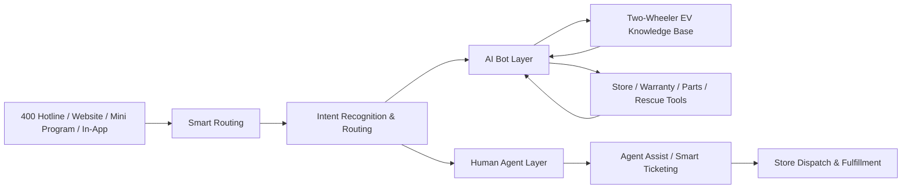
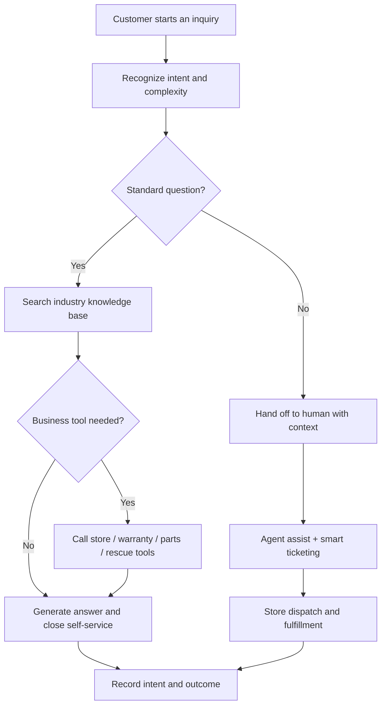

# Two-Wheeler EV Smart Customer Service Solution

## Overview

Two-wheeler electric vehicles are a cornerstone of everyday mobility, with leading brands having sold more than 100 million units cumulatively and running dealer networks of tens of thousands of stores. This enormous user base and store network generate massive, high-frequency, and highly specialized service demands: warranty policy inquiries, troubleshooting guidance, smart app usage, service appointments, and roadside assistance.

The Weiyu smart customer service platform provides two-wheeler EV brands with an integrated solution covering "hotline + online + store fulfillment". It deeply combines industry knowledge — vehicle specifications, warranty policies, troubleshooting guides, and app manuals — with large language models, helping brands raise their self-service resolution rate, shorten handle time, and connect online service with store fulfillment, so that every rider can "find a store, get clear policy answers, and get the vehicle fixed".

## Executive Summary

| Dimension | Recommended Position |
| --- | --- |
| Solution positioning | An omnichannel AI customer service and store-fulfillment platform for two-wheeler EV brands |
| Priority problems | Low peak-hour answer rates, slow warranty policy lookup, specialized troubleshooting, disconnected store fulfillment |
| Phase-one scope | Hotline + online text channels, industry knowledge base, tiered bot interception, smart ticketing |
| Core expected benefits | Higher self-service resolution, shorter handle time, consistent answers, connected store dispatch |
| Future extensions | Roadside assistance dispatch, spare parts inventory, service appointments, and VOC analytics integration |

## Industry Overview: Customer Service Challenges

### Service Pressure at Scale

- **Massive user base**: Hundreds of millions of two-wheeler EVs are in use. Battery issues spike in peak season, rainy season, and winter, causing sharp fluctuations in contact volume
- **Huge store networks**: Tens of thousands of offline stores handle sales and after-sales fulfillment; agents must quickly locate the right store and coordinate dispatch
- **Peak-hour connectivity**: Traditional call centers suffer long queues during peak hours, dropping answer rates and hurting customer experience
- **High training costs**: Warranty policies, part numbers, and vehicle specifications are highly specialized, so new agents ramp up slowly and service answers vary

### Complex Industry-Specific Scenarios

- **Complex warranty policies**: Warranty periods and conditions differ across the whole vehicle, battery, motor, controller, and charger, making manual lookup slow and error-prone
- **Complicated parts ecosystem**: Fast model iteration and numerous part numbers drive frequent inquiries about compatibility, pricing, and spare parts inventory
- **Growing smart-feature inquiries**: App Bluetooth pairing, GPS positioning, remote unlocking, and geofencing create new categories of questions
- **Specialized troubleshooting**: "Won't start", battery depletion, brake noise, and dashboard error codes require professional guidance, and there is a gap between colloquial descriptions and standard fault terminology

### Service Loop and the Customer Voice

- **Fulfillment depends on offline stores**: Roadside assistance, service appointments, and parts ordering all require integration with stores and rescue systems, yet online service is often disconnected from offline fulfillment
- **The customer voice is scattered**: Complaints and suggestions are spread across hotlines, online channels, and stores, making structured analysis and feedback to product teams difficult

### Core Scenarios at a Glance

| Scenario | Typical Requests | Service Essentials |
| --- | --- | --- |
| Store locator | Nearest store, opening hours, phone number | Map positioning, store location card, one-tap navigation |
| Warranty policy | Coverage, warranty period, free replacement conditions | Precise policy matching by model and component |
| Parts inquiry & ordering | Part number, price, inventory, compatibility | Inventory system integration, in-chat query and ordering |
| App usage | Bluetooth pairing, GPS positioning, remote unlocking | Step-by-step guides with images or videos |
| Troubleshooting | Won't start, abnormal noise, battery depletion, error codes | Decision-tree guided diagnosis |
| Roadside assistance | Breakdown, towing, on-site repair | Dispatch to the nearest store, real-time tracking |
| Service appointment | Booking slots, maintenance items and fees | Store appointment system integration |
| Trade-in | Battery trade-in, old vehicle replacement | Quote lookup and process guidance |

## The Weiyu Two-Wheeler EV Customer Service Solution

The Weiyu two-wheeler EV solution uses a layered architecture that connects omnichannel rider access, smart routing, AI bots and human agents, and store fulfillment:



### 📞 Unified Omnichannel Access

- **400 hotline service**: A voice bot answers 24/7 with intelligent routing during peaks, letting human agents focus on complex issues
- **Online customer service**: Official website, WeChat official account, and WeChat Mini Program channels, all served from one unified workbench
- **In-app support**: Embedded chat entry inside the owner app delivers personalized service with vehicle context
- **Unified customer identity**: One customer profile across all channels enables continuous cross-channel service without repeated explanations

### 🤖 Tiered AI Bot Service

- **Online chatbot**: Powered by LLM-based FAQ and retrieval-augmented generation (RAG), it resolves common questions about warranty policies, app usage, and troubleshooting; semantic understanding maps colloquial phrases such as "my bike won't fire up" to the standard issue "vehicle won't start"
- **Hotline voice bot**: Speech recognition plus intent recognition automates high-frequency calls, with a configurable hot-word list for EV terminology to improve recognition accuracy
- **Intelligent intent routing**: The AI judges intent complexity — standardized questions (policy lookup, store locator) are closed by the bot, while complex issues (complaints, rescues, disputes) are escalated to human agents with full context: intent, conversation summary, and matched knowledge, so agents understand the case at a glance
- **Repetition interception**: High-frequency repetitive questions are resolved by the bot first, lowering the human handoff rate and relieving peak-hour pressure

### 🧑‍💼 AI Agent Assist

- **Real-time conversation assist**: Live transcription for voice calls, with the AI continuously detecting user intent and pushing assistance to the agent workbench side panel
- **Real-time knowledge recommendations**: When a customer mentions "Bluetooth won't connect" or "I lost my key", the AI pushes complete troubleshooting steps and video suggestions that the agent can send with one click
- **Reply suggestions**: Recommended responses based on high-quality historical conversations help new agents answer professionally
- **Smart conversation summary**: A service summary is generated automatically when a conversation ends, preserving records for QA and review

### 🎫 Smart Ticketing

- **Automatic ticket prefill**: After a conversation ends, the AI extracts the customer's problem, vehicle model, fault category, and proposed solution to prefill the ticket; agents verify and submit in seconds instead of writing long forms
- **End-to-end SLA management**: Configurable ticket workflows, timeout alerts, and escalation rules keep service promises on track
- **Store dispatch integration**: Repair and rescue tickets are automatically dispatched to the right store, with real-time status synchronization that customers can track anytime

### 📊 Voice of Customer Analytics

- **Automatic topic clustering**: The AI clusters tickets and conversations into topics such as battery issues, app connectivity, brake noise, and store service attitude, surfacing the most frequent problems
- **Sentiment analysis**: Automatically detects customer emotion, flagging complaint hotspots and escalation risks for priority handling
- **Trend reports**: Daily, weekly, and monthly VOC reports are generated automatically and delivered to management to support product and service decisions
- **Root-cause tracing**: High-frequency issues are linked to product lines and batches, letting the customer voice reach R&D and manufacturing to drive improvement at the source

### 🗺️ Store Service Network Collaboration

- **Smart store locator**: Send a store location card in the conversation (address, opening hours, phone, navigation link), with filtering by city and service capability
- **Service appointments**: Complete repair and maintenance bookings in the conversation, automatically linked to tickets and arrival reminders
- **Roadside assistance integration**: Rescue requests automatically locate and dispatch the nearest store or rescue point, with real-time progress tracking
- **Spare parts inventory lookup**: Integrated with store and warehouse inventory systems to check part prices and stock in the conversation

### Service Loop Flow



## Business Value

- **Higher self-service resolution**: Move high-frequency standardized inquiries (warranty policy, app usage, store locator) into the AI self-service loop, reducing human workload
- **Shorter response and wait times**: Sustain stable service during peak hours, reducing queues and drop-offs and easing seasonal call pressure
- **Consistent answers**: The industry knowledge base and policy management keep hotline and online answers aligned, lowering onboarding costs for new agents
- **Connected store fulfillment**: Repair, rescue, and appointment requests automatically trigger store dispatch, seamlessly linking online conversations with offline service
- **Operable data**: Continuously optimize service strategy and product improvements based on intent, routing, satisfaction, and ticket outcomes

## Typical Performance Targets (Reference)

The following are industry reference targets for solution evaluation and goal-setting, not guaranteed on-network results:

- Online bot self-service resolution rate ≥ 70%
- Peak-hour answer rate ≥ 95%
- Average handle time reduced by 30% or more
- Higher repeat-inquiry interception and lower human handoff rate
- Significantly faster ticket creation (AI prefill + seconds-level human verification)

## Industry Knowledge Base Template

Weiyu ships a ready-to-use knowledge base category template and FAQ examples for the two-wheeler EV industry. It can be imported in one click to quickly build an industry knowledge system and then extended with brand-specific models and policies.

### Preset Category System

```text
Two-Wheeler EV Knowledge Base
├── Products and Models
│   ├── Model Specifications
│   ├── Battery Specifications
│   ├── Range and Charging
│   └── Smart Features
├── Warranty and After-Sales Policies
│   ├── Whole Vehicle Warranty
│   ├── Battery Warranty
│   ├── Motor / Controller Warranty
│   └── Out-of-Warranty Scenarios
├── App and Smart Devices
│   ├── Bluetooth Pairing
│   ├── GPS Positioning
│   ├── Remote Unlocking
│   └── Account and Device Binding
├── Troubleshooting
│   ├── Won't Start
│   ├── Battery Depletion
│   ├── Brakes / Abnormal Noise
│   ├── Dashboard Errors
│   └── Charging Problems
├── Stores and Fulfillment Services
│   ├── Nearby Stores
│   ├── Service Appointments
│   ├── Roadside Assistance
│   └── Parts Inquiries
└── Complaints and VOC
    ├── Store Service Complaints
    ├── Product Quality Feedback
    ├── Repair Progress Follow-ups
    └── High-Frequency Issue Reports
```

### FAQ Data Structure

The industry FAQ template uses the following fields, making it easy to import into the Weiyu knowledge base and to support intent routing and tool integration:

| Field | Description |
| --- | --- |
| question | Standard question |
| answer | Standard answer |
| category | Category (matching the preset category system) |
| tags | Search tags (including colloquial phrasings) |
| intent | Intent identifier used for intelligent routing |
| handoffRequired | Whether handoff to a human agent is recommended |
| relatedTools | Related business tools (such as store locator, parts inquiry) |
| locale | Language |
| source | Origin (template preset / manual entry) |
| reviewStatus | Review status (draft / reviewed) |

### FAQ Examples (Excerpt)

| Question | Category | Suggested Handoff |
| --- | --- | --- |
| My e-scooter won't start. What should I do? | Troubleshooting / Won't Start | No, self-service first |
| The battery is depleted and won't charge. What can I do? | Troubleshooting / Battery Depletion | No |
| The app can't connect to the bike via Bluetooth. | App and Smart Devices / Bluetooth Pairing | No |
| How long is the battery warranty? | Warranty and After-Sales Policies / Battery Warranty | No |
| Where can I find the vehicle identification number? | Products and Models / Model Specifications | No |
| Where is the nearest repair store? | Stores and Fulfillment Services / Nearby Stores | No, call the store locator tool |
| How do I book a maintenance appointment? | Stores and Fulfillment Services / Service Appointments | No, call the appointment tool |
| My bike broke down on the road and I need rescue. | Stores and Fulfillment Services / Roadside Assistance | Yes, dispatch rescue |
| The brakes make a strange noise. What's wrong? | Troubleshooting / Brakes / Abnormal Noise | Depends on diagnosis |
| How is the battery trade-in price estimated? | Stores and Fulfillment Services / Parts Inquiries | Depends on store policy |
| The store staff was rude and I want to complain. | Complaints and VOC / Store Service Complaints | Yes |
| GPS positioning is inaccurate. What should I do? | App and Smart Devices / GPS Positioning | No |

The complete industry FAQ template (50+ entries covering products, warranty, app, troubleshooting, stores, and complaints) is provided in JSON format with this solution, ready for one-click import into the Weiyu knowledge base followed by human review.

## Integration

Weiyu integrates with your existing systems through standard APIs and MCP tools (Model Context Protocol), allowing the bot to safely invoke business data inside conversations — "conversation as business":

| Integration Tool | Capability | Example Systems |
| --- | --- | --- |
| Store locator tool | Query stores by location, city, or service capability | Store management system, map services |
| Warranty lookup tool | Determine warranty status by model, component, and purchase date | DMS, warranty policy database |
| Parts inquiry tool | Query part numbers, prices, inventory, and compatibility | ERP, inventory management system |
| Appointment tool | Create and query repair and maintenance appointments | Store appointment system |
| Roadside assistance tool | Rescue dispatch and progress tracking | Rescue dispatch system |

Standard integrations with CRM, ticketing, and BI platforms are also supported. Every tool invocation supports permission control and operation auditing to keep data secure.

## Deployment Options

### Brand Headquarters Edition

- **For**: Two-wheeler EV brand headquarters
- **Core capabilities**: Omnichannel service, AI bots, agent assist, VOC analytics, and network-wide monitoring
- **Deployment**: Private or public cloud, with support for domestic innovation environments

### Headquarters-Store Collaboration Edition

- **For**: Brand headquarters plus regional distributors and large offline store networks
- **Core capabilities**: Unified headquarters knowledge base and policy consistency, tiered store reception and dispatch collaboration
- **Deployment**: On-premises deployment with multi-tenant store support

### SaaS Quick-Start Edition

- **For**: Emerging brands and regional dealers
- **Core capabilities**: Standard customer service features plus the industry knowledge base template, ready out of the box
- **Deployment**: Cloud SaaS, launchable within a day

## Case Reference: Practices of Leading Industry Players

The following are publicly reported digital customer service practices of a leading two-wheeler EV company (cited from public coverage; not a Weiyu customer case), for solution evaluation reference:

- **Unified agent workbench**: Integrating calls, knowledge base, and ticketing into one system eliminated constant system switching, cutting per-switch time from 20+ seconds to zero
- **AI agent assist**: Real-time transcription and semantic recognition automatically summarized key points and recommended replies and product knowledge; after each call the AI drafted the ticket summary for the agent to verify in seconds
- **Tiered bot interception**: The hotline bot resolution rate rose from 20% to 42%, the online bot resolution rate reached 78%, peak-hour answer rate improved from 88% to 95%, and average handle time dropped by 33% (figures published by that company)
- **VOC across the organization**: Customer feedback and high-frequency issues were precisely dissected and distributed to R&D and manufacturing divisions, driving product improvement at the source

Weiyu's agent assist, intelligent intent routing, smart ticketing, and VOC analytics capabilities map directly to these practices, helping two-wheeler EV brands achieve a comparable digital transformation at lower cost and in a shorter cycle.

## Related Solutions

- [Automotive Smart Customer Service Solution](auto.md): Full lifecycle services for four-wheel automobiles
- [Retail & Consumer Goods Smart Customer Service Solution](retail.md): Product inquiries, orders and logistics, membership services
- [Ticketing System Solution](ticket.md): Smart ticket assignment and workflow automation
- [Knowledge Base Solution](kbase.md): Smart knowledge search and content management
