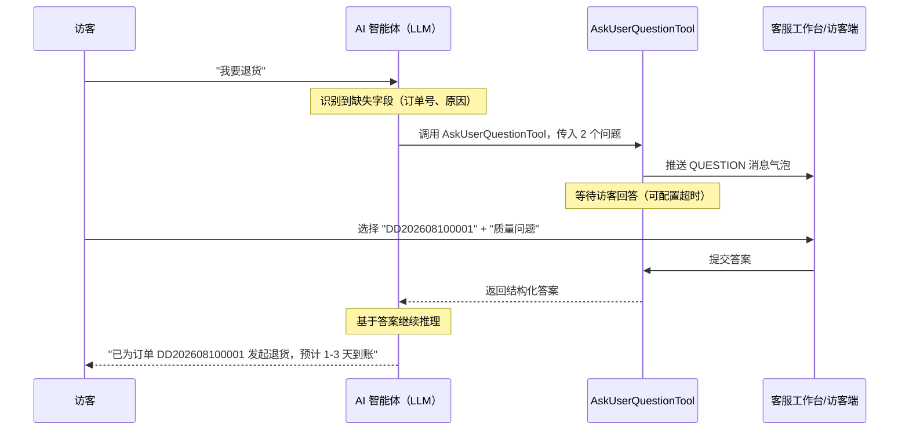

# AI 客服追问功能（Ask User Question）

在 AI 客服接待访客的过程中，经常会遇到需要访客继续澄清意图或补充更多信息的情况。微语提供了内置的**追问（Ask User Question）**能力：让 AI 智能体主动以结构化问题的形式向访客收集信息，访客通过点选即可完成澄清，而不必反复输入自然语言。

本页介绍该功能的产品设计与实现方向，部分细节会随版本迭代更新。

## 为什么需要追问

自助服务最大的拦路虎是“信息不全”：

- 访客说“我要退货”——但没说哪个订单、什么原因
- 访客说“怎么安装”——但没说产品型号、操作系统
- 访客说“我要报修”——但没说设备序列号、故障现象、期望上门时间

如果没有结构化的澄清，智能体要么硬猜（答错），要么直接转人工（本可自助的也变成人力成本）。追问能力把“向用户提问”变成了智能体的一种一等能力：智能体自己判断何时问、问什么、给哪些选项，访客点一下就能回答，而不必逐字输入。

## 工作原理



智能体把“向用户提问”当成一个可调用的工具，思路参考 [Claude Code 的 AskUserQuestion](https://platform.claude.com/docs/en/agent-sdk/user-input#question-format) 和 [spring-ai-agent-utils](https://github.com/spring-ai-community/spring-ai-agent-utils) 参考实现。微语并没有直接依赖外部库，而是借鉴设计自行实现了一套等价能力，以便原生融入多租户、多会话、WebSocket 的客服体系。

## 核心特性

- **AI 自主触发**：由 LLM 判断何时需要追问，无需写死话术。
- **结构化问题**：单次最多 1–4 个问题，每个问题 2–4 个选项，并支持自由输入。
- **单选与多选**：根据问题语义选择合适的交互方式。
- **业务字段绑定**：每个问题可携带 `key`，答案可直接回填到工单、订单查询或路由规则。
- **机器人级可配置**：开关、最大追问轮数、单次最大问题数、超时时间、是否允许自由输入、超时动作（继续等待 / 转人工 / 结束会话）。
- **复用微语消息体系**：以 `QUESTION` 消息类型下发，由访客端和客服端的专用气泡组件渲染。
- **可审计**：每次追问都会持久化，用于质检、命中率分析与转人工上下文。

## 问题格式

智能体提出的每个问题包含：

| 字段 | 说明 |
| --- | --- |
| `question` | 完整的问题文本，建议以“？”结尾。 |
| `header` | UI 展示用的短标签（建议不超过 12 个字符）。 |
| `options` | 2–4 个选项，每个选项包含 `label` 与 `description`。 |
| `multiSelect` | `true` 允许多选；`false`（默认）为单选。 |
| `allowOther` | `true` 允许访客在选项之外自由输入。 |
| `key` | 可选的业务字段标识（如 `order_no`、`reason`），便于下游系统直接使用。 |

示例：

```json
{
  "key": "order_no",
  "question": "请问您要退货的订单号是？",
  "header": "订单号",
  "multiSelect": false,
  "allowOther": true,
  "options": [
    { "label": "DD202608100001", "description": "8月10日下单，蓝牙耳机" },
    { "label": "DD202608090008", "description": "8月9日下单，手机壳" }
  ]
}
```

访客始终可以看到“其他”入口，输入自定义答案，不会被智能体的选项锁死。

## 交互流程

1. 访客发送一条消息。
2. 智能体识别到必要信息缺失或意图模糊。
3. 智能体调用 `AskUserQuestionTool`，传入结构化问题列表。
4. 访客端渲染**追问气泡**：卡片形式，含选项按钮和可选的自由输入框。
5. 访客提交答案（或主动取消，或超时未答）。
6. 智能体拿到结构化答案后继续对话——回答问题、查询订单，或带着已收集字段创建工单。

## 配置项

机器人设置中提供以下选项（括号内为默认值）：

| 配置项 | 默认值 | 说明 |
| --- | --- | --- |
| `enableAskUserQuestion` | `true` | 是否启用追问。 |
| `maxQuestionRounds` | `3` | 连续追问多少轮后自动转人工。 |
| `maxQuestionsPerCall` | `4` | 单次工具调用最多允许的问题数。 |
| `defaultTimeoutSeconds` | `300` | 追问气泡的等待超时（秒）。 |
| `allowFreeText` | `true` | 是否允许访客自由输入。 |
| `onTimeoutAction` | `TRANSFER_HUMAN` | 超时动作：`CONTINUE_WAIT` / `TRANSFER_HUMAN` / `END_THREAD`。 |
| `questionSystemPrompt` | _（内置）_ | 覆盖默认的追问策略提示词。 |

## 与其他模块的联动

追问不是孤立的提问功能，它的输出会直接进入其他业务模块：

- **工单**：带 `key` 的答案会映射到工单表单字段，智能体创建工单时自动预填。
- **订单**：访客选择订单号后，智能体下一轮可直接用该订单号调用 `OrderTools` 查询。
- **路由**：收集到的问题分类、紧急程度可作为统一路由的输入。
- **会话小结**：追问记录计入会话上下文，会话小结智能体可引用。
- **质检**：持久化的追问记录用于统计命中率、访客放弃率、平均回答时长。
- **实时监控**：客服端可看到机器人正在问什么、访客是否已答，便于顺畅接管。

## 降级策略

- 如果所用大模型不支持工具调用，机器人会在回复里以自由文本方式提问，回退为纯文本追问。
- 如果访客超时或主动取消，按 `onTimeoutAction` 处理——默认带上已有上下文转人工。
- 如果同一会话并发触发多次追问，只接受第一次，后续会被提示“已有进行中的追问”。

## 典型场景

### 退货澄清

> 访客：“我要退货。”
> 智能体追问：订单号（给出最近两单）+ 退货原因（质量 / 七天无理由 / 描述不符）。
> 访客点选。智能体查询订单、校验是否可退，发起退货或创建工单。

### 报修受理

> 访客：“我设备坏了。”
> 智能体追问：设备型号 + 序列号 + 故障现象 + 期望上门时间。
> 访客回答。智能体创建工单，字段全部预填，并派给对应团队。

### 售前咨询

> 访客：“我该选哪个套餐？”
> 智能体追问：团队规模 + 预估用量 + 必备功能。
> 访客点选。智能体推荐套餐，并询问是否转接销售。

## 实现说明

- 该功能以 Spring AI `@Tool` 的形式实现于 `modules/ai`，通过微语现有的工具注册表注册，任何启用了追问的机器人都可使用。
- 追问会话状态以 `threadUid` 为键保存在会话存储中；访客提交通过 REST 接口完成，多实例部署下通过 Redis 同步。
- 新增两个消息类型：`QUESTION`（智能体 → 访客）和 `QUESTION_SUBMIT`（访客 → 智能体），由专用气泡组件渲染。
- 详细设计、数据模型与分阶段计划见 `docs/plans/2026-08-10-ask-user-question-plan.md`。

## 相关文档

- [客服助手 Agent](./customer-service-assistant.md)
- [售后 Agent](./after-sales-agent.md)
- [售前 Agent](./pre-sales-agent.md)
- [spring-ai-agent-utils AskUserQuestionTool](https://github.com/spring-ai-community/spring-ai-agent-utils/blob/main/spring-ai-agent-utils/docs/AskUserQuestionTool.md)
- [Claude Agent SDK — User Input](https://platform.claude.com/docs/en/agent-sdk/user-input#question-format)
