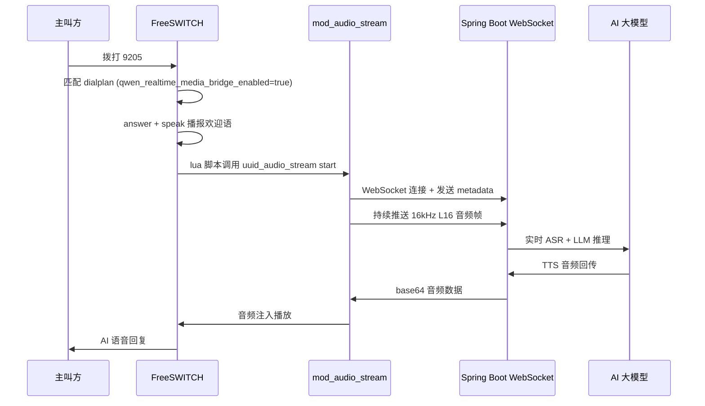

# Freeswitch Audio Stream

## 概述

`mod_audio_stream` 是一款用于 FreeSWITCH 的生产级 WebSocket 音频流模块。它通过 WebSocket 将实时音频流推送到外部系统（如 ASR 语音识别、TTS 语音合成、大模型实时对话），并支持接收 WebSocket 服务端的音频数据进行回放，实现全双工音频交互。

### 使用场景

- **AI 实时语音对话**：将通话媒体实时流式推送到大模型 WebSocket 端点（如 Qwen-Audio-Realtime），实现低延迟语音交互
- **实时语音识别 (ASR)**：将音频流推送到第三方 ASR 引擎进行实时转写
- **语音合成回放 (TTS)**：接收 WebSocket 服务端返回的音频数据，注入到通话中进行播放
- **音频质检与分析**：实时采集通话音频用于质检、情绪分析等

## 系统要求

- FreeSWITCH 1.10.x 或更高版本（需已安装并可正常使用）
- Linux 64 位系统（Ubuntu 20.04+ / Debian 11+）
- 构建依赖：`libfreeswitch-dev`、`libssl-dev`、`zlib1g-dev`、`libevent-dev`、`libspeexdsp-dev`、`cmake`

:::warning 前置条件
在安装 `mod_audio_stream` 之前，请先完成 FreeSWITCH 的安装。`mod_audio_stream` 编译时需要链接 FreeSWITCH 的开发头文件和库，因此 FreeSWITCH 必须先安装好。

- **如果 FreeSWITCH 通过 apt 安装**（添加了 [SignalWire 仓库](https://developer.signalwire.com/freeswitch/FreeSWITCH-Explained/Installation/Linux/Debian_6724009/)）：`libfreeswitch-dev` 可由 apt 直接安装
- **如果 FreeSWITCH 从源码编译安装**：头文件已随 `make install` 安装到 FreeSWITCH 安装目录下，无需再安装 `libfreeswitch-dev` 包（该包在标准 Ubuntu 仓库中不存在），但编译 `mod_audio_stream` 时**必须**设置 `PKG_CONFIG_PATH` 指向 FreeSWITCH 的 pkgconfig 目录
:::

## 编译安装

### 确定 FreeSWITCH 安装路径

编译前，先确认当前 FreeSWITCH 的安装方式和路径：

```bash
# 查看 FreeSWITCH 安装前缀
which freeswitch
# 如果输出 /usr/bin/freeswitch → apt 包安装
# 如果输出 /usr/local/freeswitch/bin/freeswitch → 源码安装（默认前缀）

# 查看 pkg-config 是否能找到 freeswitch
pkg-config --modversion freeswitch
# 有输出 → FreeSWITCH 开发文件系统路径可被找到
# 报错 "No package 'freeswitch' found" → 需要手动设置 PKG_CONFIG_PATH
```

### 环境依赖

```bash
# Debian/Ubuntu 安装通用依赖（无论 FreeSWITCH 安装方式都需要）
sudo apt-get install -y \
    libssl-dev \
    zlib1g-dev \
    libevent-dev \
    libspeexdsp-dev \
    cmake \
    git

# 如果 FreeSWITCH 是通过 apt 安装的（已添加 SignalWire 仓库），还需安装：
# sudo apt-get install -y libfreeswitch-dev
# 如果 FreeSWITCH 是源码安装，跳过此包，改为设置 PKG_CONFIG_PATH（见下方）
```

### 源码编译

```bash
# 克隆仓库
# 国内仓库地址： git clone https://gitee.com/270580156/mod_audio_stream.git
git clone https://github.com/amigniter/mod_audio_stream.git
cd mod_audio_stream

# 初始化子模块（libwsc WebSocket 客户端库）
git submodule init
git submodule update --recursive

# 关键步骤：设置 PKG_CONFIG_PATH
# 如果 FreeSWITCH 是源码安装（默认 /usr/local/freeswitch），此步不可省略：
export PKG_CONFIG_PATH=/usr/local/freeswitch/lib/pkgconfig:${PKG_CONFIG_PATH:-}
# 如果 FreeSWITCH 是 apt 安装且已安装 libfreeswitch-dev，通常可以不设置

# 编译（Release 模式）
mkdir build && cd build
cmake -DCMAKE_BUILD_TYPE=Release ..
make -j"$(nproc)"

# 安装
sudo make install

# 安装后更新动态库缓存（重要：否则 FreeSWITCH 加载模块时可能找不到 libwsc 等依赖库）
sudo ldconfig
```

:::tip 启用 TLS/WSS 支持
如需支持 `wss://` 加密连接，编译时添加 `-DUSE_TLS=ON`：

```bash
cmake -DCMAKE_BUILD_TYPE=Release -DUSE_TLS=ON ..
```

:::

### 一键脚本安装

```bash
sudo apt-get -y install git \
    && cd /usr/src/ \
    && git clone https://github.com/amigniter/mod_audio_stream.git \
    && cd mod_audio_stream \
    && sudo bash ./build-mod-audio-stream.sh
```

### 验证安装

```bash
# 检查模块文件是否存在（根据 FreeSWITCH 安装方式选择正确路径）
# 源码安装默认路径：
ls -l /usr/local/freeswitch/lib/freeswitch/mod/mod_audio_stream.so
# apt 安装路径：
# ls -l /usr/lib/freeswitch/mod/mod_audio_stream.so

# 检查模块文件大小（确认非空）
ls -lh /usr/local/freeswitch/lib/freeswitch/mod/mod_audio_stream.so

# 检查动态库依赖是否完整（关键：不能有 "not found" 条目）
ldd /usr/local/freeswitch/lib/freeswitch/mod/mod_audio_stream.so
```

## 启用模块

### 1. 编辑 modules.conf.xml

编辑 FreeSWITCH 模块配置文件，根据安装方式选择正确路径：

```bash
# 源码安装默认路径：
vim /usr/local/freeswitch/conf/autoload_configs/modules.conf.xml
# apt 安装路径：
# vim /etc/freeswitch/autoload_configs/modules.conf.xml
```

在 `<modules>` 节点中添加：

```xml
<load module="mod_audio_stream" />
```

### 2. 重启或重载

根据 FreeSWITCH 的进程管理方式，选择合适的重启方法：

```bash
# 如果是源码安装 + 手动启动：
freeswitch -stop
freeswitch -nc

# 如果是 systemd 管理（apt 安装或手动配置了 systemd 服务）：
sudo systemctl restart freeswitch

# 或者不重启，仅尝试重新加载模块配置（可能对新安装的模块无效）：
fs_cli -x "reload mod_audio_stream"
```

:::tip 注意
如果模块是第一次安装（`.so` 文件之前不存在），`reload mod_audio_stream` 可能无法加载。此时需要完全重启 FreeSWITCH。
:::

### 3. 验证模块已加载

```bash
# 在 fs_cli 中检查
fs_cli -x "module_exists mod_audio_stream"
# 返回 true 表示模块已加载

# 查看所有已加载模块
fs_cli -x "show modules" | grep mod_audio_stream
```

## API 命令

模块注册了 `uuid_audio_stream` API 命令，用于控制音频流的生命周期：

### 启动音频流

```bash
uuid_audio_stream <uuid> start <ws-url> <mix-type> <sampling-rate> [metadata]
```

将通道媒体附加到媒体 bug，并以 L16（线性 16-bit PCM）格式流式推送到 WebSocket 服务端。

| 参数 | 说明 | 可选值 |
| ---- | ---- | ---- |
| `uuid` | FreeSWITCH 通道唯一标识 | 通道 UUID |
| `ws-url` | WebSocket 服务端地址 | `ws://` 或 `wss://` |
| `mix-type` | 音频混合模式 | `mono`（仅主叫）、`mixed`（混合）、`stereo`（立体声分离） |
| `sampling-rate` | 采样率 | `8k`、`16k` |
| `metadata` | 可选，UTF-8 文本，在音频流开始前发送 | JSON 字符串等 |

**示例**：

```bash
# 启动 16kHz 单声道音频流，携带元数据
uuid_audio_stream <uuid> start ws://host.docker.internal:9003/voice-agent/media mono 16k {"uuid":"xxx","caller":"1001","botDid":"9205"}
```

### 停止音频流

```bash
uuid_audio_stream <uuid> stop [metadata]
```

停止音频流并关闭 WebSocket 连接。如果提供 metadata，将在连接关闭前发送。

### 暂停音频流

```bash
uuid_audio_stream <uuid> pause
```

### 恢复音频流

```bash
uuid_audio_stream <uuid> resume
```

### 发送文本消息

```bash
uuid_audio_stream <uuid> send_text <metadata>
```

向 WebSocket 服务端发送 UTF-8 文本消息。

## 通道变量

以下通道变量用于精细控制 WebSocket 连接和日志行为：

| 变量名 | 说明 | 默认值 |
| ---- | ---- | ---- |
| `STREAM_MESSAGE_DEFLATE` | 设为 `true` 或 `1` 禁用压缩 | 启用压缩 |
| `STREAM_HEART_BEAT` | 心跳间隔（秒），无流量时发送保活 | 关闭 |
| `STREAM_SUPPRESS_LOG` | 设为 `true` 或 `1` 禁止打印日志 | 关闭（打印） |
| `STREAM_BUFFER_SIZE` | 音频缓冲区大小（毫秒），需能被 20 整除 | 20 |
| `STREAM_EXTRA_HEADERS` | JSON 格式的额外 HTTP 请求头 | 无 |
| `STREAM_NO_RECONNECT` | 设为 `true` 或 `1` 禁用自动重连 | 开启自动重连 |
| `STREAM_TLS_CA_FILE` | TLS CA 证书文件，特殊值 `SYSTEM`（系统默认）或 `NONE`（不验证） | `SYSTEM` |
| `STREAM_TLS_KEY_FILE` | TLS 客户端私钥文件 | 无 |
| `STREAM_TLS_CERT_FILE` | TLS 客户端证书文件 | 无 |
| `STREAM_TLS_DISABLE_HOSTNAME_VALIDATION` | 设为 `true` 或 `1` 禁用主机名验证 | `false` |

**拨号计划中的设置示例**：

```xml
<action application="set" data="STREAM_BUFFER_SIZE=100" />
<action application="set" data="STREAM_HEART_BEAT=15" />
<action application="set" data="STREAM_SUPPRESS_LOG=true" />
```

## 事件

模块会生成以下 FreeSWITCH 自定义事件：

| 事件名 | 说明 |
| ---- | ---- |
| `mod_audio_stream::json` | 收到 WebSocket 服务端的响应消息 |
| `mod_audio_stream::connect` | 成功连接到 WebSocket 服务端 |
| `mod_audio_stream::disconnect` | 从 WebSocket 服务端断开连接 |
| `mod_audio_stream::error` | 连接出现错误，附带错误码和描述 |
| `mod_audio_stream::play` | 服务端返回 base64 音频数据，模块将其写到临时文件 |

### 错误码

| 错误码 | 说明 |
| ---- | ---- |
| 1 | IO 错误（Socket 读写失败） |
| 2 | 无效的 WebSocket 头部 |
| 3 | 服务端帧被掩码（不符合规范） |
| 4 | 请求的功能不受支持 |
| 5 | PING 超时 |
| 6 | TCP 连接或 DNS 解析失败 |
| 7 | SSL/TLS 上下文初始化失败 |
| 8 | SSL/TLS 握手失败 |
| 9 | 通用 OpenSSL 错误 |
| 10 | 超时 |
| 11 | WebSocket 协议错误 |

## Bytedesk FreeSWITCH 镜像集成

Bytedesk 已将 `mod_audio_stream` 预编译并内置到 `bytedesk-freeswitch` Docker 镜像中，开箱即用。

### 镜像信息

- **阿里云（国内推荐）**：`registry.cn-hangzhou.aliyuncs.com/bytedesk/freeswitch:latest`
- **Docker Hub**：`bytedesk/freeswitch:latest`

### 镜像内构建方式

镜像在构建时自动编译 `mod_audio_stream`（Dockerfile 中的相关阶段）：

```dockerfile
# 编译安装 mod_audio_stream（默认启用，用于 WebSocket 实时音频流）
ARG MOD_AUDIO_STREAM_REF=main
RUN git clone --depth 1 --branch ${MOD_AUDIO_STREAM_REF} \
      https://github.com/amigniter/mod_audio_stream.git && \
    cd mod_audio_stream && \
    git submodule update --init --recursive && \
    export PKG_CONFIG_PATH=${FREESWITCH_PREFIX}/lib/pkgconfig && \
    cmake -S . -B build -DCMAKE_BUILD_TYPE=Release && \
    cmake --build build -- -j"$(nproc)" && \
    cmake --install build
```

模块已在 `modules.conf.xml` 中默认启用：

```xml
<load module="mod_audio_stream" />
```

### 验证镜像中的模块

```bash
# 检查模块文件是否存在
docker exec freeswitch-bytedesk ls -la /usr/local/freeswitch/lib/freeswitch/mod/ | grep mod_audio_stream

# 检查模块是否已加载
docker exec freeswitch-bytedesk fs_cli -p bytedesk123 -x "module_exists mod_audio_stream"

# 查看所有已加载模块
docker exec freeswitch-bytedesk fs_cli -p bytedesk123 -x "show modules" | grep mod_audio_stream
```

## 配置参数说明（bytedesk-freeswitch 镜像）

### 环境变量

在 `compose-scenario-call.yaml` 和 `.env` 中通过以下环境变量配置：

| 环境变量 | 默认值 | 说明 |
| ---- | ---- | ---- |
| `FREESWITCH_QWEN_REALTIME_MEDIA_BRIDGE_ENABLED` | `false` | 是否启用 Qwen-Audio-Realtime 电话实时媒体桥（需 `mod_audio_stream` 已加载） |
| `FREESWITCH_QWEN_REALTIME_MEDIA_WS_URL` | `ws://host.docker.internal:9003/visitor/api/v1/call/voice-agent/qwen-realtime/media?output=mod_audio_stream&events=false&model=qwen-audio-3.0-realtime-plus&voice=longanqian&outputSampleRate=24000` | 实时媒体桥 WebSocket 地址 |

### compose-scenario-call.yaml 中的配置

```yaml
services:
  bytedesk-freeswitch:
    environment:
      # Qwen-Audio-Realtime 电话实时媒体桥
      FREESWITCH_QWEN_REALTIME_MEDIA_BRIDGE_ENABLED: ${FREESWITCH_QWEN_REALTIME_MEDIA_BRIDGE_ENABLED:-false}
      FREESWITCH_QWEN_REALTIME_MEDIA_WS_URL: ${FREESWITCH_QWEN_REALTIME_MEDIA_WS_URL:-ws://host.docker.internal:9003/visitor/api/v1/call/voice-agent/qwen-realtime/media?output=mod_audio_stream&events=false&model=qwen-audio-3.0-realtime-plus&voice=longanqian&outputSampleRate=24000}
```

### .env 示例

```bash
# Qwen-Audio-Realtime 电话实时媒体桥；启用前需确认 FreeSWITCH 镜像已安装/加载 mod_audio_stream
FREESWITCH_QWEN_REALTIME_MEDIA_BRIDGE_ENABLED=true
FREESWITCH_QWEN_REALTIME_MEDIA_WS_URL=ws://host.docker.internal:9003/visitor/api/v1/call/voice-agent/qwen-realtime/media
```

### vars.xml 全局变量

在 `deploy/freeswitch/conf/vars.xml` 中定义的全局变量：

```xml
<!-- 实时媒体桥开关（true=启用实时双工，false=回落 HTTAPI 回合制） -->
<X-PRE-PROCESS cmd="set" data="qwen_realtime_media_bridge_enabled=true" />

<!-- 实时媒体桥 WebSocket 地址 -->
<X-PRE-PROCESS cmd="set"
  data="qwen_realtime_media_ws_url=ws://host.docker.internal:9003/visitor/api/v1/call/voice-agent/qwen-realtime/media" />
```

### dialplan 拨号计划

在 `deploy/freeswitch/conf/dialplan/default/92-ai-bot.xml` 中定义了 9205 分机的两个工作模式：

#### 模式一：实时媒体桥（mod_audio_stream 已启用）

当 `qwen_realtime_media_bridge_enabled=true` 时，使用 `mod_audio_stream` 实现低延迟实时双工语音对话：

```xml
<extension name="92-ai-bot-qwen-realtime-media" continue="false">
  <condition field="${destination_number}:$${qwen_realtime_media_bridge_enabled}" expression="^9205:(true|1|yes)$">
    <!-- 设置 MRCP TTS 播报引擎 -->
    <action application="set" data="mrcp_profile=java-mrcp" />
    <action application="set" data="hangup_after_bridge=true" />
    <!-- mod_audio_stream 通道变量 -->
    <action application="set" data="STREAM_BUFFER_SIZE=100" />
    <action application="set" data="STREAM_HEART_BEAT=15" />
    <!-- TTS 引擎配置 -->
    <action application="set" data="tts_engine=unimrcp" />
    <action application="set" data="tts_profile=${mrcp_profile}" />
    <action application="set" data="unimrcp:header:Speech-Language=zh-CN" />
    <action application="set" data="synth-content-type=application/ssml+xml" />
    <!-- 应答并播报欢迎语 -->
    <action application="answer" />
    <action application="speak"
      data="unimrcp:${mrcp_profile}||&lt;speak version='1.0' xml:lang='zh-CN'&gt;您好，我是微语智能语音助手，请问有什么可以帮您的？&lt;/speak&gt;" />
    <!-- 启动实时媒体桥：Lua 脚本调用 uuid_audio_stream start -->
    <action application="lua" data="qwen_realtime_media_start.lua ws://host.docker.internal:9003/visitor/api/v1/call/voice-agent/qwen-realtime/media" />
    <action application="log" data="INFO [AI-BOT-9205-REALTIME] media bridge started after greeting uuid=${uuid}" />
    <action application="park" />
  </condition>
</extension>
```

#### 模式二：HTTAPI 回合制兜底

当 `qwen_realtime_media_bridge_enabled=false` 时，回退到 HTTAPI 回合制模式（不依赖 `mod_audio_stream`）：

```xml
<extension name="92-ai-bot-qwen-realtime-entry" continue="false">
  <condition field="destination_number" expression="^9205$">
    <action application="set" data="hangup_after_bridge=true" />
    <action application="answer" />
    <action application="httapi"
      data="{url=$${ai_bot_base_url}/ai-bot?turn=1&amp;mode=unlimited&amp;bot_did=9205&amp;voice_agent=true,method=POST}" />
  </condition>
</extension>
```

### Lua 启动脚本

`deploy/freeswitch/scripts/qwen_realtime_media_start.lua` 负责调用 `uuid_audio_stream` API：

```lua title="qwen_realtime_media_start.lua"
local session = session

local function json_escape(value)
  value = value or ""
  value = value:gsub('\\', '\\\\')
  value = value:gsub('"', '\\"')
  return value
end

if not session or not session:ready() then
  freeswitch.consoleLog("WARNING", "[AI-BOT-9205-REALTIME] no ready session for media bridge\n")
  return
end

local uuid = session:get_uuid()
local caller = session:getVariable("caller_id_number") or ""
local ws_url = argv and argv[1] or ""

if ws_url == "" then
  ws_url = "ws://host.docker.internal:9003/visitor/api/v1/call/voice-agent/qwen-realtime/media"
end

local metadata = string.format('{"uuid":"%s","caller":"%s","botDid":"9205"}',
  json_escape(uuid), json_escape(caller))
local command = string.format("uuid_audio_stream %s start %s mono 16k %s",
  uuid, ws_url, metadata)
local api = freeswitch.API()
local result = api:executeString(command) or ""

freeswitch.consoleLog("INFO", string.format(
  "[AI-BOT-9205-REALTIME] media bridge start uuid=%s ws=%s result=%s\n",
  uuid, ws_url, result))
```

## 典型使用流程

以通过 `bytedesk-freeswitch` 镜像实现 AI 实时语音对话为例：



## 常见问题

### 1. 模块加载失败

**现象**：`fs_cli -x "module_exists mod_audio_stream"` 返回 `false`

**排查**：

- 检查模块文件是否存在：`ls -l /usr/local/freeswitch/lib/freeswitch/mod/mod_audio_stream.so`
- 查看 FreeSWITCH 日志：`tail -f /usr/local/freeswitch/log/freeswitch.log`
- 检查依赖库是否完整：`ldd /usr/local/freeswitch/lib/freeswitch/mod/mod_audio_stream.so`

### 2. 启动音频流无反应

**现象**：调用 `uuid_audio_stream start` 后没有连接到 WebSocket

**排查**：

- 确认 WebSocket 服务端可达：在容器内 `curl` 或 `telnet` 测试目标地址和端口
- 检查 Docker 网络：容器内使用 `host.docker.internal` 访问宿主机服务
- 查看 FreeSWITCH 日志中的 error 事件
- 确认 `STREAM_NO_RECONNECT` 未设为 `true`

### 3. 音频质量差或断流

- 调整 `STREAM_BUFFER_SIZE`（默认 20ms，可设为 100ms）
- 启用 `STREAM_HEART_BEAT` 防止负载均衡器断开空闲连接
- 检查 WebSocket 服务端的处理能力是否匹配并发数

### 4. WSS 连接失败

- 确认编译时启用了 TLS 支持（`-DUSE_TLS=ON`）
- 正确设置 `STREAM_TLS_CA_FILE`、`STREAM_TLS_CERT_FILE`、`STREAM_TLS_KEY_FILE`
- 如需跳过证书验证：设 `STREAM_TLS_DISABLE_HOSTNAME_VALIDATION=true`

### 5. 启用实时媒体桥后 9205 仍走 HTTAPI 回合制

**排查**：

- 确认 `qwen_realtime_media_bridge_enabled=true` 已生效：`fs_cli -x "global_getvar qwen_realtime_media_bridge_enabled"`
- 确认 `mod_audio_stream` 已加载：`fs_cli -x "module_exists mod_audio_stream"`
- 重新加载 XML 配置：`fs_cli -x "reloadxml"`
- 查看 dialplan 匹配日志：拨号时关注日志中的 `[AI-BOT-9205-REALTIME]` 前缀

## 参考

- [mod_audio_stream GitHub](https://github.com/amigniter/mod_audio_stream)
- [mod_audio_stream libwsc (WebSocket Client)](https://github.com/amigniter/libwsc)
- [Bytedesk FreeSWITCH Docker 镜像](https://github.com/Bytedesk/bytedesk-freeswitch)
- [FreeSWITCH Module: mod_audio_fork](https://developer.signalwire.com/freeswitch/FreeSWITCH-Explained/Modules/mod_audio_fork_6587401/)
- [Qwen-Audio 实时语音模型](https://github.com/QwenLM/Qwen-Audio)
