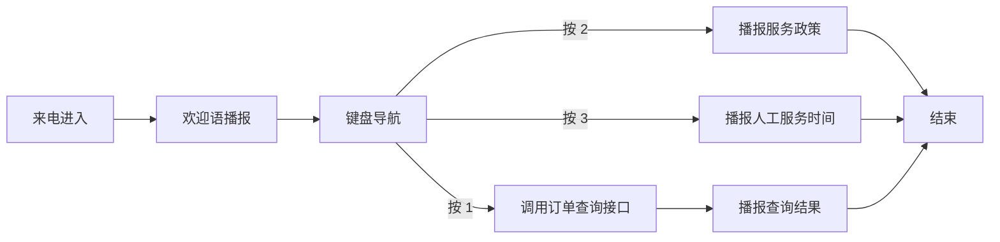

# 微语IVR流程编辑器

## IVR预览

微语 IVR 流程编辑器用于配置企业电话的自动语音服务流程。它主要面向运营、客服主管、实施顾问和业务管理员设计，不要求具备编程背景，也不需要理解复杂的通信协议。通过可视化拖拽和表单配置，就可以把“来电欢迎语、按键导航、信息查询、结果播报、结束通话”等步骤组织成一条完整的电话自助服务流程。

简单理解，IVR 就是电话里的“语音菜单”。例如：

- 来电先听到欢迎语
- 用户按 1 查询订单
- 用户按 2 查询余额
- 用户按 3 转到人工或播报服务说明

这些流程都可以在微语 IVR 流程编辑器中完成配置。

## 适合哪些场景

微语 IVR 工作流编辑器适合以下常见业务场景：

- 企业总机导航：按 1 销售，按 2 售后，按 3 财务
- 下班时间自动应答：播报非工作时间说明，并引导留言或回呼
- 自助查询：根据来电号码查询订单、积分、会员状态等信息
- 服务政策播报：播报价格说明、售后政策、活动通知等固定内容
- 呼入分流：通过按键把不同类型的客户引导到不同处理路径

对于大多数企业来说，它的价值不在于“技术炫酷”，而在于把重复、标准、可自助完成的电话问题前置处理，减少人工接听压力，提升首轮响应效率。

## 这类编辑器能做什么

当前项目中的微语 IVR 编辑器，已经具备一套完整的基础能力：

- 可新建 IVR 工作流，并支持选择预置模板快速开始
- 可通过拖拽方式搭建流程，而不是手工写代码
- 可对每个节点配置播报内容、按键选项、接口地址等业务信息
- 可保存、修改、删除工作流
- 可导入和导出工作流 JSON，便于备份、迁移和复制配置
- 可执行工作流进行快速校验
- 可将工作流绑定到 IVR 菜单/号码入口上，接入真实呼叫场景
- 可在后台查看 IVR 调用记录、按键输入、播报内容和录音信息

## 编辑器中的核心节点

为了让非技术人员更容易理解，可以把整个 IVR 流程看成由几种“积木”组成：

### 1. 开始

表示一次来电进入流程的入口。通常不需要额外配置，它是整条流程的起点。

### 2. 语音播报

用于向来电用户播报一段提示语，例如：

- 欢迎致电 XX 公司
- 当前为非工作时间
- 您的订单正在查询中，请稍候

如果您的场景主要是“告诉用户一段话”，通常就会使用这个节点。

### 3. 键盘导航

用于收集用户按键，并按照不同按键进入不同分支。例如：

- 按 1 查询订单
- 按 2 查询余额
- 按 3 获取人工服务时间

这是 IVR 最常见的能力，也是电话导航树的核心。

### 4. 接口调用

用于从业务系统查询实时数据，再把结果转成语音播报内容。常见用途包括：

- 查询订单状态
- 查询会员积分
- 查询账户余额
- 查询预约结果

对业务人员来说，只需要理解它的目标是“去系统里取一条信息，再说给用户听”；具体接口接入通常由实施或技术团队配合完成。

### 5. 按键分支

用于做更细的条件判断，把不同输入导向不同结果。适合流程较复杂、分支较多的场景。

### 6. 结束

表示当前电话自助流程完成。通常放在播报结束语或完成查询结果之后。

## 如何搭建一个 IVR 流程

一个典型的配置过程通常只有 4 步：

### 第一步：创建工作流

在工作流页面中创建新的 IVR 工作流。当前版本支持至少两类常见模板：

- 快速开始：适合快速搭建标准 IVR 菜单
- 下班留言：适合配置非工作时间提示、留言和紧急联系电话

如果业务流程比较标准，建议先选择模板，再按企业实际话术做微调，会更高效。

### 第二步：拖拽节点并连线

从左侧节点面板把“语音播报”“键盘导航”“接口调用”等节点拖到画布中，再按照真实业务顺序把它们连接起来。

例如，一个简单的呼入导航可以这样设计：

1. 开始
2. 欢迎语播报
3. 键盘导航
4. 查询或说明节点
5. 结束

### 第三步：填写每个节点的内容

选中节点后，可以在属性面板中填写对应信息，例如：

- 语音播报节点：填写播报文案
- 键盘导航节点：设置按键与对应分支
- 接口调用节点：填写查询地址、请求方式和返回话术模板

业务人员最需要关注的通常是“用户会听到什么、按什么键、最终进入哪条路径”。

### 第四步：保存并验证

流程配置完成后，可以先保存，再执行工作流进行基础校验，确认没有明显的配置遗漏。确认无误后，再把这条工作流绑定到对应的 IVR 菜单或号码入口。

## 工作流如何接入真实电话场景

在当前项目实现中，IVR 工作流并不是单独存在的，它会和呼叫管理中的 IVR 菜单一起使用。

业务上可以这样理解：

- IVR 菜单负责定义“哪个号码入口使用哪条流程”
- IVR 工作流负责定义“进入后具体怎么播报、怎么收集按键、怎么查询信息”

在 IVR 菜单配置页面中，可以：

- 设置 IVR 菜单名称
- 设置自定义号码/分机号
- 设置呼入、呼出或呼入呼出类型
- 选择绑定哪一条 IVR 工作流

完成绑定后，来电进入对应入口时，就会按所选工作流执行。

## 上线后如何查看效果

微语提供了 IVR 调用记录页面，方便业务人员复盘流程是否真的发挥作用。当前可查看的信息包括：

- 分机号
- 来电号码
- 当前状态
- 用户按下的按键
- 当前节点和下一节点
- 播报内容
- 通话时长、挂断原因
- 录音文件

这意味着业务团队不仅能“发布一条 IVR 流程”，还可以继续分析：

- 用户最常按哪个键
- 哪个环节最容易中断
- 播报内容是否过长
- 是否需要优化分支设计

## 推荐的使用方式

为了让 IVR 更适合非技术团队长期使用，建议采用下面的配置方法：

1. 先从简单流程开始，不要一开始就设计太多分支。
2. 每个播报节点只表达一个明确动作，避免话术过长。
3. 高频问题优先放在前面，减少用户等待和多层跳转。
4. 需要实时查询的数据，再交给接口调用节点处理。
5. 上线后结合 IVR 调用记录持续优化，而不是一次配置后长期不动。

## 一个典型例子

下面是一条适合多数企业的基础 IVR 流程：

1. 播报欢迎语：“您好，欢迎致电微语客户服务中心。”
2. 提示按键：“订单查询请按 1，服务政策请按 2，人工服务时间请按 3。”
3. 如果用户按 1，则调用订单查询接口，并播报查询结果。
4. 如果用户按 2，则播报售后或服务政策说明。
5. 如果用户按 3，则播报人工服务时间与转接说明。
6. 流程结束。

这类流程对业务人员最友好的地方在于：逻辑结构与传统流程图一致，编辑方式接近搭积木，不需要写程序。

### 典型流程示意图

下面这张图可以帮助非技术人员快速理解，一条 IVR 流程在系统里通常是如何组织的：

可以把它理解为一棵电话导航树：

- 所有来电都会先进入欢迎语
- 欢迎语之后进入按键选择
- 不同按键走向不同处理路径
- 查询类路径通常会先调用系统接口，再把结果播报给用户
- 说明类路径通常直接播报内容，然后结束流程

如果您在编辑器中看到多个节点和连线，本质上就是把上图中的每一步，拆成可单独维护的配置单元。

## 总结

微语 IVR 流程编辑器是一套面向业务配置的可视化电话流程设计工具。它把原本需要技术人员参与的 IVR 配置工作，尽可能转化为“拖拽节点 + 填写话术 + 绑定入口 + 查看效果”的标准化过程。

如果您的目标是快速搭建企业总机、下班留言、自助查询或电话按键导航，那么这套编辑器已经能覆盖大多数基础场景；对于需要对接业务系统的高级查询场景，也可以在现有流程基础上继续扩展。

## 延伸阅读

- [来电弹屏](./popup)：了解客户从 IVR 转人工后，坐席工作台如何自动弹屏并同步通话状态。
- [软电话工具条](./softphone)：了解坐席在承接 IVR 转人工后，如何继续进行接听、转接、保持和挂断操作。
