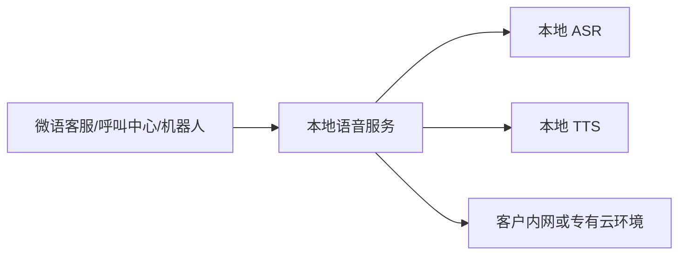

# 本地化 TTS/ASR

微语本地化 TTS/ASR 方案，面向对数据安全、业务连续性和私有化交付有明确要求的企业客户。通过将语音识别和语音合成能力部署在客户自有服务器、专有云或内网环境中，微语可以在不依赖外部云语音服务的前提下，为客服、呼叫中心、语音机器人和知识服务场景提供完整的语音能力。

对于售前项目来说，这一方案的核心价值并不只是“本地部署”，而是帮助客户同时解决以下三类问题：

- 音频与文本数据不出域，满足安全与合规要求
- 不受第三方云语音接口价格、配额和网络波动影响
- 与微语系统统一交付，形成完整的一体化私有化方案

当前推荐的本地语音服务为 bytedesk-ttsasr。该组件可独立部署，并与微语系统无缝集成，支撑本地 ASR 与本地 TTS 两类核心能力。

:::tip 说明

这里的“无需访问外部云服务”指的是业务运行阶段不需要调用外部云语音 API。若客户要求完全离线交付，可在项目实施阶段提前完成模型准备与本地化部署。

:::

## 方案定位

微语本地化 TTS/ASR 不是单独的语音工具，而是微语私有化解决方案中的一个基础能力模块，适合与以下系统能力一起打包交付：

- 在线客服
- 智能呼叫中心
- AI 机器人与智能外呼
- 工单与质检系统
- 企业知识库与语音问答

在方案层面，客户看到的是一套“可私有化、可扩展、可持续运营”的语音能力，而不是多个分散的外部接口拼装。

## 客户价值

### 数据安全可控

语音文件、识别文本、播报内容均可保留在客户环境中处理，避免敏感录音、客户信息或业务语料流转到第三方平台。这对于政企、金融、医疗、教育、制造等行业尤为重要。

### 私有化交付完整

微语可将 IM、客服、呼叫中心、机器人、语音能力统一交付。客户不需要分别采购多个云厂商能力，也不需要额外承担多供应商集成、对接和运维成本。

### 成本结构更清晰

相较于按调用量计费的外部云语音接口，本地化方案更适合中高频语音业务场景。尤其在坐席规模较大、呼入呼出量较高、机器人播报频繁的项目中，整体成本更易预测。

### 服务稳定性更强

语音能力部署在客户本地环境中，可减少公网链路依赖，降低因外部服务波动、区域网络问题或接口策略变化带来的业务风险。

## 适用场景

### 智能客服

- 客户语音输入自动转文字
- 客服消息支持语音播报
- 在网页、移动端、桌面端提供统一语音交互体验

### 呼叫中心

- 本地 IVR 语音播报
- 通话录音转写
- 外呼机器人语音播报
- 质检、摘要、检索等后处理场景

### AI 语音机器人

- 结合大模型实现语音问答
- 支持知识库语音应答
- 支持企业内部专有语料场景

### 强合规行业

- 政务与国资项目
- 银行、保险、证券等金融场景
- 医疗健康与公共服务场景
- 教育、制造、园区等内网部署场景

## 方案能力概览

微语本地化 TTS/ASR 方案具备以下能力：

- 本地语音识别，将录音或音频流转换为文本
- 本地文字转语音，将系统消息、机器人回复转换为语音
- 多模型可选，便于根据项目预算、设备条件和效果要求灵活配置
- 可作为独立语音服务部署，与微语主系统分层解耦
- 支持 Docker 化部署，便于交付、扩容和运维

整体方案关系如下：

## 部署方式

微语本地化 TTS/ASR 支持以下交付模式：

- 单机部署：适合 PoC、演示环境或中小规模项目
- 集群部署：适合正式生产环境和高并发场景
- 专有云部署：适合集团客户、政企客户和统一资源池场景
- 内网离线部署：适合严格隔离网络环境

部署时可根据项目规模选择 CPU 或 GPU 资源。一般来说：

- CPU 适合功能验证、演示和轻量业务
- GPU 更适合生产环境、高并发和低延迟要求场景

## 相关项目

- [微语主项目](https://github.com/Bytedesk/bytedesk)
- [本地语音服务 bytedesk-ttsasr](https://github.com/Bytedesk/bytedesk-ttsasr)
