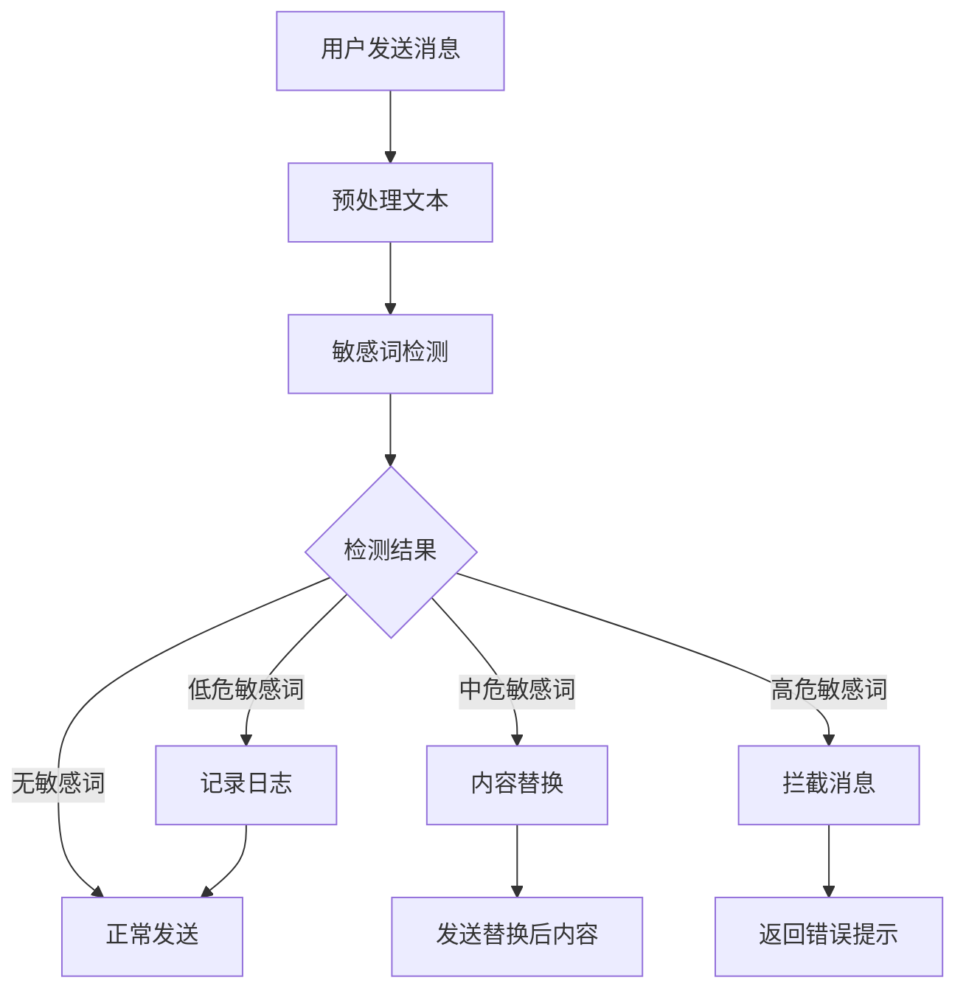

# 敏感词过滤

敏感词过滤是微语客服系统的重要安全功能，能够自动检测和处理访客或客服人员发送的不当内容，包括政治敏感、色情低俗、辱骂攻击等不文明字眼，营造健康的沟通环境。

:::tip 版本说明
社区版不支持，请升级到企业版或平台版。请替换[licenseKey](../development/license.md)
:::

:::info 相关文档

- [会话管理](./thread.md)：会话基础功能
- [消息处理](./message.md)：消息发送和接收

:::

## 功能概述

### 核心能力

1. **实时过滤**
   - 消息发送前自动检测敏感词
   - 支持中英文及多语言敏感词识别
   - 毫秒级响应，不影响聊天体验

2. **智能识别**
   - 变体检测（如：拼音、谐音、符号替换）
   - 上下文语义分析
   - 多种规避手段识别

3. **灵活处理**
   - 敏感词替换（星号、马赛克等）
   - 消息拦截阻止发送
   - 敏感等级分类处理

### 应用场景

#### 访客端过滤

- **防止恶意骚扰**：过滤辱骂、攻击性言论
- **维护平台形象**：阻止色情、低俗内容
- **合规要求**：符合网络安全法规要求

#### 客服端过滤

- **规范服务用语**：避免不当表达影响企业形象
- **防范法律风险**：过滤可能引起纠纷的敏感表述
- **提升服务质量**：引导使用专业、友好的沟通方式

## 敏感词分类

### 按内容类型分类

#### 1. 政治敏感词

包含政治相关的敏感内容：

- **政治人物**：涉及政治人物的不当言论
- **政治事件**：敏感政治事件相关词汇
- **地区敏感**：涉及敏感地区的争议性表述

#### 2. 色情低俗词

包含不健康的色情内容：

- **色情描述**：直接的色情描述词汇
- **性暗示**：间接的性暗示内容
- **低俗用语**：粗俗、不雅的表达

#### 3. 辱骂攻击词

包含人身攻击和辱骂内容：

- **人身攻击**：针对个人的恶意攻击
- **歧视言论**：种族、性别、地域歧视
- **威胁恐吓**：包含威胁性质的言论

#### 4. 违法信息

包含违法违规内容：

- **欺诈信息**：诈骗、虚假信息
- **违禁品**：毒品、枪支等违禁物品
- **赌博相关**：赌博、博彩相关内容

### 按严重程度分级

#### 高危级别

- **处理方式**：直接拦截，禁止发送
- **典型内容**：严重政治敏感、极端暴力内容
- **后续动作**：记录日志，可能触发人工审核

#### 中危级别

- **处理方式**：替换为星号或提示词
- **典型内容**：一般性辱骂、轻度色情暗示
- **后续动作**：计入统计，达到阈值触发警告

#### 低危级别

- **处理方式**：仅记录，不影响发送
- **典型内容**：边缘敏感词、争议性词汇
- **后续动作**：用于数据分析和趋势监控

## 技术实现

### 检测算法

#### 1. 关键词匹配

系统支持多种匹配方式：

- **精确匹配**：完全匹配敏感词汇
- **模糊匹配**：支持相似词汇检测
- **正则表达式匹配**：支持复杂模式匹配

#### 2. 智能变体检测

**拼音替换检测**：

- 示例：SB → 煞笔 → 傻X
- 检测原理：通过拼音对比识别替换词汇

**符号分隔检测**：

- 示例：傻*逼 → 傻@逼 → 傻 逼
- 检测原理：去除符号后进行词汇匹配

**谐音替换检测**：

- 示例：沙比 → 煞笔 → 傻X
- 检测原理：通过谐音词库识别替代表达

#### 3. 语义分析

系统提供智能语义分析能力：

- **上下文分析**：结合前后文判断词汇含义
- **情感倾向分析**：识别消息的情感色彩
- **意图识别**：判断用户的表达意图

### 过滤流程

#### 消息处理流程



#### 实时检测功能

系统提供多种检测功能：

1. **敏感词检测**：识别文本中的敏感内容
2. **内容过滤**：自动处理敏感词汇
3. **批量检测**：支持多条消息同时检测

**检测结果包含**：

- 是否包含敏感词
- 敏感等级（高/中/低）
- 具体敏感词位置和类别
- 置信度评分
- 替代建议（如有）

## 管理配置

### 敏感词库管理

#### 词库结构

敏感词库包含以下信息：

- **词汇内容**：具体的敏感词汇
- **分类标签**：政治、色情、辱骂、违法等
- **敏感等级**：高危、中危、低危
- **状态管理**：启用或禁用
- **创建信息**：创建时间和创建人

#### 词库操作

1. **添加敏感词**
   - 支持单个添加和批量导入
   - 自动检测重复词汇
   - 支持正则表达式模式

2. **编辑敏感词**
   - 修改敏感级别
   - 更新分类标签
   - 调整处理策略

3. **删除敏感词**
   - 软删除保留历史记录
   - 批量删除功能
   - 删除前影响评估

### 过滤规则配置

#### 全局设置

管理员可以配置以下全局参数：

- **功能开关**：启用或关闭敏感词过滤
- **检测模式**：严格、普通、宽松三种模式
- **默认处理方式**：拦截、替换或警告
- **替换字符**：自定义替换符号（如*号）
- **变体检测**：是否检测变体形式
- **语义分析**：是否启用智能语义分析

#### 角色权限设置

不同角色可以设置不同的过滤标准：

- **检测严格程度**：1-10级调节，数字越大越严格
- **允许的类别**：设置哪些类别的敏感词生效
- **自定义规则**：针对特定角色的专门处理规则

### 白名单管理

#### 词汇白名单

对于某些在特定场景下不应被过滤的词汇，可以设置白名单：

- **词汇内容**：不需要过滤的具体词汇
- **使用场景**：适用的业务场景描述
- **白名单原因**：为什么需要加入白名单
- **作用范围**：全局、部门或个人范围

#### 用户白名单

对于特定用户群体的特殊处理：

- **VIP客户**：放宽检测标准
- **内部测试**：跳过敏感词检测
- **特殊业务**：自定义过滤规则

## 处理策略

### 访客消息处理

#### 1. 消息拦截

**高危敏感词处理**：

当检测到高危敏感词时，系统会：

- 阻止消息发送
- 返回友好的错误提示
- 建议使用文明用语
- 记录拦截日志

#### 2. 内容替换

**中危敏感词处理**：

当检测到中危敏感词时，系统会：

- 将敏感词替换为星号或其他符号
- 保持句子结构完整
- 允许消息正常发送
- 计入统计数据

#### 3. 警告提示

**低危敏感词处理**：

当检测到低危敏感词时，系统会：

- 保持原内容不变
- 给出友好提醒
- 引导文明用语
- 记录行为数据

### 客服消息处理

#### 1. 实时提醒

在客服输入敏感词时实时提醒：

- **输入警告**：在输入框显示警告提示
- **敏感等级提示**：显示敏感词的危险等级
- **替代建议**：提供合适的替代词汇
- **位置标注**：标明敏感词在文本中的位置

#### 2. 发送前确认

对于中高危敏感词，要求客服确认：

- **原内容展示**：显示包含敏感词的原始内容
- **建议内容**：提供修改后的建议内容
- **发送选项**：原样发送、使用建议或取消发送
- **原因说明**：解释为什么需要确认

#### 3. 管理员通知

严重违规时通知管理员：

- **违规类型**：敏感词违规事件
- **涉事客服**：违规的客服人员信息
- **敏感内容**：具体的敏感词内容
- **严重等级**：违规的严重程度
- **发生时间**：违规发生的具体时间
- **会话信息**：相关的会话标识

## 监控与统计

### 数据指标

#### 过滤统计

- **总检测次数**：系统检测敏感词的总次数
- **拦截率**：被拦截消息占总消息的比例
- **误判率**：错误拦截正常消息的比例
- **命中分布**：各类敏感词的命中频率

#### 用户行为分析

系统提供全方位的数据分析：

**按时间统计**：

- 每日敏感词检测趋势
- 每周违规行为统计
- 每月数据对比分析

**按用户统计**：

- 访客违规行为统计
- 客服违规情况分析
- 用户群体行为对比

**按类型统计**：

- 各类敏感词命中分布
- 不同类别的趋势变化
- 敏感词热度排行

### 报表分析

#### 1. 敏感词趋势报表

- 展示敏感词检测的时间趋势
- 分析敏感词类型的变化
- 识别异常峰值和原因

#### 2. 用户违规报表

- 统计各用户的违规情况
- 识别频繁违规用户
- 分析违规行为模式

#### 3. 系统效果报表

- 评估过滤系统的有效性
- 分析误判和漏判情况
- 优化建议和改进方向

## 最佳实践

### 词库维护

#### DO - 推荐做法

**持续更新词库**：

- 定期收集新出现的敏感词汇
- 关注网络流行语和变体形式
- 根据业务特点定制专属词库
- 建立用户举报和反馈机制

**合理设置等级**：

- 根据业务性质调整敏感度
- 区分不同角色的检测标准
- 避免过度敏感影响正常交流
- 定期评估和调整规则

#### DON'T - 避免的问题

**过度过滤**：

- 不要将所有争议词汇都设为高危
- 避免过滤正常的业务术语
- 不要忽视上下文语境
- 避免一刀切的处理方式

### 用户体验优化

#### 1. 友好的提示信息

**DO - 良好的提示**：

```text
❌ 避免：您的消息违规，无法发送
✅ 推荐：为了营造良好的交流环境，请使用文明用语
```

#### 2. 提供替代建议

系统可以为敏感词提供合适的替代建议：

**建议内容包括**：

- 原始敏感表达
- 推荐的替代表达
- 修改建议的原因说明

**示例说明**：

- 原文："这个功能太垃圾了"
- 建议："这个功能还有改进空间"
- 原因："建议使用更客观的表达方式"

#### 3. 渐进式处理

- **首次违规**：友好提醒，允许修改
- **多次违规**：增加限制，要求确认
- **严重违规**：临时限制发言权限

### 业务场景定制

#### 1. 电商客服场景

**特殊考虑**：

- 商品名称可能包含敏感词
- 用户投诉时情绪较激动
- 需要平衡过滤严格度和用户体验

**定制策略**：

- 建立商品名称白名单
- 投诉场景适当放宽标准
- 提供情绪引导和安抚

#### 2. 金融客服场景

**特殊考虑**：

- 涉及金额数字敏感
- 投资风险提示重要
- 监管要求较为严格

**定制策略**：

- 严格过滤诱导投资言论
- 加强金融诈骗相关检测
- 保留完整的审计日志

## 常见问题

### Q: 如何处理误判情况？

**A**: 系统提供多种误判处理机制：

1. **用户申诉**：提供申诉渠道，人工审核误判
2. **白名单机制**：将误判词汇加入白名单
3. **上下文优化**：改进语义分析算法
4. **规则调整**：根据反馈调整检测规则

### Q: 敏感词库如何更新？

**A**: 支持多种更新方式：

- **自动更新**：定期从云端同步最新词库
- **手动导入**：支持Excel/CSV格式批量导入
- **API更新**：通过接口实时添加新词汇
- **用户举报**：收集用户反馈自动学习

### Q: 如何平衡过滤严格度和用户体验？

**A**: 建议采用分层策略：

1. **角色区分**：访客和客服使用不同标准
2. **场景适配**：投诉、咨询等场景差异化处理
3. **渐进处理**：首次提醒，重复加重处理
4. **智能建议**：提供替代表达建议

### Q: 系统性能如何保证？

**A**: 采用多种性能优化策略：

- **缓存机制**：热门词汇结果缓存
- **异步处理**：非阻塞式检测
- **分布式部署**：支持集群部署
- **算法优化**：高效的字符串匹配算法

### Q: 是否支持多语言检测？

**A**: 支持多语言敏感词检测：

- **中英文混合**：支持中英文混合内容检测
- **拼音检测**：支持拼音替代检测
- **繁简转换**：自动处理繁简体转换
- **扩展语言**：可配置其他语言词库
