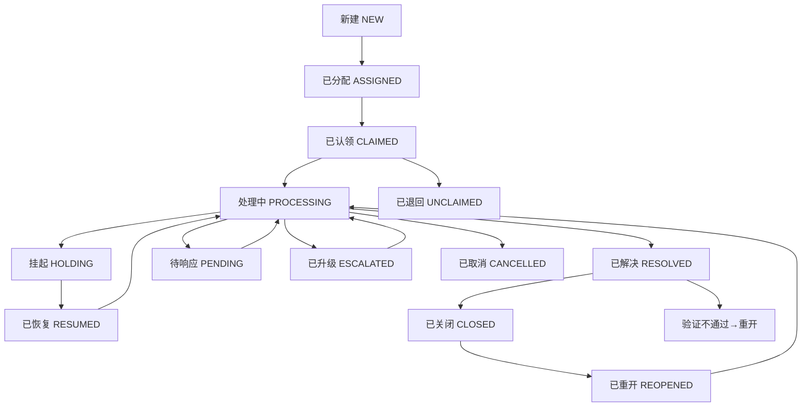

# 工单工作流

## 功能简介

工单工作流是微语全新推出的**可视化流程设计器**，让你无需编写代码，通过拖拽节点、连线的方式，像画流程图一样轻松设计工单的处理流程。从审批、会签到通知、条件分支，所有环节一目了然。

同时，工作流内置了 **AI 智能助手**，你只需用自然语言描述需求（如"在审批后面加一个通知节点"），AI 即可自动帮你修改流程。

### 核心价值

- **零代码设计**：拖拽式操作，业务人员也能轻松上手
- **丰富节点类型**：覆盖审批、会签、或签、条件分支、并行、通知、HTTP 调用、子流程等场景
- **AI 辅助编辑**：对话式修改流程，大幅提升效率
- **一键部署**：设计完成后一键部署到流程引擎，即时生效
- **模板开箱即用**：内置请假审批、报销审批、IT 支持等演示流程，可直接使用或参考修改

## 预览

### 工作流设计器界面

工单工作流设计器（TicketBuilder）包含以下主要区域：

| 区域 | 说明 |
| --- | --- |
| **顶部工具栏** | 流程选择、创建/编辑/删除、部署/取消部署、保存、导入/导出、AI 对话开关 |
| **左侧节点面板** | 可拖拽的节点列表，包含审批、会签、或签、通知、条件分支等节点 |
| **中央画布** | 可视化流程编辑区域，支持拖拽节点、连线、调整布局 |
| **右侧属性面板** | 点击节点后显示属性编辑区域，可配置节点详细参数 |
| **右侧 AI 面板** | AI 对话窗口，用自然语言修改流程 |
| **小地图** | 画布缩略图，快速定位和导航 |

## 节点类型

工单工作流提供以下节点类型，覆盖各类业务场景：

### 流程控制节点

| 节点 | 说明 | 典型场景 |
| --- | --- | --- |
| **开始** | 流程起点，每个流程有且仅有一个 | 工单创建后自动触发 |
| **结束** | 流程终点，标记流程完成 | 工单关闭、取消时到达 |
| **条件分支** | 根据条件判断走向不同分支 | 根据金额、类型等条件自动分流 |
| **并行分支** | 同时触发多个下游分支 | 审批的同时发送通知 |
| **合并** | 等待所有上游分支完成后再继续 | 多个并行审批都完成后汇总 |

### 审批节点

| 节点 | 说明 | 典型场景 |
| --- | --- | --- |
| **审批** | 单人审批，指定审批人进行审批 | 直属上级审批请假申请 |
| **会签** | 多人审批，支持"全部同意""按比例通过""按人数通过"三种模式 | 重要合同需多人共同审批 |
| **或签** | 多人审批，任一人同意即通过 | 部门内任一主管审批即可 |

### 集成与通知节点

| 节点 | 说明 | 典型场景 |
| --- | --- | --- |
| **通知** | 发送消息、邮件或短信通知相关人员 | 审批通过后通知申请人 |
| **HTTP 请求** | 调用外部系统接口 | 同步数据到第三方业务系统 |
| **子流程** | 引用并执行另一个已发布的流程 | 主流程中嵌入标准审批子流程 |

## 适用场景

- **IT 运维**：故障申报 → 分配技术员 → 处理 → 验证 → 关闭
- **行政审批**：请假申请 → 部门审批 → 人事备案 → 通知
- **客户服务**：投诉受理 → 分级处理 → 升级 → 回访 → 关闭
- **采购流程**：申请 → 部门审批 → 财务会签 → 采购执行
- **跨部门协作**：需求提交 → 并行分发多个部门 → 汇总 → 确认

## 快速上手

### 1. 打开工单工作流设计器

在管理后台左侧菜单中，进入「工单管理」→「工单工作流」，即可打开可视化流程设计器。

### 2. 创建新流程

1. 点击顶部工具栏的「新建流程」按钮
2. 在弹出的对话框中填写流程名称和描述
3. 点击确认，系统将自动创建一个包含"开始"和"结束"节点的空白流程

### 3. 设计流程

1. **添加节点**：从左侧节点面板拖拽需要的节点到画布上
2. **连接节点**：从节点底部连接点拖拽到下一个节点的顶部连接点
3. **配置属性**：点击节点，在右侧属性面板中填写节点参数（如审批人、通知内容等）
4. **调整布局**：使用画布右上角的工具栏进行缩放、自适应视图等操作

### 4. 保存与部署

1. **保存**：点击顶部「保存」按钮，将当前设计保存到服务器
2. **部署**：确认流程无误后，点击「部署」按钮，流程将发布到流程引擎并即时生效
3. **取消部署**：如需下线，点击「取消部署」即可

### 5. 关联到工单设置

流程部署后，在「工单设置」中将流程模板关联到对应的工单类型或工作组，新创建的工单将自动按此流程执行。

## AI 智能助手

工单工作流内置 AI 对话助手，让你用自然语言快速修改流程。

### 使用方式

1. 点击顶部工具栏的「AI 助手」按钮，打开右侧 AI 对话面板
2. 在输入框中用自然语言描述你的修改需求
3. AI 将自动分析你的需求并修改画布上的流程
4. 点击消息旁的「应用更改」按钮确认修改

### 示例指令

| 指令示例 | 效果 |
| --- | --- |
| "在审批节点后面添加一个通知节点" | AI 自动在审批节点后方插入通知节点并连线 |
| "把审批人改成张三" | AI 自动修改审批节点的审批人属性 |
| "在条件分支后再加一个会签节点" | AI 自动添加会签节点并连接 |
| "删除第二个通知节点" | AI 自动移除指定节点及相关连线 |

### 注意事项

- AI 修改后请仔细检查流程是否正确
- 修改后需要手动保存才能持久化
- AI 助手需要组织已配置 AI 服务（如 DeepSeek、ZhipuAI 等）

## 流程管理

### 流程状态

| 状态 | 说明 |
| --- | --- |
| **草稿** | 新创建或未部署的流程，可自由编辑 |
| **已部署** | 已发布到流程引擎，正在运行中 |

### 流程操作

| 操作 | 说明 |
| --- | --- |
| **新建** | 创建一个新的空白流程 |
| **编辑** | 修改流程名称和描述 |
| **删除** | 删除流程（已部署的流程需先取消部署） |
| **保存** | 将当前画布内容保存到服务器 |
| **部署** | 将流程发布到流程引擎，即时生效 |
| **取消部署** | 下线已部署的流程，恢复为草稿状态 |
| **重置** | 将系统默认流程恢复为初始模板内容 |
| **导入/导出** | 支持 JSON 格式的流程导入导出，便于备份和迁移 |

### 演示流程模板

系统内置了三套演示流程模板，首次使用时自动初始化，可直接使用或参考修改：

| 模板名称 | 说明 |
| --- | --- |
| **请假审批** | 员工请假 → 部门主管审批 → 通知结果 |
| **报销审批** | 填写报销 → 部门审批 → 财务会签 → 打款通知 |
| **IT 支持** | 提交问题 → IT 分配处理 → 用户验证 → 关闭 |

## 工单生命周期与工作流的关系

工单工作流与工单状态紧密关联，流程节点流转会自动驱动工单状态的变更：

## 常见问题

### 流程设计后没有生效？

请确认已完成以下步骤：

1. 点击「保存」保存流程设计
2. 点击「部署」将流程发布到流程引擎
3. 在「工单设置」中将流程模板关联到对应的工单类型

### 可以修改已部署的流程吗？

已部署的流程处于"只读"保护状态，需要先在顶部切换为编辑模式。但请注意，修改已部署的流程不会影响正在运行中的工单实例。

### 如何备份我的流程设计？

点击顶部「导出」按钮，可将当前流程导出为 JSON 文件保存到本地。需要恢复时，点击「导入」按钮上传 JSON 文件即可。

### AI 助手无法使用？

请确认：

1. 组织已配置 AI 大模型服务（管理后台 → 智能助手  → 机器人）
2. AI 服务处于启用状态
3. 网络连接正常

### 系统流程和自定义流程有什么区别？

- **系统流程**：组织初始化时自动创建的默认流程（如内部工单流程、外部工单流程），支持"重置"恢复默认
- **自定义流程**：用户手动创建的流程，可自由编辑和删除
