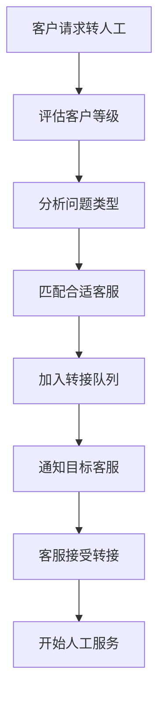

# 机器人转人工

机器人转人工是客服系统中的核心功能，当AI机器人无法有效处理客户问题时，系统会智能转接给合适的人工客服，确保客户问题得到及时、专业的解决。

:::info 相关文档

- [会话转接](transfer.md)：客服人员之间的转接功能
- [客服助手](assistant.md)：AI助手的基础功能

:::

## 功能概述

### 转接触发条件

#### 自动触发情况

1. **置信度不足**
   - AI回答置信度低于设定阈值
   - 连续多次未能理解客户意图
   - 检测到复杂的多轮对话需求

2. **特定意图识别**
   - 客户明确要求人工服务
   - 检测到投诉或不满情绪
   - 涉及敏感业务或重要决策

3. **业务规则触发**
   - VIP客户优先人工服务
   - 特定业务流程必须人工处理
   - 超出机器人服务时间范围

#### 手动触发方式

1. **客户主动请求**
   - 输入"转人工"、"人工客服"等关键词
   - 点击"转人工客服"按钮
   - 通过语音指令请求

2. **系统引导触发**
   - 机器人主动询问是否需要人工协助
   - 提供人工服务入口选项
   - 问题解决失败后的转接建议

### 转接流程

#### 智能排队系统

#### 转接优先级

1. **紧急级别**（立即处理）
   - VIP客户转接请求
   - 投诉或法律相关问题
   - 系统故障影响客户使用

2. **高优先级**（5分钟内处理）
   - 付费客户的技术支持
   - 订单或支付相关问题
   - 产品功能咨询

3. **普通优先级**（15分钟内处理）
   - 一般业务咨询
   - 产品介绍和推荐
   - 常规售后服务

4. **低优先级**（30分钟内处理）
   - 基础信息查询
   - 非紧急的一般咨询

## 客服匹配策略

### 智能分配算法

#### 技能匹配

系统根据以下因素智能匹配最合适的客服：

1. **专业技能标签**
   - 客服的专业领域设置
   - 问题类型与技能的匹配度
   - 技能熟练程度评级

2. **历史表现**
   - 类似问题的处理成功率
   - 客户满意度评分
   - 平均解决时间

3. **当前状态**
   - 在线状态和可用性
   - 当前工作负载
   - 最近活跃度

#### 负载均衡

系统通过以下权重分配策略实现智能分配：

- **技能匹配权重**：40% - 优先考虑客服的专业技能匹配度
- **历史表现权重**：30% - 参考客服的历史服务质量
- **负载均衡权重**：20% - 考虑当前工作负载分布
- **可用性权重**：10% - 确保客服当前可以接受服务

### 等待队列管理

#### 队列类型

1. **技能专业队列**
   - 技术支持队列
   - 销售咨询队列
   - 售后服务队列
   - 投诉处理队列

2. **客户等级队列**
   - VIP客户专享队列
   - 企业客户队列
   - 普通客户队列

#### 等待体验优化

1. **实时排队信息**

   系统提供详细的排队状态信息：
   - **当前排队位置**：告知客户在队列中的位置
   - **预计等待时间**：基于历史数据估算等待时长
   - **队列总长度**：显示当前排队的总人数
   - **平均等待时间**：提供历史平均等待时间参考

2. **等待期间服务**
   - 提供相关FAQ推荐
   - 播放企业介绍或产品视频
   - 收集客户基本信息和问题描述
   - 提供自助服务选项

## 转接体验设计

### 客户端体验

#### 转接提示

系统会向客户发送转接通知，包含以下信息：

- **转接类型**：明确告知是机器人转人工服务
- **提示消息**：友好的转接说明和安抚信息
- **预计等待时间**：基于当前队列情况的时间估算
- **排队位置**：当前在队列中的具体位置
- **备选方案**：提供FAQ、自助服务或回拨等选项

#### 状态展示

- **转接中**：显示连接动画和等待信息
- **排队中**：实时更新排队位置和预计时间
- **已连接**：明确提示已转入人工服务

### 客服端体验

#### 转接通知

客服收到转接请求时会看到完整的客户信息：

- **客户身份**：客户ID和基本信息
- **客户等级**：VIP、企业客户或普通客户
- **问题类型**：问题的分类和描述
- **紧急程度**：高、中、低优先级标识
- **对话摘要**：机器人与客户的对话总结
- **客户情绪**：积极、中性或消极的情绪分析
- **复杂程度**：预估的问题处理难度
- **相关标签**：问题的关键词和分类标签

#### 上下文传递

1. **机器人对话摘要**
   - 问题识别结果
   - 已尝试的解决方案
   - 客户反馈和情绪

2. **客户画像信息**
   - 基础信息和历史
   - 偏好和标签
   - 价值等级评估

## 系统配置

### 转接规则设置

#### 触发条件配置

系统支持灵活的转接规则配置：

- **置信度阈值**：设定AI回答的最低置信度要求
- **连续失败次数**：机器人连续无法理解的次数限制
- **情绪阈值**：客户负面情绪的触发临界值
- **VIP自动转接**：是否为VIP客户启用自动转接
- **服务时间**：定义机器人和人工服务的时间范围
- **触发关键词**：配置直接触发转接的关键词列表

#### 客服分配策略

1. **轮询分配**：按顺序分配给可用客服
2. **能力优先**：优先分配给最匹配的客服
3. **负载均衡**：考虑当前工作量的均衡分配
4. **混合策略**：结合多种因素的智能分配

### 排队策略配置

#### 等待时间管理

系统提供完善的等待时间控制机制：

- **最大等待时间**：普通客户的最长等待时限
- **VIP最大等待时间**：VIP客户的优先等待时限
- **升级规则**：超时后的自动处理策略
  - 通知主管介入
  - 增加客服资源
  - 提供替代服务方案

#### 溢出处理

当所有客服都忙碌时的处理策略：

1. **留言服务**：收集客户信息，稍后回电
2. **预约服务**：安排指定时间的专人服务
3. **升级处理**：通知主管或增加客服资源
4. **自助引导**：推荐自助解决方案

## 性能监控

### 关键指标

#### 转接效率指标

- **机器人解决率**：机器人成功解决问题的比例
- **转接率**：需要转人工的对话比例
- **平均等待时间**：客户等待人工服务的平均时长
- **转接成功率**：成功连接人工客服的比例

#### 服务质量指标

- **首次解决率**：转接后第一次就解决问题的比例
- **客户满意度**：转接后客户的满意度评分
- **响应时间**：客服接手后的首次响应时间
- **解决时长**：从转接到问题解决的总时长

### 数据分析

#### 转接原因分析

系统提供详细的转接数据分析：

- **原因分类**：按问题类型统计转接原因
- **数量统计**：各类原因的具体转接次数
- **比例分析**：不同原因占总转接量的百分比
- **趋势变化**：识别转接原因的增长、稳定或下降趋势
- **改进建议**：基于数据分析提供优化建议

#### 优化建议

1. **机器人能力提升**
   - 识别高频转接问题，完善知识库
   - 优化意图识别和回答准确性
   - 增强情感识别和处理能力

2. **流程优化**
   - 简化转接操作流程
   - 优化等待体验设计
   - 改进客服分配策略

3. **人员配置**
   - 根据转接高峰调整人员排班
   - 提升客服专业技能培训
   - 增加特定领域的专家客服

## 最佳实践

### 机器人优化

#### 减少不必要转接

**DO - 推荐做法：**

- 持续完善机器人知识库内容
- 优化意图识别的准确性
- 提供清晰的自助解决路径
- 在转接前尝试多种解决方案
- 设置合理的置信度阈值

**DON'T - 避免的问题：**

- 过于频繁地推荐转人工
- 没有尝试解决就直接转接
- 忽略客户的真实意图
- 设置过低的转接阈值

#### 转接时机把握

**合适的转接时机：**

- 机器人多次尝试后仍无法理解
- 客户明确表达不满或急躁情绪
- 涉及复杂的个性化需求
- 需要查看敏感信息或进行操作

### 客服接手技巧

#### 平滑过渡

**DO - 高效接手方法：**

- 快速浏览机器人对话摘要
- 主动确认客户问题理解正确
- 避免重复询问已确认的信息
- 展现专业能力建立信任
- 感谢客户的耐心等待

**DON'T - 接手时的错误：**

- 完全忽略机器人提供的上下文
- 让客户重新描述已说过的问题
- 对机器人服务表示负面态度
- 承诺无法实现的解决方案

## 技术实现

### API接口

#### 转接请求

**接口地址**：`POST /api/bot-transfer/request`

**请求参数**：

- 会话ID和客户ID
- 转接原因说明
- 优先级（高、中、低）
- 首选技能要求（可选）
- 上下文信息（对话记录、摘要、情绪分析）

#### 队列状态查询

**接口地址**：`GET /api/bot-transfer/queue-status/{sessionId}`

**返回信息**：

- 当前排队位置
- 预计等待时间
- 队列类型
- 可选的替代方案

### 事件通知

#### WebSocket消息类型

系统通过WebSocket实时推送转接状态变化：

- **转接发起**：转接请求已提交
- **队列位置更新**：排队位置发生变化
- **客服分配**：已分配到具体客服
- **转接完成**：成功连接人工服务

每个事件都包含会话ID、相关数据和时间戳信息。

## 常见问题

### Q: 转接到人工后，机器人还会参与对话吗？

**A**: 默认情况下，转接成功后机器人会退出对话，完全由人工客服接管。但系统支持配置"机器人辅助模式"，让AI在后台为客服提供建议和信息支持。

### Q: 如果没有合适的人工客服在线怎么办？

**A**: 系统会采用多种应对策略：

1. **智能排队**：将客户加入等待队列，提供预估时间
2. **留言服务**：收集客户联系方式，安排稍后回电
3. **预约服务**：提供预约时间段，确保专人服务
4. **升级通知**：自动通知主管或增加在线客服

### Q: VIP客户的转接有什么特殊处理？

**A**: VIP客户享受优先服务：

- 更短的最大等待时间（通常不超过1分钟）
- 专属的VIP客服队列
- 优先匹配最优秀的客服
- 如果等待超时，自动升级到主管处理

### Q: 如何防止客户恶意频繁要求转人工？

**A**: 系统具备多重防护机制：

1. **频率限制**：同一客户在短时间内的转接次数限制
2. **智能识别**：识别无理由的频繁转接请求
3. **引导机制**：优先引导客户使用自助服务
4. **人工判断**：客服可以评估是否为合理转接需求

### Q: 转接过程中的数据安全如何保障？

**A**: 严格的数据安全措施：

- 对话内容传输全程加密
- 客户敏感信息脱敏处理
- 操作日志完整记录和审计
- 符合数据保护法规要求
- 权限控制和访问审核
