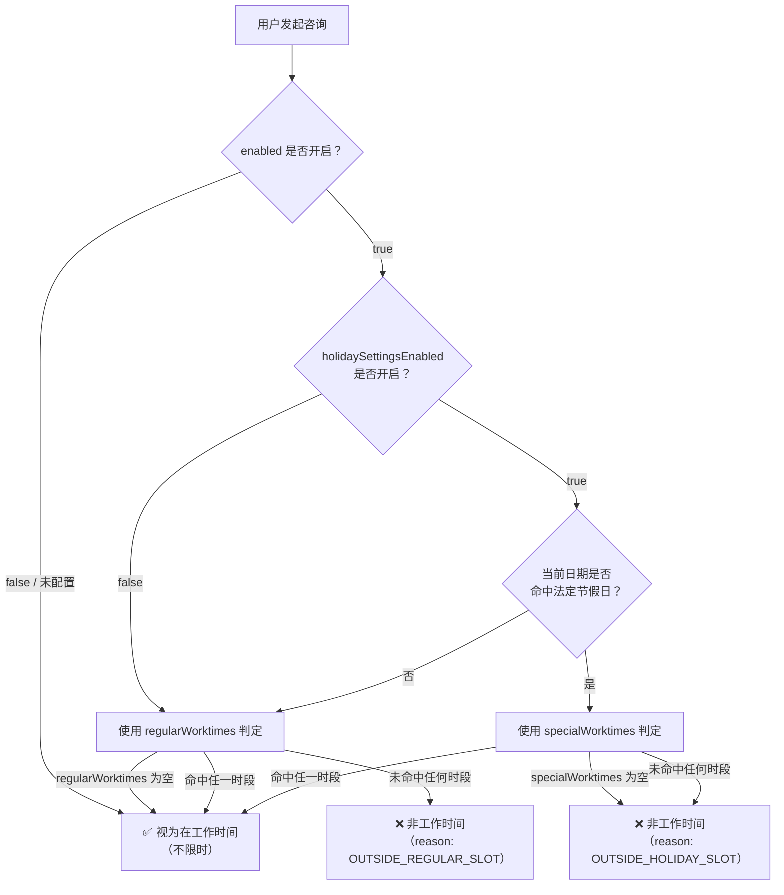
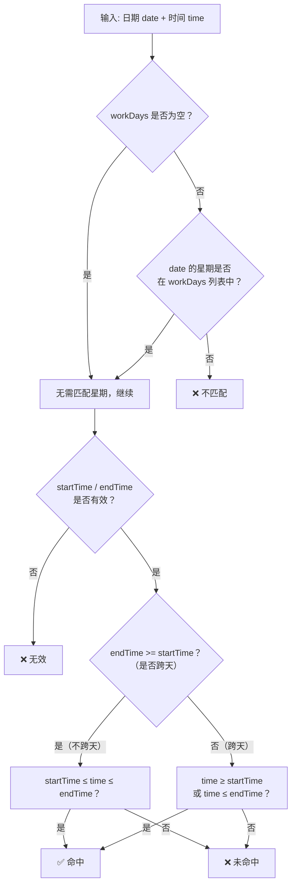

# 工作时间段设置

微语支持为客服（Agent）和工作组（Workgroup）配置工作时间段，系统根据配置判断当前是否在服务时间内，进而触发留言、机器人接管等策略。

## 数据模型

### WorktimeSlotValue — 时间段

单个工作时间窗口的值对象，以 JSON 形式持久化到 `WorktimeSettingEntity` 的 text 列中。

| 字段 | 类型 | 说明 | 示例 |
| --- | --- | --- | --- |
| `startTime` | `String` | 开始时间（HH:mm） | `"09:00"` |
| `endTime` | `String` | 结束时间（HH:mm） | `"18:00"` |
| `workDays` | `String` | 适用星期，逗号分隔（1=周一，7=周日） | `"1,2,3,4,5"` |

**跨天时段**：当 `endTime < startTime` 时自动识别为跨天（如 `"22:00"`–`"06:00"` 表示夜间时段）。

### WorktimeSettingEntity — 工作时间配置

| 字段 | 类型 | 默认值 | 说明 |
| --- | --- | --- | --- |
| `enabled` | `Boolean` | `true` | 总开关，关闭则始终视为工作时间 |
| `regularWorktimes` | `List<WorktimeSlotValue>` | `[{09:00-18:00, 周一至周五}]` | 常规工作日时间段 |
| `specialWorktimes` | `List<WorktimeSlotValue>` | `[]` | 节假日特殊时间段 |
| `holidaySettingsEnabled` | `Boolean` | `false` | 是否启用节假日判定 |
| `nonWorktimeTip` | `String` | `"当前非工作时间，请留言"` | 非工作时间提示语 |

## regularWorktimes vs specialWorktimes

两个字段分开存储，核心原因是**空值语义不同**：

| 字段 | 触发条件 | 为空含义 |
| --- | --- | --- |
| `regularWorktimes` | 非法定节假日 | **不限制**（全天 24h 视为工作时间） |
| `specialWorktimes` | 命中法定节假日 | **不开放**（节假日默认休息） |

### 判定流程



### 单时段判定逻辑（WorktimeSlotValue.isActive）



## 配置入口

工作时间设置在以下管理后台页面中配置：

- **客服配置**：`/service/agent/settings` → 选择模板 → **工作时间** Tab


- **工作组配置**：`/service/workgroup/settings` → 选择模板 → **工作时间** Tab


- 节假日设置


### UI 功能

| 功能 | 说明 |
| --- | --- |
| 启用工作时间限制 | 总开关，关闭后全天视为工作 |
| 启用节假日时间段 | 独立开关，开启后命中节假日使用 `specialWorktimes` |
| 常规时间段 | 时间段列表，为空 = 不限制 |
| 节假日时间段 | 仅在节假日开关开启时显示，为空 = 节假日不开放 |
| 开始/结束时间 | 24 小时制 TimePicker，默认 `09:00`–`18:00` |
| 工作日 | 多选下拉（1-7），默认周一至周五 |
| 非工作时间提示 | 自定义提示语，支持 agent/workgroup 不同占位符 |
| 管理节假日 | 跳转至 `/service/holiday` 管理节假日日历 |

## API

### WorktimeService — 统一判定入口

```java
// 判断当前是否在服务时间
boolean inService = worktimeService.isInServiceTime(settings);

// 判断指定时刻
boolean inService = worktimeService.isInServiceTime(settings, zonedDateTime);

// 获取带原因的完整评估结果
WorktimeEvaluation eval = worktimeService.evaluate(settings, zonedDateTime);
// eval.inServiceTime()   → boolean
// eval.reason()          → OUTSIDE_REGULAR_SLOT / OUTSIDE_HOLIDAY_SLOT
// eval.nonWorktimeTip()  → 提示语
```

### 评估结果

| 状态 | `inServiceTime` | `reason` | 说明 |
| --- | --- | --- | --- |
| 配置为 null | `true` | — | 未配置，等同不限时 |
| enabled=false | `true` | — | 关闭工作时间限制 |
| 常规时段命中 | `true` | — | 在 regularWorktimes 内 |
| 节假日时段命中 | `true` | — | 在 specialWorktimes 内 |
| 常规时段未命中 | `false` | `OUTSIDE_REGULAR_SLOT` | 非法定节假日但不在时段内 |
| 节假日时段未命中 | `false` | `OUTSIDE_HOLIDAY_SLOT` | 法定节假日但不在时段内 |

## 集成方式

Agent 和 Workgroup 的 `SettingsEntity` 通过 `@ManyToOne` 关联 `WorktimeSettingEntity`，支持发布/草稿双态：

```java
// AgentSettingsEntity
@ManyToOne(...)
private WorktimeSettingEntity worktimeSettings;      // 已发布
@ManyToOne(...)
private WorktimeSettingEntity draftWorktimeSettings;  // 编辑中
```

调用方只需注入 `WorktimeService` 并传入对应的 settings 即可获得统一判定结果，各渠道根据结果自行决定后续策略（转机器人、留言、排队等）。

## 节假日判定

节假日由 `HolidayService` 统一管理，当前默认：

- **国家/地区**：CN（中国）
- **范围**：`ORG_ONLY`（组织级）
- **时区**：`Asia/Shanghai`

节假日数据通过 `/service/holiday` 管理后台维护，支持导入中国法定节假日。

## 设计理由

- **空值语义不同**：`regularWorktimes` 为空 = 全天工作（宽松），`specialWorktimes` 为空 = 全天休息（严格）。若合并为一个字段，无法区分"管理后台未配置"和"配置为空列表"
- **编辑解耦**：修改常规排班（如调整午休时段）不影响节假日安排，反之亦然
- **独立开关**：`holidaySettingsEnabled` 控制是否启用节假日判定，未启用时始终使用常规时段，保持向后兼容
