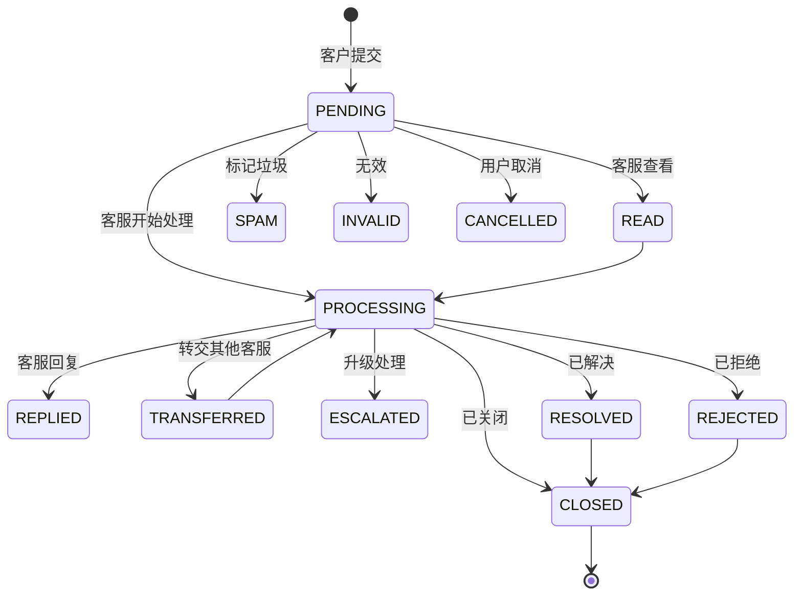

## 概述

**客户之声（VOC，Voice of Customer）** 模块是一套完整的反馈管理系统，用于收集、分类、处理和分析客户反馈，帮助企业了解真实客户需求，通过闭环的反馈流程持续改进产品和服务。

VOC 不是简单的"留言板"。它围绕可配置的**反馈模板（FeedbackSettings）** 构建，支持多种行业通用的调研类型——包括 CSAT（客户满意度）、NPS（净推荐值）、投诉、建议和通用问卷等——并根据不同类型自动适配收集组件、评分尺度和原因选项。

## 核心概念

| 概念 | 说明 |
| ------ | ----------- |
| **反馈（Feedback）** | 客户通过组件或管理后台提交的一条反馈记录，存储于 `bytedesk_voc_feedback` 表。 |
| **反馈设置/模板（FeedbackSettings）** | 可复用的配置，定义反馈类型、评分尺度、问卷文案和原因选项，存储于 `bytedesk_voc_feedback_settings` 表。 |
| **VOC 链接** | 可分享的 URL，打开后会直接加载指定模板的公开反馈组件，客户无需登录即可提交反馈。 |

## 反馈类型

每个反馈模板绑定一个 `FeedbackTypeEnum` 类型，决定默认评分尺度和组件布局：

| 类型 | 说明 | 常用评分尺度 |
| ---- | ----------- | ------------- |
| **CSAT** | 客户满意度调查——对一次具体服务或产品体验的回顾性评价。 | 1–5（星级） |
| **NPS** | 净推荐值调查——衡量客户推荐意愿，将客户划分为推荐者 / 中立者 / 贬损者。 | 0–10 |
| **FEEDBACK** | 意见反馈 / 通用反馈。 | 可配置 |
| **REPORT** | 举报。 | 可配置 |
| **COMPLAINT** | 投诉。 | 可配置 |
| **SURVEY** | 调查问卷。 | 可配置 |
| **PRAISE** | 表扬。 | 可配置 |
| **SUGGESTION** | 建议。 | 可配置 |

### CSAT 与 NPS 的区别

- **CSAT** 是*回顾性*评价，衡量客户对近期一次服务或产品体验的满意度，通常通过具体问题评分。常见划分：1–3 分为不满意，4–5 分为满意。
- **NPS** 是*前瞻性*预测，衡量客户向他人推荐公司/产品/服务的意愿，通过单项选择题（0–10 分）划分三类客户：
  - **推荐者（9–10 分）**：最可能推荐你产品的人，基本对产品满意，是忠实客户。
  - **中立者（7–8 分）**：处于摇摆立场，喜欢你的产品但不足以让他们冒着影响声誉的风险去推荐。
  - **贬损者（0–6 分）**：对你的产品低满意度或完全不满意，大多表现为不推荐，甚至鼓励他人不购买。

## 反馈生命周期

每条反馈都会经历 `FeedbackStatusEnum` 定义的状态流转：

## 主要功能

### 1. 多渠道反馈收集

支持从以下渠道收集反馈：

- **公开 VOC 组件**（`visitorVoc`）——客户通过 VOC 链接无需登录即可提交。
- **管理后台**——客服代客户创建反馈。
- **会话关联反馈**——将反馈绑定到 `threadUid`（会话）、`messageUid`（消息）或 `ticketUid`（工单），保留完整上下文。

### 2. 可配置的反馈模板

`FeedbackSettings` 模板控制反馈体验的每个环节：

- **类型**：CSAT / NPS / FEEDBACK / SURVEY / ...
- **评分尺度**：可配置的 `scoreMax`（如星级用 5 分，NPS 用 10 分）。
- **正面阈值**：`positiveScoreMin`（如 9）——达到或超过此分数视为"正面"。
- **最大可选原因数**：`maxReasons`（默认 3）。
- **文案**：标题、正面问题、负面问题、评论框占位提示。
- **原因选项**：正面原因和负面原因分开维护，根据评分条件展示。
- **启用开关**：随时启用或停用模板。

### 3. 类型感知的评分组件

访客端组件会根据反馈类型自动适配布局：

- **CSAT / 星级类型**：渲染星级评分。
- **NPS**：渲染 0–10 分刻度，并用推荐者 / 中立者 / 贬损者颜色区分。
- **SURVEY / FEEDBACK**：渲染以评论为主的简洁布局。

根据评分，组件会展示对应的正面或负面原因选项，随后是自由文本评论框。

### 4. 分类与关联

- **分类**：通过 `categoryUids` 为反馈打上分类标签，便于筛选和路由。
- **标签**：自由格式的 `tagList`，用于搜索。
- **优先级**：低 / 中 / 高。
- **关联**：将反馈关联到会话、具体消息或工单，获取完整上下文。

### 5. 处理与协作

- **回复**：客服可用文字、图片和附件回复。
- **转交**：移交给其他客服。
- **升级**：提升到更高层级处理。
- **已读 / 已回复 / 已解决时间戳**：每次状态变更都记录操作人和时间戳，形成完整审计轨迹。

### 6. 数据导出

管理后台反馈列表支持三种 Excel 导出模式：

- **当前页**
- **全部**（每批最多 1000 条）
- **分段导出**——对大数据集自动拆分为 1000 条一批。

导出表头和文件名均已国际化。

### 7. VOC 链接分享

每个模板可生成可分享的 VOC 链接，可通过以下渠道分发：

- 邮件签名
- 微信公众号菜单
- 应用内弹窗
- 服务结束后的满意度提示

客户打开链接即可直接提交反馈——无需注册账号。

## 管理后台

### 反馈列表

位于 **仪表盘 → VOC → 意见反馈**，提供：

- 按标题和内容全文搜索。
- 按分类和组织筛选。
- 按创建时间 / 更新时间排序。
- 行操作：**查看**、**编辑**、**删除**。
- 批量导出。

### 反馈设置（模板）

位于 **仪表盘 → VOC → 评价设置**，采用分栏界面：

- **左侧栏**：模板列表，支持搜索和新建。
- **右侧栏**：分页签编辑器，包含四个页签：
  - **基础**：名称、类型、启用状态、评分尺度、正面阈值、最大原因数。
  - **文案**：标题、正面 / 负面问题、评论框占位提示。
  - **原因**：正面原因和负面原因选项列表。
  - **链接**：生成并预览公开 VOC 链接。

编辑器会跟踪未保存的修改，在切换模板、切换启用状态或重新加载前弹出确认提示。

## 访客反馈组件

公开组件（`visitorVoc`）是面向终端客户的独立页面：

1. 客户打开 VOC 链接（如 `https://your-domain/voc?org=组织UID&sid=模板UID`）。
2. 组件加载绑定的模板配置。
3. 评分界面根据模板类型自动适配（CSAT 星级 / NPS 刻度 / 问卷）。
4. 根据评分展示对应的正面或负面原因选项。
5. 客户填写可选评论后提交。
6. 反馈入库并出现在管理后台反馈列表中等待处理。

## 使用场景

- **服务后满意度**：会话或工单关闭后自动弹出 CSAT 评价。
- **NPS 基准追踪**：定期开展 NPS 调研，追踪忠诚度趋势。
- **投诉管理**：收集正式投诉并路由到对应团队。
- **产品改进**：收集用户的功能建议和问题反馈。
- **服务质量监控**：实时捕捉服务质量问题。
- **闭环跟进**：确保每条反馈都得到回复和解决。

## 访问方式

- **管理后台**：登录管理后台，导航到 **VOC** 菜单。
- **访客组件**：打开从反馈模板生成的 VOC 链接。
- **REST API**：反馈和反馈设置接口位于 `/api/v1/feedback` 和 `/api/v1/feedback/settings`（详见 `/swagger-ui.html` 的 Swagger 文档）。
