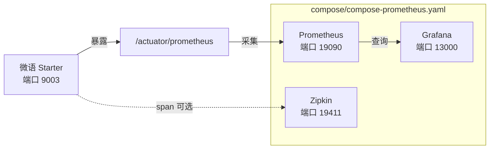

# 微语 AI 可观测性

微语集成 [Spring AI 2.0 Observability](https://docs.spring.io/spring-ai/reference/observability/index.html) 与 [Spring Boot Actuator](https://docs.spring.io/spring-boot/reference/actuator/metrics.html)，为 AI 全链路（ChatClient、ChatModel、EmbeddingModel、VectorStore、Tool Calling）提供指标采集与分布式追踪。

[Spring Boot Metrics](https://docs.spring.io/spring-boot/reference/actuator/metrics.html) · [Spring Boot Tracing](https://docs.spring.io/spring-boot/reference/actuator/tracing.html) · [OpenTelemetry Gen AI 语义约定](https://opentelemetry.io/docs/specs/semconv/gen-ai/)

## 概览

| 能力 | 组件 | 说明 |
| --- | --- | --- |
| 指标导出 | Spring Boot Actuator + Micrometer | `/actuator/prometheus` 暴露 `gen_ai_*`、`db_vector_*`、`bytedesk.ai.*` 时间序列 |
| 指标采集 | Prometheus | 每 15s 拉取一次；配置位于 `deploy/docker/prometheus.yml` |
| 指标可视化 | Grafana | 通过 `deploy/docker/grafana/provisioning/` 预置 AI 仪表板 |
| 分布式追踪 | Zipkin（可选） | 捕获 ChatClient / ChatModel / Tool 调用 span；默认禁用 |
| 健康检查 | Spring Boot Health | `/actuator/health` 通过 `AiHealthIndicator` 上报 AI 组件状态 |

## 架构



## 已接入观测的组件

Spring AI 2.0 内置了六大核心组件的观测，微语已将全部接入统一 `ObservationRegistry`：

| 组件 | Observation 名称 | 关键指标 | 状态 |
| --- | --- | --- | --- |
| ChatClient | `gen_ai.chat.client.operation`（微语自定义约定） | `gen_ai_chat_client_operation_seconds` | ✅ 全部 15+ provider ChatClient 已接入 |
| ChatModel | `gen_ai.client.operation` | `gen_ai_client_operation_seconds` + `gen_ai_client_token_usage_total` | ✅ 框架内置 + Moonshot + DeepSeek + ZhipuAI + DashScope |
| EmbeddingModel | `gen_ai.client.operation` | `gen_ai_client_operation_seconds` | ✅ DashScope 自定义模型已接入 |
| VectorStore | `db.vector.client.operation` | `db_vector_client_operation_seconds` | ✅ 自动观测 |
| Tool Calling | `spring.ai.tool` | （内嵌于 ChatModel span） | ✅ 自动观测 |
| ChatClient Advisor | `spring.ai.advisor` | （内嵌于 ChatClient span） | ✅ 自动观测 |

## 快速开始

### 1. 启动观测栈

`start.sh` / `stop.sh` 的最后一个参数可选 `obs`（或 `observability` / `true` / `yes`），用于一键启停 `compose/compose-prometheus.yaml`：

```bash
cd deploy/docker

# 方式 A（推荐）：在启动中间件/应用栈时附带观测栈
./start mysql artemis middleware obs
./start mysql artemis all obs   # 线上全量 + 观测栈
./stop mysql artemis stop middleware obs
./stop mysql artemis down middleware obs

# 方式 B：仅观测栈（需先确保 bytedesk-network 存在）
docker compose --env-file .env -f compose/compose-prometheus.yaml up -d
```

### 2. 验证指标已流通

```bash
# 应用指标端点
curl http://localhost:9003/actuator/prometheus | grep gen_ai
# curl 'http://localhost:9003/spring/ai/api/v1/rag/observed?message=你好'
# curl -s http://localhost:9003/actuator/prometheus | grep -E 'gen_ai|bytedesk_ai'

# 预期输出包含：
# gen_ai_chat_client_operation_seconds_count{...}
# gen_ai_client_operation_seconds_count{...}
# gen_ai_client_token_usage_total{...}
# db_vector_client_operation_seconds_count{...}
```

### 3. 打开 Grafana

访问 `http://localhost:13000`，使用 `admin` / `admin` 登录（可通过 `.env` 中 `GRAFANA_ADMIN_USER` / `GRAFANA_ADMIN_PASSWORD` 覆盖）。**Bytedesk AI Observability** 仪表板会自动出现在 *Bytedesk AI* 文件夹下。

## 指标参考

### ChatClient 指标

| 指标 | 类型 | 说明 |
| --- | --- | --- |
| `gen_ai_chat_client_operation_seconds_count` | Counter | 已完成的 ChatClient 操作数 |
| `gen_ai_chat_client_operation_seconds_sum` | Timer（总和） | ChatClient 操作总耗时 |
| `gen_ai_chat_client_operation_seconds_max` | Gauge | 最大观测耗时 |
| `gen_ai_chat_client_operation_seconds_bucket` | Histogram | 分布桶（支持 P95/P99） |
| `gen_ai_chat_client_operation_active_count` | Gauge | 进行中的 ChatClient 调用数 |

### ChatModel 指标（按 provider 执行）

| 指标 | 类型 | 标签 | 说明 |
| --- | --- | --- | --- |
| `gen_ai_client_operation_seconds` | Timer | `gen_ai_system`、`gen_ai_request_model` | 模型 provider 执行耗时 |
| `gen_ai_client_token_usage_total` | Counter | `gen_ai_token_type`（input/output/total） | Token 用量 |

### VectorStore 指标

| 指标 | 类型 | 标签 | 说明 |
| --- | --- | --- | --- |
| `db_vector_client_operation_seconds` | Timer | `db_operation_name`（add/delete/query） | 向量存储操作延迟 |

### 微语自定义业务指标

| 指标 | 类型 | 说明 |
| --- | --- | --- |
| `bytedesk_ai_requests_total` | Counter | AI 请求总数（业务级） |
| `bytedesk_ai_errors_total` | Counter | AI 错误数 |
| `bytedesk_ai_response_time_seconds` | Timer | AI 响应时间 |

> **注意**：`bytedesk.ai.*` 指标通过 `modules/core` 中的 `BytedeskMetrics` 注册；框架级 `gen_ai_*` / `db_vector_*` 指标来自 Spring AI。Grafana 仪表板会清晰区分这两层。

## PromQL 示例

```promql
# AI QPS
sum(rate(gen_ai_chat_client_operation_seconds_count[1m]))

# P95 延迟（需启用 histogram）
histogram_quantile(0.95, sum by (le) (rate(gen_ai_chat_client_operation_seconds_bucket[5m])))

# 平均延迟（未启用 histogram 时的回退方案）
rate(gen_ai_chat_client_operation_seconds_sum[5m]) / rate(gen_ai_chat_client_operation_seconds_count[5m])

# 按类型的 Token 用量速率
sum by (gen_ai_token_type) (rate(gen_ai_client_token_usage_total[5m]))

# Provider 分布
sum by (gen_ai_system) (rate(gen_ai_client_operation_seconds_count[5m]))

# 错误率
rate(bytedesk_ai_errors_total[5m]) / clamp_min(rate(bytedesk_ai_requests_total[5m]), 1)

# VectorStore 查询延迟
rate(db_vector_client_operation_seconds_sum[1m])
```

## 配置

### Spring AI 观测属性

以下属性控制是否将敏感内容（prompt、completion、tool 参数）导出到 trace。**全部默认 `false`**，仅在排查问题时开启。

| 属性 | 默认值 | 说明 |
| --- | --- | --- |
| `spring.ai.chat.client.observations.log-prompt` | `false` | 记录 ChatClient prompt 内容 |
| `spring.ai.chat.observations.log-prompt` | `false` | 记录 ChatModel prompt 内容 |
| `spring.ai.chat.observations.log-completion` | `false` | 记录 ChatModel completion 内容 |
| `spring.ai.chat.observations.include-error-logging` | `false` | 在 observation 中包含错误详情 |
| `spring.ai.tools.observations.include-content` | `false` | 导出 tool 调用的 arguments 和 result |
| `spring.ai.vectorstore.observations.log-query-response` | `false` | 记录向量搜索的 query 和 response |

### Histogram 桶

要在 Grafana 中使用 `histogram_quantile()`，AI 相关的 Timer 必须发布 histogram 桶。`local` profile 默认已配置：

```properties
management.metrics.distribution.percentiles-histogram.gen_ai.chat.client.operation=true
management.metrics.distribution.percentiles-histogram.gen_ai.client.operation=true
management.metrics.distribution.percentiles-histogram.db.vector.client.operation=true
management.metrics.distribution.slo.gen_ai.chat.client.operation=50ms,200ms,1s,5s,30s
```

若未启用桶，请使用平均延迟 PromQL 回退方案代替 `histogram_quantile()`。

## 分布式追踪（Zipkin）

追踪**默认禁用**以避免噪音。开启方式：

```bash
# 1. 通过 compose/compose-prometheus.yaml 启动 Zipkin
docker compose --env-file .env -f compose/compose-prometheus.yaml -f compose/compose-grafana.yaml -f compose/compose-zipkin.yaml up -d bytedesk-zipkin

# 2. 启动应用时通过环境变量开启追踪
export MANAGEMENT_TRACING_ENABLED=true
export MANAGEMENT_ZIPKIN_TRACING_ENABLED=true
export MANAGEMENT_TRACING_SAMPLING_PROBABILITY=1.0
```

访问 `http://localhost:19411` 查看 Zipkin UI 中的分布式 trace。

## 告警建议

| 告警 | PromQL | 阈值 |
| --- | --- | --- |
| AI 错误率高 | `rate(bytedesk_ai_errors_total[5m]) / clamp_min(rate(bytedesk_ai_requests_total[5m]), 1)` | > 5% 持续 5 分钟 |
| AI 延迟高 | `histogram_quantile(0.95, ...)` | P95 > 10s 持续 5 分钟 |
| Token 用量突增 | `rate(gen_ai_client_token_usage_total[1h])` | > 基线 2 倍 |
| VectorStore 慢查询 | `rate(db_vector_client_operation_seconds_sum[1m])` | > 2s 持续 5 分钟 |

## 故障排查

### Prometheus 中无指标

1. 验证 `/actuator/prometheus` 返回数据：`curl http://localhost:9003/actuator/prometheus`
2. 确认 profile 中 `management.endpoints.web.exposure.include=*`
3. 检查 `ObservationConfig` 是否未创建独立 `ObservationRegistry`（阶段 7A 已统一）
4. 确保 Prometheus 能通过 Docker 网络访问应用

### Grafana 仪表板显示"No data"

1. 确认 Prometheus 数据源已配置（通过 `grafana/provisioning/datasources/` 自动预置）
2. 检查时间范围是否覆盖了有 AI 调用的时段
3. 若使用 P95 面板，确认 histogram 桶存在：`gen_ai_chat_client_operation_seconds_bucket` 应出现在 Prometheus 中

### Zipkin 无 trace

1. 确认 `MANAGEMENT_TRACING_ENABLED=true` 已设置
2. 确认采样概率 > 0（默认 0.0 = 不采样）
3. 确保应用能通过 Docker 网络访问 `bytedesk-zipkin:9411`

## 参考资料

- [Spring AI Observability](https://docs.spring.io/spring-ai/reference/observability/index.html)
- [Spring Boot Actuator Metrics](https://docs.spring.io/spring-boot/reference/actuator/metrics.html)
- [Spring Boot Actuator Tracing](https://docs.spring.io/spring-boot/reference/actuator/tracing.html)
- [OpenTelemetry Gen AI 语义约定](https://opentelemetry.io/docs/specs/semconv/gen-ai/)
- [Micrometer Observation API](https://docs.micrometer.io/micrometer/reference/observation.html)
