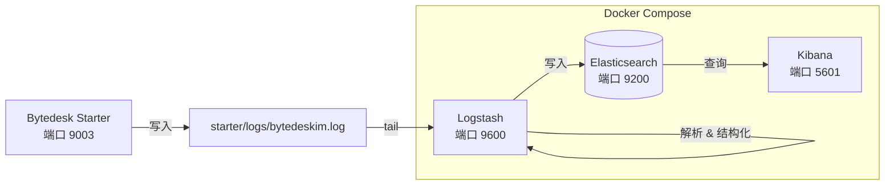

# 微语日志监控

微语（Bytedesk）基于 **ELK Stack**（Elasticsearch + Logstash + Kibana）构建了统一的日志采集、解析、存储与可视化平台，面向开发与运维人员提供集中式日志检索、链路追踪和运维排障能力。

[Logstash](https://www.elastic.co/guide/en/logstash/8.18/docker.html) · [Kibana](https://www.elastic.co/guide/en/kibana/8.18/docker.html) · [Elasticsearch](https://www.elastic.co/guide/en/elasticsearch/8.18/docker.html)

## 概述

日志监控体系覆盖以下能力：

| 能力 | 组件 | 说明 |
| --- | --- | --- |
| 日志输出 | Spring Boot (Logback) | 应用按 `[RID:xxx TRACEID:xxx]` 格式写入 `starter/logs/bytedeskim.log` |
| 日志采集 | Logstash | File input 实时 tail 日志文件，grok 解析结构化字段，去除 ANSI 颜色码 |
| 日志存储 | Elasticsearch | 按天建立索引 `bytedesk-logs-YYYY.MM.dd`，支持 IK 中文分词 |
| 日志可视化 | Kibana | Discover 检索、Dashboard 面板、按 level / logger / service 过滤 |

## 架构



**数据流向**：

1. 应用通过 Logback 将日志写入 `starter/logs/bytedeskim.log`，格式包含 `[RID:xxx TRACEID:xxx]` 链路追踪标记
2. Logstash 通过 `file input` 实时 tail 日志文件，使用 `multiline` codec 合并多行异常堆栈
3. `grok` 过滤器将日志解析为结构化字段（level、logger、thread、requestId、traceId 等）
4. 解析后的结构化日志写入 Elasticsearch 按天索引
5. 运维/开发人员在 Kibana 中进行检索、过滤、可视化分析

## 日志格式

### 输出格式

应用日志遵循统一的 Pattern（配置于 `starter/src/main/resources/properties/noai/40-oauth-ldap-logging.properties`）：

```bash
[RID:%X{requestId} TRACEID:%X{traceId}]-yyyy-MM-dd HH:mm:ss.SSS-LEVEL PID --- [thread] logger : message
```

示例日志行：

```bash
[RID:req_abc123 TRACEID:trace_xyz789]-2026-07-25 10:30:45.123- INFO 12345 --- [nio-9003-exec-1] c.b.s.service.ThreadService : thread created successfully
```

### 关键字段

| 字段 | MDC Key | 说明 |
| --- | --- | --- |
| `requestId` | `%X{requestId}` | 请求级追踪 ID，一次 HTTP 请求内保持一致 |
| `traceId` | `%X{traceId}` | 分布式链路追踪 ID，跨服务传递 |
| `level` | 日志级别 | TRACE / DEBUG / INFO / WARN / ERROR |
| `logger` | Logger 名 | 输出日志的类名（截取 40 字符） |
| `thread` | 线程名 | 如 `nio-9003-exec-1`、`scheduling-1` |

## Logstash Pipeline 详解

Pipeline 配置文件位于 `deploy/docker/logstash/pipeline/logstash.conf`，分为三个阶段：

### Input — 日志采集

```ruby
input {
  file {
    path => ["/var/log/bytedesk/bytedeskim.log*", "/var/log/bytedesk-source/bytedeskim.log*"]
    start_position => "beginning"
    mode => "tail"
    codec => multiline {
      pattern => "^-*\[RID:"
      negate => true
      what => "previous"
    }
  }
}
```

- **路径**：通过 volume 挂载，Logstash 可同时读取 `/var/log/bytedesk/`（Docker 内共享卷）和 `/var/log/bytedesk-source/`（宿主机 `starter/logs/` 映射）
- **multiline**：不以 `[RID:` 开头的行（如异常堆栈）合并到前一条日志，确保完整异常不被打散
- **sincedb**：记录读取位置，容器重启后不从文件头重新读取

### Filter — 日志解析

```ruby
filter {
  # 去除 ANSI 颜色码
  mutate { gsub => ["message", "\u001B\[[0-9;]*[A-Za-z]", ""] }

  # Grok 正则提取结构化字段
  grok {
    match => {
      "message" => [
        "-\[RID:%{DATA:requestId} TRACEID:%{DATA:traceId}\]-%{TIMESTAMP_ISO8601:log_timestamp}-%{SPACE}%{LOGLEVEL:level} ...",
        "\[RID:%{DATA:requestId} TRACEID:%{DATA:traceId}\] %{TIMESTAMP_ISO8601:log_timestamp} ..."
      ]
    }
    tag_on_failure => ["_bytedesk_parse_failure"]
  }

  # 时间戳覆写为日志中的时间（而非采集时间）
  date { match => ["log_timestamp", "yyyy-MM-dd HH:mm:ss.SSS"] }

  # 注入服务元数据
  mutate {
    add_field => {
      "service.name" => "bytedesk"
      "event.dataset" => "bytedesk.application"
    }
  }

  # 映射到 ECS 标准字段
  mutate {
    add_field => { "[log][level]" => "%{level}" }
    add_field => { "[log][logger]" => "%{logger}" }
    add_field => { "[process][thread][name]" => "%{thread}" }
    add_field => { "[process][pid]" => "%{pid}" }
  }

  # 清理中间字段
  mutate { remove_field => ["parsed_message", "log_timestamp", "host", "path", "level", "logger", "thread", "pid"] }
}
```

**解析要点**：

- `gsub` 先去除 Logback 彩色输出中的 ANSI 转义序列，避免污染 `message` 字段
- `grok` 提供两种匹配模式兼容不同版本日志格式（带/不带前缀 `-`）
- 解析失败的行会打上 `_bytedesk_parse_failure` 标签，方便排查
- ECS（Elastic Common Schema）字段映射使 Kibana 可以开箱即用地识别日志级别、线程、进程等标准维度

### Output — 写入 Elasticsearch

```ruby
output {
  elasticsearch {
    hosts => ["${ELASTICSEARCH_HOSTS}"]
    user => "${ELASTICSEARCH_USERNAME}"
    password => "${ELASTICSEARCH_PASSWORD}"
    index => "bytedesk-logs-%{+YYYY.MM.dd}"
    ilm_enabled => false
  }
}
```

- **按天索引**：`bytedesk-logs-2026.07.25`，便于按日期清理和管理
- **认证**：使用 Elasticsearch 内置 `elastic` 用户 + `ELASTIC_PASSWORD` 环境变量

## 快速开始

### 前置条件

- Docker 及 Docker Compose
- 项目已克隆到本地

### 1. 配置环境变量

确保 `.env` 文件中设置了 Elasticsearch 和 Kibana 相关变量：

```bash
# Elasticsearch
ELASTIC_PASSWORD=bytedesk123

# Kibana Service Account Token（通过 elasticsearch-service-tokens 生成）
KIBANA_SERVICE_ACCOUNT_TOKEN=your_token_here
```

### 2. 启动日志服务

```bash
cd deploy/docker

# 只启动 ELK 相关服务
docker compose -f compose-base.yaml up -d bytedesk-elasticsearch bytedesk-logstash bytedesk-kibana

# 查看服务状态
docker compose -f compose-base.yaml ps
```

### 3. 验证服务

```bash
# Elasticsearch 健康检查
curl -u elastic:bytedesk123 http://localhost:19200/_cluster/health

# Logstash 状态（API 端口 9600）
curl http://localhost:19600/_node/stats

# Kibana 界面
open http://localhost:15601
```

### 4. 打开 Kibana 并登录

浏览器访问 `http://localhost:15601`，使用以下凭据登录：

| 参数 | 值 | 说明 |
| --- | --- | --- |
| 登录地址 | `http://localhost:15601` | Kibana Web 管理界面 |
| 用户名 | `elastic` | Elasticsearch 内置超级用户 |
| 密码 | `${ELASTIC_PASSWORD}` | 与 `.env` 中 `ELASTIC_PASSWORD` 一致（默认 `bytedesk123`） |

> **提示**：首次启动 Elasticsearch 后，若 Kibana 提示需要 enrollment token，可使用以下命令获取：
>
> ```bash
> docker exec -it elasticsearch-bytedesk bin/elasticsearch-create-enrollment-token -s kibana
> ```
>
> 或者直接使用 `elastic` 用户名 + 密码方式登录（Skip enrollment → Use login）。

登录后，按以下步骤创建日志数据视图：

1. 点击左上角菜单 → **Stack Management** → **Data Views**
2. 点击 **Create data view**
3. 索引模式填写 `bytedesk-logs-*`，时间字段选择 `@timestamp`
4. 点击 **Save data view to Kibana**

### 5. 检索日志

1. 点击左上角菜单 → **Discover**
2. 顶部下拉选择 `bytedesk-logs-*` 数据视图
3. 在搜索栏使用 KQL 语法查询（参考下方常用查询）
4. 左侧字段列表可按 `log.level`、`log.logger`、`requestId` 等维度快速过滤

## Kibana 常用操作

### 日志检索

| 场景 | KQL 查询 | 说明 |
| --- | --- | --- |
| 按日志级别过滤 | `log.level: "ERROR"` | 查看所有错误日志 |
| 按请求追踪 | `requestId: "req_abc123"` | 追踪某个请求的完整调用链 |
| 按链路追踪 | `traceId: "trace_xyz789"` | 追踪分布式调用链路 |
| 按类名过滤 | `log.logger: "*ThreadService*"` | 查看特定类的日志 |
| 按线程过滤 | `process.thread.name: "*scheduling*"` | 查看定时任务日志 |
| 模糊搜索 | `message: "OutOfMemoryError"` 或 `message: "OOM"` | 搜索包含特定关键词的日志 |
| 组合条件 | `log.level: "ERROR" and log.logger: "*call*"` | 组合过滤 |
| 解析失败 | `tags: "_bytedesk_parse_failure"` | 排查未被正确解析的日志行 |

### 仪表盘

可以在 Kibana **Dashboard** 中创建日志监控面板，推荐以下可视化：

- **日志量趋势**：按时间聚合 count，查看日志吞吐
- **ERROR 占比**：饼图展示各级别日志比例
- **Top Logger**：按 logger 聚合，发现高频日志来源
- **ERROR 日志表格**：实时展示最近 ERROR 日志详情

## 端口映射

| 服务 | 容器内端口 | 宿主机端口 | 说明 |
| --- | --- | --- | --- |
| Elasticsearch | 9200 | 19200 | REST API |
| Elasticsearch | 9300 | 19300 | 节点间通信 |
| Logstash | 9600 | 19600 | 监控 API |
| Kibana | 5601 | 15601 | Web 管理界面 |

## 常见问题

### 1. Kibana 无法连接 Elasticsearch

检查 `KIBANA_SERVICE_ACCOUNT_TOKEN` 是否正确生成：

```bash
# 在 Elasticsearch 容器内生成 token
docker exec -it elasticsearch-bytedesk bin/elasticsearch-service-tokens create elastic/kibana bytedesk-kibana
```

### 2. 日志未被采集

- 确认 Logstash 容器能读取到日志文件：

  ```bash
  docker exec -it logstash-bytedesk ls -la /var/log/bytedesk-source/
  ```

- 查看 Logstash 自身日志：

  ```bash
  docker logs logstash-bytedesk --tail 100
  ```

### 3. 日志解析失败（_bytedesk_parse_failure）

- 在 Kibana Discover 中过滤 `tags: "_bytedesk_parse_failure"`
- 检查 `message` 字段的原始格式是否与 grok 模式匹配
- 常见原因：日志格式变更、ANSI 码未被完全清除、堆栈信息被异常合并

### 4. Elasticsearch 磁盘占用过高

- 按天索引可以方便地按日期清理：

  ```bash
  # 删除 30 天前的索引
  curl -u elastic:bytedesk123 -X DELETE "http://localhost:19200/bytedesk-logs-$(date -v-30d +%Y.%m.%d)"
  ```

- 生产环境建议配置 ILM（Index Lifecycle Management）自动管理索引生命周期

### 5. 多行异常堆栈被截断

Logstash 的 `multiline` codec 将不以 `[RID:` 开头的行合并到前一条。如果某些异常堆栈仍被截断，检查：

- `auto_flush_interval`（默认 2 秒）是否足够覆盖完整异常输出
- 异常堆栈中是否有以 `[RID:` 开头的行导致提前断开

## 相关资源

- [Elasticsearch 官方文档](https://www.elastic.co/guide/en/elasticsearch/8.18/index.html)
- [Logstash 官方文档](https://www.elastic.co/guide/en/logstash/8.18/index.html)
- [Kibana 官方文档](https://www.elastic.co/guide/en/kibana/8.18/index.html)
- [微语系统监控](./bytedesk-monitor.md)
- [线上 Compose 镜像配置 - GitHub](https://github.com/Bytedesk/bytedesk-docker-compose/blob/main/docker/compose-base.yaml)
- [线上 Compose 镜像配置 - Gitee](https://gitee.com/270580156/bytedesk-docker-compose/blob/master/docker/compose-base.yaml)
