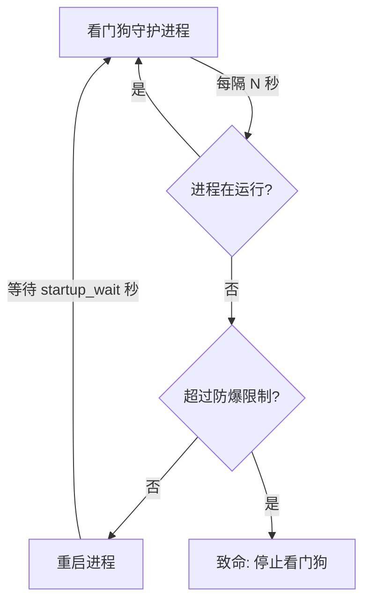

# 微语进程守护（看门狗）

微语为 **JAR 包部署**和 **Docker Compose 部署**两种模式分别提供了看门狗脚本。这些脚本持续监控微语进程，在进程异常退出时自动重启，最大限度减少生产环境的停机时间。

## 概览

| 部署模式 | 看门狗脚本 | 监控对象 |
| --- | --- | --- |
| JAR 包（独立部署） | `scripts/watchdog.sh` | `secrets/bytedesk-starter.jar` Java 进程 |
| Docker Compose | `deploy/docker/watchdog.sh` | `bytedesk` Docker 容器 |

两种脚本遵循相同的设计原则：

- **健康检查**：按可配置的时间间隔检测进程状态
- **自动重启**：检测到进程/容器宕机后自动拉起
- **防爆保护**：在时间窗口内频繁崩溃时停止自动重启，防止无限重启循环
- **结构化日志**：记录到看门狗日志文件，便于审计
- **简洁的生命周期命令**：`start`、`stop`、`status`、`restart`

## 架构



## JAR 部署看门狗

### 脚本位置

```text
scripts/watchdog.sh
```

### 快速开始

```bash
cd scripts

# 启动 JAR 服务；JAR 拉起后会自动启动看门狗
./start.sh

# 重启 JAR 服务；同时确保看门狗自动处于运行状态
./restart.sh

# 停止 JAR 服务；停机流程中会自动停止看门狗
./stop.sh

# 启动看门狗（如果 JAR 未运行会先启动 JAR）
./watchdog.sh start

# 查看状态
./watchdog.sh status

# 停止看门狗（不会停止 JAR 进程）
./watchdog.sh stop

# 重启看门狗
./watchdog.sh restart
```

JAR 生命周期脚本（`start.sh` / `restart.sh` / `stop.sh`）执行完成即返回，完全与日志查看解耦。使用 `logs.sh` 单独查看日志：

```bash
cd scripts
./logs.sh app       # 应用日志
./logs.sh watchdog  # 看门狗日志
./logs.sh all       # 同时查看（macOS: 两个 Terminal 窗口；Linux: tmux）
```

实际 JAR 文件仍位于 `secrets/bytedesk-starter.jar`，而 `scripts/` 已成为 JAR 部署与看门狗管理的唯一命令入口。

### 配置参数

通过环境变量覆盖默认值：

| 变量 | 默认值 | 说明 |
| --- | --- | --- |
| `WATCHDOG_CHECK_INTERVAL` | `10` | 健康检查间隔（秒） |
| `WATCHDOG_STARTUP_WAIT` | `60` | 重启后等待时间（秒），之后再开始检查 |
| `WATCHDOG_MAX_RESTARTS` | `5` | 防爆窗口内最大重启次数 |
| `WATCHDOG_BURST_WINDOW` | `300` | 防爆窗口时长（秒，默认 5 分钟） |
| `WATCHDOG_LOG_FILE` | `./logs/watchdog.log` | 看门狗日志文件路径 |

自定义配置示例：

```bash
WATCHDOG_CHECK_INTERVAL=15 \
WATCHDOG_STARTUP_WAIT=120 \
WATCHDOG_MAX_RESTARTS=3 \
./watchdog.sh start
```

### 集成 systemd（Linux）

在生产环境 Linux 服务器上，推荐将看门狗作为 systemd 服务管理：

```ini
# /etc/systemd/system/bytedesk-watchdog.service
[Unit]
Description=微语 JAR 进程看门狗
After=network.target

[Service]
Type=forking
User=bytedesk
WorkingDirectory=/opt/bytedesk/scripts
ExecStart=/opt/bytedesk/scripts/watchdog.sh start
ExecStop=/opt/bytedesk/scripts/watchdog.sh stop
ExecReload=/opt/bytedesk/scripts/watchdog.sh restart
Restart=on-failure
RestartSec=10
Environment="WATCHDOG_CHECK_INTERVAL=10"
Environment="WATCHDOG_MAX_RESTARTS=5"

[Install]
WantedBy=multi-user.target
```

启用并启动：

```bash
sudo systemctl daemon-reload
sudo systemctl enable bytedesk-watchdog
sudo systemctl start bytedesk-watchdog
sudo systemctl status bytedesk-watchdog
```

### 集成 launchd（macOS）

在 macOS 上，创建 launchd plist：

```xml
<!-- ~/Library/LaunchAgents/com.bytedesk.watchdog.plist -->
<?xml version="1.0" encoding="UTF-8"?>
<!DOCTYPE plist PUBLIC "-//Apple//DTD PLIST 1.0//EN"
  "http://www.apple.com/DTDs/PropertyList-1.0.dtd">
<plist version="1.0">
<dict>
    <key>Label</key>
    <string>com.bytedesk.watchdog</string>
    <key>ProgramArguments</key>
    <array>
        <string>/bin/bash</string>
      <string>/path/to/scripts/watchdog.sh</string>
        <string>start</string>
    </array>
    <key>WorkingDirectory</key>
    <string>/path/to/scripts</string>
    <key>RunAtLoad</key>
    <true/>
    <key>KeepAlive</key>
    <true/>
    <key>StandardOutPath</key>
    <string>/path/to/scripts/logs/watchdog-launchd.log</string>
    <key>StandardErrorPath</key>
    <string>/path/to/scripts/logs/watchdog-launchd.log</string>
</dict>
</plist>
```

加载服务：

```bash
launchctl load ~/Library/LaunchAgents/com.bytedesk.watchdog.plist
```

## Docker Compose 看门狗

### Docker 脚本位置

```text
deploy/docker/watchdog.sh
```

### Docker 快速开始

```bash
cd deploy/docker

# 确保 compose 服务栈已启动
./start mysql artemis all

# 启动看门狗
./watchdog.sh start

# 查看状态
./watchdog.sh status

# 停止看门狗（不会停止容器）
./watchdog.sh stop
```

### Docker 配置参数

通过环境变量覆盖默认值：

| 变量 | 默认值 | 说明 |
| --- | --- | --- |
| `WATCHDOG_CHECK_INTERVAL` | `10` | 健康检查间隔（秒） |
| `WATCHDOG_STARTUP_WAIT` | `90` | 重启后等待时间（秒），之后再开始检查 |
| `WATCHDOG_MAX_RESTARTS` | `5` | 防爆窗口内最大重启次数 |
| `WATCHDOG_BURST_WINDOW` | `300` | 防爆窗口时长（秒，默认 5 分钟） |
| `WATCHDOG_LOG_FILE` | `./watchdog.log` | 看门狗日志文件路径 |
| `WATCHDOG_CONTAINER_NAME` | `bytedesk` | 要监控的 Docker 容器名称 |
| `WATCHDOG_DB` | `mysql` | 数据库类型（传递给 start.sh） |
| `WATCHDOG_MQ` | `artemis` | 消息队列类型 |
| `WATCHDOG_SCENARIO` | `standard` | 部署场景 |

呼叫中心场景示例：

```bash
WATCHDOG_DB=postgresql \
WATCHDOG_MQ=rabbitmq \
WATCHDOG_SCENARIO=call \
WATCHDOG_CHECK_INTERVAL=15 \
./watchdog.sh start
```

### 工作原理

Docker 看门狗的工作流程：

1. 通过 `docker inspect` 检查 `bytedesk` 容器是否在运行
2. 如果容器以非零退出码停止，则**仅重启 bytedesk 服务**（使用 `docker compose up -d --no-deps bytedesk`）——中间件服务（MySQL、Redis、Elasticsearch 等）不受影响
3. 如果容器正常退出（退出码 `0`），看门狗认为是主动停止，**不会**自动重启
4. 如果容器频繁崩溃（默认：5 分钟内 5 次以上），看门狗自动停止，防止无限重启循环

### 容器退出码说明

| 退出码 | 含义 | 看门狗动作 |
| --- | --- | --- |
| `0` | 正常退出（通常是主动 `docker stop`） | 跳过自动重启 |
| `1` | 应用错误 | 自动重启 |
| `137` | 被信号杀死（OOM、`docker kill`） | 自动重启 |
| `143` | SIGTERM（优雅关闭请求） | 自动重启 |
| 其他 | 其他错误 | 自动重启 |

### 集成 systemd

对于 Docker 部署，可用 systemd 管理看门狗：

```ini
# /etc/systemd/system/bytedesk-docker-watchdog.service
[Unit]
Description=微语 Docker Compose 看门狗
After=docker.service
Requires=docker.service

[Service]
Type=forking
User=bytedesk
WorkingDirectory=/opt/bytedesk/deploy/docker
ExecStart=/opt/bytedesk/deploy/docker/watchdog.sh start
ExecStop=/opt/bytedesk/deploy/docker/watchdog.sh stop
Restart=on-failure
RestartSec=10
Environment="WATCHDOG_CHECK_INTERVAL=10"

[Install]
WantedBy=multi-user.target
```

### Docker 重启策略（替代方案）

作为看门狗脚本的替代方案，可以使用 Docker 内置的重启策略。在 `compose/compose-bytedesk.yaml` 的 `bytedesk` 服务下添加：

```yaml
services:
  bytedesk:
    # ... 其他配置 ...
 restart: unless-stopped
```

但看门狗脚本相比 Docker 内置策略有以下额外优势：

- **防爆保护**：防止无限重启循环
- **结构化日志**：可审计的重启记录
- **状态命令**：方便随时查看进程健康状态
- **平台无关**：在 Linux、macOS 及任何 Docker 主机上行为一致

## 日志

两个看门狗脚本都会写入带时间戳的结构化日志。示例输出：

```text
[2026-08-02 14:30:00] WATCHDOG: daemon started (pid=12345, check_interval=10s, ...)
[2026-08-02 14:35:22] WATCHDOG: bytedesk-starter.jar is DOWN! Attempting restart...
[2026-08-02 14:35:22] WATCHDOG: restarting bytedesk-starter.jar via restart.sh
[2026-08-02 14:36:22] WATCHDOG: restart.sh spawned (pid=12390), waiting 60s for JAR to start
[2026-08-02 14:40:10] WATCHDOG: bytedesk-starter.jar is DOWN! Attempting restart...
[2026-08-02 14:40:10] WATCHDOG: FATAL - 5 restarts in last 300s (limit: 5). Giving up.
```

实时查看看门狗日志：

```bash
tail -f scripts/logs/watchdog.log       # JAR 模式
tail -f deploy/docker/watchdog.log      # Docker 模式
```

## 最佳实践

1. **设置合理的防爆窗口**：默认 5 分钟内最多重启 5 次，可防止因持续启动失败导致的系统抖动
2. **配合外部监控使用**：将看门狗与 Prometheus + Grafana 或外部可用性监控结合；看门狗处理本地自动恢复，外部监控提供全局可见性
3. **定期检查日志**：频繁重启说明存在需要排查的底层问题
4. **生产环境使用 systemd/launchd**：确保看门狗本身崩溃后能被自动拉起
5. **测试故障转移**：在上线前手动 kill JAR/容器进程，验证看门狗能正确重启

## 故障排查

### 看门狗无法启动

```bash
# 检查是否有其他实例正在运行
cat scripts/watchdog.pid

# 查看日志排查错误
tail -50 scripts/logs/watchdog.log
```

### JAR 持续崩溃循环

防爆保护会在 `BURST_WINDOW` 内重启达到 `MAX_RESTARTS` 次后停止看门狗。请检查：

1. 应用日志：`starter/logs/bytedeskim.log`
2. 系统资源（内存、磁盘空间）
3. 配置是否正确

修复问题后重启看门狗：

```bash
./watchdog.sh restart
```

### Docker 容器退出码 137

退出码 `137` 通常表示容器被 OOM Killer 杀死（内存不足）或收到了 `SIGKILL`。建议：

- 在 `compose/compose-bytedesk.yaml` 中增加容器内存限制
- 排查应用是否存在内存泄漏
- 检查 JVM 堆内存设置
