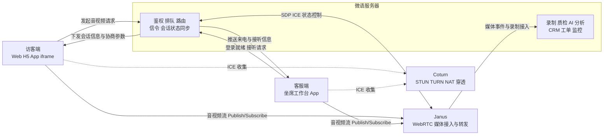

# 微语音视频客服

微语音视频客服是微语客服体系中的实时音视频接待能力，面向网页、H5、App、嵌入式 iframe 与坐席工作台，提供从会话建立、设备检测、呼叫接听，到媒体传输、状态同步、录制扩展的一整套音视频客服基础设施。

它并不是单独的一页“视频通话页面”，而是由访客端、坐席端、微语服务端、Janus、Coturn 等多个部分协同完成的客服能力层。对业务系统而言，可以把它理解为“在客服流程里嵌入实时音视频能力”的统一方案。

## 能力总览

当前微语音视频客服体系覆盖以下几类核心能力：

### 1. 多种客服形态

- 音频客服：适合快速语音说明问题、售后沟通、远程指导。
- 视频客服：适合远程演示、身份确认、可视化服务与面对面沟通。
- 屏幕共享：适合远程协助、操作指导、界面问题排查。
- 单向或双向媒体模式：可按业务场景控制双方是否都发送视频。

### 2. 访客侧呼叫能力

- 支持手动点击发起音频或视频呼叫。
- 支持在 iframe、WebView、独立浮窗等嵌入场景中自动拉起音视频客服。
- 在正式发起前自动检测麦克风、摄像头、扬声器等设备状态。
- 支持呼叫中取消、接通后挂断、静音、开关视频、切换摄像头等操作。
- 支持显示当前通话状态、通话时长、设备异常提示。

### 3. 坐席侧接待能力

- 坐席工作台可接收访客发起的音视频来电请求。
- 支持接听、拒绝、挂断，并同步会话状态给访客端。
- 坐席可在客服流程中继续查看会话、客户与业务上下文。
- 后续可与排队、路由、技能组、工单、CRM 等客服能力联动。

### 4. 嵌入式窗口能力

- 支持内嵌页面最小化、放大、关闭。
- 支持来电提示音开关。
- 适用于业务系统内嵌客服条、侧边栏、详情页浮窗、移动端容器页面等场景。

### 5. 平台与业务扩展能力

- 支持通过后端动态下发 ICE 配置，适配不同网络环境。
- 支持录音录像目录配置，为后续录制、质检、审计留出能力接口。
- 支持基于 Janus 的 VideoRoom、AudioBridge 等媒体能力扩展。
- 支持与 AI 分析、录制、监控、质检、CRM 等内部模块集成。

## 适用场景

微语音视频客服适合以下典型业务场景：

- 在线客服从文字会话升级为语音或视频服务。
- 售前顾问进行产品演示、远程讲解与高价值客户沟通。
- 售后支持通过视频查看现场问题，或通过屏幕共享定位操作错误。
- 医疗、教育、政务、金融等需要强交互或可视化确认的服务流程。
- App、H5、小程序或门户站点内快速接入一键音视频客服。

## 系统架构说明

微语音视频客服采用“业务面”和“媒体面”分离的架构设计：微语服务器负责客服业务流程、鉴权、排队、路由、信令与状态同步；Janus 负责媒体会话接入与转发；Coturn 负责 NAT 穿透与 TURN 中继兜底。



### 架构分层职责

#### 访客端

- 发起音频、视频、屏幕共享请求。
- 执行设备检测与权限申请。
- 采集本地媒体流并参与 WebRTC 协商。
- 展示通话状态、远端画面、本地预览与控制按钮。

#### 坐席端

- 接收来电提醒与接听请求。
- 参与音视频会话建立与状态同步。
- 结合客服工作台继续处理业务上下文。

#### 微语服务器

- 负责登录鉴权、组织与坐席分配、排队与路由。
- 负责线程、会话、客服状态与呼叫状态管理。
- 负责信令交换，包括 SDP、ICE、接通/挂断等状态同步。
- 负责与录制、质检、AI、CRM、工单等业务模块衔接。

#### Coturn

- 提供 STUN 服务，帮助客户端发现公网地址。
- 提供 TURN relay，在复杂网络下兜底转发媒体流。
- 提升企业网络、弱网、跨运营商场景下的接通率。

#### Janus

- 提供 WebRTC 媒体接入、房间管理与插件扩展能力。
- 承接 AudioBridge、VideoRoom、SIP、Admin 等能力。
- 在多人协作、旁路录制、媒体分发等场景中承担媒体层基础设施角色。

## 典型呼叫流程

1. 访客端进入客服页面，初始化访客信息、线程与媒体设备状态。
2. 访客发起音频或视频客服请求，微语服务器完成鉴权、排队与坐席分配。
3. 微语服务器向访客端和坐席端下发会话标识、Janus 接入参数与必要的协商上下文。
4. 双端向 STUN/TURN 服务收集 ICE candidate，优先尝试更短链路。
5. 如网络环境复杂，则自动切换到 TURN relay 作为中继兜底。
6. Janus 建立媒体会话，接入并转发音视频流。
7. 会话过程中的接通、拒绝、取消、挂断、超时、录制等状态由微语服务器统一编排与同步。

## 功能文档导航

如果你需要分主题查看详细说明，可以继续阅读以下文档：

- 音频客服：聚焦语音呼叫、来电处理与通话中交互。
- 视频客服：聚焦视频通话、单向/双向模式与摄像头控制。
- 屏幕共享：聚焦共享能力与远程协助场景。
- Stun-Turn：聚焦 NAT 穿透、中继原理与整体网络连通性。
- Janus：聚焦媒体服务器能力、部署、插件与管理接口。
- Coturn：聚焦 STUN/TURN 服务器部署、认证与网络配置。

## 系统配置说明

微语音视频客服的服务端配置主要位于 starter 模块的 32-webrtc.properties 中。这里的命名有明确边界：

- 32-webrtc.properties 负责 bytedesk.webrtc.janus.* 相关配置。

### 1. 是否启用 Janus 接入

```properties
bytedesk.webrtc.janus.enabled=true
```

- 用于控制是否启用 Janus 后端接入能力。
- 开启后，系统会启用 VideoRoom、AudioBridge、SIP、Admin 等相关接入流程。
- 如果部署环境暂未启用 Janus，可按需要关闭，但对应的音视频能力也会受限。

### 2. Janus 主连接地址

```properties
bytedesk.webrtc.janus.ws-url=ws://127.0.0.1:18188/janus
```

- 这是服务端连接 Janus API 的 WebSocket 地址。
- 本地配置通常指向 docker compose 暴露的本地端口。
- 生产环境一般改为公网域名或内网网关地址，例如 wss://janus.weiyuai.cn/janus。
- 生产建议优先使用 WSS，而不是明文 WS。

### 3. 日志与超时配置

```properties
bytedesk.webrtc.janus.log-enabled=true
bytedesk.webrtc.janus.operation-timeout-ms=10000
bytedesk.webrtc.janus.health-timeout-ms=3000
```

- log-enabled 控制 Janus SDK 日志输出开关，便于调试连接与建链问题。
- operation-timeout-ms 控制单次 Janus 调用超时时间。
- health-timeout-ms 控制健康检查或 ping 类请求超时时间。
- 本地调试可适当放宽超时；生产环境应根据网络时延和负载情况审慎设置。

### 4. ICE 服务器配置

```properties
bytedesk.webrtc.janus.ice-servers[0].urls=stun:127.0.0.1:13478
bytedesk.webrtc.janus.ice-servers[1].urls=turn:127.0.0.1:13478?transport=udp
bytedesk.webrtc.janus.ice-servers[1].username=bytedesk
bytedesk.webrtc.janus.ice-servers[1].credential=bytedesk123
```

- 该配置会作为前端动态 ICE 参数来源，由 visitorWebrtc、desktop 等客户端在初始化 Janus 前通过后端接口拉取。
- 通常至少包含一组 STUN 和一组 TURN。
- TURN 账号密码必须与 Coturn 服务端实际配置一致。
- 如果需要 TCP/TLS 中继，可继续追加 transport=tcp 或 TLS 相关地址。

生产环境示例通常改为域名形式，例如：

```properties
bytedesk.webrtc.janus.ice-servers[0].urls=stun:coturn.weiyuai.cn:3478
bytedesk.webrtc.janus.ice-servers[1].urls=turn:coturn.weiyuai.cn:3478
```

### 5. Janus Admin 管理接口

```properties
bytedesk.webrtc.janus.admin.enabled=true
bytedesk.webrtc.janus.admin.ws-url=ws://127.0.0.1:17188/janus
bytedesk.webrtc.janus.admin.http-url=http://127.0.0.1:18089/janus
bytedesk.webrtc.janus.admin.secret=janusoverlord
```

- admin.enabled 控制是否启用 Janus Admin API。
- admin.ws-url 用于 Admin WebSocket 通道。
- admin.http-url 常用于后端 ping、状态检查和管理接口访问。
- admin.secret 必须与 Janus 服务端 janus.jcfg 中的 admin_secret 保持一致。
- 生产环境应避免使用默认密钥，且应通过内网、ACL 或反向代理限制管理接口访问范围。

### 6. 录音录像目录

```properties
bytedesk.webrtc.record.dir=uploads/webrtc-video-recordings
```

- 用于指定音视频录制文件的保存目录。
- 建议部署时映射到持久化存储，而不是仅使用容器临时目录。
- 如果后续接入录制、质检、回放或审计功能，该目录通常会成为上游输入源。

### 7. 默认房间参数

```properties
bytedesk.webrtc.janus.video-room.default-publishers=6
bytedesk.webrtc.janus.video-room.default-permanent=false
bytedesk.webrtc.janus.audio-bridge.default-permanent=false
```

- video-room.default-publishers 表示 VideoRoom 默认允许的发布者数量上限。
- default-permanent=false 表示默认创建非永久房间，适合按会话生命周期动态生成和销毁。
- 如果你的业务需要固定房间、常驻会议室或长期直播场景，可再结合 Janus 端策略进行调整。

## Docker Compose 对应配置

如果你是通过 Docker Compose 启动微语，而不是直接使用 starter 本地 profile，建议把普通 WebRTC 地址和默认参数直接保留在 compose 文件里，只把敏感值放到 deploy/docker/.env 或 [deploy/docker/.env.example](https://github.com/Bytedesk/bytedesk/deploy/docker/.env.example) 中，例如 `JANUS_ADMIN_SECRET`。

这里有一个关键差异需要注意：

- 在本地 properties 中，`127.0.0.1:18188`、`127.0.0.1:13478` 这类地址通常表示宿主机映射端口。
- 在 Docker Compose 容器内部，`127.0.0.1` 指向的是当前 bytedesk 容器自身，而不是 Janus 或 Coturn 容器。
- 因此在 compose 环境下，应改为使用 Docker 网络内的服务名，例如 `bytedesk-janus` 和 `bytedesk-coturn`。

当前建议的组合方式是：

- 应用服务使用 [deploy/docker/compose-app-bytedesk.yaml](https://github.com/Bytedesk/bytedesk/deploy/docker/compose-app-bytedesk.yaml)
- WebRTC 基础设施使用 `compose-scenario-webrtc.yaml`
- 两者加入同一个 `bytedesk-network` 网络后，应用容器即可通过服务名访问 Janus 与 Coturn

### `.env` 中建议保留的变量

当前更推荐的做法是：`.env` 只保留敏感变量，而不是把所有 WebRTC 默认参数都搬进去。现在已保留的示例如下：

```dotenv
JANUS_ADMIN_SECRET=janusoverlord
```

### Compose 中的引用方式

在 compose 文件中，普通 WebRTC 配置直接写在文件里，只有敏感值通过 `.env` 注入。当前 [deploy/docker/compose-app-bytedesk.yaml](https://github.com/Bytedesk/bytedesk/deploy/docker/compose-app-bytedesk.yaml) 与 `deploy/docker/one` 下的一体化 compose 文件已经调整为以下形式：

```yaml
    BYTEDESK_WEBRTC_JANUS_ENABLED: "true"
    BYTEDESK_WEBRTC_JANUS_WS_URL: ws://bytedesk-janus:8188/janus
    BYTEDESK_WEBRTC_JANUS_ADMIN_HTTP_URL: http://bytedesk-janus:8088/janus
    BYTEDESK_WEBRTC_JANUS_ADMIN_SECRET: ${JANUS_ADMIN_SECRET:-janusoverlord}
    BYTEDESK_WEBRTC_RECORD_DIR: /app/uploads/webrtc-video-recordings
```

这种写法的好处是：

- 普通默认配置仍然集中在 compose 文件里，阅读和排查更直接。
- `.env` 不会被大量普通 WebRTC 参数污染，职责更清晰。
- 只有真正敏感或部署差异明显的值，例如 `JANUS_ADMIN_SECRET`，才需要外置。

### 字段映射说明

- `JANUS_ADMIN_SECRET` 作为 `BYTEDESK_WEBRTC_JANUS_ADMIN_SECRET` 的外部密钥来源
- `COTURN_USER`、`COTURN_PASS` 继续作为 TURN 用户名和密码来源，可被 WebRTC ICE 配置复用

### Compose 部署建议

- 如果 Janus 与 Coturn 也运行在同一套 Compose 网络中，请使用服务名访问，不要继续使用 `127.0.0.1`。
- 如果 Janus/Coturn 部署在外部主机或独立集群中，再把这些地址替换成外部可达域名或内网地址。
- `BYTEDESK_WEBRTC_RECORD_DIR` 建议使用容器内绝对路径，并挂载到持久化 volume；当前 compose 使用 `/app/uploads/webrtc-video-recordings`，可复用已有的 upload volume。
- `BYTEDESK_WEBRTC_JANUS_ADMIN_SECRET` 建议放入 `.env` 或密钥管理系统，不要长期使用默认值。

## 配置建议

### 本地开发环境

- 使用本地 compose 暴露的 Janus 与 Coturn 地址。
- 保持日志开启，便于排查 SDP、ICE、设备或建链问题。
- 优先验证 ws-url、admin.http-url、TURN 账号密码是否与容器配置一致。

### 生产环境

- 使用公网域名和 WSS/HTTPS 地址，避免明文传输。
- 为 Janus Admin 接口单独设置访问控制与强密钥。
- 将录制目录挂载到持久化存储。
- 提前规划 TURN 带宽、端口范围和监控方案。
- 确保应用配置链正确导入 32-webrtc.properties，而不是遗漏在 profile 中。

## 相关文档

- [音频客服](./audio.md)
- [视频客服](./video.md)
- [屏幕共享](./screen_sharing.md)
- [Stun-Turn](./stun-turn.md)
- [Janus](./janus.md)
- [Coturn](./coturn.md)
