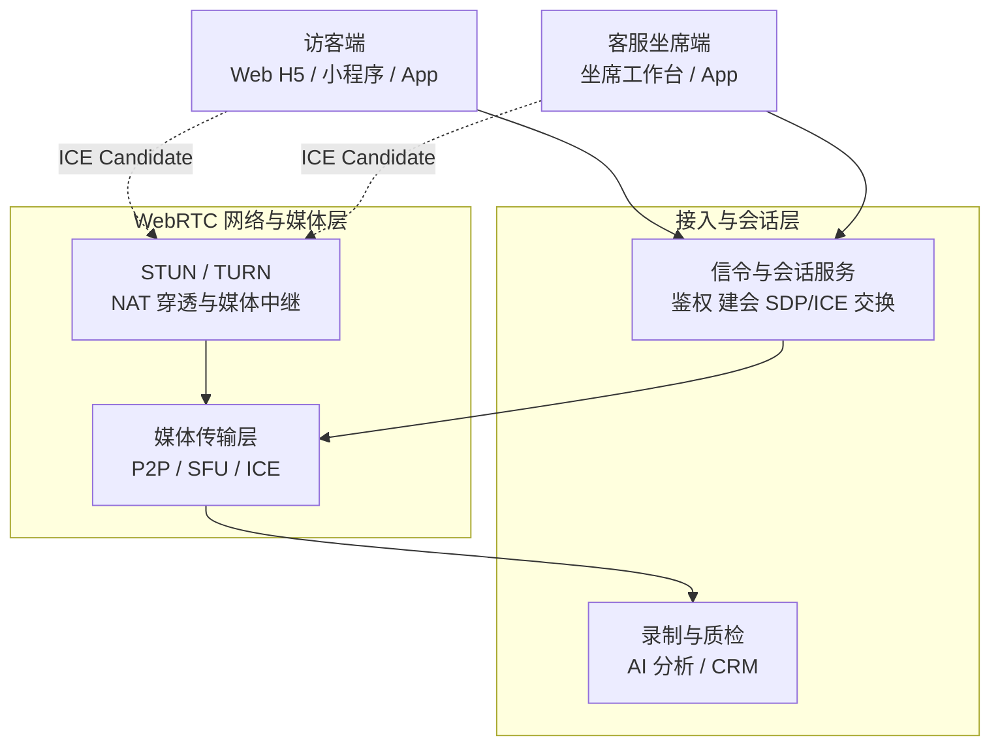
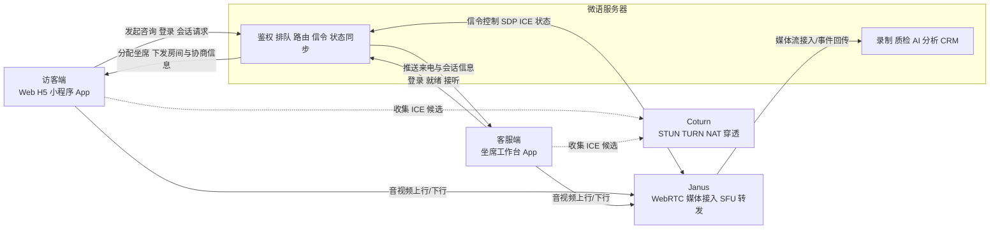

# Stun-Turn

STUN 和 TURN 是 WebRTC 建立实时音视频连接时最核心的网络基础设施，主要用于解决 NAT、运营商网络和企业防火墙带来的连通性问题。

- STUN 负责“发现我是谁”：帮助客户端获知自己的公网 IP 和端口。
- TURN 负责“必要时中继”：当双方无法直连时，由服务器转发音视频数据。
- Coturn 是最常见的开源实现，可同时提供 STUN 与 TURN 服务。

## 什么是 STUN

STUN（Session Traversal Utilities for NAT）可以理解为一个“地址发现服务”。客户端接入音视频会话前，会先向 STUN 服务器询问“我从公网看起来是谁”，从而获得自己在外网侧的地址信息。

它的主要作用包括：

- 帮助浏览器或 App 获取公网 IP 与端口。
- 帮助 ICE 收集可用候选地址，尝试建立点对点连接。
- 尽量让媒体流走直连路径，降低延迟与带宽成本。

STUN 本身不转发媒体数据，只参与连接建立阶段。如果双方网络环境允许，后续音视频流会直接在终端之间传输。

## 什么是 TURN

TURN（Traversal Using Relays around NAT）可以理解为一个“媒体中继服务”。当两个终端因为对称 NAT、严格防火墙、企业内网策略等原因无法直连时，TURN 服务器会代为转发音频、视频和数据通道流量。

它的主要作用包括：

- 作为 STUN 失败后的兜底方案。
- 为复杂网络环境提供稳定可达的中继路径。
- 提升企业网络、跨地区网络、移动网络场景下的通话成功率。

与 STUN 相比，TURN 会实际承载媒体流量，因此会消耗服务器带宽、端口和转发资源，但它通常是保证音视频呼叫“最终能接通”的关键组件。

## STUN 和 TURN 在 WebRTC 中的作用

在 WebRTC 连接流程里，STUN 和 TURN 通常和信令服务一起工作：

1. 终端 A、B 先通过信令服务交换 SDP、ICE Candidate 等协商信息。
2. 两端向 STUN/TURN 服务器收集自己的 ICE 候选地址。
3. WebRTC 优先尝试 host、srflx 等直连候选。
4. 如果直连失败，则切换到 relay 候选，由 TURN 中继传输媒体流。

可以简单理解为：

- 信令服务负责“协商怎么连”。
- STUN 负责“告诉双方各自的公网地址”。
- TURN 负责“实在连不上时帮双方转发数据”。

这也是为什么生产环境中通常不能只配 STUN。只有同时具备 TURN，中高复杂度网络环境下的 WebRTC 才具备较好的接通率与稳定性。

## 在微语音视频客服系统中的作用

在微语音视频客服系统里，STUN/TURN 并不是一个独立业务模块，而是音视频链路成功建立的底层网络能力。

典型场景包括：

- 访客通过网页、小程序、App 发起音视频咨询。
- 客服坐席通过工作台接听视频客服或语音客服会话。
- 双方通过信令服务完成会话建立、坐席分配、状态同步。
- 浏览器或客户端通过 ICE 尝试建立媒体通道。
- 网络允许时优先走 P2P 或更短路径，降低时延。
- 网络受限时自动切换到 TURN 中继，保证通话不中断。

对于客服系统而言，它的价值主要体现在：

- 提高首次接通率，减少“能发起但无法通话”的情况。
- 提升弱网、企业内网、移动网络下的稳定性。
- 降低用户侧配置门槛，访客无需理解复杂网络环境即可完成呼叫。
- 为视频客服、语音客服、屏幕共享等能力提供统一的连通性基础。

## 在系统架构中的位置

从系统架构上看，STUN/TURN 通常位于“客户端”和“音视频媒体路由层”之间，和信令服务并列协作，但职责不同：

- 信令层：负责鉴权、建会、消息交换、会话控制。
- STUN/TURN 层：负责 NAT 穿透与媒体中继。
- 媒体层：负责 WebRTC 媒体传输、路由、转发与质量保障。
- 业务层：负责客服接待、工单、CRM、质检、录制、AI 分析等能力，这些能力通常由微语服务器内部模块实现。

在微语体系中，可以把它理解为“音视频基础设施层”的一部分。它不直接面向业务界面，但直接影响视频客服能否成功建立、是否低延迟、是否稳定。

## 微语音视频通话完整架构

如果把一次真实的音视频客服呼叫拆开来看，访客端、客服端、Coturn、Janus 与微语服务器之间通常是如下关系：

### 各角色分工

- **访客端**：发起语音或视频咨询，采集本地音视频并参与 WebRTC 协商。
- **客服端**：接收来电、接听会话、上传和接收媒体流。
- **微语服务器**：负责登录鉴权、排队分配、会话控制、信令交换、状态同步，以及录制、质检、AI 分析、CRM 等业务模块。
- **Coturn**：负责 STUN/TURN，帮助客户端发现公网地址，并在必要时提供 relay 中继。
- **Janus**：负责承接 WebRTC 媒体流、管理音视频会话，并为微语服务器内部业务模块提供媒体接入点。

### 一次音视频客服通话是如何建立的

1. 访客端向微语服务器发起音视频客服请求。
2. 微语服务器完成鉴权、排队、技能组路由和坐席分配。
3. 微语服务器把会话信息、Janus 接入参数、必要的 SDP/ICE 协商上下文返回给访客端和客服端。
4. 双端向 Coturn 收集 host、srflx、relay 等候选地址。
5. 网络较好时，媒体链路可优先选择更短路径；网络复杂时，则依赖 TURN relay 兜底。
6. Janus 建立并承载媒体会话，负责实际音视频流的接入、转发与媒体管理。
7. 整个通话过程中的接听、挂断、转接、超时、录制、质检等事件继续由微语服务器统一编排。

### 为什么在客服场景里通常要同时使用 Coturn 和 Janus

- 只有 Coturn，没有 Janus：可以解决部分 NAT 穿透问题，但不适合承载更复杂的媒体接入、扩展转发和旁路能力。
- 只有 Janus，没有 Coturn：媒体服务器能力更强，但在复杂网络环境下，接通率会明显受限。
- 两者配合：Coturn 解决“能不能连上”，Janus 解决“媒体如何稳定承载、转发和扩展”。

结合上图可以看到：

- 客户端首先进入 Signaling & Session 完成会话协商。
- Media Routing 侧承接 SFU / TURN / ICE 等音视频网络能力。
- STUN/TURN 就位于这一层，为媒体建立与回退提供网络支撑。
- 其下再连接录制、AI 分析、存储、CRM、质检等业务能力。

## 选型建议

- 开发测试环境可以先使用 STUN 验证基础连通性。
- 生产环境建议始终部署 TURN，不能只依赖 STUN。
- 面向企业客户、跨地区访问、移动端接入时，建议优先评估 TURN 带宽与端口规划。
- 如果需要自建，推荐使用 Coturn 作为标准实现。

## 相关文档

- [Coturn 安装与配置](./coturn.md)
- [Janus 安装与配置](./janus.md)
