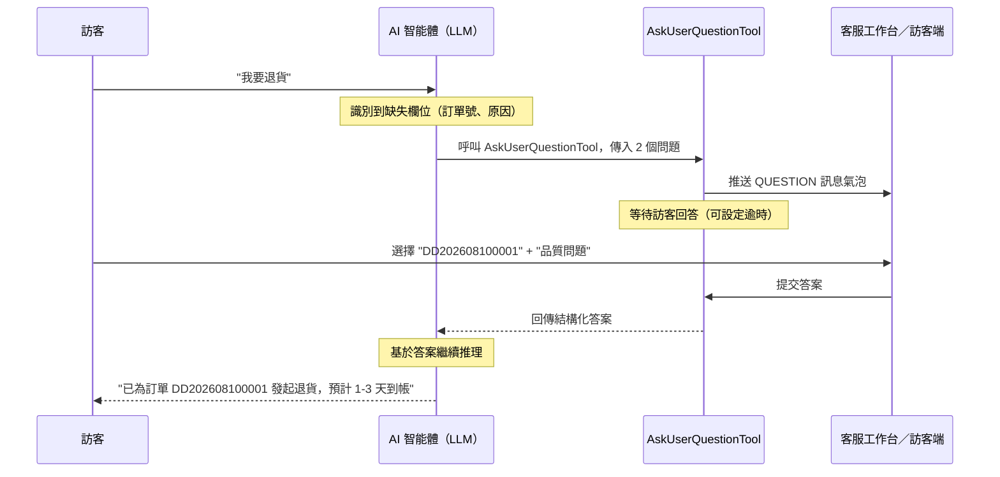

# AI 客服追問功能（Ask User Question）

在 AI 客服接待訪客的過程中，經常會遇到需要訪客繼續澄清意圖或補充更多資訊的情況。微語提供了內建的**追問（Ask User Question）**能力：讓 AI 智能體主動以結構化問題的形式向訪客收集資訊，訪客透過點選即可完成澄清，而不必反覆輸入自然語言。

本頁介紹該功能的產品設計與實作方向，部分細節會隨版本迭代更新。

## 為什麼需要追問

自助服務最大的攔路虎是「資訊不全」：

- 訪客說「我要退貨」——但沒說哪個訂單、什麼原因
- 訪客說「怎麼安裝」——但沒說產品型號、作業系統
- 訪客說「我要報修」——但沒說裝置序號、故障現象、期望到場時間

如果沒有結構化的澄清，智能體要麼硬猜（答錯），要麼直接轉人工（本可自助的也變成人力成本）。追問能力把「向使用者提問」變成了智能體的一種一等能力：智能體自己判斷何時問、問什麼、給哪些選項，訪客點一下就能回答，而不必逐字輸入。

## 工作原理



智能體把「向使用者提問」當成一個可呼叫的工具，思路參考 [Claude Code 的 AskUserQuestion](https://platform.claude.com/docs/en/agent-sdk/user-input#question-format) 與 [spring-ai-agent-utils](https://github.com/spring-ai-community/spring-ai-agent-utils) 參考實作。微語並未直接依賴外部函式庫，而是借鏡設計自行實作了一套等效能力，以便原生融入多租戶、多會話、WebSocket 的客服體系。

## 核心特性

- **AI 自主觸發**：由 LLM 判斷何時需要追問，無需寫死話術。
- **結構化問題**：單次最多 1–4 個問題，每個問題 2–4 個選項，並支援自由輸入。
- **單選與多選**：根據問題語意選擇合適的互動方式。
- **業務欄位綁定**：每個問題可攜帶 `key`，答案可直接回填到工單、訂單查詢或路由規則。
- **機器人級可設定**：開關、最大追問輪數、單次最大問題數、逾時時間、是否允許自由輸入、逾時動作（繼續等待／轉人工／結束會話）。
- **複用微語訊息體系**：以 `QUESTION` 訊息類型下發，由訪客端和客服端的專用氣泡元件渲染。
- **可稽核**：每次追問都會持久化，用於品質檢查、命中率分析與轉人工上下文。

## 問題格式

智能體提出的每個問題包含：

| 欄位 | 說明 |
| --- | --- |
| `question` | 完整的問題文字，建議以「？」結尾。 |
| `header` | UI 展示用的短標籤（建議不超過 12 個字元）。 |
| `options` | 2–4 個選項，每個選項包含 `label` 與 `description`。 |
| `multiSelect` | `true` 允許多選；`false`（預設）為單選。 |
| `allowOther` | `true` 允許訪客在選項之外自由輸入。 |
| `key` | 可選的業務欄位標識（如 `order_no`、`reason`），便於下游系統直接使用。 |

範例：

```json
{
  "key": "order_no",
  "question": "請問您要退貨的訂單號是？",
  "header": "訂單號",
  "multiSelect": false,
  "allowOther": true,
  "options": [
    { "label": "DD202608100001", "description": "8月10日下單，藍牙耳機" },
    { "label": "DD202608090008", "description": "8月9日下單，手機殼" }
  ]
}
```

訪客始終可以看到「其他」入口，輸入自訂答案，不會被智能體的選項鎖死。

## 互動流程

1. 訪客發送一則訊息。
2. 智能體識別到必要資訊缺失或意圖模糊。
3. 智能體呼叫 `AskUserQuestionTool`，傳入結構化問題清單。
4. 訪客端渲染**追問氣泡**：卡片形式，含選項按鈕和可選的自由輸入框。
5. 訪客提交答案（或主動取消，或逾時未答）。
6. 智能體拿到結構化答案後繼續對話——回答問題、查詢訂單，或帶著已收集欄位建立工單。

## 設定項

機器人設定中提供以下選項（括號內為預設值）：

| 設定項 | 預設值 | 說明 |
| --- | --- | --- |
| `enableAskUserQuestion` | `true` | 是否啟用追問。 |
| `maxQuestionRounds` | `3` | 連續追問多少輪後自動轉人工。 |
| `maxQuestionsPerCall` | `4` | 單次工具呼叫最多允許的問題數。 |
| `defaultTimeoutSeconds` | `300` | 追問氣泡的等待逾時（秒）。 |
| `allowFreeText` | `true` | 是否允許訪客自由輸入。 |
| `onTimeoutAction` | `TRANSFER_HUMAN` | 逾時動作：`CONTINUE_WAIT`／`TRANSFER_HUMAN`／`END_THREAD`。 |
| `questionSystemPrompt` | _（內建）_ | 覆寫預設的追問策略提示詞。 |

## 與其他模組的聯動

追問不是孤立的提問功能，它的輸出會直接進入其他業務模組：

- **工單**：帶 `key` 的答案會對應到工單表單欄位，智能體建立工單時自動預填。
- **訂單**：訪客選擇訂單號後，智能體下一輪可直接用該訂單號呼叫 `OrderTools` 查詢。
- **路由**：收集到的問題分類、緊急程度可作為統一路由的輸入。
- **會話小結**：追問紀錄計入會話上下文，會話小結智能體可引用。
- **品質檢查**：持久化的追問紀錄用於統計命中率、訪客放棄率、平均回答時長。
- **即時監控**：客服端可看到機器人正在問什麼、訪客是否已答，便於順暢接管。

## 降級策略

- 如果所用大模型不支援工具呼叫，機器人會在回覆裡以自由文字方式提問，退回到純文字追問。
- 如果訪客逾時或主動取消，按 `onTimeoutAction` 處理——預設帶上已有上下文轉人工。
- 如果同一會話並發觸發多次追問，只接受第一次，後續會被提示「已有進行中的追問」。

## 典型場景

### 退貨澄清

> 訪客：「我要退貨。」
> 智能體追問：訂單號（給出最近兩單）＋ 退貨原因（品質／七天無理由／描述不符）。
> 訪客點選。智能體查詢訂單、校驗是否可退，發起退貨或建立工單。

### 報修受理

> 訪客：「我裝置壞了。」
> 智能體追問：裝置型號＋序號＋故障現象＋期望到場時間。
> 訪客回答。智能體建立工單，欄位全部預填，並派給對應團隊。

### 售前諮詢

> 訪客：「我該選哪個方案？」
> 智能體追問：團隊規模＋預估用量＋必備功能。
> 訪客點選。智能體推薦方案，並詢問是否轉接業務。

## 實作說明

- 該功能以 Spring AI `@Tool` 的形式實作於 `modules/ai`，透過微語現有的工具註冊表註冊，任何啟用了追問的機器人都可使用。
- 追問會話狀態以 `threadUid` 為鍵保存在會話儲存中；訪客提交透過 REST 介面完成，多實例部署下透過 Redis 同步。
- 新增兩個訊息類型：`QUESTION`（智能體→訪客）和 `QUESTION_SUBMIT`（訪客→智能體），由專用氣泡元件渲染。
- 詳細設計、資料模型與分階段計畫見 `docs/plans/2026-08-10-ask-user-question-plan.md`。

## 相關文件

- [客服助手 Agent](./customer-service-assistant.md)
- [售後 Agent](./after-sales-agent.md)
- [售前 Agent](./pre-sales-agent.md)
- [spring-ai-agent-utils AskUserQuestionTool](https://github.com/spring-ai-community/spring-ai-agent-utils/blob/main/spring-ai-agent-utils/docs/AskUserQuestionTool.md)
- [Claude Agent SDK — User Input](https://platform.claude.com/docs/en/agent-sdk/user-input#question-format)
