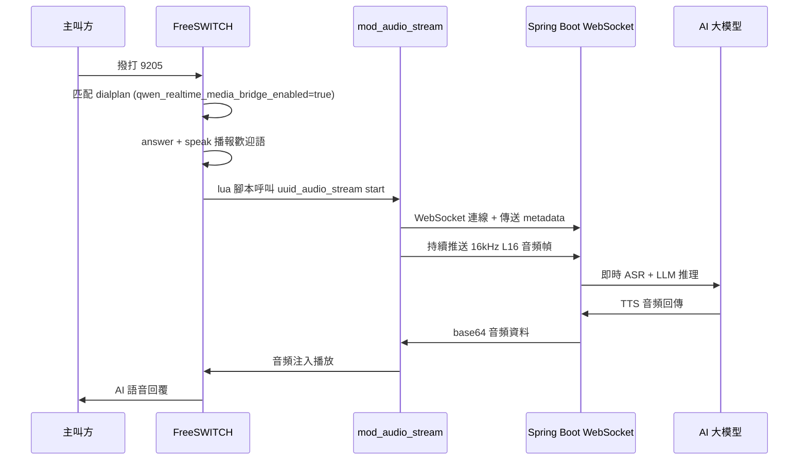

# Freeswitch Audio Stream

## 概述

`mod_audio_stream` 是用於 FreeSWITCH 的生產級 WebSocket 音頻流模組。它通過 WebSocket 將即時音頻流推送到外部系統（如 ASR 語音識別、TTS 語音合成、大模型即時對話），並支援接收 WebSocket 服務端的音頻資料進行回放，實現全雙工音頻互動。

:::info 模組來源
`mod_audio_stream` 由 [amigniter](https://github.com/amigniter/mod_audio_stream) 開發和維護，基於 MIT 協議開源。社群版支援單向 WebSocket 音頻流推送（適用於 ASR 等場景）；商業版支援雙向音頻流和回放功能（全雙工），且針對高併發場景（5000+ 路）做了生命週期管理、執行緒安全和記憶體最佳化。
:::

### 使用場景

- **AI 即時語音對話**：將通話媒體即時流式推送到大模型 WebSocket 端點（如 Qwen-Audio-Realtime），實現低延遲語音互動
- **即時語音識別 (ASR)**：將音頻流推送到第三方 ASR 引擎進行即時轉寫
- **語音合成回放 (TTS)**：接收 WebSocket 服務端返回的音頻資料，注入到通話中進行播放
- **音頻質檢與分析**：即時採集通話音頻用於質檢、情緒分析等

## 系統要求

- FreeSWITCH 1.10.x 或更高版本
- Linux 64 位元系統（Ubuntu 20.04+ / Debian 11+）
- 構建依賴：`libfreeswitch-dev`、`libssl-dev`、`zlib1g-dev`、`libevent-dev`、`libspeexdsp-dev`、`cmake`

## 編譯安裝

### 環境依賴

```bash
# Debian/Ubuntu 安裝依賴
sudo apt-get install -y \
    libfreeswitch-dev \
    libssl-dev \
    zlib1g-dev \
    libevent-dev \
    libspeexdsp-dev \
    cmake \
    git
```

### 原始碼編譯

```bash
# 克隆倉庫
git clone https://github.com/amigniter/mod_audio_stream.git
cd mod_audio_stream

# 初始化子模組（libwsc WebSocket 客戶端庫）
git submodule init
git submodule update --recursive

# 如果 FreeSWITCH 安裝在自訂路徑，設定 PKG_CONFIG_PATH
export PKG_CONFIG_PATH=/usr/local/freeswitch/lib/pkgconfig:${PKG_CONFIG_PATH:-}

# 編譯（Release 模式）
mkdir build && cd build
cmake -DCMAKE_BUILD_TYPE=Release ..
make -j"$(nproc)"

# 安裝
sudo make install
```

:::tip 啟用 TLS/WSS 支援
如需支援 `wss://` 加密連線，編譯時新增 `-DUSE_TLS=ON`：
```bash
cmake -DCMAKE_BUILD_TYPE=Release -DUSE_TLS=ON ..
```
:::

### 一鍵腳本安裝

```bash
sudo apt-get -y install git \
    && cd /usr/src/ \
    && git clone https://github.com/amigniter/mod_audio_stream.git \
    && cd mod_audio_stream \
    && sudo bash ./build-mod-audio-stream.sh
```

### 驗證安裝

```bash
# 檢查模組檔案是否存在
ls -l /usr/local/freeswitch/lib/freeswitch/mod/mod_audio_stream.so

# 檢查模組檔案大小（確認非空）
ls -lh /usr/local/freeswitch/lib/freeswitch/mod/mod_audio_stream.so
```

## 啟用模組

### 1. 編輯 modules.conf.xml

編輯 FreeSWITCH 模組組態檔：

```bash
vim /usr/local/freeswitch/conf/autoload_configs/modules.conf.xml
```

在 `<modules>` 節點中新增：

```xml
<load module="mod_audio_stream" />
```

### 2. 重啟或重新載入

```bash
# 方式一：重啟 FreeSWITCH
freeswitch -stop
freeswitch -nc

# 方式二：僅重新載入模組設定
fs_cli -x "reload mod_audio_stream"
```

### 3. 驗證模組已載入

```bash
# 在 fs_cli 中檢查
fs_cli -x "module_exists mod_audio_stream"
# 返回 true 表示模組已載入

# 檢視所有已載入模組
fs_cli -x "show modules" | grep mod_audio_stream
```

## API 命令

模組註冊了 `uuid_audio_stream` API 命令，用於控制音頻流的生命週期：

### 啟動音頻流

```
uuid_audio_stream <uuid> start <ws-url> <mix-type> <sampling-rate> [metadata]
```

將通道媒體附加到媒體 bug，並以 L16（線性 16-bit PCM）格式流式推送到 WebSocket 服務端。

| 參數 | 說明 | 可選值 |
| ---- | ---- | ---- |
| `uuid` | FreeSWITCH 通道唯一標識 | 通道 UUID |
| `ws-url` | WebSocket 服務端地址 | `ws://` 或 `wss://` |
| `mix-type` | 音頻混合模式 | `mono`（僅主叫）、`mixed`（混合）、`stereo`（立體聲分離） |
| `sampling-rate` | 取樣率 | `8k`、`16k` |
| `metadata` | 可選，UTF-8 文字，在音頻流開始前傳送 | JSON 字串等 |

**範例**：

```bash
# 啟動 16kHz 單聲道音頻流，攜帶元資料
uuid_audio_stream <uuid> start ws://host.docker.internal:9003/voice-agent/media mono 16k {"uuid":"xxx","caller":"1001","botDid":"9205"}
```

### 停止音頻流

```
uuid_audio_stream <uuid> stop [metadata]
```

停止音頻流並關閉 WebSocket 連線。如果提供 metadata，將在連線關閉前傳送。

### 暫停音頻流

```
uuid_audio_stream <uuid> pause
```

### 恢復音頻流

```
uuid_audio_stream <uuid> resume
```

### 傳送文字訊息

```
uuid_audio_stream <uuid> send_text <metadata>
```

向 WebSocket 服務端傳送 UTF-8 文字訊息。

## 通道變數

以下通道變數用於精細控制 WebSocket 連線和日誌行為：

| 變數名 | 說明 | 預設值 |
| ---- | ---- | ---- |
| `STREAM_MESSAGE_DEFLATE` | 設為 `true` 或 `1` 禁用壓縮 | 啟用壓縮 |
| `STREAM_HEART_BEAT` | 心跳間隔（秒），無流量時傳送保活 | 關閉 |
| `STREAM_SUPPRESS_LOG` | 設為 `true` 或 `1` 禁止列印日誌 | 關閉（列印） |
| `STREAM_BUFFER_SIZE` | 音頻緩衝區大小（毫秒），需能被 20 整除 | 20 |
| `STREAM_EXTRA_HEADERS` | JSON 格式的額外 HTTP 請求頭 | 無 |
| `STREAM_NO_RECONNECT` | 設為 `true` 或 `1` 禁用自動重連 | 開啟自動重連 |
| `STREAM_TLS_CA_FILE` | TLS CA 憑證檔案，特殊值 `SYSTEM`（系統預設）或 `NONE`（不驗證） | `SYSTEM` |
| `STREAM_TLS_KEY_FILE` | TLS 客戶端私鑰檔案 | 無 |
| `STREAM_TLS_CERT_FILE` | TLS 客戶端憑證檔案 | 無 |
| `STREAM_TLS_DISABLE_HOSTNAME_VALIDATION` | 設為 `true` 或 `1` 禁用主機名驗證 | `false` |

**撥號計劃中的設定範例**：

```xml
<action application="set" data="STREAM_BUFFER_SIZE=100" />
<action application="set" data="STREAM_HEART_BEAT=15" />
<action application="set" data="STREAM_SUPPRESS_LOG=true" />
```

## 事件

模組會生成以下 FreeSWITCH 自訂事件：

| 事件名 | 說明 |
| ---- | ---- |
| `mod_audio_stream::json` | 收到 WebSocket 服務端的回應訊息 |
| `mod_audio_stream::connect` | 成功連線到 WebSocket 服務端 |
| `mod_audio_stream::disconnect` | 從 WebSocket 服務端斷開連線 |
| `mod_audio_stream::error` | 連線出現錯誤，附帶錯誤碼和描述 |
| `mod_audio_stream::play` | 服務端返回 base64 音頻資料，模組將其寫到暫存檔案 |

### 錯誤碼

| 錯誤碼 | 說明 |
| ---- | ---- |
| 1 | IO 錯誤（Socket 讀寫失敗） |
| 2 | 無效的 WebSocket 頭部 |
| 3 | 服務端幀被掩碼（不符合規範） |
| 4 | 請求的功能不受支援 |
| 5 | PING 超時 |
| 6 | TCP 連線或 DNS 解析失敗 |
| 7 | SSL/TLS 上下文初始化失敗 |
| 8 | SSL/TLS 握手失敗 |
| 9 | 通用 OpenSSL 錯誤 |
| 10 | 逾時 |
| 11 | WebSocket 協議錯誤 |

## Bytedesk FreeSWITCH 鏡像整合

Bytedesk 已將 `mod_audio_stream` 預編譯並內建到 `bytedesk-freeswitch` Docker 鏡像中，開箱即用。

### 鏡像資訊

- **阿里雲（國內推薦）**：`registry.cn-hangzhou.aliyuncs.com/bytedesk/freeswitch:latest`
- **Docker Hub**：`bytedesk/freeswitch:latest`

### 鏡像內構建方式

鏡像在構建時自動編譯 `mod_audio_stream`（Dockerfile 中的相關階段）：

```dockerfile
# 編譯安裝 mod_audio_stream（預設啟用，用於 WebSocket 即時音頻流）
ARG MOD_AUDIO_STREAM_REF=main
RUN git clone --depth 1 --branch ${MOD_AUDIO_STREAM_REF} \
      https://github.com/amigniter/mod_audio_stream.git && \
    cd mod_audio_stream && \
    git submodule update --init --recursive && \
    export PKG_CONFIG_PATH=${FREESWITCH_PREFIX}/lib/pkgconfig && \
    cmake -S . -B build -DCMAKE_BUILD_TYPE=Release && \
    cmake --build build -- -j"$(nproc)" && \
    cmake --install build
```

模組已在 `modules.conf.xml` 中預設啟用：

```xml
<load module="mod_audio_stream" />
```

### 驗證鏡像中的模組

```bash
# 檢查模組檔案是否存在
docker exec freeswitch-bytedesk ls -la /usr/local/freeswitch/lib/freeswitch/mod/ | grep mod_audio_stream

# 檢查模組是否已載入
docker exec freeswitch-bytedesk fs_cli -p bytedesk123 -x "module_exists mod_audio_stream"

# 檢視所有已載入模組
docker exec freeswitch-bytedesk fs_cli -p bytedesk123 -x "show modules" | grep mod_audio_stream
```

## 設定參數說明（bytedesk-freeswitch 鏡像）

### 環境變數

在 `compose-scenario-call.yaml` 和 `.env` 中透過以下環境變數設定：

| 環境變數 | 預設值 | 說明 |
| ---- | ---- | ---- |
| `FREESWITCH_QWEN_REALTIME_MEDIA_BRIDGE_ENABLED` | `false` | 是否啟用 Qwen-Audio-Realtime 電話即時媒體橋（需 `mod_audio_stream` 已載入） |
| `FREESWITCH_QWEN_REALTIME_MEDIA_WS_URL` | `ws://host.docker.internal:9003/visitor/api/v1/call/voice-agent/qwen-realtime/media?output=mod_audio_stream&events=false&model=qwen-audio-3.0-realtime-plus&voice=longanqian&outputSampleRate=24000` | 即時媒體橋 WebSocket 地址 |

### compose-scenario-call.yaml 中的設定

```yaml
services:
  bytedesk-freeswitch:
    environment:
      # Qwen-Audio-Realtime 電話即時媒體橋
      FREESWITCH_QWEN_REALTIME_MEDIA_BRIDGE_ENABLED: ${FREESWITCH_QWEN_REALTIME_MEDIA_BRIDGE_ENABLED:-false}
      FREESWITCH_QWEN_REALTIME_MEDIA_WS_URL: ${FREESWITCH_QWEN_REALTIME_MEDIA_WS_URL:-ws://host.docker.internal:9003/visitor/api/v1/call/voice-agent/qwen-realtime/media?output=mod_audio_stream&events=false&model=qwen-audio-3.0-realtime-plus&voice=longanqian&outputSampleRate=24000}
```

### .env 範例

```bash
# Qwen-Audio-Realtime 電話即時媒體橋；啟用前需確認 FreeSWITCH 鏡像已安裝/載入 mod_audio_stream
FREESWITCH_QWEN_REALTIME_MEDIA_BRIDGE_ENABLED=true
FREESWITCH_QWEN_REALTIME_MEDIA_WS_URL=ws://host.docker.internal:9003/visitor/api/v1/call/voice-agent/qwen-realtime/media
```

### vars.xml 全域變數

在 `deploy/freeswitch/conf/vars.xml` 中定義的全域變數：

```xml
<!-- 即時媒體橋開關（true=啟用即時雙工，false=回落 HTTAPI 回合制） -->
<X-PRE-PROCESS cmd="set" data="qwen_realtime_media_bridge_enabled=true" />

<!-- 即時媒體橋 WebSocket 地址 -->
<X-PRE-PROCESS cmd="set"
  data="qwen_realtime_media_ws_url=ws://host.docker.internal:9003/visitor/api/v1/call/voice-agent/qwen-realtime/media" />
```

### dialplan 撥號計劃

在 `deploy/freeswitch/conf/dialplan/default/92-ai-bot.xml` 中定義了 9205 分機的兩個工作模式：

#### 模式一：即時媒體橋（mod_audio_stream 已啟用）

當 `qwen_realtime_media_bridge_enabled=true` 時，使用 `mod_audio_stream` 實現低延遲即時雙工語音對話：

```xml
<extension name="92-ai-bot-qwen-realtime-media" continue="false">
  <condition field="${destination_number}:$${qwen_realtime_media_bridge_enabled}" expression="^9205:(true|1|yes)$">
    <!-- 設定 MRCP TTS 播報引擎 -->
    <action application="set" data="mrcp_profile=java-mrcp" />
    <action application="set" data="hangup_after_bridge=true" />
    <!-- mod_audio_stream 通道變數 -->
    <action application="set" data="STREAM_BUFFER_SIZE=100" />
    <action application="set" data="STREAM_HEART_BEAT=15" />
    <!-- TTS 引擎設定 -->
    <action application="set" data="tts_engine=unimrcp" />
    <action application="set" data="tts_profile=${mrcp_profile}" />
    <action application="set" data="unimrcp:header:Speech-Language=zh-CN" />
    <action application="set" data="synth-content-type=application/ssml+xml" />
    <!-- 應答並播報歡迎語 -->
    <action application="answer" />
    <action application="speak"
      data="unimrcp:${mrcp_profile}||&lt;speak version='1.0' xml:lang='zh-CN'&gt;您好，我是微語智慧語音助手，請問有什麼可以幫您的？&lt;/speak&gt;" />
    <!-- 啟動即時媒體橋：Lua 腳本呼叫 uuid_audio_stream start -->
    <action application="lua" data="qwen_realtime_media_start.lua ws://host.docker.internal:9003/visitor/api/v1/call/voice-agent/qwen-realtime/media" />
    <action application="log" data="INFO [AI-BOT-9205-REALTIME] media bridge started after greeting uuid=${uuid}" />
    <action application="park" />
  </condition>
</extension>
```

#### 模式二：HTTAPI 回合制兜底

當 `qwen_realtime_media_bridge_enabled=false` 時，回退到 HTTAPI 回合制模式（不依賴 `mod_audio_stream`）：

```xml
<extension name="92-ai-bot-qwen-realtime-entry" continue="false">
  <condition field="destination_number" expression="^9205$">
    <action application="set" data="hangup_after_bridge=true" />
    <action application="answer" />
    <action application="httapi"
      data="{url=$${ai_bot_base_url}/ai-bot?turn=1&amp;mode=unlimited&amp;bot_did=9205&amp;voice_agent=true,method=POST}" />
  </condition>
</extension>
```

### Lua 啟動腳本

`deploy/freeswitch/scripts/qwen_realtime_media_start.lua` 負責呼叫 `uuid_audio_stream` API：

```lua title="qwen_realtime_media_start.lua"
local session = session

local function json_escape(value)
  value = value or ""
  value = value:gsub('\\', '\\\\')
  value = value:gsub('"', '\\"')
  return value
end

if not session or not session:ready() then
  freeswitch.consoleLog("WARNING", "[AI-BOT-9205-REALTIME] no ready session for media bridge\n")
  return
end

local uuid = session:get_uuid()
local caller = session:getVariable("caller_id_number") or ""
local ws_url = argv and argv[1] or ""

if ws_url == "" then
  ws_url = "ws://host.docker.internal:9003/visitor/api/v1/call/voice-agent/qwen-realtime/media"
end

local metadata = string.format('{"uuid":"%s","caller":"%s","botDid":"9205"}',
  json_escape(uuid), json_escape(caller))
local command = string.format("uuid_audio_stream %s start %s mono 16k %s",
  uuid, ws_url, metadata)
local api = freeswitch.API()
local result = api:executeString(command) or ""

freeswitch.consoleLog("INFO", string.format(
  "[AI-BOT-9205-REALTIME] media bridge start uuid=%s ws=%s result=%s\n",
  uuid, ws_url, result))
```

## 典型使用流程

以透過 `bytedesk-freeswitch` 鏡像實現 AI 即時語音對話為例：



## 常見問題

### 1. 模組載入失敗

**現象**：`fs_cli -x "module_exists mod_audio_stream"` 返回 `false`

**排查**：
- 檢查模組檔案是否存在：`ls -l /usr/local/freeswitch/lib/freeswitch/mod/mod_audio_stream.so`
- 檢視 FreeSWITCH 日誌：`tail -f /usr/local/freeswitch/log/freeswitch.log`
- 檢查依賴庫是否完整：`ldd /usr/local/freeswitch/lib/freeswitch/mod/mod_audio_stream.so`

### 2. 啟動音頻流無反應

**現象**：呼叫 `uuid_audio_stream start` 後沒有連線到 WebSocket

**排查**：
- 確認 WebSocket 服務端可達：在容器內 `curl` 或 `telnet` 測試目標地址和埠
- 檢查 Docker 網路：容器內使用 `host.docker.internal` 訪問宿主機服務
- 檢視 FreeSWITCH 日誌中的 error 事件
- 確認 `STREAM_NO_RECONNECT` 未設為 `true`

### 3. 音頻品質差或斷流

- 調整 `STREAM_BUFFER_SIZE`（預設 20ms，可設為 100ms）
- 啟用 `STREAM_HEART_BEAT` 防止負載均衡器斷開空閒連線
- 檢查 WebSocket 服務端的處理能力是否匹配併發數

### 4. WSS 連線失敗

- 確認編譯時啟用了 TLS 支援（`-DUSE_TLS=ON`）
- 正確設定 `STREAM_TLS_CA_FILE`、`STREAM_TLS_CERT_FILE`、`STREAM_TLS_KEY_FILE`
- 如需跳過憑證驗證：設 `STREAM_TLS_DISABLE_HOSTNAME_VALIDATION=true`

### 5. 啟用即時媒體橋後 9205 仍走 HTTAPI 回合制

**排查**：
- 確認 `qwen_realtime_media_bridge_enabled=true` 已生效：`fs_cli -x "global_getvar qwen_realtime_media_bridge_enabled"`
- 確認 `mod_audio_stream` 已載入：`fs_cli -x "module_exists mod_audio_stream"`
- 重新載入 XML 設定：`fs_cli -x "reloadxml"`
- 檢視 dialplan 匹配日誌：撥號時關注日誌中的 `[AI-BOT-9205-REALTIME]` 前綴

## 參考

- [mod_audio_stream GitHub](https://github.com/amigniter/mod_audio_stream)
- [mod_audio_stream libwsc (WebSocket Client)](https://github.com/amigniter/libwsc)
- [Bytedesk FreeSWITCH Docker 鏡像](https://github.com/Bytedesk/bytedesk-freeswitch)
- [FreeSWITCH Module: mod_audio_fork](https://developer.signalwire.com/freeswitch/FreeSWITCH-Explained/Modules/mod_audio_fork_6587401/)
- [Qwen-Audio 即時語音模型](https://github.com/QwenLM/Qwen-Audio)
