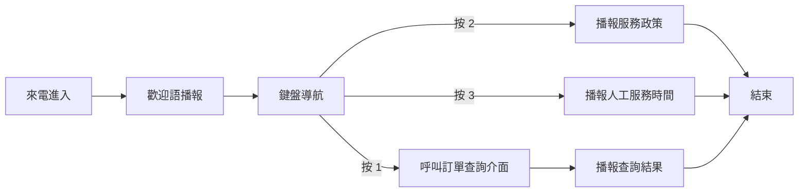

# IVR

## IVR 預覽

微語 IVR 流程編輯器用於配置企業電話的自動語音服務流程。它主要面向營運、客服主管、實施顧問與業務管理員設計，不要求具備程式開發背景，也不需要理解複雜的通信協議。透過視覺化拖曳與表單配置，就可以把「來電歡迎語、按鍵導航、資訊查詢、結果播報、結束通話」等步驟組織成一條完整的電話自助服務流程。

簡單理解，IVR 就是電話中的「語音選單」。例如：

- 來電先聽到歡迎語
- 使用者按 1 查詢訂單
- 使用者按 2 查詢餘額
- 使用者按 3 轉人工或播報服務說明

這些流程都可以在微語 IVR 流程編輯器中完成配置。

## 適合哪些場景

微語 IVR 工作流編輯器適合以下常見業務場景：

- 企業總機導航：按 1 銷售，按 2 售後，按 3 財務
- 下班時間自動應答：播報非工作時間說明，並引導留言或回撥
- 自助查詢：根據來電號碼查詢訂單、積分、會員狀態等資訊
- 服務政策播報：播報價格說明、售後政策、活動通知等固定內容
- 呼入分流：透過按鍵把不同類型的客戶引導到不同處理路徑

對大多數企業來說，它的價值不在於「技術炫酷」，而在於把重複、標準、可自助完成的電話問題前置處理，減少人工接聽壓力，提升首輪回應效率。

## 這類編輯器能做什麼

目前專案中的微語 IVR 編輯器，已具備一套完整的基礎能力：

- 可建立新的 IVR 工作流，並支援選擇預設範本快速開始
- 可透過拖曳方式搭建流程，而不是手動寫程式
- 可為每個節點配置播報內容、按鍵選項、介面地址等業務資訊
- 可儲存、修改、刪除工作流
- 可匯入與匯出工作流 JSON，便於備份、遷移與複製配置
- 可執行工作流進行快速校驗
- 可將工作流綁定到 IVR 選單或號碼入口上，接入真實呼叫場景
- 可在後台查看 IVR 調用記錄、按鍵輸入、播報內容與錄音資訊

## 編輯器中的核心節點

為了讓非技術人員更容易理解，可以把整個 IVR 流程看成由幾種「積木」組成：

### 1. 開始

表示一次來電進入流程的入口。通常不需要額外配置，它是整條流程的起點。

### 2. 語音播報

用於向來電使用者播報一段提示語，例如：

- 歡迎致電 XX 公司
- 目前為非工作時間
- 您的訂單正在查詢中，請稍候

如果您的場景主要是「告訴使用者一段話」，通常就會使用這個節點。

### 3. 鍵盤導航

用於收集使用者按鍵，並按照不同按鍵進入不同分支。例如：

- 按 1 查詢訂單
- 按 2 查詢餘額
- 按 3 取得人工服務時間

這是 IVR 最常見的能力，也是電話導航樹的核心。

### 4. 介面呼叫

用於從業務系統查詢即時資料，再把結果轉成語音播報內容。常見用途包括：

- 查詢訂單狀態
- 查詢會員積分
- 查詢帳戶餘額
- 查詢預約結果

對業務人員來說，只需要理解它的目標是「到系統取一筆資訊，再說給使用者聽」；具體介面接入通常由實施或技術團隊配合完成。

### 5. 按鍵分支

用於做更細的條件判斷，把不同輸入導向不同結果。適合流程較複雜、分支較多的場景。

### 6. 結束

表示目前電話自助流程完成。通常放在播報結束語或完成查詢結果之後。

## 如何搭建一個 IVR 流程

一個典型的配置過程通常只有 4 步：

### 第一步：建立工作流

在工作流頁面中建立新的 IVR 工作流。當前版本至少支援兩類常見範本：

- 快速開始：適合快速搭建標準 IVR 選單
- 下班留言：適合配置非工作時間提示、留言與緊急聯絡電話

如果業務流程比較標準，建議先選擇範本，再依企業實際話術做微調，效率會更高。

### 第二步：拖曳節點並連線

從左側節點面板把「語音播報」「鍵盤導航」「介面呼叫」等節點拖到畫布中，再依照真實業務順序把它們連接起來。

例如，一個簡單的呼入導航可以這樣設計：

1. 開始
2. 歡迎語播報
3. 鍵盤導航
4. 查詢或說明節點
5. 結束

### 第三步：填寫每個節點的內容

選中節點後，可以在屬性面板中填寫對應資訊，例如：

- 語音播報節點：填寫播報文案
- 鍵盤導航節點：設定按鍵與對應分支
- 介面呼叫節點：填寫查詢位址、請求方式與返回話術範本

業務人員最需要關注的通常是「使用者會聽到什麼、按什麼鍵、最後進入哪條路徑」。

### 第四步：儲存並驗證

流程配置完成後，可以先儲存，再執行工作流進行基礎校驗，確認沒有明顯的配置遺漏。確認無誤後，再把這條工作流綁定到對應的 IVR 選單或號碼入口。

## 工作流如何接入真實電話場景

在目前專案實現中，IVR 工作流並不是單獨存在的，它會和呼叫管理中的 IVR 選單一起使用。

業務上可以這樣理解：

- IVR 選單負責定義「哪個號碼入口使用哪條流程」
- IVR 工作流負責定義「進入後如何播報、如何收集按鍵、如何查詢資訊」

在 IVR 選單配置頁面中，可以：

- 設定 IVR 選單名稱
- 設定自訂號碼或分機號
- 設定呼入、呼出或呼入呼出類型
- 選擇綁定哪一條 IVR 工作流

完成綁定後，來電進入對應入口時，就會按所選工作流執行。

## 上線後如何查看效果

微語提供了 IVR 調用記錄頁面，方便業務人員回顧流程是否真的發揮作用。目前可查看的資訊包括：

- 分機號
- 來電號碼
- 目前狀態
- 使用者按下的按鍵
- 目前節點與下一節點
- 播報內容
- 通話時長、掛斷原因
- 錄音檔案

這意味著業務團隊不只可以「發布一條 IVR 流程」，還可以持續分析：

- 使用者最常按哪個鍵
- 哪個環節最容易中斷
- 播報內容是否過長
- 是否需要優化分支設計

## 建議的使用方式

為了讓 IVR 更適合非技術團隊長期使用，建議採用以下配置方式：

1. 先從簡單流程開始，不要一開始就設計太多分支。
2. 每個播報節點只表達一個明確動作，避免話術過長。
3. 高頻問題優先放在前面，減少使用者等待與多層跳轉。
4. 需要即時查詢的資料，再交給介面呼叫節點處理。
5. 上線後結合 IVR 調用記錄持續優化，而不是一次配置後長期不動。

## 一個典型例子

下面是一條適合多數企業的基礎 IVR 流程：

1. 播報歡迎語：「您好，歡迎致電微語客戶服務中心。」
2. 提示按鍵：「訂單查詢請按 1，服務政策請按 2，人工服務時間請按 3。」
3. 如果使用者按 1，則呼叫訂單查詢介面，並播報查詢結果。
4. 如果使用者按 2，則播報售後或服務政策說明。
5. 如果使用者按 3，則播報人工服務時間與轉接說明。
6. 流程結束。

這類流程對業務人員最友善的地方在於：邏輯結構與傳統流程圖一致，編輯方式接近搭積木，不需要寫程式。

### 典型流程示意圖

下面這張圖可以幫助非技術人員快速理解，一條 IVR 流程在系統中通常如何組織：

可以把它理解為一棵電話導航樹：

- 所有來電都會先進入歡迎語
- 歡迎語之後進入按鍵選擇
- 不同按鍵走向不同處理路徑
- 查詢類路徑通常會先呼叫系統介面，再把結果播報給使用者
- 說明類路徑通常直接播報內容，然後結束流程

如果您在編輯器中看到多個節點與連線，本質上就是把上圖中的每一步，拆成可單獨維護的配置單元。

## 總結

微語 IVR 流程編輯器是一套面向業務配置的視覺化電話流程設計工具。它把原本需要技術人員參與的 IVR 配置工作，盡可能轉化為「拖曳節點 + 填寫話術 + 綁定入口 + 查看效果」的標準化過程。

如果您的目標是快速搭建企業總機、下班留言、自助查詢或電話按鍵導航，那麼這套編輯器已能覆蓋大多數基礎場景；對於需要對接業務系統的進階查詢場景，也可以在現有流程基礎上繼續擴充。

## 延伸閱讀

- [來電彈屏](./popup)：了解客戶從 IVR 轉人工後，坐席工作台如何自動彈屏並同步通話狀態。
- [Softphone](./softphone)：了解坐席在承接 IVR 轉人工後，如何繼續進行接聽、轉接、保持與掛斷操作。
