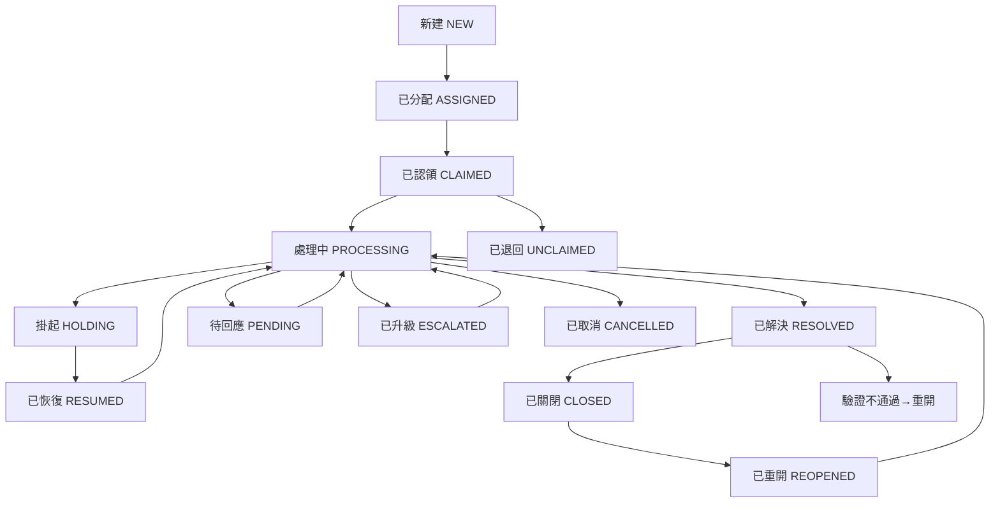

# 工单工作流

## 功能簡介

工單工作流是微語全新推出的**可視化流程設計器**，讓你無需編寫程式碼，通過拖拽節點、連線的方式，像畫流程圖一樣輕鬆設計工單的處理流程。從審批、會簽到通知、條件分支，所有環節一目了然。

同時，工作流內置了 **AI 智能助手**，你只需用自然語言描述需求（如"在審批後面加一個通知節點"），AI 即可自動幫你修改流程。

### 核心價值

- **零程式碼設計**：拖拽式操作，業務人員也能輕鬆上手
- **豐富節點類型**：覆蓋審批、會簽、或簽、條件分支、並行、通知、HTTP 調用、子流程等場景
- **AI 輔助編輯**：對話式修改流程，大幅提升效率
- **一鍵部署**：設計完成後一鍵部署到流程引擎，即時生效
- **模板開箱即用**：內置請假審批、報銷審批、IT 支援等演示流程，可直接使用或參考修改

## 預覽

### 工作流設計器界面

工單工作流設計器（TicketBuilder）包含以下主要區域：

| 區域 | 說明 |
| --- | --- |
| **頂部工具欄** | 流程選擇、創建/編輯/刪除、部署/取消部署、保存、導入/導出、AI 對話開關 |
| **左側節點面板** | 可拖拽的節點列表，包含審批、會簽、或簽、通知、條件分支等節點 |
| **中央畫布** | 可視化流程編輯區域，支援拖拽節點、連線、調整佈局 |
| **右側屬性面板** | 點擊節點後顯示屬性編輯區域，可配置節點詳細參數 |
| **右側 AI 面板** | AI 對話窗口，用自然語言修改流程 |
| **小地圖** | 畫布縮略圖，快速定位和導航 |

## 節點類型

工單工作流提供以下節點類型，覆蓋各類業務場景：

### 流程控制節點

| 節點 | 說明 | 典型場景 |
| --- | --- | --- |
| **開始** | 流程起點，每個流程有且僅有一個 | 工單創建後自動觸發 |
| **結束** | 流程終點，標記流程完成 | 工單關閉、取消時到達 |
| **條件分支** | 根據條件判斷走向不同分支 | 根據金額、類型等條件自動分流 |
| **並行分支** | 同時觸發多個下游分支 | 審批的同時發送通知 |
| **合併** | 等待所有上游分支完成後再繼續 | 多個並行審批都完成後匯總 |

### 審批節點

| 節點 | 說明 | 典型場景 |
| --- | --- | --- |
| **審批** | 單人審批，指定審批人進行審批 | 直屬上級審批請假申請 |
| **會簽** | 多人審批，支援"全部同意""按比例通過""按人數通過"三種模式 | 重要合約需多人共同審批 |
| **或簽** | 多人審批，任一人同意即通過 | 部門內任一主管審批即可 |

### 集成與通知節點

| 節點 | 說明 | 典型場景 |
| --- | --- | --- |
| **通知** | 發送消息、郵件或簡訊通知相關人員 | 審批通過後通知申請人 |
| **HTTP 請求** | 調用外部系統接口 | 同步數據到第三方業務系統 |
| **子流程** | 引用並執行另一個已發布的流程 | 主流程中嵌入標準審批子流程 |

## 適用場景

- **IT 維運**：故障申報 → 分配技術員 → 處理 → 驗證 → 關閉
- **行政審批**：請假申請 → 部門審批 → 人事備案 → 通知
- **客戶服務**：投訴受理 → 分級處理 → 升級 → 回訪 → 關閉
- **採購流程**：申請 → 部門審批 → 財務會簽 → 採購執行
- **跨部門協作**：需求提交 → 並行分發多個部門 → 匯總 → 確認

## 快速上手

### 1. 打開工單工作流設計器

在管理後台左側選單中，進入「工單管理」→「工單工作流」，即可打開可視化流程設計器。

### 2. 創建新流程

1. 點擊頂部工具欄的「新建流程」按鈕
2. 在彈出的對話框中填寫流程名稱和描述
3. 點擊確認，系統將自動創建一個包含"開始"和"結束"節點的空白流程

### 3. 設計流程

1. **添加節點**：從左側節點面板拖拽需要的節點到畫布上
2. **連接節點**：從節點底部連接點拖拽到下一個節點的頂部連接點
3. **配置屬性**：點擊節點，在右側屬性面板中填寫節點參數（如審批人、通知內容等）
4. **調整佈局**：使用畫布右上角的工具欄進行縮放、自適應視圖等操作

### 4. 保存與部署

1. **保存**：點擊頂部「保存」按鈕，將當前設計保存到伺服器
2. **部署**：確認流程無誤後，點擊「部署」按鈕，流程將發布到流程引擎並即時生效
3. **取消部署**：如需下線，點擊「取消部署」即可

### 5. 關聯到工單設定

流程部署後，在「工單設定」中將流程模板關聯到對應的工單類型或工作組，新創建的工單將自動按此流程執行。

## AI 智能助手

工單工作流內置 AI 對話助手，讓你用自然語言快速修改流程。

### 使用方式

1. 點擊頂部工具欄的「AI 助手」按鈕，打開右側 AI 對話面板
2. 在輸入框中用自然語言描述你的修改需求
3. AI 將自動分析你的需求並修改畫布上的流程
4. 點擊消息旁的「應用更改」按鈕確認修改

### 示例指令

| 指令示例 | 效果 |
| --- | --- |
| "在審批節點後面添加一個通知節點" | AI 自動在審批節點後方插入通知節點並連線 |
| "把審批人改成張三" | AI 自動修改審批節點的審批人屬性 |
| "在條件分支後再加一個會簽節點" | AI 自動添加會簽節點並連接 |
| "刪除第二個通知節點" | AI 自動移除指定節點及相關連線 |

### 注意事項

- AI 修改後請仔細檢查流程是否正確
- 修改後需要手動保存才能持久化
- AI 助手需要組織已配置 AI 服務（如 DeepSeek、ZhipuAI 等）

## 流程管理

### 流程狀態

| 狀態 | 說明 |
| --- | --- |
| **草稿** | 新創建或未部署的流程，可自由編輯 |
| **已部署** | 已發布到流程引擎，正在運行中 |

### 流程操作

| 操作 | 說明 |
| --- | --- |
| **新建** | 創建一個新的空白流程 |
| **編輯** | 修改流程名稱和描述 |
| **刪除** | 刪除流程（已部署的流程需先取消部署） |
| **保存** | 將當前畫布內容保存到伺服器 |
| **部署** | 將流程發布到流程引擎，即時生效 |
| **取消部署** | 下線已部署的流程，恢復為草稿狀態 |
| **重置** | 將系統默認流程恢復為初始模板內容 |
| **導入/導出** | 支援 JSON 格式的流程導入導出，便於備份和遷移 |

### 演示流程模板

系統內置了三套演示流程模板，首次使用時自動初始化，可直接使用或參考修改：

| 模板名稱 | 說明 |
| --- | --- |
| **請假審批** | 員工請假 → 部門主管審批 → 通知結果 |
| **報銷審批** | 填寫報銷 → 部門審批 → 財務會簽 → 打款通知 |
| **IT 支援** | 提交問題 → IT 分配處理 → 用戶驗證 → 關閉 |

## 工單生命週期與工作流的關係

工單工作流與工單狀態緊密關聯，流程節點流轉會自動驅動工單狀態的變更：

## 常見問題

### 流程設計後沒有生效？

請確認已完成以下步驟：

1. 點擊「保存」保存流程設計
2. 點擊「部署」將流程發布到流程引擎
3. 在「工單設定」中將流程模板關聯到對應的工單類型

### 可以修改已部署的流程嗎？

已部署的流程處於"唯讀"保護狀態，需要先在頂部切換為編輯模式。但請注意，修改已部署的流程不會影響正在運行中的工單實例。

### 如何備份我的流程設計？

點擊頂部「導出」按鈕，可將當前流程導出為 JSON 檔案保存到本地。需要恢復時，點擊「導入」按鈕上傳 JSON 檔案即可。

### AI 助手無法使用？

請確認：

1. 組織已配置 AI 大模型服務（管理後台 → AI 設定）
2. AI 服務處於啟用狀態
3. 網路連接正常

### 系統流程和自定義流程有什麼區別？

- **系統流程**：組織初始化時自動創建的默認流程（如內部工單流程、外部工單流程），支援"重置"恢復默認
- **自定義流程**：用戶手動創建的流程，可自由編輯和刪除
