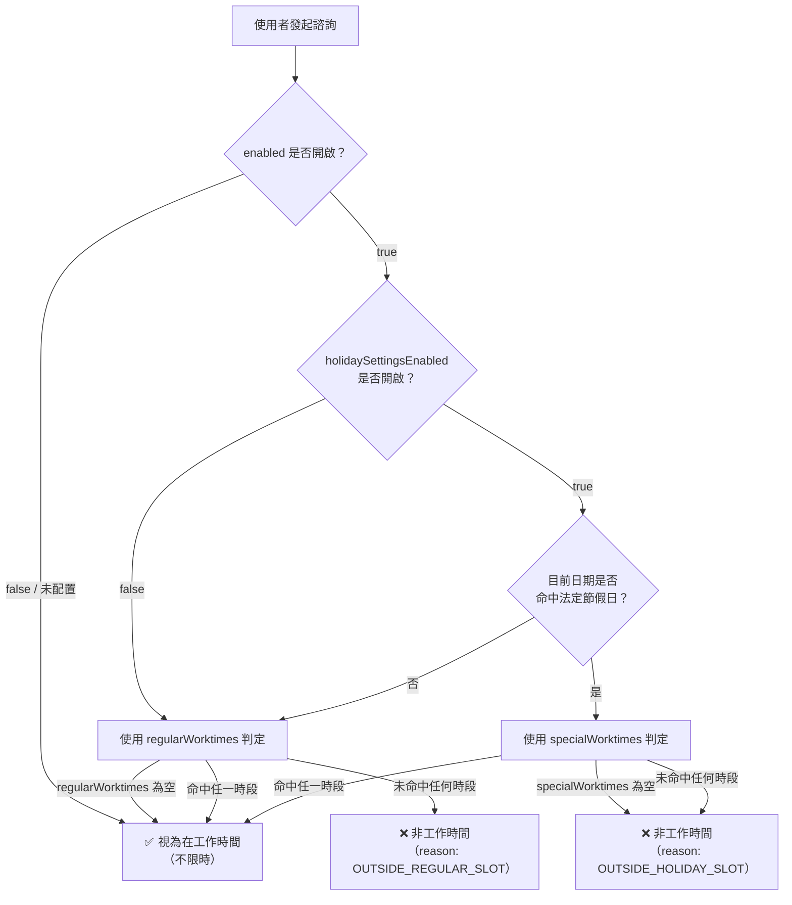
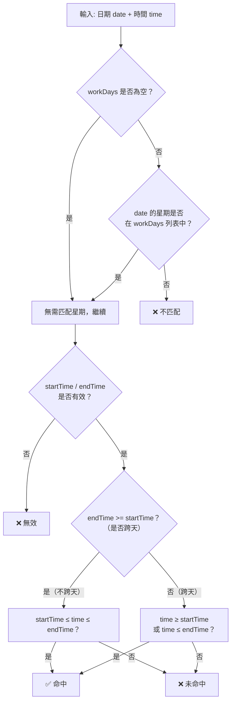

# 工作時間段設定

微語支援為客服（Agent）和工作組（Workgroup）配置工作時間段，系統根據配置判斷當前是否在服務時間內，進而觸發留言、機器人接管等策略。

## 資料模型

### WorktimeSlotValue — 時間段

單個工作時間窗口的值物件，以 JSON 形式持久化到 `WorktimeSettingEntity` 的 text 列中。

| 欄位 | 類型 | 說明 | 範例 |
| --- | --- | --- | --- |
| `startTime` | `String` | 開始時間（HH:mm） | `"09:00"` |
| `endTime` | `String` | 結束時間（HH:mm） | `"18:00"` |
| `workDays` | `String` | 適用星期，逗號分隔（1=週一，7=週日） | `"1,2,3,4,5"` |

**跨天時段**：當 `endTime < startTime` 時自動識別為跨天（如 `"22:00"`–`"06:00"` 表示夜間時段）。

### WorktimeSettingEntity — 工作時間配置

| 欄位 | 類型 | 預設值 | 說明 |
| --- | --- | --- | --- |
| `enabled` | `Boolean` | `true` | 總開關，關閉則始終視為工作時間 |
| `regularWorktimes` | `List<WorktimeSlotValue>` | `[{09:00-18:00, 週一至週五}]` | 常規工作日時間段 |
| `specialWorktimes` | `List<WorktimeSlotValue>` | `[]` | 節假日特殊時間段 |
| `holidaySettingsEnabled` | `Boolean` | `false` | 是否啟用節假日判定 |
| `nonWorktimeTip` | `String` | `"目前非工作時間，請留言"` | 非工作時間提示語 |

## regularWorktimes vs specialWorktimes

兩個欄位分開儲存，核心原因是**空值語意不同**：

| 欄位 | 觸發條件 | 為空含義 |
| --- | --- | --- |
| `regularWorktimes` | 非法定節假日 | **不限制**（全天 24h 視為工作時間） |
| `specialWorktimes` | 命中法定節假日 | **不開放**（節假日預設休息） |

### 判定流程



### 單時段判定邏輯（WorktimeSlotValue.isActive）



## 配置入口

工作時間設定在以下管理後台頁面中配置：

- **客服配置**：`/service/agent/settings` → 選擇模板 → **工作時間** Tab


- **工作組配置**：`/service/workgroup/settings` → 選擇模板 → **工作時間** Tab


- 節假日設定


### UI 功能

| 功能 | 說明 |
| --- | --- |
| 啟用工作時間限制 | 總開關，關閉後全天視為工作 |
| 啟用節假日時間段 | 獨立開關，開啟後命中節假日使用 `specialWorktimes` |
| 常規時間段 | 時間段列表，為空 = 不限制 |
| 節假日時間段 | 僅在節假日開關開啟時顯示，為空 = 節假日不開放 |
| 開始/結束時間 | 24 小時制 TimePicker，預設 `09:00`–`18:00` |
| 工作日 | 多選下拉（1-7），預設週一至週五 |
| 非工作時間提示 | 自訂提示語，支援 agent/workgroup 不同佔位符 |
| 管理節假日 | 跳轉至 `/service/holiday` 管理節假日日曆 |

## API

### WorktimeService — 統一判定入口

```java
// 判斷當前是否在服務時間
boolean inService = worktimeService.isInServiceTime(settings);

// 判斷指定時刻
boolean inService = worktimeService.isInServiceTime(settings, zonedDateTime);

// 獲取帶原因的完整評估結果
WorktimeEvaluation eval = worktimeService.evaluate(settings, zonedDateTime);
// eval.inServiceTime()   → boolean
// eval.reason()          → OUTSIDE_REGULAR_SLOT / OUTSIDE_HOLIDAY_SLOT
// eval.nonWorktimeTip()  → 提示語
```

### 評估結果

| 狀態 | `inServiceTime` | `reason` | 說明 |
| --- | --- | --- | --- |
| 配置為 null | `true` | — | 未配置，等同不限時 |
| enabled=false | `true` | — | 關閉工作時間限制 |
| 常規時段命中 | `true` | — | 在 regularWorktimes 內 |
| 節假日時段命中 | `true` | — | 在 specialWorktimes 內 |
| 常規時段未命中 | `false` | `OUTSIDE_REGULAR_SLOT` | 非法定節假日但不在時段內 |
| 節假日時段未命中 | `false` | `OUTSIDE_HOLIDAY_SLOT` | 法定節假日但不在時段內 |

## 整合方式

Agent 和 Workgroup 的 `SettingsEntity` 透過 `@ManyToOne` 關聯 `WorktimeSettingEntity`，支援發布/草稿雙態：

```java
// AgentSettingsEntity
@ManyToOne(...)
private WorktimeSettingEntity worktimeSettings;      // 已發布
@ManyToOne(...)
private WorktimeSettingEntity draftWorktimeSettings;  // 編輯中
```

呼叫方只需注入 `WorktimeService` 並傳入對應的 settings 即可獲得統一判定結果，各渠道根據結果自行決定後續策略（轉機器人、留言、排隊等）。

## 節假日判定

節假日由 `HolidayService` 統一管理，目前預設：

- **國家/地區**：CN（中國）
- **範圍**：`ORG_ONLY`（組織級）
- **時區**：`Asia/Shanghai`

節假日資料透過 `/service/holiday` 管理後台維護，支援匯入中國法定節假日。

## 設計理由

- **空值語意不同**：`regularWorktimes` 為空 = 全天工作（寬鬆），`specialWorktimes` 為空 = 全天休息（嚴格）。若合併為一個欄位，無法區分「管理後台未配置」和「配置為空列表」
- **編輯解耦**：修改常規排班（如調整午休時段）不影響節假日安排，反之亦然
- **獨立開關**：`holidaySettingsEnabled` 控制是否啟用節假日判定，未啟用時始終使用常規時段，保持向後相容
