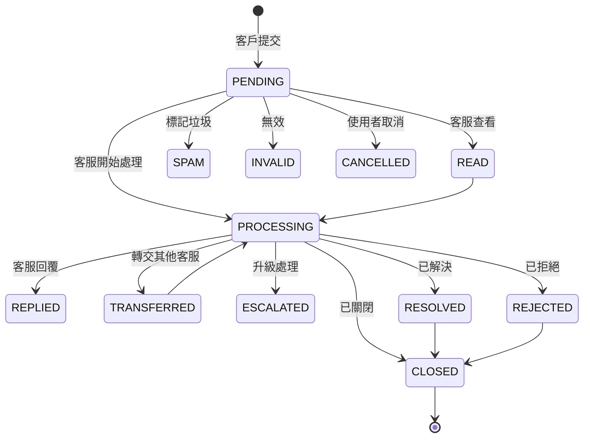

## 概述

**客戶之聲（VOC，Voice of Customer）** 模組是一套完整的回饋管理系統，用於蒐集、分類、處理和分析客戶回饋，協助企業了解真實客戶需求，透過閉環的回饋流程持續改善產品與服務。

VOC 不是簡單的「留言板」。它圍繞可設定的**回饋範本（FeedbackSettings）** 構建，支援多種業界通用的調研類型——包括 CSAT（客戶滿意度）、NPS（淨推薦值）、客訴、建議和通用問卷等——並根據不同類型自動適配蒐集元件、評分尺度和原因選項。

## 核心概念

| 概念 | 說明 |
| ------ | ----------- |
| **回饋（Feedback）** | 客戶透過元件或管理後台提交的一筆回饋紀錄，儲存於 `bytedesk_voc_feedback` 表。 |
| **回饋設定/範本（FeedbackSettings）** | 可重複使用的設定，定義回饋類型、評分尺度、問卷文案和原因選項，儲存於 `bytedesk_voc_feedback_settings` 表。 |
| **VOC 連結** | 可分享的 URL，開啟後會直接載入指定範本的公開回饋元件，客戶無需登入即可提交回饋。 |

## 回饋類型

每個回饋範本綁定一個 `FeedbackTypeEnum` 類型，決定預設評分尺度和元件佈局：

| 類型 | 說明 | 常用評分尺度 |
| ---- | ----------- | ------------- |
| **CSAT** | 客戶滿意度調查——對一次具體服務或產品體驗的回顧性評價。 | 1–5（星級） |
| **NPS** | 淨推薦值調查——衡量客戶推薦意願，將客戶劃分為推薦者 / 中立者 / 貶損者。 | 0–10 |
| **FEEDBACK** | 意見回饋 / 通用回饋。 | 可設定 |
| **REPORT** | 檢舉。 | 可設定 |
| **COMPLAINT** | 客訴。 | 可設定 |
| **SURVEY** | 調查問卷。 | 可設定 |
| **PRAISE** | 表揚。 | 可設定 |
| **SUGGESTION** | 建議。 | 可設定 |

### CSAT 與 NPS 的差異

- **CSAT** 是*回顧性*評價，衡量客戶對近期一次服務或產品體驗的滿意度，通常透過具體問題評分。常見劃分：1–3 分為不滿意，4–5 分為滿意。
- **NPS** 是*前瞻性*預測，衡量客戶向他人推薦公司/產品/服務的意願，透過單項選擇題（0–10 分）劃分三類客戶：
  - **推薦者（9–10 分）**：最可能推薦你產品的人，基本對產品滿意，是忠實客戶。
  - **中立者（7–8 分）**：處於搖擺立場，喜歡你的產品但不足以讓他們冒著影響聲譽的風險去推薦。
  - **貶損者（0–6 分）**：對你的產品低滿意度或完全不滿意，大多表現為不推薦，甚至鼓勵他人不購買。

## 回饋生命週期

每筆回饋都會經歷 `FeedbackStatusEnum` 定義的狀態流轉：

## 主要功能

### 1. 多渠道回饋蒐集

支援從以下管道蒐集回饋：

- **公開 VOC 元件**（`visitorVoc`）——客戶透過 VOC 連結無需登入即可提交。
- **管理後台**——客服代客戶建立回饋。
- **會話關聯回饋**——將回饋綁定到 `threadUid`（會話）、`messageUid`（訊息）或 `ticketUid`（工單），保留完整上下文。

### 2. 可設定的回饋範本

`FeedbackSettings` 範本控制回饋體驗的每個環節：

- **類型**：CSAT / NPS / FEEDBACK / SURVEY / ...
- **評分尺度**：可設定的 `scoreMax`（如星級用 5 分，NPS 用 10 分）。
- **正面閾值**：`positiveScoreMin`（如 9）——達到或超過此分數視為「正面」。
- **最大可選原因數**：`maxReasons`（預設 3）。
- **文案**：標題、正面問題、負面問題、評論框佔位提示。
- **原因選項**：正面原因和負面原因分開維護，根據評分條件展示。
- **啟用開關**：隨時啟用或停用範本。

### 3. 類型感知的評分元件

訪客端元件會根據回饋類型自動適配佈局：

- **CSAT / 星級類型**：渲染星級評分。
- **NPS**：渲染 0–10 分刻度，並用推薦者 / 中立者 / 貶損者顏色區分。
- **SURVEY / FEEDBACK**：渲染以評論為主的簡潔佈局。

根據評分，元件會展示對應的正面或負面原因選項，隨後是自由文字評論框。

### 4. 分類與關聯

- **分類**：透過 `categoryUids` 為回饋打上分類標籤，便於篩選和路由。
- **標籤**：自由格式的 `tagList`，用於搜尋。
- **優先級**：低 / 中 / 高。
- **關聯**：將回饋關聯到會話、具體訊息或工單，取得完整上下文。

### 5. 處理與協作

- **回覆**：客服可用文字、圖片和附件回覆。
- **轉交**：移交給其他客服。
- **升級**：提升到更高層級處理。
- **已讀 / 已回覆 / 已解決時間戳**：每次狀態變更都記錄操作人和時間戳，形成完整稽核軌跡。

### 6. 資料匯出

管理後台回饋清單支援三種 Excel 匯出模式：

- **當前頁**
- **全部**（每批最多 1000 筆）
- **分段匯出**——對大資料集自動拆分為 1000 筆一批。

匯出表頭和檔案名稱均已國際化。

### 7. VOC 連結分享

每個範本可產生可分享的 VOC 連結，可透過以下管道分發：

- 電子郵件簽名
- 微信公眾號選單
- 應用內彈窗
- 服務結束後的滿意度提示

客戶開啟連結即可直接提交回饋——無需註冊帳號。

## 管理後台

### 回饋清單

位於 **儀表板 → VOC → 意見回饋**，提供：

- 依標題和內容全文搜尋。
- 依分類和組織篩選。
- 依建立時間 / 更新時間排序。
- 列操作：**查看**、**編輯**、**刪除**。
- 批次匯出。

### 回饋設定（範本）

位於 **儀表板 → VOC → 評價設定**，採用分欄介面：

- **左側欄**：範本清單，支援搜尋和新建。
- **右側欄**：分頁簽編輯器，包含四個頁簽：
  - **基礎**：名稱、類型、啟用狀態、評分尺度、正面閾值、最大原因數。
  - **文案**：標題、正面 / 負面問題、評論框佔位提示。
  - **原因**：正面原因和負面原因選項清單。
  - **連結**：產生並預覽公開 VOC 連結。

編輯器會追蹤未儲存的修改，在切換範本、切換啟用狀態或重新載入前彈出確認提示。

## 訪客回饋元件

公開元件（`visitorVoc`）是面向終端客戶的獨立頁面：

1. 客戶開啟 VOC 連結（如 `https://your-domain/voc?org=組織UID&sid=範本UID`）。
2. 元件載入綁定的範本設定。
3. 評分介面根據範本類型自動適配（CSAT 星級 / NPS 刻度 / 問卷）。
4. 根據評分展示對應的正面或負面原因選項。
5. 客戶填寫可選評論後提交。
6. 回饋入庫並出現在管理後台回饋清單中等待處理。

## 使用場景

- **服務後滿意度**：會話或工單關閉後自動彈出 CSAT 評價。
- **NPS 基準追蹤**：定期開展 NPS 調研，追蹤忠誠度趨勢。
- **客訴管理**：蒐集正式客訴並路由到對應團隊。
- **產品改善**：蒐集使用者的功能建議和問題回饋。
- **服務品質監控**：即時捕捉服務品質問題。
- **閉環跟進**：確保每筆回饋都得到回覆和解決。

## 存取方式

- **管理後台**：登入管理後台，導覽到 **VOC** 選單。
- **訪客元件**：開啟從回饋範本產生的 VOC 連結。
- **REST API**：回饋和回饋設定端點位於 `/api/v1/feedback` 和 `/api/v1/feedback/settings`（詳見 `/swagger-ui.html` 的 Swagger 文件）。
