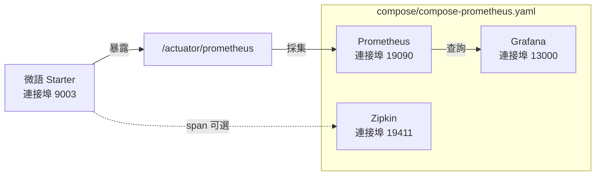

# 微語 AI 可觀測性

微語整合 [Spring AI 2.0 Observability](https://docs.spring.io/spring-ai/reference/observability/index.html) 與 [Spring Boot Actuator](https://docs.spring.io/spring-boot/reference/actuator/metrics.html)，為 AI 全鏈路（ChatClient、ChatModel、EmbeddingModel、VectorStore、Tool Calling）提供指標採集與分散式追蹤。

[Spring Boot Metrics](https://docs.spring.io/spring-boot/reference/actuator/metrics.html) · [Spring Boot Tracing](https://docs.spring.io/spring-boot/reference/actuator/tracing.html) · [OpenTelemetry Gen AI 語意約定](https://opentelemetry.io/docs/specs/semconv/gen-ai/)

## 概覽

| 能力 | 元件 | 說明 |
| --- | --- | --- |
| 指標匯出 | Spring Boot Actuator + Micrometer | `/actuator/prometheus` 暴露 `gen_ai_*`、`db_vector_*`、`bytedesk.ai.*` 時間序列 |
| 指標採集 | Prometheus | 每 15s 拉取一次；設定位於 `deploy/docker/prometheus.yml` |
| 指標視覺化 | Grafana | 透過 `deploy/docker/grafana/provisioning/` 預置 AI 儀表板 |
| 分散式追蹤 | Zipkin（可選） | 捕獲 ChatClient / ChatModel / Tool 呼叫 span；預設停用 |
| 健康檢查 | Spring Boot Health | `/actuator/health` 透過 `AiHealthIndicator` 回報 AI 元件狀態 |

## 架構



## 已接入觀測的元件

Spring AI 2.0 內建了六大核心元件的觀測，微語已將全部接入統一 `ObservationRegistry`：

| 元件 | Observation 名稱 | 關鍵指標 | 狀態 |
| --- | --- | --- | --- |
| ChatClient | `gen_ai.chat.client.operation`（微語自定義約定） | `gen_ai_chat_client_operation_seconds` | ✅ 全部 15+ provider ChatClient 已接入 |
| ChatModel | `gen_ai.client.operation` | `gen_ai_client_operation_seconds` + `gen_ai_client_token_usage_total` | ✅ 框架內建 + Moonshot + DeepSeek + ZhipuAI + DashScope |
| EmbeddingModel | `gen_ai.client.operation` | `gen_ai_client_operation_seconds` | ✅ DashScope 自訂模型已接入 |
| VectorStore | `db.vector.client.operation` | `db_vector_client_operation_seconds` | ✅ 自動觀測 |
| Tool Calling | `spring.ai.tool` | （內嵌於 ChatModel span） | ✅ 自動觀測 |
| ChatClient Advisor | `spring.ai.advisor` | （內嵌於 ChatClient span） | ✅ 自動觀測 |

## 快速開始

### 1. 啟動觀測棧

`start.sh` / `stop.sh` 的最後一個參數可選 `obs`（或 `observability` / `true` / `yes`），用於一鍵啟停 `compose/compose-prometheus.yaml`：

```bash
cd deploy/docker

# 方式 A（推薦）：在啟動中介軟體/應用棧時附帶觀測棧
./start mysql artemis middleware obs
./start mysql artemis all obs   # 線上全量 + 觀測棧
./stop mysql artemis stop middleware obs
./stop mysql artemis down middleware obs

# 方式 B：僅觀測棧（需先確保 bytedesk-network 存在）
docker compose --env-file .env -f compose/compose-prometheus.yaml up -d
```

### 2. 驗證指標已流通

```bash
# 应用指标端点
curl http://localhost:9003/actuator/prometheus | grep gen_ai

# 預期輸出包含：
# gen_ai_chat_client_operation_seconds_count{...}
# gen_ai_client_operation_seconds_count{...}
# gen_ai_client_token_usage_total{...}
# db_vector_client_operation_seconds_count{...}
```

### 3. 開啟 Grafana

存取 `http://localhost:13000`，使用 `admin` / `admin` 登入（可透過 `.env` 中 `GRAFANA_ADMIN_USER` / `GRAFANA_ADMIN_PASSWORD` 覆寫）。**Bytedesk AI Observability** 儀表板會自動出現在 *Bytedesk AI* 資料夾下。

## 指標參考

### ChatClient 指標

| 指標 | 類型 | 說明 |
| --- | --- | --- |
| `gen_ai_chat_client_operation_seconds_count` | Counter | 已完成的 ChatClient 操作數 |
| `gen_ai_chat_client_operation_seconds_sum` | Timer（總和） | ChatClient 操作總耗時 |
| `gen_ai_chat_client_operation_seconds_max` | Gauge | 最大觀測耗時 |
| `gen_ai_chat_client_operation_seconds_bucket` | Histogram | 分佈桶（支援 P95/P99） |
| `gen_ai_chat_client_operation_active_count` | Gauge | 進行中的 ChatClient 呼叫數 |

### ChatModel 指標（按 provider 執行）

| 指標 | 類型 | 標籤 | 說明 |
| --- | --- | --- | --- |
| `gen_ai_client_operation_seconds` | Timer | `gen_ai_system`、`gen_ai_request_model` | 模型 provider 執行耗時 |
| `gen_ai_client_token_usage_total` | Counter | `gen_ai_token_type`（input/output/total） | Token 用量 |

### VectorStore 指標

| 指標 | 類型 | 標籤 | 說明 |
| --- | --- | --- | --- |
| `db_vector_client_operation_seconds` | Timer | `db_operation_name`（add/delete/query） | 向量儲存操作延遲 |

### 微語自訂業務指標

| 指標 | 類型 | 說明 |
| --- | --- | --- |
| `bytedesk_ai_requests_total` | Counter | AI 請求總數（業務級） |
| `bytedesk_ai_errors_total` | Counter | AI 錯誤數 |
| `bytedesk_ai_response_time_seconds` | Timer | AI 回應時間 |

> **注意**：`bytedesk.ai.*` 指標透過 `modules/core` 中的 `BytedeskMetrics` 註冊；框架級 `gen_ai_*` / `db_vector_*` 指標來自 Spring AI。Grafana 儀表板會清晰區分這兩層。

## PromQL 範例

```promql
# AI QPS
sum(rate(gen_ai_chat_client_operation_seconds_count[1m]))

# P95 延遲（需啟用 histogram）
histogram_quantile(0.95, sum by (le) (rate(gen_ai_chat_client_operation_seconds_bucket[5m])))

# 平均延遲（未啟用 histogram 時的回退方案）
rate(gen_ai_chat_client_operation_seconds_sum[5m]) / rate(gen_ai_chat_client_operation_seconds_count[5m])

# 按類型的 Token 用量速率
sum by (gen_ai_token_type) (rate(gen_ai_client_token_usage_total[5m]))

# Provider 分佈
sum by (gen_ai_system) (rate(gen_ai_client_operation_seconds_count[5m]))

# 錯誤率
rate(bytedesk_ai_errors_total[5m]) / clamp_min(rate(bytedesk_ai_requests_total[5m]), 1)

# VectorStore 查詢延遲
rate(db_vector_client_operation_seconds_sum[1m])
```

## 設定

### Spring AI 觀測屬性

以下屬性控制是否將敏感內容（prompt、completion、tool 參數）匯出到 trace。**全部預設 `false`**，僅在排查問題時開啟。

| 屬性 | 預設值 | 說明 |
| --- | --- | --- |
| `spring.ai.chat.client.observations.log-prompt` | `false` | 記錄 ChatClient prompt 內容 |
| `spring.ai.chat.observations.log-prompt` | `false` | 記錄 ChatModel prompt 內容 |
| `spring.ai.chat.observations.log-completion` | `false` | 記錄 ChatModel completion 內容 |
| `spring.ai.chat.observations.include-error-logging` | `false` | 在 observation 中包含錯誤詳情 |
| `spring.ai.tools.observations.include-content` | `false` | 匯出 tool 呼叫的 arguments 和 result |
| `spring.ai.vectorstore.observations.log-query-response` | `false` | 記錄向量搜尋的 query 和 response |

### Histogram 桶

要在 Grafana 中使用 `histogram_quantile()`，AI 相關的 Timer 必須發佈 histogram 桶。`local` profile 預設已設定：

```properties
management.metrics.distribution.percentiles-histogram.gen_ai.chat.client.operation=true
management.metrics.distribution.percentiles-histogram.gen_ai.client.operation=true
management.metrics.distribution.percentiles-histogram.db.vector.client.operation=true
management.metrics.distribution.slo.gen_ai.chat.client.operation=50ms,200ms,1s,5s,30s
```

若未啟用桶，請使用平均延遲 PromQL 回退方案代替 `histogram_quantile()`。

## 分散式追蹤（Zipkin）

追蹤**預設停用**以避免噪音。開啟方式：

```bash
# 1. 透過 compose/compose-prometheus.yaml 啟動 Zipkin
docker compose --env-file .env -f compose/compose-prometheus.yaml -f compose/compose-grafana.yaml -f compose/compose-zipkin.yaml up -d bytedesk-zipkin

# 2. 啟動應用時透過環境變數開啟追蹤
export MANAGEMENT_TRACING_ENABLED=true
export MANAGEMENT_ZIPKIN_TRACING_ENABLED=true
export MANAGEMENT_TRACING_SAMPLING_PROBABILITY=1.0
```

存取 `http://localhost:19411` 查看 Zipkin UI 中的分散式 trace。

## 告警建議

| 告警 | PromQL | 閾值 |
| --- | --- | --- |
| AI 錯誤率高 | `rate(bytedesk_ai_errors_total[5m]) / clamp_min(rate(bytedesk_ai_requests_total[5m]), 1)` | > 5% 持續 5 分鐘 |
| AI 延遲高 | `histogram_quantile(0.95, ...)` | P95 > 10s 持續 5 分鐘 |
| Token 用量突增 | `rate(gen_ai_client_token_usage_total[1h])` | > 基線 2 倍 |
| VectorStore 慢查詢 | `rate(db_vector_client_operation_seconds_sum[1m])` | > 2s 持續 5 分鐘 |

## 故障排除

### Prometheus 中無指標

1. 驗證 `/actuator/prometheus` 回傳資料：`curl http://localhost:9003/actuator/prometheus`
2. 確認 profile 中 `management.endpoints.web.exposure.include=*`
3. 檢查 `ObservationConfig` 是否未建立獨立 `ObservationRegistry`（階段 7A 已統一）
4. 確保 Prometheus 能透過 Docker 網路存取應用

### Grafana 儀表板顯示"No data"

1. 確認 Prometheus 資料來源已設定（透過 `grafana/provisioning/datasources/` 自動預置）
2. 檢查時間範圍是否覆蓋了有 AI 呼叫的時段
3. 若使用 P95 面板，確認 histogram 桶存在：`gen_ai_chat_client_operation_seconds_bucket` 應出現在 Prometheus 中

### Zipkin 無 trace

1. 確認 `MANAGEMENT_TRACING_ENABLED=true` 已設定
2. 確認取樣機率 > 0（預設 0.0 = 不取樣）
3. 確保應用能透過 Docker 網路存取 `bytedesk-zipkin:9411`

## 參考資料

- [Spring AI Observability](https://docs.spring.io/spring-ai/reference/observability/index.html)
- [Spring Boot Actuator Metrics](https://docs.spring.io/spring-boot/reference/actuator/metrics.html)
- [Spring Boot Actuator Tracing](https://docs.spring.io/spring-boot/reference/actuator/tracing.html)
- [OpenTelemetry Gen AI 語意約定](https://opentelemetry.io/docs/specs/semconv/gen-ai/)
- [Micrometer Observation API](https://docs.micrometer.io/micrometer/reference/observation.html)
