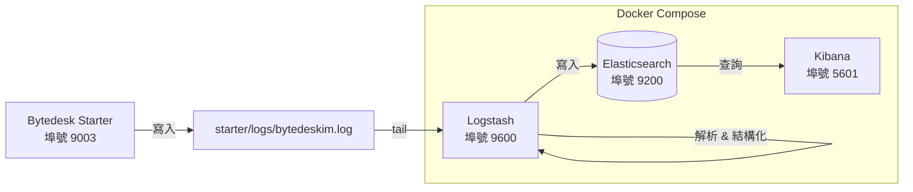

# 微語日誌監控

微語（Bytedesk）基於 **ELK Stack**（Elasticsearch + Logstash + Kibana）建構了統一的日誌採集、解析、儲存與視覺化平台，面向開發與維運人員提供集中式日誌檢索、鏈路追蹤和維運排障能力。

[Logstash](https://www.elastic.co/guide/en/logstash/8.18/docker.html) · [Kibana](https://www.elastic.co/guide/en/kibana/8.18/docker.html) · [Elasticsearch](https://www.elastic.co/guide/en/elasticsearch/8.18/docker.html)

## 概述

日誌監控體系涵蓋以下能力：

| 能力 | 元件 | 說明 |
| --- | --- | --- |
| 日誌輸出 | Spring Boot (Logback) | 應用按 `[RID:xxx TRACEID:xxx]` 格式寫入 `starter/logs/bytedeskim.log` |
| 日誌採集 | Logstash | File input 即時 tail 日誌檔案，grok 解析結構化欄位，去除 ANSI 色彩碼 |
| 日誌儲存 | Elasticsearch | 按天建立索引 `bytedesk-logs-YYYY.MM.dd`，支援 IK 中文分詞 |
| 日誌視覺化 | Kibana | Discover 檢索、Dashboard 面板、按 level / logger / service 過濾 |

## 架構



**資料流向**：

1. 應用透過 Logback 將日誌寫入 `starter/logs/bytedeskim.log`，格式包含 `[RID:xxx TRACEID:xxx]` 鏈路追蹤標記
2. Logstash 透過 `file input` 即時 tail 日誌檔案，使用 `multiline` codec 合併多行異常堆疊
3. `grok` 過濾器將日誌解析為結構化欄位（level、logger、thread、requestId、traceId 等）
4. 解析後的結構化日誌寫入 Elasticsearch 按天索引
5. 維運/開發人員在 Kibana 中進行檢索、過濾、視覺化分析

## 日誌格式

### 輸出格式

應用日誌遵循統一的 Pattern（設定於 `starter/src/main/resources/properties/noai/40-oauth-ldap-logging.properties`）：

```bash
[RID:%X{requestId} TRACEID:%X{traceId}]-yyyy-MM-dd HH:mm:ss.SSS-LEVEL PID --- [thread] logger : message
```

範例日誌行：

```bash
[RID:req_abc123 TRACEID:trace_xyz789]-2026-07-25 10:30:45.123- INFO 12345 --- [nio-9003-exec-1] c.b.s.service.ThreadService : thread created successfully
```

### 關鍵欄位

| 欄位 | MDC Key | 說明 |
| --- | --- | --- |
| `requestId` | `%X{requestId}` | 請求級追蹤 ID，一次 HTTP 請求內保持一致 |
| `traceId` | `%X{traceId}` | 分散式鏈路追蹤 ID，跨服務傳遞 |
| `level` | 日誌級別 | TRACE / DEBUG / INFO / WARN / ERROR |
| `logger` | Logger 名稱 | 輸出日誌的類別名稱（截取 40 字元） |
| `thread` | 執行緒名稱 | 如 `nio-9003-exec-1`、`scheduling-1` |

## Logstash Pipeline 詳解

Pipeline 設定檔位於 `deploy/docker/logstash/pipeline/logstash.conf`，分為三個階段：

### Input — 日誌採集

```ruby
input {
  file {
    path => ["/var/log/bytedesk/bytedeskim.log*", "/var/log/bytedesk-source/bytedeskim.log*"]
    start_position => "beginning"
    mode => "tail"
    codec => multiline {
      pattern => "^-*\[RID:"
      negate => true
      what => "previous"
    }
  }
}
```

- **路徑**：透過 volume 掛載，Logstash 可同時讀取 `/var/log/bytedesk/`（Docker 內共享卷）和 `/var/log/bytedesk-source/`（宿主機 `starter/logs/` 映射）
- **multiline**：不以 `[RID:` 開頭的行（如異常堆疊）合併到前一條日誌，確保完整異常不被拆散
- **sincedb**：記錄讀取位置，容器重啟後不從檔案頭重新讀取

### Filter — 日誌解析

```ruby
filter {
  # 去除 ANSI 色彩碼
  mutate { gsub => ["message", "\u001B\[[0-9;]*[A-Za-z]", ""] }

  # Grok 正則提取結構化欄位
  grok {
    match => {
      "message" => [
        "-\[RID:%{DATA:requestId} TRACEID:%{DATA:traceId}\]-%{TIMESTAMP_ISO8601:log_timestamp}-%{SPACE}%{LOGLEVEL:level} ...",
        "\[RID:%{DATA:requestId} TRACEID:%{DATA:traceId}\] %{TIMESTAMP_ISO8601:log_timestamp} ..."
      ]
    }
    tag_on_failure => ["_bytedesk_parse_failure"]
  }

  # 時間戳覆寫為日誌中的時間（而非採集時間）
  date { match => ["log_timestamp", "yyyy-MM-dd HH:mm:ss.SSS"] }

  # 注入服務元資料
  mutate {
    add_field => {
      "service.name" => "bytedesk"
      "event.dataset" => "bytedesk.application"
    }
  }

  # 映射到 ECS 標準欄位
  mutate {
    add_field => { "[log][level]" => "%{level}" }
    add_field => { "[log][logger]" => "%{logger}" }
    add_field => { "[process][thread][name]" => "%{thread}" }
    add_field => { "[process][pid]" => "%{pid}" }
  }

  # 清理中介欄位
  mutate { remove_field => ["parsed_message", "log_timestamp", "host", "path", "level", "logger", "thread", "pid"] }
}
```

**解析要點**：

- `gsub` 先去除 Logback 彩色輸出中的 ANSI 跳脫序列，避免污染 `message` 欄位
- `grok` 提供兩種匹配模式相容不同版本日誌格式（帶/不帶前綴 `-`）
- 解析失敗的行會打上 `_bytedesk_parse_failure` 標籤，方便排查
- ECS（Elastic Common Schema）欄位映射使 Kibana 可以開箱即用地識別日誌級別、執行緒、處理程序等標準維度

### Output — 寫入 Elasticsearch

```ruby
output {
  elasticsearch {
    hosts => ["${ELASTICSEARCH_HOSTS}"]
    user => "${ELASTICSEARCH_USERNAME}"
    password => "${ELASTICSEARCH_PASSWORD}"
    index => "bytedesk-logs-%{+YYYY.MM.dd}"
    ilm_enabled => false
  }
}
```

- **按天索引**：`bytedesk-logs-2026.07.25`，便於按日期清理和管理
- **認證**：使用 Elasticsearch 內建 `elastic` 使用者 + `ELASTIC_PASSWORD` 環境變數

## 快速開始

### 前置條件

- Docker 及 Docker Compose
- 專案已複製到本地

### 1. 設定環境變數

確保 `.env` 檔案中設定了 Elasticsearch 和 Kibana 相關變數：

```bash
# Elasticsearch
ELASTIC_PASSWORD=bytedesk123

# Kibana Service Account Token（透過 elasticsearch-service-tokens 生成）
KIBANA_SERVICE_ACCOUNT_TOKEN=your_token_here
```

### 2. 啟動日誌服務

```bash
cd deploy/docker

# 只啟動 ELK 相關服務
docker compose -f compose-base.yaml up -d bytedesk-elasticsearch bytedesk-logstash bytedesk-kibana

# 查看服務狀態
docker compose -f compose-base.yaml ps
```

### 3. 驗證服務

```bash
# Elasticsearch 健康檢查
curl -u elastic:bytedesk123 http://localhost:19200/_cluster/health

# Logstash 狀態（API 埠號 9600）
curl http://localhost:19600/_node/stats

# Kibana 介面
open http://localhost:15601
```

### 4. 開啟 Kibana 並登入

瀏覽器訪問 `http://localhost:15601`，使用以下憑據登入：

| 參數 | 值 | 說明 |
| --- | --- | --- |
| 登入地址 | `http://localhost:15601` | Kibana Web 管理介面 |
| 使用者名稱 | `elastic` | Elasticsearch 內建超級使用者 |
| 密碼 | `${ELASTIC_PASSWORD}` | 與 `.env` 中 `ELASTIC_PASSWORD` 一致（預設 `bytedesk123`） |

> **提示**：首次啟動 Elasticsearch 後，若 Kibana 提示需要 enrollment token，可使用以下指令獲取：
>
> ```bash
> docker exec -it elasticsearch-bytedesk bin/elasticsearch-create-enrollment-token -s kibana
> ```
>
> 或者直接使用 `elastic` 使用者名稱 + 密碼方式登入（Skip enrollment → Use login）。

登入後，按以下步驟建立日誌資料視圖：

1. 點擊左上角選單 → **Stack Management** → **Data Views**
2. 點擊 **Create data view**
3. 索引模式填寫 `bytedesk-logs-*`，時間欄位選擇 `@timestamp`
4. 點擊 **Save data view to Kibana**

### 5. 檢索日誌

1. 點擊左上角選單 → **Discover**
2. 頂部下拉選擇 `bytedesk-logs-*` 資料視圖
3. 在搜尋欄使用 KQL 語法查詢（參考下方常用查詢）
4. 左側欄位列表可按 `log.level`、`log.logger`、`requestId` 等維度快速過濾

## Kibana 常用操作

### 日誌檢索

| 場景 | KQL 查詢 | 說明 |
| --- | --- | --- |
| 按日誌級別過濾 | `log.level: "ERROR"` | 查看所有錯誤日誌 |
| 按請求追蹤 | `requestId: "req_abc123"` | 追蹤某個請求的完整呼叫鏈 |
| 按鏈路追蹤 | `traceId: "trace_xyz789"` | 追蹤分散式呼叫鏈路 |
| 按類別名稱過濾 | `log.logger: "*ThreadService*"` | 查看特定類別的日誌 |
| 按執行緒過濾 | `process.thread.name: "*scheduling*"` | 查看排程任務日誌 |
| 模糊搜尋 | `message: "OutOfMemoryError"` 或 `message: "OOM"` | 搜尋包含特定關鍵字的日誌 |
| 組合條件 | `log.level: "ERROR" and log.logger: "*call*"` | 組合過濾 |
| 解析失敗 | `tags: "_bytedesk_parse_failure"` | 排查未被正確解析的日誌行 |

### 儀表板

可以在 Kibana **Dashboard** 中建立日誌監控面板，推薦以下視覺化：

- **日誌量趨勢**：按時間聚合 count，查看日誌吞吐量
- **ERROR 佔比**：圓餅圖展示各級別日誌比例
- **Top Logger**：按 logger 聚合，發現高頻日誌來源
- **ERROR 日誌表格**：即時展示最近 ERROR 日誌詳情

## 埠號映射

| 服務 | 容器內埠號 | 宿主機埠號 | 說明 |
| --- | --- | --- | --- |
| Elasticsearch | 9200 | 19200 | REST API |
| Elasticsearch | 9300 | 19300 | 節點間通訊 |
| Logstash | 9600 | 19600 | 監控 API |
| Kibana | 5601 | 15601 | Web 管理介面 |

## 常見問題

### 1. Kibana 無法連接 Elasticsearch

檢查 `KIBANA_SERVICE_ACCOUNT_TOKEN` 是否正確生成：

```bash
# 在 Elasticsearch 容器內生成 token
docker exec -it elasticsearch-bytedesk bin/elasticsearch-service-tokens create elastic/kibana bytedesk-kibana
```

### 2. 日誌未被採集

- 確認 Logstash 容器能讀取到日誌檔案：

  ```bash
  docker exec -it logstash-bytedesk ls -la /var/log/bytedesk-source/
  ```

- 查看 Logstash 自身日誌：

  ```bash
  docker logs logstash-bytedesk --tail 100
  ```

### 3. 日誌解析失敗（_bytedesk_parse_failure）

- 在 Kibana Discover 中過濾 `tags: "_bytedesk_parse_failure"`
- 檢查 `message` 欄位的原始格式是否與 grok 模式匹配
- 常見原因：日誌格式變更、ANSI 碼未被完全清除、堆疊資訊被異常合併

### 4. Elasticsearch 磁碟佔用過高

- 按天索引可以方便地按日期清理：

  ```bash
  # 刪除 30 天前的索引
  curl -u elastic:bytedesk123 -X DELETE "http://localhost:19200/bytedesk-logs-$(date -v-30d +%Y.%m.%d)"
  ```

- 生產環境建議設定 ILM（Index Lifecycle Management）自動管理索引生命週期

### 5. 多行異常堆疊被截斷

Logstash 的 `multiline` codec 將不以 `[RID:` 開頭的行合併到前一條。如果某些異常堆疊仍被截斷，檢查：

- `auto_flush_interval`（預設 2 秒）是否足夠覆蓋完整異常輸出
- 異常堆疊中是否有以 `[RID:` 開頭的行導致提前斷開

## 相關資源

- [Elasticsearch 官方文件](https://www.elastic.co/guide/en/elasticsearch/8.18/index.html)
- [Logstash 官方文件](https://www.elastic.co/guide/en/logstash/8.18/index.html)
- [Kibana 官方文件](https://www.elastic.co/guide/en/kibana/8.18/index.html)
- [微語系統監控](./bytedesk-monitor.md)
- [線上 Compose 映像設定 - GitHub](https://github.com/Bytedesk/bytedesk-docker-compose/blob/main/docker/compose-base.yaml)
- [線上 Compose 映像設定 - Gitee](https://gitee.com/270580156/bytedesk-docker-compose/blob/master/docker/compose-base.yaml)
