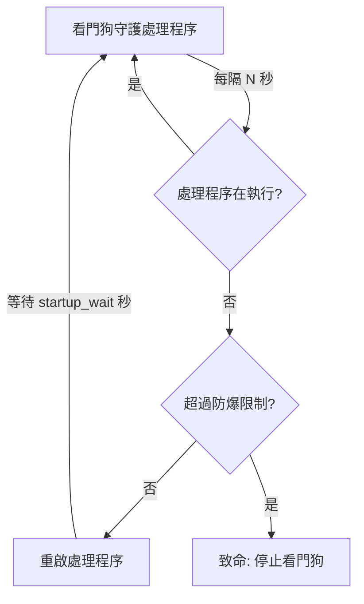

# 微語處理程序守護（看門狗）

微語為 **JAR 套件部署**和 **Docker Compose 部署**兩種模式分別提供了看門狗腳本。這些腳本持續監控微語處理程序，在處理程序異常退出時自動重啟，最大限度減少生產環境的停機時間。

## 概覽

| 部署模式 | 看門狗腳本 | 監控對象 |
| --- | --- | --- |
| JAR 套件（獨立部署） | `scripts/watchdog.sh` | `secrets/bytedesk-starter.jar` Java處理程序 |
| Docker Compose | `deploy/docker/watchdog.sh` | `bytedesk` Docker 容器 |

兩種腳本遵循相同的設計原則：

- **健康檢查**：按可設定的時間間隔檢測處理程序狀態
- **自動重啟**：檢測到處理程序/容器宕機後自動拉起
- **防爆保護**：在時間視窗內頻繁崩潰時停止自動重啟，防止無限重啟迴圈
- **結構化日誌**：記錄到看門狗日誌檔案，便於稽核
- **簡潔的生命週期命令**：`start`、`stop`、`status`、`restart`

## 架構



## JAR 部署看門狗

### 腳本位置

```text
scripts/watchdog.sh
```

### 快速開始

```bash
cd scripts

# 啟動 JAR 服務；JAR 拉起後會自動啟動看門狗
./start.sh

# 重啟 JAR 服務；同時確保看門狗自動處於執行狀態
./restart.sh

# 停止 JAR 服務；停機流程中會自動停止看門狗
./stop.sh

# 啟動看門狗（如果 JAR 未執行會先啟動 JAR）
./watchdog.sh start

# 檢視狀態
./watchdog.sh status

# 停止看門狗（不會停止 JAR 處理程序）
./watchdog.sh stop

# 重啟看門狗
./watchdog.sh restart
```

JAR 生命週期腳本（`start.sh` / `restart.sh` / `stop.sh`）執行完成即返回，完全與日誌查看解耦。使用 `logs.sh` 單獨查看日誌：

```bash
cd scripts
./logs.sh app       # 應用日誌
./logs.sh watchdog  # 看門狗日誌
./logs.sh all       # 同時查看（macOS: 兩個 Terminal 視窗；Linux: tmux）
```

實際 JAR 檔案仍位於 `secrets/bytedesk-starter.jar`，而 `scripts/` 已成為 JAR 部署與看門狗管理的唯一命令入口。

### 設定參數

透過環境變數覆蓋預設值：

| 變數 | 預設值 | 說明 |
| --- | --- | --- |
| `WATCHDOG_CHECK_INTERVAL` | `10` | 健康檢查間隔（秒） |
| `WATCHDOG_STARTUP_WAIT` | `60` | 重啟後等待時間（秒），之後再開始檢查 |
| `WATCHDOG_MAX_RESTARTS` | `5` | 防爆視窗內最大重啟次數 |
| `WATCHDOG_BURST_WINDOW` | `300` | 防爆視窗時長（秒，預設 5 分鐘） |
| `WATCHDOG_LOG_FILE` | `./logs/watchdog.log` | 看門狗日誌檔案路徑 |

自訂設定範例：

```bash
WATCHDOG_CHECK_INTERVAL=15 \
WATCHDOG_STARTUP_WAIT=120 \
WATCHDOG_MAX_RESTARTS=3 \
./watchdog.sh start
```

### 整合 systemd（Linux）

在生產環境 Linux 伺服器上，建議將看門狗作為 systemd 服務管理：

```ini
# /etc/systemd/system/bytedesk-watchdog.service
[Unit]
Description=微語 JAR 處理程序看門狗
After=network.target

[Service]
Type=forking
User=bytedesk
WorkingDirectory=/opt/bytedesk/scripts
ExecStart=/opt/bytedesk/scripts/watchdog.sh start
ExecStop=/opt/bytedesk/scripts/watchdog.sh stop
ExecReload=/opt/bytedesk/scripts/watchdog.sh restart
Restart=on-failure
RestartSec=10
Environment="WATCHDOG_CHECK_INTERVAL=10"
Environment="WATCHDOG_MAX_RESTARTS=5"

[Install]
WantedBy=multi-user.target
```

啟用並啟動：

```bash
sudo systemctl daemon-reload
sudo systemctl enable bytedesk-watchdog
sudo systemctl start bytedesk-watchdog
sudo systemctl status bytedesk-watchdog
```

### 整合 launchd（macOS）

在 macOS 上，建立 launchd plist：

```xml
<!-- ~/Library/LaunchAgents/com.bytedesk.watchdog.plist -->
<?xml version="1.0" encoding="UTF-8"?>
<!DOCTYPE plist PUBLIC "-//Apple//DTD PLIST 1.0//EN"
  "http://www.apple.com/DTDs/PropertyList-1.0.dtd">
<plist version="1.0">
<dict>
    <key>Label</key>
    <string>com.bytedesk.watchdog</string>
    <key>ProgramArguments</key>
    <array>
        <string>/bin/bash</string>
      <string>/path/to/scripts/watchdog.sh</string>
        <string>start</string>
    </array>
    <key>WorkingDirectory</key>
    <string>/path/to/scripts</string>
    <key>RunAtLoad</key>
    <true/>
    <key>KeepAlive</key>
    <true/>
    <key>StandardOutPath</key>
    <string>/path/to/scripts/logs/watchdog-launchd.log</string>
    <key>StandardErrorPath</key>
    <string>/path/to/scripts/logs/watchdog-launchd.log</string>
</dict>
</plist>
```

載入服務：

```bash
launchctl load ~/Library/LaunchAgents/com.bytedesk.watchdog.plist
```

## Docker Compose 看門狗

### Docker 腳本位置

```text
deploy/docker/watchdog.sh
```

### Docker 快速開始

```bash
cd deploy/docker

# 確保 compose 服務棧已啟動
./start mysql artemis all

# 啟動看門狗
./watchdog.sh start

# 檢視狀態
./watchdog.sh status

# 停止看門狗（不會停止容器）
./watchdog.sh stop
```

### Docker 設定參數

透過環境變數覆蓋預設值：

| 變數 | 預設值 | 說明 |
| --- | --- | --- |
| `WATCHDOG_CHECK_INTERVAL` | `10` | 健康檢查間隔（秒） |
| `WATCHDOG_STARTUP_WAIT` | `90` | 重啟後等待時間（秒），之後再開始檢查 |
| `WATCHDOG_MAX_RESTARTS` | `5` | 防爆視窗內最大重啟次數 |
| `WATCHDOG_BURST_WINDOW` | `300` | 防爆視窗時長（秒，預設 5 分鐘） |
| `WATCHDOG_LOG_FILE` | `./watchdog.log` | 看門狗日誌檔案路徑 |
| `WATCHDOG_CONTAINER_NAME` | `bytedesk` | 要監控的 Docker 容器名稱 |
| `WATCHDOG_DB` | `mysql` | 資料庫類型（傳遞給 start.sh） |
| `WATCHDOG_MQ` | `artemis` | 訊息佇列類型 |
| `WATCHDOG_SCENARIO` | `standard` | 部署場景 |

呼叫中心場景範例：

```bash
WATCHDOG_DB=postgresql \
WATCHDOG_MQ=rabbitmq \
WATCHDOG_SCENARIO=call \
WATCHDOG_CHECK_INTERVAL=15 \
./watchdog.sh start
```

### 工作原理

Docker 看門狗的工作流程：

1. 透過 `docker inspect` 檢查 `bytedesk` 容器是否在執行
2. 如果容器以非零退出碼停止，則**僅重啟 bytedesk 服務**（使用 `docker compose up -d --no-deps bytedesk`）——中間件服務（MySQL、Redis、Elasticsearch 等）不受影響
3. 如果容器正常退出（退出碼 `0`），看門狗認為是主動停止，**不會**自動重啟
4. 如果容器頻繁崩潰（預設：5 分鐘內 5 次以上），看門狗自動停止，防止無限重啟迴圈

### 容器退出碼說明

| 退出碼 | 含義 | 看門狗動作 |
| --- | --- | --- |
| `0` | 正常退出（通常是主動 `docker stop`） | 跳過自動重啟 |
| `1` | 應用錯誤 | 自動重啟 |
| `137` | 被訊號殺死（OOM、`docker kill`） | 自動重啟 |
| `143` | SIGTERM（優雅關閉請求） | 自動重啟 |
| 其他 | 其他錯誤 | 自動重啟 |

### 整合 systemd

對於 Docker 部署，可用 systemd 管理看門狗：

```ini
# /etc/systemd/system/bytedesk-docker-watchdog.service
[Unit]
Description=微語 Docker Compose 看門狗
After=docker.service
Requires=docker.service

[Service]
Type=forking
User=bytedesk
WorkingDirectory=/opt/bytedesk/deploy/docker
ExecStart=/opt/bytedesk/deploy/docker/watchdog.sh start
ExecStop=/opt/bytedesk/deploy/docker/watchdog.sh stop
Restart=on-failure
RestartSec=10
Environment="WATCHDOG_CHECK_INTERVAL=10"

[Install]
WantedBy=multi-user.target
```

### Docker 重啟策略（替代方案）

作為看門狗腳本的替代方案，可以使用 Docker 內建的重启策略。在 `compose/compose-bytedesk.yaml` 的 `bytedesk` 服務下添加：

```yaml
services:
  bytedesk:
    # ... 其他設定 ...
 restart: unless-stopped
```

但看門狗腳本相比 Docker 內建策略有以下額外優勢：

- **防爆保護**：防止無限重啟迴圈
- **結構化日誌**：可稽核的重啟記錄
- **狀態命令**：方便隨時檢視處理程序健康狀態
- **平台無關**：在 Linux、macOS 及任何 Docker 主機上行為一致

## 日誌

兩個看門狗腳本都會寫入帶時間戳的結構化日誌。範例輸出：

```text
[2026-08-02 14:30:00] WATCHDOG: daemon started (pid=12345, check_interval=10s, ...)
[2026-08-02 14:35:22] WATCHDOG: bytedesk-starter.jar is DOWN! Attempting restart...
[2026-08-02 14:35:22] WATCHDOG: restarting bytedesk-starter.jar via restart.sh
[2026-08-02 14:36:22] WATCHDOG: restart.sh spawned (pid=12390), waiting 60s for JAR to start
[2026-08-02 14:40:10] WATCHDOG: bytedesk-starter.jar is DOWN! Attempting restart...
[2026-08-02 14:40:10] WATCHDOG: FATAL - 5 restarts in last 300s (limit: 5). Giving up.
```

即時檢查看門狗日誌：

```bash
tail -f scripts/logs/watchdog.log       # JAR 模式
tail -f deploy/docker/watchdog.log      # Docker 模式
```

## 最佳實踐

1. **設定合理的防爆視窗**：預設 5 分鐘內最多重啟 5 次，可防止因持續啟動失敗導致的系統抖動
2. **配合外部監控使用**：將看門狗與 Prometheus + Grafana 或外部可用性監控結合；看門狗處理本地自動恢復，外部監控提供全域可見性
3. **定期檢查日誌**：頻繁重啟說明存在需要排查的底層問題
4. **生產環境使用 systemd/launchd**：確保看門狗本身崩潰後能被自動拉起
5. **測試故障轉移**：在上線前手動 kill JAR/容器處理程序，驗證看門狗能正確重啟

## 故障排查

### 看門狗無法啟動

```bash
# 檢查是否有其他實例正在執行
cat scripts/watchdog.pid

# 檢視日誌排查錯誤
tail -50 scripts/logs/watchdog.log
```

### JAR 持續崩潰迴圈

防爆保護會在 `BURST_WINDOW` 內重啟達到 `MAX_RESTARTS` 次後停止看門狗。請檢查：

1. 應用日誌：`starter/logs/bytedeskim.log`
2. 系統資源（記憶體、磁碟空間）
3. 設定是否正確

修復問題後重啟看門狗：

```bash
./watchdog.sh restart
```

### Docker 容器退出碼 137

退出碼 `137` 通常表示容器被 OOM Killer 殺死（記憶體不足）或收到了 `SIGKILL`。建議：

- 在 `compose/compose-bytedesk.yaml` 中增加容器記憶體限制
- 排查應用是否存在記憶體洩漏
- 檢查 JVM 堆記憶體設定
