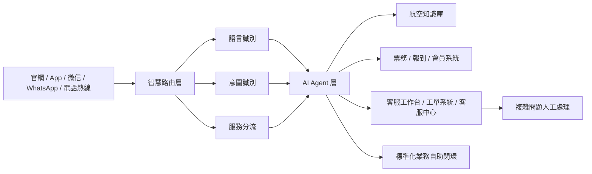
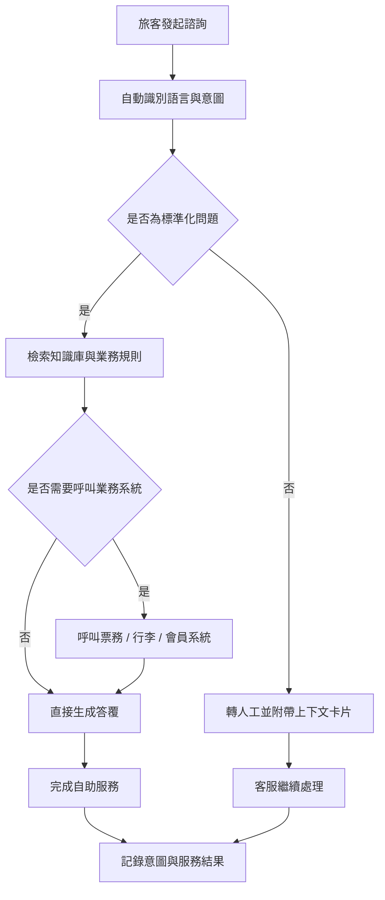

# 航空行業智慧客服解決方案

## 概述

微语AI智慧客服系統面向航空行業，將大語言模型與航空業務知識、業務系統深度融合，為航空公司打造覆蓋「諮詢—判斷—辦理」全流程的智慧化旅客服務平台。方案聚焦多語言接待、智慧意圖識別、退改簽與行李業務自助辦理、知識庫智慧管理以及人機協同等核心場景，幫助航空公司在保持服務溫度的同時，顯著提升自助解決率與服務效率。

## 決策者摘要

| 維度 | 建議口徑 |
| --- | --- |
| 方案定位 | 面向航空公司的全通路 AI 客服與人機協同服務平台 |
| 優先解決的問題 | 多語言服務、高峰期排隊、退改簽與行李諮詢、複雜問題轉人工 |
| 一期可落地範圍 | 官網、App、微信等文字管道 + 知識庫問答 + 票務規則解答 + 人工協同 |
| 核心預期收益 | 提升自助解決率、縮短等待時間、統一服務口徑、降低重複諮詢壓力 |
| 後續擴展方向 | 航班動態、會員系統、語音熱線、報到與票務系統深度對接 |

## 一期建設建議

- **優先接入文字管道**：先覆蓋官網、App、微信公眾號/小程式等高頻諮詢入口，快速驗證價值
- **先做高頻標準問題**：優先處理退改簽、行李額度、航班動態、會員權益等重複度高的問題
- **保留人工兜底機制**：複雜投訴、特殊旅客服務、異常航變等場景保持人工無縫接管
- **按階段推進系統整合**：先接入知識庫與票規，再逐步打通票務、會員、行李等核心系統

## 行業痛點與挑戰

- **多語言旅客服務**：旅客來自不同國家和地區，需以普通話、粵語、英語等多語言提供一致的高品質服務
- **高峰諮詢量暴增**：颱風、延誤、節假日等突發情況帶來諮詢量瞬間激增，傳統人工客服難以承接
- **業務規則龐雜**：退改簽政策、行李規定、特殊旅客服務等規則繁多且更新頻繁，人工檢索與答覆效率低
- **跨系統資訊孤島**：票務系統、離港系統、會員系統等相互獨立，客服難以一站式取得旅客完整資訊

## 微语航空客服整體架構

微语航空客服方案採用分層架構，將多管道旅客接入、智慧分流、AI Agent 處理與人工服務有機串聯：

- **管道層**：官網、APP、微信公眾號/小程式、WhatsApp、電話熱線等多管道統一接入
- **智慧路由層**：對旅客訴求進行語意理解與意圖識別，將標準化業務與複雜業務自動分流
- **AI Agent 層**：大語言模型結合航空知識庫與業務工具，完成諮詢解答與業務辦理
- **人工服務層**：客服工作台、工單系統與客服中心協同，承接複雜業務與特殊旅客服務

## 核心能力

### 多語言智慧接待

- **自動語種識別**：智慧識別旅客使用的語言，並以旅客原生語言回覆
- **多語言覆蓋**：支援簡體中文、繁體中文、英語、粵語等多語言服務
- **一致體驗**：不同語種旅客獲得統一、準確的服務口徑

### 智慧意圖識別與分流

- **語意理解**：依託大語言模型穿透口語化表達，精準鎖定真實訴求（如「把票往後挪幾天」識別為改簽）
- **標準化自助閉環**：常見諮詢與標準化業務由 AI 自助辦理完成
- **複雜場景自動轉人工**：識別到複雜訴求時自動流轉人工，並傳遞對話上下文，避免旅客重複描述

### 知識庫智慧管理

- **文件智慧解析**：自動解析運輸條款、票務規則等上百頁業務文件，批次生成知識條目
- **FAQ 自動生成**：將文件拆解為標準問答對，降低知識庫維護門檻
- **人工審核疊代**：支援「AI 解析 → 人工審核 → 入庫」的閉環，持續沉澱與優化知識

### 業務系統深度對接

- **機票查詢與退改簽**：對接票務系統，實現航班查詢、退票、改簽的一站式辦理
- **行李查詢與理賠**：支援行李託運狀態查詢、異常行李申報與理賠引導
- **航班動態推播**：即時推播航班動態與延誤通知，輔助旅客調整行程
- **會員權益查詢**：對接會員系統，查詢積分、等級與專屬權益

### 全通路統一體驗

- **多管道統一接入**：Web、App、微信、WhatsApp、電話熱線統一服務入口
- **上下文跨管道保持**：對話上下文在不同管道間延續，旅客無需重複說明
- **工單全流程追蹤**：從諮詢到辦理再到售後，全流程記錄與追蹤

## 典型應用場景

### 航班出行前諮詢

- **預訂前問詢**：解答航線、票價規則、行李額度、艙位權益等常見問題
- **退改簽政策說明**：依據票規自動說明是否可退、是否可改以及費用範圍
- **特殊旅客服務申請**：為兒童、長者、孕婦、輪椅旅客等提供服務指引與申請入口

### 航班異常保障

- **延誤與取消通知**：在航班延誤、取消、改時等場景下自動推播通知與處理建議
- **批量諮詢承接**：在惡劣天氣或節假日高峰期間快速承接大規模重複諮詢
- **應急分流**：針對情緒激動、投訴升級、多人同行改簽等複雜場景快速轉人工處理

### 行李與會員服務

- **行李服務支援**：查詢託運行李狀態，提供超規行李、遺失行李與理賠指引
- **會員權益查詢**：回答里程、積分、等級權益、升艙資格等問題
- **增值服務推薦**：結合旅客畫像推薦選位、額外行李、貴賓室等增值服務

## 業務價值

- **提升自助服務能力**：將大量標準化、高頻諮詢前移至 AI 自助閉環，降低人工壓力
- **縮短回應與等待時間**：高峰時段仍可穩定承接諮詢，減少排隊與流失
- **統一服務口徑**：透過知識庫與規則管理，確保多管道、多語種答覆一致
- **增強旅客體驗**：在複雜業務中保留人工服務溫度，在標準業務中提供更快回應
- **沉澱可營運資料**：基於意圖、分流、滿意度、工單結果持續優化服務策略

## 典型效果指標（參考目標）

以下指標為行業參考目標，用於方案評估與目標設定，非微语現網承諾值：

- 自助解決率 ≥ 70%
- 客戶滿意度 ≥ 95%
- AI 分流約 40% 重複性標準化諮詢
- 排隊率下降約 60%
- 平均回應時效顯著提升

## 部署與整合

- **快速部署**：支援 Docker 一鍵部署，標準化交付，快速上線
- **系統對接**：提供與航空公司現有票務、報到、會員等系統的對接方案
- **安全合規**：遵循旅客資料保護要求，支援私有化與安全可控部署

## 落地模式

### 標準版

- **適用對象**：希望快速上線智慧客服能力的航空公司與區域航司
- **核心能力**：多語言諮詢、知識庫問答、常見票務問題解答、基礎轉人工協同
- **落地特點**：部署週期短，優先覆蓋官網、App、微信等文字客服入口

### 專業版

- **適用對象**：需要更深業務對接與營運分析能力的中大型航空公司
- **核心能力**：對接票務、會員、工單等系統，支援智慧分流與服務資料分析
- **落地特點**：兼顧快速部署與業務客製，適合逐步擴展到更多管道與場景

### 企業版

- **適用對象**：對安全隔離、穩定性與複雜整合要求較高的大型航司或航旅集團
- **核心能力**：私有化部署、統一客戶服務平台、人機協同營運體系、深度系統整合
- **落地特點**：支援多業務線統一營運，滿足高可用、審計與合規要求

## 能力對應

微语航空客服方案建立在微语既有平台能力之上，包括：

- 智慧機器人（大模型 Agent 接待與多輪對話）
- 知識庫（FAQ 管理與語意檢索）
- 工單系統（全流程追蹤與 SLA 管理）
- 客服中心（語音客服與 IVR 支援）
- 多語言前端（簡中、繁中、英語等多語言介面）

## 後續演進方向

- 語音場景多語言 ASR/TTS 支援（含粵語識別與合成）
- 按意圖類別配置差異化路由策略，智慧分派到對應技能組
- 規則變更的離線評估與回放，保障營運變更品質

## 常見問題

- **如何對接已有的票務系統？** 微语支援透過標準介面與現有票務、報到、會員等系統對接，可在方案實施階段完成整合評估。
- **支援哪些語言？** 支援簡體中文、繁體中文、英語等多語言，並可按需擴展粵語等更多語種。
- **部署週期多長？** 標準版可快速上線，具體週期取決於系統對接範圍與客製化需求。

---

*微语AI智慧客服系統助力航空公司數位化升級，讓旅客服務更智慧、更高效、更貼心。*
