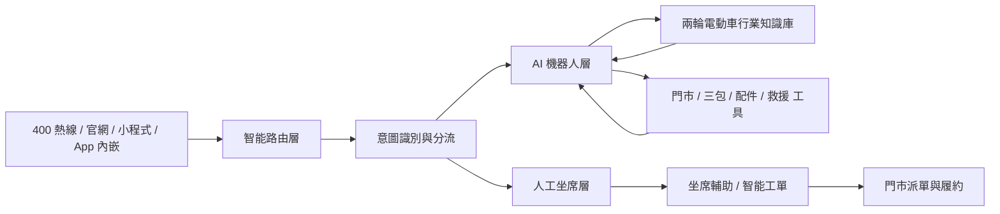
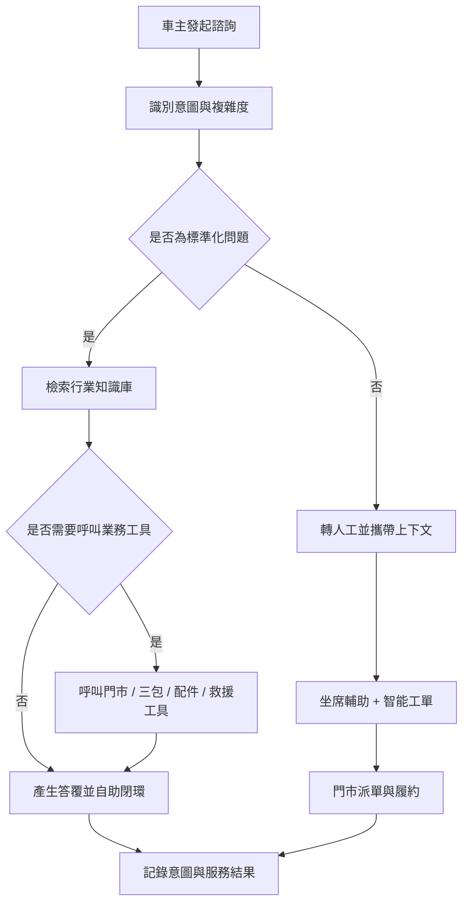

# 兩輪電動車行業智能客服解決方案

## 概述

兩輪電動車是國民日常出行的重要交通工具，行業龍頭品牌累計銷量已突破一億台，線下門市動輒數萬家。龐大的用戶基數與門市網路，帶來了海量、高頻且高度專業的客服訴求：三包政策查詢、故障排查引導、App 智能功能使用、門市預約與道路救援等。

微語智能客服系統為兩輪電動車品牌打造覆蓋「熱線 + 線上 + 門市履約」的一體化智能客服解決方案，將行業知識（車型參數、三包政策、故障排查、App 使用指南）與大語言模型深度融合，幫助品牌提升自助解決率、縮短服務時長、打通門市履約鏈路，讓億萬車主享受「找得到門市、問得清政策、修得好車」的服務體驗。

## 決策者摘要

| 維度 | 建議口徑 |
| --- | --- |
| 方案定位 | 面向兩輪電動車品牌的全渠道 AI 客服與門市履約協同平台 |
| 優先解決的問題 | 高峰接通率低、三包政策查詢慢、故障排查專業性強、門市履約脫節 |
| 一期可落地範圍 | 熱線 + 線上文本渠道、行業知識庫、機器人分層攔截、智能工單 |
| 核心預期收益 | 提升自助解決率、縮短服務時長、統一服務口徑、打通門市派單 |
| 後續擴展方向 | 道路救援派單、配件庫存、門市預約、VOC 分析等系統深度對接 |

## 行業概覽：兩輪電動車客服的挑戰

### 規模化服務壓力

- **用戶基數龐大**：兩輪電動車社會保有量以億計，旺季、雨季、冬季電池問題集中爆發，話務量峰值波動大
- **門市網路龐大**：數萬家線下門市承擔銷售與售後履約，客服需要快速定位門市、協調派單
- **高峰接通率難題**：傳統客服中心高峰期排隊嚴重，接通率下滑，用戶體驗差、投訴率高
- **客服培訓成本高**：三包政策、配件型號、車型參數專業性強，新坐席上手慢，服務口徑難統一

### 行業獨特情境複雜

- **三包政策複雜**：整車、電池、馬達、控制器、充電器等部件保固期限與條件各不相同，人工查詢慢且易出錯
- **配件體系複雜**：車型迭代快、配件型號多，配件相容性、價格、庫存諮詢訴求高頻
- **智能功能諮詢增多**：App 藍牙連線、GPS 定位、遠端解鎖、電子圍欄等新功能帶來新型諮詢
- **故障排查專業性強**：無法啟動、電池虧電、煞車異音、儀表報錯等問題需要專業引導，用戶口語化描述與標準故障術語存在鴻溝

### 服務閉環與用戶之聲

- **服務依賴線下履約**：道路救援、預約維修、配件訂購都需要與門市、救援系統聯動，線上客服與線下履約脫節
- **用戶之聲難沉澱**：投訴與建議分散在熱線、線上、門市各渠道，難以結構化分析並回饋產品與研發

### 核心情境一覽

| 情境 | 典型訴求 | 服務關鍵點 |
| --- | --- | --- |
| 門市查詢與導航 | 最近門市、營業時間、聯絡電話 | 地圖定位、門市位置卡片、一鍵導航 |
| 三包政策查詢 | 保固範圍、保固期限、免費更換條件 | 按車型/部件精準匹配三包條款 |
| 配件查詢與訂購 | 配件型號、價格、庫存、相容性 | 整合庫存系統、支援對話內查詢訂購 |
| App 使用問題 | 藍牙連線、GPS 定位、遠端解鎖 | 分步驟圖文/影片引導 |
| 故障排查引導 | 無法啟動、異音、電池虧電、儀表報錯 | 決策樹式引導排查 |
| 道路救援 | 半路故障、拖吊、到府維修 | 最近門市派單、救援進度追蹤 |
| 預約維修保養 | 預約時間、保養項目與費用 | 整合門市預約系統 |
| 配件以舊換新 | 電池以舊換新、舊車置換 | 報價查詢、流程引導 |

## 微語兩輪電動車客服解決方案

微語兩輪電動車客服方案採用分層架構，將多渠道車主接入、智能分流、AI 機器人與人工坐席、門市履約有機串聯：



### 📞 全渠道統一接入

- **400 熱線服務**：語音機器人 7×24 小時接待，高峰期智能分流，人工坐席專注複雜問題
- **線上客服**：官網、微信公眾號、微信小程式全渠道接入，統一工作台接待
- **App 內嵌客服**：車主 App 內嵌即時諮詢入口，結合車輛資訊提供個人化服務
- **統一客戶識別**：全渠道統一用戶檔案，跨渠道連續服務，用戶無需重複描述問題

### 🤖 AI 機器人分層服務

- **線上智能機器人**：基於大模型 FAQ 與 RAG 檢索增強，自助解答三包政策、App 使用、故障排查等常見問題；語意理解支援口語化提問，「車子發不動」可自動對應到「無法啟動」標準問題
- **熱線語音機器人**：語音識別 + 意圖識別自動解答高頻來電，支援設定電動車專業術語熱詞，提升識別準確率
- **智能意圖分流**：AI 判定意圖複雜度——標準化問題（政策查詢、門市查詢）由機器人自助閉環；複雜問題（投訴、救援、糾紛）自動轉人工，並攜帶完整上下文（意圖、對話摘要、已匹配知識），坐席接手即了解全貌
- **重複諮詢攔截**：高頻重複問題優先由機器人閉環，降低轉人工率，緩解高峰期人工壓力

### 🧑‍💼 AI 坐席輔助

- **即時對話輔助**：語音會話即時轉寫，AI 同步識別用戶意圖，在坐席工作台側邊欄即時推送輔助資訊
- **知識即時推薦**：用戶提到「藍牙連不上」「車鑰匙丟了」，AI 自動識別意圖並推送完整排查步驟與操作影片建議，坐席一鍵傳送給用戶
- **話術建議**：基於歷史優質會話即時推薦回覆話術，新坐席也能專業應答
- **智能會話小結**：會話結束自動產生服務小結，沉澱服務紀錄，便於質檢與復盤

### 🎫 智能工單

- **工單自動填寫**：會話結束後 AI 自動擷取用戶問題、車型、故障分類、處理方案等欄位預填工單，坐席核對十餘秒即可提交，告別手寫「小作文」
- **SLA 全流程管理**：工單流轉、逾時提醒、升級規則靈活設定，保障服務承諾兌現
- **門市派單聯動**：維修、救援類工單自動派發對應門市，處理進度即時同步，用戶可隨時查詢工單狀態

### 📊 VOC 用戶之聲分析

- **主題自動分群**：AI 對工單與會話內容自動分群主題（電池問題、App 連線、煞車異音、門市服務態度等），高頻問題一目瞭然
- **情感分析**：自動識別用戶情緒，標註投訴熱點與升級風險，重點工單優先處置
- **趨勢報告**：按日/週/月自動產生 VOC 分析報告，推送給管理層，支撐產品與服務改善決策
- **問題溯源**：高頻問題自動關聯產品線/批次，讓用戶之聲穿透到研發、製造部門，從源頭推動產品改善

### 🗺️ 門市服務網路協同

- **門市智能查詢**：對話中支援傳送門市位置卡片（地址、營業時間、電話、導航入口），支援按城市、服務能力篩選門市
- **預約維修保養**：對話內完成門市維修/保養預約，自動關聯工單與到店提醒
- **道路救援聯動**：救援請求自動定位最近門市/救援點派單，救援進度即時追蹤
- **配件庫存查詢**：整合門市/倉庫庫存系統，對話內查詢配件價格與庫存狀態

### 服務閉環流程



## 業務價值

- **提升自助解決能力**：將三包政策、App 使用、門市查詢等高頻標準化諮詢前移至 AI 自助閉環，降低人工壓力
- **縮短回應與等待時間**：高峰時段仍可穩定承接諮詢，減少排隊與流失，緩解旺季話務壓力
- **統一服務口徑**：透過行業知識庫與策略管理，保證熱線、線上多渠道答覆一致，降低新人培訓成本
- **打通門市履約**：維修、救援、預約類訴求自動聯動門市派單，線上諮詢與線下服務無縫銜接
- **沉澱可營運資料**：基於意圖、分流、滿意度、工單結果持續優化服務策略與產品改善

## 典型成效指標（參考目標）

以下指標為行業參考目標，用於方案評估與目標設定，非微語現網承諾值：

- 線上機器人自助解決率 ≥ 70%
- 高峰期接通率 ≥ 95%
- 平均通話 / 會話時長縮短 30% 以上
- 重複諮詢攔截率提升，轉人工率下降
- 工單建立效率顯著提升（AI 預填 + 人工核對秒級提交）

## 行業知識庫範本

微語為兩輪電動車行業預置開箱即用的知識庫分類範本與 FAQ 示例，支援一鍵匯入，快速搭建行業知識體系，並可按品牌自有車型與政策擴充。

### 預置分類體系

```text
兩輪電動車行業知識庫
├── 產品與車型
│   ├── 車型參數
│   ├── 電池規格
│   ├── 續航與充電
│   └── 智能功能
├── 三包與售後政策
│   ├── 整車三包
│   ├── 電池三包
│   ├── 馬達/控制器三包
│   └── 非保固情境
├── App 與智能設備
│   ├── 藍牙連線
│   ├── GPS 定位
│   ├── 遠端解鎖
│   └── 帳號與設備綁定
├── 故障排查
│   ├── 無法啟動
│   ├── 電池虧電
│   ├── 煞車/異音
│   ├── 儀表報錯
│   └── 充電異常
├── 門市與履約服務
│   ├── 附近門市
│   ├── 預約維修
│   ├── 道路救援
│   └── 配件查詢
└── 投訴與 VOC
    ├── 門市服務投訴
    ├── 產品品質回饋
    ├── 維修進度催辦
    └── 高頻問題上報
```

### FAQ 資料結構

行業 FAQ 範本統一採用以下欄位，便於匯入微語知識庫並支撐意圖分流與工具聯動：

| 欄位 | 說明 |
| --- | --- |
| question | 標準問題 |
| answer | 標準答案 |
| category | 所屬分類（對應預置分類體系） |
| tags | 檢索標籤（含口語化說法） |
| intent | 意圖標識，用於智能分流 |
| handoffRequired | 是否建議轉人工 |
| relatedTools | 關聯業務工具（如門市查詢、配件查詢） |
| locale | 語言 |
| source | 來源（範本預置/人工輸入） |
| reviewStatus | 審核狀態（草稿/已審核） |

### FAQ 示例（節選）

| 問題 | 分類 | 建議轉人工 |
| --- | --- | --- |
| 我的電動車發不動怎麼辦？ | 故障排查/無法啟動 | 否，先自助排查 |
| 電池虧電充不進電怎麼處理？ | 故障排查/電池虧電 | 否 |
| App 藍牙連不上怎麼辦？ | App 與智能設備/藍牙連線 | 否 |
| 電池三包期是多久？ | 三包與售後政策/電池三包 | 否 |
| 車架號在哪裡可以看到？ | 產品與車型/車型參數 | 否 |
| 最近的維修門市在哪裡？ | 門市與履約服務/附近門市 | 否，呼叫門市查詢工具 |
| 怎麼預約門市保養？ | 門市與履約服務/預約維修 | 否，呼叫預約服務工具 |
| 車半路壞了我需要救援 | 門市與履約服務/道路救援 | 是，救援派單 |
| 煞車時有異音是什麼問題？ | 故障排查/煞車異音 | 視排查結果 |
| 電池以舊換新怎麼估價？ | 門市與履約服務/配件查詢 | 視門市政策 |
| 門市師傅服務態度差，我要投訴 | 投訴與 VOC/門市服務投訴 | 是 |
| GPS 定位不準怎麼辦？ | App 與智能設備/GPS 定位 | 否 |

完整行業 FAQ 範本（50+ 條，涵蓋產品、三包、App、故障、門市、投訴六大類）以 JSON 格式隨方案提供，支援一鍵匯入微語知識庫後人工審核啟用。

## 整合方案

微語透過標準 API 與 MCP Tools（Model Context Protocol 工具）生態對接企業現有系統，讓機器人在對話中安全呼叫業務資料，實現「對話即業務」：

| 整合工具 | 能力說明 | 對接系統示例 |
| --- | --- | --- |
| 門市查詢工具 | 按位置/城市/服務能力查詢門市資訊 | 門市管理系統、地圖服務 |
| 三包查詢工具 | 按車型/部件/購車日期判定保固狀態 | DMS 經銷商管理系統、三包政策庫 |
| 配件查詢工具 | 配件型號、價格、庫存、相容性查詢 | ERP、庫存管理系統 |
| 預約服務工具 | 門市維修/保養預約的建立與查詢 | 門市預約系統 |
| 道路救援工具 | 救援派單與救援進度追蹤 | 救援調度系統 |

同時支援與 CRM、工單系統、BI 分析平台等企業系統的標準整合；所有工具呼叫均支援權限控制與操作稽核，保障資料安全。

## 部署方案

### 品牌總部版

- **適用對象**：兩輪電動車品牌總部
- **核心能力**：全渠道客服、AI 機器人、坐席輔助、VOC 分析、全系統服務監控
- **部署方式**：私有雲/公有雲部署，支援信創環境

### 總部門市協同版

- **適用對象**：品牌總部 + 區域代理 + 大規模線下門市
- **核心能力**：總部統一知識庫與政策口徑，門市分級接待與派單協同
- **部署方式**：私有化部署，支援多租戶門市體系

### SaaS 快速版

- **適用對象**：中小品牌與區域經銷商
- **核心能力**：標準客服功能 + 行業知識庫範本，開箱即用
- **部署方式**：雲端 SaaS，最快當天上線

## 案例參考：行業龍頭企業實踐

以下是兩輪電動車行業龍頭企業公開的數位化客服實踐方向（引自公開報導，供方案評估參考）：

- **統一坐席工作台**：將接線、知識庫、工單等工具整合到一個系統，客服告別多系統切換，單次切換耗時從 20 秒級降為 0
- **AI 坐席輔助**：即時對話轉寫與語意識別，自動總結要點、推薦回覆話術與產品知識點；通話結束 AI 自動產生工單摘要，客服核對十幾秒即可提交
- **機器人分層攔截**：熱線機器人解決率從 20% 提升至 42%，線上機器人解決率達 78%，高峰期接通率從 88% 提升至 95%，平均通話時長縮短 33%（以上數據引自公開報導）
- **VOC 穿透組織**：用戶回饋與高頻問題精準拆解，分發至研發、製造等事業部，從源頭推動產品改善

微語方案的 AI 坐席輔助、智能意圖分流、智能工單、VOC 分析等能力與上述實踐方向一一對應，可以幫助兩輪電動車品牌以更低的成本、更短的週期實現同類數位化轉型。

## 相關解決方案

- [汽車行業智能客服解決方案](auto.md)：四輪汽車全生命週期服務
- [零售消費品行業智能客服解決方案](retail.md)：商品諮詢、訂單物流、會員服務
- [工單系統解決方案](ticket.md)：智能工單分配與流程自動化
- [知識庫解決方案](kbase.md)：智能知識檢索與內容管理
