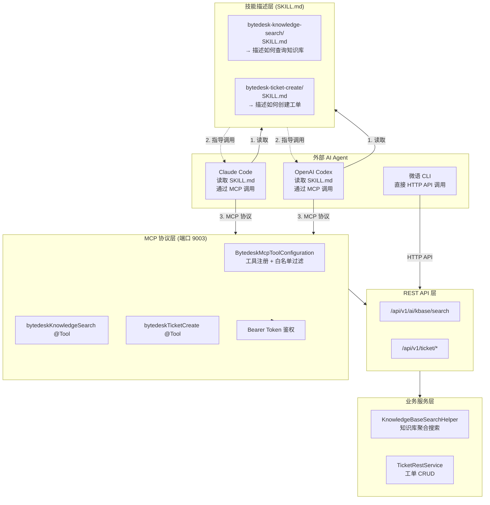
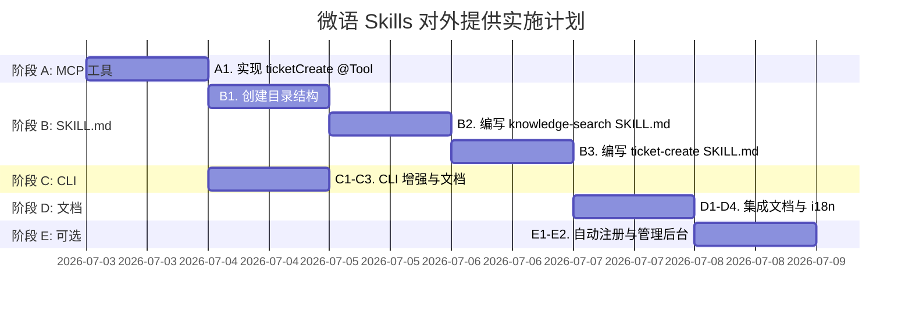

# 微语 Skills 对外提供实现规划

> 状态：规划中 → 待确认
> 创建：2026-07-03
> 关联 TODO：`TODO-20260514.md` 第 25-26 行
> 关联计划：[MCP 服务与 CLI 对接落地清单](./mcp-service-cli-implementation-plan-20260702.md)
> 关联设计：[自进化 Agent Skills 设计](./2026-04-26-self-evolving-agent-skills-design.md)

<!-- markdownlint-disable MD060 MD033 -->

## 零、背景与定位

### 0.1 什么是"微语 Skills"

在 Claude Code / Codex 生态中，**Skills** 是指通过 `SKILL.md` 文件描述的一组可复用能力，告诉 AI Agent **如何**完成特定任务。Skills 不同于 MCP Tools：

| 维度 | MCP Tools | Skills (SKILL.md) |
|------|-----------|-------------------|
| 层级 | 协议层 — 暴露原子能力 | 语义层 — 描述任务流程 |
| 载体 | `@Tool` 注解 + MCP 协议 | `SKILL.md` Markdown 文件 |
| 消费方 | MCP Client (Claude Code / Codex) | Claude Code / Codex 的 Skill 引擎 |
| 粒度 | 单一 API 调用 | 多步骤任务编排指引 |
| 示例 | `bytedeskKnowledgeSearch` | "查询知识库回答用户退款问题" |

### 0.2 与已有 MCP 计划的关系

已有的 [MCP 服务与 CLI 对接落地清单](./mcp-service-cli-implementation-plan-20260702.md) 从**协议层面**解决了工具暴露问题（`@Tool`注解 → MCP Server → Bearer Token 鉴权）。

本计划在此基础上，从**技能层面**解决：

1. 创建标准化的 `SKILL.md` 描述文件
2. 让 Claude Code / Codex 能自动发现并理解微语能力
3. 提供端到端的接入指南和配置模板

### 0.3 为什么需要 Skills（而非仅靠 MCP Tools）

- MCP Tools 暴露的是原子操作（如 `bytedeskKnowledgeSearch`），Agent 知道能调用什么但不一定知道**何时、为何、如何组合**调用
- SKILL.md 提供**场景化指引**：何时用、怎么用、典型工作流、边界条件
- Claude Code 原生支持 `SKILL.md` 的 YAML frontmatter + Markdown 描述格式
- 这是微语从"被调用"到"被理解"的关键一步

---

## 一、目标

### 1.1 核心目标

对外提供微语 Skills，让第三方 AI Agent（Claude Code、Codex 等）能够：

1. **查询知识库**：语义搜索微语知识库，获取准确的业务知识
2. **创建工单**：在客服、售后、值班等场景中创建和跟踪工单

支持三种接入方式：

1. Claude Code → 通过 MCP 协议 + SKILL.md 技能描述
2. OpenAI Codex → 通过 MCP 协议 + SKILL.md 技能描述
3. 命令行用户 → 通过微语 CLI 直接调用

### 1.2 本期范围

**包含：**

1. 创建 2 个标准化 SKILL.md 文件（知识库查询、工单创建）
2. 补全 `bytedeskTicketCreate` MCP 工具实现
3. 编写 Claude Code `claue_mcp.json` 配置模板
4. 编写 Codex MCP 配置模板
5. 完善 CLI 知识库搜索 + 工单创建命令
6. 编写端到端接入文档（含示例）
7. 在 `docs/plans/` 和 `docs/docs/` 中补齐文档

**不包含：**

1. 不实现新的后端 API（复用现有 MCP + REST API）
2. 不做 Skills 后台管理界面（后续 modules/ai/skill 模块扩展）
3. 不做技能自动生成/自进化（已有独立计划）
4. 不在本期扩展更多技能类型（如查询工单状态、查询会话记录）

---

## 二、现状分析

### 2.1 已具备的能力

| 能力 | 位置 | 状态 |
|------|------|------|
| MCP Server 框架 | `modules/ai/mcp/BytedeskMcpToolConfiguration.java` | ✅ 完整 |
| 知识库搜索 MCP 工具 | `BytedeskExternalMcpTools.bytedeskKnowledgeSearch()` | ✅ 已实现 |
| 工单创建 MCP 工具 | `BytedeskExternalMcpTools` | ❌ **未实现**（白名单已配置） |
| Bearer Token 鉴权 | `BytedeskMcpBearerTokenFilter.java` | ✅ 已实现 |
| MCP 工具白名单 | `BytedeskMcpToolProperties.java` | ✅ 已配置 |
| CLI 框架 | `modules/cli/` | ✅ 完整 |
| CLI 知识库搜索命令 | `KnowledgeCommand.java` | ✅ 已实现 |
| CLI 工单命令 | `TicketCommand.java` | ✅ 已实现 (list/get/create/close) |
| Skills 框架 | `modules/ai/skill/SkillRestService.java` | ✅ SKILL.md 解析 |
| MCP 中文档 | `docs/docs/modules/mcp.md` | ✅ 已有 |
| 知识库搜索聚合 | `KnowledgeBaseSearchHelper.java` | ✅ 已实现 |
| 工单 REST API | `TicketRestController.java` | ✅ 已实现 |

### 2.2 关键缺失

```bash
modules/ai/src/main/java/com/bytedesk/ai/mcp/
└── BytedeskExternalMcpTools.java
    ├── ✅ bytedeskKnowledgeSearch  (@Tool)   ← 已实现
    └── ❌ bytedeskTicketCreate     (@Tool)   ← 需要新增

modules/ai/src/main/resources/skills/
├── ❌ bytedesk-knowledge-search/SKILL.md    ← 需要创建
└── ❌ bytedesk-ticket-create/SKILL.md       ← 需要创建

docs/docs/modules/
└── mcp.md  ← 已有，需要补充 Claude Code / Codex 接入章节
```

---

## 三、架构设计

### 3.1 整体架构



### 3.2 技能三层模型

```bash
┌─────────────────────────────────────────────────┐
│              技能三层模型                          │
├─────────────────────────────────────────────────┤
│  描述层  │ SKILL.md         │ 告诉 Agent 何时/为何用  │
│  (Skills)│ 场景指引 + 示例   │ Claude Code 原生理解    │
├──────────┼──────────────────┼───────────────────────┤
│  协议层  │ MCP Tools        │ 标准协议暴露原子能力      │
│  (MCP)   │ @Tool 注解       │ 所有 MCP Client 通用    │
├──────────┼──────────────────┼───────────────────────┤
│  传输层  │ REST API         │ 实际业务数据读写         │
│  (API)   │ HTTP + JSON      │ CLI 直接调用            │
└──────────┴──────────────────┴───────────────────────┘
```

### 3.3 关键决策

#### 决策 1：Skills 文件存放位置

SKILL.md 文件存放在 `modules/ai/src/main/resources/skills/`，随 JAR 包发布。

**理由：**

- 与 MCP 工具同属 `modules/ai` 模块，职责内聚
- 随 JAR 发布，任何部署环境自动包含
- 后续可通过 `modules/ai/skill/SkillRestService` 的扫描路径自动加载

#### 决策 2：Skills 框架的关系

Skills 框架已从 `enterprise/ai/skill` 迁移到 `modules/ai/skill`，当前 `SkillRestService` 已实现 `classpath*:skills/*/SKILL.md` 扫描，但目录下尚无外部 SKILL.md 文件。

**方案：**

- 先在 `modules/ai/src/main/resources/skills/` 创建 SKILL.md 文件
- 启动时通过 classpath 扫描自动加载
- 开源版可直接使用，无需依赖 enterprise 模块

#### 决策 3：CLI 不调用 MCP

CLI 继续使用现有 `HttpApiClient` 直接调用 REST API，不引入 MCP client 依赖。

**理由：** 参见 MCP 计划 4.2 节，CLI 场景更适合稳定的 HTTP API。

---

## 四、详细实施任务

### 阶段 A：MCP 工具补全（`modules/ai`）

#### A1. 实现 `bytedeskTicketCreate` @Tool 方法

**文件：** `modules/ai/src/main/java/com/bytedesk/ai/mcp/BytedeskExternalMcpTools.java`

**新增内容：**

```java
@Tool(description = "Create a ticket in Bytedesk customer service system. Input is McpTicketCreateRequest json.")
public Object bytedeskTicketCreate(
    @ToolParam(description = "McpTicketCreateRequest json") String requestJson
) {
    // 1. 解析 JSON → McpTicketCreateRequest
    // 2. 校验必填字段 (title, description, orgUid)
    // 3. 构造 TicketRequest
    // 4. 调用 TicketRestService.create()
    // 5. 返回 McpTicketCreateResponse
    // 6. 记录 [MCP-AUDIT] 日志
}
```

**入参字段（最小集）：**

| 字段 | 类型 | 必填 | 说明 |
|------|------|------|------|
| title | String | ✅ | 工单标题 |
| description | String | ✅ | 工单描述 |
| orgUid | String | ✅ | 组织 UID |
| reporterUid | String | 否 | 报告人 UID |
| priority | String | 否 | 优先级 (LOW/MEDIUM/HIGH/URGENT) |
| type | String | 否 | 工单类型 |
| workgroupUid | String | 否 | 工作组 UID |
| categoryUid | String | 否 | 分类 UID |
| contactName | String | 否 | 联系人姓名 |
| phone | String | 否 | 联系电话 |
| email | String | 否 | 联系邮箱 |

**出参字段：**

| 字段 | 说明 |
|------|------|
| uid | 工单 UID |
| ticketNumber | 工单编号 |
| title | 标题 |
| status | 状态 |
| createdAt | 创建时间 |

**依赖注入：** `TicketRestService`（需要从 `modules/ticket` 引入）

---

### 阶段 B：SKILL.md 技能描述文件（`modules/ai`）

#### B1. 创建目录结构

```bash
modules/ai/src/main/resources/skills/
├── bytedesk-knowledge-search/
│   └── SKILL.md
└── bytedesk-ticket-create/
    └── SKILL.md
```

#### B2. 编写 `bytedesk-knowledge-search/SKILL.md`

YAML frontmatter 包含：

- `name`: bytedesk-knowledge-search
- `description`: 搜索微语知识库，获取准确的业务知识答案

Markdown 正文包含：

- 适用场景（客服问答、知识检索、FAQ 查询）
- 前置条件（需要 orgUid、kbUid/robotUid）
- 参数说明
- 调用示例（JSON 格式）
- 返回结果说明
- 常见问题

#### B3. 编写 `bytedesk-ticket-create/SKILL.md`

YAML frontmatter 包含：

- `name`: bytedesk-ticket-create
- `description`: 在微语客服系统中创建工单，用于问题跟踪和升级

Markdown 正文包含：

- 适用场景（客服升级、问题记录、任务分配）
- 前置条件（需要 orgUid、认证 token）
- 参数说明
- 调用示例（JSON 格式）
- 返回结果说明
- 注意事项

---

### 阶段 C：CLI 增强（`modules/cli`）

#### C1. 统一 CLI 输出格式

**文件：** `modules/cli/src/main/java/com/bytedesk/cli/core/CliResult.java`

- 增加 `--json` flag，输出纯 JSON 格式（方便脚本解析）
- 默认保持人类可读格式

#### C2. CLI 使用帮助完善

**文件：** `modules/cli/src/main/java/com/bytedesk/cli/command/KnowledgeCommand.java`

- 增加更多使用示例到 help 文本

**文件：** `modules/cli/src/main/java/com/bytedesk/cli/command/TicketCommand.java`

- 增加更多使用示例到 help 文本

#### C3. 创建 CLI README

**文件：** `modules/cli/README.md`

包含：

- 安装说明
- 认证配置
- 命令参考
- 使用示例

---

### 阶段 D：集成文档（`docs/`）

#### D1. 补充 Claude Code 接入指南

**文件：** `docs/docs/modules/mcp.md`（扩充现有文档）

新增章节：

1. Claude Code 接入步骤
2. `claude_mcp.json` 配置模板
3. 技能发现与使用
4. 对话示例

**Claude Code 配置模板 (`claude_mcp.json`)：**

```json
{
  "mcpServers": {
    "bytedesk": {
      "type": "sse",
      "url": "http://localhost:9003/sse",
      "headers": {
        "Authorization": "Bearer <your-token>"
      }
    }
  }
}
```

#### D2. 补充 Codex 接入指南

**文件：** `docs/docs/modules/mcp.md`

新增章节：

1. Codex CLI 接入步骤
2. MCP 配置方式
3. 使用示例

#### D3. CLI 使用文档

**文件：** `docs/docs/modules/cli.md`（新建）

内容：

1. 安装方式
2. 认证配置
3. 命令参考（knowledge search、ticket create/get/list）
4. 与 Claude Code 配合使用的场景

#### D4. 同步更新 i18n 文档

更新以下文件：

- `docs/i18n/en/docusaurus-plugin-content-docs/current/modules/mcp.md`
- `docs/i18n/zh-CN/docusaurus-plugin-content-docs/current/modules/mcp.md`
- `docs/i18n/zh-TW/docusaurus-plugin-content-docs/current/modules/mcp.md`

---

### 阶段 E：SKILL.md 自动注册（可选，后续迭代）

#### E1. 扩展 SkillRestService 扫描

**文件：** `modules/ai/src/main/java/com/bytedesk/ai/skill/SkillRestService.java`

当前 `classpath*:skills/*/SKILL.md` 扫描已支持，阶段 B 创建的文件会被自动发现。

#### E2. Skills 管理后台展示（后续）

在管理后台 admin 的 AI 设置中展示已注册的 Skills 列表。

---

## 五、交付结构总览

```bash
modules/ai/
├── src/main/java/com/bytedesk/ai/mcp/
│   └── BytedeskExternalMcpTools.java          ← A1: 新增 ticketCreate @Tool
└── src/main/resources/skills/
    ├── bytedesk-knowledge-search/
    │   └── SKILL.md                            ← B2: 知识库查询技能描述
    └── bytedesk-ticket-create/
        └── SKILL.md                            ← B3: 工单创建技能描述

modules/cli/
├── src/main/java/com/bytedesk/cli/core/
│   └── CliResult.java                          ← C1: 增强 JSON 输出
├── src/main/java/com/bytedesk/cli/command/
│   ├── KnowledgeCommand.java                   ← C2: 完善使用帮助
│   └── TicketCommand.java                      ← C2: 完善使用帮助
└── README.md                                   ← C3: CLI 使用文档

docs/
├── docs/modules/
│   ├── mcp.md                                  ← D1/D2: 补充 Claude Code + Codex 章节
│   └── cli.md                                  ← D3: CLI 使用文档（新建）
├── plans/
│   └── 2026-07-03-skills-external-plan.md      ← 本文档
└── i18n/*/docusaurus-plugin-content-docs/current/modules/
    └── mcp.md                                  ← D4: i18n 同步更新
```

---

## 六、验收标准

### 6.1 MCP 工具验收

- [ ] `bytedeskTicketCreate` @Tool 方法编译通过
- [ ] 使用 MCP Client 连接后能发现该工具
- [ ] 调用创建工单后数据库中产生正确记录
- [ ] 审计日志 `[MCP-AUDIT]` 正常输出
- [ ] 未认证请求被 401 拦截

### 6.2 SKILL.md 验收

- [ ] 2 个 SKILL.md 文件格式符合 Claude Code 规范
- [ ] YAML frontmatter 可被 `SkillMarkdownParser` 正确解析
- [ ] 内容包含完整的参数说明和使用示例

### 6.3 CLI 验收

- [ ] `bytedesk-cli knowledge search --query "退款" --org xxx` 正常返回结果
- [ ] `bytedesk-cli ticket create --title "测试" --description "测试描述"` 正常创建工单
- [ ] `--json` flag 输出有效 JSON
- [ ] 无认证时给出明确的错误提示

### 6.4 文档验收

- [ ] Claude Code 接入指南可操作、可复现
- [ ] Codex 接入指南可操作、可复现
- [ ] CLI 文档覆盖所有命令
- [ ] i18n 中英文档同步更新

### 6.5 构建验收

- [ ] `./starter/mvnw -f pom.xml -pl modules/ai -am -DskipTests compile` 通过
- [ ] `./starter/mvnw -f pom.xml -pl modules/cli -am -DskipTests compile` 通过

---

## 七、时序与依赖



**依赖关系：**

1. A1 是 B1/B2/B3 的前置（SKILL.md 需要描述已实现的工具）
2. B 阶段依赖 A 阶段完成
3. C 阶段与 B 阶段可并行
4. D 阶段依赖 A、B、C 阶段均完成

---

## 八、风险与注意事项

| 风险 | 影响 | 缓解措施 |
|------|------|----------|
| `TicketRestService` 依赖 Flowable 工作流 | 工单创建可能较复杂 | 先实现最小字段集，不涉及工作流变量 |
| Skills 扫描路径冲突 | 同名 Skill 覆盖 | 使用不同 skill name 区分 |
| Bearer Token 泄露 | 安全风险 | 文档强调使用环境变量，不硬编码 |
| MCP SSE 连接不稳定 | Agent 调用失败 | 文档说明重试机制和超时配置 |

---

## 九、后续扩展路线

完成本期交付后，可按以下优先级扩展：

1. **更多技能**：查询工单状态、查询工单列表、查询会话记录、查询客户信息
2. **Skills 管理后台**：在 admin 中可视化展示和管理 SKILL.md 文件
3. **技能自进化**：结合对话反馈自动优化 SKILL.md（参见[自进化 Agent Skills 设计](./2026-04-26-self-evolving-agent-skills-design.md)）
4. **多语言 Skills**：提供中、英、日等多语言版本的 SKILL.md
5. **Skills 市场**：支持社区贡献和分享自定义 Skills
