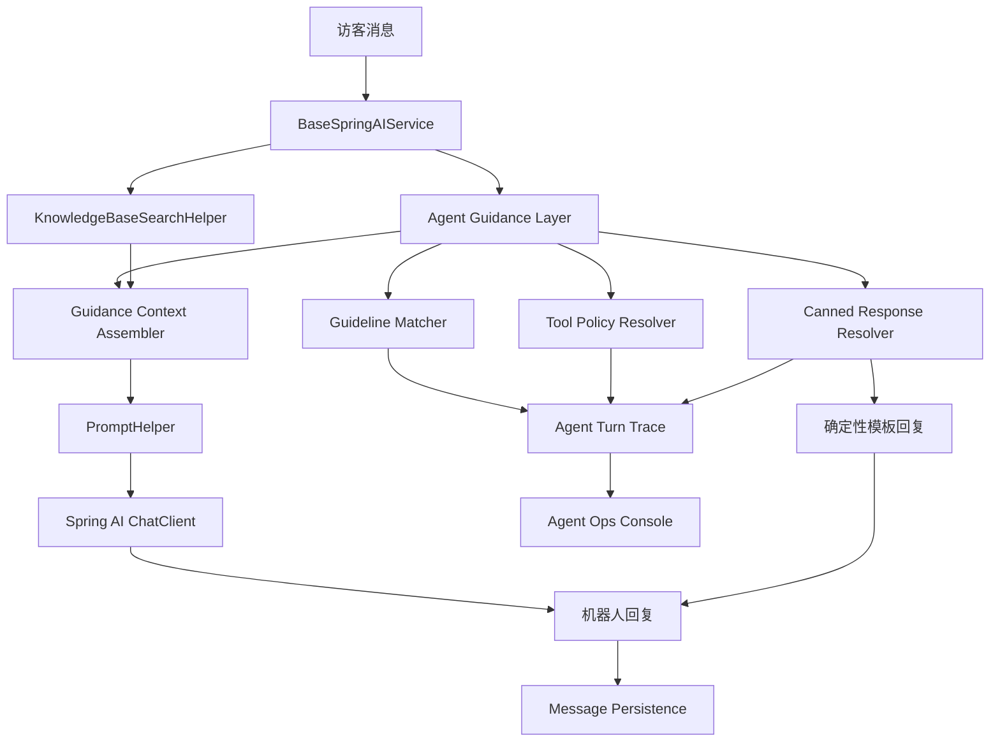
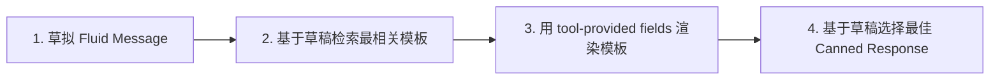

# 参考 Parlant 完善微语 Agent 实现规划

> 状态：规划中 -> 待确认  
> 创建：2026-07-06  
> 关联 TODO：`TODO-20260514.md` 中“参考 parlant 完善微语 agent”任务  
> 参考来源：Parlant GitHub 仓库、本地 clone `/Users/ningjinpeng/Desktop/Git/Github/open/parlant`、Parlant motivation 文档

## 0. 背景

当前微语已经具备客服机器人、知识库检索、LLM 问答、MCP 工具、Skills、工具审批、工具审计、Memory 等基础能力。现阶段主要问题不是“缺一个聊天机器人框架”，而是需要把客服 Agent 从“提示词 + RAG + 默认回复”的模式，升级为更可控、可解释、可运营、可持续迭代的对话 Agent。

Parlant 的核心价值在于它不是用单个超长 system prompt 或固定工作流来控制对话，而是把对话行为拆成结构化 guideline，并在每一轮对话中动态选择相关上下文，最终保留可追踪的决策证据。这个思想与微语的客服场景高度契合：客服回答既需要灵活处理多话题，也需要在高风险业务动作上保持确定性和审计能力。

本规划仅生成实施步骤，待确认后再执行代码修改。

## 1. 已阅读与对比范围

### 1.1 Parlant 侧关键材料

- 文档：`https://www.parlant.io/docs/quickstart/motivation`
- 本地代码：`/Users/ningjinpeng/Desktop/Git/Github/open/parlant`
- 本地文档：`/Users/ningjinpeng/Desktop/Git/Github/open/parlant/docs/`（2026-07-08 完整审查）
  - `concepts/customization/`：guidelines, relationships, variables, retrievers, tools, journeys, canned-responses, glossary
  - `concepts/entities/`：agents, customers
  - `concepts/sessions.md`：会话事件模型
  - `advanced/`：engine-extensions, explainability, custom-llms
  - `production/`：agentic-design, human-handoff, input-moderation, api-hardening
- 核心文件与概念：
  - `src/parlant/core/guidelines.py`：`GuidelineContent.action` 可空；`Guideline` 含 `enabled`、`tags`、`labels`、`composition_mode`、`track`、`priority`
  - `src/parlant/core/canned_responses.py`：高风险场景使用字段依赖的 canned response
  - `src/parlant/core/engines/alpha/engine.py`：加载上下文、匹配 guideline、调用工具、生成消息、记录 trace
  - `src/parlant/core/engines/alpha/prompt_builder.py`：分段 prompt 组装（AGENT_IDENTITY / CUSTOMER_IDENTITY / INTERACTION_HISTORY / CONTEXT_VARIABLES / GUIDELINE_DESCRIPTIONS / GUIDELINES / STAGED_EVENTS / GLOSSARY / JOURNEYS / OBSERVATIONS / CAPABILITIES），每段独立管理 status（ACTIVE/PASSIVE/NONE）
  - `src/parlant/core/engines/alpha/message_generator.py`：基于 `ContextEvaluation`、`FactualInformationEvaluation`、`OfferedServiceEvaluation`、`InstructionEvaluation`、`Revision`、`MessageSchema` 的多轮修订与合规检查
  - `src/parlant/core/relationships.py` 与 `src/parlant/core/engines/alpha/relational_resolver.py`：关系解析（`ENTAILMENT / PRIORITY / DEPENDENCY / DEPENDENCY_ANY / DISAMBIGUATION / REEVALUATION / OVERLAP`）
  - `src/parlant/core/engines/alpha/guideline_matching/*`：guideline 匹配、评分、理由和已应用状态分析
  - `src/parlant/core/evaluations.py`：对 guideline / journey 变更生成 evaluation 和 invoice
  - `src/parlant/core/journeys.py`：流程化节点（JourneyNode + JourneyEdge），Journey 由 guideline trigger 驱动，Journey 和 JourneyNode 都支持 `composition_mode`
  - `src/parlant/core/context_variables.py`：上下文变量（`tool_id`、`freshness_rules`、按 key 存储值）
  - `src/parlant/core/tools.py`、`src/parlant/core/services/tools/*`：工具注册、MCP/OpenAPI 工具接入；`ToolResult`、`ToolParameterOptions`、`TransientGuideline`
  - `src/parlant/core/glossary.py`：术语库，统一业务术语消歧，向量检索相关术语
  - `src/parlant/core/sessions.py`：Event/Session 模型，`Session.agent_states` 记录 `trace_id`、`applied_guideline_ids`、`journey_paths`
  - `src/parlant/core/engines/alpha/hooks.py`：当前实现的 `EngineHooks` 和 `CALL_NEXT / RESOLVE / BAIL`
  - `src/parlant/core/engines/alpha/engine_context.py`：ResponseState 管理迭代状态、普通 guideline、工具 enabled guideline、journey 路径、staged events

### 1.2 Parlant Alpha Engine 处理流程

值得借鉴的完整处理流程（`engine.py -> _do_process`）：

1. **加载上下文**：加载 session、agent、customer、glossary、context variables、capabilities、所有 guideline。
2. **准备迭代**（多轮，直到 prepared_to_respond）：
   - 运行 guideline matcher：批量匹配当前轮次相关 guideline。
   - 运行 relational resolver：依赖解析、优先级过滤、蕴含激活。
   - 运行 tool event generator：根据 guideline 匹配结果触发工具调用。
   - 收集 tool insights：分析工具调用结果。
   - 运行 canned response generator：判断是否命中确定性回复模板。
3. **消息生成**：将 guideline match、journey、tool insights、glossary、context variables 全部传入 `PromptBuilder`，构建分段 prompt → 生成消息 → 自我修订 → 检查事实准确性 → 最终输出。
4. **事件 emit**：将生成的消息和 tool 事件写入 session。

### 1.3 微语侧关键材料

- `modules/ai/src/main/java/com/bytedesk/ai/service/BaseSpringAIService.java`
  - 当前运行时主干：知识库检索、prompt 组装、同步/流式回复、默认回复。
- `modules/ai/src/main/java/com/bytedesk/ai/service/PromptHelper.java`
  - 当前 prompt 结构：system prompt、历史消息、知识库上下文、用户问题。
- `modules/ai/src/main/java/com/bytedesk/ai/service/KnowledgeBaseSearchHelper.java`
  - 当前知识库上下文来源：FAQ、Text、Chunk、Webpage 的全文/向量/混合检索。
- `enterprise/ai/src/main/java/com/bytedesk/ai/robot_agent/RobotAgentService.java`
  - 当前客服智能能力：结构化输出、工单生成、质检、总结、意图/情绪/改写等。
- `modules/ai/src/main/java/com/bytedesk/ai/skill/SkillRestService.java`
  - 已支持 `classpath*:skills/*/SKILL.md` 扫描，适合作为外部 agent 能力描述基础。
- `modules/ai/src/main/java/com/bytedesk/ai/tool_*`
  - 已有 Tool、ToolRule、ToolApproval、ToolAudit 等雏形，可承接工具策略、审批和审计。
- `enterprise/ai/src/main/java/com/bytedesk/ai/memory/*` 与 `enterprise/ai/src/main/java/com/bytedesk/ai/alibaba/memory/*`
  - 已有 Memory 能力雏形，可承接访客画像、会话事实、长期经验。

## 2. Parlant 值得微语借鉴的点

| Parlant 能力 | 价值 | 微语可借鉴方向 |
| --- | --- | --- |
| Granular Guidelines | 避免把所有规则塞进一个 prompt，降低规则冲突和遗忘 | 新增 AgentGuideline，将客服策略拆成“条件 -> 动作”的可管理规则 |
| Dynamic Context Assembly | 每轮只加载当前相关规则，处理多话题和话题跳转 | 在 `BaseSpringAIService` 调 LLM 前新增 guidance context 组装器 |
| Guideline Matching Trace | 记录哪些规则命中、为何命中、得分多少 | 新增 AgentTurnTrace，便于调试、质检和运营优化 |
| Canned Responses | 高风险场景绕过自由生成，限制输出边界 | 对退款、隐私、免责声明、转人工、无法确认等场景支持模板化回复 |
| Field Dependencies | 模板依赖工具结果字段，字段缺失时不能声称动作已完成 | 工具调用结果进入 evidence，模板按 evidence 字段决定是否可用 |
| Tool Association | guideline 可绑定工具，命中规则后引导或触发工具 | 与现有 Tool/ToolRule/Approval/Audit 对齐，形成客服工具策略 |
| Evaluations / Invoices | 规则变更先评估，再批准应用 | 管理后台中对 guideline 变更做离线回放和人工确认 |
| Journeys | 对明确流程做阶段化控制，但不把全部对话硬塞进流程图 | 工单创建、退款、预约、IVR 等流程可选用 journey，不替代自然对话 |
| Glossary / Context Variables | 统一术语和客户上下文 | 将访客资料、会员等级、订单状态、组织术语注入上下文 |
| Iterative Workflow | 发现失败 -> 新增/调整 guideline -> 评估 -> 发布 | 与已有自进化 Skills 规划结合，形成运营闭环 |
| **ARQs（Attentive Reasoning Queries）** | Parlant 文档/论文中的研究与设计方向，不应直接当作当前源码已完整落地的运行时模块 | 微语可参考其思路，但第一期应以 `MessageSchema / Revision / ToolInsights` 这类已落地结构化能力为基线 |
| **Tool Insights + ToolParameterOptions** | 工具调用失败时通知消息生成组件，避免 Agent 假装成功；参数级精细控制 | 增强 ToolRule 模型，参数标注 source/precedence/significance |
| **Observational Guidelines** | 纯条件无动作的 guideline，用于建立关系（消歧/停用/限域） | `AgentGuidelineEntity.actionText` 改为可选 |
| **CompositionMode 四档模式** | 源码中是 `FLUID / CANNED_FLUID / CANNED_COMPOSITED / CANNED_STRICT` 四档，而非简化的 2-3 档 | 微语应保留细粒度模式，以适配不同风险等级 |
| **Engine Hooks** | 开闭原则扩展点，不修改引擎源码即可拦截/增强行为 | AgentMiddleware 接口设计参考 |
| **Input Moderation（内置）** | OpenAI Moderation + Lakera Guard 双层审核，被拦截消息对 Agent 不可见 | InputGuardrail 增加审核集成 + 优雅降级 |

## 3. 当前微语 Agent 现状与差距

### 3.1 已具备能力

1. LLM 运行时入口已经集中在 `BaseSpringAIService`，适合插入上下文组装能力。
2. `PromptHelper` 已统一构造 system prompt、历史消息、知识库上下文。
3. 知识库检索已经支持 FAQ、文档、网页、chunk 等多来源聚合。
4. 工具管理已有 Tool、ToolRule、ToolApproval、ToolAudit 模块雏形。
5. Skills 已有实体和 classpath 扫描能力，可继续承载对外 Agent 能力说明。
6. `RobotAgentService` 已有结构化 JSON 输出能力，可用于 guideline 生成、对话总结、失败诊断。
7. 企业版已有 Memory 相关雏形，可接入访客画像和长期会话事实。

### 3.2 主要差距

1. 行为规则仍主要沉淀在机器人 prompt、FAQ、默认回复和少量配置中，没有独立 guideline 资产。
2. 当前 prompt 组装是静态顺序，缺少按当前轮次动态筛选的行为上下文。
3. LLM 最终为何这么回答、用了哪些规则、哪些知识、是否触发工具，目前缺少统一 trace。
4. 高风险场景没有统一 canned response 机制，仍可能被自由生成影响表达边界。
5. 工具规则、工具审批和工具审计尚未与具体对话 guideline 串成闭环。
6. 规则变更缺少离线评估、样本回放、人工确认、发布和回滚机制。
7. 管理后台缺少面向客服运营人员的 guideline / canned response / trace 配置与调试入口。
8. LLM 生成消息后没有自我修订机制：Parlant 的 MessageGenerator 会先做 ContextEvaluation（判断上下文是否充足）→ FactualInformationEvaluation（检查事实来源）→ Revision（修正不符合 guideline 的部分），微语缺少这一层。
9. guideline 之间缺少关系解析：Parlant 有 RelationalResolver 处理 `DEPENDENCY / PRIORITY / ENTAILMENT / REEVALUATION` 等关系，微语当前只有简单的 priority 排序。
10. 当前 `RobotSettings` 中 prompt 字段承担了太多职责（系统角色、行为规则、输出格式约束、知识引用策略），缺少分离。
11. prompt 缺少分段管理：Parlant 用 PromptBuilder 将 prompt 分成 BuiltInSection（AGENT_IDENTITY / CUSTOMER_IDENTITY / GUIDELINES / GLOSSARY / JOURNEYS 等），每段独立控制状态（ACTIVE/PASSIVE/NONE），微语当前将所有内容混在一起。
12. 缺少更强的结构化合规检查机制：Parlant 文档和论文强调 ARQs，但当前源码更直接体现为 `MessageSchema / ContextEvaluation / Revision / ToolInsights` 这一套结构化检查与修订模型；微语当前连这层都没有。
13. 缺少 Tool Insights 桥接：工具调用失败时（如缺少参数），消息生成组件不知情可能导致 Agent 编造结果。Parlant 有 Tool Insights 在两者间传递"工具未能调用"的信息。
14. 缺少 ToolResult 完整生命周期管理：工具结果应默认在整个会话存活（而非仅当前轮次），支撑后续 guideline 匹配和 canned response 字段检查。
15. 缺少 ToolParameterOptions 参数精细控制：参数来源（用户/上下文）、优先级分组、隐藏参数、格式示例、显示名等。
16. 缺少 Observational Guidelines：纯条件无动作的 guideline，用于消歧、停用其他 guideline、限定作用域。

### 3.3 与现有 RobotSettings 的融合策略

当前 `RobotLlmConfig` 中 `prompt` 字段承载了系统提示词、角色定义、行为规则等混合内容。引入 guideline 后，建议将 prompt 职责拆分：

| 原有职责 | 建议去处 |
| --- | --- |
| 客服角色定义（"你是一个客服机器人"） | 保留在 RobotLlm.prompt 或迁移到 AgentIdentity section |
| 行为规则（"不能说脏话"、"不编造答案"） | 迁移到 AgentGuideline |
| 输出格式约束（"用 JSON 回复"、"150字内"） | 保留在 RobotLlm.prompt 末尾或单独配置 |
| 知识引用策略（"基于知识库回答"） | 保留在 RobotLlm 配置中 |
| 高风险场景确定性话术 | 迁移到 AgentCannedResponse |
| 转人工策略 | 迁移到 AgentGuideline + 现有路由配置 |

**兼容策略：**

- 第一阶段不删除 RobotLlm.prompt 中现有内容，而是在 guidance 注入时追加 guideline context。
- 在管理后台提供"从现有 prompt 提取 guideline"的辅助工具（可选）。
- 允许 robot 配置 `bytedesk.ai.agent.guidance.prompt-mode`：`AUGMENT`（追加 guideline 到 prompt，默认）/ `REPLACE_ROLES`（guideline 替代 prompt 中行为规则部分）。

## 4. 目标架构：微语 Agent Guidance Layer

建议在现有 AI 主链路前增加一层轻量但可演进的 `Agent Guidance Layer`，不替换 Spring AI、知识库、MCP 或现有客服路由。



### 4.1 核心原则

1. 不引入 Parlant 运行时依赖，不把 Python 框架嵌入 Java 服务。
2. 借鉴 Parlant 的对话控制模型，按微语现有模块和 Java/Spring AI 架构原生实现。
3. 第一阶段只做低侵入的前置上下文组装和 trace，不改变客服主流程。
4. 高风险业务优先确定性回复，低风险咨询继续走 LLM 生成。
5. 所有规则、模板、工具策略、trace 均按 org / robot / workgroup 隔离。
6. 与 MCP、Skills、自进化 Agent 规划对齐，避免重复造概念。

### 4.2 借鉴 Parlant 的 Prompt 分段组装模型

Parlant 的 `PromptBuilder` 将 prompt 拆成多个独立 `BuiltInSection`，每段有独立 status（ACTIVE/PASSIVE/NONE），最终用模板拼接。当前源码中的内置 section 至少包括：`AGENT_IDENTITY`、`CUSTOMER_IDENTITY`、`INTERACTION_HISTORY`、`CONTEXT_VARIABLES`、`GUIDELINE_DESCRIPTIONS`、`GUIDELINES`、`STAGED_EVENTS`、`GLOSSARY`、`JOURNEYS`、`OBSERVATIONS`、`CAPABILITIES`。微语可借鉴此模型：

```java
// 概念示意：AgentPromptBuilder
AgentPromptBuilder builder = new AgentPromptBuilder();
builder.addSection(SectionType.AGENT_IDENTITY, "你是一个{orgName}的客服，名字是{agentName}", Map.of("orgName", org.getName()));
builder.addSection(SectionType.GUIDELINES, "当前适用的行为规则：\n{guidelines}", guidelinesMap);
builder.addSection(SectionType.CUSTOMER_CONTEXT, "...", visitorContext);
builder.addSection(SectionType.GLOSSARY, "...", glossaryTerms);
builder.addSection(SectionType.OBSERVATIONS, "...", observations);
builder.addSection(SectionType.STAGED_EVENTS, "...", stagedEvents);
builder.addSection(SectionType.TOOL_CAPABILITIES, "...", tools);
String finalPrompt = builder.build();
```

好处：

- 每一段可独立启用/禁用，便于灰度调试。
- guideline 注入作为一个独立 section，不与系统角色混淆。
- 后续可按 section 级别做 A/B 测试。

### 4.3 借鉴 Parlant 的 CompositionMode

Parlant 中 agent 有 `CompositionMode`，控制消息生成策略：

| Mode | 说明 | 微语对应 |
| --- | --- | --- |
| `FLUID` | 完全自由生成 | 当前默认模式 |
| `CANNED_FLUID` | 优先匹配 canned response，无匹配时自由生成 | 低风险但希望覆盖部分标准话术 |
| `CANNED_COMPOSITED` | 用 canned response 模板的**风格/语调**修饰 LLM 自由生成，但不限制输出内容 | 品牌语调一致性场景 |
| `CANNED_STRICT` | **只能**输出 canned response，无匹配时输出 no-match 消息 | 高风险场景模式 |

> ⚠️ 以源码为准：`src/parlant/core/agents.py` 中的真实枚举值是 `FLUID / CANNED_FLUID / CANNED_COMPOSITED / CANNED_STRICT`。因此微语不宜把模式过度简化，否则会丢掉中间层的控制能力。

建议在 `AgentGuideline` 级别支持 `compositionMode`，允许单条 guideline 声明自己的生成方式：

- 默认使用 agent 级别 composition mode。
- CRITICAL 级 guideline 默认 `CANNED_STRICT`，必须配置对应 canned response。

#### 4.3.1 Canned Response 4 阶段选择流程

Parlant 的 canned response 不是简单模板匹配，而是 4 阶段流程：



1. **草拟 Fluid Message**：Agent 基于当前会话上下文（交互历史、guideline、工具结果等）先生成一条自由回复。
2. **检索最相关模板**：引擎基于草稿消息的语义，从模板库中检索最相关的 canned response 候选。
3. **渲染模板**：将工具提供的字段（`canned_response_fields`）替换到模板中。**如果模板引用了上下文中不存在的字段，该模板不会被选中**——这是防止幻觉的关键机制。
4. **选择最佳匹配**：Agent 在草稿消息和候选模板之间选择最合适的最终回复。

这个流程确保即使 `CANNED_STRICT` 模式下，Agent 也不会输出引用不存在数据的模板（如没有成功创建工单却输出"工单已创建"）。

### 4.4 Guideline 关系解析

借鉴 Parlant 的 `RelationalResolver`，支持以下 guideline 间关系：

| 关系类型 | 说明 | 示例 |
| --- | --- | --- |
| `ENTAILMENT` | A 命中后自动激活 B | "订单退款"命中 → 激活"退款金额确认" |
| `PRIORITY` | A 与 B 同时命中时，仅保留 A | "隐私信息收集"优先于"主动询问个人信息" |
| `DEPENDENCY` | B 依赖 A 先命中才会激活 | "确认退款"依赖"退款金额已确认"先命中 |
| `DEPENDENCY_ANY` | B 依赖一组目标中任一命中即可激活 | "身份已确认"依赖手机号或订单号任一确认 |
| `DISAMBIGUATION` | A 命中且多个目标 T₁, T₂... 被激活时，引导用户澄清意图 | "查询限额"命中两个 guideline（ATM 限额 vs 信用卡限额）→ 请用户澄清哪种限额 |
| `REEVALUATION` | 工具执行后重新评估相关 guideline | 查余额后再评估"低余额提醒" |
| `OVERLAP` | 允许或要求相关工具/规则在同一批次内协同评估 | 互相关联的查询工具同批评估 |

> ⚠️ 以源码为准：`src/parlant/core/relationships.py` 中没有 `CONFLICT_WITH`。如果微语后续需要显式冲突关系，应标记为**自定义扩展**，而不是声称 Parlant 当前已内建。

第一阶段只实现 `PRIORITY`（通过 priority 控制）和 `REEVALUATION`，后续阶段逐步支持 `DEPENDENCY_ANY`、`OVERLAP` 等更复杂关系。

### 4.5 Observational Guidelines（观测型 Guideline）

Parlant 支持一种特殊的 **Observational Guideline**——只有 condition 没有 action，纯粹用于建立关系：

```python
# 创建一个观测型 guideline（无 action）
observation = await agent.create_observation(
    condition="用户正在询问限额但不确定是哪种限额"
)
# 用观测型 guideline 做消歧
await observation.disambiguate([fetch_atm_limits, fetch_credit_card_limits])
```

**使用场景：**

1. **消歧**（见 §4.4 DISAMBIGUATION）：当多个 guideline 因歧义同时激活时，用来触发用户澄清。
1. **停用其他 guideline**：将 observation 优先级设为最高，在特定场景下压制其他 guideline。

```python
await observation.prioritize_over(other_guideline)
```

1. **限定作用域**：让其他 guideline 只在 observation 激活时才生效。

```python
await other_guideline.depend_on(observation)
```

对微语的借鉴：

- `AgentGuidelineEntity` 增加 `actionText` 可为空的约束（`conditionText` 必填，`actionText` 可选）。
- observational guideline 只在 trace 中记录其条件判断结果，不注入到 prompt 作为行为指令。

### 4.6 Guideline 工具执行后重新评估（Guideline Reevaluation）

Parlant 源码中存在明确的 `RelationshipKind.REEVALUATION`。也就是说，工具调用结果可以**触发新一轮 guideline 匹配**，在工具调用之后、消息生成之前。

**示例：**

```python
# 转账 guideline 关联了查余额工具
transfer_guideline = await agent.create_guideline(
    condition="用户想要转账",
    action="检查余额后确认转账",
    tools=[get_account_balance]
)
# 低余额提醒 guideline
low_balance_guideline = await agent.create_guideline(
    condition="账户余额低于 500 元",
    action="提醒用户余额较低，询问是否继续"
)
# 查余额结果可能触发低余额 guideline 重新评估
await low_balance_guideline.reevaluate_after(get_account_balance)
```

**处理流程：**

```bash
用户消息 → guideline 匹配 → 转账 guideline 命中 → 调用 get_account_balance()
  → 余额 < 500 → 重新评估 guideline → 低余额 guideline 命中
  → 组装 prompt（包含两条 guideline）→ 生成回复
```

**对微语的借鉴：**

- `AgentToolEntity` 或 `ToolRuleEntity` 增加 `reevaluateGuidelines` 标志。
- 在 `GuidanceContextAssembler` 中，工具调用后如果标记了 reevaluate，再次调用 `AgentGuidelineMatcher`。
- 最多一次 reevaluate 循环，避免无限递归。

### 4.7 Guideline 会话状态管理

Parlant 在 session 中追踪 guideline/journey 是否已应用，但当前源码层面是通过 `Session.agent_states` 建模，而不是单独暴露一个 `GuidelineSessionState` 实体。微语需要类似机制：

```java
record AgentState(
  String traceId,
  List<String> appliedGuidelineIds,
  Map<String, List<String>> journeyPaths
) {}
```

对微语的借鉴：

- 最小对齐版本：先在 `ThreadEntity.metadataJson` 或 Redis 中记录 `appliedGuidelineIds` 与 `journeyPaths`。
- 如果后续确有需要，再扩展到更细的 `GuidelineSessionState`（计数、时间戳等），但要明确这是微语增强设计，不是 Parlant 当前源码事实。

在 `AgentGuidelineMatcher` 中：

- `applyOnce=true` 的 guideline 如已应用，直接过滤掉。
- `applyOnce=false` 已有一次应用的 guideline 降低 score（避免重复推荐）。
- 同一 guideline 被拒绝/澄清后再次应用可提升 score。

### 4.8 多租户数据隔离规划

所有 guideline、trace、evaluation 数据均按 org 隔离。但跨租户共享带来了额外需求：

| 场景 | 隔离策略 |
| --- | --- |
| 平台预设 guideline（如隐私声明） | `source=SYSTEM`，所有租户可见，orgUid=平台 org |
| 租户自定义 guideline | `source=MANUAL`，orgUid=租户 org，仅本租户可见 |
| trace 存储 | 按 org 和 robot 存储，支持管理员按范围查询 |
| guideline 匹配 | 只加载当前 org + 平台公共 guideline |
| evaluation | 按 org 隔离样本集，不支持跨租户回放 |

配置开关建议按 org 级别（而非全局）控制：

```properties
# 默认值（可被 org 级别覆盖）
bytedesk.ai.agent.guidance.enabled=false
bytedesk.ai.agent.guidance.max-guidelines=5
bytedesk.ai.agent.guidance.trace-enabled=true
bytedesk.ai.agent.guidance.prompt-snapshot-retention=permanent
```

### 4.9 国际化考虑

微语是多语言平台（中文/英文/日文），guideline 和 canned response 需支持国际化：

1. Guideline `conditionText` 使用用户语言编写，matcher 用对应语言的 LLM 理解。
2. Canned response `templateText` 按语言存储多版本，命中时按会话语言选择。
3. Trace 中保存的 guideline 内容按当时匹配的语言版本来保存。
4. 平台预设 guideline（SYSTEM）提供中英双语版本。
5. Guideline 绑定可按语言 target 过滤（如：日文会话不触发仅中文的 guideline）。

## 5. 数据模型规划

### 5.1 AgentGuidelineEntity

建议新增在 `enterprise/ai/src/main/java/com/bytedesk/ai/agent_guideline/`。

核心字段：

- `uid`
- `orgUid`
- `name`
- `description`
- `conditionText`：何时适用，例如“用户表示上一个方案无效”。
- `actionText`：应该怎么做，例如“询问是否继续排查或转人工”。
- `priority`
- `criticality`：LOW / MEDIUM / HIGH / CRITICAL。
- `enabled`
- `applyOnce`：单会话是否只应用一次。
- `triggerMood`：触发此 guideline 的用户情绪，例如 FRUSTRATED / CONFUSED。
- `suggestTransferOnFailure`：执行失败时是否建议转人工。
- `transferMessage`：转人工时的提示语模板。
- `maxRetryCount`：最大重试次数，超限后降级。
- `suggestedQuestionsEnabled`：是否为此 guideline 生成建议追问。
- `tagsJson`
- `metadataJson`
- `hitCount`：命中次数。
- `lastHitAt`：最后命中时间。
- `source`：MANUAL / GENERATED / IMPORTED / SYSTEM。

### 5.2 AgentGuidelineBindingEntity

用于控制 guideline 作用范围。

核心字段：

- `uid`
- `orgUid`
- `guidelineUid`
- `targetType`：ORG / ROBOT / WORKGROUP / AGENT / CHANNEL。
- `targetUid`
- `enabled`

### 5.3 AgentCannedResponseEntity

用于高风险场景的确定性回复模板。

核心字段：

- `uid`
- `orgUid`
- `name`
- `templateText`
- `signalsJson`：触发信号，例如退款、隐私、转人工、无法确认。
- `requiredFieldsJson`：必须由工具或上下文提供的字段。
- `criticality`
- `enabled`
- `tagsJson`
- `isPreamble`：是否为 preamble 响应（快速确认语，如"收到"、"让我查一下"）。
- `languageOverridesJson`：按语言存储多版本模板（`{"zh-CN": "...", "en": "...", "ja-JP": "..."}`）。

#### 5.3.1 Journey-Scoped Canned Responses

借鉴 Parlant 的建模思想，微语中的 canned response 可以设计为限定在特定 Journey 内生效：

- 缩小候选池 → 提高命中精度。
- 不同 Journey（如"退款流程"vs"预约流程"）有各自专属话术库。
- 对应字段：`scopeType=JOURNEY`, `journeyUid`。

> ⚠️ 以源码为准补充：Parlant 当前源码里的 `CannedResponse` 实体本身没有 `scopeType` / `journeyUid` 字段；这里应视为微语的设计扩展，而非 Parlant 现成存储模型。

#### 5.3.2 Preamble Responses（快速确认语）

借鉴 Parlant 的 preamble 机制——在 Agent 处理复杂请求时，先发快速确认语提升**感知性能**：

```text
用户: 帮我查一下上个月的所有订单
Agent: 好的，让我查一下。  ← Preamble（立即发送）
Agent: [几秒后] 您上个月共有 3 笔订单...
```

Preamble 是独立于主回复的轻量消息，对应字段 `isPreamble=true`。

### 5.4 AgentTurnTraceEntity

每轮 AI 回复的可解释记录。

核心字段：

- `uid`
- `orgUid`
- `threadUid`
- `messageUid`
- `robotUid`
- `workgroupUid`
- `queryText`
- `matchedGuidelinesJson`
- `knowledgeSourcesJson`
- `toolDecisionsJson`
- `guardrailResultsJson`
- `extractedEntitiesJson`
- `cannedResponseUid`
- `thinking`
- `userMood`
- `suggestedQuestionsJson`
- `matchedCategoriesJson`
- `promptSnapshot`
- `modelProvider`
- `modelName`
- `latencyMs`
- `status`
- `errorMessage`

### 5.5 AgentEvaluationEntity

用于规则变更评估和样本回放。

核心字段：

- `uid`
- `orgUid`
- `name`
- `payloadType`：GUIDELINE / CANNED_RESPONSE / TOOL_POLICY。
- `payloadJson`
- `sampleSetJson`
- `resultJson`
- `status`
- `approved`
- `createdBy`
- `approvedBy`

## 6. 运行时改造规划

### 6.1 新增 GuidanceContextAssembler

位置建议：`enterprise/ai/src/main/java/com/bytedesk/ai/agent/runtime/`。

职责：

1. 接收 `query`、`robot`、`messageProtobufQuery`、知识库 sources、历史消息摘要。
2. 获取当前 org / robot / workgroup 可用 guideline。
3. 调用 matcher 筛选当前轮次相关 guideline。
4. 汇总 guideline、知识库来源、访客上下文、工具策略，生成 `AgentGuidanceContext`。
5. 返回给 `PromptHelper`，追加为独立 system message，而不是拼入一个不可拆解的大 prompt。

#### 6.1.1 AgentGuidanceContext DTO 建议结构

建议将 `AgentGuidanceContext` 明确为运行时单轮上下文快照，而不是松散的参数集合：

```java
record AgentGuidanceContext(
  String orgUid,
  String robotUid,
  String workgroupUid,
  String threadUid,
  String language,
  String query,
  List<MatchedGuideline> matchedGuidelines,
  Map<String, GuidelineSessionState> guidelineStates,
  List<KnowledgeSourceRef> knowledgeSources,
  VisitorContext visitorContext,
  ExtractedEntities extractedEntities,
  List<GuardrailResult> guardrailResults,
  List<AvailableToolRef> availableTools,
  List<ToolEvidence> toolEvidence,
  UserMood userMood,
  List<String> suggestedQuestions,
  boolean shouldBlock,
  boolean shouldSuggestTransfer,
  String blockReason
) {}
```

建议说明：

1. `matchedGuidelines` 保存命中的规则、分数、理由、优先级。
2. `guidelineStates` 保存 `applyOnce`、已应用次数等会话级状态。
3. `knowledgeSources` 与 `KnowledgeBaseSearchHelper` 返回结构对齐，避免重复映射。
4. `extractedEntities` 保存订单号、工单号、手机号、意图类别等。
5. `guardrailResults` 保存相关性检查、越狱检测、敏感内容检测的结果。
6. `suggestedQuestions` 为可选字段，只有在配置开启时生成。
7. `shouldBlock` / `blockReason` 用于护栏直接阻断的降级路径。

#### 6.1.2 推荐执行顺序

建议将运行时执行顺序固定下来，避免后续实现阶段产生分歧：

```bash
1. 读取会话基础信息（org / robot / workgroup / thread / language）
2. 运行 InputGuardrail（相关性 / 越狱 / 敏感内容）
3. 若命中 BLOCK 型护栏：构造最小 AgentGuidanceContext 并直接降级
4. 运行 EntityExtractor，提取订单号 / 工单号 / 手机号 / 意图类别
5. 加载可用 guideline / tools / knowledge source / visitor context
6. 运行 AgentGuidelineMatcher（含情绪、实体、范围、priority 加权）
7. 解析 tool policy 和 canned response 命中情况
8. 生成 AgentGuidanceContext
9. 交给 PromptHelper 组装 prompt
10. 调用 LLM 或直接返回 canned response
11. 写入 trace
```

执行原则：

1. 护栏优先于实体提取和 guideline 匹配，避免无关请求继续消耗下游资源。
2. 实体提取优先于 guideline 匹配，让规则可以利用订单号/工单号等实体做加权。
3. 建议追问放在主回复之后生成，避免影响主回复稳定性；第一期可写入 trace，前端按开关展示。

#### 6.1.3 InputGuardrail / EntityExtractor / SuggestedQuestions 接口约定

```java
interface InputGuardrail {
  GuardrailResult check(String query, AgentRuntimeContext runtimeContext);
}

record GuardrailResult(
    String name,
    boolean passed,
    GuardrailAction action,
    String reason,
    double score
) {}

enum GuardrailAction {
  ALLOW,
  FLAG,
  BLOCK
}
```

护栏动作语义：

1. `ALLOW`：继续执行后续实体提取、guideline 匹配和 LLM 生成。
2. `FLAG`：继续执行，但将结果写入 trace，并可追加轻量 system instruction，例如“用户问题可能偏离客服范围，请优先澄清”。
3. `BLOCK`：不调用知识库检索、不调用工具、不调用 LLM，直接返回确定性拒绝话术或命中的安全回复模板，并写入 trace。

```java
interface EntityExtractor {
  ExtractedEntities extract(String query, VisitorContext visitorContext);
}

record ExtractedEntities(
    String orderId,
    String ticketId,
    String phoneNumber,
    String intentCategory,
    Map<String, Object> attributes
) {}
```

实体提取只负责识别候选实体，不应直接做业务确认；订单是否存在、工单是否属于当前访客等校验必须交给后续工具或业务服务完成。

```java
interface SuggestedQuestionsGenerator {
  List<String> generate(AgentGuidanceContext guidanceContext, String finalAnswer);
}
```

建议追问生成失败不应影响主回复；第一期建议以配置开关控制，失败时只记录 trace warning，不向用户暴露异常。

### 6.2 新增 AgentGuidelineMatcher

第一阶段先用可控、便宜的混合策略：

1. 标签/范围过滤：org、robot、workgroup、channel。
2. 关键词/简单规则匹配：快速命中明确场景。
3. 可选 LLM 判定：对复杂语义做结构化 JSON 判断。
4. 排序：priority、criticality、score、是否已应用。
5. 截断：默认最多加载 5 条 guideline，避免上下文膨胀。

后续可以接入向量检索，将 guideline condition 建索引。

### 6.3 改造 PromptHelper

新增方法，不破坏现有方法：

- `buildMessagesForSse(..., AgentGuidanceContext guidanceContext)`
- `buildMessagesForSync(..., AgentGuidanceContext guidanceContext)`

组装顺序建议：

1. 原机器人 system prompt。
2. Agent Guidance Context：当前轮次命中的 guideline、禁止事项、输出约束。
3. 历史消息。
4. 知识库上下文。
5. 用户问题。

### 6.4 改造 BaseSpringAIService

在以下路径插入 guidance：

1. `sendSseMessage()` 中 LLM 调用前。
2. `sendSyncMessage()` 中 LLM 调用前。
3. `processSyncRequest()` 中由 `RobotAgentService` 直接调用 LLM 的路径。

第一阶段可通过配置开关控制：

- `bytedesk.ai.agent.guidance.enabled=false`
- `bytedesk.ai.agent.guidance.trace-enabled=true`
- `bytedesk.ai.agent.guidance.max-guidelines=5`

### 6.5 Canned Response 决策

在 LLM 调用前判断是否满足确定性回复条件：

1. 当前 query 或 matched guideline 命中高风险场景。
2. 模板所需字段已从上下文或工具结果中获得。
3. 模板配置为 `bypassGeneration=true`。

满足时直接生成 `RobotContent.answer`，同时写入 trace；不满足时继续走 LLM，但在 prompt 中提示需要澄清或转人工。

## 7. 工具策略与审批规划

微语已有 `ToolEntity`、`ToolRuleEntity`、`ToolApprovalEntity`、`ToolAuditEntity`，建议只增强，不另起一套。

### 7.1 ToolEntity 增强

建议补充字段：

- `code`
- `schemaJson`
- `requiredPermission`
- `riskLevel`
- `enabled`
- `timeoutMs`

### 7.2 ToolRuleEntity 增强

建议补充字段：

- `guidelineUid`
- `toolUid`
- `triggerPolicy`：SUGGEST / AUTO_CALL / REQUIRE_APPROVAL。
- `preconditionsJson`
- `resultMappingJson`
- `failurePolicy`

### 7.3 工具调用 trace

每次工具决策都写入 `AgentTurnTraceEntity.toolDecisionsJson`，并复用 `ToolAuditEntity` 存储真实调用审计。

### 7.4 Tool Insights（工具洞察）机制

借鉴 Parlant 的 Tool Insights——工具调用和消息生成之间的**桥接组件**：

**问题：** 当工具因缺少参数无法调用时，如果消息生成组件不知情，Agent 可能会"假装"工具已调用成功，产生幻觉回复。

**Parlant 的解决方案：**

- Tool Insights 在工具调用失败（如缺少必填参数）时通知消息生成组件。
- Agent 可以自然地向用户请求缺失的参数，而非编造结果。

**对微语的借鉴：**

```java
// 概念示意
record ToolInsight(
    String toolName,
    boolean called,
    List<String> missingParams,
    String reason
) {}

// GuidanceContextAssembler 中
List<ToolInsight> insights = toolPolicyResolver.evaluate(guidelines, query);
context = context.withToolInsights(insights);
// PromptHelper 将 insights 注入 prompt，让 Agent 知道哪些工具未能调用及原因
```

### 7.5 ToolParameterOptions（工具参数精细化控制）

借鉴 Parlant 的 `ToolParameterOptions`，增强工具参数的语义描述：

```java
// 概念示意：工具参数注解
public @interface ToolParameterOption {
    /** 参数来源：CUSTOMER（向用户请求）/ CONTEXT（从上下文推断）/ ANY（任意） */
    Source source() default Source.ANY;
    /** 是否对用户隐藏（如内部 productId） */
    boolean hidden() default false;
  /** 参数描述 */
  String description() default "";
    /** 请求优先级分组（同分组的参数一起向用户索要） */
    int precedence() default 0;
    /** 用户可理解的"为什么要这个参数"说明 */
    String significance() default "";
    /** 参数格式示例 */
    String[] examples() default {};
  /** 面向用户展示的友好名称 */
  String displayName() default "";
}
```

**使用示例：**

```java
@ToolParameterOption(source = Source.CUSTOMER, significance = "我们需要确认转账金额")
double amount;

@ToolParameterOption(source = Source.CONTEXT, hidden = true)
String internalProductId;
```

**关键能力：**

| 能力 | 说明 | 价值 |
| --- | --- | --- |
| `source` | CUSTOMER / CONTEXT / ANY | 防止 Agent 从对话中"猜"敏感参数 |
| `hidden` | 对用户隐藏 | 内部参数不暴露给终端用户 |
| `precedence` | 分批请求参数 | 避免一次索要 5 个字段 |
| `description` | 参数语义说明 | 明确该字段代表什么 |
| `significance` | 用户可理解的说明 | "请提供订单号，以便我们查询物流状态" |
| `examples` | 格式示例 | 确保日期格式为 YYYY-MM-DD |
| `display_name` | 面向用户的友好名称 | 将 `recipient_account_id` 展示为“收款账户” |
| `choice_provider` | 动态可选项 | 如：动态获取当前用户可用的支付方式列表 |

### 7.6 ToolResult 完整属性模型

借鉴 Parlant 的 `ToolResult` 六属性模型，增强微语工具返回值：

| 属性 | 说明 | 微语当前状态 | 建议 |
| --- | --- | --- | --- |
| `data` | 主输出（Agent 理解工具结果的依据） | ✅ 已有 | 始终必填 |
| `metadata` | **对 Agent 不可见**，前端可读取（RAG 来源 URL、图表链接等） | ❌ 缺失 | 新增，用于前端展示 |
| `control` | 控制指令：切手动模式、控制结果生命周期 | ❌ 缺失 | 新增 |
| `canned_responses` | 工具直接返回完整 canned response 候选 | ❌ 缺失 | 新增 |
| `canned_response_fields` | 工具返回字段供模板替换 | ❌ 缺失 | 新增 |
| `guidelines` | 工具返回仅当前 response 生效的瞬时 guideline | ❌ 缺失 | 新增 |

**Control 指令的两种用法：**

1. **切换到人工模式：** `{mode: "manual"}` — 工具执行后停止 AI 自动回复，等待人工接管。
2. **控制结果生命周期：** `{lifespan: "response"}` — 结果仅当前回复可见；`{lifespan: "session"}` — 结果整个会话可见（默认）。

**Canned Response Fields 示例：**

```java
// 工具返回订单信息，同时提供模板字段
ToolResult result = ToolResult.builder()
    .data("查询到订单 #12345，金额 ¥299，状态：已发货")
    .cannedResponseFields(Map.of(
        "orderId", "12345",
        "orderAmount", "¥299",
        "orderStatus", "已发货"
    ))
    .build();
```

对应 canned response 模板：`"您的订单 {{orderId}} 金额为 {{orderAmount}}，当前状态：{{orderStatus}}"`。如果 `orderId` 字段缺失，该模板不会被选中——**这是防止工具调用幻觉的关键保障**。

## 8. 管理后台规划

在 `frontend/apps/admin` 的“智能助手”菜单中新增两个 tab：`Agent 运营` 与 `智能体规则`。

第一期页面：

1. Agent 运营 / Guideline 列表
   - 搜索、启用/禁用、优先级、适用范围、criticality。
2. Agent 运营 / Guideline 编辑 Drawer
   - condition、action、description、tags、绑定 robot/workgroup。
3. Agent 运营 / Canned Response 列表
   - 模板、触发信号、必需字段、风险等级。
4. 智能体规则 / Trace 查询页
   - 按 thread/message/robot 查询。
   - 展示命中 guideline、知识来源、工具决策、最终 prompt 快照、思考过程、护栏结果。
5. 智能体规则 / Trace 详情侧栏
   - 展示 `thinking`、`userMood`、`suggestedQuestions`、`matchedCategories`、`extractedEntities`。
6. Agent 运营 / Evaluation 页面
   - 选择历史会话样本，回放 guideline 变更前后差异。

第二期再加入批量导入、AI 生成 guideline、版本 diff、灰度发布。

## 9. API 接口设计摘要

### 9.1 Guideline API

```bash
GET    /api/v1/ai/guidance/guideline?orgUid={orgUid}&page=0&size=20
POST   /api/v1/ai/guidance/guideline
GET    /api/v1/ai/guidance/guideline/{uid}
PUT    /api/v1/ai/guidance/guideline/{uid}
DELETE /api/v1/ai/guidance/guideline/{uid}
```

请求体核心字段：

```json
{
  "name": "解决方案无效时询问转人工",
  "conditionText": "用户表示刚才建议的方案无效或未解决问题",
  "actionText": "承认问题未解决，询问是否继续排查或转人工",
  "priority": 10,
  "criticality": "MEDIUM",
  "applyOnce": false,
  "enabled": true,
  "labels": ["conversation", "transfer"]
}
```

### 9.2 Guideline Binding API

```bash
PUT    /api/v1/ai/guidance/guideline/{guidelineUid}/bindings
GET    /api/v1/ai/guidance/guideline/{guidelineUid}/bindings
```

### 9.3 Canned Response API

```bash
GET    /api/v1/ai/guidance/canned-response?orgUid={orgUid}
POST   /api/v1/ai/guidance/canned-response
GET    /api/v1/ai/guidance/canned-response/{uid}
PUT    /api/v1/ai/guidance/canned-response/{uid}
DELETE /api/v1/ai/guidance/canned-response/{uid}
```

### 9.4 Trace API

```bash
GET    /api/v1/ai/guidance/trace?threadUid={threadUid}&page=0&size=20
GET    /api/v1/ai/guidance/trace/{uid}
GET    /api/v1/ai/guidance/trace?robotUid={robotUid}&from=2026-07-01&to=2026-07-07
GET    /api/v1/ai/guidance/trace?userMood={mood}&category={category}&guardrailAction={action}
```

### 9.5 Evaluation API

```bash
POST   /api/v1/ai/guidance/evaluation  (创建评估任务)
GET    /api/v1/ai/guidance/evaluation/{uid}  (查看评估进度和结果)
POST   /api/v1/ai/guidance/evaluation/{uid}/approve  (批准)
POST   /api/v1/ai/guidance/evaluation/{uid}/reject   (拒绝)
```

## 10. 消息自我修订机制（借鉴 Parlant MessageGenerator）

Parlant 的 `MessageGenerator` 在生成消息后会触发多轮自我修订，确保输出符合 guideline。微语可借鉴此模式作为 guideline 的"后置校验"而非前置约束：

### 10.1 修订流程

```bash
1. LLM 生成草稿消息
    ↓
2. ContextEvaluation：评估上下文是否充足（KB 命中？访客信息？tool 结果？）
    ↓
3. FactualInformationEvaluation：逐条检查消息中的事实是否有来源
    ↓
4. Guideline Compliance Check：逐条检查是否遵循了命中的 guideline
    ↓
5. Revision：如发现违反 guideline 或事实无来源，修正消息
    ↓
6. 最终输出
```

### 10.2 实现策略

- 第一阶段：仅在 trace 中记录合规检查结果，不改写消息（不增加延迟）。
- 第二阶段：对 CRITICAL 级 guideline 做强制合规检查，不合规自动修订或降级为默认回复。
- 第三阶段：对所有 guideline 做合规检查，违规超过阈值则触发修订。

### 10.3 配置

```properties
bytedesk.ai.agent.guidance.self-revision.enabled=false  # 第一期关闭
bytedesk.ai.agent.guidance.self-revision.max-revisions=3  # 最多修订轮数
bytedesk.ai.agent.guidance.self-revision.factual-check=true  # 是否检查事实来源
```

## 11. 分阶段实施步骤

### 阶段 0：规划确认与边界冻结

目标：确认本规划是否符合产品方向。

任务：

1. 确认首批客服场景：建议选择“未命中知识库、解决方案无效、转人工、隐私/免责声明、订单/工单查询”。
2. 确认模块归属：✅ 已确认——全部放在 `enterprise/ai`。
3. 确认后台入口：✅ 已确认——在管理后台"智能助手"中新增"Agent 运营"和"智能体规则"tab。
4. 确认是否第一期默认关闭，通过配置灰度启用。

交付物：本文件确认版。

### 阶段 1：Guideline 数据模型 + Canned Response + 基础 API

目标：把 guideline 和 canned response 作为正式资产管理起来（第一期合并实现）。

后端任务：

1. 新增 `agent_guideline` 包：Entity、Request、Response、Repository、Specification、RestService、RestController、Permissions。
2. 新增 `agent_guideline_binding` 包，支持绑定 org / robot / workgroup。
3. 新增 `agent_canned_response` 包：Entity、Request、Response、Repository、RestService、RestController。
4. 添加初始化数据：§12 的 6 条客服 guideline 模板 + 6 条对应 canned response/安全回复模板。
5. 添加 Liquibase migration。
6. 添加基础单元测试或 repository/service 编译验证。

验收：

1. 管理后台或 API 可创建、编辑、启用/禁用 guideline 和 canned response。
2. guideline 可按 org、robot、workgroup 查询。
3. canned response 支持 required fields 与 signals 配置。
4. 默认关闭时不影响现有机器人回复。

### 阶段 2：运行时 Guidance Context 组装

目标：在不改变回复主流程的前提下，把命中的 guideline 注入 LLM 上下文。

后端任务：

1. 新增 `AgentGuidanceContext` DTO。
2. 新增 `AgentGuidelineMatcher`。
3. 新增 `GuidanceContextAssembler`。
4. 新增 `EntityExtractor`，从 query 中提取订单号、工单号、手机号、意图类别等实体。
5. 扩展 `PromptHelper`，支持传入 guidance context。
6. 在 `BaseSpringAIService` 的 SSE、同步回复、直接 LLM 调用路径接入。
7. 添加配置开关与最大 guideline 数限制。

验收：

1. 开关关闭时，prompt 与现有行为保持一致。
2. 开关开启时，命中 guideline 会作为独立 system message 注入。
3. 同一会话中 `applyOnce=true` 的 guideline 不重复注入。
4. query 中的订单号/工单号等实体可被提取并进入 guidance context。
5. 知识库为空、LLM 关闭、默认回复等现有分支不被破坏。

### 阶段 3：Trace 与可解释调试

目标：每轮 AI 回复可追踪“为什么这么答”。

后端任务：

1. 新增 `AgentTurnTraceEntity` 及 API。
2. 在 guidance matcher、知识库检索、工具决策、护栏检查、LLM 调用后写 trace。
3. trace 中保存 `thinking`、`userMood`、`suggestedQuestionsJson`、`guardrailResultsJson`、`extractedEntitiesJson`。
4. trace 中完整保存 prompt snapshot，不做脱敏，永久存储。
5. 支持按 threadUid、messageUid、robotUid、userMood、category、guardrailAction 查询。

前端任务：

1. 在管理后台新增 trace 查询页。
2. 在会话详情或消息调试入口展示命中 guideline 和知识来源。

验收：

1. 每条机器人回复可关联一条 trace。
2. 可看到 matched guideline、score、rationale、sources、model、latency、thinking、mood、guardrail 结果。
3. trace 写入失败不能影响正常回复。

### 阶段 3.5：输入护栏与建议追问

目标：在正式引入多 Agent 编排前，先补齐对话安全性和交互质量。

后端任务：

1. 新增 `InputGuardrail` 接口和首批实现：相关性检查、越狱检测、敏感内容检测。
2. 在 `GuidanceContextAssembler` 前执行护栏检查，并将结果写入 trace。
3. 新增 Suggested Questions 生成器，为机器人回复生成 2-3 个可点击追问。
4. 支持将 `userMood` 反馈到 `AgentGuidelineMatcher`，用于 guideline 加权。

验收：

1. 非客服问题和越狱尝试会被稳定拒绝或安全降级。
2. 护栏结果可在 trace 和后台调试页中查看。
3. 开启 suggested questions 后，机器人回复可返回 2-3 个相关追问。
4. `triggerMood` 配置生效时，情绪相关 guideline 会被加权命中。

### 阶段 4：Canned Response 高风险回复（已合并至阶段 1）

> ⚠️ 已确认：Canned Response 在第一期与 Guideline 数据模型一起实现。本节保留作为后续增强参考。

后续增强方向：

1. 复杂字段表达式引擎（模板变量动态计算）。
2. 多模板组合和条件分支。
3. A/B 测试不同模板话术效果。

### 阶段 5：工具策略联动

目标：将 guideline 与现有 Tool / Approval / Audit 串起来。

后端任务：

1. 增强 `ToolEntity` 和 `ToolRuleEntity` 字段。
2. 支持 guideline 绑定工具策略。
3. 命中 guideline 时生成工具建议、自动调用或审批请求。
4. 工具结果进入 evidence，供 canned response 和 LLM 使用。
5. 工具调用写入 ToolAudit。

验收：

1. 可配置“命中订单查询 guideline -> 调用订单查询工具”。
2. 写操作默认需要审批或白名单。
3. 工具失败时按 failure policy 回复或转人工。

### 阶段 6：Evaluation 与离线回放

目标：让 guideline 变更可以先评估再发布。

后端任务：

1. 新增 `AgentEvaluationEntity`。
2. 支持从历史会话抽样生成 sample set。
3. 支持回放旧 guideline 与新 guideline 的匹配差异。
4. 输出 evaluation result：命中差异、风险提示、建议批准/拒绝。

前端任务：

1. Guideline 编辑页增加“运行评估”。
2. 展示变更前后命中结果和示例回复差异。
3. 支持人工批准后发布。

验收：

1. 新 guideline 发布前可选择样本回放。
2. 高风险 guideline 必须评估通过或人工确认。
3. 可回滚到上一版本。

### 阶段 7：自进化闭环

目标：与已有自进化 Skills 设计合并，形成持续运营能力。

任务：

1. 从未命中、转人工、差评、人工改写中生成 failure record。
2. 用 `RobotAgentService` 生成 guideline 草案。
3. 草案进入 evaluation。
4. 管理员审核后发布。
5. 效果指标进入统计：命中率、转人工率、满意度、重复追问率。

验收：

1. 系统可根据失败样本推荐 guideline。
2. 推荐内容不会自动上线，必须审核。
3. 每次发布有版本、评估、回滚记录。

## 12. 首批 Guideline 示例

### 12.1 解决方案无效

- condition：用户表示刚才建议的方案无效、失败、没有解决。
- action：先承认问题仍未解决，再询问用户是否继续排查或转人工，并避免重复同一建议。
- criticality：MEDIUM
- applyOnce：false

### 12.2 知识库无命中

- condition：知识库没有找到可信来源，且机器人配置不允许无知识库自由回答。
- action：使用默认回复或询问澄清问题，不编造答案。
- criticality：HIGH
- applyOnce：false

### 12.3 涉及隐私信息

- condition：需要用户提供手机号、身份证、地址、订单号等敏感信息。
- action：说明收集目的，并只请求完成服务所需的最少字段。
- criticality：HIGH
- applyOnce：true

### 12.4 工单创建

- condition：用户的问题需要后续处理、现场服务、跨部门流转或无法即时解决。
- action：收集必要字段，确认后创建工单；未创建成功前不得声称工单已创建。
- criticality：CRITICAL
- applyOnce：false
- toolPolicy：创建工单工具需要确认或审批。

### 12.5 转人工

- condition：用户明确要求人工，或机器人连续两次未解决问题。
- action：触发转人工流程；若人工不可用，说明留言或排队方案。
- criticality：HIGH
- applyOnce：false

### 12.6 非客服问题拒绝

- condition：用户问题与客服业务无关，或包含明显的提示词注入/越狱尝试。
- action：拒绝执行无关请求，提示仅支持客服相关业务；必要时记录护栏命中结果。
- criticality：HIGH
- applyOnce：false

## 13. 与现有规划的关系

### 13.1 与 Skills 对外提供规划

`2026-07-03-skills-external-plan.md` 解决“外部 Agent 如何理解和调用微语能力”。本规划解决“微语内部客服 Agent 如何更可控地回答”。两者关系：

- Skills：面向 Claude Code / Codex / CLI 的能力描述。
- Guidance：面向微语运行时客服 Agent 的行为控制。
- 后续可将成熟 guideline / tool policy 输出为 SKILL.md，反哺外部 Agent。

### 13.2 与自进化 Agent Skills 设计

`2026-04-26-self-evolving-agent-skills-design.md` 规划了失败样本、诊断、优化和审核。本规划提供更具体的运行时落点：

- Skill Registry 可继续作为更高层资产。
- AgentGuideline 是可执行的最小行为规则。
- AgentTurnTrace 是失败诊断的数据来源。
- Evaluation 是发布前质量门禁。

### 13.3 与 MCP / Tool 规划

MCP 对外暴露工具，ToolRule 控制内部 Agent 何时使用工具。两者应共享同一套工具定义和审计模型，避免 MCP 一套、客服 Agent 一套。

## 14. 风险与应对

| 风险 | 影响 | 应对 |
| --- | --- | --- |
| guideline 数量过多导致上下文变长 | 成本和延迟增加 | 每轮最多加载 5 条，后续使用向量召回和优先级截断 |
| 规则冲突 | 回复摇摆或矛盾 | 增加 priority、criticality、conflict check 和 evaluation |
| trace 存储敏感信息 | 合规风险 | 第一期不做脱敏、完整保存、永久存储；后续如有合规需求再增加脱敏策略 |
| canned response 过度触发 | 回复僵硬 | 只对 HIGH/CRITICAL 场景默认启用，低风险仍走 LLM |
| 工具自动调用误操作 | 业务风险 | 写操作默认 REQUIRE_APPROVAL，先只读工具自动调用 |
| 改造影响现有客服流程 | 线上风险 | 默认关闭，按 org/robot 灰度启用，trace 写入失败不阻断回复 |

## 15. 建议优先级（已确认）

第一批 4 个最小闭环（✅ 已确认全部在第一期实现）：

1. ✅ Guideline 数据模型 + API。
2. ✅ Canned Response 高风险回复（与 Guideline 同期实现）。
3. ✅ GuidanceContextAssembler 接入 `BaseSpringAIService`。
4. ✅ AgentTurnTrace 可解释记录（完整 prompt snapshot，不做脱敏，永久保存）。

暂缓：

1. 完整 Journey 流程引擎。
2. 自动改写 guideline 并上线。
3. 复杂向量化 guideline 检索。
4. 大规模后台运营面板。

## 16. 确认后第一轮代码修改清单（已确认）

> ✅ 已确认：全部放在 `enterprise/ai`，第一期包含 Guideline + Canned Response + Trace。

第一轮实现“可观测、可关闭、低侵入”的 MVP：

1. 后端新增 `agent_guideline` 和 `agent_guideline_binding`（`enterprise/ai`）。
2. 后端新增 `agent_canned_response`（`enterprise/ai`）。
3. 后端新增 `agent_turn_trace`（`enterprise/ai`）。
4. 新增 `AgentGuidanceProperties` 配置。
5. 新增 `AgentGuidelineMatcher`、`CannedResponseResolver` 和 `GuidanceContextAssembler`。
6. 扩展 `PromptHelper`，增加带 guidance context 的重载方法。
7. 在 `BaseSpringAIService` LLM 调用前接入 guidance，上线默认关闭。
8. 添加 §12 的 6 条系统 guideline + 6 条对应 canned response/安全回复初始化数据。
9. 添加最小 API 文档与编译验证。

## 17. 验证计划

### 17.1 编译验证

后端验证：

1. `./starter/mvnw -f pom.xml -pl enterprise/ai -am -DskipTests compile`（✅ 已确认全部在 enterprise/ai）

### 17.2 单元测试

测试文件位置：`enterprise/ai/src/test/java/com/bytedesk/ai/agent/`

#### 17.2.1 AgentGuidelineMatcherTest

| 用例 ID | 场景 | 输入 | 期望输出 |
| --- | --- | --- | --- |
| MATCH-001 | 无 guideline 时返回空列表 | `guidelines=[]`, `query="你好"` | `matched=[]` |
| MATCH-002 | 关键词匹配命中 | guideline condition="用户表示不满", `query="这个方案没用"` | 该 guideline 被匹配，score > 0 |
| MATCH-003 | 关键词无匹配 | guideline condition="退款相关", `query="你好"` | 该 guideline 不被匹配 |
| MATCH-004 | priority 排序正确 | guideline A(priority=5), B(priority=10) 均命中 | 返回顺序为 B, A |
| MATCH-005 | applyOnce=true 已应用时过滤 | guideline A 已在 session state 中标记 applied, `query` 再次命中 | A 不出现在结果中 |
| MATCH-006 | applyOnce=false 可重复命中 | guideline B 已应用过一次, `query` 再次命中 | B 仍出现在结果中，但 score 降低 |
| MATCH-007 | disabled guideline 不参与匹配 | guideline C enabled=false, `query` 匹配其 condition | C 不出现在结果中 |
| MATCH-008 | max-guidelines 截断 | 10 条 guideline 全部命中, max=5 | 只返回 priority 最高的 5 条 |
| MATCH-009 | org 级别过滤 | guideline A 绑定 org-A, 当前 org-B | A 不参与匹配 |
| MATCH-010 | robot 级别过滤 | guideline B 绑定 robot-1, 当前 robot-2 | B 不参与匹配 |
| MATCH-011 | workgroup 级别过滤 | guideline C 绑定 wg-1, 当前 wg-2 | C 不参与匹配 |
| MATCH-012 | 多目标类型同时满足 | guideline D 绑定 org-A + robot-1，当前 org=A, robot=1 | D 参与匹配 |
| MATCH-013 | 标签匹配增强 | guideline E tags=["refund"]，query 命中 "退款"，matcher 支持标签加权 | E score 高于无标签匹配的 guideline |
| MATCH-014 | criticality 影响排序 | guideline F(HIGH, priority=5), G(LOW, priority=10) 均命中 | F 排在 G 前面 |
| MATCH-015 | 情绪触发匹配 | guideline H(triggerMood=FRUSTRATED), `userMood=FRUSTRATED` | H 被优先匹配 |
| MATCH-016 | 情绪不匹配时不加权 | guideline I(triggerMood=CONFUSED), `userMood=NEUTRAL` | I 不获得情绪加权 |

#### 17.2.2 GuidanceContextAssemblerTest

| 用例 ID | 场景 | 输入 | 期望输出 |
| --- | --- | --- | --- |
| CTX-001 | guidance disabled 时返回空 context | `guidance.enabled=false` | `AgentGuidanceContext.isEmpty()=true` |
| CTX-002 | 无匹配 guideline 时返回空 | `guidance.enabled=true`, matcher 返回空 | `context.getGuidelines().isEmpty()=true` |
| CTX-003 | 匹配后 context 包含正确 guideline | 3 条 guideline 命中 | `context.getGuidelines().size()=3`，内容正确 |
| CTX-004 | context 包含知识库来源 | kbSources 非空 | `context.getKnowledgeSources()` 不为空 |
| CTX-005 | context 包含访客上下文 | visitorProfile 存在 | `context.getVisitorContext()` 包含关键字段 |
| CTX-006 | context 包含工具能力列表 | robot 配置了工具 | `context.getAvailableTools()` 包含工具列表 |
| CTX-007 | Session state 正确传递 | Redis 中已有 guideline state | `context.getGuidelineStates()` 包含历史状态 |
| CTX-008 | Session state 缺失时降级 | Redis 不可用 | 不抛异常，`guidelineStates` 为空 map |
| CTX-009 | 平台预设 guideline 跨租户可见 | source=SYSTEM guideline 存在 | 当前 org 的 context 包含 SYSTEM guideline |
| CTX-010 | 护栏结果写入 context | 输入命中相关性或越狱护栏 | `context.getGuardrailResults()` 包含命中结果 |
| CTX-011 | 实体提取结果写入 context | query 中包含订单号/工单号 | `context.getExtractedEntities()` 包含提取结果 |
| CTX-012 | 建议追问能力开关关闭 | `suggested-questions.enabled=false` | context 不创建建议追问生成任务 |

#### 17.2.3 PromptHelperTest

| 用例 ID | 场景 | 输入 | 期望输出 |
| --- | --- | --- | --- |
| PRMPT-001 | guidanceContext 为 null 时 prompt 不变 | `guidanceContext=null` | prompt 与现有方法输出完全一致（向后兼容） |
| PRMPT-002 | 空 context 时 prompt 不变 | `guidanceContext.isEmpty()=true` | prompt 与现有方法输出完全一致 |
| PRMPT-003 | 注入独立 guidance system message | context 含 2 条 guideline | prompt 中新增一条独立 system message，包含 guideline 内容 |
| PRMPT-004 | guidance system message 格式正确 | context 含 guideline | message 以 "[Agent Guidance]" 或类似标记开头 |
| PRMPT-005 | 不修改原有 system prompt | context 含 guideline | 原有 robot system prompt 内容不变，guideline 为独立 message |
| PRMPT-006 | 多条 guideline 正确拼接 | context 含 3 条 guideline | message 中包含所有 3 条的 condition + action |
| PRMPT-007 | guideline token 超限时截断 | 5 条 guideline 总 token > maxGuidanceTokens | 截断到预算内，不丢失关键字段 |
| PRMPT-008 | 特殊字符转义 | guideline 含 `{ } \n` 等字符 | prompt 中正确转义，不破坏模板结构 |
| PRMPT-009 | 流式 prompt 构建不受影响 | `buildMessagesForSse()` + context | SSE 格式的 messages 包含 guidance |
| PRMPT-010 | 同步 prompt 构建不受影响 | `buildMessagesForSync()` + context | 同步格式的 messages 包含 guidance |

#### 17.2.4 CannedResponseResolverTest

| 用例 ID | 场景 | 输入 | 期望输出 |
| --- | --- | --- | --- |
| CAN-001 | 模板命中返回正确文本 | signals 匹配，requiredFields 全部填充 | `resolved=true`，返回模板文本 |
| CAN-002 | required fields 未填充时不声称动作完成 | signals 匹配，requiredField "orderId" 缺失 | `resolved=false`，返回澄清提示 |
| CAN-003 | 无匹配模板时返回空 | signals 不匹配任何模板 | `resolved=false`，`cannedResponse=null` |
| CAN-004 | LOW criticality 不触发 | 只有 LOW 级模板匹配 | `resolved=false`（第一期只对 HIGH/CRITICAL 生效） |
| CAN-005 | MEDIUM criticality 可选 | 只有 MEDIUM 级模板匹配 | 按配置决定是否触发 |
| CAN-006 | HIGH criticality 必定触发 | HIGH 级模板匹配 + fields 完整 | `resolved=true` |
| CAN-007 | CRITICAL criticality 必定触发 | CRITICAL 级模板匹配 + fields 完整 | `resolved=true`，绕过 LLM |
| CAN-008 | 多模板命中时选最高 criticality | 同时命中 MEDIUM 和 HIGH | 返回 HIGH 的模板 |
| CAN-009 | disabled 模板不参与匹配 | 模板 enabled=false | 不被匹配 |
| CAN-010 | 多语言模板选择 | 会话语言=ja-JP，模板有 ja-JP 版本 | 返回日文版本模板 |

#### 17.2.5 AgentGuidelineEntity 与 Binding 测试

| 用例 ID | 场景 | 期望 |
| --- | --- | --- |
| ENT-001 | Entity 字段校验 | name 为空时 `@NotBlank` 校验失败 |
| ENT-002 | source 枚举转换 | "MANUAL" → `GuidelineSource.MANUAL`，非法值抛异常 |
| ENT-003 | tagsJson 序列化/反序列化 | `["refund","privacy"]` ↔ Java List 正确转换 |
| ENT-004 | binding 唯一性约束 | 同一 (guidelineUid, targetType, targetUid) 重复创建抛异常 |
| ENT-005 | binding targetType 枚举 | "ORG"/"ROBOT"/"WORKGROUP"/"AGENT"/"CHANNEL" 正确解析 |

### 17.3 集成测试

测试文件位置：`enterprise/ai/src/test/java/com/bytedesk/ai/agent/`

#### 17.3.1 AgentGuidelineRestTest（需 Spring Boot Test + MockMvc）

| 用例 ID | 场景 | HTTP | 期望 |
| --- | --- | --- | --- |
| API-001 | 创建 guideline | `POST /api/v1/ai/guidance/guideline` | 201, 返回创建的 entity |
| API-002 | 查询 guideline 列表 | `GET ...?orgUid=x&page=0&size=20` | 200, 分页正确 |
| API-003 | 查询单个 guideline | `GET .../guideline/{uid}` | 200, 返回完整 entity |
| API-004 | 更新 guideline | `PUT .../guideline/{uid}` | 200, 字段更新正确 |
| API-005 | 删除 guideline | `DELETE .../guideline/{uid}` | 204, 软删除或物理删除 |
| API-006 | 创建 binding | `PUT .../guideline/{uid}/bindings` | 200, binding 创建成功 |
| API-007 | 查询 binding | `GET .../guideline/{uid}/bindings` | 200, 返回 binding 列表 |
| API-008 | 无权限时拒绝 | 无 `AI_AGENT_GUIDELINE_WRITE` 权限 | 403 |
| API-009 | org 隔离 | org-A 查询不到 org-B 的 guideline | 结果为空或仅含 SYSTEM 级 |
| API-010 | 创建 canned response | `POST .../canned-response` | 201 |
| API-011 | canned response CRUD | 完整增删改查 | 全部 200/201/204 |
| API-012 | trace 查询 | `GET .../trace?threadUid=x` | 200, 返回 trace 列表 |
| API-013 | trace 按 robot 查询 | `GET .../trace?robotUid=x&from=...&to=...` | 200, 时间范围过滤正确 |

#### 17.3.2 GuidanceInjectionIntegrationTest

| 用例 ID | 场景 | 输入/触发 | 期望 |
| --- | --- | --- | --- |
| INJ-001 | guidance enabled 时 prompt 含 guideline | guidance enabled | `BaseSpringAIService` 调用 LLM 前的 messages 中包含 guidance system message |
| INJ-002 | guidance disabled 时 prompt 不变 | guidance disabled | messages 与现有行为完全一致 |
| INJ-003 | trace 写入成功 | 正常回复流程 | 回复后 `AgentTurnTraceEntity` 中有对应记录 |
| INJ-004 | trace 写入失败不阻塞回复 | 模拟 DB 写入异常 | 回复正常返回 |
| INJ-005 | 流式回复正常注入 | SSE 模式 | guidance message 正确注入 |
| INJ-006 | 同步回复正常注入 | 同步模式 | guidance message 正确注入 |
| INJ-007 | 并发请求隔离 | 两个 thread 同时请求 | 各自的 guideline state 不交叉 |
| INJ-008 | 护栏命中后阻断或降级 | 命中相关性/越狱护栏 | 返回拒绝回复或标记后的安全回复 |
| INJ-009 | 提取实体后工具证据可用 | query 中含订单号 | trace 中 `extractedEntitiesJson` 有值 |
| INJ-010 | 建议追问写入 trace | 开启 suggested questions | trace 中 `suggestedQuestionsJson` 有值 |

### 17.4 回归测试（手动 + 自动化）

| 用例 ID | 场景 | 验证方式 |
| --- | --- | --- |
| REG-001 | guidance 默认关闭 → 回复与现有行为一致 | 对比开启/关闭前后的 prompt 文本和回复内容（抽样 20 条历史 query） |
| REG-002 | 知识库为空时默认回复不受影响 | `KnowledgeBaseSearchHelper` 返回空 + guidance enabled → 仍走默认回复逻辑 |
| REG-003 | LLM 关闭时默认回复不受影响 | robot 配置 LLM disabled + guidance enabled → 不调用 LLM |
| REG-004 | `applyOnce=true` 跨轮不重复注入 | 同一 thread 连续两轮命中同一 guideline，第二轮 prompt 中不出现 |
| REG-005 | 转人工流程不受影响 | guidance enabled 时触发转人工 → 转人工消息正常发送 |
| REG-006 | 多机器人并发不受影响 | org 下多个 robot 同时有 guidance 配置，各自独立匹配 |
| REG-007 | 配置热更新正确 | 运行时禁用某 guideline，下一轮不再匹配 |

### 17.5 前端验证

| 用例 ID | 场景 | 验证方式 |
| --- | --- | --- |
| FE-001 | Guideline 列表页 | 搜索、分页、启用/禁用开关正常 |
| FE-002 | Guideline 编辑表单 | 创建/编辑/删除正常，字段校验生效 |
| FE-003 | Guideline 绑定管理 | 可绑定/解绑 org、robot、workgroup |
| FE-004 | Trace 查询页 | 按 threadUid/robotUid 查询有结果，分页正常 |
| FE-005 | Trace 详情 | 展示命中 guideline、知识来源、latency |
| FE-006 | Canned Response 列表 | CRUD 正常 |
| FE-007 | 禁用 guidance 后不影响线上 | 关闭开关后回复正常，后台配置保留 |

### 17.6 失败模式测试

| 用例 ID | 场景 | 期望 |
| --- | --- | --- |
| FAIL-001 | guideline 查询失败 | DB 异常 → 返回空 guidance context，warn 日志，回复正常 |
| FAIL-002 | matcher 异常 | 关键词匹配抛异常 → 降级为空 context，不影响回复 |
| FAIL-003 | Redis guideline state 不可用 | Redis 连接失败 → 本轮按未应用处理，trace 标记 state_error |
| FAIL-004 | trace 写入超时 | DB 写入超时 → 异步丢弃，不抛到主流程 |
| FAIL-005 | canned response 字段缺失 | requiredField 缺失 → 不声称完成，走澄清流程 |
| FAIL-006 | prompt 注入后模型报错 | LLM 返回 error → 走现有错误处理/默认回复 |

### 17.7 性能基准测试

| 用例 ID | 指标 | 目标 |
| --- | --- | --- |
| PERF-001 | guideline 加载 | P95 < 30ms（含缓存命中） |
| PERF-002 | matcher 关键词路径 | P95 < 20ms |
| PERF-003 | guidance context 组装总延迟 | P95 < 50ms |
| PERF-004 | prompt 增量 token | 默认 ≤ 1,500 token（5 条 guideline） |
| PERF-005 | trace 异步写入 | 不增加回复 P95 延迟 |
| PERF-006 | canned response 决策 | P95 < 20ms |

## 18. 待确认问题（✅ 已全部确认）

| # | 问题 | 确认结果 |
| --- | --- | --- |
| 1 | 第一阶段模块归属？ | ✅ 全部放在 `enterprise/ai` |
| 2 | 管理后台入口命名？ | ✅ 在“智能助手”中新增“Agent 运营”和“智能体规则”tab |
| 3 | 首批 guideline 采用 §12 的 6 条？ | ✅ 是 |
| 4 | Canned Response 第一期实现？ | ✅ 是，与 Guideline 同期实现 |
| 5 | trace 保存 prompt snapshot？ | ✅ 允许，不做脱敏，永久保存 |

## 19. 借鉴 agentscope-java 的补充建议

> 参考来源：`https://github.com/agentscope-ai/agentscope-java`、本地 clone `/Users/ningjinpeng/Desktop/Git/Github/open/agentscope`、文档 `https://java.agentscope.io/v2/zh/docs/index.html`

AgentScope Java 2.0 是阿里通义实验室出品的 Java Agent 工程化平台，与微语同样基于 Java 生态（Spring/Reactor）。以下是其可借鉴的核心设计：

### 19.1 Middleware 机制 → 替代 Guideline 注入方式

AgentScope 的 Middleware 提供了 5 个 hook 位置，可在不修改 Agent 代码的前提下注入逻辑。这个模式比直接改造 `BaseSpringAIService` 更优雅：

| Hook | 触发时机 | 微语借鉴方向 |
| --- | --- | --- |
| `onAgent` | 包裹完整 reply 流程 | 整轮对话的生命周期管理（trace 开始/结束） |
| `onReasoning` | 每轮 ReAct 推理前 | **注入匹配的 guideline**（替代 §6.4 中直接改代码的方案） |
| `onActing` | 每次工具调用 | 工具调用 trace + 审计（对应 §7.3） |
| `onModelCall` | LLM API 调用前 | 记录 latency、token 数、prompt snapshot（对应 §5.4 trace） |
| `onSystemPrompt` | 每次组装 system prompt | **动态注入 guideline context**（对应 §6.3 PromptHelper 改造） |

**对微语的改造建议：**

- 不引入 AgentScope 依赖，而是借鉴其 Middleware 接口设计，在 `modules/ai` 中定义一个轻量 `AgentMiddleware` 接口：

```java
public interface AgentMiddleware {
    default void onBeforeReasoning(AgentGuidanceContext ctx) {}
    default String onSystemPrompt(String currentPrompt, AgentGuidanceContext ctx) { return currentPrompt; }
    default void onAfterModelCall(ModelCallResult result) {}
    default void onBeforeToolCall(ToolCall call) {}
    default void onAfterReply(TurnTrace trace) {}
}
```

- `GuidanceContextAssembler` 作为 `onBeforeReasoning` 的实现，`PromptHelper` 在 `onSystemPrompt` 中被调用。
- AgentScope 的 Middleware 执行顺序（外层先执行、事件内层先看到）也值得借鉴。

#### 19.1.2 借鉴 Parlant 的 Engine Hooks 机制

Parlant 遵循**开闭原则**（对扩展开放、对修改关闭），通过 Engine Hooks 在不修改引擎源码的前提下扩展行为。当前源码里可确认的 hook 包括：

| Hook | 触发时机 | 微语借鉴方向 |
| --- | --- | --- |
| `on_error` | 运行时错误发生后 | 统一错误审计与降级 |
| `on_acknowledging` / `on_acknowledged` | acknowledgement 状态事件前后 | 输入护栏检查、日志记录 |
| `on_generating_preamble` / `on_preamble_generated` / `on_preamble_emitted` | preamble 生成与发送前后 | 感知性能优化、标准确认语审计 |
| `on_preparing` / `on_preparation_iteration_start` / `on_preparation_iteration_end` | preparation 迭代前后 | guideline/tool 准备阶段观测与干预 |
| `on_generating_messages` | 消息生成前 | 注入额外限制、观测状态 |
| `on_draft_generated` | draft 生成后 | 草稿级审计或直接短路 |
| `on_message_generated` | 消息生成后、发送前 | 合规检查、敏感词过滤、canned response 替换 |
| `on_messages_emitted` | 所有消息发出后 | 收尾审计与指标上报 |
| `on_guideline_selected_handlers` / `on_guideline_message_handlers` | 特定 guideline 被选中/生成消息时 | 规则级观测与统计 |
| `on_journey_selected_handlers` / `on_journey_message_handlers` | 特定 journey 被选中/生成消息时 | 流程级观测与统计 |

**Hook 返回值语义：**

- `CALL_NEXT`：继续正常流程。
- `RESOLVE`：终止当前 hook 链，但不视为失败。
- `BAIL`：中断当前 happy-path（如输入护栏命中后直接返回拒绝回复，跳过后续生成）。

```java
// 概念示意：微语可定义的 AgentEngineHook
public interface AgentEngineHook {
  default HookResult onAcknowledging(AgentGuidanceContext ctx) { return HookResult.CALL_NEXT; }
  default HookResult onGeneratingMessages(AgentGuidanceContext ctx) { return HookResult.CALL_NEXT; }
  default HookResult onMessageGenerated(String draftMessage, AgentGuidanceContext ctx) { return HookResult.CALL_NEXT; }
}

enum HookResult { CALL_NEXT, RESOLVE, BAIL }
```

Parlant 甚至支持通过 DI 容器**完全替换**引擎的某个组件（如替换整个 MessageGenerator），而无需复制修改源码。微语在第一阶段不需要此能力，但设计 `AgentMiddleware` 接口时应保留扩展点。

### 19.2 Skill 自学习闭环 → 增强自进化 Guideline

AgentScope 的 Skill 自学习提供了完整闭环，与微语自进化 Agent Skills 设计（`2026-04-26-self-evolving-agent-skills-design.md`）高度互补：

| AgentScope 能力 | 微语借鉴 |
| --- | --- |
| `propose_skill` → 草稿到 `_drafts/` | → 用 `RobotAgentService` 生成 guideline 草案到 `AgentGuidelineEntity.source=GENERATED` |
| `SkillPromotionGate` 审核闸门 | → §5.5 `AgentEvaluationEntity.approved` + 人工确认 |
| `CompositeFilter` 可见性过滤（按环境/灰度） | → §4.8 按 org 级别灰度启用 guideline |
| `SkillCurator` 后台整理（stale/archive） | → 定期扫描未命中或过时的 guideline，建议归档 |
| 使用计数 `skills/.usage.json` | → `AgentGuidelineEntity` 增加 `hitCount`、`lastHitAt` 字段 |
| 多来源优先级（项目全局 < 市场 < 工作区 < 用户） | → §5.2 `AgentGuidelineBinding` 的 targetType 优先级：ORG < ROBOT < WORKGROUP |

**具体建议：**

1. `AgentGuidelineEntity` 增加 `hitCount`（命中次数）和 `lastHitAt`（最后命中时间）字段，支撑后续 curator。
2. 引入 `source=DRAFT` 状态，AI 生成的 guideline 先为 DRAFT，需人工 promote 为 MANUAL。
3. 后续可增加 `guideline/.archive/` 逻辑，自动归档长时间未命中的 guideline。

### 19.3 AgentState + RuntimeContext → 会话状态与多租户

AgentScope 的无状态 Agent 引擎设计直接解决了微语面临的多租户、会话恢复、跨进程共享问题：

| AgentScope 概念 | 微语对应 |
| --- | --- |
| `AgentState` — 每次 `call()` 独立快照 | `ThreadEntity` + Redis hash `guideline_state:{threadTopic}:{guidelineUid}` |
| `AgentStateStore` — InMemory / JsonFile / Redis / MySQL | 微语已有 Redis + MySQL，只需新增 guideline state 的读写 |
| `RuntimeContext` — per-call 元数据容器 | 当前方法参数中隐含传递，可考虑统一为 context DTO |
| `(userId, sessionId)` 二元组隔离 | 微语已有 `(orgUid, threadTopic)` 隔离，guideline 状态按此存储 |
| per-session 中断 `InterruptControl` | 可借鉴用于人工接管场景（agent 被打断后保存状态、人工回复后恢复） |
| 优雅停机自动保存 + 新 pod 恢复 | 微语滚动发布时，Redis 中 guideline state 不丢失 |

**具体建议：**

1. 使用 Redis hash `guideline_state:{threadTopic}` 存储该会话的 guideline 应用状态（`applyOnce` 等），TTL 与 session 一致。
2. 每次 `BaseSpringAIService` 调用入口从 Redis 加载、调用结束写回。
3. 人工接管场景（DESKTOP 端强插/接管）借鉴 InterruptControl：保存当前 AI 状态 → 人工回复 → 恢复或结束。

### 19.4 权限三态决策 → 增强工具审批

AgentScope 的权限系统支持三态决策 + 内置 HITL，可直接增强微语 §7 的工具策略：

| AgentScope 权限概念 | 微语对应 |
| --- | --- |
| ALLOW / APPROVAL / DENY 三态 | `ToolRuleEntity.triggerPolicy` 已规划 SUGGEST / AUTO_CALL / REQUIRE_APPROVAL |
| 静态规则 + 工具类型 + 输入分析综合判定 | 微语可在 `ToolRuleEntity.preconditionsJson` 中扩展 |
| HITL 作为框架内生能力 | 微语已有 `ToolApprovalEntity`，需与 guideline 绑定 |

### 19.5 Memory 三层模型 → 访客画像沉淀

AgentScope 的 Memory 管线对微语已有的 Memory 雏形提供了工程化参考：

| AgentScope Memory 概念 | 微语借鉴 |
| --- | --- |
| 第一层：日流水账 `memory/YYYY-MM-DD.md` | 已有 `ThreadEntity` 作为会话记录，无需重复 |
| 第二层：策划后长期记忆 `MEMORY.md` | 用 `RobotAgentService` 定期对访客全量会话做摘要，存入 `VisitorProfile` 或 Memory 模块 |
| Flush：每次 `call()` 结束提取事实 | 可借鉴为：每轮客服对话结束后，用轻量模型提取关键事实 |
| Consolidation：周期性 LLM 合并去重 | 可借鉴为：每日/每周对同一访客的多轮会话做聚合摘要 |
| `memory_search` / `memory_get` 工具 | 微语可在 Agent 工具集中暴露"查询该访客历史摘要"工具 |
| 用小模型跑记忆操作（节省成本） | 使用廉价的本地 Ollama 模型做 flush/consolidation |

### 19.6 其他可借鉴点

| 能力 | 来源 | 说明 |
| --- | --- | --- |
| Workspace 目录结构 | AgentScope | `AGENTS.md` / `skills/` / `knowledge/` / `MEMORY.md` / `plans/` 标准化目录，微语已有 AGENTS.md 和 skills |
| Plan Mode | AgentScope | 只读规划态编排长任务；plan 文件持久化驱动执行。可用于微语 complex workflow |
| TaskReminderMiddleware | AgentScope | 每轮注入 `<system-reminder>`，避免 Agent 偏离计划。可用于 guideline 合规提醒 |
| OtelTracingMiddleware | AgentScope | OpenTelemetry 全链路追踪，span 层级 agent→reasoning→model_call。已规划但未详述 |
| 限速 Middleware | AgentScope | 模型调用间隔控制，避免 API 限流 |
| 模型回退 Middleware | AgentScope | 主模型失败自动切换，增强稳定性 |

## 20. 借鉴 spring-ai-alibaba 的补充建议

> 参考来源：`https://github.com/alibaba/spring-ai-alibaba`、本地 clone `/Users/ningjinpeng/Desktop/Git/Github/open/spring-ai-alibaba`、文档 `https://java2ai.com/docs/overview`

Spring AI Alibaba 是阿里基于 Spring AI 的 Agent 开发框架，微语当前已集成 Spring AI，可以直接复用其部分能力。

**注意：** Spring AI Alibaba 官方已推荐需要更高级 ReactAgent 范式的开发者转向 AgentScope Java。但其 Graph Runtime 和多 Agent 编排能力仍适用于微语的工作流场景。

### 20.1 Graph API → 复杂 Journey 流程

Spring AI Alibaba 的 Graph Core 提供低级别工作流运行时，支持条件路由、并行执行、状态管理。对于微语的 Journey 需求（工单创建、退款流程、IVR 等），可以直接使用 Graph API 而非从头实现。

**借鉴方向：**

- 对于需要多步骤确认的 guideline（如 §12.4 工单创建：收集字段 → 确认 → 创建工单），使用 Graph API 编排步骤。
- Graph 的状态管理天然支持持久化和恢复，可作为 Journey 的运行时基座。
- Graph 可导出 PlantUML/Mermaid，方便运营人员可视化流程。

### 20.2 多 Agent 编排模式

Spring AI Alibaba 预置的多 Agent 编排可直接用于微语客服场景：

| 模式 | 微语应用场景 |
| --- | --- |
| `SequentialAgent` | 先由 FAQ Agent 回答 → 不满意转 Ticket Agent 创建工单 |
| `ParallelAgent` | 同时查询知识库 + 查询订单状态 + 查询工单进度，汇总回答 |
| `RoutingAgent` / `LlmRoutingAgent` | 根据意图分类，路由到不同专业知识库的 Agent |
| `LoopAgent` | 客服修订循环：回答 → 用户反馈 → 修正 → 再回答 |

### 20.3 与微语现有 Spring AI 集成的协同

微语已使用 Spring AI 的 `ChatClient`、`ToolCallback`、`VectorStore`、`Advisor` 等。Spring AI Alibaba 在此基础上提供：

| 能力 | 微语可复用方式 |
| --- | --- |
| DashScope ChatModel | 微语已有多模型 provider 注册，可直接增加通义系列 |
| MCP 支持 | 微语已有 MCP Server（`BytedeskMcpToolConfiguration`），可直接对接 |
| Graph State 持久化 | 使用 `MemorySaver` 将 Journey 流程状态存入 Redis/DB |
| HITL 审批节点 | Graph 中插入人工审批节点，与 `ToolApprovalEntity` 集成 |
| A2A 支持（Nacos） | 跨服务 Agent 间通信，用于微语平台版多租户隔离场景 |

## 21. 规划文档更新总结

基于 agentscope-java 和 spring-ai-alibaba 的分析，对本规划的以下部分做了补充/调整建议：

| 原规划章节 | 补充内容 | 来源 |
| --- | --- | --- |
| §6.2 AgentGuidelineMatcher | 借鉴 Middleware `onSystemPrompt` 模式注入 guideline | AgentScope |
| §6.3 PromptHelper 改造 | 采用 `onSystemPrompt` transformer 链式处理 | AgentScope |
| §6.4 BaseSpringAIService 改造 | 建议先定义 AgentMiddleware 接口，而非直接硬编码 | AgentScope |
| §11 阶段 7 自进化闭环 | 补充 Skill 自学习闭环：draft → promote → curator | AgentScope |
| §4.7 Guideline 会话状态 | 补充 AgentState + RuntimeContext 模式 | AgentScope |
| §4.4 Guideline 关系解析 | 后续可用 Graph API 实现复杂 Journey 编排 | Spring AI Alibaba |
| §5.1 AgentGuidelineEntity | 建议增加 `hitCount`、`lastHitAt` 字段 | AgentScope |
| §5.5 AgentEvaluationEntity | 补充灰度发布 filter（按环境/百分比） | AgentScope |
| §7.2 ToolRuleEntity | 权限三态决策（ALLOW/APPROVAL/DENY） | AgentScope |
| §12.4 工单创建 guideline | 内置审批步骤 + Graph API 编排 | Spring AI Alibaba |
| 新增 §10.2 自我修订 | 用小模型跑合规检查，节省成本 | AgentScope |
| — | Ollama 等本地小模型用于 memory flush/consolidation | AgentScope |

## 22. 仍需补充完善的落地细节

本轮复查后，文档已经覆盖 Parlant / AgentScope Java / Spring AI Alibaba 的核心思想，但如果要进入实际开发，还需要把以下“工程决策”补清楚，避免实现阶段出现范围漂移。

### 22.1 三方框架依赖取舍

| 对象 | 是否建议直接引入 | 决策 | 原因 |
| --- | --- | --- | --- |
| Parlant | 否 | 只借鉴模型，不引入运行时 | Parlant 是 Python 生态，直接嵌入会增加部署、语言边界、数据一致性和运维复杂度 |
| AgentScope Java | 暂不直接引入 | 借鉴 Middleware / State / Skill / Permission 模型 | 与微语已有 Spring AI 主链路重叠，直接引入会扩大运行时抽象面；先在 `modules/ai` 原生实现轻量接口 |
| Spring AI Alibaba Agent Framework | 谨慎引入 | 普通客服回答不依赖；复杂 Journey 可作为候选 | 微语已有 Spring AI 集成，Graph/Journey 场景有复用价值，但需先评估版本、许可证、依赖冲突和长期维护 |
| Spring AI Alibaba Graph Core | 可选候选 | 阶段 5 以后再评估 | 适合工单、退款、审批等多步骤流程，不适合第一期 Guideline MVP |

结论：第一期以“原生 Java / Spring AI 实现 Agent Guidance Layer”为准，不新增 Parlant 或 AgentScope 运行时依赖；Spring AI Alibaba Graph 只作为后续 Journey 的候选技术方案。

### 22.2 第一阶段 MVP 明确边界

第一期只做能验证价值的最小闭环：

| 范围 | 包含 | 不包含 |
| --- | --- | --- |
| Guideline | CRUD、启停、优先级、绑定 org/robot/workgroup、最多命中 5 条 | guideline 向量检索、复杂关系图、自动上线 |
| Runtime | 开关开启后注入独立 guidance system message | 重写完整 Agent 引擎、替换现有 `BaseSpringAIService` 主链路 |
| Trace | 记录命中规则、知识来源、模型、延迟、错误、完整 prompt snapshot（不做脱敏，永久保存） | 全量 token 明细、完整对话审计平台 |
| Canned Response | ✅ 第一期实现，实体 + 命中决策，对 HIGH/CRITICAL 生效 | 大规模模板运营、复杂字段表达式引擎 |
| Tool Policy | 只读工具可先联动，写操作必须审批 | 自动执行高风险写操作 |
| Frontend | Guideline 列表/编辑、Trace 查询最小页面 | 完整运营驾驶舱、AI 批量生成和版本 diff |

第一期成功标准不是“Agent 已经完全智能”，而是：规则可配置、命中可解释、行为可灰度、出问题可关闭。

### 22.3 模块归属（✅ 已确认）

> ✅ 已确认：全部放在 `enterprise/ai`，不在 `modules/ai` 中新增 Agent Guidance 相关代码。

| 能力 | 归属 | 说明 |
| --- | --- | --- |
| Guideline Entity / Repository / API | `enterprise/ai` | Agent 行为控制能力 |
| GuidanceContextAssembler / Matcher | `enterprise/ai` | 运行时 guidance 上下文组装 |
| AgentTurnTrace 基础记录 | `enterprise/ai` | 完整 prompt snapshot + 调试信息 |
| Canned Response 基础能力 | `enterprise/ai` | 高风险确定性回复 |
| Evaluation / 离线回放 | `enterprise/ai` | 样本管理、批量评估、人工审批 |
| AI 生成 guideline 草案 | `enterprise/ai` | 运营审核与成本控制 |
| 高级 Trace 分析、趋势统计 | `enterprise/ai` | 运营分析和质检 |
| Journey Graph 可视化和复杂流程编排 | `enterprise/ai` | 与工单、审批、跨部门流程绑定 |

运行时接入点：`GuidanceContextAssembler` 通过 `enterprise/ai` 中的 `BaseSpringAIService` 子类或 AOP 切面注入，不修改 `modules/ai` 中的核心逻辑。

### 22.4 数据库与迁移细化

建议第一期表名与包名保持一致，便于维护：

| 实体 | 表名建议 | 关键索引 |
| --- | --- | --- |
| `AgentGuidelineEntity` | `bytedesk_ai_agent_guideline` | `(org_uid, enabled)`、`(org_uid, priority)`、`(uid)` |
| `AgentGuidelineBindingEntity` | `bytedesk_ai_agent_guideline_binding` | `(org_uid, target_type, target_uid)`、`(guideline_uid)` |
| `AgentCannedResponseEntity` | `bytedesk_ai_agent_canned_response` | `(org_uid, enabled)`、`(org_uid, criticality)` |
| `AgentTurnTraceEntity` | `bytedesk_ai_agent_turn_trace` | `(org_uid, thread_uid)`、`(robot_uid, created_at)`、`(message_uid)` |
| `AgentEvaluationEntity` | `bytedesk_ai_agent_evaluation` | `(org_uid, status)`、`(created_by, created_at)` |

Liquibase 迁移建议放在 `starter/src/main/resources/db/liquibase/changes/`，并遵循现有数据库兼容策略：字段长度、JSON 文本字段、索引名称需要兼容 MySQL / PostgreSQL / H2。Trace 表需要预留归档或清理策略，不应无限增长。

### 22.5 配置、灰度与回滚

建议增加分层开关：

```properties
bytedesk.ai.agent.guidance.enabled=false
bytedesk.ai.agent.guidance.trace-enabled=true
bytedesk.ai.agent.guidance.canned-response-enabled=false
bytedesk.ai.agent.guidance.self-revision.enabled=false
bytedesk.ai.agent.guidance.max-guidelines=5
bytedesk.ai.agent.guidance.prompt-snapshot-enabled=true
# trace-ttl-days 不再使用，prompt snapshot 永久保存
```

灰度顺序：

1. 全局默认关闭，仅允许指定 org 开启 trace-only。
2. 开启 guideline 匹配但不注入 prompt，只观察命中质量。
3. 对内部测试 robot 开启 prompt 注入。
4. 对低风险 workgroup 灰度启用。
5. 对 HIGH/CRITICAL 场景启用 canned response。

回滚要求：关闭 `guidance.enabled` 后，运行时必须回到现有 prompt 行为；Trace、Guideline、Canned Response 数据保留但不参与回复。

### 22.6 安全、隐私与合规（✅ 已确认）

> ✅ 已确认：第一期不做脱敏，完整保存 prompt snapshot，永久存储。后续如有合规需求再增加脱敏策略。

留存策略（已确认版）：

| 数据 | 留存策略 | 说明 |
| --- | --- | --- |
| AgentTurnTrace 基础字段 | 永久 | 包含完整 prompt snapshot |
| promptSnapshot | 永久，完整保存 | 不做截断和脱敏 |
| toolDecisionsJson | 永久 | 与 trace 主体一致 |
| evaluation sample | 永久 | 后续如有合规需求再增加脱敏 |
| generated guideline draft | 永久 | 只保存规则文本 |

权限建议：Guideline 配置需要管理员权限；Trace 查询需要更高权限或仅限质检/管理员；prompt snapshot 查询需要单独权限点 `AI_AGENT_TRACE_PROMPT_READ`。

> ⚠️ 注意：后续如果涉及 GDPR/个保法合规，需要增加 prompt snapshot 脱敏和定期清理机制。

### 22.7 失败模式与降级策略

| 失败点 | 降级策略 | 是否影响回复 |
| --- | --- | --- |
| guideline 查询失败 | 记录 warn，返回空 guidance context | 不影响 |
| matcher LLM 判定失败 | 回退关键词/优先级匹配 | 不影响 |
| Redis guideline state 失败 | 本轮按未应用处理，trace 标记 state_error | 不影响 |
| trace 写入失败 | 只写日志，不抛到主流程 | 不影响 |
| canned response 字段缺失 | 不声称动作完成，转澄清或转人工 | 影响话术，不影响服务 |
| 工具调用超时 | 按 `failurePolicy` 回复或转人工 | 可控影响 |
| prompt 注入后模型报错 | 回退现有默认回复或原流程错误处理 | 不扩大故障 |

### 22.8 性能与成本预算

第一期建议设置明确预算：

| 项目 | 目标 |
| --- | --- |
| guideline 加载 | 单轮 P95 < 30ms，优先本地缓存/Redis 缓存 |
| matcher | 关键词路径 P95 < 20ms；LLM 判定默认关闭 |
| prompt 增量 | 默认不超过 1,500 token，最多 5 条 guideline |
| trace 写入 | 异步或短超时，P95 < 50ms |
| canned response 决策 | P95 < 20ms |
| self-revision | 第一期开关关闭，避免额外模型调用 |

缓存策略：guideline 按 `(orgUid, robotUid, workgroupUid)` 缓存短 TTL；配置变更后发布事件清理缓存；session state 存 Redis，TTL 与会话生命周期一致。

### 22.9 可观测性指标

建议在 Trace 之外补充指标，后续可接入 Micrometer / OpenTelemetry：

| 指标 | 说明 |
| --- | --- |
| `agent.guidance.match.count` | guideline 命中次数，按 org/robot/criticality 维度 |
| `agent.guidance.match.latency` | matcher 延迟 |
| `agent.guidance.inject.count` | 实际注入 prompt 的次数 |
| `agent.canned_response.hit.count` | canned response 命中次数 |
| `agent.trace.write.fail.count` | trace 写入失败次数 |
| `agent.guidance.fallback.count` | guidance 降级次数 |
| `agent.tool.approval.required.count` | 需要审批的工具调用次数 |

后续若借鉴 AgentScope 的 OtelTracingMiddleware，可形成 `turn -> guidance_match -> kb_search -> tool_decision -> model_call -> trace_write` 的 span 层级。

### 22.10 前端与权限细节

后台第一期菜单：在现有“智能助手”菜单中新增 **Agent 运营** 和 **智能体规则** 两个 tab。

- **Agent 运营 tab**：Guideline 列表/编辑、Canned Response 列表/编辑
- **智能体规则 tab**：Trace 查询、规则命中统计

权限点建议：

| 权限 | 用途 |
| --- | --- |
| `AI_AGENT_GUIDELINE_READ` | 查看 guideline |
| `AI_AGENT_GUIDELINE_WRITE` | 创建/编辑/启停 guideline |
| `AI_AGENT_CANNED_RESPONSE_READ` | 查看模板 |
| `AI_AGENT_CANNED_RESPONSE_WRITE` | 编辑模板 |
| `AI_AGENT_TRACE_READ` | 查看基础 trace |
| `AI_AGENT_TRACE_PROMPT_READ` | 查看完整 prompt snapshot |
| `AI_AGENT_EVALUATION_APPROVE` | 批准评估和发布 |

前端表单需要突出运营人员能理解的字段：适用条件、应该怎么做、风险等级、适用范围、是否单会话只生效一次。技术字段如 `metadataJson`、`signalsJson` 可先隐藏到高级设置。

## 23. 确认后第一阶段任务板（✅ 已确认）

> ✅ 已确认：全部放在 `enterprise/ai`，第一期包含 Guideline + Canned Response + Trace。

按以下顺序执行，降低一次性改造风险：

1. 新增 `AgentGuidanceProperties`（`enterprise/ai`），所有能力默认关闭。
2. 新增 `agent_guideline` 与 `agent_guideline_binding` 后端包（`enterprise/ai`）和 Liquibase 表。
3. 新增 `agent_canned_response` 后端包（`enterprise/ai`）和 Liquibase 表。
4. 新增 guideline 和 canned response 基础 API 与权限常量。
5. 新增 `AgentGuidanceContext`、`AgentGuidelineMatcher`、`CannedResponseResolver`、`GuidanceContextAssembler`，先只支持关键词/范围/优先级匹配。
6. 扩展 `PromptHelper` 重载方法，但保持旧方法不变。
7. 在 `BaseSpringAIService` 子类（`enterprise/ai`）中接入 guidance；开关关闭时完全走旧路径。
8. 新增 `AgentTurnTraceEntity`（`enterprise/ai`），记录完整 prompt snapshot（不做脱敏，永久保存）。
9. 添加 §12 的 6 条系统 guideline + 6 条对应 canned response/安全回复初始化数据。
10. 补最小后台页面：在“智能助手”中新增“Agent 运营”和“智能体规则”tab。
11. 跑模块编译和最小回归，确认默认关闭不改变现有机器人回复。
12. 执行 §17 中的单元测试、集成测试、回归测试。

阶段 1 明确不做：LLM 自我修订、Graph Journey、AI 自动生成并上线 guideline、复杂工具自动写操作、完整运营分析大屏。

### 23.1 可执行实施清单（按批次）

下面这份清单用于直接开工，优先按批次推进，而不是按章节顺序平铺实施。

#### 批次 A：配置、表结构、基础实体

目标：先把一期资产类型和开关准备好，但不接入运行时。

代码落点：

1. `enterprise/ai` 新增 `AgentGuidanceProperties`。
2. `enterprise/ai` 新增 `agent_guideline`、`agent_guideline_binding`、`agent_canned_response`、`agent_turn_trace` 包骨架。
3. `starter/src/main/resources/db/liquibase/` 新增一期表结构 migration。

完成项：

1. 新建 4 类 Entity、Repository、Request/Response 基础结构。
2. 所有表统一采用 `bytedesk_ai_agent_*` 前缀。
3. 所有功能默认关闭，不改动现有回复路径。

完成判定：

1. `enterprise/ai` 可独立编译通过。
2. Liquibase 能正常加载且不影响现有启动。
3. 新表与旧表无命名冲突。

验证命令：

1. `./starter/mvnw -f pom.xml -pl enterprise/ai -am -DskipTests compile`
2. `./starter/mvnw -f pom.xml -DskipTests install`

#### 批次 B：基础 API 与初始化数据

目标：先把 guideline 和 canned response 作为后台可管理资产落地。

代码落点：

1. `enterprise/ai/.../agent_guideline/` REST API。
2. `enterprise/ai/.../agent_guideline_binding/` REST API。
3. `enterprise/ai/.../agent_canned_response/` REST API。
4. 初始化数据与权限常量。

完成项：

1. 支持 guideline 的增删改查、启停、按 org/robot/workgroup 查询。
2. 支持 canned response 的增删改查、signals、required fields 配置。
3. 写入 §12 的 6 条系统 guideline 和 6 条对应安全回复模板。

完成判定：

1. API 可完整创建并读取一期资产。
2. 初始化数据可重复执行且不生成脏重复数据。
3. 权限常量与现有 admin 权限体系兼容。

验证重点：

1. repository/service 单元测试。
2. guideline、binding、canned response 基础接口回归。

#### 批次 C：运行时最小接入

目标：只做最小 guidance 注入，不同时引入复杂推理、自动工具编排或 Journey。

代码落点：

1. `enterprise/ai/.../runtime/AgentGuidanceContext`
2. `enterprise/ai/.../runtime/AgentGuidelineMatcher`
3. `enterprise/ai/.../runtime/CannedResponseResolver`
4. `enterprise/ai/.../runtime/GuidanceContextAssembler`
5. `modules/ai` 现有 `PromptHelper` 扩展重载
6. `BaseSpringAIService` 接入 guidance 开关分支

完成项：

1. 先实现关键词/范围/priority/criticality 驱动的基础匹配。
2. guidance 以独立 system message 注入，不破坏原 prompt 拼装。
3. `applyOnce` 基于会话状态生效。
4. 高风险命中时优先走 canned response。

完成判定：

1. 开关关闭时，请求路径与当前行为一致。
2. 开关开启时，可稳定注入命中 guideline。
3. SSE 与同步回复两条路径都能覆盖。

验证命令：

1. `./starter/mvnw -f pom.xml -pl enterprise/ai -am -DskipTests compile`
2. 针对 `GuidanceInjectionIntegrationTest` 跑窄集成测试。

#### 批次 D：Trace 与调试闭环

目标：让 guidance 接入后可观测、可排查、可回滚。

代码落点：

1. `enterprise/ai/.../agent_turn_trace/`
2. trace 查询 API
3. guidance matcher、canned resolver、LLM 调用后的 trace 写入链路

完成项：

1. 保存 matched guideline、knowledge sources、tool decisions、prompt snapshot、latency、status。
2. trace 写入失败不阻断主回复。
3. 支持按 threadUid、messageUid、robotUid 查询。

完成判定：

1. 每条机器人回复都能关联一条 trace。
2. 错误场景下 trace 至少能记录失败原因和阶段。
3. 关闭 guidance 时 trace 逻辑不应污染旧流程。

验证重点：

1. `TraceWriteFailSafeTest`
2. trace 查询接口回归

#### 批次 E：后台最小可用页面

目标：第一期不做大而全运营面板，只提供能维护和排查的最低 UI。

代码落点：

1. `frontend/apps/admin`
2. “智能助手”下新增“Agent 运营”“智能体规则”入口

完成项：

1. guideline 列表页
2. guideline 编辑抽屉/表单
3. canned response 列表页
4. trace 查询页

完成判定：

1. 管理员可在 UI 完成一期资产维护。
2. 能按 thread 或 robot 查看 trace。
3. 不要求第一期做 evaluation 页面和复杂统计图。

验证命令：

1. `cd frontend && pnpm lint`
2. 手工验证后台页面基本流程

#### 一期出包门槛

满足以下条件才算一期完成：

1. 数据模型、API、初始化数据、运行时 guidance、trace、最小后台页全部齐备。
2. 默认关闭时不改变线上现有行为。
3. 开启后至少覆盖“知识库无命中、解决方案无效、隐私信息、工单创建、转人工”5 个场景。
4. `enterprise/ai` 编译通过，starter 可启动，核心回归通过。

#### 二期顺延项

以下内容明确放到二期，不挤进 MVP：

1. `MessageSchema / Revision` 风格的多轮自我修订。
2. `ToolInsights` 深度联动与参数级选择器。
3. `REEVALUATION / OVERLAP / DEPENDENCY_ANY` 等复杂关系的完整落地。
4. Journey 级别流程引擎和 graph 编排。
5. guideline 变更 evaluation、离线回放和 AI 自动生成闭环。

### 23.2 后端任务清单

这张清单用于直接拆后端 issue 或按提交批次推进。

| 任务 ID | 任务 | 主要落点 | 完成标准 |
| --- | --- | --- | --- |
| BE-01 | 新增 `AgentGuidanceProperties` 与默认关闭配置 | `enterprise/ai` 配置类、`application*.properties` | 配置可绑定、默认值安全、关闭时不改现有路径 |
| BE-02 | 新增 guideline/binding/canned response/trace 四类实体与 repository | `enterprise/ai` 四个新包 | 基础 CRUD 编译通过，命名符合 `bytedesk_ai_agent_*` |
| BE-03 | 新增 Liquibase migration | `starter/src/main/resources/db/liquibase/` | 启动可加载 migration，无重复执行问题 |
| BE-04 | 新增 guideline API | `agent_guideline` controller/service/request/response | 支持增删改查、启停、分页、按 org/robot/workgroup 查询 |
| BE-05 | 新增 binding API | `agent_guideline_binding` | 支持绑定 targetType/targetUid，并可启停 |
| BE-06 | 新增 canned response API | `agent_canned_response` | 支持 signals、required fields、criticality 管理 |
| BE-07 | 初始化一期系统数据 | init data / bootstrap | 写入 §12 的 6 条 guideline 与 6 条安全模板，重复执行不脏写 |
| BE-08 | 新增 `AgentGuidanceContext` 与 `AgentGuidelineMatcher` | `enterprise/ai/.../runtime/` | 先支持关键词、范围、priority、criticality、applyOnce |
| BE-09 | 新增 `CannedResponseResolver` | `enterprise/ai/.../runtime/` | HIGH/CRITICAL 场景优先模板回复，字段缺失时不误命中 |
| BE-10 | 新增 `GuidanceContextAssembler` | `enterprise/ai/.../runtime/` | 能整合 guideline、session state、visitor context、knowledge refs |
| BE-11 | 扩展 `PromptHelper` | `modules/ai/.../PromptHelper.java` | 保留旧方法，新增 guidance 重载，不破坏旧调用 |
| BE-12 | 在 `BaseSpringAIService` 接入 guidance | `modules/ai/.../BaseSpringAIService.java` 或企业扩展子类 | SSE 与同步路径都可按开关接入 guidance |
| BE-13 | 新增 trace 写入链路与 trace API | `agent_turn_trace` | 回复后可查到 matched guideline、prompt snapshot、status、latency |
| BE-14 | 失败兜底与降级 | matcher/resolver/trace 写入调用处 | trace 失败不阻断回复，guidance 失败可回退旧流程 |
| BE-15 | 一期验证脚本与测试补齐 | 单测、集成测、回归验证 | 对齐 §17 的最小验证范围 |

后端建议提交顺序：

1. `BE-01 ~ BE-03` 先做基础设施。
2. `BE-04 ~ BE-07` 再做资产管理能力。
3. `BE-08 ~ BE-14` 最后接运行时与 trace。

#### 23.2.1 首批代码骨架清单（BE-01 ~ BE-03）

这一节只解决“第一批要先建哪些类/文件”，不展开字段细节和业务逻辑。

##### BE-01 配置骨架

建议新增文件：

1. `enterprise/ai/src/main/java/com/bytedesk/ai/agent_guidance/AgentGuidanceProperties.java`
2. `enterprise/ai/src/main/java/com/bytedesk/ai/agent_guidance/package-info.java`

建议最小配置项：

1. `enabled`
2. `traceEnabled`
3. `maxGuidelines`
4. `promptMode`
5. `cannedResponseEnabled`

建议类职责：

1. `AgentGuidanceProperties`：统一承载 `bytedesk.ai.agent.guidance.*` 配置。
2. 保持默认关闭，避免在第一提交就改动运行时行为。

建议代码形态：

1. 采用 Spring Boot `@ConfigurationProperties`。
2. 命名风格对齐现有 `*Config` / `*Properties` 类。

##### BE-02 实体与包骨架

按仓库现有习惯，每个资源包优先补齐 `Entity / Repository / Request / Response / RestService / RestController / Specification / Permissions / Initializer / package-info` 这一套。

建议新增包：

1. `enterprise/ai/src/main/java/com/bytedesk/ai/agent_guideline/`
2. `enterprise/ai/src/main/java/com/bytedesk/ai/agent_guideline_binding/`
3. `enterprise/ai/src/main/java/com/bytedesk/ai/agent_canned_response/`
4. `enterprise/ai/src/main/java/com/bytedesk/ai/agent_turn_trace/`

建议首批文件清单：

1. `enterprise/ai/src/main/java/com/bytedesk/ai/agent_guideline/AgentGuidelineEntity.java`
2. `enterprise/ai/src/main/java/com/bytedesk/ai/agent_guideline/AgentGuidelineRepository.java`
3. `enterprise/ai/src/main/java/com/bytedesk/ai/agent_guideline/AgentGuidelineRequest.java`
4. `enterprise/ai/src/main/java/com/bytedesk/ai/agent_guideline/AgentGuidelineResponse.java`
5. `enterprise/ai/src/main/java/com/bytedesk/ai/agent_guideline/AgentGuidelineRestService.java`
6. `enterprise/ai/src/main/java/com/bytedesk/ai/agent_guideline/AgentGuidelineRestController.java`
7. `enterprise/ai/src/main/java/com/bytedesk/ai/agent_guideline/AgentGuidelineSpecification.java`
8. `enterprise/ai/src/main/java/com/bytedesk/ai/agent_guideline/AgentGuidelinePermissions.java`
9. `enterprise/ai/src/main/java/com/bytedesk/ai/agent_guideline/AgentGuidelineInitializer.java`
10. `enterprise/ai/src/main/java/com/bytedesk/ai/agent_guideline/package-info.java`
11. `enterprise/ai/src/main/java/com/bytedesk/ai/agent_guideline_binding/AgentGuidelineBindingEntity.java`
12. `enterprise/ai/src/main/java/com/bytedesk/ai/agent_guideline_binding/AgentGuidelineBindingRepository.java`
13. `enterprise/ai/src/main/java/com/bytedesk/ai/agent_guideline_binding/AgentGuidelineBindingRequest.java`
14. `enterprise/ai/src/main/java/com/bytedesk/ai/agent_guideline_binding/AgentGuidelineBindingResponse.java`
15. `enterprise/ai/src/main/java/com/bytedesk/ai/agent_guideline_binding/AgentGuidelineBindingRestService.java`
16. `enterprise/ai/src/main/java/com/bytedesk/ai/agent_guideline_binding/AgentGuidelineBindingRestController.java`
17. `enterprise/ai/src/main/java/com/bytedesk/ai/agent_guideline_binding/AgentGuidelineBindingSpecification.java`
18. `enterprise/ai/src/main/java/com/bytedesk/ai/agent_guideline_binding/AgentGuidelineBindingPermissions.java`
19. `enterprise/ai/src/main/java/com/bytedesk/ai/agent_guideline_binding/package-info.java`
20. `enterprise/ai/src/main/java/com/bytedesk/ai/agent_canned_response/AgentCannedResponseEntity.java`
21. `enterprise/ai/src/main/java/com/bytedesk/ai/agent_canned_response/AgentCannedResponseRepository.java`
22. `enterprise/ai/src/main/java/com/bytedesk/ai/agent_canned_response/AgentCannedResponseRequest.java`
23. `enterprise/ai/src/main/java/com/bytedesk/ai/agent_canned_response/AgentCannedResponseResponse.java`
24. `enterprise/ai/src/main/java/com/bytedesk/ai/agent_canned_response/AgentCannedResponseRestService.java`
25. `enterprise/ai/src/main/java/com/bytedesk/ai/agent_canned_response/AgentCannedResponseRestController.java`
26. `enterprise/ai/src/main/java/com/bytedesk/ai/agent_canned_response/AgentCannedResponseSpecification.java`
27. `enterprise/ai/src/main/java/com/bytedesk/ai/agent_canned_response/AgentCannedResponsePermissions.java`
28. `enterprise/ai/src/main/java/com/bytedesk/ai/agent_canned_response/AgentCannedResponseInitializer.java`
29. `enterprise/ai/src/main/java/com/bytedesk/ai/agent_canned_response/package-info.java`
30. `enterprise/ai/src/main/java/com/bytedesk/ai/agent_turn_trace/AgentTurnTraceEntity.java`
31. `enterprise/ai/src/main/java/com/bytedesk/ai/agent_turn_trace/AgentTurnTraceRepository.java`
32. `enterprise/ai/src/main/java/com/bytedesk/ai/agent_turn_trace/AgentTurnTraceRequest.java`
33. `enterprise/ai/src/main/java/com/bytedesk/ai/agent_turn_trace/AgentTurnTraceResponse.java`
34. `enterprise/ai/src/main/java/com/bytedesk/ai/agent_turn_trace/AgentTurnTraceRestService.java`
35. `enterprise/ai/src/main/java/com/bytedesk/ai/agent_turn_trace/AgentTurnTraceRestController.java`
36. `enterprise/ai/src/main/java/com/bytedesk/ai/agent_turn_trace/AgentTurnTraceSpecification.java`
37. `enterprise/ai/src/main/java/com/bytedesk/ai/agent_turn_trace/AgentTurnTracePermissions.java`
38. `enterprise/ai/src/main/java/com/bytedesk/ai/agent_turn_trace/package-info.java`

建议实现约束：

1. Entity 继承 `BaseEntity`，风格对齐现有 `PromptEntity`。
2. 权限类继承 `BasePermissions`，命名风格对齐现有 `PromptPermissions`。
3. `agent_turn_trace` 第一批可先不加 initializer，避免误插初始化数据。
4. `binding` 第一批可不做 event/listener，先保留最小 CRUD。

##### BE-03 Liquibase 骨架

根据当前仓库约定，migration 文件放在 `starter/src/main/resources/db/changelog/migration/`，并在 `starter/src/main/resources/db/changelog/master.xml` 里显式 `include`。

建议新增文件：

1. `starter/src/main/resources/db/changelog/migration/260708_add_agent_guidance_tables.xml`

建议该 migration 第一批覆盖的表：

1. `bytedesk_ai_agent_guideline`
2. `bytedesk_ai_agent_guideline_binding`
3. `bytedesk_ai_agent_canned_response`
4. `bytedesk_ai_agent_turn_trace`

建议同步修改文件：

1. `starter/src/main/resources/db/changelog/master.xml`

建议最小 SQL 结构原则：

1. 先建主表，不在第一提交引入太多外键约束。
2. JSON/TEXT 列风格对齐现有 AI 表定义。
3. `trace` 表优先保证可写入与可查询，复杂索引可放第二提交。

建议提交粒度：

1. 提交 1：`AgentGuidanceProperties` + 四个包的空骨架类。
2. 提交 2：四张表 migration + `master.xml` include。
3. 提交 3：Entity/Repository 能编译通过，但暂不接 API 和运行时。

### 23.3 前端任务清单

这张清单用于 admin 端拆页面任务，第一期只做维护与排查闭环。

| 任务 ID | 任务 | 主要落点 | 完成标准 |
| --- | --- | --- | --- |
| FE-01 | 新增“Agent 运营”与“智能体规则”菜单入口 | `frontend/apps/admin` 路由与菜单配置 | 页面入口可见，权限控制与现有菜单一致 |
| FE-02 | guideline 列表页 | admin 页面 + table 组件 | 支持搜索、分页、启停、按 org/robot/workgroup 过滤 |
| FE-03 | guideline 编辑页/抽屉 | admin form 组件 | 支持 condition、action、priority、criticality、applyOnce、tags 编辑 |
| FE-04 | guideline binding 配置 UI | guideline 详情或独立弹窗 | 支持 targetType、targetUid、enabled 配置 |
| FE-05 | canned response 列表页 | admin 页面 | 支持模板、signals、required fields、criticality 展示与编辑 |
| FE-06 | trace 查询页 | “智能体规则”下页面 | 支持按 threadUid、robotUid、messageUid 查询 |
| FE-07 | trace 详情抽屉 | trace 详情组件 | 展示 matched guideline、knowledge sources、prompt snapshot、status、latency |
| FE-08 | 页面联调与错误提示 | API client / 页面交互 | 创建、编辑、查询失败时反馈清晰，不阻塞其他页面使用 |

前端一期明确不做：

1. evaluation 页面。
2. 复杂统计图与运营大屏。
3. guideline diff、版本对比、灰度发布可视化。

前端建议完成顺序：

1. `FE-01 ~ FE-03` 先落 guideline 基础维护。
2. `FE-05` 再落 canned response 维护。
3. `FE-06 ~ FE-07` 最后补 trace 调试闭环。

### 23.4 验收 Checklist

这张清单用于合并前或一期提测前逐项勾选。

#### 后端验收

1. `enterprise/ai` 编译通过：`./starter/mvnw -f pom.xml -pl enterprise/ai -am -DskipTests compile`
2. 全仓安装通过：`./starter/mvnw install -Dmaven.test.skip=true`
3. starter 启动通过，Liquibase 无新增报错。
4. guidance 开关关闭时，现有机器人路径和回复结果不变。
5. guidance 开关开启时，命中 guideline 会以独立 system message 注入。
6. HIGH/CRITICAL 场景可优先命中 canned response。
7. trace 写入失败不会影响主回复返回。
8. trace 查询 API 可按 threadUid、robotUid 查询。

#### 前端验收

1. admin 菜单入口显示正确。
2. guideline 列表、编辑、启停流程可用。
3. canned response 列表、编辑流程可用。
4. trace 查询和详情抽屉可用。
5. `cd frontend && pnpm lint` 通过。

#### 业务验收

1. 至少覆盖“知识库无命中、解决方案无效、隐私信息、工单创建、转人工”5 个场景。
2. 工单创建类模板在字段缺失时不会误报“已创建成功”。
3. `applyOnce=true` 的 guideline 在单会话内不会重复注入。
4. 默认关闭时可安全灰度上线。

#### 建议提测顺序

1. 先做 API 与运行时联调。
2. 再做后台页面联调。
3. 最后做 starter 启动验证与 5 个业务场景回归。

## 24. 进入代码前的最终检查清单（✅ 已全部确认）

| # | 检查项 | 状态 |
| --- | --- | --- |
| 1 | 第一批场景：知识库无命中、解决方案无效、隐私信息、工单创建、转人工 | ✅ |
| 2 | 全部代码放在 `enterprise/ai`（不在 `modules/ai` 新增 Agent Guidance 代码） | ✅ |
| 3 | prompt snapshot 完整保存，不做脱敏，永久存储 | ✅ |
| 4 | Canned Response 第一期实现，对 HIGH/CRITICAL 场景生效 | ✅ |
| 5 | 管理后台：在“智能助手”中新增“Agent 运营”和“智能体规则”tab | ✅ |
| 6 | API 路径采用 §9 的 `/api/v1/ai/guidance/...` | ✅ |
| 7 | Liquibase 表名采用 `bytedesk_ai_agent_*` 前缀 | ✅ |
| 8 | 编译验证：`./starter/mvnw -f pom.xml -pl enterprise/ai -am -DskipTests compile` | ✅ |

## 25. 参考资源汇总

| 资源 | 地址 |
| --- | --- |
| Parlant GitHub | `https://github.com/emcie-co/parlant` |
| Parlant 本地 clone | `/Users/ningjinpeng/Desktop/Git/Github/open/parlant` |
| Parlant 文档 | `https://www.parlant.io/docs/quickstart/motivation` |
| AgentScope Java GitHub | `https://github.com/agentscope-ai/agentscope-java` |
| AgentScope 本地 clone | `/Users/ningjinpeng/Desktop/Git/Github/open/agentscope` |
| AgentScope 文档 | `https://java.agentscope.io/v2/zh/docs/index.html` |
| Spring AI Alibaba GitHub | `https://github.com/alibaba/spring-ai-alibaba` |
| Spring AI Alibaba 本地 clone | `/Users/ningjinpeng/Desktop/Git/Github/open/spring-ai-alibaba` |
| Spring AI Alibaba 文档 | `https://java2ai.com/docs/overview` |

## 26. 借鉴 OpenAI / Anthropic 客服 Agent 示例的补充建议

> 参考来源：
>
> - OpenAI CS Agents Demo: `https://github.com/openai/openai-cs-agents-demo`、本地 clone `/Users/ningjinpeng/Desktop/Git/Github/open/openai-cs-agents-demo`
> - OpenAI Agents Python customer_service: `https://github.com/openai/openai-agents-python/tree/main/examples/customer_service`、本地 clone `/Users/ningjinpeng/Desktop/Git/Github/open/openai-agents-python`
> - Anthropic Customer Support Agent: `https://github.com/anthropics/claude-quickstarts/tree/main/customer-support-agent`、本地 clone `/Users/ningjinpeng/Desktop/Git/Github/open/claude-quickstarts/customer-support-agent`

### 26.1 三个项目的核心设计对比

| 维度 | OpenAI CS Agents Demo | OpenAI Agents Python | Anthropic Customer Support |
| --- | --- | --- | --- |
| 语言 | Python (FastAPI + Next.js UI) | Python (SDK 库) | TypeScript (Next.js) |
| Agent 编排 | Triage → 6 个 Specialist handoff | Agent + Handoff/Routing 模式 | 单一 Agent + 结构化 JSON 输出 |
| 护栏 | 输入护栏（相关性 + 越狱检测） | 输入/输出护栏系统 | Zod Schema 验证（输出） |
| 工具系统 | `@function_tool` 装饰器，12 个工具 | `@function_tool` 装饰器，支持 MCP | AWS Bedrock RAG 检索 |
| 上下文管理 | Pydantic `AirlineAgentContext` 共享状态 | `RunContextWrapper<TContext>` 类型安全 | 对话历史 + RAG 上下文注入 system prompt |
| 前端可视化 | 双面板（客户视图 + Agent 面板） | 无（纯 SDK） | 三面板（聊天 + 思考过程 + 知识来源） |
| 结构化输出 | 无（自由文本） | `output_type` Pydantic 模型 | Prefill `{` 技巧 + Zod Schema |
| 人工转接 | 无显式实现 | `human_in_the_loop` 模式 | `redirect_to_agent` 字段 + UI 按钮 |

### 26.2 值得微语借鉴的具体点

#### 26.2.1 Triage → Specialist 多 Agent 编排（OpenAI）

OpenAI 的两个项目都使用 **Triage Agent（分诊）→ Specialist Agent（专家）** 的 handoff 模式：

```bash
用户消息 → Triage Agent（判断意图）→ Flight Info Agent
                                    → Booking Agent
                                    → FAQ Agent
                                    → Refunds Agent
                                    → Seat Agent
```

**对微语的借鉴方向：**

- 当前微语客服机器人是"一个 prompt + RAG"打天下，没有按意图分流到不同专家 Agent。
- 建议在第二阶段引入 **AgentRouter**，根据用户意图将对话路由到不同专业 Agent：
  - **FAQ Agent**：知识库问答（现有能力）
  - **Order Agent**：订单查询/修改/退款
  - **Ticket Agent**：工单创建/查询/催办
  - **Transfer Agent**：转人工流程
  - **Triage Agent**：意图识别 + 分流（新增）

```java
// 概念示意：AgentRouter
public interface AgentRouter {
    RouteDecision route(String query, AgentGuidanceContext ctx);
}

record RouteDecision(
    String targetAgentId,
    float confidence,
    String reason
) {}
```

#### 26.2.2 输入护栏（Input Guardrails）模式（OpenAI）

OpenAI 的 `guardrails.py` 为每个 Agent 设置了两个前置检查：

1. **相关性护栏**：用小模型（gpt-4.1-mini）判断用户输入是否与客服业务相关，不相关直接拒绝。
2. **越狱攻击护栏**：检测 prompt injection / 系统指令泄露尝试。

**对微语的借鉴方向：**

- 当前微语没有前置输入护栏，恶意 prompt injection 可能导致信息泄露或行为异常。
- 建议在 `GuidanceContextAssembler` 之前增加轻量护栏：

```java
public interface InputGuardrail {
    GuardrailResult check(String query, AgentGuidanceContext ctx);
}

record GuardrailResult(
    boolean passed,
    String reason,
    GuardrailAction action // ALLOW / BLOCK / FLAG
) {}
```

首批护栏建议：

- 相关性检查：非客服相关问题直接回复"请咨询客服相关业务"。
- 越狱检测：检测"忽略之前指令"/"system:" 等注入模式。
- 敏感词过滤：检测辱骂、色情、暴力等。

#### 26.2.3 结构化输出 + Prefill 技巧（Anthropic）

Anthropic 示例使用 **Prefill 技巧**强制 LLM 输出合法 JSON：

```typescript
// 在 messages 末尾追加预填 assistant 消息
messages.push({ role: "assistant", content: "{" });
// LLM 会自动续写为完整 JSON
```

配合 Zod Schema 验证，确保 AI 输出始终包含 `response`、`thinking`、`user_mood`、`suggested_questions`、`matched_categories`、`redirect_to_agent` 等结构。

**对微语的借鉴方向：**

- 当前微语 `RobotAgentService` 已有结构化 JSON 输出能力（用于工单生成、质检、总结），但主回复路径仍是自由文本。
- 建议在主回复路径也引入结构化输出模式（可选），让运营可见：
  - AI 的思考过程（`thinking`，对应 §5.4 trace 中的 rationale）
  - 用户情绪（`user_mood`，可用于质检和路由优先级）
  - 建议追问（`suggested_questions`，提升对话交互性）
  - 匹配的分类（`matched_categories`，可用于统计和优化）

```properties
# 新增配置
bytedesk.ai.agent.structured-output.enabled=false
bytedesk.ai.agent.structured-output.include-thinking=true
bytedesk.ai.agent.structured-output.include-mood=true
bytedesk.ai.agent.structured-output.suggested-questions=3
```

#### 26.2.4 思考过程 + 知识来源透明化（Anthropic）

Anthropic 示例的三面板 UI 是优秀的客服调试模式：

| 面板 | 内容 | 微语对应 |
| --- | --- | --- |
| 聊天面板（中） | 正常对话 | 现有 ChatPage |
| 思考过程（左） | AI 推理链、情绪标签、分类标签 | §5.4 `AgentTurnTraceEntity.thinking` |
| 知识来源（右） | RAG 检索到的文档引用、匹配分数 | §5.4 `AgentTurnTraceEntity.knowledgeSourcesJson` |

**对微语的借鉴方向：**

- 在 Desktop 客服端的消息气泡中增加"查看 AI 思考"按钮（展开 trace 信息）。
- 在管理后台 Trace 查询页中展示：命中 guideline、知识来源、工具决策（已规划于 §8）。
- 增加"知识来源"侧边栏，展示 AI 回答引用了哪些知识库文档（与现有 `KnowledgeBaseSearchHelper` 返回的 sources 对齐）。

#### 26.2.5 人工转接的标准化触发（Anthropic + OpenAI）

三个项目都有人工转接机制：

| 项目 | 触发方式 |
| --- | --- |
| Anthropic | `redirect_to_agent.should_redirect=true` + CustomEvent |
| OpenAI CS Demo | Handoff 回 Triage → Triage 判断无法处理 |
| OpenAI Agents Python | `human_in_the_loop` 模式 |

**对微语的借鉴方向：**

- 当前微语已有转人工机制，但触发条件主要靠关键词和配置。
- 建议在 Guideline 层面增加 `suggestTransferOnFailure` 标志：当 guideline 要求的行为无法完成时（工具调用失败、知识库无命中、用户连续两次不满意），自动建议转人工。
- 在 `AgentGuidelineEntity` 中增加字段：

```java
// 建议增加的字段
private Boolean suggestTransferOnFailure;  // 失败时是否建议转人工
private String transferMessage;            // 转人工时的提示语
private Integer maxRetryCount;             // 最大重试次数（超过后转人工）
```

#### 26.2.6 上下文水合（Context Hydration）模式（OpenAI）

OpenAI CS Demo 的 `get_trip_details` 工具展示了"按需水合上下文"模式：不要求用户先填写表单，而是从用户消息中提取关键信息（如确认号、航班号），再自动查询后台数据填充上下文。

**对微语的借鉴方向：**

- 当前微语在 `PrompHelper` 中会注入访客信息，但不会主动从消息中提取实体。
- 建议在 `GuidanceContextAssembler` 中增加实体提取步骤：

```java
// 概念示意
public class EntityExtractor {
    ExtractedEntities extract(String query, VisitorProfile profile);
}

record ExtractedEntities(
    String orderId,      // 从消息中提取的订单号
    String ticketId,     // 从消息中提取的工单号
    String phoneNumber,  // 从消息中提取的手机号
    String intentCategory // 意图分类
) {}
```

提取后自动调用对应工具验证和补充上下文，避免"请提供订单号"式的一问一答。

#### 26.2.7 建议追问（Suggested Questions）生成（Anthropic）

Anthropic 示例每次回复都包含 `suggested_questions` 数组，在消息下方以标签按钮展示，点击可快速追问。

**对微语的借鉴方向：**

- 当前微语访客端有"常见问题"入口，但没有针对当前对话上下文的动态建议追问。
- 建议作为一个轻量级可选能力：

```properties
bytedesk.ai.agent.suggested-questions.enabled=true
bytedesk.ai.agent.suggested-questions.count=3
```

- 在 LLM 回复后，用轻量模型（或同一模型的结构化输出）生成 2-3 个相关追问。
- 访客端在机器人回复消息下方展示追问按钮。

#### 26.2.8 用户情绪检测（Anthropic）

Anthropic 示例返回 `user_mood`（6 种情绪：positive/neutral/negative/curious/frustrated/confused）。

**对微语的借鉴方向：**

- 当前微语 `RobotAgentService` 已有情绪分析能力，但主要用于质检和统计。
- 建议将情绪检测结果实时反馈到 Agent 行为中：
  - 检测到 `frustrated`（沮丧）→ 优先建议转人工。
  - 检测到 `confused`（困惑）→ 自动生成更详细的解释。
  - 检测到 `negative`（负面）→ 触发满意度预警。

```java
// 概念示意
public enum UserMood {
    POSITIVE, NEUTRAL, NEGATIVE, CURIOUS, FRUSTRATED, CONFUSED
}

// 在 AgentGuidelineEntity 中增加
private UserMood triggerMood; // 特定情绪触发此 guideline
```

### 26.3 三个示例对现有规划的补充对照

| 已有规划章节 | 可补充内容 | 来源 |
| --- | --- | --- |
| §6.1 GuidanceContextAssembler | 增加实体提取步骤，实现上下文水合 | OpenAI CS Demo |
| §6.2 AgentGuidelineMatcher | 增加情绪触发的 guideline 匹配条件 | Anthropic |
| §4.4 Guideline 关系解析 | 增加 `suggestTransferOnFailure`、`maxRetryCount` 字段 | OpenAI + Anthropic |
| §5.4 AgentTurnTraceEntity | 增加 thinking、mood、suggestedQuestions 字段 | Anthropic |
| §8 管理后台 | 增加"思考过程"和"知识来源"可视化面板 | Anthropic |
| §12 首批 Guideline | 增加"非客服问题拒绝"guideline（对应护栏） | OpenAI |
| — | 新增：第二阶段 AgentRouter 多 Agent 编排 | OpenAI |
| — | 新增：InputGuardrail 输入护栏前置检查 | OpenAI |
| — | 新增：结构化输出 + Prefill 模式（可选） | Anthropic |
| — | 新增：建议追问动态生成 | Anthropic |
| — | 新增：用户情绪实时反馈到 Agent 行为 | Anthropic |

### 26.4 建议的 AgentGuidelineEntity 字段补充

基于以上三个示例的分析，建议 `AgentGuidelineEntity` 增加以下字段：

| 字段 | 类型 | 说明 | 来源 |
| --- | --- | --- | --- |
| `triggerMood` | `UserMood` (enum) | 触发此 guideline 的用户情绪 | Anthropic |
| `suggestTransferOnFailure` | `Boolean` | 执行失败时是否建议转人工 | OpenAI/Anthropic |
| `transferMessage` | `String` | 转人工时的提示语模板 | OpenAI/Anthropic |
| `maxRetryCount` | `Integer` | 最大重试次数，超限后降级 | OpenAI |
| `suggestedQuestionsEnabled` | `Boolean` | 此 guideline 是否生成建议追问 | Anthropic |
| `hitCount` | `Long` | 命中次数（支撑 curator） | AgentScope |
| `lastHitAt` | `Instant` | 最后命中时间 | AgentScope |

### 26.5 建议的 AgentTurnTraceEntity 字段补充

| 字段 | 类型 | 说明 | 来源 |
| --- | --- | --- | --- |
| `thinking` | `String` (TEXT) | AI 的思考链/推理过程 | Anthropic |
| `userMood` | `String` | 检测到的用户情绪 | Anthropic |
| `suggestedQuestionsJson` | `String` (JSON) | AI 生成的建议追问 | Anthropic |
| `matchedCategoriesJson` | `String` (JSON) | 匹配到的客服分类 | Anthropic |
| `guardrailResultsJson` | `String` (JSON) | 护栏检查结果 | OpenAI |
| `extractedEntitiesJson` | `String` (JSON) | 从消息中提取的实体 | OpenAI |

### 26.6 实现优先级建议

这些借鉴点按优先级分为三档：

**第一档（与第一期 Guideline + Trace 同期）：**

1. `AgentGuidelineEntity` 增加 `triggerMood`、`suggestTransferOnFailure`、`maxRetryCount` 字段。
2. `AgentTurnTraceEntity` 增加 `thinking`、`userMood`、`suggestedQuestionsJson` 字段。
3. 在管理后台 Trace 查询页展示思考过程和知识来源（已在 §8 规划）。

**第二档（阶段 2-3 补充）：**

1. 输入护栏（InputGuardrail）：相关性检查 + 越狱检测。
2. 建议追问动态生成（轻量级，可选）。
3. 用户情绪实时反馈到 guideline 匹配。

**第三档（阶段 5+ 长期）：**

1. AgentRouter 多 Agent 编排（Triage → Specialist）。
2. 实体提取 + 自动上下文水合。
3. 结构化输出 + Prefill 模式。

## 27. 借鉴 Parlant Docs 的补充最佳实践

> 本章基于对 Parlant `docs/` 目录完整审查后新增（2026-07-08）。

### 27.1 单 Agent vs 多 Agent 架构立场

Parlant 文档明确**反对多 Agent 架构**（引用论文 [MAST: Multi-Agent System Failure Taxonomy](https://arxiv.org/abs/2503.13657)），主张用**单 Agent + 复杂行为模型**模拟人类客服的单一人格：

**Parlant 的核心理由：**

1. **上下文连贯性**：单 Agent 拥有完整对话上下文，不会像多 Agent handoff 那样丢失信息或突然改变解释。
2. **协调成本**：多 Agent 系统的通信、一致性维护成本随 Agent 数量指数增长。
3. **用户体验**：人类客户期望与"一个客服"对话，而非在多个 AI 之间被转来转去。转接应该明确告知、可感知。

**对微语 §26.2.1 AgentRouter 的影响：**

- §26.2.1 的 AgentRouter（Triage → Specialist）与 Parlant 立场有分歧。
- **折中建议**：使用 Parlant 的"单 Agent + Guidelines"模式处理 80% 的 Tier 1 场景。仅当确实需要完全不同的知识域/工具集时才考虑 Agent handoff，且必须：
  - 明确告知用户正在转接。
  - 传递完整上下文（不丢失信息）。
  - 限制 Agent 数量 ≤ 3 个。

### 27.2 自然语言编程反模式（Do's & Don'ts）

Parlant 文档大量篇幅强调：**不要在 guideline action 中写复杂业务逻辑**。

| ❌ 反模式 | ✅ 正确做法 |
| --- | --- |
| Guideline action: "检查余额，如果<500建议预算审查，如果投资回报下降建议调整组合" | Guideline action: "获取个性化财务建议" + Tool: `get_financial_insights()` |
| Guideline action: "查询购买历史，如果买过跑鞋推荐高端款，新用户推荐入门套装" | Guideline action: "提供个性化推荐" + Tool: `get_personalized_recommendations()` |
| Guideline action: "从客户消息提取确认号 → 查订单 → 判断退款资格 → 计算退款金额" | Guideline action: "帮助客户查询退款资格" + Tool: `check_refund_eligibility(orderId)` |

**核心原则：**

1. **业务逻辑放代码（Tool）**：数值比较、条件分支、多步编排 → 用 Java 代码实现，可靠、可测试、可调试。
2. **对话行为放 Guideline**：何时触发工具、如何向用户呈现结果、失败时怎么降级 → 用自然语言描述。
3. **LLM 擅长对话而非逻辑**：大量研究表明 LLM 在复杂逻辑推理和多步规划上表现不稳定。让它做它擅长的事——理解用户意图、生成自然语言。

### 27.3 输入审核（Input Moderation）内置方案对比

计划 §6.1.3 设计了自定义 InputGuardrail，但 Parlant 已内置两层审核模式可参考：

| 层级 | Parlant 模式 | 实现 | 微语可借鉴 |
| --- | --- | --- | --- |
| 基础 | `auto` | OpenAI Omni Moderation | 可对接通义/DeepSeek 审核 API |
| 增强 | `paranoid` | Lakera Guard（防 prompt injection/越狱） | 可对接阿里云内容安全或自研 |

**Parlant 审核的关键设计：**

1. **被拦截消息对 Agent 完全不可见**：Agent 只看到"客户消息被审查"状态，看不到原始内容。
2. **通过 Guideline 优雅处理**而非粗暴报错：

```python
await agent.create_guideline(
    condition="客户最后一条消息被审核拦截",
    action="礼貌告知无法处理此请求，建议联系人工客服"
)
```

1. 支持 per-message 审核开关（`moderation="auto"` / `"paranoid"` / `"none"`），灵活控制。

**对微语 InputGuardrail 的调整建议：**

- BLOCK 级别护栏不应只返回拒绝话术，还应设置 session 标记。
- 后续 guideline 匹配利用"消息被审查"标记来触发替代行为。
- 审核结果写入 `AgentTurnTraceEntity.guardrailResultsJson`。

### 27.4 ToolResult 生命周期与会话持久化

Parlant 的关键设计：**ToolResult 默认在整个 session 存活**（`lifespan: "session"`），而非仅当前轮次。这意味着：

1. 第一轮查到的 `orderId`，第二轮 Agent 仍可引用。
2. 后续 guideline 匹配自动考虑之前的工具结果。
3. `lifespan: "response"` 用于临时/错误信息。

**对微语的借鉴：**

- `ToolEvidence` 应该按 `threadTopic` 存储（Redis hash 或 ThreadEntity metadataJson）。
- `CannedResponseResolver` 检查 required fields 时应扫描**整个会话**的工具结果，而非仅当前轮次。
- 与此配套，guideline/journey 的已应用状态也应跨轮持久化，至少保存 `appliedGuidelineIds` 与 `journeyPaths`，避免 evidence 跨轮可见但状态不可见。

### 27.5 安全的客户身份访问

Parlant 强调：**不要在 Tool 中让 LLM 识别用户身份**，而应使用 `ToolContext.customer_id`（来自已注册客户）：

```python
# ❌ 不安全：让 Agent 从对话中推断用户身份
@p.tool
async def get_transactions(context, username: str): ...

# ✅ 安全：使用注册客户的 ID
@p.tool
async def get_transactions(context: p.ToolContext) -> p.ToolResult:
    transactions = await DB.get_transactions(context.customer_id)
```

微语已有 `VisitorProfile` 和 `ThreadEntity` 关联访客身份，应确保工具实现使用这些已验证的身份信息，而非让 LLM 从对话文本中提取。

## 28. 参考资源汇总（完整版）

| 资源 | 地址 |
| --- | --- |
| Parlant GitHub | `https://github.com/emcie-co/parlant` |
| Parlant 本地 clone | `/Users/ningjinpeng/Desktop/Git/Github/open/parlant` |
| Parlant 文档 | `https://www.parlant.io/docs/quickstart/motivation` |
| AgentScope Java GitHub | `https://github.com/agentscope-ai/agentscope-java` |
| AgentScope 本地 clone | `/Users/ningjinpeng/Desktop/Git/Github/open/agentscope` |
| AgentScope 文档 | `https://java.agentscope.io/v2/zh/docs/index.html` |
| Spring AI Alibaba GitHub | `https://github.com/alibaba/spring-ai-alibaba` |
| Spring AI Alibaba 本地 clone | `/Users/ningjinpeng/Desktop/Git/Github/open/spring-ai-alibaba` |
| Spring AI Alibaba 文档 | `https://java2ai.com/docs/overview` |
| OpenAI CS Agents Demo GitHub | `https://github.com/openai/openai-cs-agents-demo` |
| OpenAI CS Agents Demo 本地 | `/Users/ningjinpeng/Desktop/Git/Github/open/openai-cs-agents-demo` |
| OpenAI Agents Python GitHub | `https://github.com/openai/openai-agents-python` |
| OpenAI Agents Python 本地 | `/Users/ningjinpeng/Desktop/Git/Github/open/openai-agents-python` |
| Anthropic Customer Support GitHub | `https://github.com/anthropics/claude-quickstarts/tree/main/customer-support-agent` |
| Anthropic Customer Support 本地 | `/Users/ningjinpeng/Desktop/Git/Github/open/claude-quickstarts/customer-support-agent` |
| ARQs 论文 (Parlant 强制执行机制) | `https://arxiv.org/abs/2503.03669` |
| Lakera Guard (Parlant paranoid 模式) | `https://www.lakera.ai/lakera-guard` |
| MAST 论文 (多 Agent 系统失败分类) | `https://arxiv.org/abs/2503.13657` |
| Parlant Agentic API Design 博客 | `https://parlant.io/blog/what-no-one-tells-you-about-agentic-api-design` |
