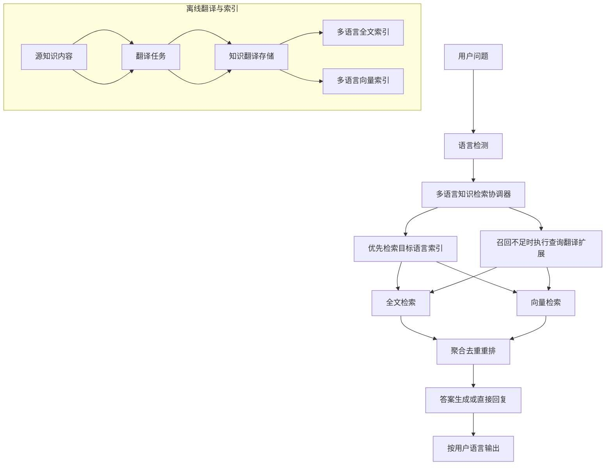

# 知识库国际化咨询实现规划

> 状态：进行中，已完成底座能力，待补齐机器人主链路  
> 创建：2026-07-09  
> 关联 TODO：`TODO-20260514.md` 中“知识库内容支持国际化咨询”任务  
> 适用范围：`faq / text / chunk / webpage`  
> 关联模块：`modules/kbase`、`modules/ai`、`enterprise/core`、`enterprise/ai`

## 0. 背景

当前微语知识库已经具备以下能力：

1. FAQ、Text、Chunk、Webpage 的全文检索。
2. FAQ、Text、Chunk、Webpage 的向量检索。
3. 机器人问答会将多来源知识统一聚合后提供给大模型生成答案。
4. QuickReply 具备独立全文检索，但当前未纳入机器人知识库聚合主链路。
5. 系统已有语言枚举、翻译实体、翻译索引、语言过滤检索等基础能力，但机器人主问答链路尚未形成“自动按访客语言优先回答”的完整闭环。

当前剩余问题不在于“是否支持前端界面国际化”，而在于：

1. 机器人主问答链路尚未默认透传访客语言到知识检索层。
2. `answerWithUserLanguage`、`translateQueryEnabled` 等知识库策略字段已建模，但尚未在机器人主问答链路中实际消费。
3. 查询翻译兜底路径仍停留在规划层，尚未在生产问答主链路中实现。
4. QuickReply 的国际化路径与 FAQ/Text/Chunk/Webpage 不完全一致，当前阶段暂不纳入本期实施范围。

本规划目标是为后续实现提供一套可逐步落地、可灰度、可回滚的技术方案。

## 1. 现状分析

## 1.1 当前检索主链路

当前机器人知识库问答主链路位于：

1. [modules/ai/src/main/java/com/bytedesk/ai/service/KnowledgeBaseSearchHelper.java](modules/ai/src/main/java/com/bytedesk/ai/service/KnowledgeBaseSearchHelper.java)
2. [modules/ai/src/main/java/com/bytedesk/ai/service/BaseSpringAIService.java](modules/ai/src/main/java/com/bytedesk/ai/service/BaseSpringAIService.java)
3. [modules/ai/src/main/java/com/bytedesk/ai/mcp/BytedeskExternalMcpTools.java](modules/ai/src/main/java/com/bytedesk/ai/mcp/BytedeskExternalMcpTools.java)

当前聚合搜索包含：

1. FAQ
2. Text
3. Chunk
4. Webpage

统一被转换为 `FaqProtobuf` 作为大模型上下文。

## 1.2 当前索引模型特点

现有全文索引已经扩展为多语言字段结构：

1. [modules/kbase/src/main/java/com/bytedesk/kbase/llm_faq/elastic/FaqElastic.java](modules/kbase/src/main/java/com/bytedesk/kbase/llm_faq/elastic/FaqElastic.java)
2. [modules/kbase/src/main/java/com/bytedesk/kbase/llm_text/elastic/TextElastic.java](modules/kbase/src/main/java/com/bytedesk/kbase/llm_text/elastic/TextElastic.java)
3. [modules/kbase/src/main/java/com/bytedesk/kbase/llm_chunk/elastic/ChunkElastic.java](modules/kbase/src/main/java/com/bytedesk/kbase/llm_chunk/elastic/ChunkElastic.java)
4. [modules/kbase/src/main/java/com/bytedesk/kbase/llm_webpage/elastic/WebpageElastic.java](modules/kbase/src/main/java/com/bytedesk/kbase/llm_webpage/elastic/WebpageElastic.java)

补充说明：QuickReply 当前保留独立检索能力，但不作为本期国际化咨询主链路改造对象。

当前特点：

1. 仍以 `question / answer / title / content` 为核心字段。
2. 使用 `ik_max_word / ik_smart` 作为中文全文检索分词器。
3. 已补充 `language`、`sourceLanguage`、`translated`、`sourceUid`、`sourceType` 等多语言索引字段。
4. 向量索引已补充语言维度，并可按语言过滤检索。

## 1.3 当前语言能力边界

已有语言相关基础：

1. [modules/core/src/main/java/com/bytedesk/core/enums/LanguageEnum.java](modules/core/src/main/java/com/bytedesk/core/enums/LanguageEnum.java)
2. [modules/kbase/src/main/java/com/bytedesk/kbase/kbase/KbaseEntity.java](modules/kbase/src/main/java/com/bytedesk/kbase/kbase/KbaseEntity.java)
3. [enterprise/core/src/main/java/com/bytedesk/core/translate/TranslateRestService.java](enterprise/core/src/main/java/com/bytedesk/core/translate/TranslateRestService.java)

补充说明：`KbaseEntity` 目前已补充 `sourceLanguage`、`targetLanguages`、`autoTranslateEnabled`、`translateQueryEnabled`、`answerWithUserLanguage` 等知识库级配置；但其中部分策略字段仍未在机器人主问答链路中真正生效。

## 1.5 当前代码实现结论

结合当前代码，现状可以概括为：

1. 已完成统一翻译实体、翻译管理接口、翻译成功后的自动全文/向量重建。
2. 已完成 FAQ / Text / Chunk / Webpage 的 translated companion docs 与 companion vectors 建模。
3. 已完成全文检索和向量检索的语言过滤能力，以及 `preferredLanguages` 的回退式搜索实现。
4. 已完成历史 `SUCCESS` 翻译记录的全文/向量回灌入口。
5. MCP / 测试搜索入口已支持传入 `userLanguage`、`preferredLanguages`、`fallbackLanguages`、`translateQueryEnabled` 等参数。
6. 机器人访客主问答链路仍调用不带语言参数的 `searchKnowledgeBaseWithSources(query, robot)`，尚未自动读取访客语言并传入检索层。
7. `answerWithUserLanguage` 与 `translateQueryEnabled` 当前仍属于“已建模、未完全接线”的状态。

## 1.4 QuickReply 说明（当前阶段暂缓）

QuickReply 与 FAQ/Text/Chunk/Webpage 有两个不同点：

1. 它首先服务于人工客服快捷回复，而不是纯机器人知识检索。
2. 它可能承载文本、FAQ、文章、附件、图片、卡片等结构化消息内容。

因此 QuickReply 在当前阶段不纳入本期国际化咨询实施范围。后续若要推进，应先完成多语言内容模型和客服端使用闭环，再单独评估是否纳入机器人自动回答。

## 2. 目标

## 2.1 业务目标

使微语知识库支持国际化咨询，满足以下场景：

1. 用户使用日语、英语、韩语等语言咨询。
2. 系统可以优先检索对应语言的知识内容。
3. 若目标语言知识缺失，系统可以自动回退到源语言或中英文扩展检索。
4. 返回答案时优先输出目标语言结果。
5. 后续支持管理员一键生成、审核、重建多语言知识内容。

## 2.2 技术目标

1. 建立统一的知识多语言存储模型。
2. 建立统一的多语言全文索引与向量索引策略。
3. 检索链路携带用户语言、知识源语言、目标语言信息。
4. 支持离线翻译主路径 + 查询时翻译兜底路径。
5. 保持对现有单语言知识库的兼容，不强制一次性迁移全部数据。

## 3. 方案选型

## 3.1 方案 A：查询时翻译意图，检索后再翻译答案

流程：

1. 检测用户语言。
2. 将用户问题翻译为知识库主语言，必要时扩展为中英文关键词。
3. 用翻译后的查询词检索现有知识库。
4. 将命中的答案翻译为用户语言输出。

优点：

1. 改动小。
2. 存储成本低。
3. 初期可快速上线。

缺点：

1. 每次咨询都要额外翻译，延迟高。
2. 关键词翻译可能损失领域术语，影响召回准确率。
3. FAQ 相似问法、短句、QuickReply 等短文本命中率不稳定。
4. 无法对翻译结果做审核和长期复用。

## 3.2 方案 B：知识库内容离线翻译成多语言，按语言检索

流程：

1. 知识录入或更新后，异步翻译成目标语言。
2. 为每种语言建立独立索引文档或独立语言版本。
3. 用户咨询时优先按用户语言直接检索。
4. 缺失时再回退到源语言。

优点：

1. 检索精度更高。
2. 响应更快。
3. 可审核、可缓存、可重建。
4. 更适合 FAQ/Text/Chunk/Webpage 的正式知识资产。

缺点：

1. 实现成本高于方案 A。
2. 需要处理翻译增量更新、失效、重建索引。
3. 需要新增管理与状态模型。

## 3.3 推荐方案：混合方案

推荐采用“离线翻译为主，查询时翻译兜底”的混合方案。

### 主路径

1. 对 FAQ、Text、Chunk、Webpage 生成多语言版本。
2. 按用户语言优先检索目标语言索引。
3. 优先返回已翻译且已审核的目标语言内容。

### 兜底路径

1. 若目标语言知识缺失或召回不足，则将查询扩展为：
   - 用户原文
   - 中文关键词
   - 英文关键词
   - 知识库源语言关键词
2. 对扩展查询执行全文/向量混合检索。
3. 最终答案统一按用户语言输出。

### 选择理由

1. 兼顾体验与工程成本。
2. 兼容现有知识库存量数据。
3. 可先从部分语言、部分知识类型灰度。
4. 能有效覆盖“内容未预翻译”的长尾问题。

## 4. 总体架构

## 5. 数据模型设计

## 5.1 不建议的方案

不建议直接在每个实体中增加：

1. `questionEn / questionJa / questionKo`
2. `answerEn / answerJa / answerKo`
3. `contentEn / contentJa / contentKo`

原因：

1. 字段会快速膨胀。
2. 不利于支持任意语言扩展。
3. 各实体重复实现同一套翻译状态管理。
4. 不利于统一审核和统一重建索引。

## 5.2 推荐新增统一翻译实体

建议新增统一翻译实体，例如：

`KbaseTranslationEntity`

建议字段：

1. `uid`
2. `orgUid`
3. `kbUid`
4. `sourceType`：FAQ / TEXT / CHUNK / WEBPAGE（当前阶段）
5. `sourceUid`
6. `sourceLanguage`
7. `targetLanguage`
8. `translated`
9. `reviewStatus`
10. `translationStatus`
11. `sourceHash`
12. `provider`
13. `model`
14. `title`
15. `question`
16. `answer`
17. `content`
18. `description`
19. `similarQuestions`
20. `tagList`
21. `attachments`
22. `images`
23. `extraJson`

### 设计原则

1. 统一承载所有知识类型的翻译结果。
2. 允许某些字段为空，由 `sourceType` 决定实际使用哪些字段。
3. `sourceHash` 用于判断源内容变化后是否需要重新翻译。
4. `reviewStatus` 用于区分自动翻译、人工审核通过、人工驳回。

## 5.3 源实体建议新增的最小字段

在 FAQ/Text/Chunk/Webpage 源实体中，建议只补最少字段：

1. `sourceLanguage`
2. `i18nEnabled`
3. `translationStatus`
4. `translationUpdatedAt`

或者第一阶段更保守：

1. 只在 `KbaseEntity` 上配置 `sourceLanguage / targetLanguages / autoTranslateEnabled`
2. 单条内容不额外加字段，仅通过翻译表判断状态

推荐第一阶段先走知识库级配置，降低改动面。

## 6. 索引设计

## 6.1 全文索引设计

建议每个语言版本生成一条独立索引文档，而不是把所有语言塞进同一文档。

示例字段：

1. `uid`：建议 `${sourceUid}_${language}`
2. `sourceUid`
3. `sourceType`
4. `language`
5. `sourceLanguage`
6. `translated`
7. `kbUid`
8. `orgUid`
9. `categoryUid`
10. `enabled`
11. `question / title / answer / content / description / similarQuestions / tagList`

### 原因

1. 检索时可以直接按 `language` 过滤。
2. 便于重建某一语言版本索引。
3. 便于多语言独立打分与统计。
4. 与现有 `KbaseElasticIndexUpgradeService` 的重建模式兼容。

## 6.2 向量索引设计

建议每个语言版本同样独立建立向量文档。

示例新增字段：

1. `sourceUid`
2. `language`
3. `sourceLanguage`
4. `translated`

### 注意事项

1. 不同语言文本应重新生成 embedding，不应复用源语言向量。
2. 若未来不同语言使用不同 embedding provider/model，需要在元数据中保留来源。

## 6.3 索引升级策略

现有 [modules/kbase/src/main/java/com/bytedesk/kbase/elastic/KbaseElasticIndexUpgradeService.java](modules/kbase/src/main/java/com/bytedesk/kbase/elastic/KbaseElasticIndexUpgradeService.java) 已具备全文索引检查与重建入口。

后续建议：

1. 在该服务基础上扩展语言字段检查。
2. 增加多语言索引映射校验。
3. 对旧索引执行重建与数据回填。
4. 保持与当前 IK 分词升级流程一致。

## 6.4 历史翻译回灌入口

对于已经存在 `SUCCESS` 翻译记录、但尚未落入全文或向量索引的历史数据，建议提供统一回灌入口，而不是要求业务侧逐条触发内容更新。

当前实现已补充：

1. 接口：`POST /api/v1/kbase/translation/backfill-indexes`
2. 入口控制器：[modules/kbase/src/main/java/com/bytedesk/kbase/kbase/KbaseRestController.java](modules/kbase/src/main/java/com/bytedesk/kbase/kbase/KbaseRestController.java)
3. 编排服务：[modules/kbase/src/main/java/com/bytedesk/kbase/translation/KbaseTranslationIndexBackfillService.java](modules/kbase/src/main/java/com/bytedesk/kbase/translation/KbaseTranslationIndexBackfillService.java)
4. 请求模型：[modules/kbase/src/main/java/com/bytedesk/kbase/translation/KbaseTranslationBackfillRequest.java](modules/kbase/src/main/java/com/bytedesk/kbase/translation/KbaseTranslationBackfillRequest.java)

建议请求参数：

1. `kbUid`：可选，空值表示对全部知识库执行。
2. `sourceTypes`：可选，当前建议支持 `FAQ / TEXT / CHUNK / WEBPAGE`。
3. `includeFulltext`：是否重建全文 translated companion docs。
4. `includeVector`：是否重建向量 translated companion docs。

设计原则：

1. 复用现有 `updateAllIndex` / `updateAllVectorIndex` 能力，避免额外维护一套翻译索引流水线。
2. translated 文档按 `sourceUid + language` 形成 companion 版本，不覆盖源语言文档。
3. 检索侧继续按 `sourceUid` 聚合，避免把翻译版本当成新的独立知识。
4. 当前阶段仅覆盖 FAQ / Text / Chunk / Webpage；QuickReply 不在本回灌入口的实施范围内。

适用场景：

1. 新增 translated 索引字段后，需要一次性把历史 `SUCCESS` 翻译补入索引。
2. 索引重建后，需要恢复 translated companion docs/vectors。
3. 某知识库新增目标语言后，需要按知识库维度批量补建历史翻译索引。

## 7. 检索链路设计

## 7.1 搜索请求字段现状

以下入口当前已部分补充：

1. [modules/ai/src/main/java/com/bytedesk/ai/mcp/dto/McpKnowledgeSearchRequest.java](modules/ai/src/main/java/com/bytedesk/ai/mcp/dto/McpKnowledgeSearchRequest.java)
2. 机器人内部搜索上下文。
3. 访客端机器人请求对象。

当前已存在或已接入的参数：

1. `userLanguage`
2. `preferredLanguages`
3. `sourceLanguage`
4. `translateQueryEnabled`
5. `fallbackLanguages`

当前差距：

1. MCP 搜索入口已支持上述参数。
2. 机器人访客主问答链路尚未把访客语言转换为 `preferredLanguages` 传入 `KnowledgeBaseSearchHelper`。
3. `translateQueryEnabled` 还未驱动“查询翻译扩展”逻辑。

## 7.2 检索优先级

建议检索策略：

1. 先查 `userLanguage`。
2. 若命中不足，再查 `sourceLanguage`。
3. 若仍不足，执行查询翻译扩展：
   - 用户原文
   - 中文关键词
   - 英文关键词
   - 源语言关键词
4. 对各语言结果聚合去重重排。

当前实现状态：

1. `preferredLanguages` 顺序回退检索已经在 `KnowledgeBaseSearchHelper` 中实现。
2. 全文与向量检索均支持按单语言逐次回退命中后停止。
3. 查询翻译扩展尚未实现。
4. 机器人主链路尚未自动构造 `preferredLanguages`。

## 7.3 全文检索策略

在现有全文检索中增加语言过滤条件，优先限定：

1. `kbUid`
2. `language`
3. `enabled`
4. `categoryUid`

对于没有翻译版本的旧数据，允许回退搜索源语言文档。

## 7.4 向量检索策略

建议优先使用目标语言向量索引检索；若目标语言数据不足，则回退源语言向量检索。

原因：

1. 向量召回和语言强相关。
2. 直接拿日语问题搜索中文向量，召回稳定性不如翻译后或多语言向量本地化。

## 7.5 结果聚合策略

建议聚合时新增以下考虑因素：

1. 同一 `sourceUid` 的不同语言版本去重。
2. 目标语言版本分数加权优先。
3. 已审核翻译高于未审核自动翻译。
4. 结构化 FAQ 可适当高于 Chunk 原文切片。

## 8. 各知识类型实施建议

## 8.1 FAQ

优先级最高，建议第一阶段就支持。

需翻译字段：

1. `question`
2. `similarQuestions`
3. `answer`
4. `answerHtml`
5. `answerMarkdown`
6. `tagList`

说明：FAQ 最依赖语言匹配质量，也是国际化咨询最直接受益的数据类型。

## 8.2 Text

建议第一阶段支持。

需翻译字段：

1. `title`
2. `content`
3. `tagList`

## 8.3 Chunk

建议第一阶段支持，但采用“先切块，再翻译 chunk”的路径。

原因：

1. 便于和源文档片段一一对应。
2. 便于引用定位。
3. 便于增量更新。

## 8.4 Webpage

建议第一阶段支持。

需翻译字段：

1. `title`
2. `description`
3. `content`

保留原始 `url` 不变。

## 8.5 QuickReply（后续可选阶段）

当前阶段暂不实施 QuickReply 国际化。后续若单独立项，建议优先支持“客服端多语言快捷回复”，不直接并入机器人 RAG。

需翻译字段：

1. `title`
2. 文本型 `content`
3. `tagList`

对于结构化消息：

1. 只翻译其中可翻译的文本字段。
2. 不改变消息类型与结构。
3. 保持附件、图片、卡片、链接等引用不变。

## 9. 翻译流程设计

## 9.1 离线翻译触发时机

建议在以下时机触发翻译任务：

1. 内容首次创建。
2. 内容更新且 `sourceHash` 变化。
3. 知识库新增目标语言。
4. 管理员手动点击“一键翻译”或“重新翻译”。
5. 索引重建时发现翻译版本缺失。

## 9.2 翻译任务状态

建议状态：

1. `NEW`
2. `PENDING`
3. `PROCESSING`
4. `SUCCESS`
5. `PARTIAL_SUCCESS`
6. `FAILED`
7. `REVIEW_PENDING`
8. `APPROVED`
9. `REJECTED`

## 9.3 翻译服务策略

当前仓库已有翻译模块基础能力，后续建议：

1. 第一阶段兼容现有翻译服务。
2. 第二阶段优先将知识库翻译切换为大模型翻译能力。
3. 对翻译结果进行缓存与幂等控制。
4. 支持术语保护和品牌名保护。

## 9.4 术语保护

知识库翻译与普通 UI 文案翻译不同，需要保护以下内容：

1. 产品名
2. 品牌名
3. 命令字
4. API 名称
5. 工单状态码
6. 业务专有术语

后续可结合 glossary/术语表统一治理。

## 10. 管理后台与运营能力

建议后续在管理后台增加以下能力：

1. 知识库语言配置。
2. 目标语言列表配置。
3. 一键翻译。
4. 重新翻译。
5. 翻译进度查看。
6. 翻译结果预览与审核。
7. 仅发布已审核翻译。
8. 查询时语言策略配置。

建议支持的策略开关：

1. 仅目标语言检索。
2. 目标语言优先，自动回退源语言。
3. 目标语言优先，开启查询翻译扩展。
4. 回答时强制输出用户语言。

## 11. 分阶段实施计划

## 阶段 1：打基础

目标：建立统一数据模型和最小搜索参数。

完成情况：已基本完成。

已完成：

1. 新增知识库国际化配置模型。
2. 新增统一翻译实体与仓储。
3. 为搜索请求补充语言参数。
4. 为索引模型补充 `language / sourceUid / sourceLanguage / translated` 字段。
5. 扩展索引升级服务，支持多语言映射检查与重建。

阶段结果：

1. 系统具备保存多语言知识内容的能力。
2. 系统具备建立多语言索引的基础结构。

## 阶段 2：FAQ/Text/Webpage 多语言闭环

目标：先打通最常用内容类型。

完成情况：部分完成。

已完成：

1. FAQ 离线翻译与索引。
2. Text 离线翻译与索引。
3. Webpage 离线翻译与索引。

待完成：

4. 机器人主问答链路按访客语言自动构造 `preferredLanguages` 并优先检索。
5. 回答时按用户语言输出的主链路接线。

阶段结果：

1. 多语言索引与检索底层已具备，机器人国际化咨询闭环尚差主链路接线。

## 阶段 3：Chunk 多语言与混合检索增强

目标：提升 RAG 长文档问答质量。

完成情况：部分完成。

已完成：

1. chunk 翻译与多语言向量索引。
2. 多语言全文 + 向量混合检索基础能力。

待完成：

3. 召回不足时查询翻译扩展。
4. 增加更明确的多语言重排逻辑与策略开关落地。

阶段结果：

1. 长文档知识的多语言问答质量显著提升。

## 阶段 4：QuickReply 国际化（暂缓）

目标：在 FAQ/Text/Chunk/Webpage 国际化稳定后，再评估是否打通客服端快捷回复的多语言素材能力。

任务：

1. 支持 QuickReply 多语言翻译存储。
2. 客服端按会话语言推荐快捷回复。
3. 对结构化消息内容做局部文本翻译。
4. 单独评估是否将部分 QuickReply 纳入机器人可检索来源。

阶段结果：

1. 客服人工接待与机器人接待的国际化能力开始协同。

## 阶段 5：运营与审核增强

目标：把国际化能力从“能跑”升级为“可运营”。

任务：

1. 翻译审核工作流。
2. 术语表保护。
3. 命中质量统计。
4. 多语言搜索测试工具。
5. 多语言知识质量报表。

## 12. 关键风险与应对

## 12.1 翻译质量风险

风险：自动翻译可能造成术语误译、政策误译、承诺误译。

应对：

1. 高风险知识类型支持人工审核后发布。
2. 引入术语保护表。
3. 高风险业务优先使用标准 FAQ 而不是自由生成。

## 12.2 索引膨胀风险

风险：每种语言一份索引文档，会显著增加 ES 与向量存储体积。

应对：

1. 支持按知识库配置目标语言，而非全语言默认开启。
2. 先从高频语言灰度。
3. 按内容热度或发布时间控制翻译范围。

## 12.3 更新一致性风险

风险：源文档更新后，翻译内容和索引版本滞后。

应对：

1. 使用 `sourceHash` 做变化检测。
2. 源文档更新后将翻译状态置为待重建。
3. 回答时优先使用最新可用版本，必要时回退源语言。

## 12.4 多语言向量成本风险

风险：每种语言重建 embedding，成本明显升高。

应对：

1. 第一阶段先以全文检索为主，向量检索逐步扩展。
2. 仅对 FAQ/Chunk 等高价值内容优先构建目标语言向量。

## 13. 建议的首批落地范围

若要尽快开始实现，建议首批范围控制在：

1. FAQ
2. Text
3. Webpage
4. 搜索请求语言参数
5. 统一翻译实体
6. 多语言全文索引
7. 回答按用户语言输出

暂缓：

1. QuickReply 国际化与并入机器人 RAG
2. 全量 chunk 多语言向量
3. 全语言自动批量翻译
4. 复杂审核工作流

这样可以先验证：

1. 数据模型是否合理。
2. 检索语言策略是否有效。
3. 国际化咨询的命中率是否提升。

## 14. 结论

本规划建议采用：

1. 离线多语言知识生成作为主路径。
2. 查询时翻译扩展作为兜底路径。
3. FAQ/Text/Webpage 先行。
4. Chunk 作为第二批增强。
5. QuickReply 暂不纳入本期范围，后续如推进，先走客服端多语言素材能力，再评估是否纳入机器人检索主链路。

该方案的核心优势是：

1. 对现有架构侵入相对可控。
2. 能兼容当前单语言知识库存量。
3. 可分阶段灰度上线。
4. 后续容易与翻译审核、术语治理、知识运营报表联动。

当前无需再从零拆分第一阶段任务，建议直接进入“剩余缺口收尾”模式。

## 15. 剩余执行计划

本节基于当前代码现状，列出后续应继续推进的最小闭环任务，而不是重复已经完成的底座建设。

## 15.1 当前剩余范围

当前建议优先包含：

1. 机器人访客主链路语言透传。
2. `answerWithUserLanguage` 策略接线。
3. `translateQueryEnabled` 查询翻译兜底实现。
4. 多语言回答策略与回退策略验证。

当前仍不包含：

1. 管理后台一键翻译页面。
2. QuickReply 国际化及并入机器人 RAG。
3. 多语言向量索引重建大规模优化。
4. 翻译审核工作流。
5. 全量历史知识自动翻译调度平台化。

## 15.2 剩余任务拆解

### 任务 A：机器人主链路语言透传

目标：让访客机器人问答真正使用语言优先检索能力。

建议动作：

1. 从访客、线程或请求上下文读取语言。
2. 构造 `preferredLanguages` 并传给 `KnowledgeBaseSearchHelper`。
3. 保持未传语言时现有行为不变。

涉及文件：

1. [modules/ai/src/main/java/com/bytedesk/ai/robot/RobotService.java](modules/ai/src/main/java/com/bytedesk/ai/robot/RobotService.java)
2. [modules/ai/src/main/java/com/bytedesk/ai/service/BaseSpringAIService.java](modules/ai/src/main/java/com/bytedesk/ai/service/BaseSpringAIService.java)
3. [modules/ai/src/main/java/com/bytedesk/ai/service/KnowledgeBaseSearchHelper.java](modules/ai/src/main/java/com/bytedesk/ai/service/KnowledgeBaseSearchHelper.java)

### 任务 B：`answerWithUserLanguage` 策略落地

目标：让知识库配置中的“按用户语言回答”从配置字段变为实际行为。

建议动作：

1. 明确该字段控制的是“优先返回目标语言命中结果”还是“未命中时对答案做翻译”。
2. 在 `BaseSpringAIService` / prompt 构造链路接入该策略。
3. 补充最小回归测试或搜索测试用例。

涉及文件：

1. [modules/kbase/src/main/java/com/bytedesk/kbase/kbase/KbaseEntity.java](modules/kbase/src/main/java/com/bytedesk/kbase/kbase/KbaseEntity.java)
2. [modules/ai/src/main/java/com/bytedesk/ai/service/BaseSpringAIService.java](modules/ai/src/main/java/com/bytedesk/ai/service/BaseSpringAIService.java)
3. [modules/ai/src/main/java/com/bytedesk/ai/service/PromptHelper.java](modules/ai/src/main/java/com/bytedesk/ai/service/PromptHelper.java)

### 任务 C：查询翻译兜底路径

目标：落实规划中的“离线翻译为主，查询翻译兜底”。

建议动作：

1. 当目标语言召回不足时，按策略扩展查询。
2. 初期可先支持“用户原文 + 源语言翻译词”。
3. 结合 `translateQueryEnabled` 做开关控制。

涉及文件：

1. [modules/ai/src/main/java/com/bytedesk/ai/mcp/dto/McpKnowledgeSearchRequest.java](modules/ai/src/main/java/com/bytedesk/ai/mcp/dto/McpKnowledgeSearchRequest.java)
2. [modules/ai/src/main/java/com/bytedesk/ai/mcp/BytedeskExternalMcpTools.java](modules/ai/src/main/java/com/bytedesk/ai/mcp/BytedeskExternalMcpTools.java)
3. [modules/ai/src/main/java/com/bytedesk/ai/service/KnowledgeBaseSearchHelper.java](modules/ai/src/main/java/com/bytedesk/ai/service/KnowledgeBaseSearchHelper.java)
4. [modules/ai/src/main/java/com/bytedesk/ai/service/BaseSpringAIService.java](modules/ai/src/main/java/com/bytedesk/ai/service/BaseSpringAIService.java)

### 任务 D：检索结果多语言排序与验证

目标：让目标语言结果在混合召回时稳定优先。

建议动作：

1. 在聚合与去重阶段显式提高目标语言命中优先级。
2. 为 FAQ / Text / Chunk / Webpage 各准备至少一条跨语言验证用例。
3. 确认 translated companion doc 不会在前台表现为重复答案。

涉及文件：

1. [modules/ai/src/main/java/com/bytedesk/ai/service/KnowledgeBaseSearchHelper.java](modules/ai/src/main/java/com/bytedesk/ai/service/KnowledgeBaseSearchHelper.java)
2. [modules/ai/src/main/java/com/bytedesk/ai/kbase/KbSearchTestController.java](modules/ai/src/main/java/com/bytedesk/ai/kbase/KbSearchTestController.java)

## 15.3 建议实施顺序

1. 先把机器人主链路语言透传接上。
2. 再让 `answerWithUserLanguage` 在问答行为中真正生效。
3. 然后补 `translateQueryEnabled` 兜底能力。
4. 最后做排序策略和回归验证。

原因：

1. 这些步骤都建立在现有底层索引与翻译能力之上，不需要再动底座。
2. 先接主链路，再做策略增强，风险最小。

## 15.4 更新后的验收标准

完成标志建议调整为：

1. 访客机器人问答可自动读取语言并优先检索对应语言知识。
2. 不传语言参数时，旧问答链路行为保持兼容。
3. `answerWithUserLanguage` 至少在“优先使用目标语言命中结果”层面可见生效。
4. `translateQueryEnabled` 可控制召回不足时的查询扩展。
5. FAQ / Text / Chunk / Webpage 至少各有一条跨语言搜索验证通过。

## 15.5 建议验证方式

建议顺序：

1. 先对 `modules/ai` 做窄范围 compile。
2. 再用 `KbSearchTestController` 或 MCP 搜索接口验证 `preferredLanguages` 命中顺序。
3. 再验证访客机器人链路在带语言上下文时确实命中目标语言翻译内容。
4. 最后验证未传语言参数时行为不回归。

## 15.6 当前优先级结论

当前优先级应从“继续建设底层模型”切换为“补齐机器人主链路和策略接线”。

最高优先的三个动作：

1. 把访客语言传进 `KnowledgeBaseSearchHelper`。
2. 让 `answerWithUserLanguage` 真正参与回答策略。
3. 实现 `translateQueryEnabled` 的查询扩展兜底。
