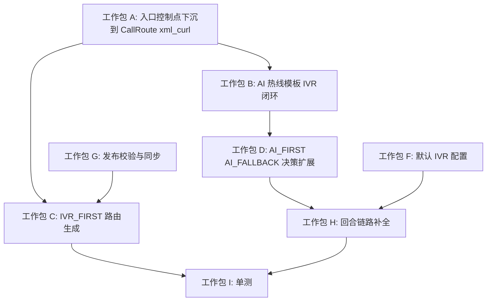

# ExtensionEntity.extensionNumber 转 IVR 实施规划

> 日期：2026-07-24
> 状态：**已完成**（首期实现完毕）
> 关联 TODO：[TODO-2026.md](../../TODO-2026.md) 第 30-31 行

---

## 0. 当前现状速览

| 组件 | 状态 | 说明 |
| ------ | ------ | ------ |
| `ExtensionSettingsIvrEntity` | ✅ 已创建 | `enabled`, `ivrMode`, `ivrMenuUid`, `noInputAction`, `noMatchAction`, `allowReturnToAi`, `maxRetryCount` |
| `ExtensionSettingsEntity.ivrSettings / draftIvrSettings` | ✅ 已创建 | `@ManyToOne` 关联，含 `getActiveIvrSettings()` / `ensureIvrSettings()` |
| 前端 `ExtensionSettingsIvrTab.tsx` | ✅ 已创建 | ProForm 表单：启用开关、IVR 模式、IVR 菜单选择、无输入/未命中动作、允许返回 AI、最大重试次数 |
| `QwenRealtimeVoiceAgentService.resolveIvrDecision()` | ⚠️ 仅 AI_FALLBACK_TO_IVR | 只实现了 `noInput/noMatch → REPLAY_IVR` 的降级路径，尚未覆盖 AI_FIRST 的显式转 IVR |
| `HttapiController` IVR 变量导出 | ✅ 已支持 | `bot_ivr_menu_uid` / `bot_ivr_extension_number` 已透传至 FreeSWITCH，供 AI 热线回合制路由使用 |
| `IvrMenuHttapiController` | ✅ 已支持 | 根据 `extensionNumber` 查找 IVR 菜单 → 加载 workflow → 逐节点执行（TTS 播报、收号、转接、挂断） |
| `AiHotlineDialplanTemplateBuilder` | ✅ 已部分支持 | 已支持 `rIVR_MENU` 子路由，并会把 `${bot_ivr_extension_number}` transfer 回同 context |
| `AiHotlineRouteSyncService` | ⚠️ 入口策略未区分 IVR 模式 | 目前只会为合格分机生成 `AI_HOTLINE` 路由，尚未根据 `ivrMode` 生成 `IVR_MENU` 或混合入口 |
| `CallRouteDialplanXmlCurlProvider` | ✅ 已支持 | `CallRouteTargetTypeEnum.IVR_MENU` 已可直接转到 `IvrMenuEntity.extensionNumber` |
| `ExtensionSettingsRestService.validatePublishable()` | ⚠️ 已有基础校验 | 已校验 `ivrMenuUid` 存在、同组织、未删除；还需补 `workflowUid` / `extensionNumber` 完整性校验 |
| `ExtensionSettingsEventListener` | ✅ 已支持 | ExtensionSettings 更新提交后会触发 `AiHotlineRouteSyncService.syncForSettings()` 并清 `extension` cache |
| `VoiceAgentResponse.NextActionType` | ✅ 已有 `IVR_MENU` | 枚举已定义，但运行时链路未闭环 |

---

## 1. 目标：三种 IVR 模式全覆盖

用户拨打分机号（如 `9205`）后，根据分机绑定的 `ExtensionSettingsEntity.ivrSettings.ivrMode`，呈现三种不同行为：

```text
                         用户拨打 extensionNumber
                                   │
                                   ▼
                    ┌──────────────────────────────┐
                    │ CallRoute / xml_curl 入口层    │
                    │ + ExtensionSettings 运行策略   │
                    └──────────────────────────────┘
                                   │
                    ┌──────────────┼──────────────┐
                    ▼              ▼              ▼
              IVR_FIRST       AI_FIRST      AI_FALLBACK_TO_IVR
              (= 新实现)     (= 当前行为     (= 部分实现)
                               + 显式转 IVR)
```

### 1.1 IVR_FIRST（IVR 优先）

**行为**：用户拨号后直接进入 IVR 按键菜单，不经过 AI 语音对话。

```text
用户拨打 extensionNumber（如 5002）
    → CallRoute / xml_curl 命中该分机入口
  → 读取 settings.ivrSettings：
      enabled=true, ivrMode=IVR_FIRST, ivrMenuUid=xxx
    → 路由目标直接生成为 IVR_MENU
    → xml_curl 根据 targetUid 找到 IvrMenuEntity.extensionNumber
    → transfer 到该 IVR 入口分机号
  → IvrMenuHttapiController 接管，执行 workflow：
      TTS 播报主菜单 → 收号 → 转人工/留言/挂断
  → （可选）IVR 流程结束后，若 allowReturnToAi=true，
     可重新转回 AI voice agent 继续对话
```

### 1.2 AI_FIRST（AI 优先 + 显式转 IVR）

**行为**：默认 AI 语音对话，首期通过语义意图词显式触发转入 IVR；DTMF 按键转 IVR 放到二期。

```text
用户拨打 extensionNumber
    → AI_HOTLINE 路由进入 AI voice agent 对话循环（当前行为）
  → 每轮 turn 检查 resolveIvrDecision()：
      - 用户说 "转菜单"/"按键服务"/"IVR" → 触发转 IVR
  → 返回 nextActionType=IVR_MENU + ivrMenuUid + ivrExtensionNumber
  → FreeSWITCH dialplan bot_route=IVR_MENU 分支：
      transfer 到 ivrExtensionNumber
  → IvrMenuHttapiController 接管
  → IVR 结束后：
      - allowReturnToAi=true → transfer 回 AI（重新进入 voice agent 循环）
      - allowReturnToAi=false → 挂断
```

### 1.3 AI_FALLBACK_TO_IVR（AI 降级到 IVR）

**行为**：AI 优先对话，当 AI 无法处理时自动降级到 IVR 菜单（当前已部分实现）。

```text
用户拨打 extensionNumber
    → AI_HOTLINE 路由进入 AI voice agent 对话循环
  → 每轮 turn 检查（当前 resolveIvrDecision 逻辑）：
      - noInput（用户没有说话）→ 按 noInputAction 处理
      - noMatch（知识库未命中）→ 按 noMatchAction 处理
  → 若动作为 REPLAY_IVR 且 ivrMenuUid 已配置：
      返回 nextActionType=IVR_MENU → transfer 到 IVR
  → 若动作为其他（CONTINUE_AI / HUMAN_HANDOFF / LEAVE_MESSAGE / HANGUP）：
      按对应语义执行
```

---

## 2. 实施工作包

### 工作包 A：入口控制点下沉到 CallRoute / xml_curl

> **文件**：`enterprise/call/src/main/java/com/bytedesk/call/call_route/AiHotlineRouteSyncService.java`
>
> **文件**：`enterprise/call/src/main/java/com/bytedesk/call/xml_curl/CallRouteDialplanXmlCurlProvider.java`

当前仓库中，AI 热线分机的正式入口已经不是静态 `92-ai-bot.xml`，而是：

1. `AiHotlineRouteSyncService` 为分机自动生成 `CallRouteTargetTypeEnum.AI_HOTLINE` 路由
2. `CallRouteDialplanXmlCurlProvider` 在 FreeSWITCH 通过 `xml_curl` 查询时，按 `targetType` 下发动态 dialplan
3. `AiHotlineDialplanTemplateBuilder` 负责把 `AI_HOTLINE` 渲染成 entry / loop / rCONTINUE / rACD_ENQUEUE / rLEAVE_MESSAGE / rIVR_MENU / rHANGUP 子路由

因此，**IVR_FIRST 模式的第一控制点不应放在 HttapiController，而应放在“路由生成层”**：

- `IVR_FIRST`：入口路由直接生成 `targetType=IVR_MENU`
- `AI_FIRST` / `AI_FALLBACK_TO_IVR`：入口路由保持 `targetType=AI_HOTLINE`
- 运行时从 AI 转 IVR 时，继续复用 `AiHotlineDialplanTemplateBuilder` 的 `rIVR_MENU` 子路由
- 发布或更新 ExtensionSettings 后，复用现有 `ExtensionSettingsEventListener -> AiHotlineRouteSyncService.syncForSettings()` 路径刷新托管路由

这一步的核心不是“加一个 if”，而是把“分机入口模式”从 AI 回合层前移到 CallRoute 生成层。

### 工作包 B：补齐 AI 热线模板的 IVR 回合闭环

> **文件**：`enterprise/call/src/main/java/com/bytedesk/call/xml_curl/AiHotlineDialplanTemplateBuilder.java`

当前模板生成器已经支持：

- `destinationNumber == hotlineNumber + "rIVR_MENU"`
- `buildIvrTransferActionXml(context)`
- `transfer ${bot_ivr_extension_number} XML context`

因此这里不是从零实现，而是需要做两类补强：

1. 确认 `IVR_MENU` 子路由在所有 AI hotline 入口都可达，而不是只在 9205 静态 XML 场景下生效。
2. 补充进入 IVR 前的上下文变量导出，例如：
   - 原 AI 分机号
   - orgUid
   - 是否允许返回 AI
   - 原 conversationId / callUuid（若后续要追踪跨 AI/IVR 会话）

现有关键片段已经存在：

```xml
<action application="log" data="INFO [AI-HOTLINE] route IVR_MENU extension=${bot_ivr_extension_number} menuUid=${bot_ivr_menu_uid}"/>
<action application="transfer" data="${bot_ivr_extension_number} XML ${context}"/>
```

需要做的是把这条能力纳入正式规划，不再把重点放在静态 `92-ai-bot.xml`。

### 工作包 C：IVR_FIRST 模式的路由生成策略

> **文件**：`enterprise/call/src/main/java/com/bytedesk/call/call_route/AiHotlineRouteSyncService.java`

当前 `AiHotlineRouteSyncService` 的 `buildAiHotlineRouteRequest()` 会无条件生成：

```java
.targetType(CallRouteTargetTypeEnum.AI_HOTLINE.name())
```

这里需要改成按 `settings.getActiveIvrSettings()` 决定入口目标类型：

- `ivrSettings.enabled=true && ivrMode=IVR_FIRST && ivrMenuUid 已配置`
  - 生成 `targetType=IVR_MENU`
  - `targetUid=ivrMenuUid`
    - `targetValue` 可为空，由 `CallRouteDialplanXmlCurlProvider.resolveIvrExtension()` 按 `targetUid -> IvrMenuEntity.extensionNumber` 解析
    - 若管理员显式配置 `targetValue`，`resolveIvrExtension()` 会优先使用 `targetValue`
- 其他模式
  - 继续生成 `targetType=AI_HOTLINE`

**⚠️ 关键依赖**：当前 `syncForExtension()` 里调用的 `isEligibleForAiHotlineRoute()` 硬性要求 `settings.getActiveKnowledgeSettings() != null`，IVR_FIRST 不需要知识库配置，会导致路由生成被阻断。必须同步修改资格校验，让 IVR_FIRST 走独立路径：

```java
private boolean isEligibleForManagedRoute(ExtensionEntity extension, ExtensionSettingsEntity settings) {
    // ... basic extension checks（保持不变）
    if (settings == null || settings.isDeleted() || !Boolean.TRUE.equals(settings.getEnabled())
        || !isCallableSettingsStatus(settings)) {
        return false;
    }
    // IVR_FIRST：不需要 knowledge settings
    ExtensionSettingsIvrEntity ivr = settings.getActiveIvrSettings();
    if (ivr != null && Boolean.TRUE.equals(ivr.getEnabled())
        && ExtensionSettingsIvrModeEnum.IVR_FIRST.name().equalsIgnoreCase(ivr.getIvrMode())
        && StringUtils.hasText(ivr.getIvrMenuUid())) {
        return StringUtils.hasText(extension.getOrgUid()) || StringUtils.hasText(settings.getOrgUid());
    }
    // AI 入口：仍要求 knowledge settings
    if (settings.getActiveKnowledgeSettings() == null) return false;
    return StringUtils.hasText(extension.getOrgUid()) || StringUtils.hasText(settings.getOrgUid());
}
```

同时 `buildAiHotlineRouteRequest()` 需要根据 `ivrMode` 分叉，`syncForExtension()` 中也要改用新的资格校验方法：

```java
private CallRouteRequest buildManagedRouteRequest(ExtensionEntity extension, CallRouteEntity existingRoute) {
    ExtensionSettingsEntity settings = extension.getSettings();
    ExtensionSettingsIvrEntity ivr = settings != null ? settings.getActiveIvrSettings() : null;
    boolean ivrFirst = ivr != null
        && Boolean.TRUE.equals(ivr.getEnabled())
        && ExtensionSettingsIvrModeEnum.IVR_FIRST.name().equalsIgnoreCase(ivr.getIvrMode())
        && StringUtils.hasText(ivr.getIvrMenuUid());

    if (ivrFirst) {
        return baseRoute(extension, existingRoute)
            .targetType(CallRouteTargetTypeEnum.IVR_MENU.name())
            .targetUid(ivr.getIvrMenuUid())
            .targetValue(null)
            .build();
    }

    return baseRoute(extension, existingRoute)
        .targetType(CallRouteTargetTypeEnum.AI_HOTLINE.name())
        .targetValue("DEFAULT")
        .build();
}
```

调用链：`syncForExtension()` → `isEligibleForManagedRoute()`（新）→ `buildManagedRouteRequest()`（新）→ `callRouteRestService.createSystemRoute()`。方法名建议重命名以避免与旧 `AiHotline` 前缀混淆。

这能保证 IVR_FIRST 在**入口层**就成立，不需要先进入 AI 再跳走。

### 工作包 D：AI_FIRST / AI_FALLBACK_TO_IVR 的运行时决策扩展

> **文件**：`enterprise/call/src/main/java/com/bytedesk/call/visitor/QwenRealtimeVoiceAgentService.java`

当前 `resolveIvrDecision()` 仅在 `AI_FALLBACK_TO_IVR` 模式下工作。需要扩展：

1. **支持 AI_FIRST 模式**：除了 fallback 逻辑外，增加显式触发检测。
2. **明确 AI_FALLBACK 的非 REPLAY_IVR 分支语义**：目前配置枚举里有 `HUMAN_HANDOFF / LEAVE_MESSAGE / HANGUP / CONTINUE_AI`，但现有 `resolveIvrDecision()` 只处理 `REPLAY_IVR`，其余动作需要规范落到 `HotlineHandoffDecisionService` 或显式路由语义，而不是只在规划里一笔带过。

```java
private IvrDecision resolveIvrDecision(ExtensionSettingsEntity settings,
        ExtensionSettingsIvrEntity ivrSettings,
        String transcript,
        String kbReplyText,
        HotlineHandoffDecisionResponse handoffDecision) {
    
    if (settings == null || ivrSettings == null || handoffDecision != null) return null;
    if (!Boolean.TRUE.equals(ivrSettings.getEnabled())) return null;
    if (!hasText(ivrSettings.getIvrMenuUid())) return null;
    
    boolean isAiFirst = ExtensionSettingsIvrModeEnum.AI_FIRST.name().equals(ivrSettings.getIvrMode());
    boolean isFallback = ExtensionSettingsIvrModeEnum.AI_FALLBACK_TO_IVR.name().equals(ivrSettings.getIvrMode());
    
    // --- 路径 1：AI_FIRST 模式下的显式触发 ---
    if (isAiFirst) {
        if (containsIvrIntent(transcript)) {
            return resolveIvrMenu(ivrSettings);
        }
        return null;
    }
    
    // --- 路径 2：AI_FALLBACK_TO_IVR 模式的降级逻辑（现有） ---
    if (isFallback) {
        boolean noInput = !hasText(transcript);
        boolean noKbHit = hasText(transcript) && !hasText(kbReplyText);
        if (!noInput && !noKbHit) return null;
        
        String fallbackAction = noInput 
            ? ivrSettings.getNoInputAction() 
            : ivrSettings.getNoMatchAction();
        
        if (shouldTriggerIvr(fallbackAction)) {
            return resolveIvrMenu(ivrSettings);
        }
        // 其他 action（CONTINUE_AI / HUMAN_HANDOFF / LEAVE_MESSAGE / HANGUP）
        return new IvrDecision(fallbackAction, null, null, null);
    }
    
    return null;
}

private boolean containsIvrIntent(String transcript) {
    if (!hasText(transcript)) return false;
    String t = transcript.toLowerCase();
    return t.contains("转菜单") || t.contains("按键服务") || t.contains("ivr") 
        || t.contains("主菜单") || t.contains("返回菜单");
}
```

1. **IVR 转回 AI**：IVR 流程结束后，若 `allowReturnToAi=true`，需要支持从 IVR workflow 显式 transfer 回 AI 分机入口。

> 可通过 `IvrMenuHttapiController` 的 workflow 节点中的 `transfer` 动作实现：
>
> - 目标：transfer 回原分机号（AI 模式），并在 dialplan 中设置 `voice_agent=1` 继续 AI 对话
> - 或者：由 IVR workflow 的 `END` 节点在 `allowReturnToAi=true` 时发起 transfer

### 工作包 E：DTMF 方案收敛

> **文件**：`enterprise/call/src/main/java/com/bytedesk/call/xml_curl/AiHotlineDialplanTemplateBuilder.java`

当前 AI voice agent 回合制链路中，FreeSWITCH 的 `record` 动作并不天然把 DTMF 交给 Java。这里需要先收敛方案，再决定是否修改 Java 入参模型。

建议分两阶段：

1. **首期**：只做语义触发，不做 DTMF 透传。这样可以先把 AI_FIRST / AI_FALLBACK / IVR_FIRST 三种模式的核心闭环跑通。
2. **二期**：若确实要支持 `* / 0` 进 IVR，再单独在模板生成器里补 `bind_digit_action` 或替换录音方案。

之所以建议推迟 DTMF，是因为当前仓库没有现成的“AI hotline record + DTMF + 继续回合”稳定基线，把它和本次 IVR 模式切换绑在一起，风险会明显放大。

### 工作包 F：ExtensionSettings 默认 IVR 配置初始化

> **文件**：`enterprise/call/src/main/java/com/bytedesk/call/extension_settings/ExtensionSettingsInitializer.java`

为默认组织创建 IVR 设置默认值，确保新建分机时 `ExtensionSettingsIvrEntity` 可用：

```java
// 在 initDefaultSettings() 中补充
ExtensionSettingsIvrEntity ivrSettings = ExtensionSettingsIvrEntity.builder()
    .enabled(false)         // 默认不启用 IVR
    .ivrMode(ExtensionSettingsIvrModeEnum.AI_FIRST.name())
    .noInputAction(ExtensionSettingsIvrNoInputActionEnum.CONTINUE_AI.name())
    .noMatchAction(ExtensionSettingsIvrNoMatchActionEnum.CONTINUE_AI.name())
    .allowReturnToAi(true)
    .maxRetryCount(2)
    .build();
```

### 工作包 G：ExtensionSettings 发布流程中 IVR 引用校验增强

> **文件**：`enterprise/call/src/main/java/com/bytedesk/call/extension_settings/ExtensionSettingsRestService.java`

当前 `publish()` 已通过 `validatePublishable()` 做了 IVR 基础校验：

- `ivrSettings.enabled=true` 时要求 `ivrMenuUid` 非空
- `ivrMenuUid` 必须能查到 `IvrMenuEntity`
- IVR 菜单必须与 ExtensionSettings 同组织
- IVR 菜单不能已删除

需要增强的是运行时完整性校验，避免发布后可以选中一个“存在但不可执行”的 IVR 菜单。建议直接在现有 `validatePublishable(ExtensionSettingsEntity entity)` 的 IVR 分支中补充，而不是新增一套脱离 `entity` 上下文的校验方法：

```java
private void validatePublishable(ExtensionSettingsEntity entity) {
    // ... existing knowledge/routing validation
    ExtensionSettingsIvrEntity ivr = entity.getDraftIvrSettings() != null
        ? entity.getDraftIvrSettings()
        : entity.getIvrSettings();

    if (ivr == null || !Boolean.TRUE.equals(ivr.getEnabled())) return;
    if (!StringUtils.hasText(ivr.getIvrMenuUid())) {
        throw new RuntimeException("启用 IVR 时必须选择 IVR 菜单");
    }
    IvrMenuEntity ivrMenu = ivrMenuRepository.findByUid(ivr.getIvrMenuUid())
        .orElseThrow(() -> new RuntimeException("IVR 菜单不存在: " + ivr.getIvrMenuUid()));
    validateSameOrg(entity.getOrgUid(), ivrMenu.getOrgUid(), "ivrMenuUid");
    validateNotDeleted(ivrMenu.isDeleted(), "ivrMenuUid");
    if (!StringUtils.hasText(ivrMenu.getWorkflowUid())) {
        throw new RuntimeException("IVR 菜单未绑定工作流: " + ivrMenu.getUid());
    }
    if (!StringUtils.hasText(ivrMenu.getExtensionNumber())) {
        throw new RuntimeException("IVR 菜单未配置入口分机号: " + ivrMenu.getUid());
    }

    // ... remaining validation
}
```

同时需要补测：发布后 `ExtensionSettingsUpdateEvent` 已能触发 `AiHotlineRouteSyncService.syncForSettings()`，当 `ivrMode` 从 `AI_FIRST` 改为 `IVR_FIRST` 时，托管路由应从 `AI_HOTLINE` 更新为 `IVR_MENU`，并刷新 dialplan cache。

### 工作包 H：VoiceAgentResponse IVR_MENU 链路补全

> **文件**：`modules/call/src/main/java/com/bytedesk/call/httapi/HttapiController.java`
>
> **文件**：`enterprise/call/src/main/java/com/bytedesk/call/xml_curl/AiHotlineDialplanTemplateBuilder.java`

当前 `secondTurnVoiceAgent()` 已经导出 `bot_ivr_menu_uid` 和 `bot_ivr_extension_number` 变量，`AiHotlineDialplanTemplateBuilder` 也已经定义了 `rIVR_MENU` 子路由。这里需要做的是把两端用例补齐并确认变量在 xml_curl 动态路由下完整流动。

需要确认：

- `bot_route=IVR_MENU` 时，AI hotline 模板下发的 `rIVR_MENU` 子路由能正确读取 `bot_ivr_extension_number` 并执行 transfer
- IVR transfer 后，新通道能正确命中当前 context 中的 IVR 分机路由，而不是错误假设只有 `public` context 可用
- 若后续支持 `allowReturnToAi=true`，要补齐 IVR → AI 回流所需的 channel variables

### 工作包 I：单元测试覆盖

> 新增测试文件：`enterprise/call/src/test/java/com/bytedesk/call/visitor/QwenRealtimeVoiceAgentServiceIvrTest.java`

| 测试场景 | 预期结果 |
| --------- | --------- |
| IVR_FIRST + 已配置 ivrMenuUid | `AiHotlineRouteSyncService` 生成 `targetType=IVR_MENU` |
| IVR_FIRST + 未配置 ivrMenuUid | 不应切成 IVR 入口，保留默认 AI 路由 |
| AI_FIRST + 用户说 "转菜单" | `resolveIvrDecision()` 返回 IVR_MENU |
| AI_FALLBACK + noInput + REPLAY_IVR | `resolveIvrDecision()` 返回 IVR_MENU |
| AI_FALLBACK + noMatch + CONTINUE_AI | `resolveIvrDecision()` 返回 CONTINUE |
| AI_FALLBACK + noInput + HUMAN_HANDOFF | 进入人工决策或显式转人工语义 |
| AI_FALLBACK + noMatch + LEAVE_MESSAGE | 返回留言语义 |
| AI_FALLBACK + 已命中知识库 | `resolveIvrDecision()` 返回 null（继续 AI） |
| ivrSettings.enabled=false | `resolveIvrDecision()` 返回 null |
| handoffDecision != null | `resolveIvrDecision()` 返回 null（优先转人工） |
| AI_HOTLINE + nextActionType=IVR_MENU | 模板路由应 transfer 到 `${bot_ivr_extension_number}` |
| ExtensionSettings 发布后切换为 IVR_FIRST | 托管 CallRoute 从 `AI_HOTLINE` 更新为 `IVR_MENU` 并刷新缓存 |
| IVR enabled + ivrMenu 缺少 workflowUid | 发布失败 |
| IVR enabled + ivrMenu 缺少 extensionNumber | 发布失败 |

---

## 3. 涉及文件清单

| 文件 | 工作包 | 改动类型 |
| ------ | ------ | ------ |
| `enterprise/call/src/main/java/com/bytedesk/call/call_route/AiHotlineRouteSyncService.java` | A, C | 入口路由按 ivrMode 区分 AI_HOTLINE / IVR_MENU |
| `enterprise/call/src/main/java/com/bytedesk/call/xml_curl/AiHotlineDialplanTemplateBuilder.java` | B, E, H | AI hotline 子路由、IVR 上下文变量、二期 DTMF |
| `enterprise/call/src/main/java/com/bytedesk/call/xml_curl/CallRouteDialplanXmlCurlProvider.java` | A, H | 复核 IVR_MENU 入口解析与 context 传递 |
| `modules/call/src/main/java/com/bytedesk/call/httapi/HttapiController.java` | H | 保持 AI 回合层导出 IVR route 变量 |
| `enterprise/call/src/main/java/com/bytedesk/call/visitor/QwenRealtimeVoiceAgentService.java` | D | 扩展 `resolveIvrDecision()` 支持 AI_FIRST / AI_FALLBACK_TO_IVR |
| `enterprise/call/src/main/java/com/bytedesk/call/extension_settings/ExtensionSettingsInitializer.java` | F | 补充默认 IVR 设置初始化 |
| `enterprise/call/src/main/java/com/bytedesk/call/extension_settings/ExtensionSettingsRestService.java` | G | 发布校验 IVR 引用完整性 |
| `enterprise/call/src/main/java/com/bytedesk/call/extension_settings/ExtensionSettingsEventListener.java` | G | 复用发布后 settings 事件触发路由同步，补测试即可 |
| `enterprise/call/src/test/.../QwenRealtimeVoiceAgentServiceIvrTest.java` | I | 新增单测 |
| `enterprise/call/src/test/.../AiHotlineRouteSyncServiceTest.java` | I | 新增入口路由模式单测 |

---

## 4. 实施顺序



1. **A → C**：先把入口控制点改正到 CallRoute / xml_curl 层
2. **B → D**：再扩展 AI 回合制里从 AI 转 IVR 的运行时决策
3. **F → G**：补齐初始化、发布校验、上下文变量和回流链路
4. **I**：最后补入口路由与回合决策两层测试

---

## 5. 风险与注意事项

1. **入口层与回合层职责不要混用**：IVR_FIRST 若放到 HttapiController 才判断，说明来电已经进了 AI 回合层，链路会更绕，也更难维护。
2. **DTMF 与录音冲突**：FreeSWITCH 的 `record` 应用默认不监听 DTMF。若首期把 DTMF 也一并做掉，调试面会明显扩大。
3. **IVR 转回 AI 的通道状态**：从 IVR transfer 回 AI 时，通常是同一呼叫的新执行分支，但仍需明确 `conversationId` / `callUuid` / thread 归属策略，否则后续消息与统计可能断链。
4. **IVR_FIRST 模式下的欢迎语来源**：当前 `ExtensionSettingsKnowledgeEntity` 的欢迎语是为 AI 模式设计的。IVR_FIRST 模式下，欢迎语应该来自 IVR workflow 的第一个 TTS 节点，而不是从 knowledgeSettings 读取。
5. **向后兼容**：不启用 IVR（`ivrSettings.enabled=false`）时，行为与当前完全一致，不应有任何回归。
6. **共享 IVR 菜单与入口号码是两回事**：`ExtensionSettingsIvrEntity.ivrMenuUid` 可以让多个分机指向同一套 IVR 资源，但 `IvrMenuEntity.extensionNumber` 仍然是该 IVR 的唯一入口号码，因此“共享同一 IVR 菜单”与“共享同一 IVR 入口分机号”需要分开讨论。

---

## 6. 待确认事项

- [ ] **首期是否先不做 DTMF**：建议首期只支持“语义转 IVR”，把 DTMF 放到二期，是否接受？
- [ ] **IVR 转回 AI**：`allowReturnToAi=true` 时，是否约束为“必须在 workflow 中显式配置一个 transfer 节点”而不是做隐式自动回流？
- [ ] **maxRetryCount**：建议定义为“AI_FALLBACK_TO_IVR 的 noInput/noMatch 累计触发次数”，而不是整个 IVR 内部重试次数，是否认可？
- [ ] **IVR_FIRST 的默认行为**：未配置 `ivrMenuUid` 时，建议继续保留 AI_HOTLINE，而不是挂断，是否认可？
- [ ] **共享 IVR 资源**：是否接受“多个分机可绑定同一个 `ivrMenuUid`，但最终都转入该 IVR 唯一入口号”这一实现模型？
