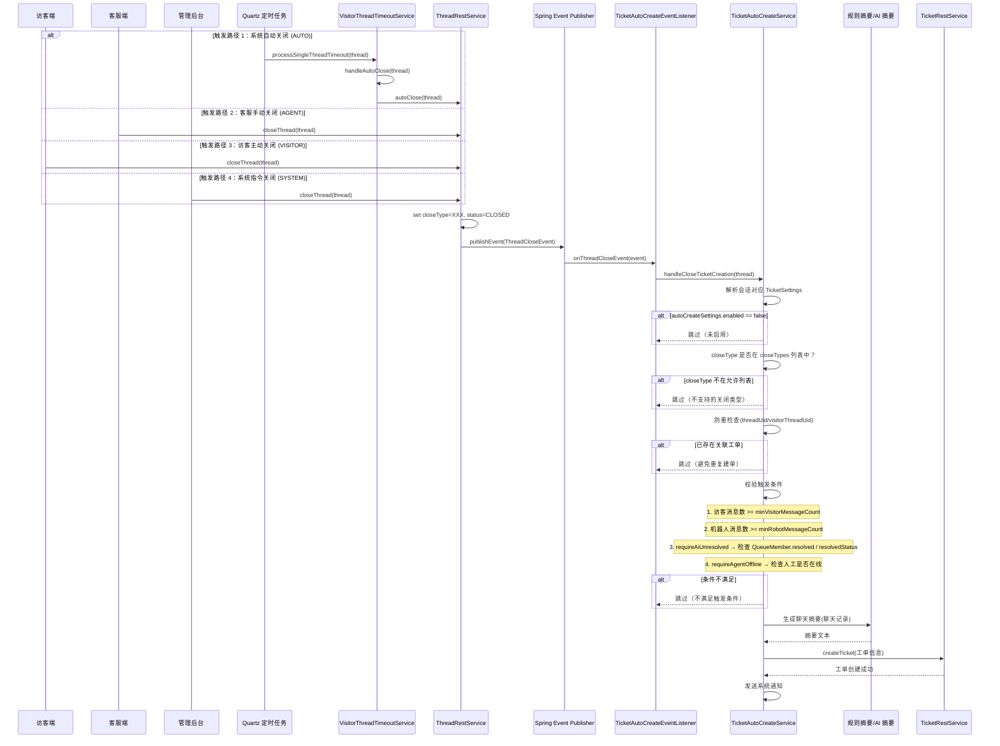

# 会话关闭时自动创建工单 — 规划文档（增量版）

> 日期：2026-07-27
> 最后更新：2026-07-29（第 16 章已实施，已同步文档状态）
> 状态：**已实施**（第 1-16 章）
> 关联 TODO：[TODO-2026.md](../../TODO-2026.md)

---

## 1. 概述

当客服会话关闭时，根据 **TicketSettings 中可配置的策略**，自动为该会话生成一张工单。支持 `ThreadCloseTypeEnum` 中所有有效关闭类型：

| 触发时机 | closeType | 说明 | 状态 |
| -------- | --------- | ---- | ---- |
| 系统自动关闭 | `AUTO` | 会话因超时/策略被系统自动关闭 | ✅ 已实施 |
| 客服手动关闭 | `AGENT` | 客服在工作台手动关闭会话 | ✅ 已实施 |
| 访客主动关闭 | `VISITOR` | 访客在客户端主动结束会话 | ✅ 已实施 |
| 系统指令关闭 | `SYSTEM` | 系统指令/管理员操作关闭 | ✅ 已实施 |

> **注意**：`NONE` 表示会话未关闭，不适用自动建单场景。

目标是覆盖以下场景：

- AI 机器人接待了访客，但未能解决访客问题；
- 访客在机器人对话阶段发送了足够多的消息，说明问题具备进入工单流转的必要性；
- 当前无人工客服在线，或虽然会话已关闭，但仍需要转入异步工单继续处理；
- 访客、客服或系统在关闭会话时，希望把本次沟通内容沉淀为后续可追踪、可流转的工单；
- 系统基于聊天摘要自动生成工单标题、描述、优先级与分类建议，减少人工二次录入。

首版实现需要严格贴合当前代码基线，重点遵循以下约束：

- `TicketSettings` 现有接口采用“只接收一份子配置请求，服务端内部维护 draft/published 双份实体”的模式，新增自动建单设置也应保持一致；
- 自动建单设置当前不再持有独立 `worktimeSettings` 字段；若需要时间段限制，应复用 `WorkgroupSettingsEntity` 中的 `WorktimeSettingEntity`，避免额外引入一套新时段模型；
- 当前已有 `QueueMemberEntity.resolved`、`resolvedStatus`、`threadSummaryResult` 等字段可用于判断是否已解决，不应首版先新增一套 `aiResolved` 消息字段再消费；
- 自动建单必须先做防重，避免同一个 `threadUid` 因重复事件、重试或并发导致生成多张工单。

模块边界：`modules/ticket` 负责实体、请求/响应模型与基础持久化结构；`enterprise/ticket` 负责自动建单触发服务、事件监听与 AI 工单内容生成。后续如需 AI 摘要，仍由 Ticket 侧调用现有 AI 能力；不要让 `modules/ai` 反向依赖或主动调用 Ticket 模块。

---

## 2. 核心需求拆解

### 2.1 开关控制

在 `TicketSettingsEntity` 中新增一个子设置实体，包含主开关和触发时机选择：

| 字段 | 类型 | 说明 |
| ---- | ---- | ---- |
| `enabled` | Boolean | 是否启用"会话关闭时自动创建工单" |
| `closeTypes` | List\<String\> | 允许触发自动建单的 `ThreadCloseTypeEnum` 值列表（不含 NONE），默认 `["AUTO"]` |

### 2.2 触发条件（可配置阈值）

| 字段 | 类型 | 默认值 | 说明 |
| ---- | ---- | ------ | ---- |
| `minVisitorMessageCount` | Integer | 2 | 访客（`user.type=VISITOR`）最少消息条数 |
| `minRobotMessageCount` | Integer | 1 | 机器人（`user.type=ROBOT`）最少消息条数 |
| `requireAgentOffline` | Boolean | true | 是否要求无人工客服在线 |
| `requireAiUnresolved` | Boolean | true | 是否要求 AI 未标记为"已解决" |
| `skipIfTicketExists` | Boolean | true | 若当前会话已关联工单，则跳过自动建单 |

> **注意**：`worktimeSettings` 字段已废弃，工作时间判断复用 `WorkgroupSettingsEntity` 中的 `WorktimeSettingEntity`。当前 `TicketAutoCreateSettingsEntity` 中不再持有独立的工作时间配置。

### 2.3 工单生成内容

| 字段 | 来源 |
| ---- | ---- |
| 工单标题 | 自动摘要会话主题/前几条访客消息 |
| 工单描述 | AI 摘要整段聊天记录 |
| 工单类型 | 跟随当前 TicketSettings 的 `type`（外部/内部工单） |
| 关联会话 | `threadUid` / `visitorThreadUid` |
| 上报人 | 访客信息 |
| 分类 | TicketSettings 的默认分类 |

---

## 3. 数据模型设计

### 3.1 扩展实体：`TicketAutoCreateSettingsEntity`

```java
@Entity
@Table(name = "bytedesk_ticket_auto_create_settings")
public class TicketAutoCreateSettingsEntity extends BaseEntity {

    // 是否启用自动创建工单
    @Builder.Default
    private Boolean enabled = Boolean.FALSE;

    /**
     * 允许触发自动建单的会话关闭类型列表。
     * 可选值来自 ThreadCloseTypeEnum（不含 NONE）：
     * AUTO（系统自动关闭）、AGENT（客服手动关闭）、
     * VISITOR（访客主动关闭）、SYSTEM（系统指令关闭）。
     * 默认仅 AUTO，保持向后兼容。
     */
    @Builder.Default
    @Convert(converter = StringListConverter.class)
    @Column(columnDefinition = TypeConsts.COLUMN_TYPE_TEXT)
    private List<String> closeTypes = List.of("AUTO");

    // 访客最少消息条数阈值
    @Builder.Default
    private Integer minVisitorMessageCount = 2;

    // 机器人最少消息条数阈值
    @Builder.Default
    private Integer minRobotMessageCount = 1;

    // 是否要求 AI 未解决
    @Builder.Default
    private Boolean requireAiUnresolved = Boolean.TRUE;

    // 是否要求人工客服离线
    @Builder.Default
    private Boolean requireAgentOffline = Boolean.TRUE;

    // 若当前会话已存在工单，则跳过自动创建
    @Builder.Default
    private Boolean skipIfTicketExists = Boolean.TRUE;

    /**
     * 自动建单时用于智能生成工单内容的 RobotEntity.uid。
     * 为空时使用默认的工单生成智能体（ROBOT_NAME_TICKET_GENERATE）。
     */
    @Column(name = "auto_ticket_robot_uid", length = 64)
    private String autoTicketRobotUid;
}
```

### 3.2 `TicketSettingsEntity` 关联（当前已存在）

```java
// 已发布版本
@ManyToOne(fetch = FetchType.LAZY, optional = true,
    cascade = {CascadeType.PERSIST, CascadeType.MERGE, CascadeType.REMOVE})
private TicketAutoCreateSettingsEntity autoCreateSettings;

// 草稿版本
@ManyToOne(fetch = FetchType.LAZY, optional = true,
    cascade = {CascadeType.PERSIST, CascadeType.MERGE, CascadeType.REMOVE})
private TicketAutoCreateSettingsEntity draftAutoCreateSettings;
```

### 3.3 数据库迁移

当前 AUTO 自动建单基础表结构已存在，迁移文件为 `starter/src/main/resources/db/changelog/migration/260727_add_ticket_auto_create_settings.xml`，并已在 `master.xml` 中引入。该脚本已创建 `bytedesk_ticket_auto_create_settings`，并在 `bytedesk_ticket_settings` 表中新增两列外键：

- `auto_create_settings_id`
- `draft_auto_create_settings_id`

当前规划不再为 `TicketAutoCreateSettingsEntity` 新增 `worktime_settings_id`。工作时间限制由会话所属工作组的 `WorktimeSettingEntity` 决定，自动建单只读取该结果，不直接持有独立时间配置。

### 3.4 Request / Response 扩展

- `TicketSettingsRequest` 当前已包含 `autoCreateSettings` 字段
- `TicketSettingsResponse` 当前已包含 `autoCreateSettings` 与 `draftAutoCreateSettings` 字段
- `TicketAutoCreateSettingsRequest` / `TicketAutoCreateSettingsResponse` 当前已存在，本次只需补充 `closeTypes`

注意：`TicketSettingsRequest` 当前只接收一份子配置请求，由 `TicketSettingsRestService` 自动同步到草稿实体，因此这里不新增 `draftAutoCreateSettings` 请求字段。

---

## 4. 架构流程

### 4.0 整体流程



---

### 4.1 TicketSettings 解析规则

`TicketAutoCreateService` 收到 `ThreadCloseEvent` 后，需要先解析本次自动建单应使用哪一套 `TicketSettings`。推荐顺序如下：

1. 若 `Thread.extra` 或业务上下文中已保存 `ticketSettingsUid`，优先按 UID 加载；
2. 若无法从会话上下文取到 UID，则按 `orgUid + type + isDefault=true` 解析默认 `TicketSettings`；
3. 若默认配置不存在，调用 `TicketSettingsRestService.getOrCreateDefault(orgUid, type)` 初始化并返回默认设置；
4. 自动建单只读取**发布版本** `autoCreateSettings`，不读取 `draftAutoCreateSettings`，避免管理员未发布的草稿规则影响线上触发。

`type` 的解析建议：

- 首版默认使用 `TicketTypeEnum.EXTERNAL.name()`；
- 如果会话明确来自内部工单/内部服务入口，再切换为 `INTERNAL`；
- 后续可以把 `ticketSettingsUid` 写入 Thread extra 后精确命中，不再依赖类型推断。

---

## 5. 具体实现步骤

> **总工时估算**：约 1.5 ~ 2 天（后端 1d + 前端 0.5d + 国际化 0.25d + 联调 buffer）

### 阶段 1：数据模型增量 + DB 迁移（后端约 0.25d）

1. **扩展 `TicketAutoCreateSettingsEntity`**
   - 路径：`modules/ticket/src/main/java/com/bytedesk/ticket/ticket_settings_auto_create/`
   - 文件：`TicketAutoCreateSettingsEntity.java`、`TicketAutoCreateSettingsRequest.java`、`TicketAutoCreateSettingsResponse.java`
   - 改动：新增 `closeTypes` 字段，并在 `fromRequest()` / `applyRequest()` / Response 映射中补齐

2. **复核 `TicketSettingsEntity` 关联**
   - 当前 `autoCreateSettings` 和 `draftAutoCreateSettings` 两个 `@ManyToOne` 关联已存在
   - 本次不重复新增关联，只确保保存、发布、复制链路能透传 `closeTypes`

3. **Liquibase 迁移脚本**
   - 路径：`starter/src/main/resources/db/changelog/migration/`
   - 新增增量迁移脚本 `260728_fix_ticket_auto_create_settings_columns.xml`
   - 内容：为 `bytedesk_ticket_auto_create_settings` 增加 `auto_ticket_robot_uid` 与 `close_types` 列，使用独立 changeset + 列存在性预检，并补历史默认值回填
   - 同步在 `starter/src/main/resources/db/changelog/master.xml` 中 include 该脚本

4. **扩展 `TicketSettingsRequest` / `TicketSettingsResponse`**
   - `autoCreateSettings` / `draftAutoCreateSettings` 基础字段当前已存在
   - 本次仅在 `TicketAutoCreateSettingsRequest` / `TicketAutoCreateSettingsResponse` 增加 `closeTypes`
   - 在 `TicketSettingsRestService` 的 save/publish/copy/response draft 映射逻辑中透传 `closeTypes`

### 阶段 2：改造核心服务（后端约 0.5d）

1. **改造 `TicketAutoCreateService`**
   - 路径：`enterprise/ticket/src/main/java/com/bytedesk/ticket/ticket_settings_auto_create/`
   - 改造点：
     - `handleAutoCloseTicketCreation()` → `handleCloseTicketCreation()`，不再硬编码 `closeType == AUTO`
     - 入口：`autoCreateSettings.closeTypes.contains(thread.closeType)` + 显式排除 `NONE`
     - 使用 `Map<String, String>` 映射 `closeType → 关闭原因文案`，替代 if-else 分支
     - 向后兼容：`closeTypes` 默认 `["AUTO"]`

2. **改造 `TicketAutoCreateEventListener`**
   - 移除 Listener 层 closeType 过滤，统一交给 Service 判断
   - 直接调用 `ticketAutoCreateService.handleCloseTicketCreation(event.getThread())`

### 阶段 3：多关闭类型标题/描述适配（后端约 0.25d）

当前 `TicketAutoCreateService` 已具备 AI 工单内容生成能力（`tryGenerateTicketContent()`），本次仅需适配标题与描述模板：

1. **`buildTitle()` 适配**
   - 根据 `closeType` 动态拼接标题前缀（见 12.5 映射表）
   - AI 生成标题时，提示词中加入关闭原因上下文

2. **`buildDescription()` 适配**
   - 根据 `closeType` 动态生成触发原因文案（见 12.6 映射表）
   - 保留现有 AI 摘要兜底：AI 成功时优先用 AI 生成内容，失败时回退规则模板

3. **无需新建摘要服务**
   - 当前已有消息收集 → AI prompt → JSON 解析 → 回退规则摘要的完整链路
   - 本次不在 `modules/ai` 新增接口，也不引入新的通用摘要服务依赖

### 阶段 4：前端管理界面（约 0.5d）

1. **扩展 `TicketAutoCreateSettings` 组件**
   - 路径：`frontend/apps/admin/src/pages/Dashboard/Ticket/Settings/components/`
   - 当前自动建单组件和 Tab 已存在
   - 本次新增"触发时机"多选，使用 Ant Design `Select mode="multiple"`

2. **扩展前端 Store 和 API**
   - `autoCreateSettings` 基础字段当前已进入保存 payload
   - 本次在 `frontend/apps/admin/src/@types/ticket/ticket_settings.d.ts` 中为 `AutoCreateSettings` 增加 `closeTypes?: string[]`
   - 确保 `ensureAutoCreateDefaults()` 和 `buildSavePayload()` 保留 `closeTypes`

### 阶段 5：国际化（约 0.25d）

1. **国际化文案**
   - 在 `frontend/apps/admin/src/locales/zh-CN/` 和 `ja-JP/` 中新增相关翻译 key

---

## 6. AI 是否"已解决"的判断逻辑

判断 AI 是否已解决问题，首版应优先复用当前已有字段，而不是立即增加新的消息级标记模型。

### 方案 A：复用 `QueueMemberEntity` 现有字段（推荐首版）

当前 `QueueMemberEntity` 已有：

- `resolved`：布尔已解决标记
- `resolvedStatus`：解决状态枚举字符串
- `threadSummaryResult`：会话小结原始结果

首版判断顺序建议：

1. 若存在 `QueueMemberEntity` 且 `resolved = true`，视为已解决；
2. 若 `resolvedStatus = RESOLVED`，视为已解决；
3. 若存在 `threadSummaryResult`，可作为补充证据参与 AI/规则判断；
4. 都不存在时，再回退到关键词规则。

### 方案 B：消息级别标记（后续增强）

在 `MessageEntity` 或 `MessageExtra` 中已有或可扩展一个 `aiResolved` 标记字段：

- 当访客发送"已解决"、"谢谢"、"好的"等肯定词 → AI 标记 `aiResolved=true`
- 当访客发送"不对"、"没用"、"转人工"等否定词 → AI 标记 `aiResolved=false`

### 方案 C：会话级别标记（备选）

在 `ThreadEntity` 或 `QueueMemberEntity` 中新增 `aiResolved` 字段：

- 会话过程中由 `RobotThreadEventListener` 根据对话内容自动更新

### 首版建议

首版采用**方案 A（复用 `QueueMemberEntity` 现有字段）**，只有在现有字段无法覆盖业务精度时，后续再补消息级 `aiResolved` 标记，避免本次需求把范围扩展到消息写入链路改造。

---

## 7. 客服是否在线的判断逻辑

复用现有 `QueueMemberEntity.getAgentOffline()` 或工作组在线状态判断：

```java
// 伪代码
boolean isAgentOffline(ThreadEntity thread) {
    // 方式 1：检查队列成员状态
    Optional<QueueMemberEntity> member = queueMemberRestService.findByThreadUid(thread.getUid());
    if (member.isPresent() && member.get().getAgentOffline()) {
        return true;
    }
    // 方式 2：检查工作组是否有在线坐席
    String workgroupUid = TopicUtils.getWorkgroupUidFromThreadTopic(thread.getTopic());
    if (workgroupUid != null) {
        return !workgroupRestService.hasOnlineAgents(workgroupUid);
    }
    return true; // 无法判断时视为离线
}
```

---

## 8. 时间段判断

当前仓库里，客服相关时段控制已主要沉淀在 `WorktimeSettingEntity`。但自动建单设置本身不再直接持有时间段配置，因此首版建议：

- 自动建单不新增独立 `checkWorktime(TicketAutoCreateSettingsEntity)` 配置入口；
- 若会话能解析到所属工作组，则复用 `WorkgroupSettingsEntity` 绑定的 `WorktimeSettingEntity` 判断当前是否处于允许时段；
- 若会话无法解析工作组或工作组未配置工作时间，则视为"不限时间段"（全天生效）；
- 时间段结果只作为自动建单的附加门槛，不写回 `TicketAutoCreateSettingsEntity`。

这样能与现有 Agent/Workgroup 工作时间模型保持一致，避免在 Ticket 模块平行引入另一套时段 DSL。

---

## 9. 文件清单

| 文件 | 类型 | 说明 |
| ---- | ---- | ---- |
| `modules/ticket/.../ticket_settings_auto_create/TicketAutoCreateSettingsEntity.java` | ✅ 已修改 | 新增 `closeTypes`、`defaultCloseTypes()`、`normalizeCloseTypes()` |
| `modules/ticket/.../ticket_settings_auto_create/TicketAutoCreateSettingsRequest.java` | ✅ 已修改 | 新增 `closeTypes` |
| `modules/ticket/.../ticket_settings_auto_create/TicketAutoCreateSettingsResponse.java` | ✅ 已修改 | 新增 `closeTypes` |
| `modules/ticket/.../ticket_settings/TicketSettingsEntity.java` | ✅ 已复核 | `autoCreateSettings` / `draftAutoCreateSettings` 已存在 |
| `modules/ticket/.../ticket_settings/TicketSettingsRequest.java` | ✅ 已复核 | `autoCreateSettings` 已存在 |
| `modules/ticket/.../ticket_settings/TicketSettingsResponse.java` | ✅ 已复核 | `autoCreateSettings` / `draftAutoCreateSettings` 已存在 |
| `modules/ticket/.../ticket_settings/TicketSettingsRestService.java` | ✅ 已修改 | save/publish/copy/response 映射中透传 `closeTypes` |
| `enterprise/ticket/.../ticket_settings_auto_create/TicketAutoCreateService.java` | ✅ 已修改 | `handleCloseTicketCreation()` 支持多 closeType；标题/描述根据 closeType 动态生成 |
| `enterprise/ticket/.../ticket_settings_auto_create/TicketAutoCreateEventListener.java` | ✅ 已修改 | 调用 `handleCloseTicketCreation()` |
| `enterprise/call/.../QwenRealtimeMediaWebSocketHandler.java` | ✅ 已修改 | SYSTEM 关闭发布 `ThreadCloseEvent`（修复事件旁路） |
| `enterprise/ticket/.../TicketAutoCreateServiceTest.java` | ✅ 新增 | VISITOR/SYSTEM 自动建单 + 负例单测，3/3 通过 |
| `enterprise/call/.../QwenRealtimeMediaWebSocketHandlerTest.java` | ✅ 已修改 | 补齐 BytedeskEventPublisher 构造参数 |
| `starter/.../db/changelog/migration/260727_add_ticket_auto_create_settings.xml` | 已有 | AUTO 自动建单基础表结构 |
| `starter/.../db/changelog/migration/260728_fix_ticket_auto_create_settings_columns.xml` | ✅ 已新增 | 增量迁移：`auto_ticket_robot_uid` + `close_types` 列，含列存在性预检与存量回填 |
| `starter/.../db/changelog/master.xml` | ✅ 已修改 | include 新增迁移脚本 |
| `frontend/.../Ticket/Settings/components/TicketAutoCreateSettings.tsx` | ✅ 已修改 | 关闭时机多选 Select |
| `frontend/apps/admin/src/@types/ticket/ticket_settings.d.ts` | ✅ 已修改 | `AutoCreateSettings.closeTypes?: string[]` |
| `frontend/.../locales/zh-CN/ticket.ts` | ✅ 已修改 | 新增关闭类型文案 |
| `frontend/.../locales/ja-JP/ticket.ts` | ✅ 已修改 | 新增关闭类型文案，修正中文残留 |

视最终实现方式，可能还会涉及：

| 文件 | 类型 | 说明 |
| ---- | ---- | ---- |
| `modules/service/.../workgroup_settings/WorkgroupSettingsEntity.java` | 复用 | 自动建单时间窗口通过工作组设置复用现有工作时间模型 |
| `modules/service/.../worktime_settings/WorktimeSettingEntity.java` | 复用 | 提供工作时间判断能力 |
| `modules/service/.../queue_member/QueueMemberEntity.java` | 只读复用 | 读取 `resolved` / `resolvedStatus` / `threadSummaryResult` 作为触发判断依据 |

---

## 10. 风险评估

| 风险 | 影响 | 缓解措施 |
| ---- | ---- | -------- |
| 误触发（本不需要工单的会话也生成了工单） | 中 | 设置合理的默认阈值，并支持管理后台调整 |
| AI 摘要质量不佳 | 低 | 摘要仅辅助人工处理，不替代人工；支持自定义 prompt |
| 会话量大的租户产生过多自动工单 | 中 | 通过消息条数阈值控制；默认仅启用 AUTO，其他类型需手动添加 |
| `requireAiUnresolved` 判断不准确 | 低 | 首版优先复用 `QueueMemberEntity.resolved/resolvedStatus`，不足时再回退关键词 |
| 同一会话重复建单 | 高 | 以 `threadUid` / `visitorThreadUid` 做防重校验，并在事务内二次确认 |
| 非 AUTO 关闭事件未发布 `ThreadCloseEvent` | 中 | 实施前核实 AGENT/VISITOR/SYSTEM 关闭链路是否发布事件，未发布则补上 |
| AGENT 关闭触发过多噪音工单 | 中 | 默认 `closeTypes` 不含 AGENT，需管理员按需配置 |
| SYSTEM 关闭语义过宽导致误触发 | 中 | 默认 `closeTypes` 不含 SYSTEM，且建议仅在明确管理流程中启用 |
| 关闭事件与最终持久化状态先后不一致 | 中 | 确保发布 `ThreadCloseEvent` 时 `closeType/status` 已落库，监听方读取到的是最终状态 |

---

## 11. 最终实施版决策

为避免继续停留在“可选方案”层面，本文给出推荐落地决策，后续实现默认按此执行。

### 11.1 适用会话范围与触发时机

自动建单支持 `ThreadCloseTypeEnum` 中所有有效关闭类型（由 `closeTypes` 配置控制，多选）：

| closeType | 含义 | 触发来源 | 默认启用 |
| --------- | ---- | -------- | -------- |
| `AUTO` | 系统自动关闭 | Quartz 超时定时任务 → `VisitorThreadTimeoutService.handleAutoClose()` | ✅ 是 |
| `AGENT` | 客服手动关闭 | 客服在工作台主动关闭会话 | ❌ 否 |
| `VISITOR` | 访客主动关闭 | 访客端调用关闭会话 API | ❌ 否 |
| `SYSTEM` | 系统指令关闭 | 管理员后台操作 / 系统批量关闭等 | ❌ 否 |

> `NONE` 表示会话未关闭，不适用自动建单场景，不可选择。

适用会话类型：

- 会话类型属于机器人接待或工作组接待链路
- 优先覆盖 `WORKGROUP`、`ROBOT`、`UNIFIED` 这类存在"AI 未解决后自动转工单"业务语义的会话

不建议默认覆盖所有纯人工 `AGENT` 会话或所有后台批量 `SYSTEM` 关闭场景，这两类更容易把“正常结束的会话”误转为工单，因此保持关闭、按组织显式启用更稳妥。

**各关闭类型的典型场景**：

| closeType | 典型业务场景 |
| --------- | ------------ |
| `AUTO` | AI 未解决 + 超时自动关闭 → 兜底转工单 |
| `AGENT` | 客服确认问题无法在线解决，关闭会话并自动生成工单流转 |
| `VISITOR` | 访客在 AI 对话中觉得问题未解决，主动离开 → 自动补建工单 |
| `SYSTEM` | 管理员批量清理僵尸会话时，对其中有价值的会话自动建单留存 |

### 11.2 目标工单类型

自动创建的工单类型默认严格跟随当前 `TicketSettings.type`：

- 外部会话命中外部工单设置，创建 `EXTERNAL` 工单；
- 内部会话命中内部工单设置，创建 `INTERNAL` 工单。

首版不增加“统一强制转外部工单”的额外分支。

### 11.3 已有工单时的处理方式

默认启用 `skipIfTicketExists = true`：

- 若当前 `threadUid` 已绑定工单，则直接跳过；
- 若当前 `threadUid` 未绑定，但 `visitorThreadUid` 已存在近期开出的工单，则也跳过；
- 首版不支持“同一自动关闭会话连续补建多张工单”。

这是最保守、也最符合工单去重预期的默认策略。

### 11.4 工单创建深度

自动建单应直接复用现有 `TicketRestService.create()` 完整链路，而不是只落一条 ticket 主表记录：

- 创建 ticket 主记录；
- 自动应用 `TicketSettings`；
- 自动创建对应 ticket thread；
- 自动创建流程实例；
- 自动进入现有通知与 SLA 初始化链路。

否则后续人工处理时会出现“有工单记录但没有完整流程上下文”的裂缝。

实现时构造 `TicketRequest` 需要注意：

- `TicketRequest` 目前使用 Lombok `@Builder`，继承自 `BaseRequest` 的 `orgUid/type` 等字段不能直接通过 builder 设置，建议 build 后再调用 setter；
- 必须设置 `orgUid`、`type`、`title`、`description`、`reporter`、`ticketSettingsUid`；
- 必须把原客服会话写入 `visitorThreadUid` / `visitorThreadTopic`，而不是把它误写成工单自身的 `threadUid`；
- 让 `TicketRestService.create()` 自己创建新的 ticket thread，并写回 ticket 的 `threadUid`。

### 11.5 `requireAgentOffline` 语义

首版将其定义为：

- **当前会话没有可继续承接的人工客服**，而不是狭义的“当前绑定的单个 agent 离线”；
- 若是工作组/统一路由会话，则以“所属工作组当前无任一可用在线人工”为准；
- 若只能拿到 `QueueMemberEntity.agentOffline`，则先按该字段判断，再视情况补查工作组在线坐席。

该定义更贴近用户真实诉求：“没人接，就转工单”。

---

## 12. 推荐默认业务规则

以下规则建议直接作为首版默认值写入实现和初始化逻辑，减少后台首次配置成本。

### 12.1 默认启用策略

- `enabled = false`
- `closeTypes = ["AUTO"]`
- `skipIfTicketExists = true`
- `requireAiUnresolved = true`
- `requireAgentOffline = true`

解释：

- 默认不自动开启，避免升级后无感触发新行为；
- `closeTypes` 默认仅 `AUTO`，保持向后兼容；管理员可按需勾选 `AGENT`、`VISITOR`、`SYSTEM`；
- 一旦管理员主动开启，则默认采用“未解决 + 无人工 + 去重”的保守策略。

### 12.2 默认消息阈值

- `minVisitorMessageCount = 2`
- `minRobotMessageCount = 1`

推荐理由：

- 访客至少说过两轮，基本可以排除误触、误点、空会话；
- 机器人至少真实回复过一次，才能说明这是“AI 未解决”而非“根本没接待成功”；
- 相比原先规划中的 `minRobotMessageCount = 2`，这里把机器人阈值降到 1，更适合首版真实业务：很多用户一问一答后就已经暴露“未解决”。

### 12.3 默认时间窗口规则

- 自动建单本身不再持有独立的工作时间配置（`worktimeSettings` 字段已移除）；
- 工作时间限制统一通过 `WorkgroupSettingsEntity` 中的 `WorktimeSettingEntity` 控制；
- 若工作组配置了工作时间，则仅在命中工作时间规则时触发自动建单；
- 无工作时间配置时视为全天有效。

### 12.4 已解决判断默认规则

按以下顺序判断 `requireAiUnresolved`：

1. `QueueMemberEntity.resolved = true` → 视为已解决，跳过自动建单；
2. `resolvedStatus = RESOLVED` → 视为已解决，跳过自动建单；
3. 若 `threadSummaryResult` 明确表达“已解决/已完成”，也跳过自动建单；
4. 若以上都没有，再回退关键词规则，识别访客最后一轮是否表达“未解决/转人工/没帮助”。

### 12.5 自动建单标题默认规则

建议标题采用稳定、可搜索的结构化格式：

```text
【自动建单】{关闭原因} - {来源类型} 会话未解决 - {访客最近问题摘要}
```

其中 `{关闭原因}` 根据 `closeType` 动态填充（完整映射 `ThreadCloseTypeEnum`）：

| closeType | 关闭原因 |
| --------- | -------- |
| `AUTO` | 系统自动关闭 |
| `AGENT` | 客服手动关闭 |
| `VISITOR` | 访客主动关闭 |
| `SYSTEM` | 系统指令关闭 |

例如：

```text
【自动建单】系统自动关闭 - 机器人会话未解决 - 用户咨询退款后物流异常
【自动建单】访客主动关闭 - 工作组会话未解决 - 订单状态查询无果
```

这样做的好处是：

- 后台筛选和统计时容易识别自动建单来源；
- 人工处理人一眼能看出该工单来自“会话自动关闭兜底”；
- 后续若要增加报表，也容易按标题前缀或来源字段回溯。

### 12.6 自动建单描述默认规则

描述建议按固定模板组装，`触发原因` 根据 `closeType` 动态生成（完整映射 `ThreadCloseTypeEnum`）：

| closeType | 触发原因文案 |
| --------- | ------------ |
| `AUTO` | 会话因超时被系统自动关闭，且满足自动建单规则 |
| `AGENT` | 客服手动关闭会话，且满足自动建单规则 |
| `VISITOR` | 访客主动关闭会话，且满足自动建单规则 |
| `SYSTEM` | 系统指令关闭会话，且满足自动建单规则 |

内容结构：

1. 触发原因：{触发原因文案}；
2. 会话基础信息：threadUid、visitorThreadUid、topic、closeType；
3. 访客最近问题摘要；
4. 机器人最近回复摘要；
5. 解决状态判断依据；
6. 最近若干条关键消息摘录。

首版默认保底描述建议：

```text
该工单由系统自动创建。
触发原因：{触发原因文案}。

会话信息：
- threadUid: {threadUid}
- visitorThreadUid: {visitorThreadUid}
- topic: {topic}
- closeType: {closeType}

访客问题摘要：
{summary}

关键对话摘录：
{messages}
```

### 12.7 默认分类与默认流程

- 分类：使用当前 `TicketSettings` 中的默认分类；
- 流程：使用当前 `TicketSettings` 绑定的流程；
- 表单：使用当前 `TicketSettings` 绑定的表单；
- SLA：使用当前 `TicketSettings` 绑定的 SLA 设置。

首版不为自动建单单独发明一套特殊流程配置。

### 12.8 默认可观测性规则

建议在实现时默认输出以下日志字段，便于排障：

- `threadUid`
- `visitorThreadUid`
- `orgUid`
- `ticketSettingsUid`
- `autoCreateEnabled`
- `skipIfTicketExists`
- `resolvedCheckResult`
- `agentOfflineCheckResult`
- `worktimeCheckResult`
- `ticketCreated` / `skipReason`

这样首版上线后，即使误触或漏触，也能较快定位是哪一条规则拦截了自动建单。

---

## 13. 多关闭类型支持 — 新增改动明细

以下为在已实施 AUTO 触发基础上，扩展支持 `ThreadCloseTypeEnum` 所有有效关闭类型所需的改动。

### 13.1 后端改动

#### 13.1.1 `TicketAutoCreateSettingsEntity`（modules/ticket）

新增 `closeTypes` 字段（`List<String>`，`StringListConverter` 序列化），默认 `["AUTO"]`：

```java
/**
 * 允许触发自动建单的会话关闭类型列表。
 * 可选值来自 ThreadCloseTypeEnum（不含 NONE）：
 * AUTO、AGENT、VISITOR、SYSTEM。
 * 默认仅 AUTO，保持向后兼容。
 */
@Builder.Default
@Convert(converter = StringListConverter.class)
@Column(columnDefinition = TypeConsts.COLUMN_TYPE_TEXT)
private List<String> closeTypes = List.of("AUTO");
```

在 `fromRequest()` / `applyRequest()` 中补全 `closeTypes` 的赋值逻辑。

#### 13.1.2 `TicketAutoCreateService`（enterprise/ticket）

| 改动 | 说明 |
| ---- | ---- |
| `handleAutoCloseTicketCreation()` → `handleCloseTicketCreation()` | 方法重命名，反映其支持多种 closeType |
| 入口判断 | 原硬编码 `closeType == AUTO` → `autoCreateSettings.closeTypes.contains(thread.closeType)` |
| `buildTitle()` | 根据 closeType 动态生成标题前缀（见 12.5 映射表） |
| `buildDescription()` | 触发原因文案根据 closeType 动态生成（见 12.6 映射表） |
| `shouldAutoCreateTicket()` | 保持现有阈值逻辑不变，首版不针对不同 closeType 拆分不同规则 |

入口判断伪代码：

```java
@Transactional
public void handleCloseTicketCreation(ThreadEntity thread) {
    if (thread == null) return;
    // NONE 类型不处理
    if (ThreadCloseTypeEnum.NONE.name().equalsIgnoreCase(thread.getCloseType())) return;
    // 非客服会话不处理
    if (!thread.isCustomerService()) return;
    // ...解析 TicketSettings...
    TicketAutoCreateSettingsEntity settings = ticketSettings.getAutoCreateSettings();
    if (settings == null || !Boolean.TRUE.equals(settings.getEnabled())) return;
    // 检查当前 closeType 是否在允许列表中
    List<String> allowedTypes = settings.getCloseTypes();
    if (allowedTypes == null || allowedTypes.isEmpty()) return;
    if (!allowedTypes.contains(thread.getCloseType())) {
        log.debug("skip auto create ticket: closeType={} not in allowedTypes", thread.getCloseType());
        return;
    }
    // ...后续逻辑不变（条件校验、防重、生成工单）...
}
```

标题生成：使用映射表替代 if-else：

```java
private static final Map<String, String> CLOSE_TYPE_LABEL = Map.of(
    "AUTO", "系统自动关闭",
    "AGENT", "客服手动关闭",
    "VISITOR", "访客主动关闭",
    "SYSTEM", "系统指令关闭"
);

private String closeTypeLabel(String closeType) {
    return CLOSE_TYPE_LABEL.getOrDefault(closeType, "会话关闭");
}
```

#### 13.1.3 `TicketAutoCreateEventListener`（enterprise/ticket）

简化 Listener：不再在 Listener 层过滤 closeType，统一交给 Service 判断。NONE 类型已在 Service 入口排除。

```java
@EventListener
public void onThreadCloseEvent(ThreadCloseEvent event) {
    if (event == null || event.getThread() == null) return;
    ticketAutoCreateService.handleCloseTicketCreation(event.getThread());
}
```

#### 13.1.4 数据库迁移

新增 Liquibase 脚本 `starter/src/main/resources/db/changelog/migration/260728_fix_ticket_auto_create_settings_columns.xml`，并在 `master.xml` 中 include。

脚本包含三个独立 changeset，每个含列存在性预检：

```xml
<changeSet author="jackning" id="260728_add_ticket_auto_create_runtime_columns">
    <preConditions onFail="MARK_RAN">
        <and>
            <tableExists tableName="bytedesk_ticket_auto_create_settings"/>
            <not>
                <columnExists tableName="bytedesk_ticket_auto_create_settings" columnName="auto_ticket_robot_uid"/>
            </not>
        </and>
    </preConditions>
    <addColumn tableName="bytedesk_ticket_auto_create_settings">
        <column name="auto_ticket_robot_uid" type="VARCHAR(64)">
            <constraints nullable="true"/>
        </column>
    </addColumn>
</changeSet>

<changeSet author="jackning" id="260728_add_ticket_auto_create_close_types_column">
    <preConditions onFail="MARK_RAN">
        <and>
            <tableExists tableName="bytedesk_ticket_auto_create_settings"/>
            <not>
                <columnExists tableName="bytedesk_ticket_auto_create_settings" columnName="close_types"/>
            </not>
        </and>
    </preConditions>
    <addColumn tableName="bytedesk_ticket_auto_create_settings">
        <column name="close_types" type="VARCHAR(512)" defaultValue="AUTO">
            <constraints nullable="true"/>
        </column>
    </addColumn>
</changeSet>

<changeSet author="jackning" id="260728_backfill_ticket_auto_create_close_types">
    <preConditions onFail="MARK_RAN">
        <and>
            <tableExists tableName="bytedesk_ticket_auto_create_settings"/>
            <columnExists tableName="bytedesk_ticket_auto_create_settings" columnName="close_types"/>
        </and>
    </preConditions>
    <update tableName="bytedesk_ticket_auto_create_settings">
        <column name="close_types" value="AUTO"/>
        <where>close_types IS NULL OR close_types = ''</where>
    </update>
</changeSet>
```

### 13.2 前端改动

#### 13.2.1 `TicketAutoCreateSettings.tsx`

"触发时机"选择器改为多选（Ant Design `Select` mode="multiple"），选项覆盖所有有效 `ThreadCloseTypeEnum` 值：

```typescript
const CLOSE_TYPE_OPTIONS = [
  { label: '系统自动关闭', value: 'AUTO' },
  { label: '客服手动关闭', value: 'AGENT' },
  { label: '访客主动关闭', value: 'VISITOR' },
  { label: '系统指令关闭', value: 'SYSTEM' },
];
// NONE 不提供选择
```

`ensureAutoCreateDefaults()` 补充默认值：

```typescript
closeTypes: settings?.closeTypes ?? ['AUTO'],
```

#### 13.2.2 `index.tsx`（Ticket Settings 页面）

`buildSavePayload()` 中确保 `closeTypes` 数组被正确序列化到请求 payload。

### 13.3 确认点（已核实）

1. ✅ **`ThreadCloseEvent` 发布范围**：已验证 AGENT/VISITOR 通过 `ThreadRestService` 发布事件；SYSTEM 的 `QwenRealtimeMediaWebSocketHandler` 旁路已补发事件。
2. ✅ **向后兼容**：已有租户 `closeTypes` 默认为 `["AUTO"]`，不受影响。
3. ✅ **NONE 类型**：Service 入口已显式排除。
4. ✅ **工作时间来源**：已确认不复用废弃的 `worktimeSettings`，时间判断由工作组控制。

---

## 14. 首版边界

为了控制范围，首版明确不包含以下改动：

- 不改造消息写入链路去新增 `MessageExtra.aiResolved`；
- 不新增独立 `TimeConditionEntity` 给 Ticket 模块使用；
- 不强依赖统一 AI 摘要服务存在才可落地，先保证规则摘要可用；
- 不在本次直接做自动分类、自动指派、自动通知等后续增强；
- 不新增关闭类型专属的独立条件校验规则，所有 closeType 共享同一套条件（消息数、AI 未解决、客服离线等）。

---

## 15. 后续扩展（非首版范围）

- 支持根据访客消息关键词自动选择工单分类
- 支持将聊天中的附件/图片自动挂载到工单
- 支持自动填充工单自定义字段
- 与 SLA 规则联动（自动工单也进入 SLA 计时）
- 在工单创建时发送企业微信/钉钉/飞书通知
- 不同 closeType 支持独立的触发条件（如 AGENT 关闭时降低阈值，因为人工确认过）

---

## 16. 自动建单流转过程处理人显示优化

> 日期：2026-07-29
> 状态：**已实施**
> 关联 TODO：[TODO-2026.md](../../TODO-2026.md) 第 32 行

### 16.1 问题描述

通过 `TicketAutoCreateService` 自动创建的工单，在 desktop 客服端 `TicketInternalSteps` 流转过程组件中，"创建工单"活动的处理人显示为一串数字 UID（如 `1950354757386419`），而非访客昵称，体验不友好。

### 16.2 根因分析

调用链路如下：

```text
TicketAutoCreateService.buildTicketRequest()
  → resolveReporter(thread)  // 解析出 thread owner（访客/用户）的 UserProtobuf
  → TicketRequest.reporter = UserProtobuf(uid="1950354757386419", nickname="张三")
  → ticketRestService.create(request)
    → TicketEventListener.handleTicketCreateEvent()
      → runtimeService.createProcessInstanceBuilder()...start()
      → taskAssignee = ticket.getReporter().getUid()  // "1950354757386419"
      → taskService.complete(task.getId())
      → HistoricActivityInstance.assignee = "1950354757386419"
```

在 `TicketService.queryTicketActivityHistory()` 中，Flowable 的 `HistoricActivityInstance.getAssignee()` 返回的是原始 UID 字符串，直接透传到了 `TicketHistoryActivityResponse.assignee`。

前端 `TicketInternalSteps.getActivityAssignee()` 的解析逻辑：

```typescript
const getActivityAssignee = (assignee: string) => {
    const member = memberResult?.data?.content?.find(
      (member) => member.uid === assignee,
    );
    return member?.nickname || "";  // 找不到 member → 返回空字符串
};
```

问题在于：

1. `memberResult` 只包含**组织成员**（`queryMembersByOrg`），不包含访客（VISITOR）；
2. 自动建单时，工单上报人（reporter）是会话的访客/用户，其 UID 不在组织成员列表中；
3. 当前 desktop 组件存在显式兜底逻辑：`getActivityAssignee(history?.assignee) || history?.assignee`，因此一旦昵称解析失败，就一定会回退显示原始 UID。

补充确认：这个问题并不只影响 desktop。

- `frontend/apps/admin/.../TicketSteps.tsx` 也基于成员列表解析处理人；
- `frontend/apps/visitorTicket/.../TicketStepsTab.tsx` 当前甚至直接展示 `activity.assignee`；
- `frontend/apps/admin/.../ThreadProcessSteps.tsx` 的会话流程历史也有同样的 `memberResult -> 原始 assignee` 兜底模式；
- 因此如果只修 desktop，会留下 admin / visitorTicket 同类显示不一致问题。

### 16.3 修复方案对比

#### 方案 A：后端增强 `TicketHistoryActivityResponse`，新增 `assigneeName`（推荐 ✅）

**思路**：在 `TicketService.queryTicketActivityHistory()` 中，按 assignee UID 解析显示名称，通过新增字段 `assigneeName` 返回；前端三端统一优先展示该字段。

**后端改动**：

1. `TicketHistoryActivityResponse` 新增字段：

```java
private String assigneeName;  // 处理人显示名称（昵称）
```

1. `TicketService.queryTicketActivityHistory()` 中增加名称解析逻辑：

```java
// 收集所有需要解析的 assignee UID
Set<String> assigneeUids = activities.stream()
    .map(HistoricActivityInstance::getAssignee)
    .filter(StringUtils::hasText)
    .collect(Collectors.toSet());

// 构建 uid -> displayName 映射
Map<String, String> assigneeNameMap = new HashMap<>();

// 优先使用 ticket.reporter / ticket.assignee 中已持久化的 protobuf 昵称做零查询兜底
// 再按需补查 Member / User / Visitor
```

名称解析优先级建议：

1. 若 `assignee == ticket.reporter.uid`，优先使用 `ticket.reporter.nickname`
2. 若 `assignee == ticket.assignee.uid`，优先使用 `ticket.assignee.nickname`
3. 批量查询 `MemberEntity`，覆盖流程节点中最常见的成员处理人 UID
4. 批量查询 `UserEntity`，覆盖少量直接以用户 UID 作为 assignee 的场景
5. 批量查询 `VisitorEntity`，覆盖自动建单创建节点或历史访客型上报人场景
6. 都未命中时返回 `null`，前端再回退到原始 `assignee`

说明：

- 当前仓库没有现成的 `userRestService.findByUids(...)` / `visitorRestService.findByUids(...)`；
- 若实施后端批量解析，建议以最小增量方式新增 Repository 级 `findByUidIn(...)` 能力，而不是先扩展多层复杂 Service API；
- `MemberEntity.uid` 是工单后续分配节点最常见的 assignee 来源，不能只查 `UserEntity`。

1. 在构建 `TicketHistoryActivityResponse` 时填充 `assigneeName`：

```java
.assigneeName(assigneeNameMap.getOrDefault(activity.getAssignee(), null))
```

**前端改动**：

修改前端处理人展示逻辑，优先使用 `assigneeName`：

```typescript
const getActivityAssignee = (history: TICKET.TicketHistoryActivityResponse) => {
    const assignee = history?.assignee;
    if (!assignee) return "-";
    // 优先使用后端解析的名称
    if (history?.assigneeName) return history.assigneeName;
    // 兜底：组织成员查找
    const member = memberResult?.data?.content?.find(m => m.uid === assignee);
    return member?.nickname || assignee;
};
```

同时更新 desktop、admin、visitorTicket 三端 `TICKET.TicketHistoryActivityResponse` 类型定义与展示组件。

**优点**：

- 服务端统一解析，一次批量查询，性能好
- 所有活动的处理人名称都能受益（不仅是自动建单场景）
- desktop / admin / visitorTicket 三端展示口径可以统一
- 前后端职责清晰

**缺点**：

- 需要在 `TicketService` 中补充名称解析依赖与少量仓储批量查询方法
- assignee 来源不止一种，需要设计清晰的解析优先级，避免只修复 reporter 场景

**工时**：约 0.25 ~ 0.5d

---

#### 方案 B：前端增加访客/用户查询兜底

**思路**：`getActivityAssignee()` 在 member 查找失败后，调用 `queryVisitorByUid` 或 `queryUsersByOrg` 查询。

**优点**：

- 不改后端

**缺点**：

- 多次 API 调用，性能差（每个 assignee 可能触发一次查询）
- 如果工单上报人是 VISITOR 类型，desktop 端可能没有直接查询访客的权限/API
- 逻辑分散，后续维护成本高

---

#### 方案 C：`TicketAutoCreateService` 中将 reporter 写入流程变量

**思路**：在流程变量中额外存储 `reporterNickname`，在活动历史查询时读取。

**缺点**：

- 需要改动流程变量读写逻辑，侵入性强
- 无法解决非自动建单场景的同类问题

---

### 16.4 推荐方案

**推荐方案 A**：后端增强 `TicketHistoryActivityResponse`，新增 `assigneeName` 字段。

理由：

- 一次修改，所有活动的处理人显示都受益；
- 可以同时修复 desktop、admin、visitorTicket 三端；
- 后端批量解析效率高，不会引入前端 N+1 请求问题；
- 职责清晰：后端负责数据解析，前端负责展示；
- 能兼容 `reporter/member/user/visitor` 多来源 assignee，而不是只修一个特例。

实现上建议遵循“先用现有 ticket JSON 做零查询命中，再补最小仓储批量查询”的顺序，避免把一个展示优化做成大范围服务层重构。

实际实施结果：

- 已按方案 A 落地；
- 后端首版采用 `ticket.reporter` / `ticket.assignee` 的零查询昵称命中，再按 UID 依次调用 `MemberRestService`、`UserRestService`、`VisitorRestService` 做单条兜底查询；
- 本次未新增批量 Repository 查询方法，先保持改动面最小；
- 本次覆盖范围为 ticket 活动历史接口及 desktop、admin、visitorTicket 三端展示，不包含 thread 流程历史页面。

### 16.5 实施步骤

#### 阶段 1：后端改动（已完成）

| 文件 | 改动 |
| ---- | ---- |
| `modules/ticket/.../dto/TicketHistoryActivityResponse.java` | 已新增 `assigneeName` 字段 |
| `modules/ticket/.../ticket/TicketService.java` | 已在 `queryTicketActivityHistory()` 中解析 assignee 名称并填充 `assigneeName` |
| `modules/core/.../member/MemberRepository.java` | 本次未改动；首版未引入批量 `findByUidIn(...)` |
| `modules/core/.../rbac/user/UserRepository.java` | 本次未改动；首版未引入批量 `findByUidIn(...)` |
| `modules/service/.../visitor/VisitorRepository.java` | 本次未改动；首版未引入批量 `findByUidInAndDeletedFalse(...)` |

同时复核 `ThreadHistoryActivityResponse` / `ThreadProcessService.queryThreadActivityHistory()`：

- 本次未抽取通用 `AssigneeDisplayNameResolver`；
- `ThreadHistoryActivityResponse` / `ThreadProcessService.queryThreadActivityHistory()` 仍属于相邻待优化项，不在本次实施范围内。

名称解析优先级：

1. 若 `assignee == ticket.reporter.uid`，使用 `ticket.reporter.nickname`
2. 若 `assignee == ticket.assignee.uid`，使用 `ticket.assignee.nickname`
3. `MemberEntity` 查找（覆盖流程节点中最常见的成员 assignee）
4. `UserEntity` 查找
5. `VisitorEntity` 查找
6. 兜底返回 `null`（前端自行处理）

#### 阶段 2：前端改动（已完成）

| 文件 | 改动 |
| ---- | ---- |
| `frontend/apps/desktop/src/@types/ticket/ticket.d.ts` | 已为 `TicketHistoryActivityResponse` 新增 `assigneeName?: string` |
| `frontend/apps/desktop/src/pages/Dashboard/Ticket/components/TicketInternalSteps.tsx` | 已优先使用 `assigneeName`，成员兜底失败时回退原始 assignee |
| `frontend/apps/admin/src/@types/ticket/ticket.d.ts` | 已为 `TicketHistoryActivityResponse` 新增 `assigneeName?: string` |
| `frontend/apps/admin/src/pages/Dashboard/Ticket/Table/components/TicketSteps.tsx` | 已优先使用 `assigneeName`，成员兜底失败时回退原始 assignee |
| `frontend/apps/visitorTicket/src/.../TicketStepsTab.tsx` | 已优先使用 `assigneeName`，避免直接展示 UID |
| `frontend/apps/admin/src/@types/core/thread.d.ts` | 本次未改动 |
| `frontend/apps/admin/src/pages/Dashboard/Service/Thread/ThreadProcessSteps.tsx` | 本次未改动 |

#### 阶段 3：国际化（本次无需改动）

当前实现延续现有展示兜底：优先显示 `assigneeName`，其次显示成员昵称，最后显示原始 `assignee`。本次无需新增 locale key。

### 16.6 风险评估

| 风险 | 影响 | 缓解措施 |
| ---- | ---- | -------- |
| assignee 来源混合（member/user/visitor） | 中 | 使用明确的解析优先级，并优先复用 ticket 中已持久化的 protobuf 信息 |
| 批量查询新增仓储方法带来额外改动 | 低 | 仅新增最小 `findByUidIn(...)` 能力，不扩散到无关模块 |
| visitorTicket 端仍显示 UID | 中 | 将 visitorTicket 明确纳入首版修改范围，而不是只改 desktop |

### 16.7 验收标准

1. 自动建单生成的工单，在 desktop `TicketInternalSteps` 中，创建工单节点的处理人显示访客昵称，不再直接显示数字 UID。
2. admin 工单流转组件与 visitorTicket 工单处理记录中，同一活动返回相同的 `assigneeName` 展示结果。
3. 如果处理人是后续流程分配的组织成员，展示 `MemberEntity.nickname`；如果处理人是工单上报人，优先展示 `ticket.reporter.nickname`。
4. 如果确实无法解析名称，前端允许兜底显示原始 UID，但不能把空字符串渲染成空白处理人。
5. `/api/v1/ticket/history/activity` 保持向后兼容：保留原 `assignee` 字段，仅新增可选 `assigneeName` 字段。

### 16.8 验证计划

后端验证：

```bash
./starter/mvnw -f pom.xml -pl modules/ticket -am -DskipTests compile
```

建议增加或补充单元测试覆盖：

- `assignee == ticket.reporter.uid` 时，`assigneeName == ticket.reporter.nickname`
- `assignee == ticket.assignee.uid` 时，`assigneeName == ticket.assignee.nickname`
- `assignee` 是 `MemberEntity.uid` 时，能解析为成员昵称
- 未命中任何来源时，`assigneeName == null`，且 `assignee` 原值不丢失

前端验证：

```bash
cd frontend
pnpm --filter desktop lint
pnpm --filter admin lint
pnpm --filter visitorTicket lint
```

手工验证路径：

1. 配置并触发 `TicketAutoCreateService` 自动建单；
2. 在 desktop 打开该工单的流转过程，确认创建节点处理人显示访客昵称；
3. 在 admin 工单详情和 visitorTicket 工单详情中查看同一工单处理记录，确认显示一致；
4. 分配工单给组织成员后再次查看流转过程，确认后续节点显示成员昵称。

---

> 第 16 章已按上述范围实施完成；如需继续扩展 thread 流程历史的处理人显示，可在后续单独立项。
