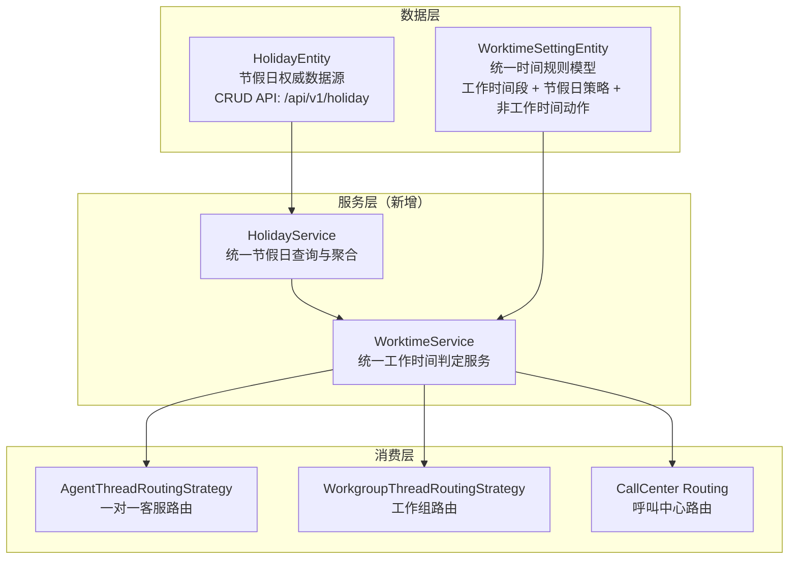

# 工作时间/节假日统一架构规划

> **状态：** 已确认  
> **创建日期：** 2026-07-27  
> **关联 TODO：** `TODO-2026.md` — "帮我重新完善工作时间的结构和设置，能够同时支持工作时间段、节假日。并最终可以用于一对一、工作组以及呼叫中心电话客服等。"

---

## 当前实现进度（2026-07-28）

- 阶段 A 已完成：`modules/service` 已具备统一 `WorktimeService`、`HolidayService`、`WorktimeSettingsResolver`，并已编译通过。
- 阶段 C 运行时接入已完成：`enterprise/call` 运行时主链已从 `timeConditionUid + TimeConditionRestService` 切到 `worktimeSettingUid + WorktimeService`，包括 `CallRouteDialplanXmlCurlProvider`、`HotlineHandoffDecisionService`、`ExtensionSettingsRestService`、`QwenRealtimeVoiceAgentService`。
- 呼叫中心相关命名已继续收敛：`ExtensionSettingsRoutingEntity` 及 `callAdmin` 中原 `enableTimeConditionRouting` 已统一重命名为 `enableWorktimeRouting`，对应数据库列通过 unified worktime 迁移统一从 `enable_time_condition_routing` 重命名为 `enable_worktime_routing`。
- 呼叫中心相关定向测试已通过：根工程入口下 `CallRouteDialplanXmlCurlProviderTest`、`HotlineHandoffDecisionServiceTest`、`QwenRealtimeVoiceAgentServiceTest`、`ExtensionSettingsRestServiceTest` 共 48 个测试通过。
- 旧管理链已清理：`modules/service` 内旧 `time_condition` / `time_condition_detail` CRUD 主链已删除，`frontend/apps/callAdmin` 旧 TimeCondition 页面、路由、API、类型定义已删除。
- 统一 worktime 的 Liquibase 迁移已补齐并完成基础验证：`modules/service`、`enterprise/call` 定向编译通过。
- 旧 `TimeCondition` 生产链路残留已完成清理：当前针对 `modules/**`、`enterprise/**`、`starter/**`、`frontend/apps/**` 的 `timeConditionUid`、`TimeConditionRestService`、`enableTimeConditionRouting` 等搜索结果为空。
- 前端 `TabWorktimes` 已完成第一阶段收敛：5 个应用（admin/agentadmin/callAdmin/meetAdmin/qualityAdmin）已移除旧 `holidays` JSON 文本输入，保留“节假日工作时间段 + 跳转节假日管理”主链；`holidayScopeType` / `holidayCountryCode` / `timezone` 目前仍按既定约束注释停用，未从管理端提交；当前节假日范围按 `ORG_ONLY` 主链理解。
- `modules/service` 全量测试已通过：`./starter/mvnw -f pom.xml -pl modules/service test -Dsurefire.failIfNoSpecifiedTests=false`，共 49 个测试通过。
- 2026-07-28 补充规划：新增 `holidaySettingsEnabled` 开关仍处于规划待实施状态；本阶段只落该开关及保存/发布/前端联动，不恢复国家、范围、时区字段。

## 1. 现状分析

### 1.1 当前存在的三套时间管理系统

| 系统 | 实体 | 使用场景 | 数据存储 |
| ------ | ------ | --------- | --------- |
| **工作时间设置** | `WorktimeSettingEntity` | Agent / Workgroup 客服路由（在线聊天） | 独立表 + 嵌入 JSON (regularWorktimes / specialWorktimes / holidays) |
| **节假日** | `HolidayEntity` | 独立维护，仅被 `TimeCondition` 系统查询 | 独立表，完整 CRUD API |
| **时间条件** | `TimeConditionEntity` + `TimeConditionDetailEntity` | 呼叫中心路由 | 独立表 + 详情表，支持 WDAY/MON/MDAY/YEAR/TIME/HOLIDAY 多字段分组 |

### 1.2 核心问题

#### 🔴 P0：HolidayEntity 与 WorktimeSettingEntity.holidays 完全脱节

- `WorktimeSettingEntity.holidays` 是一个**内嵌 JSON 字符串**（如 `{"2026-02-10":"Spring Festival"}`）
- `WorktimeSettingEntity.isHoliday()` **仅解析自己的 JSON**，不查询 `HolidayRepository`
- `HolidayEntity` 有完整的 CRUD API 和初始化数据（2026 年中国法定节假日），但**不会影响客服/工作组的服务时间判断**
- **后果：** 用户在 Holiday 管理页面维护的节假日数据，对在线客服路由完全无效；同一规则被拆成两套结构，后续越做越难统一。

#### 🔴 P0：nonWorktimeRobot 计算了但从未使用

- 在 `WorkgroupThreadRoutingStrategy.shouldRouteToRobot()` 中，`nonWorktimeRobot` 变量被计算，但 `transferToRobot` 表达式**完全没有包含它**
- **后果：** 前端"非工作时间启用机器人"开关完全无效

#### 🟡 P1：两套时间系统并存，无统一抽象

- `WorktimeSettingEntity` 用于在线客服（简单的工作日+时间段+节假日 JSON）
- `TimeConditionEntity` 用于呼叫中心（强大的分组 AND/OR + 多字段规则）
- 两者功能重叠但互不引用，代码重复，维护成本高

#### 🟡 P1：呼叫中心不使用 WorktimeSetting

- `modules/call/` 中完全没有 `WorktimeSetting` 的引用
- 呼叫中心的时间路由完全依赖 `TimeCondition` 系统
- 如果管理员在 Agent/Workgroup 设置中配置了工作时间，呼叫中心不会自动继承

#### 🟢 P2：WorktimeSetting 独立持久化，非共享模板

- `AgentSettingsEntity.worktimeSettings` 是 `@ManyToOne(cascade=PERSIST+MERGE+REMOVE)`
- 每次更新 AgentSettings 都会创建**新的 WorktimeSetting 行**
- Draft 和 published 版本也是各自独立行，后续如果继续沿用旧模型，只会继续放大配置分叉

---

## 2. 目标架构

### 2.1 设计原则

1. **单一数据源（Single Source of Truth）：** `HolidayEntity` 是节假日数据的唯一权威来源
2. **统一服务层：** 所有渠道（Agent / Workgroup / Call Center）通过同一个 `WorktimeService` 判定服务时间
3. **直接统一：** 当前 `WorktimeSettingEntity`（在线客服侧）、`TimeConditionEntity`（呼叫中心侧）的字段与路由已编写并编译通过，但尚未在线上环境正式配置和使用，本次不为旧结构保留兼容包袱
4. **统一入口：** 在线客服、工作组、呼叫中心统一复用一套“时间规则 + 节假日”模型；渠道动作由各自路由层决定
5. **保持实体纯粹：** `Entity` 仅承载状态与基础规则，不直接依赖 `Repository` 或 Spring Bean
6. **时间语义显式化：** 工作时间判断必须明确时区、跨天时间段、节假日与调休上班日的处理规则

### 2.2 目标架构图



### 2.3 核心改动

#### 改动 1：重构 WorktimeSettingEntity 为统一时间规则模型

- 删除内嵌 `holidays` JSON 字段，不再保留旧结构
- 不新增 `useSystemHolidays` 这类过渡开关，不引入双轨逻辑
- `WorktimeSettingEntity` 只表达统一后的时间规则：工作时间段、节假日开关、组织级节假日范围、时区与非工作时间提示；不承载机器人、留言、排队等渠道动作
- 节假日数据统一来自 `HolidayEntity`，运行时由 `HolidayService` / `WorktimeService` 查询
- `holidayScopeType` 若第二阶段恢复，仍只按 `ORG_ONLY` 组织级范围规划，避免前后端出现节假日范围语义分叉；本轮只做 `holidaySettingsEnabled`，继续保持注释停用
- `timezone` 字段保留为后续增强位；若本轮不恢复该字段，则运行时继续统一使用 `Asia/Shanghai`

#### 改动 2：创建统一 WorktimeService

```java
// 新文件：modules/service/src/main/java/.../worktime_settings/WorktimeService.java
public class WorktimeService {
    // 统一判断：给定组织/设置 + 时间 → 是否在服务时间内
    boolean isInServiceTime(WorktimeSettingEntity settings, ZonedDateTime dateTime);
    boolean isInServiceTime(WorktimeSettingEntity settings); // 默认 now
    
    // 获取非工作时间提示语
    String getNonWorktimeTip(WorktimeSettingEntity settings);
    
    // 解析节假日上下文
    ResolvedHolidayContext resolveHolidayContext(WorktimeSettingEntity settings, ZonedDateTime dateTime);

    // 返回营业状态、关闭原因和生效时区，供各渠道决定后续动作
    WorktimeEvaluation evaluate(WorktimeSettingEntity settings, ZonedDateTime dateTime);
}
```

- 替代 Agent/Workgroup 路由策略中重复的 `resolveIsInServiceTime()` 和 `resolveEffectiveWorktimeSettings()` 逻辑
- 提供统一入口，方便呼叫中心复用
- `WorktimeService` 不直接决定“转机器人 / 留言 / 排队 / 挂断”；它只返回判定结果，避免服务模块依赖呼叫中心领域对象

#### 改动 3：HolidayEntity 增强

- `HolidayEntity` 继续复用 `BaseEntity.orgUid`，不重复新增字段；本阶段 `WorktimeService` 只消费当前组织的节假日记录，即 `ORG_ONLY`
- 新增批量导入/同步接口（从官方日历源导入）
- 新增 `HolidayService`，统一负责组织级节假日查询
- `offDay=true` 才表示实际休息日；调休上班日应保留在 `HolidayEntity` 中但不触发 `specialWorktimes`
- Holiday 查询按 `ORG_ONLY` 主链执行，本规划不引入跨范围合并或覆盖规则

#### 改动 4：修复 nonWorktimeRobot

- 在 `WorkgroupThreadRoutingStrategy.shouldRouteToRobot()`（当前 ~470 行）中，`nonWorktimeRobot` 变量被计算但未参与 `transferToRobot` 表达式
- 修改：将 `nonWorktimeRobot && !isInServiceTime` 加入 `transferToRobot` 计算，使前端"非工作时间启用机器人"开关生效

#### 改动 5：前端 TabWorktimes 增强（部分已完成——去 JSON 化已落地，开关待实施）

- 节假日配置从手动 JSON 输入 → 改为统一节假日管理入口与组织级节假日引用（**5 个 admin 副本已完成去 JSON 化**）
- 本阶段不增加节假日作用域与国家/地区配置；如第二阶段恢复，也继续以 `ORG_ONLY` 组织级范围为准
- 节假日列表预览不作为第一阶段必做项；当前优先保留"管理节假日"跳转
- **待实施：** 新增 `holidaySettingsEnabled` 开关及 `specialWorktimes` 联动 disabled（见改动 7）

#### 改动 6：呼叫中心以统一时间模型替换 TimeCondition 的"时间判断职责"（✅ 已完成）

- 在呼叫中心入口链路中，增加对 `WorktimeService.isInServiceTime()` 的调用
- 呼叫中心中的"是否营业/是否节假日/是否转留言"统一交给 `WorktimeService`
- `TimeConditionEntity` 直接删除，不保留
- 接入范围优先落在 `enterprise/call` 的热线、IVR 转人工、留言等需要"是否营业"判断的节点
- `CallRouteEntity` 的 `timeConditionUid` 直接替换为 `worktimeSettingUid`；路由未绑定时视为始终参与匹配
- `ExtensionSettingsRoutingEntity` 的 `timeConditionUid` 直接替换为 `worktimeSettingUid`；AI 热线转人工应从此处读取并传入统一判定
- `ExtensionSettingsRoutingEntity` 中控制是否启用该判定的开关也统一收敛为 `enableWorktimeRouting`，不再继续保留 `enableTimeConditionRouting` 命名
- `HotlineHandoffDecisionRequest` 的 `timeConditionUid` 直接替换为 `worktimeSettingUid`，`HotlineHandoffDecisionService` 改调 `WorktimeService`
- 首个明确接入点为 `enterprise/call/src/main/java/com/bytedesk/call/xml_curl/CallRouteDialplanXmlCurlProvider.java`：当前路由选择前会调用 `TimeConditionRestService` 做时间条件判断，应改为按 `worktimeSettingUid` 调用统一服务（**已落地，见 4.3**）
- 注意 `CallRouteDialplanXmlCurlProvider` 当前会缓存生成的 dialplan XML；如果某条路由依赖工作时间判断，缓存签名必须包含时间规则版本，或直接跳过缓存，避免上午命中的 XML 在非工作时间继续复用（**已通过回归测试验证，见 6 验收标准**）

---

## 3. 详细设计

### 3.0 当前剩余旧链范围

已不再作为运行时主链的旧 TimeCondition 代码，当前主要残留在以下三个区域：

1. `modules/service/src/main/java/com/bytedesk/service/time_condition/**`
2. `modules/service/src/main/java/com/bytedesk/service/time_condition_detail/**`
3. `frontend/apps/callAdmin/src/pages/Dashboard/Call/TimeCondition/**` 及对应 API / 类型定义

其中旧链已进一步收敛为两部分：

- **已删除的旧 CRUD / 管理链：** `TimeConditionEntity`、`TimeConditionDetailEntity`、`TimeConditionRestService`、`TimeConditionDetailRestService`、相关 Controller、Request/Response、权限类、初始化入口、旧 readme 与 callAdmin 页面
- **已确认可删除的轻量工具：** `TimeConditionMatcher`、`TimeConditionMatchResult`、`TimeConditionHolidayProvider`、`ChinaHolidayProvider`、`TimeConditionRule`、`TimeConditionField` 仅剩历史测试与说明文档引用，生产代码已不再使用

因此“删除旧链”当前已不再需要保留第二轮迁移缓冲，轻量工具可直接按无生产引用状态移除。

### 3.1 WorktimeSettingEntity 改造

```java
@Entity
@Table(name = "bytedesk_service_worktime_setting")
public class WorktimeSettingEntity extends BaseEntity {

    @Builder.Default
    private Boolean enabled = true;

    // === 工作时间段（不变） ===
    @Builder.Default
    @Convert(converter = WorktimeSlotListConverter.class)
    @Column(name = "regular_worktimes", columnDefinition = "text")
    private List<WorktimeSlotValue> regularWorktimes = new ArrayList<>();

    @Builder.Default
    @Convert(converter = WorktimeSlotListConverter.class)
    @Column(name = "special_worktimes", columnDefinition = "text")
    private List<WorktimeSlotValue> specialWorktimes = new ArrayList<>();

    // === 节假日规则 ===
    /** 是否启用节假日特殊时间段。默认 false，开启后法定节假日才会触发 specialWorktimes。 */
    @Builder.Default
    @Column(name = "holiday_settings_enabled")
    private Boolean holidaySettingsEnabled = false;

    // 第二阶段再恢复，当前继续使用默认常量
    // @Builder.Default
    // @Column(name = "holiday_country_code", length = 8)
    // private String holidayCountryCode = "CN";

    // @Builder.Default
    // @Enumerated(EnumType.STRING)
    // @Column(name = "holiday_scope_type", length = 32)
    // private WorktimeHolidayScopeEnum holidayScopeType = WorktimeHolidayScopeEnum.ORG_ONLY;

    // @Builder.Default
    // @Column(name = "timezone", length = 64)
    // private String timezone = "Asia/Shanghai";

    // === 提示语（不变） ===
    @Builder.Default
    @Column(length = BytedeskConsts.COLUMN_EXTRA_LENGTH)
    private String nonWorktimeTip = I18Consts.I18N_DEFAULT_OFFLINE_MESSAGE;

    // === 基础规则 ===
    public Boolean isInWorktime() {
        return isInWorktime(LocalDate.now(), LocalTime.now(), false);
    }

    /**
     * 仅负责时间段基础判断：
     * 1. enabled=false → true
     * 2. holidaySettingsEnabled=true 且 holiday=true → 使用 specialWorktimes
     * 3. 否则（holidaySettingsEnabled=false 或非节假日）→ 使用 regularWorktimes
     *
     * 说明：此处保留实体内防御式判断；即使上游 Service 已将 holiday 规整为
     * effectiveHoliday，这里仍再次检查 holidaySettingsEnabled，避免未来出现绕过
     * WorktimeService 的直接调用时行为漂移。
     */
    public Boolean isInWorktime(LocalDate date, LocalTime time, boolean holiday) {
        if (Boolean.FALSE.equals(enabled)) {
            return true;
        }
        if (date == null || time == null) {
            return true;
        }
        if (Boolean.TRUE.equals(holidaySettingsEnabled) && holiday) {
            return isInSpecialWorktime(date, time);
        }
        return isInRegularWorktime(date, time);
    }
}
```

当前阶段固定使用组织级范围常量：

```java
WorktimeHolidayScopeEnum.ORG_ONLY
```

统一判定结果：

```java
public record WorktimeEvaluation(
    boolean inServiceTime,
    WorktimeClosedReason closedReason,
    ZonedDateTime effectiveDateTime,
    String nonWorktimeTip
) {}

public enum WorktimeClosedReason {
    NONE,
    OUTSIDE_REGULAR_SLOT,
    OUTSIDE_HOLIDAY_SLOT
}
```

渠道消费规则：

- Agent / Workgroup：`inServiceTime=false` 时继续由现有 Agent、Workgroup、Robot 设置决定提示语、机器人接待或拒绝分配
- Call Route：`inServiceTime=false` 时当前 route 不参与匹配，后续 route 可配置为留言、排队或其他目标
- AI Hotline 转人工：`inServiceTime=false` 时由 `HotlineHandoffDecisionService` 返回不可转人工，再进入现有留言或回退分支
- 所有渠道记录 `closedReason`、工作时间设置 UID 和生效时区，便于排障与统计

时间段语义：

- `regularWorktimes`：常规工作日时间段；为空时表示不限工作时间，默认营业
- `specialWorktimes`：节假日可服务时间段；节假日命中且该列表为空时表示节假日不营业
- `WorktimeSlotValue` 已支持跨午夜时间段（如 `22:00-02:00`），本次实现需要补充单元测试固定该语义
- 开始/结束时间按闭区间处理，保持当前 `WorktimeSlotValue.isActive()` 行为

### 3.2 WorktimeService（新增）

```java
@Service
@RequiredArgsConstructor
public class WorktimeService {

    private final HolidayService holidayService;

    /**
     * 统一工作时间判定
     */
    public boolean isInServiceTime(@Nullable WorktimeSettingEntity settings) {
        return isInServiceTime(settings, ZonedDateTime.now());
    }

    public boolean isInServiceTime(@Nullable WorktimeSettingEntity settings, ZonedDateTime dateTime) {
        return evaluate(settings, dateTime).inServiceTime();
    }

    public WorktimeEvaluation evaluate(@Nullable WorktimeSettingEntity settings, ZonedDateTime dateTime) {
        if (settings == null || Boolean.FALSE.equals(settings.getEnabled())) {
            return WorktimeEvaluation.inService(dateTime, getNonWorktimeTip(settings));
        }
        ZonedDateTime localDateTime = resolveDateTime(settings, dateTime);
        boolean holiday = holidayService.isHoliday(settings, localDateTime.toLocalDate());
        boolean effectiveHoliday = Boolean.TRUE.equals(settings.getHolidaySettingsEnabled()) && holiday;
        boolean inSlot = settings.isInWorktime(localDateTime.toLocalDate(), localDateTime.toLocalTime(), effectiveHoliday);
        if (!inSlot) {
            WorktimeClosedReason reason = effectiveHoliday
                    ? WorktimeClosedReason.OUTSIDE_HOLIDAY_SLOT
                    : WorktimeClosedReason.OUTSIDE_REGULAR_SLOT;
            return WorktimeEvaluation.outOfService(localDateTime, reason, getNonWorktimeTip(settings));
        }
        return WorktimeEvaluation.inService(localDateTime, getNonWorktimeTip(settings));
    }

    /**
     * 获取非工作时间提示语（含默认值处理）
     */
    public String getNonWorktimeTip(@Nullable WorktimeSettingEntity settings) {
        if (settings == null || !StringUtils.hasText(settings.getNonWorktimeTip())) {
            return I18Consts.I18N_DEFAULT_OFFLINE_MESSAGE;
        }
        return settings.getNonWorktimeTip();
    }

}
```

`HolidayService` 建议契约（当前实际签名见 `modules/service/.../HolidayService.java`，以下为第一阶段建议收敛方向）：

```java
public interface HolidayService {
    boolean isHoliday(WorktimeSettingEntity settings, LocalDate date);
    // 当前实际存在的是 listEffectiveHolidays(String orgUid, String countryCode, Integer year, String scopeType)，
    // 第一阶段可按需简化为组织级查询
    List<HolidayEntity> listOrgHolidays(String orgUid, String countryCode, Integer year);
}
```

查询规则：

- `ORG_ONLY`：只查询当前组织的节假日
- 当前主链规划只使用 `ORG_ONLY`，不在本次规划中引入其他范围判定
- 只有最终生效记录的 `offDay=true` 时，`WorktimeService` 才认为该日期是节假日
- `HolidayEntity.offDay` 字段默认值为 `false`；`HolidayInitData` 已正确设置调休上班日为 `offDay=false`、法定休假日为 `offDay=true`，无须改默认值
- 对 year/date 查询结果加缓存；`HolidayEntity` 新增、更新、删除、批量导入后清理对应国家/年份/组织缓存

### 3.2.1 DTO 与转换链同步

以下类型需要同步重构，否则新字段会在保存、重载或发布时丢失：

- `WorktimeSettingRequest`
- `WorktimeSettingResponse`
- `AgentSettingsRequest/Response` 中承载的 `worktimeSettings` / `draftWorktimeSettings`
- `WorkgroupSettingsRequest/Response` 中承载的 `worktimeSettings` / `draftWorktimeSettings`
- `CallRouteRequest/Response`、`CallRouteEntity`
- `ExtensionSettingsRoutingRequest/Response`、`ExtensionSettingsRoutingEntity`
- `HotlineHandoffDecisionRequest` 及相关内部服务模型

本次字段分两层处理：

- 第一阶段必加：`holidaySettingsEnabled`
- 第二阶段恢复：`holidayCountryCode`、`holidayScopeType`、`timezone`

同时需要检查以下链路（具体修改点）：

- ModelMapper 或手写转换逻辑是否复制新字段
- `WorktimeSettingEntity` 的 `fromRequest` 静态工厂，以及 `WorktimeSettingRequest` 中移除 `holidays` 字段
- draft 保存后 reload 是否保留新字段
- publish 时 draft -> published 复制逻辑是否保留新字段：确切修改点为 `AgentSettingsRestService.copyWorktimeSettings()`（当前 ~1146 行）和 `WorkgroupSettingsRestService.copyWorktimeSettings()`（当前 ~975 行），这两个方法目前用 `BeanUtils.copyProperties` 复制草稿到正式版本。第一阶段至少确认 `holidaySettingsEnabled` 被复制；若第二阶段恢复 `holidayCountryCode` / `holidayScopeType` / `timezone`，再补充对应断言
- 呼叫中心配置读取是否直接复用统一时间规则 DTO
- 枚举字段在 Java、OpenAPI、前端类型中保持同一组值
- 所有 `timeConditionUid` 引用在同一变更中替换为 `worktimeSettingUid`，不得留存两套绑定字段

### 3.3 路由策略统一改造

**AgentThreadRoutingStrategy** 和 **WorkgroupThreadRoutingStrategy** 中的改动：

```java
// 改造前（重复代码）
private boolean resolveIsInServiceTime(VisitorRequest visitorRequest, AgentEntity agentEntity) {
    WorktimeSettingEntity effective = resolveEffectiveWorktimeSettings(visitorRequest, agentEntity);
    if (effective != null) return effective.isInWorktime();
    return true;
}

// 改造后（使用统一服务）
private boolean resolveIsInServiceTime(VisitorRequest visitorRequest, AgentEntity agentEntity) {
    WorktimeSettingEntity effective = resolveEffectiveWorktimeSettings(visitorRequest, agentEntity);
    return worktimeService.isInServiceTime(effective);
}
```

配置归属与优先级：

- 一对一客服继续使用 `AgentSettingsEntity.worktimeSettings` / `draftWorktimeSettings`
- 工作组继续使用 `WorkgroupSettingsEntity.worktimeSettings` / `draftWorktimeSettings`
- 呼叫中心的 `CallRouteEntity` 与 `ExtensionSettingsRoutingEntity` 使用 `worktimeSettingUid` 引用独立的 `WorktimeSettingEntity`；这两个实体当前不区分草稿/正式，引用即为直接生效配置
- 不新增“隐式继承 Agent 或 Workgroup 工作时间”的电话规则；电话路由必须显式绑定工作时间设置，避免一个客服设置变更意外影响热线
- Agent / Workgroup 原有“草稿优先、无草稿回退正式配置”的选择逻辑仍负责选出有效设置；将其提取为共享的 `WorktimeSettingsResolver`，而非错误删除
- `WorktimeService` 接收已经选定的设置，仅负责时间、节假日和时区判定

### 3.4 前端 TabWorktimes 改造

```text
改造前：
┌─────────────────────────────┐
│ ☑ 启用工作时间限制           │
│ ── 常规时间段 ──             │
│ [+ 时间段 09:00-18:00 1-5]  │
│ ── 节假日工作时间段 ──        │
│ [+ 时间段 10:00-16:00 1-7]  │
│ 节假日列表 (JSON)             │
│ ┌─────────────────────┐     │
│ │ {"2026-02-10":"春节"} │     │
│ └─────────────────────┘     │
│ 非工作时间提示               │
└─────────────────────────────┘

改造后（第一阶段）：
┌─────────────────────────────┐
│ ☑ 启用工作时间限制           │
│ ── 常规时间段 ──             │
│ [+ 时间段 09:00-18:00 1-5]  │
│ ── 节假日配置 ──             │
│ ☐ 启用节假日特殊时间段       │
│ [管理节假日 →]               │
│ ── 节假日工作时间段 ──        │
│ [+ 时间段 10:00-16:00 1-7]  │  ← 仅开关开启时可编辑
│ 非工作时间提示               │
└─────────────────────────────┘

改造后（第二阶段，可选增强）：
┌─────────────────────────────┐
│ ☑ 启用工作时间限制           │
│ ── 常规时间段 ──             │
│ [+ 时间段 09:00-18:00 1-5]  │
│ ── 节假日配置 ──             │
│ ☑ 启用节假日特殊时间段       │
│ 节假日范围: [组织 ▼]          │
│ 国家/地区: [CN ▼]            │
│ 时区: [Asia/Shanghai ▼]      │
│ [管理节假日 →]               │
│ ── 节假日工作时间段 ──        │
│ [+ 时间段 10:00-16:00 1-7]  │
│ 非工作时间提示               │
└─────────────────────────────┘
```

前端实现约束：

- 第一阶段只做 `holidaySettingsEnabled + specialWorktimes 联动禁用 + 节假日管理跳转`，不重新开放国家/范围/时区字段
- 第二阶段如业务确认需要，再恢复 `holidayScopeType` / `holidayCountryCode` / `timezone` 三个隐藏字段
- “添加自定义节假日”更适合跳转到已有 Holiday 管理页或弹出独立 Holiday 选择器
- `TabWorktimes` 只编辑时间规则，不承担节假日明细维护职责

### 3.5 API 改动

| 方法 | 路径 | 改动 |
| ------ | ------ | ------ |
| GET | `/api/v1/holiday/query/org` | 无变化 |
| GET | `/api/v1/holiday/query/user` | 无变化 |
| POST | `/api/v1/holiday/create` | 无变化 |
| POST | `/api/v1/holiday/update` | 无变化 |
| POST | `/api/v1/holiday/delete` | 无变化 |
| GET | `/api/v1/holiday/query/country` | 第二阶段可选：按国家代码查询节假日列表 |
| GET | `/api/v1/holiday/query/year` | 第二阶段可选：按年份查询节假日列表 |
| GET | `/api/v1/worktime/check` | **可选新增**：统一工作时间检查端点，若当前阶段无明确调用方可推迟 |
| PUT | AgentSettings / WorkgroupSettings 的 update | worktimeSettings 字段重构为统一时间规则结构 |
| PUT | CallRoute 的 update | `timeConditionUid` 替换为 `worktimeSettingUid` |
| PUT | ExtensionSettingsRouting 的 update | `timeConditionUid` 替换为 `worktimeSettingUid` |

接口优先级说明：

- 若现有 Holiday 查询接口已可满足列表/筛选，可优先复用 `/api/v1/holiday/query/org`
- `query/country`、`query/year` 属于体验优化接口，不是本次统一后端逻辑的前置条件
- 若呼叫中心已有独立时间条件查询接口，应调整为引用统一时间规则而非继续扩展 `TimeCondition` DTO
- Worktime 检查接口如果落地，建议只作为后台预览/调试接口，生产路由仍直接调用 `WorktimeService`
- 呼叫中心需提供工作时间设置的管理/选择入口；第一期可复用服务模块 REST API，不把完整工作时间 JSON 复制进 `CallRoute` 或分机路由设置

#### 改动 7：增加节假日时间段开关（holidaySettingsEnabled），默认关闭

**背景：** 当前 `WorktimeSettingEntity` 在 `HolidayService.isHoliday()` 判定命中法定节假日时，自动切换到 `specialWorktimes`。这要求管理员在启用工作时间限制之前就必须正确配置节假日时间段，否则法定节假日会直接导致"不营业"（因为 `specialWorktimes` 默认空列表 → `isInSpecialWorktime()` 返回 `false`）。对于尚未配置节假日策略的组织，这是一个"默认惩罚"而非"默认安全"的行为。

**目标：** 在 `WorktimeSettingEntity` 中增加独立开关 `holidaySettingsEnabled`，默认 `false`。只有当管理员主动开启后，系统才会启用节假日判定逻辑。

**语义详解：**

| `enabled` | `holidaySettingsEnabled` | 当日是否为节假日 | 行为 |
| ----------- | -------------------------- | ----------------- | ------ |
| `false` | 任意 | 任意 | 始终营业（enabled=false 语义不变） |
| `true` | `false`（默认） | 是 | **忽略节假日**，按 `regularWorktimes` 判定 |
| `true` | `false`（默认） | 否 | 按 `regularWorktimes` 判定 |
| `true` | `true` | 是 | 按 `specialWorktimes` 判定（当前行为） |
| `true` | `true` | 否 | 按 `regularWorktimes` 判定 |

**关键设计决策：**

- 默认关：对存量组织零影响——即使已经配置了法定节假日数据，`holidaySettingsEnabled=false` 时节假日不会影响营业判定
- 与 `enabled` 正交：`enabled` 控制"是否启用工作时间限制"，`holidaySettingsEnabled` 控制"是否在限制内进一步启用节假日特殊规则"
- 不引入三态：只有简单的 boolean，不搞"继承平台默认"之类间接逻辑

**实体改动：**

```java
// WorktimeSettingEntity 新增字段
@Builder.Default
@Column(name = "holiday_settings_enabled")
private Boolean holidaySettingsEnabled = false;
```

**`WorktimeSettingEntity.isInWorktime()` 逻辑调整：**

```java
public Boolean isInWorktime(LocalDate date, LocalTime time, boolean holiday) {
    if (Boolean.FALSE.equals(enabled)) {
        return true;
    }
    if (date == null || time == null) {
        return true;
    }
    // 只有当 holidaySettingsEnabled=true 且当天命中节假日时，才使用 specialWorktimes
    if (Boolean.TRUE.equals(holidaySettingsEnabled) && holiday) {
        return isInSpecialWorktime(date, time);
    }
    // 否则统一使用 regularWorktimes（默认关时节假日也走这里）
    return isInRegularWorktime(date, time);
}
```

**`WorktimeService.evaluate()` 调整：**

- `holidayService.isHoliday()` 仍然会被调用以获取节假日上下文，仅当 `holidaySettingsEnabled=true` 时才将 `holiday` 标志传入 `isInWorktime()`
- `closedReason` 在 `holidaySettingsEnabled=false` 且命中节假日时，仍然使用 `OUTSIDE_REGULAR_SLOT` 而非 `OUTSIDE_HOLIDAY_SLOT`

```java
public WorktimeEvaluation evaluate(@Nullable WorktimeSettingEntity settings, ZonedDateTime dateTime) {
    if (settings == null || Boolean.FALSE.equals(settings.getEnabled())) {
        return WorktimeEvaluation.inService(dateTime, getNonWorktimeTip(settings));
    }
    ZonedDateTime localDateTime = resolveDateTime(settings, dateTime);
    boolean holiday = holidayService.isHoliday(settings, localDateTime.toLocalDate());
    // 仅当 holidaySettingsEnabled=true 时才将 holiday 标志传入
    boolean effectiveHoliday = Boolean.TRUE.equals(settings.getHolidaySettingsEnabled()) && holiday;
    boolean inSlot = settings.isInWorktime(localDateTime.toLocalDate(),
            localDateTime.toLocalTime(), effectiveHoliday);
    if (!inSlot) {
        WorktimeClosedReason reason = effectiveHoliday
                ? WorktimeClosedReason.OUTSIDE_HOLIDAY_SLOT
                : WorktimeClosedReason.OUTSIDE_REGULAR_SLOT;
        return WorktimeEvaluation.outOfService(localDateTime, reason, getNonWorktimeTip(settings));
    }
    return WorktimeEvaluation.inService(localDateTime, getNonWorktimeTip(settings));
}
```

**阶段边界补充：**

- 本轮需求只要求新增 `holidaySettingsEnabled`，不要求同步恢复 `holidayCountryCode` / `holidayScopeType` / `timezone`
- 因此前后端与运行时应继续沿用当前默认常量：国家 `CN`、范围 `ORG_ONLY`、时区 `Asia/Shanghai`
- 文档中凡涉及国家/范围/时区下拉的内容，均视为第二阶段可选增强，不应阻塞第一阶段开关落地

**前端 TabWorktimes 改造：**

在"节假日工作时间段"卡片上方增加开关：

```text
┌─────────────────────────────┐
│ ☑ 启用工作时间限制           │
│ ── 常规时间段 ──             │
│ [+ 时间段 09:00-18:00 1-5]  │
│ ── 节假日配置 ──             │
│ ☐ 启用节假日特殊时间段       │  ← 新增开关，默认关闭
│   （开启后，在法定节假日将使用下方特殊时间段覆盖常规时间段）│
│ ── 节假日工作时间段 ──        │
│ [+ 时间段 10:00-16:00 1-7]  │   ← 仅当开关开启时可用
│ ── 节假日管理 ──             │
│ [管理节假日 →]               │
│ 非工作时间提示               │
└─────────────────────────────┘
```

前端交互约束：

- `holidaySettingsEnabled=false` 时，"节假日工作时间段"区域整体置灰/禁用，`specialWorktimes` 列表仍可保留已有数据但不可编辑
- 开关开启后，"节假日工作时间段"区域恢复可编辑
- 开关的 disabled 状态跟随 `enabled` 开关：`enabled=false` → `holidaySettingsEnabled` 也禁用
- 五个 TabWorktimes 副本（admin/agentadmin/callAdmin/meetAdmin/qualityAdmin）同步改造

**DTO 同步：**

- `WorktimeSettingRequest`：新增 `private Boolean holidaySettingsEnabled;`
- `WorktimeSettingResponse`：新增 `private Boolean holidaySettingsEnabled;`
- `sanitizeWorktimeSettings`（AgentSettings 和 WorkgroupSettings 页面）：pick 列表新增 `'holidaySettingsEnabled'`
- `copyWorktimeSettings`：`BeanUtils.copyProperties` 自动覆盖新字段，无需额外修改

**数据库迁移：**

```sql
-- 新增列，默认 false
ALTER TABLE bytedesk_service_worktime_setting
  ADD COLUMN IF NOT EXISTS holiday_settings_enabled BOOLEAN DEFAULT false;
```

**影响范围汇总：**

| 层级 | 文件 | 改动 |
| ------ | ------ | ------ |
| Entity | `WorktimeSettingEntity.java` | 新增 `holidaySettingsEnabled` 字段 + 更新 `isInWorktime()` |
| Service | `WorktimeService.java` | `evaluate()` 中仅在开关开启时传入 holiday 标志 |
| Request | `WorktimeSettingRequest.java` | 新增字段 |
| Response | `WorktimeSettingResponse.java` | 新增字段 |
| 前端 | `TabWorktimes.tsx` × 5 | 新增 `ProFormSwitch` + `specialWorktimes` 区域联动 disabled |
| 前端 | `sanitizeWorktimeSettings` × 2 | pick 列表新增字段 |
| DB | Liquibase changelog | 新增列 |

---

## 4. 实施结果

### 4.1 基础重构结果

- `WorktimeSettingEntity` 已完成主链统一收敛，不再依赖旧 `holidays` 内嵌 JSON 作为配置来源；当前运行时仍使用默认常量 `CN` / `ORG_ONLY` / `Asia/Shanghai`，相关字段本身暂未重新开放。
- `HolidayService`、`WorktimeService`、`WorktimeSettingsResolver` 已落地，Agent / Workgroup 的工作时间判定和草稿/正式配置解析已统一到服务层。
- `WorkgroupThreadRoutingStrategy` 中的 `nonWorktimeRobot` 非工作时间机器人接管逻辑已接回当前判定链。
- `modules/service` 对应编译与测试验证已通过。

### 4.2 前端收敛结果

- `TabWorktimes` 已在 `admin`、`agentadmin`、`callAdmin`、`meetAdmin`、`qualityAdmin` 五个管理端副本中完成同步去 JSON 化改造。
- 当前管理端保留“节假日工作时间段 + 节假日管理跳转”主链；`holidayCountryCode`、`holidayScopeType`、`timezone` 相关表单项与保存裁剪仍处于注释停用状态。

### 4.3 呼叫中心接入结果

- `CallRouteEntity`、`ExtensionSettingsRoutingEntity`、`HotlineHandoffDecisionRequest` 已从 `timeConditionUid` 统一切换到 `worktimeSettingUid`。
- `CallRouteDialplanXmlCurlProvider`、`HotlineHandoffDecisionService`、`QwenRealtimeVoiceAgentService`、`IvrMenuHttapiController` 等主链路已改为通过 `WorktimeService` 判定营业时间，不再依赖旧 `TimeConditionRestService`。
- 呼叫中心 dialplan 的工作时间边界已通过回归测试验证：非营业时间会在缓存读取前被拦截，避免复用旧缓存 XML。
- `modules/service` 旧 `time_condition` / `time_condition_detail` CRUD 主链、轻量工具类以及 `frontend/apps/callAdmin` 旧 TimeCondition 管理入口均已删除。

### 4.4 剩余清理方向

1. 回写 `docs/plans` 与 `enterprise/call` 相关 readme，清除旧 `timeConditionUid` / `TimeConditionRestService` 描述。
2. 继续清理历史规划文档、离线 SQL 快照与 i18n 中残留的旧 TimeCondition 文案，避免新旧模型并存。
3. 如后续还需增强，可补充统一 worktime 迁移脚本说明和外围开发文档，但这已不影响当前主链落地状态。

当前文档在此处保留“实施结果”而非“实施计划”，目的是让设计、实现、验证和后续清理边界保持一致。

---

## 5. 风险与实施注意事项

### 5.1 直接重构策略

- 不保留 `holidays` JSON 旧结构
- 不增加 `useSystemHolidays` 之类的过渡开关
- 不为未正式启用的旧接口保留双轨兼容逻辑
- 统一后的 DTO、前端表单、路由逻辑一次到位同步调整
- `time_condition` 相关表和接口属于未启用的旧模型，直接删除，不做数据搬迁或字段双写

### 5.2 风险点

| 风险 | 影响 | 缓解 |
| ------ | ------ | ------ |
| HolidayEntity 数据不完整 | 统一后节假日判断直接受影响 | 在落地前补齐初始化数据与管理入口 |
| 呼叫中心已有部分时间逻辑散落 | 替换时可能遗漏节点 | 阶段 C 先梳理入口链路并逐点替换 |
| 前端改造影响多个 admin 副本 | 5 个 admin 应用的 TabWorktimes 都需要更新 | 阶段 B 中一次性全部更新 |
| draft/published 复制链遗漏新字段 | 保存或发布后配置丢失 | 增加保存/发布链路回归测试 |
| Holiday 作用域不清晰 | 误把非组织级节假日纳入工作时间判定 | 明确第一阶段只按 `ORG_ONLY` 查询当前组织节假日 |
| 呼叫中心 dialplan 缓存复用过期结果 | 非工作时间仍可能复用工作时间 XML | 工作时间路由跳过缓存或把时间规则版本纳入缓存签名 |
| 当前继续硬编码默认国家/范围/时区 | 未来多地区、多国家租户扩展时能力受限 | 第一阶段只落 `holidaySettingsEnabled`；第二阶段再恢复 `holidayCountryCode` / `holidayScopeType` / `timezone` |
| 时区未显式处理 | 跨地区组织判断结果不一致 | 第二阶段恢复 `timezone` 字段后，再由 WorktimeService 切到配置驱动 |
| TimeCondition 删除不完整 | 编译失败或保留无效配置入口 | 以全仓 `timeConditionUid` / `TimeConditionRestService` 搜索结果为删除门禁 |

---

## 6. 验收标准

- [x] `WorktimeService.isInServiceTime()` 能正确结合 `HolidayRepository` 判定节假日（`WorktimeService.java:54` 调用 `holidayService.isHoliday()`）
- [x] `HolidayService` 当前验收以 `ORG_ONLY` 主链为准；`isHoliday()` 现阶段仍硬编码默认范围 `ORG_ONLY`
- [x] Agent / Workgroup 路由策略中的工作时间判断使用统一的 `WorktimeService`（`AgentThreadRoutingStrategy.java:875`、`WorkgroupThreadRoutingStrategy.java:1543`）
- [x] Agent / Workgroup 的草稿、正式工作时间选择由共享 resolver 完成，且保持现有优先级（`WorktimeSettingsResolver` 已注入两个路由策略）
- [x] `nonWorktimeRobot` 开关在非工作时间正确触发机器人接管（`WorkgroupThreadRoutingStrategy.java:478` 已包含 `nonWorktimeRobot && !isInServiceTime`）
- [x] 呼叫中心至少 1 条真实入口链路的简单工作时间判断通过 `WorktimeService` 完成（`CallRouteDialplanXmlCurlProvider.java:488`、`HotlineHandoffDecisionService.java:88`）
- [x] 依赖工作时间判断的呼叫中心 dialplan 不会复用过期缓存结果（`isWorktimeMatched()` 在缓存查询之前执行；已用 `CallRouteDialplanXmlCurlProviderTest.provideDialplanXmlShouldNotReadCachedXmlWhenWorktimeClosesAfterPreviousCache` 验证：路由从营业时间切换到非营业时间后，会直接跳过缓存读取并返回未命中）
- [x] 全仓不存在 `timeConditionUid`、`TimeConditionRestService` 的生产代码引用
- [x] 轻量工具类 `TimeConditionMatcher`、`ChinaHolidayProvider`、`TimeConditionHolidayProvider`、`TimeConditionRule`、`TimeConditionField` 已确认无生产引用并删除
- [x] 前端节假日配置不再出现 JSON 输入；当前保留节假日管理跳转与节假日工作时间段主链
- [x] 当前已验证 worktime 基础字段保存、重载、发布主链可用；如第二阶段恢复 `holidayCountryCode` / `holidayScopeType` / `timezone`，需追加字段级回归验证
- [x] 编译通过：`./starter/mvnw -f pom.xml -pl modules/service -am -DskipTests compile`
- [x] 如阶段 C 落地，额外验证：`./starter/mvnw -f pom.xml -pl enterprise/call -am -DskipTests compile`
- [x] 现有测试通过：`./starter/mvnw -f pom.xml -pl modules/service test -Dsurefire.failIfNoSpecifiedTests=false`（49 个测试通过；其中 `AgentApplicationTests` 已改为排除外部基础设施与启动初始化器的模块级 smoke test，`VisitorThreadEventListenerTest` 已更新为断言当前逐条超时处理实现）
- [ ] `holidaySettingsEnabled` 默认 `false`，存量数据不受影响
- [ ] `holidaySettingsEnabled=false` 时，法定节假日仍按 `regularWorktimes` 判定，不触发 `specialWorktimes`
- [ ] `holidaySettingsEnabled=true` 时，行为与当前主链完全一致
- [ ] 前端开关关闭时 `specialWorktimes` 编辑区域置灰禁用
- [ ] 前端开关开启时 `specialWorktimes` 编辑区域恢复可编辑
- [ ] `WorktimeSettingRequest/Response` 包含新字段且保存/发布/重载不丢失
- [ ] 五个 `TabWorktimes` 副本全部同步改造
- [ ] `sanitizeWorktimeSettings`（AgentSettings + WorkgroupSettings）包含新字段

### 6.1 建议测试矩阵

后端最少覆盖以下用例：

1. 工作日命中 `regularWorktimes` → 返回营业中
2. 法定节假日命中且 `specialWorktimes` 为空 → 返回非营业（当 `holidaySettingsEnabled=true` 时）
3. 法定节假日命中且 `specialWorktimes` 有值 → 按特殊时段判定（当 `holidaySettingsEnabled=true` 时）
4. **新增** `holidaySettingsEnabled=false`（默认）法定节假日 → 忽略节假日，按 `regularWorktimes` 判定
5. **新增** `holidaySettingsEnabled=false`（默认）法定节假日且 `regularWorktimes` 为空 → 始终营业
6. **新增** `holidaySettingsEnabled=true` 非节假日 → 与默认关行为一致，按 `regularWorktimes` 判定
7. Workgroup 非工作时间且 `nonWorktimeRobot=true` → 进入机器人逻辑
8. draft 保存 + publish 后，新字段完整保留
9. 呼叫中心入口链路命中节假日（需 `holidaySettingsEnabled=true`）后按统一规则进入留言/排队/转人工分支
10. 跨午夜时间段 `22:00-02:00` 在 23:00 和 01:00 命中，在 03:00 不命中
11. `ORG_ONLY` 组织隔离：同一天不同组织配置不同节假日时，只命中当前组织记录
12. `offDay=false` 的调休上班日不触发 `specialWorktimes`
13. 第二阶段：不同时区下，同一个 Instant 转换后按各自本地日期/时间判断
14. Agent / Workgroup 存在草稿时优先使用草稿；没有草稿时使用正式设置
15. CallRoute 未绑定 `worktimeSettingUid` 时始终参与匹配；绑定后按判定结果参与或跳过
16. **第一阶段验收：** AI 热线转人工在配置了工作时间但 `holidaySettingsEnabled=false`（默认）时，法定节假日按 `regularWorktimes` 正常判定；`holidaySettingsEnabled=true` 时按 `specialWorktimes` 判定，非营业时间返回不可转人工并进入既有留言/回退路径

---

## 7. 讨论点

1. **TimeConditionEntity 的最终定位是什么？**
    - **已确认：直接删除。** `TimeConditionEntity` + `TimeConditionDetailEntity` + 配套 REST/Matcher/Provider/Permissions 全部移除，不做保留

2. **HolidayEntity.orgUid 的设计：** 是否允许组织级别自定义节假日？
    - 已确认允许组织级别自定义节假日；第一阶段工作时间主链只按 `ORG_ONLY` 消费 `orgUid=当前组织` 的记录。`orgUid` 为空的数据是否作为其他管理场景使用，不进入本阶段工作时间判定。

3. **是否需要 Holiday 自动同步？** 如定时从官方日历源更新？
    - 建议：统一模型落地后可作为下一阶段增强，本次先确保数据模型和运行时判定统一。答：暂时不需要自动同步

---

> **结论：** 统一 worktime / holiday 主链改造已落地，当前文档保留此规划作为设计与验收记录；若继续推进，优先落地 `holidaySettingsEnabled` 默认关闭策略，再处理外围文档、离线脚本与命名残留清理。
