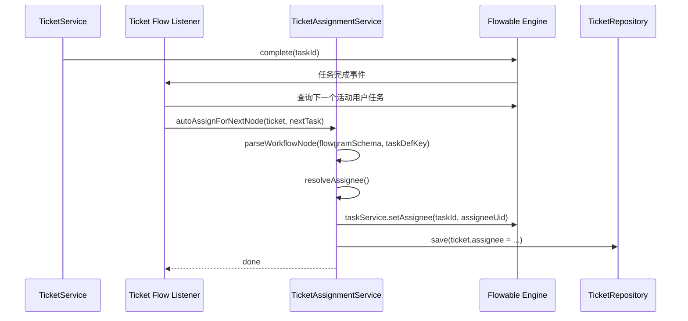

# 工单工作流自动分配处理人 — 规划文档

> 日期：2026-07-28
> 状态：**已实施（阶段 B/D 全部完成；C 已交付可用的基础 UI；E 部分完成）**
> 最后校核：2026-07-29
> 关联 TODO：[TODO-2026.md](../../TODO-2026.md) 第 38 行

---

## 1. 概述

目标是让工单流程在“创建时”和“流转到下一处理节点时”都能根据配置自动确定处理人，并把结果同步到：

- Flowable 当前任务 assignee
- `TicketEntity.assignee`
- 必要的通知与审计记录

需要先明确一个关键事实：用户原始诉求中提到了 `WorkflowEntity`，但当前工单模块真正运行时使用的并不是 `modules/core` 下的 `WorkflowEntity`，而是 `modules/ticket` 下的 `ProcessEntity.schema/flowgramSchema`，前端对应的是 `TicketBuilder`。因此本次规划首期应以 **`TicketBuilder + ProcessEntity + Flowable`** 为主线实现自动分配；`WorkflowEntity` 仅作为后续是否统一工作流模型的扩展议题，不纳入首期落地范围。

**核心场景：**

1. 管理员在 `TicketBuilder` 画布上为审批/会签/或签节点配置处理人规则（指定人/部门/角色/上报人直属领导等）
2. 工单创建后，系统根据工作流节点的配置 + `TicketBasicSettings.assignmentMode` 策略，自动分配处理人
3. 当工单流转到下一个审批节点时，系统自动解析新节点的处理人规则并分配

---

## 1.1 范围校准

### 本期纳入范围

- `TicketBuilder` 中审批类节点的处理人配置
- `ProcessEntity.flowgramSchema` 解析与 Flowable 任务分配
- `TicketSettingsEntity.basicSettings.assignmentMode` 的回退策略
- 工单创建、认领、指派、转派、节点推进后的自动分配

### 本期不纳入范围

- `modules/core.workflow.WorkflowEntity` 与工单流程引擎做统一改造
- 新建一套通用规则引擎替代当前 Ticket 流程模型
- 一次性实现全部高级分配算法与 AI 智能分配

### 结论

首版应优先补齐“当前模型下可真实落地的自动分配闭环”，而不是同时改造两套工作流模型。

---

## 2. 现状分析

### 2.1 已有的能力

| 能力 | 状态 | 位置 |
| ------ | ------ | ------ |
| 工作流节点级分配配置（`assigneeType`, `assigneeUids`） | ✅ 已支持（前端 UI + 后端解析） | `TicketBuilder` PropertyDrawer + `TicketAssignmentService.resolveFromWorkflowNode()` |
| 全局回退策略（`assignmentMode`） | ✅ 已支持 | `TicketBasicSettingsEntity.assignmentMode` |
| 创建时自动分配 | ✅ 已实现 | `TicketEventListener.handleTicketCreateEvent()` → `autoAssign()` |
| 手动认领/指派/转派 | ✅ 已实现 | `TicketService.executeWorkflowAction()` |
| 轮询分配（ROUND_ROBIN） | ✅ 已实现 | `TicketAssignmentService.roundRobinAssign()` |
| 最少活跃分配（LEAST_ACTIVE） | ✅ 已实现 | `TicketAssignmentService.leastActiveAssign()` |
| 随机分配（RANDOM） | ✅ 已实现 | `TicketAssignmentService.randomAssign()` |
| TicketBuilder 属性面板已支持 assigneeType 基础编辑 | ✅ 已实现 | `frontend/apps/workflow/src/pages/Dashboard/TicketBuilder/components/PropertyDrawer.tsx` |
| TicketSettings 全局分配方式配置 | ✅ 已有基础入口 | `frontend/apps/admin/src/pages/Dashboard/Ticket/Settings/components/TicketBasicSettings.tsx` 已包含 `assignmentMode` 下拉框 |

### 2.2 待补齐的能力

| 能力 | 状态 | 说明 |
| ------ | ------ | ------ |
| 节点流转时自动重新分配 | ✅ 已实现 | `TicketService.completeWorkflowTask()` → `autoAssignForNextNode()` |
| 角色分配（assigneeType=role） | ✅ 已实现 | `resolveRoleMember()` + `TicketUserOrgRoleRepository` JPQL 批量查询 |
| 直属领导分配（assigneeType=leader） | ✅ 已实现（E 阶段） | `MemberEntity.managerMemberUid` + `resolveLeader()` |
| TicketSettings 级分配策略配置说明 | ✅ 已校准 | 已更新说明文案为"全局回退策略" |
| TicketBuilder 缺少真实成员/角色/部门选择器 | ⚠️ 部分改进 | `roleUid` 输入框 + `assignmentMode` 下拉已添加；成员/部门选择器仍为 tags 输入 |
| 分配日志/审计 | ✅ 已实现 | `TicketAssignmentLogEntity` + REST API + 前端 Timeline Tab |

---

## 3. 需求拆解

### 3.1 阶段 A：MVP 范围收敛

首版先只做“当前代码基线能稳定落地”的能力，避免把高级算法、AI 分配、组织模型改造一次性混在同一轮需求里。

#### A1. 首版必须支持的处理人来源

- `assigneeType=user`：从节点配置中指定具体成员
- `assigneeType=department`：从部门成员中按策略挑选
- `assigneeType=role`：从角色成员中按策略挑选
- `assigneeType=reporter`：直接回填上报人

#### A2. 首版暂缓的处理人来源 → 已在 E 阶段实现

- ~~`assigneeType=leader`~~ → **已实现**：`MemberEntity.managerMemberUid` + `resolveLeader()`，若未配置则回退全局策略

#### A3. 首版必须支持的分配策略

- `MANUAL`
- `ROUND_ROBIN`
- `LEAST_ACTIVE`
- `RANDOM`

这 4 种已经与现有代码结构最贴近，应优先形成完整闭环。

#### A4. 二期再考虑的高级策略 → 已在 E 阶段部分实现

- ~~`WEIGHTED_RANDOM`~~ — 未实现（需权重数据模型）
- ✅ `CONSISTENT_HASH` — 已实现：`abs(ticketUid.hashCode()) % N`
- ~~`FASTEST_RESPONSE`~~ — 未实现（需 SLA 响应时间数据）
- ~~`BROADCAST`~~ — 未实现（需多处理人支持）
- ✅ `RECENT` — 已实现：最近活跃成员优先
- ~~`LLM`~~ — 未实现（需 AI 集成）

### 3.2 阶段 B：补齐基础自动分配闭环（后端）

#### B1. 创建时自动分配

- 保持现有 `TicketEventListener.handleTicketCreateEvent()` → `TicketAssignmentService.autoAssign()` 主链路
- 补齐 `role` 场景的真实解析
- 明确当节点配置和全局策略都无法给出结果时，保留 `MANUAL` 行为并进入待认领状态

#### B2. 流转到下一审批节点时自动重新分配

- 当前节点完成后，查找新的 active user task
- 根据新的 `taskDefinitionKey` 从 `flowgramSchema` 中解析节点配置
- 自动写入 Flowable assignee 与 `TicketEntity.assignee`
- 必要时发送通知

#### B3. 明确候选池解析顺序

1. 节点显式指定成员
2. 节点指定角色后解析角色成员
3. 节点指定部门后解析部门成员
4. `reporter`
5. 无结果时回退全局 `assignmentMode`
6. 仍无结果则保持人工认领

### 3.3 阶段 C：前端配置补全

#### C1. TicketBuilder 节点配置改为真实实体选择

- 成员选择器：写入 `assigneeUids`，同步展示 `assigneeNames`
- 部门选择器：至少支持写入 `departmentUid` 或明确沿用 `ticket.departmentUid`
- 角色选择器：写入 `roleUid`
- `leader` 先保留 UI 文案，但在功能上标记为未启用，或在首版隐藏

#### C2. 节点级分配策略覆盖

在审批类节点 `data` 中新增 `assignmentMode`，支持：

- 继承全局
- ROUND_ROBIN
- LEAST_ACTIVE
- RANDOM
- MANUAL

#### C3. 管理后台配置入口

工单设置页已存在全局分配策略入口，真实路径为：

- 页面入口：`frontend/apps/admin/src/pages/Dashboard/Ticket/Settings/index.tsx`
- 基础设置组件：`frontend/apps/admin/src/pages/Dashboard/Ticket/Settings/components/TicketBasicSettings.tsx`

首版需要做的不是新建入口，而是校准：

- 确认 `assignmentMode` 保存、发布、草稿同步链路稳定
- 在说明文案中明确它是“节点配置无法确定处理人时的全局回退策略”
- 与 TicketBuilder 节点级 `assignmentMode=inherit` 的语义保持一致

### 3.4 阶段 D：审计与可观测性

- 记录自动分配、手动认领、手动指派、转派
- 记录分配来源：节点配置 / 全局策略 / 人工操作
- 记录旧处理人与新处理人
- 记录 taskDefinitionKey，方便追溯到具体流程节点
- 推荐为首次分配（创建时）也记录一条 `fromAssignee=null` 的日志，保证每条工单至少有一条初始分配记录

### 3.5 阶段 E：二期增强能力

- 高级分配策略：WEIGHTED_RANDOM / CONSISTENT_HASH / FASTEST_RESPONSE / BROADCAST / RECENT / LLM
- `leader` 类型支持
- 工作组候选池
- 更丰富的负载因子、技能标签和 SLA 参与分配

---

### 3.6 组织模型补充议题：leader 如何定义 → ✅ 已实现

已在 E 阶段落地方案 1：

1. ✅ 在 `MemberEntity` 增加 `managerMemberUid`
2. ⬜ 在 `DepartmentEntity` 增加 `ownerMemberUid` / `leaderMemberUid`（待后续扩展）

回退规则：

- ✅ 上报人直属领导（`managerMemberUid`）
- ⬜ 若无直属领导，则部门负责人（需 `DepartmentEntity.ownerMemberUid`）
- ✅ 若仍无，则退回全局策略或 MANUAL

---

### 3.7 角色分配（后端）

#### 3.7.1 角色候选池解析（assigneeType=role）

```java
case "role" -> resolveRoleMember(roleUid, ticket.getOrgUid());
```

- 根据流程节点配置的 `roleUid`，查询拥有该角色的组织成员
- 再对角色成员应用 `assignmentMode` 策略选出具体处理人

实现时需要注意：`MemberEntity` 本身不直接保存角色字段。当前角色主数据挂在 `UserEntity` / `UserOrganizationRoleEntity` 上，而 `MemberEntity` 通过 `user` 关联到用户。因此角色候选池建议按以下链路解析：

1. 查询当前组织下未删除成员：`MemberRepository` 按 `orgUid + deleted=false` 增加查询方法，或复用 Specification
2. 对每个 `MemberEntity.user` 读取该组织维度的角色：优先 `user.userOrganizationRoles` 中 `organization.uid == orgUid` 的 `roles`
3. 若组织角色关系未加载或为空，再回退 `user.currentRoles` / `user.getRoleUids()`
4. 命中 `roleUid` 的成员组成候选池，再进入 ROUND_ROBIN / LEAST_ACTIVE / RANDOM / MANUAL 策略

这段逻辑应封装为独立方法，例如：

```java
private List<MemberEntity> resolveRoleCandidates(String roleUid, String orgUid) {
   // 1. 获取 orgUid 下所有未删除成员
   // 2. 对每个 MemberEntity.user，遍历 user.userOrganizationRoles
   // 3. 筛选出 organization.uid == orgUid 且 roles 包含 roleUid 的成员
   // 4. 若 userOrganizationRoles 为空，回退 user.currentRoles / user.getRoleUids()
}
```

性能注意：如果组织成员较多，遍历所有成员解析角色候选池效率较低。首版可通过以下方式缓解：

- 先批量查询所有拥有该角色的 UserOrganizationRoleEntity，再回查 MemberEntity
- 或增加专用 Repository 查询方法
MVP 阶段可接受简单遍历（工单创建不是高频操作）。

---

### 3.8 节点流转时自动重新分配（后端）

当前仅在工单创建时调用一次 `autoAssign()`。需要支持：

#### C1. 任务完成回调触发

在 Flowable 任务完成事件中监听，当前节点完成后：

1. 查找下一个任务节点（审批/会签/或签）
2. 解析该节点的 `assigneeType` / `assigneeUids` / `assignmentMode`
3. 调用 `autoAssign()` 为下一节点分配处理人
4. 发送通知给新处理人

#### C2. 实现方案

优先建议使用 **Flowable 全局事件监听** 或在现有 Ticket 任务完成主链路中集中触发，避免为每个 BPMN userTask 额外挂 `taskListener` 造成 BPMN 生成与维护复杂度上升。

可选方案 A：在 `TicketService.completeWorkflowTask()` 完成后集中调用“为下一节点自动分配”逻辑。

可选方案 B：新增统一事件监听器处理 `TASK_COMPLETED`。

示意：

```java
@EventListener
public void onTaskCompleted(FlowableTaskCompletedEvent event) {
    String processInstanceId = event.getProcessInstanceId();
    String taskDefinitionKey = event.getTaskDefinitionKey();
    // ... trigger auto-assign for the next active task
}
```

#### C2-bis. BPMN taskDefinitionKey 与 flowgram nodeId 的映射

关键前提：`convertToBpmnXml()` 在生成 BPMN XML 时，`userTask` 的 `id` 属性必须使用与 `flowgramSchema` 中相同的 node id。如果当前转换逻辑中 id 不一致（例如 BPMN 使用 `sid-xxx` 前缀而 flowgram 使用原始 id），则 `parseTaskNode(flowgramSchema, taskDefinitionKey)` 将无法匹配。**首版需要确保这个映射关系稳定，否则流转分配将失败。**

#### C3. 节点级 assignmentMode 覆盖

在审批节点的 `data` 中新增 `assignmentMode` 字段：

```typescript
type ApprovalNodeData = {
  // ... existing fields
  /** 节点级分配策略，覆盖全局 TicketBasicSettings.assignmentMode */
  assignmentMode?: TicketAssignmentMode; // 为空则使用全局策略
};
```

这样不同节点可以使用不同分配策略（如创建节点用 ROUND_ROBIN，审批节点用 LEAST_ACTIVE）。

默认值建议：`assignmentMode` 为空字符串 `""` 或未定义时，视为"继承全局"。不要使用 `"INHERIT"` 等需要后端枚举扩展的值——这会增加不必要的同步成本。

---

### 3.9 管理后台配置 UI（前端 admin）

#### D1. TicketSettings 中 assignmentMode 配置

`TicketSettings` 基础设置中已经有"工单分配方式"配置区，首版只需复用并校准：

| 配置项 | 类型 | 说明 |
| -------- | ------ | ------ |
| 分配模式（`assignmentMode`） | 下拉选择 | MANUAL / ROUND_ROBIN / LEAST_ACTIVE / RANDOM |
| 默认回退行为 | 只读说明或帮助文案 | 当节点配置无法确定处理人时，按全局策略回退 |

二期如果引入高级策略，再补充：

- 候选人范围
- 权重配置
- LLM 提示词

**需要新增/修改的文件：**

- `frontend/apps/admin/src/pages/Dashboard/Ticket/Settings/components/TicketBasicSettings.tsx` — 校准分配方式说明文案，必要时增加“作为节点配置失败后的回退策略”提示
- `frontend/apps/admin/src/locales/zh-CN/ticket.ts` — 国际化
- 首版后端无需先增加复杂策略字段；如只支持现有 4 种策略，可先复用 `TicketBasicSettingsEntity.assignmentMode`

#### D2. TicketBuilder 中节点级分配策略配置

在审批/会签/或签节点的 PropertyDrawer 中新增：

- **分配策略下拉框**：继承全局 / ROUND_ROBIN / LEAST_ACTIVE / RANDOM / ...
- **当 assigneeType=role 时**：角色选择器（现有 `roleUid` 字段基础上完善 UI）
- **当 assigneeType=leader 时**：提示"系统将自动查找上报人的直属领导"

**需要新增/修改的文件：**

- `frontend/apps/workflow/src/pages/Dashboard/TicketBuilder/components/PropertyDrawer.tsx` — 节点属性面板
- `frontend/apps/workflow/src/pages/Dashboard/TicketBuilder/config/nodes/` — 节点默认值

---

### 3.10 分配日志与审计

#### E1. 新增 `TicketAssignmentLogEntity`

```java
@Entity
@Table(name = "bytedesk_ticket_assignment_log")
public class TicketAssignmentLogEntity extends BaseEntity {
    private String ticketUid;          // 工单 UID
    private String processInstanceId;  // Flowable 流程实例 ID
    private String taskDefinitionKey;  // 当前任务节点 key
    private String fromAssignee;       // 原处理人（JSON）
    private String toAssignee;         // 新处理人（JSON）
    private String assignmentType;     // AUTO_WORKFLOW / AUTO_STRATEGY / MANUAL_CLAIM / MANUAL_ASSIGN / TRANSFER
    private String strategy;           // 分配策略名称
    private String reason;             // 分配原因/备注
}
```

每次 `applyAssignment()` 时记录一条日志。

#### E2. 管理后台分配日志查询

在工单详情页新增"分配记录"Tab，展示工单的分配历史时间线。

---

## 4. 实现计划

### 4.1 分阶段执行

| 阶段 | 内容 | 预估工时 | 优先级 | 状态 |
| ------ | ------ | ---------- | -------- | ------ |
| **A** | MVP 范围收敛与数据口径确认 | 0.5d | P0 | ✅ |
| **B** | 基础自动分配闭环：创建 + 流转 + role 支持 | 2.5d | P0 | ✅ |
| **C** | 前端配置补全：TicketBuilder + TicketSettings | 2.0d | P0 | ✅ (基础 UI，真实选择器延后) |
| **D** | 分配日志与通知联动 | 1.5d | P1 | ✅ |
| **E** | 二期高级策略与 leader 模型 | 3.0d~5.0d | P2 | ✅ (部分: CONSISTENT_HASH/RECENT/leader 已实现) |
| **合计（首版）** | | **~6.5d** | | **已完成** |

### 4.2 详细任务清单

#### 阶段 A：范围收敛

- [x] A1: 明确本期以 `ProcessEntity.flowgramSchema` 为唯一运行时流程源
- [x] A2: 明确 `WorkflowEntity` 不进入本轮实现范围，仅在文档中保留后续统一模型议题
- [x] A3: 明确首版仅承诺 4 种基础策略 + 4 种处理人来源（不含 leader）→ 实际实施中 E 阶段追加了 leader 支持

#### 阶段 B：基础自动分配闭环

- [ ] B1: `TicketAssignmentService` — 补齐 `role` 类型处理逻辑
- [ ] B2: `TicketAssignmentService` — 抽出“解析候选池 + 应用策略”的统一方法
- [ ] B3: `TicketAssignmentService` — 支持在下一 active task 出现时重新自动分配
- [ ] B4: `TicketService` 或统一事件监听中串起“任务完成 -> 下一节点自动分配”
- [ ] B5: 明确当无法确定处理人时的保底行为：保留待认领，不误写 assignee

#### 阶段 C：前端配置补全

- [x] C1: `TicketBuilder` 属性面板增加真实成员/角色选择器 → 当前为 tags 输入/手工 UID 输入，真实选择器延后
- [x] C2: `ApprovalNodeData` 新增 `assignmentMode`
- [x] C3: `TicketSettings` 页面复用现有 `assignmentMode` 配置，并校准说明文案与发布链路
- [ ] C4: 补齐多语言文案

#### 阶段 D：日志与通知

- [ ] D1: 新建 `TicketAssignmentLogEntity` + Repository
- [ ] D2: `applyAssignment()` 中写审计日志
- [ ] D3: 自动分配成功后补通知

#### 阶段 E：二期增强

- [x] E1: 评估并实现高级策略 — CONSISTENT_HASH、RECENT 已实现（WEIGHTED_RANDOM/FASTEST_RESPONSE/BROADCAST/LLM 保持暂缓）
- [x] E2: 设计 leader 组织关系模型并落地 — `MemberEntity.managerMemberUid` + `resolveLeader()`
- [x] E3: 工单详情页增加"分配记录"Tab — 已在 D 阶段完成（`TicketAssignmentLog.tsx` Timeline 组件）

---

## 5. 技术要点

### 5.1 候选成员来源

分配策略需要明确候选成员池：

1. **节点级配置的 `assigneeUids`**（精确指定）
2. **部门成员**（`ticket.departmentUid`）
3. **角色成员**（`roleUid`，通过 `MemberEntity.user.userOrganizationRoles.roles` 解析）
4. **人工认领**（保底）

说明：当前 `TicketAssignmentService.getCandidates()` 主要基于 `departmentUid`，角色候选池也需要本轮补齐；工作组和组织全员作为首版候选池并未真正打通，不应在首版文档里默认承诺。

### 5.2 节点流转时 Flowable 集成



### 5.3 回退链

```text
节点级 assigneeUids（精确）
  → 节点级 assigneeType + assignmentMode
    → 全局 TicketBasicSettings.assignmentMode
      → MANUAL（不分配，等待人工认领）
```

建议补充一个实现约束：如果 `assigneeType=user` 但节点只保存了 `assigneeNames`、没有有效的 `assigneeUids`，后端必须视为“未配置完成”，不能按名字字符串做分配。

### 5.4 leader 支持前置条件 → ✅ 已实现

- ✅ `MemberEntity.managerMemberUid` — 新增字段，指向直属领导
- ⬜ `DepartmentEntity.leaderMemberUid` — 部门负责人回退，待后续扩展
- 实现：`resolveLeader()` 优先查 `managerMemberUid`，未配置则回退全局策略

### 5.5 二期 LLM 分配提示词模板

```text
你是一个工单分配助手。根据以下信息，从候选人中选择最合适的处理人：

工单标题：{title}
工单描述：{description}
工单分类：{categoryName}
工单优先级：{priority}
上报人：{reporterName}

候选人列表：
{候选人 JSON：uid, name, skills, activeTicketCount, avgResponseTime, department}

请返回最合适的候选人 UID，以及分配理由（一句话）。
```

### 5.6 首版验收标准

首版完成后至少应满足以下行为：

1. **创建时自动分配**：新建工单后，如果当前流程第一个可处理节点配置了有效处理人或可解析候选池，则 `TicketEntity.assignee` 与 Flowable 当前任务 assignee 一致。
2. **流转时重新分配**：完成当前任务后，如果流程进入下一个审批类节点，系统会重新解析该节点配置并更新处理人。
3. **指定成员分配**：节点配置 `assigneeType=user` 且 `assigneeUids` 有效时，优先使用节点指定成员。
4. **部门策略分配**：节点配置 `assigneeType=department` 时，从 `ticket.departmentUid` 对应成员中按节点级或全局策略选择处理人。
5. **角色策略分配**：节点配置 `assigneeType=role` 时，从当前组织中拥有该角色的成员中按策略选择处理人。
6. **人工保底**：任何配置不完整、候选人为空、策略无法返回结果的情况，都不能写入错误 assignee，应保持待认领。
7. **草稿兼容**：旧流程没有 `assignmentMode`、`roleUid` 等新增字段时仍能正常保存、部署和执行。
8. **审计可查**：自动分配、认领、指派、转派至少能在日志中追溯来源、旧处理人、新处理人与流程节点。

### 5.7 验证方式

建议按从窄到宽验证：

1. 后端单元/集成测试：覆盖 `TicketAssignmentService` 的 user / department / role / reporter / manual fallback。
2. 后端模块编译：

```bash
env JAVA_HOME=/Users/ningjinpeng/.jdk/jdk-21.0.8/jdk-21.0.8+9/Contents/Home ./starter/mvnw -f pom.xml -pl modules/ticket -am -DskipTests compile
```

1. 前端类型检查或构建：优先运行 workflow/admin 对应 workspace 的窄构建或 lint。
2. 手工联调：创建一个含两个审批节点的流程，分别配置不同处理人来源，验证创建时与节点流转时 assignee 是否变化。

### 5.8 核心数据结构：AssignmentResolutionResult

让分配过程可解释、可审计，建议先抽出以下结构：

```java
public record AssignmentResolutionResult(
    String assigneeUid,           // 最终处理人 UID（null 表示无法确定）
    AssignmentSource source,      // NODE_CONFIG / GLOBAL_STRATEGY / MANUAL / REPORTER
    String strategy,              // ROUND_ROBIN / LEAST_ACTIVE / RANDOM / MANUAL
    String reason,                // 可读原因（如 "节点审批指定用户" / "全局轮询策略"）
    String candidatePoolDescription // 候选池摘要（如 "部门 3 人" / "角色 2 人"）
) {}

enum AssignmentSource { NODE_CONFIG, GLOBAL_STRATEGY, MANUAL, REPORTER }
```

`TicketAssignmentService.autoAssign()` 和新增的流转分配方法都应返回此结果，调用方据此决定是否写 assignee、写日志、发通知。

### 5.9 推荐实现顺序

1. 后端先抽出 `AssignmentResolutionResult`，让分配过程可解释。
2. 补齐角色候选池解析，但先不动组织 leader 模型。
3. 验证 BPMN taskDefinitionKey 与 flowgram nodeId 的映射，必要时修复 `convertToBpmnXml`。
4. 增加下一 active task 自动分配入口，并保证所有任务完成路径都能触发。
5. 前端再补真实成员/角色选择器和节点级 `assignmentMode`。
6. 最后补分配日志与通知，避免审计表结构反复调整。

---

### 新增文件清单（实际实施）

| 文件 | 阶段 | 说明 |
| ------ | ------ | ------ |
| `modules/ticket/.../assignment/AssignmentResolutionResult.java` | B | 结构化分配结果 record |
| `modules/ticket/.../assignment/AssignmentSource.java` | B | 分配来源枚举 |
| `modules/ticket/.../assignment/TicketAssignmentLogEntity.java` | D | 分配审计日志实体 |
| `modules/ticket/.../assignment/TicketAssignmentLogRepository.java` | D | 日志 JPA Repository |
| `modules/ticket/.../assignment/TicketUserOrgRoleRepository.java` | B | 角色-成员 JPQL 批量查询 |
| `starter/.../db/changelog/migration/260728_add_ticket_assignment_log.xml` | D | 日志表 + 索引 |
| `starter/.../db/changelog/migration/260728_add_member_manager_uid.xml` | E | managerMemberUid 列 + 索引 |
| `frontend/apps/admin/.../TicketAssignmentLog.tsx` | D | 分配记录 Timeline 组件 |

### 修改文件清单（实际实施）

| 文件 | 阶段 | 说明 |
| ------ | ------ | ------ |
| `modules/ticket/.../TicketAssignmentService.java` | B/D/E | role/leader/流转分配、策略、通知、日志 |
| `modules/ticket/.../TicketService.java` | B/D | 流转触发 + 手动分配日志 |
| `modules/ticket/.../TicketRestController.java` | D | 分配日志查询 API |
| `modules/core/.../MemberEntity.java` | E | 新增 `managerMemberUid` |
| `starter/.../db/changelog/master.xml` | D/E | 注册 2 个新 migration |
| `frontend/apps/workflow/.../types.ts` | C | `ApprovalNodeData.assignmentMode` |
| `frontend/apps/workflow/.../config/nodes/approval.ts` | C | 默认值 `assignmentMode: ''` |
| `frontend/apps/workflow/.../config/nodes/countersign.ts` | C | 同上 |
| `frontend/apps/workflow/.../config/nodes/orSign.ts` | C | 同上 |
| `frontend/apps/workflow/.../PropertyDrawer.tsx` | C/E | 分配策略下拉 + roleUid 输入 |
| `frontend/apps/admin/.../TicketBasicSettings.tsx` | C/E | 全局策略下拉 + 文案校准 |
| `frontend/apps/admin/.../TicketTabs.tsx` | D | 新增"分配记录"Tab |
| `frontend/apps/admin/src/locales/zh-CN/ticket.ts` | C/D | 新增 locale keys |
| `frontend/apps/admin/src/locales/en-US/ticket.ts` | C/D | 同上 |
| `frontend/apps/admin/src/locales/ja-JP/ticket.ts` | D | 同上 |
| `frontend/apps/workflow/src/locales/zh-CN/ticket.ts` | C/E | 同上 |
| `frontend/apps/workflow/src/locales/en-US/ticket.ts` | C/E | 同上 |
| `frontend/apps/workflow/src/locales/zh-TW/ticket.ts` | C/E | 同上 |

---

## 6. 需要新增/修改的文件清单（原始规划）

### 后端

| 文件 | 操作 | 说明 |
| ------ | ------ | ------ |
| `modules/ticket/.../assignment/TicketAssignmentService.java` | 修改 | 补齐 role 分配、统一候选池解析、创建/流转自动分配 |
| `modules/ticket/.../ticket/TicketService.java` | 修改 | 任务完成后触发下一节点自动分配 |
| `modules/ticket/.../ticket/TicketEventListener.java` | 评估是否修改 | 继续承接创建时自动分配 |
| `modules/ticket/.../ticket/assignment/TicketAssignmentLogEntity.java` | **新增** | 分配日志实体 |
| `modules/ticket/.../ticket/assignment/TicketAssignmentLogRepository.java` | **新增** | 日志 Repository |
| `modules/ticket/.../ticket_settings_basic/TicketBasicSettingsEntity.java` | 可能不改或小改 | 首版优先复用现有 `assignmentMode` |
| `modules/core/.../member/MemberRepository.java` | 可能修改 | 增加按 orgUid 查询未删除成员的方法，用于角色候选池解析 |
| `modules/ticket/.../process/listener/TicketTaskCompletedEventListener.java` | **可选新增** | 统一任务完成事件监听 |
| `starter/.../db/liquibase/changelog/` | 新增 changelog | 新增表 + 字段 |

### 前端

| 文件 | 操作 | 说明 |
| ------ | ------ | ------ |
| `frontend/apps/workflow/.../TicketBuilder/types.ts` | 修改 | ApprovalNodeData 新增 assignmentMode |
| `frontend/apps/workflow/.../TicketBuilder/config/nodes/approval.ts` | 修改 | 默认值新增 assignmentMode |
| `frontend/apps/workflow/.../TicketBuilder/config/nodes/countersign.ts` | 修改 | 同上 |
| `frontend/apps/workflow/.../TicketBuilder/config/nodes/orSign.ts` | 修改 | 同上 |
| `frontend/apps/workflow/.../TicketBuilder/components/PropertyDrawer.tsx` | 修改 | 新增分配策略选择 + 真实选择器 |
| `frontend/apps/admin/src/pages/Dashboard/Ticket/Settings/components/TicketBasicSettings.tsx` | 修改 | 复用现有 `assignmentMode` 下拉框，校准说明文案 |
| `frontend/apps/admin/src/pages/Dashboard/Ticket/` | 修改 | 工单详情新增分配记录 Tab |
| 各 `locales/` 文件 | 修改 | 国际化 |

---

## 7. 风险与注意事项

1. **WorkflowEntity 与 ProcessEntity 不是一套模型**：如果不先澄清边界，后续实现很容易一边改 `TicketBuilder`，一边误改 `modules/core.workflow`，导致范围失控。

2. **leader 无现成主数据**：当前没有现成“直属领导”字段，若直接承诺 leader 自动分配，实施时会演变为组织模型改造。

3. **前端当前保存的是展示名优先，不是实体 UID 优先**：如果不先把节点配置改成真实实体选择器，后端很难稳定完成自动分配。

4. **角色分配不能按 Member 直接查角色**：角色挂在 User / UserOrganizationRole 上，首版需要把候选池解析封装好，避免散落在业务代码中。

5. **Flowable 触发点选择**：若采用 BPMN taskListener，需要同步修改 BPMN 生成逻辑；若采用服务层集中触发，则实现更简单但要注意所有完成路径都要覆盖到。

6. **向后兼容**：新增字段都应有默认值，旧流程在没有 assignmentMode、roleUid 等字段时仍应保持原有人工认领逻辑。

---

## 8. 讨论点

- [x] 本期是否确认仅基于 `ProcessEntity + TicketBuilder` 落地，而不改 `WorkflowEntity`？答：是的
- [x] `leader` 是否明确延后到组织模型补齐之后再做？答：**已在 E 阶段实现**：`MemberEntity.managerMemberUid` + `resolveLeader()`
- [x] 节点级 `assignmentMode` 是否支持"继承全局"作为默认值？ 答：是的
- [x] 首版是否只交付 4 种基础策略，把高级策略全部放到二期？答：**已扩展为 6 种**（B 阶段 4 种 + E 阶段 CONSISTENT_HASH、RECENT）
- [x] 工单候选池首版是否只支持"指定成员 / 角色成员 / 部门成员"，暂不引入工作组候选池？ 答：是的

---

> **实施完成时间**：2026-07-28
> **实际交付**：阶段 B/D 全部完成，阶段 C 已交付 assignmentMode 下拉 + roleUid 输入框等基础 UI，阶段 E 完成 CONSISTENT_HASH、RECENT 策略及 leader 支持
>
> **待后续迭代**：WEIGHTED_RANDOM、FASTEST_RESPONSE、BROADCAST、LLM 策略；真实实体选择器（成员/部门/角色）替代当前 tags 输入 / 手工 UID 输入；DepartmentEntity.ownerMemberUid
>
> **当前前端选择器现状（2026-07-29 校核）**：
>
> - `assigneeNames`：使用 `<Select mode="tags">`，写入的是展示名而非 UID
> - `roleUid`：使用 `<Input>`，需手工输入角色 UID
> - `departmentUid`：未在 PropertyDrawer 中独立配置，依赖 `ticket.departmentUid`
> - 上述三项在"真实实体选择器"专项中统一升级为远程搜索选择器
